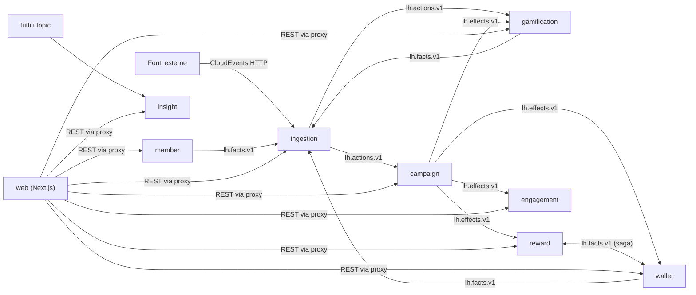

# Loyalty Hub

Piattaforma loyalty **open source**, vendor neutral ed **event-driven**: azioni premianti da fonti eterogenee → regole → punti, tier, premi, concorsi instant win, obiettivi e badge. Microservizi **Spring Boot** su **Kafka**, backoffice e portale membri in **Next.js**.

> Stato: PoC in costruzione. Le specifiche in [`docs/`](docs/00-INDICE.md) sono la fonte di verità.

## Cosa fa

- **Ingresso multi-fonte**: qualunque sistema invia azioni come CloudEvents; anche le azioni interne (vincite, salti di tier, badge) rientrano dallo stesso topic.
- **Motore a campagne**: trigger + pubblico + condizioni + effetti + limiti, con simulazione e spiegazione ("perché non ho preso punti?").
- **Doppia valuta**: punti premio (spendibili) e punti status (tier annuali con discesa morbida).
- **Premi a fasce**, coupon, richieste premio con saga su Kafka.
- **Instant win** a istanti vincenti pre-generati, obiettivi, badge, classifiche, referral.
- **Backoffice unico** che fa anche da CMS (card, pop-up, messaggi, tema del portale) con workflow di approvazione.
- **Osservabilità di prodotto**: flusso eventi live, tracciato end-to-end di ogni azione, KPI, audit, DLQ.

## Avvio rapido (locale)

```bash
docker compose -f deploy/docker-compose.yml --profile all up --build
# backoffice e portale: http://localhost:3000   •   Kafka UI: http://localhost:8090
```

Nessun login: scegli una persona (ruolo backoffice o membro) dalla pagina iniziale. I dati sono fittizi (brand demo "Club Aurora") e ripristinabili con un clic.

## Demo a costo zero

Vercel (web) + Render free (8 servizi) + Neon free (Postgres) + Aiven free (Kafka). I servizi dormono quando nessuno guarda: la pagina iniziale li sveglia. Dettagli in [`docs/11-DEPLOY-COSTO-ZERO.md`](docs/11-DEPLOY-COSTO-ZERO.md).

## Architettura in una figura



## Licenza

Apache-2.0 (proposta, vedi `docs/15-DOMANDE-APERTE.md`).

## Da dove si parte
Le specifiche complete sono in [`docs/`](docs/00-INDICE.md). Per avviare lo sviluppo con Claude Code: [`COME-PARTIRE.md`](COME-PARTIRE.md).
