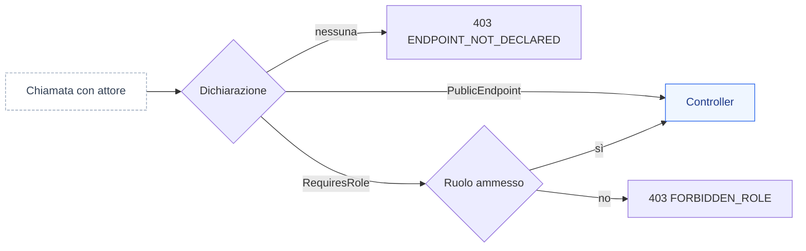
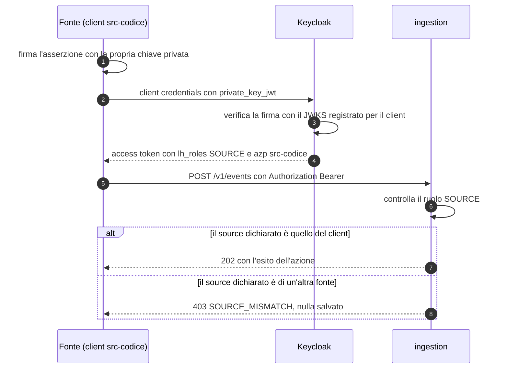
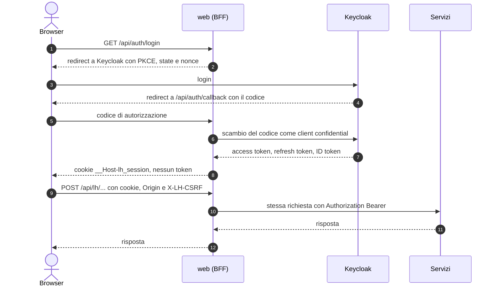
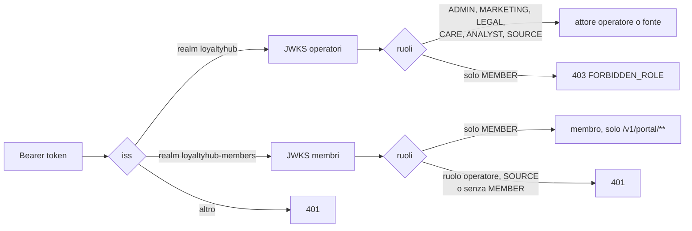

Loyalty Hub usa un modello di autenticazione demo semplice basato sull'header HTTP `X-LH-Actor`. Ogni chiamata identifica l'attore (username) che la esegue. Il servizio ricava il ruolo dalla persona e applica il controllo di autorizzazione sull'endpoint.

## Header richiesto

Aggiungi l'header a ogni richiesta ai servizi di backoffice.

```bash
curl http://localhost:8083/backoffice/campaigns \
  -H "X-LH-Actor: luca.marketing"
```

> **Nota:** gli endpoint del portale cliente (`/portal/...`) accettano richieste senza header in modalità demo. L'ingresso delle azioni (`POST /v1/events`, `POST /v1/events/batch`, `POST /v1/transactions`) no: vuole l'identità di una fonte (vedi [Fonti di ingestion](#fonti-di-ingestion-il-ruolo-source)). In produzione tutti i canali richiedono un token OIDC.

## Personas disponibili

Il seed dell'ambiente demo carica cinque personas con ruoli diversi.

| Username | Ruolo | Descrizione |
| --- | --- | --- |
| `marta.admin` | ADMIN | Accesso completo a ogni servizio e a operazioni distruttive. |
| `luca.marketing` | MARKETING | Crea e pubblica campagne, template e concorsi. |
| `elena.legal` | LEGAL | Approva contenuti e gestisce clausole di privacy. |
| `paolo.care` | CARE | Consulta clienti, crea aggiustamenti punti manuali. |
| `sara.analyst` | ANALYST | Legge KPI, esporta report, consulta DLQ. |

## Ruoli e permessi

Ogni endpoint dei servizi dichiara i ruoli ammessi. La tabella riassume le regole principali.

| Area | Endpoint | Ruoli ammessi |
| --- | --- | --- |
| Campagne | `POST /backoffice/campaigns` | ADMIN, MARKETING |
| Campagne | `POST /backoffice/campaigns/{id}/publish` | ADMIN, LEGAL |
| Wallet | `POST /backoffice/adjustments` | ADMIN, CARE |
| Reward | `POST /backoffice/rewards` | ADMIN, MARKETING |
| Engagement | `POST /backoffice/templates` | ADMIN, MARKETING, LEGAL |
| Insight | `GET /backoffice/kpi/**` | ADMIN, ANALYST |
| DLQ | `POST /backoffice/dlq/{id}/replay` | ADMIN |

## Deny by default: ogni endpoint dichiara chi può chiamarlo

Ogni endpoint dei servizi dichiara chi può chiamarlo. Così un endpoint nuovo non nasce aperto per dimenticanza: se la dichiarazione manca, il servizio rifiuta la chiamata a tutti, anche a `ADMIN`.

- **`@RequiresRole`** elenca i ruoli ammessi. Le letture elencano tutti i ruoli, `ANALYST` compreso: nel profilo `demo` una chiamata senza `X-LH-Actor` vale `ANALYST:anonymous` e legge come prima.
- **`@PublicEndpoint`** toglie il controllo di ruolo e porta sempre un motivo. Oggi nessun endpoint di produzione lo usa: un endpoint pubblico nuovo richiede una decisione (domanda o ADR) prima del codice. Nel profilo `enterprise` il token resta comunque obbligatorio.
- **Nessuna dichiarazione**: il servizio risponde `403` con `code` `ENDPOINT_NOT_DECLARED`. È un errore del codice, e la build lo blocca prima con un test ArchUnit.



Le regole complete sono nel paragrafo 3.2 di [Convenzioni backend](https://github.com/peppe-ruv/Loyalty_Sys/blob/main/docs/06-CONVENZIONI-BACKEND.md) su GitHub.

## Fonti di ingestion: il ruolo SOURCE

Una fonte è un sistema che invia azioni al programma, come un e-commerce o un CRM. Non è una persona: si autentica come **utenza di integrazione** con il ruolo `SOURCE`, e ogni fonte ha **un proprio client** e una propria chiave. Così il programma sa quale fonte ha inviato un'azione e può fermare una sola fonte senza toccare le altre.

- **Il client di una fonte si chiama `src-<codice>`.** La fonte `ecommerce` usa il client `src-ecommerce`.
- **`SOURCE` arriva solo all'ingresso.** Apre `POST /v1/events`, `POST /v1/events/batch` e `POST /v1/transactions`. Ogni altro endpoint risponde `403 FORBIDDEN_ROLE`, e `ADMIN` continua a passare ovunque.
- **Una fonte invia solo per sé.** Il `source` di ogni evento deve essere quello del proprio client. Se non lo è, il servizio risponde `403` con `code` `SOURCE_MISMATCH` e non salva né pubblica nulla. In un batch basta un elemento di un'altra fonte per respingere l'intera richiesta.



### Nel profilo demo

Non serve alcun login: dichiara la fonte con l'header `X-LH-Actor` nella forma `SOURCE:src-<codice>`.

```bash
# Invia un evento come la fonte ecommerce (profilo demo)
curl -X POST http://localhost:8081/v1/events \
  -H "Content-Type: application/cloudevents+json" \
  -H "X-LH-Actor: SOURCE:src-ecommerce" \
  -d @evento.json
```

<Warning>
Senza header, o con un ruolo diverso da `SOURCE` e `ADMIN`, l'ingresso risponde `403 FORBIDDEN_ROLE`. Se il `source` dell'evento non è quello del client, risponde `403 SOURCE_MISMATCH`.
</Warning>

### Nel profilo enterprise

L'header `X-LH-Actor` è ignorato: la fonte ottiene un access token con il flusso client credentials e lo invia come `Authorization: Bearer`. L'autenticazione del client è `private_key_jwt`: la fonte firma un'asserzione con la propria chiave privata, e nel realm è registrato solo il JWKS con la chiave pubblica. Nessuna chiave o segreto sta nel repository.

```bash
# 1. Ottieni un access token (sostituisci l'URL del realm e l'asserzione firmata dalla tua chiave privata)
TOKEN=$(curl -s -X POST "https://idp.example.org/realms/loyaltyhub/protocol/openid-connect/token" \
  -d "grant_type=client_credentials" \
  -d "client_id=src-ecommerce" \
  -d "client_assertion_type=urn:ietf:params:oauth:client-assertion-type:jwt-bearer" \
  -d "client_assertion=$CLIENT_ASSERTION" | jq -r .access_token)

# 2. Invia l'evento con il token
curl -X POST https://hub.example.org/v1/events \
  -H "Authorization: Bearer $TOKEN" \
  -H "Content-Type: application/cloudevents+json" \
  -d @evento.json
```

Ogni fonte del seed che arriva da HTTP ha già il suo client `src-<codice>` nel realm. Per una fonte che aggiungi dopo l'installazione, l'amministratore crea il client a mano: la procedura è in [Installazione enterprise](/operations/installazione-enterprise).

## Profilo enterprise: accesso dal browser con il BFF

Con `LH_PROFILE=enterprise` l'header `X-LH-Actor` non vale più: i servizi accettano solo un access token OIDC (`Authorization: Bearer`, audience `hub`). Portale e backoffice non vedono mai il token: il server web fa da **Backend-for-Frontend** (BFF), client confidential `web` del realm Keycloak.

- **Login**: `GET /api/auth/login?returnTo=/percorso` avvia Authorization Code con PKCE `S256`, `state` e `nonce`; `returnTo` vale solo come percorso della stessa origine.
- **Sessione**: il browser riceve solo il cookie opaco `__Host-lh_session` (`HttpOnly`, `Secure`, `SameSite=Lax`) e `__Host-lh_csrf`; token cifrati lato server, rinnovati in modo trasparente con il refresh token a rotazione.
- **Chiamate**: il browser chiama `/api/lh/<servizio>/v1/...`; il BFF aggiunge `Authorization: Bearer` e scarta ogni `Authorization`, `X-LH-Actor` o cookie arrivati dal browser. Il percorso arriva al servizio esattamente com'è stato chiesto (niente `..`, `%2F` o parametri `;`). Sulle API `/v1/portal/**` il membro viene solo dal token: una richiesta con un `memberId` scelto dal browser (query, corpo, percorso) è rifiutata, e il corpo è ammesso solo come un oggetto JSON.
- **CSRF**: ogni `POST`, `PUT`, `PATCH`, `DELETE` porta l'header `X-LH-CSRF` e un `Origin` della stessa origine.
- **Logout**: «Esci» invia un modulo a `POST /api/auth/logout`, che chiude la sessione e risponde 303 verso il logout di Keycloak (l'ID token non passa dal JavaScript); Keycloak chiama `POST /api/auth/backchannel-logout` quando la sessione finisce lì (utente disattivato, logout altrove).

<Warning>
Finché i servizi non ricavano il membro dal token (`MemberPrincipal`, M8.10) il portale nel profilo `enterprise` non va esposto a membri reali: i controlli del BFF sono una difesa in più, non il controllo di proprietà (Q-410).
</Warning>

Variabili del web: `LH_OIDC_ISSUER`, `LH_WEB_CLIENT_ID`, `LH_WEB_CLIENT_SECRET`, `LH_WEB_URL`, `LH_WEB_SESSION_KEY` (anche da `*_FILE`). Se mancano o sono insicure il web non parte (`INSECURE_CONFIG`). Il chart Helm e il compose di riferimento le impostano per te: vedi [Installazione enterprise](/operations/installazione-enterprise).



### Due realm: operatori e membri

Puoi tenere operatori e membri in due realm separati della stessa istanza di Keycloak (ADR-051): `loyaltyhub` per operatori, fonti e job, `loyaltyhub-members` per i membri. Così login, password, MFA e sessioni dei membri non si mescolano con quelli degli operatori.

Per attivarlo imposta nei servizi `LH_OIDC_MEMBER_ISSUER` con l'URL del realm dei membri e, se il JWKS si legge da un indirizzo interno, `LH_OIDC_MEMBER_JWKS_URI`. Senza queste variabili i servizi accettano un solo emittente, come prima.

Con due emittenti ogni token va verificato con il JWKS del suo realm, e ogni realm porta solo i suoi ruoli:

- un token del realm dei membri vale solo con `MEMBER` e solo sul portale; se porta un ruolo da operatore o `SOURCE`, o non porta `MEMBER`, la risposta è `401`;
- un token di solo membro del realm degli operatori è rifiutato con `403 FORBIDDEN_ROLE`, anche sul portale;
- un token di un altro emittente è rifiutato con `401`.

L'emittente dei membri deve essere diverso da quello degli operatori: se coincidono, i servizi non partono (`INSECURE_CONFIG`).

Nel web imposta anche `LH_OIDC_MEMBER_ISSUER`, il client del portale `LH_WEB_MEMBER_CLIENT_ID` (predefinito `portal`) e il suo segreto `LH_WEB_MEMBER_CLIENT_SECRET` (o `_FILE`). Il BFF tiene allora due sessioni separate: il portale fa login nel realm dei membri e usa i cookie `__Host-lh_msession` e `__Host-lh_mcsrf`, il backoffice resta nel realm degli operatori. Le API `/v1/portal/**` partono con la sessione del membro, tutte le altre con quella dell'operatore. Un account del tipo sbagliato per il realm è rifiutato già al login.



### Utenti di test

Gli utenti di test della vetrina hanno credenziali pubbliche e il ruolo `LH_TEST_USER`. In ogni installazione `enterprise` i servizi rifiutano i loro token con `401`. Li accettano solo se imposti `LH_TEST_USERS_ALLOWED=true` insieme a `LH_ENVIRONMENT=test`: senza la seconda variabile i servizi non partono (`INSECURE_CONFIG`). Le due variabili servono solo all'ambiente di test della vetrina nel codespace.

| Codice | Quando |
| --- | --- |
| `401 UNAUTHENTICATED` | sessione assente o scaduta: l'interfaccia torna al login e poi alla pagina di partenza |
| `403 CSRF_REJECTED` | richiesta che cambia stato senza `X-LH-CSRF` valido o da un'altra origine |
| `400 INVALID_PATH` | segmento del percorso vuoto, `.`, `..` o con caratteri fuori da `A-Z a-z 0-9 . _ ~ -` |
| `400 MEMBER_FROM_TOKEN` | `memberId` nella query o nel corpo di un'API del portale |
| `400 INVALID_BODY` / `415 UNSUPPORTED_MEDIA_TYPE` | corpo di un'API del portale che non è un solo oggetto JSON |
| `403 MEMBER_FROM_TOKEN` | `memberId` nel percorso di un'API del portale |
| `403 FORBIDDEN_ROLE` | account di solo membro fuori dalle API del portale |
| `503 IDP_UNAVAILABLE` | Keycloak non risponde durante il rinnovo del token |
| `500 INSECURE_CONFIG` | web in `enterprise` senza configurazione OIDC completa e sicura |

## Errori di autenticazione

<AccordionGroup>
  <Accordion title="401 UNAUTHENTICATED">
    Header `X-LH-Actor` assente su un endpoint di backoffice. Aggiungi l'header con uno degli username validi.
  </Accordion>

  <Accordion title="403 FORBIDDEN">
    L'attore esiste ma il suo ruolo non e ammesso sull'endpoint. Verifica la tabella dei permessi qui sopra o usa `marta.admin` per test rapidi.
  </Accordion>

  <Accordion title="403 ENDPOINT_NOT_DECLARED">
    L'endpoint non dichiara `@RequiresRole` né `@PublicEndpoint` ed è rifiutato a tutti. Non dipende dal chiamante: segnala l'endpoint a chi mantiene il servizio.
  </Accordion>

  <Accordion title="403 SOURCE_MISMATCH">
    Una fonte ha dichiarato nel `source` un codice diverso da quello del proprio client `src-<codice>`. Correggi il `source` dell'evento, oppure usa il client della fonte per cui invii. Nulla è stato salvato.
  </Accordion>

  <Accordion title="404 ACTOR_NOT_FOUND">
    Lo username non esiste nel seed. Controlla la spelling o rilancia lo script di seed.
  </Accordion>
</AccordionGroup>

## Prossimi passi

<CardGroup cols={2}>
  <Card title="Convenzioni API" icon="ruler" href="/api/convenzioni">
    Paginazione, errori, idempotency e versioning.
  </Card>

  <Card title="Inviare un evento" icon="paper-plane" href="/guide/inviare-un-evento">
    Manda la tua prima azione al servizio Ingestion.
  </Card>
</CardGroup>
