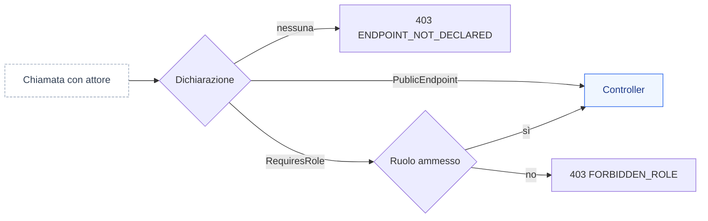
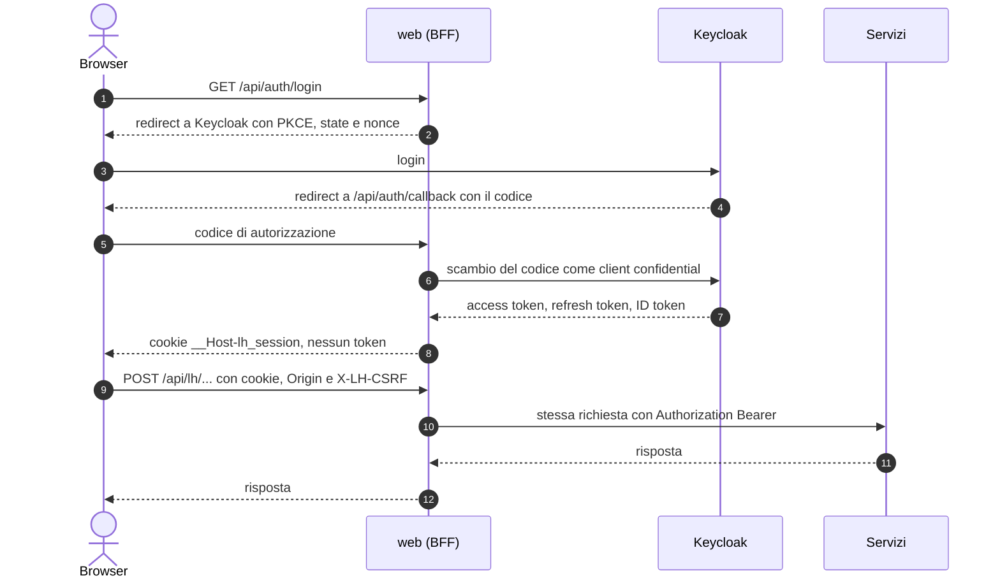

Loyalty Hub usa un modello di autenticazione demo semplice basato sull'header HTTP `X-LH-Actor`. Ogni chiamata identifica l'attore (username) che la esegue. Il servizio ricava il ruolo dalla persona e applica il controllo di autorizzazione sull'endpoint.

## Header richiesto

Aggiungi l'header a ogni richiesta ai servizi di backoffice.

```bash
curl http://localhost:8083/backoffice/campaigns \
  -H "X-LH-Actor: luca.marketing"
```

> **Nota:** gli endpoint del portale cliente (`/portal/...`) e di Ingestion (`/v1/actions`) accettano richieste senza header in modalita demo. In produzione tutti i canali richiedono un token OAuth o JWT emesso dal gateway.

## Personas disponibili

Il seed dell'ambiente demo carica cinque personas con ruoli diversi.

| Username | Ruolo | Descrizione |
| --- | --- | --- |
| `marta.admin` | ADMIN | Accesso completo a ogni servizio e a operazioni distruttive. |
| `luca.marketing` | MARKETING | Crea e pubblica campagne, template e concorsi. |
| `elena.legal` | LEGAL | Approva contenuti e gestisce clausole di privacy. |
| `paolo.care` | CARE | Consulta clienti, crea aggiustamenti punti manuali. |
| `sara.analyst` | ANALYST | Legge KPI, esporta report, consulta DLQ. |

## Ruoli e permessi

Ogni endpoint dei servizi dichiara i ruoli ammessi. La tabella riassume le regole principali.

| Area | Endpoint | Ruoli ammessi |
| --- | --- | --- |
| Campagne | `POST /backoffice/campaigns` | ADMIN, MARKETING |
| Campagne | `POST /backoffice/campaigns/{id}/publish` | ADMIN, LEGAL |
| Wallet | `POST /backoffice/adjustments` | ADMIN, CARE |
| Reward | `POST /backoffice/rewards` | ADMIN, MARKETING |
| Engagement | `POST /backoffice/templates` | ADMIN, MARKETING, LEGAL |
| Insight | `GET /backoffice/kpi/**` | ADMIN, ANALYST |
| DLQ | `POST /backoffice/dlq/{id}/replay` | ADMIN |

## Deny by default: ogni endpoint dichiara chi può chiamarlo

Ogni endpoint dei servizi dichiara chi può chiamarlo. Così un endpoint nuovo non nasce aperto per dimenticanza: se la dichiarazione manca, il servizio rifiuta la chiamata a tutti, anche a `ADMIN`.

- **`@RequiresRole`** elenca i ruoli ammessi. Le letture elencano tutti i ruoli, `ANALYST` compreso: nel profilo `demo` una chiamata senza `X-LH-Actor` vale `ANALYST:anonymous` e legge come prima.
- **`@PublicEndpoint`** toglie il controllo di ruolo e porta sempre un motivo. Oggi nessun endpoint di produzione lo usa: un endpoint pubblico nuovo richiede una decisione (domanda o ADR) prima del codice. Nel profilo `enterprise` il token resta comunque obbligatorio.
- **Nessuna dichiarazione**: il servizio risponde `403` con `code` `ENDPOINT_NOT_DECLARED`. È un errore del codice, e la build lo blocca prima con un test ArchUnit.



Le regole complete sono nel paragrafo 3.2 di [Convenzioni backend](https://github.com/peppe-ruv/Loyalty_Sys/blob/main/docs/06-CONVENZIONI-BACKEND.md) su GitHub.

## Profilo enterprise: accesso dal browser con il BFF

Con `LH_PROFILE=enterprise` l'header `X-LH-Actor` non vale più: i servizi accettano solo un access token OIDC (`Authorization: Bearer`, audience `hub`). Portale e backoffice non vedono mai il token: il server web fa da **Backend-for-Frontend** (BFF), client confidential `web` del realm Keycloak.

- **Login**: `GET /api/auth/login?returnTo=/percorso` avvia Authorization Code con PKCE `S256`, `state` e `nonce`; `returnTo` vale solo come percorso della stessa origine.
- **Sessione**: il browser riceve solo il cookie opaco `__Host-lh_session` (`HttpOnly`, `Secure`, `SameSite=Lax`) e `__Host-lh_csrf`; token cifrati lato server, rinnovati in modo trasparente con il refresh token a rotazione.
- **Chiamate**: il browser chiama `/api/lh/<servizio>/v1/...`; il BFF aggiunge `Authorization: Bearer` e scarta ogni `Authorization`, `X-LH-Actor` o cookie arrivati dal browser. Il percorso arriva al servizio esattamente com'è stato chiesto (niente `..`, `%2F` o parametri `;`). Sulle API `/v1/portal/**` il membro viene solo dal token: una richiesta con un `memberId` scelto dal browser (query, corpo, percorso) è rifiutata, e il corpo è ammesso solo come un oggetto JSON.
- **CSRF**: ogni `POST`, `PUT`, `PATCH`, `DELETE` porta l'header `X-LH-CSRF` e un `Origin` della stessa origine.
- **Logout**: «Esci» invia un modulo a `POST /api/auth/logout`, che chiude la sessione e risponde 303 verso il logout di Keycloak (l'ID token non passa dal JavaScript); Keycloak chiama `POST /api/auth/backchannel-logout` quando la sessione finisce lì (utente disattivato, logout altrove).

<Warning>
Finché i servizi non ricavano il membro dal token (`MemberPrincipal`, M8.10) il portale nel profilo `enterprise` non va esposto a membri reali: i controlli del BFF sono una difesa in più, non il controllo di proprietà (Q-410).
</Warning>

Variabili del web: `LH_OIDC_ISSUER`, `LH_WEB_CLIENT_ID`, `LH_WEB_CLIENT_SECRET`, `LH_WEB_URL`, `LH_WEB_SESSION_KEY` (anche da `*_FILE`). Se mancano o sono insicure il web non parte (`INSECURE_CONFIG`). Il chart Helm e il compose di riferimento le impostano per te: vedi [Installazione enterprise](/operations/installazione-enterprise).



| Codice | Quando |
| --- | --- |
| `401 UNAUTHENTICATED` | sessione assente o scaduta: l'interfaccia torna al login e poi alla pagina di partenza |
| `403 CSRF_REJECTED` | richiesta che cambia stato senza `X-LH-CSRF` valido o da un'altra origine |
| `400 INVALID_PATH` | segmento del percorso vuoto, `.`, `..` o con caratteri fuori da `A-Z a-z 0-9 . _ ~ -` |
| `400 MEMBER_FROM_TOKEN` | `memberId` nella query o nel corpo di un'API del portale |
| `400 INVALID_BODY` / `415 UNSUPPORTED_MEDIA_TYPE` | corpo di un'API del portale che non è un solo oggetto JSON |
| `403 MEMBER_FROM_TOKEN` | `memberId` nel percorso di un'API del portale |
| `403 FORBIDDEN_ROLE` | account di solo membro fuori dalle API del portale |
| `503 IDP_UNAVAILABLE` | Keycloak non risponde durante il rinnovo del token |
| `500 INSECURE_CONFIG` | web in `enterprise` senza configurazione OIDC completa e sicura |

## Errori di autenticazione

<AccordionGroup>
  <Accordion title="401 UNAUTHENTICATED">
    Header `X-LH-Actor` assente su un endpoint di backoffice. Aggiungi l'header con uno degli username validi.
  </Accordion>

  <Accordion title="403 FORBIDDEN">
    L'attore esiste ma il suo ruolo non e ammesso sull'endpoint. Verifica la tabella dei permessi qui sopra o usa `marta.admin` per test rapidi.
  </Accordion>

  <Accordion title="403 ENDPOINT_NOT_DECLARED">
    L'endpoint non dichiara `@RequiresRole` né `@PublicEndpoint` ed è rifiutato a tutti. Non dipende dal chiamante: segnala l'endpoint a chi mantiene il servizio.
  </Accordion>

  <Accordion title="404 ACTOR_NOT_FOUND">
    Lo username non esiste nel seed. Controlla la spelling o rilancia lo script di seed.
  </Accordion>
</AccordionGroup>

## Prossimi passi

<CardGroup cols={2}>
  <Card title="Convenzioni API" icon="ruler" href="/api/convenzioni">
    Paginazione, errori, idempotency e versioning.
  </Card>

  <Card title="Inviare un evento" icon="paper-plane" href="/guide/inviare-un-evento">
    Manda la tua prima azione al servizio Ingestion.
  </Card>
</CardGroup>
