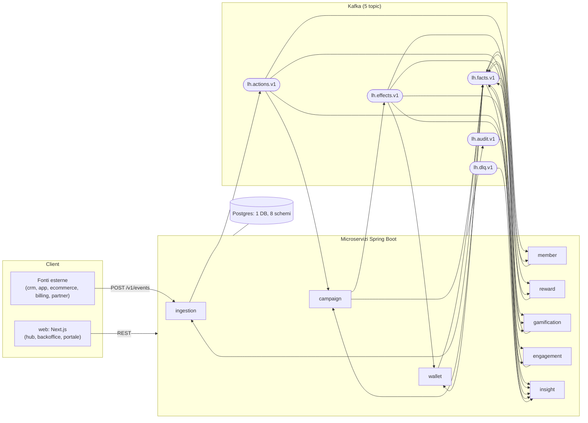

Loyalty Hub è progettato attorno a poche regole rigide. Questa pagina le enuncia e mostra come si traducono in servizi, topic e database.

## I principi

1. **Event-driven e coreografato.** I servizi reagiscono a topic Kafka. Nessun orchestratore, nessuna chiamata HTTP tra servizi.
2. **Autonomia dei dati.** Ogni servizio possiede il proprio schema Postgres e mantiene snapshot locali dei dati altrui costruiti dai fatti.
3. **Un solo ingresso per le azioni.** `ingestion-service` è l'unico produttore di `lh.actions.v1`, sia per fonti esterne che per accadimenti interni. Un solo posto per validazione, deduplica, anti-loop.
4. **Il motore decide, gli altri eseguono.** Solo `campaign-service` produce effetti; wallet, reward, gamification, engagement li applicano in modo idempotente.
5. **Affidabilità semplice.** Outbox transazionale + consumer idempotenti + DLQ. Niente transazioni Kafka, niente saghe orchestrate.
6. **Progettato per dormire.** Ogni servizio può spegnersi e riaccendersi: l'arretrato resta su Kafka, lo stato su Postgres.

## Vista d'insieme

## I confini in una tabella

| Servizio | Porta | Schema | Possiede | Non possiede |
| --- | --- | --- | --- | --- |
| `ingestion` | 8081 | `ingestion` | Fonti, tipi azione, eventi ingresso, dedup, ponte interno, simulatore. | Regole, punti. |
| `member` | 8082 | `member` | Membri, attributi, etichette, segmenti, referral. | Saldi, tier (solo proiezione). |
| `campaign` | 8083 | `campaign` | Campagne, motore regole, limiti, budget, registro valutazioni. | Movimenti punti. |
| `wallet` | 8084 | `wallet` | Valute, wallet, lotti, movimenti, tier, edizioni. | Catalogo premi. |
| `reward` | 8085 | `reward` | Fasce, categorie, premi, stock, richieste premio, coupon. | Saldo punti. |
| `gamification` | 8086 | `gamification` | Concorsi, giocate, obiettivi, badge, classifiche. | Punti. |
| `engagement` | 8087 | `engagement` | Messaggi, template, notifiche, contenuti CMS. | Regole di trigger. |
| `insight` | 8088 | `insight` | Read model per dashboard, tracciati, KPI, DLQ, audit. | Scrive solo suoi propri dati. |

## Un solo database, otto schemi

Loyalty Hub usa **un unico database Postgres** con **uno schema per servizio**. Ogni servizio ha migrazioni Flyway indipendenti nel proprio schema. Ridurre a un database facilita il free tier di Neon; l'isolamento resta grazie agli schemi separati.

## Comunicazione tra servizi: solo eventi

Non ci sono chiamate HTTP tra i microservizi. Ogni scambio passa per uno dei cinque topic. Questo garantisce:

- **Backpressure naturale**: i consumer leggono al proprio ritmo.
- **Rerun facili**: puoi ricalcolare rileggendo un topic.
- **Isolamento dei guasti**: un servizio giù non blocca la scrittura dei fatti degli altri.

## Il frontend

Il progetto `web/` è un'applicazione Next.js unica che ospita:

- **Hub**: pagina iniziale con selezione persona.
- **Backoffice**: gestione programma, campagne, premi, contenuti, monitoraggio.
- **Portale membri**: profilo, wallet, catalogo premi, giochi.
- **Proxy /api/lh**: instrada le chiamate REST verso i microservizi corretti in base al path.

## Osservabilità

`insight-service` costruisce read model dedicati partendo dai cinque topic:

- **Flusso eventi live** (SSE diretto dal browser).
- **Tracciati end-to-end** per azione.
- **KPI di programma** (attivazioni, punti maturati, membri attivi).
- **DLQ** con causa e possibilità di riprova.
- **Audit** delle scritture da backoffice.

## Prossimo passo

Approfondisci i singoli servizi in [Servizi](reference/servizi) o i contratti eventi in [Eventi Kafka](reference/eventi-kafka).
