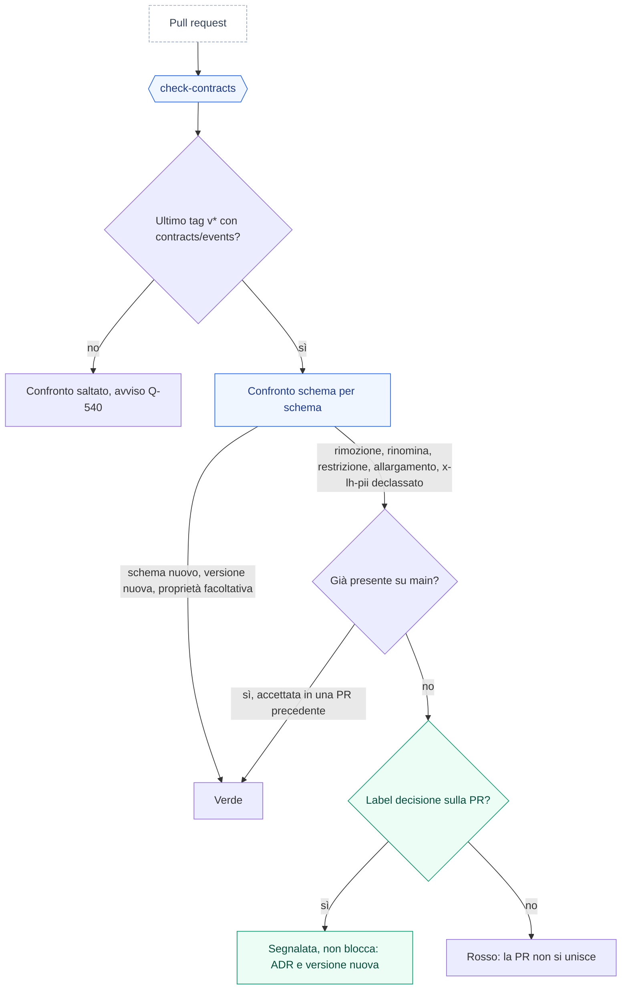

Il bus è il contratto pubblico tra i microservizi. Questa pagina definisce topic, envelope e regole di correlazione. Ciò che è scritto qui è vincolante per tutti i servizi.

## I cinque topic in un colpo d'occhio

Loyalty Hub separa gli eventi in cinque topic Kafka. Ognuno ha un ruolo preciso, un tipo di produttore e un tipo di consumatore. Conoscere "chi scrive dove" ti aiuta a leggere i log e a diagnosticare i blocchi.

<CardGroup cols={2}>
  <Card title="lh.actions.v1" icon="inbox">
    **Azioni in ingresso.** Ogni azione ricevuta da ingestion (acquisto, login, aggiornamento profilo) atterra qui. Prodotto SOLO da ingestion-service. Consumato da campaign-service. Chiave: `memberId`.
  </Card>

  <Card title="lh.effects.v1" icon="bolt">
    **Effetti decisi dalle campagne.** Ogni match del motore emette uno o più effetti. Prodotto SOLO da campaign-service. Consumato da wallet, contest, engagement (a seconda del tipo). Chiave: `memberId`.
  </Card>

  <Card title="lh.facts.v1" icon="clipboard-check">
    **Fatti avvenuti nel sistema.** Cambiamenti irreversibili: punti accreditati, tier promosso, richiesta premio confermata, campagna pubblicata. Prodotto da wallet, reward, contest, member, campaign, engagement. Consumato praticamente da tutti per aggiornare snapshot locali. Chiave: `memberId` (o `entityId` per fatti non membro).
  </Card>

  <Card title="lh.audit.v1" icon="lock">
    **Tracciato immutabile del backoffice.** Ogni scrittura dal BO (creazione campagna, evasione premio, aggiustamento wallet, transizione stato) produce un audit event. Prodotto da tutti i servizi. Consumato da insight-service per audit trail e reportistica. Chiave: `actorId`.
  </Card>

  <Card title="lh.dlq.v1" icon="triangle-exclamation">
    **Dead letter queue.** Messaggi non processabili dopo i retry (payload rotto, business rule violata). Prodotto da qualsiasi consumer che rinuncia. Consumato da un'interfaccia in BO-24 per ispezione e riprocessamento manuale.
  </Card>
</CardGroup>

### Un flusso concreto

> Marta compra un caffè da 4 €. Il POS chiama ingestion.
>
> 1. `ingestion` pubblica su `lh.actions.v1` una `purchase.completed`.
> 2. `campaign` la legge, valuta le regole LIVE, produce due effetti su `lh.effects.v1`: un `GRANT` PTS 4 e un `GRANT` STS 4.
> 3. `wallet` legge gli effetti, aggiorna il saldo, pubblica su `lh.facts.v1` due `wallet.points.earned`.
> 4. `campaign` legge il fatto e aggiorna il suo `campaign_totals.points_granted` (spiegabilità).
> 5. Se il tier di Marta cambia, `wallet` pubblica anche `tier.changed`; `engagement` invia una notifica (che a sua volta produce un audit su `lh.audit.v1`).

<Note>
  Le chiavi (`memberId` di default) determinano l'ordine dentro una partizione. Kafka NON garantisce ordine tra partizioni diverse. Vedi [Eventi e topic](/specifiche/eventi-e-topic) per il contratto completo.
</Note>

<Tip>
  Quando qualcosa non funziona, il percorso di indagine è sempre lo stesso: guarda l'action su `lh.actions.v1`, poi cerca il correlation ID nella evaluation log di campaign, poi controlla `lh.effects.v1`, poi `lh.facts.v1`. Se manca un effetto atteso, il problema è nel motore; se manca il fatto, è nel servizio consumatore.
</Tip>

## I cinque topic

Il piano gratuito Aiven consente 5 topic da 2 partizioni. Loyalty Hub ne usa esattamente cinque.

| Topic | Contenuto | Chiave | Produttore | Consumatori |
| --- | --- | --- | --- | --- |
| `lh.actions.v1` | Azioni premianti (esterne e interne). | `memberId` | Solo `ingestion` | `campaign`, `gamification`, `member`, `insight` |
| `lh.effects.v1` | Effetti decisi dal motore. | `memberId` | Solo `campaign` | `wallet`, `reward`, `gamification`, `engagement`, `insight` |
| `lh.facts.v1` | Fatti di dominio di tutti i servizi. | `memberId` o id aggregato | Tutti tranne `insight` | Tutti (filtrano per `type`) |
| `lh.audit.v1` | Audit delle scritture da backoffice. | `entityType:entityId` | Tutti | `insight` |
| `lh.dlq.v1` | Messaggi non elaborabili. | Chiave originale | Tutti (error handler) | `insight` |

**Parametri:** 2 partizioni per topic; retention del provider (3 giorni sul free tier: il sistema di record è Postgres); consumer group `lh-<servizio>`; `auto.offset.reset=earliest`.

> **Nota:** Sul free tier di Aiven i topic vanno creati **una tantum a mano**. I servizi hanno `auto-create` disabilitato per evitare che un sesto topic accidentale rompa l'avvio.

## L'envelope: CloudEvents 1.0

Ogni messaggio è un CloudEvent JSON strutturato (`content-type: application/cloudevents+json`).

| Attributo | Obbligatorio | Regola |
| --- | --- | --- |
| `specversion` | Sì | `"1.0"` |
| `id` | Sì | ULID (26 caratteri). Per fonti esterne è l'id fornito dalla fonte (dedup su `source`\+`id`). |
| `source` | Sì | `urn:loyaltyhub:source:<codice>` per azioni; `urn:loyaltyhub:service:<servizio>` per effetti, fatti, audit. |
| `type` | Sì | `io.loyaltyhub.<famiglia>.<nome>`. Famiglie: `action`, `effect`, `fact`, `audit`. |
| `subject` | Sì | `member:<memberId>`; per fatti di configurazione `<entityType>:<id>`. |
| `time` | Sì | RFC 3339 UTC. Data di business. |
| `datacontenttype` | Sì | `application/json` |
| `dataschema` | Sì | `urn:loyaltyhub:schema:<famiglia>.<nome>:<versione>` |
| `lhtenant` | Sì | `aurora` nel PoC. |
| `lhcorrelationid` | Sì | Id dell'azione radice della catena. |
| `lhcausationid` | No | Id dell'evento che ha causato questo. |
| `lhhop` | Sì | `0` per azioni esterne; +1 a ogni passaggio del ponte interno; `> 3` → DLQ `LOOP_GUARD`. |
| `lhactor` | No | `<ruolo>:<username>` da backoffice, `system` per i job, `member:<id>` dal portale. |
| `data` | Sì | Payload specifico del tipo. |

In ingresso dalle fonti esterne sono obbligatori solo `specversion`, `id`, `source`, `type`, `subject`, `time`, `data`. Gli attributi `lh*` li aggiunge `ingestion`.

> **Nota:** Header Kafka duplicati per filtrare senza deserializzare: `lh-type` e `lh-correlation-id`.

## Esempio: un'azione

```json purchase.completed
{
  "specversion": "1.0",
  "id": "01J8ZK3V7Q2M9T4B6N8R0XWYCD",
  "source": "urn:loyaltyhub:source:ecommerce",
  "type": "io.loyaltyhub.action.purchase.completed",
  "subject": "member:MBR-000003",
  "time": "2026-09-18T10:15:00Z",
  "datacontenttype": "application/json",
  "dataschema": "urn:loyaltyhub:schema:action.purchase.completed:1",
  "lhtenant": "aurora",
  "lhcorrelationid": "01J8ZK3V7Q2M9T4B6N8R0XWYCD",
  "lhhop": 0,
  "data": {
    "orderId": "ORD-88213",
    "amount": 130.00,
    "currency": "EUR",
    "channel": "ONLINE"
  }
}
```

## Esempio: un effetto

```json points.grant
{
  "specversion": "1.0",
  "id": "01J8ZK4A0Q...",
  "source": "urn:loyaltyhub:service:campaign",
  "type": "io.loyaltyhub.effect.points.grant",
  "subject": "member:MBR-000003",
  "time": "2026-09-18T10:15:01Z",
  "datacontenttype": "application/json",
  "lhtenant": "aurora",
  "lhcorrelationid": "01J8ZK3V7Q2M9T4B6N8R0XWYCD",
  "lhcausationid": "01J8ZK3V7Q2M9T4B6N8R0XWYCD",
  "lhhop": 1,
  "data": {
    "campaignCode": "WEEKEND-BOOST",
    "currency": "PTS",
    "amount": 260,
    "reason": "purchase multiplier x2"
  }
}
```

## Convenzioni operative

- **Idempotenza:** ogni consumer verifica `processed_event(event_id, service)` prima di scrivere. Un rerun a offset arretrato non duplica gli effetti.
- **Correlazione:** l'`lhcorrelationid` identifica una catena end-to-end. `insight-service` la usa per costruire il tracciato completo.
- **Anti-loop:** il ponte interno può ripubblicare fatti come azioni. `lhhop` cresce di 1 a ogni passaggio; oltre 3 il messaggio finisce in DLQ.
- **Consumer tolleranti:** un consumer che riceve un `type` che non gli interessa **lo ignora senza errore** e senza scrivere `processed_event`.
- **Nomi tipi:** dalle fonti esterne accetti anche nomi brevi (`purchase.completed`); ingestion li normalizza a nome completo prima di pubblicare.

## Evoluzione dei contratti

Gli schemi in `contracts/events/` sono il contratto pubblico del bus: un consumer già in esecuzione, o un evento trattenuto su un topic, deve restare valido. Un contratto quindi **si estende, non si rompe**: si aggiungono proprietà facoltative (i consumer ignorano i campi sconosciuti) oppure si crea una versione nuova `<nome>.v<n>.schema.json` con `dataschema …:<n>`, con una doppia lettura temporanea (docs/05 §9).

A ogni pull request `check-contracts` confronta ogni schema con lo stesso file nell'ultimo tag di rilascio `v*`.



Il diagramma si legge dall'alto: il confronto parte solo se esiste un tag `v*` che contiene già i contratti. Se una differenza è incompatibile, la PR resta rossa a meno che quella rottura sia già su `main` (l'ha accettata una PR precedente) o che la PR porti la label `decisione`. Nel primo caso il controllo non la segnala di nuovo come errore, nel secondo la segnala senza bloccare.

| Passa | Blocca |
|---|---|
| Schemi e versioni nuove | Schema rimosso o rinominato, `$id` cambiato |
| Proprietà facoltativa nuova, anche in schema chiuso | Proprietà rimossa, campo reso o non più obbligatorio |
| Annotazioni (`title`, `description`, `x-lh-superseded-by`) | Tipo ristretto, allargato (anche a `null`) o tolto; `format`/`pattern` cambiati |
| Allargamenti di valore, segnalati (Q-139, Q-541) | Restrizioni (valore di `enum` tolto; vincoli introdotti o più stretti; schema chiuso) |
| | Schema riaperto o `x-lh-pii` da `true` a `false` (ADR-032) |

<Note>
  Un cambio incompatibile è una decisione, non un refactor: serve un'ADR, una versione nuova con `:<n+1>` (per esempio `member.registered:2`) e la label `decisione` sulla PR. Una rottura già entrata su `main` non blocca le PR successive (Q-542). Oggi l'unico tag raggiungibile, `v0.6.0`, è un tag storico del bundle UX e non contiene `contracts/events/`: finché il proprietario non pubblica un tag di rilascio con i contratti, il confronto è saltato con un avviso (Q-540). In locale: `node scripts/check-contracts.mjs [--baseline=<ref>]`, per esempio con un commit o un tag precedente come riferimento.
</Note>

## Prossimo passo

Per gli endpoint REST esposti dai servizi vai a [API](reference/api).
