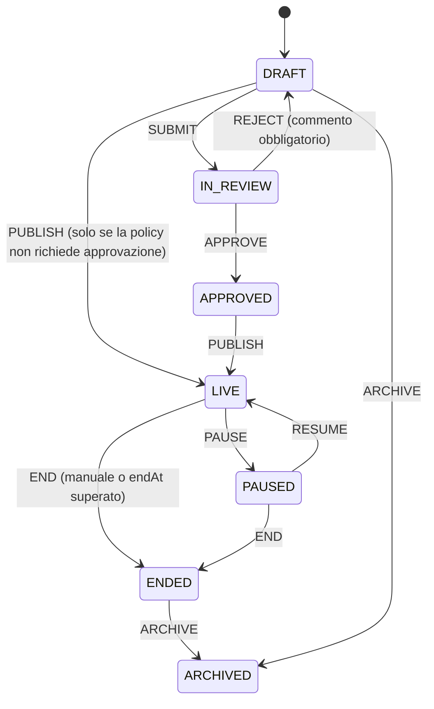
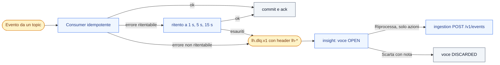

Questa pagina descrive tre meccanismi di controllo di Loyalty Hub: la **macchina delle approvazioni** che governa gli oggetti configurabili, la **consegna dei webhook** verso l'esterno e la **Dead Letter Queue (DLQ)** dove finiscono i messaggi Kafka che un consumer non riesce a elaborare. Sono tre cose diverse, con cicli di vita diversi.

## Ciclo di vita degli oggetti governati

Campagne, premi, concorsi e contenuti seguono la stessa macchina a stati. È il diagramma di riferimento: le altre pagine lo richiamano invece di ripeterlo.

La policy dice per quali oggetti serve l'approvazione e quale ruolo la dà:

| Oggetto | Approvazione richiesta | Ruolo che approva |
| --- | --- | --- |
| Concorso | sempre | `LEGAL` |
| Premio | sempre | `LEGAL` |
| Campagna | se richiede il parere legale o il budget supera 100 000 punti | `LEGAL` |
| Contenuto | mai, pubblicazione diretta | nessuno |

Il ruolo che approva è sempre quello indicato dalla policy. Un oggetto `LIVE` si modifica solo nei campi sicuri (nome, descrizione, `endAt`, priorità, immagine): per il resto si duplica. Ogni transizione scrive lo storico (chi, quando, commento) e una voce di audit. Da Fase 2 chi sottomette un oggetto non può approvarlo (ADR-044).

## Consegna dei webhook

Quando un evento sottoscritto accade, engagement-service lo consegna all'indirizzo del webhook con firma `X-LH-Signature`. Ogni consegna ha un proprio ciclo di vita: il primo invio e tre ritenti a 1, 5 e 15 minuti. Un webhook che fallisce **non** va in DLQ: dopo l'ultimo tentativo la consegna resta in `GAVE_UP` e da BO-23 si può riprovare a mano.

```mermaid
stateDiagram-v2
  accTitle: Ciclo di vita di una consegna webhook
  accDescr: Una consegna nasce in attesa; un 2xx la chiude in OK; un fallimento la porta in FAILED con il prossimo tentativo a 1, 5 o 15 minuti; al quarto fallimento diventa GAVE_UP; Riprova manuale fa un tentativo immediato da FAILED o GAVE_UP.
  [*] --> PENDING: fatto sottoscritto o evento di prova
  PENDING --> OK: 2xx
  PENDING --> FAILED: errore, ritento a 1 min
  FAILED --> OK: 2xx al ritento
  FAILED --> FAILED: errore, ritento a 5 o 15 min
  FAILED --> GAVE_UP: quarto tentativo fallito
  GAVE_UP --> OK: Riprova con 2xx
  GAVE_UP --> GAVE_UP: Riprova fallito
  OK --> [*]
```

## Ritentativi e DLQ

La DLQ riguarda i messaggi Kafka. Un consumer riprova tre volte con attese di 1, 5 e 15 secondi; dopo l'ultimo tentativo, o subito per un errore non ritentabile (validazione, deserializzazione), il record va su `lh.dlq.v1` con gli header `lh-*` di diagnosi. insight-service ne apre una voce `OPEN` in BO-27: un amministratore la riprocessa, se è un'azione, oppure la scarta con una nota.

Gli header e i codici di errore sono in [Eventi dlq](/specifiche/eventi/dlq); i tipi di evento sono in [Eventi e topic](/specifiche/eventi-e-topic).
