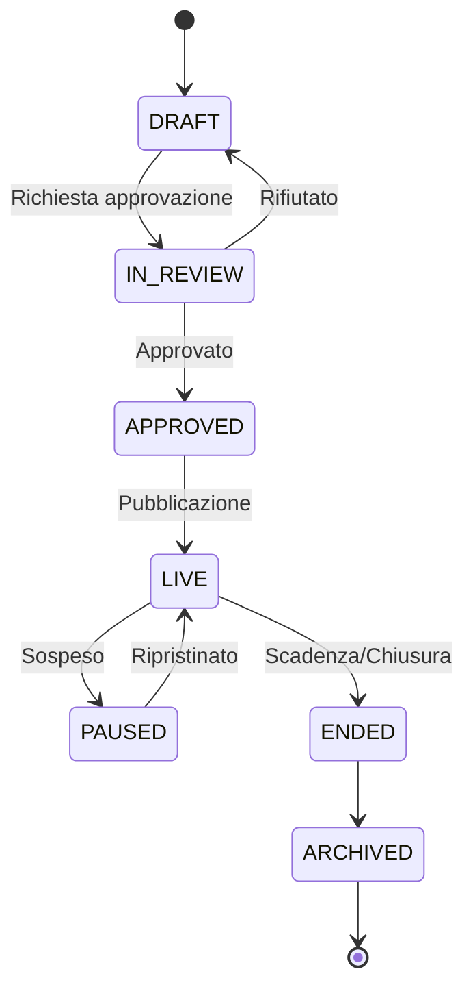
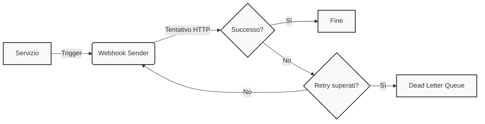

Questa pagina descrive come Loyalty Hub garantisce la governance operativa dei dati. Ogni azione sensibile viene sottoposta a una **macchina delle approvazioni**; le notifiche verso l'esterno passano tramite **webhook**, e gli errori asincroni vengono instradati in una **Dead Letter Queue (DLQ)**.

## Macchina delle approvazioni

Gli oggetti di business critici (campagne, premi, concorsi) non vengono messi `LIVE` da una singola persona. Il ruolo `MARKETING` definisce i parametri e sposta lo stato in `IN_REVIEW`. Il ruolo `LEGAL` (o simile) esamina la configurazione e decide se promuoverla ad `APPROVED` oppure respingerla.

## Webhook e DLQ

Quando il sistema comunica verso l'esterno, garantisce affidabilità tramite tentativi multipli.

La `DLQ` è un registro centralizzato, gestito tipicamente da `insight-service`, che accumula i messaggi falliti assieme all'errore originario. Gli amministratori possono esaminare e ritentare o scartare l'operazione direttamente dal backoffice.
