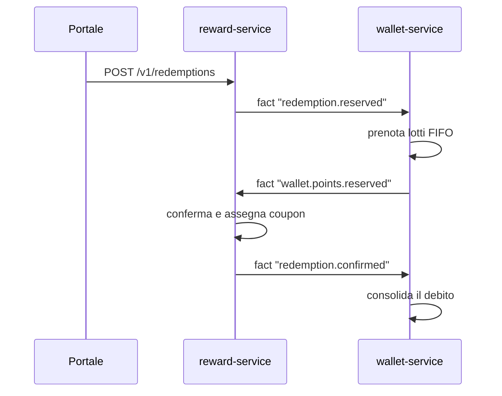

Loyalty Hub trasforma il saldo del membro in valore percepito attraverso catalogo premi, giochi e riconoscimenti. Questa pagina descrive ogni meccanica e i suoi confini.

## Catalogo premi

Il catalogo è organizzato in **fasce** (per esempio 500 pts, 1000 pts, 2500 pts). Ogni fascia contiene uno o più premi. Un premio ha:

- Nome, immagine, descrizione.
- Categoria (per filtri di navigazione).
- Costo in punti.
- Stock disponibile (opzionale, se limitato).
- Regole di visibilità (per esempio "solo tier Gold").

## Richieste premio con saga

Una richiesta premio non è una scrittura semplice: coinvolge più servizi che devono restare consistenti. Loyalty Hub usa una **saga coreografata** su Kafka.

Se il wallet non ha saldo sufficiente, la saga fallisce e il portale mostra un errore leggibile.

## Coupon

Alcuni premi consegnano un **coupon** (codice sconto, buono digitale). I coupon vengono estratti da un **pool** caricato dal backoffice. Ogni coupon ha stato (`AVAILABLE`, `ASSIGNED`, `REDEEMED`, `EXPIRED`) e appartiene a un premio.

> **Nota:** Se il pool si esaurisce, la richiesta premio fallisce con `COUPON_POOL_EMPTY`. Configura sempre una soglia di allarme in backoffice.

## Instant win

Un concorso instant win offre giocate immediate con esito prefissato. Il modello di base:

- **Istanti vincenti pre-generati**: alla creazione del concorso il sistema calcola in anticipo N istanti in cui la giocata sarà vincente.
- **Giocate consumate una a una**: il membro guadagna giocate da campagne o azioni.
- **Vincita = azione interna**: se la giocata cade in un istante vincente, si crea un'azione `contest.won` che rientra dal ponte interno e attiva le campagne che consegnano il premio (di solito una campagna di sistema).

La logica di vincita è identica per tutti i concorsi. Quello che cambia è la **meccanica**, cioè l'esperienza che il membro vede nel portale (PT-06) e la metafora usata nel backoffice (BO-14). Il valore della meccanica è dato: né un identificativo tecnico né un contratto evento.

### Le tre meccaniche

<CardGroup cols={3}>
  <Card title="WHEEL" icon="circle-dot">
    **Ruota della fortuna**. Il membro fa girare una ruota animata divisa in spicchi. Adatta a montepremi ampi con più tipi di premio (punti + coupon + oggetto).
  </Card>

  <Card title="SCRATCH" icon="hand-sparkles">
    **Gratta e vinci**. Il membro gratta una superficie per rivelare l'esito. Adatta a montepremi con pochi premi ma di valore alto, o a stagionalità natalizia.
  </Card>

  <Card title="BOX" icon="gift">
    **Pacco regalo**. Il membro sceglie o apre un pacco tra più opzioni visibili. Adatta a concorsi con premi di uguale valore o a periodi di lancio.
  </Card>
</CardGroup>

### Confronto tra meccaniche

| Aspetto | WHEEL | SCRATCH | BOX |
| --- | --- | --- | --- |
| Metafora | Ruota della fortuna | Gratta e vinci | Pacco regalo |
| Interazione portale | Bottone "Gira" → animazione di rotazione | Trascina il dito → superficie che si scopre | Bottone "Apri" o scelta tra pacchi visibili |
| Durata percepita | 3-4 secondi con animazione | 2-3 secondi + interazione | 1-2 secondi immediato |
| Ideale per | Molte tipologie di premio miste | Premi rari ma di alto valore | Periodi di lancio, premi omogenei |
| Esempio nei dati demo | `IW-AUTUNNO` (Ruota d'Autunno) | `IW-NATALE` (Gratta e vinci di Natale) | `IW-ESTATE` (Pacchi d'Estate) |
| Backoffice (BO-14) | Anteprima ruota con spicchi | Anteprima superficie da grattare | Anteprima pacchi disponibili |

<Note>
  La meccanica è puramente presentazionale. Il motore di estrazione, il calendario istanti, la deduplica e la saga di consegna del premio funzionano allo stesso modo. Cambiare `mechanic` di un concorso non modifica gli istanti già pianificati, cambia solo l'esperienza portale al prossimo rendering.
</Note>

Il ruolo LEGAL vede in backoffice l'elenco degli istanti vincenti e i vincitori indipendentemente dalla meccanica scelta.

## Obiettivi e badge

Un **obiettivo** è una condizione cumulativa (per esempio "fai 5 acquisti in un mese"). Al raggiungimento:

- Emette un fatto `achievement.completed`.
- Assegna un **badge** al membro.

I badge sono visibili nel portale ("le mie medaglie") e possono a loro volta essere trigger di campagne (per esempio "chi prende il badge silver riceve 100 punti bonus").

## Classifiche

Loyalty Hub calcola classifiche periodiche su metriche configurabili (punti maturati nel mese, giocate vinte, obiettivi completati). La classifica non è di per sé un premio: usa una campagna per premiare i primi N.

## Referral

Ogni membro ha un `referralCode` univoco. Alla registrazione con un codice amico:

- Il nuovo membro riceve un bonus.
- Il vecchio membro riceve un bonus quando il nuovo completa una condizione (per esempio primo acquisto).

Entrambi i bonus sono campagne configurabili in backoffice, non codice cablato.

## Prossimo passo

Vuoi vedere questi meccanismi all'opera? Vai alle [Guide pratiche](guide/inviare-un-evento).
