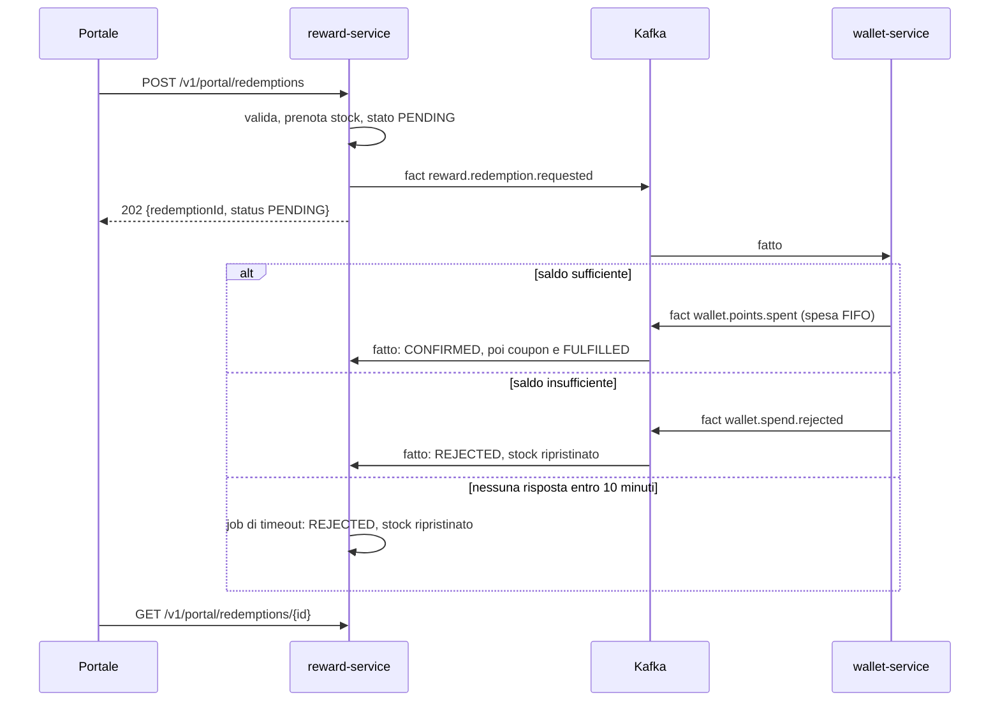
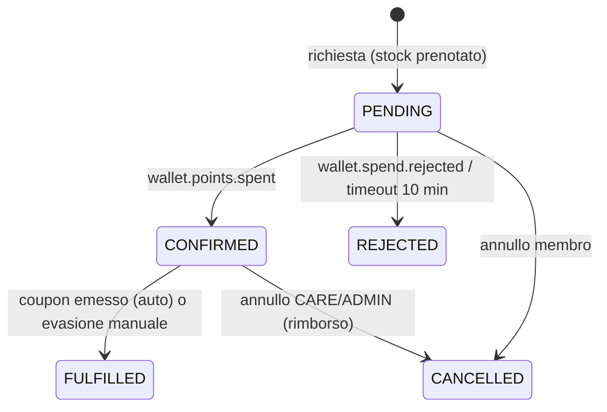
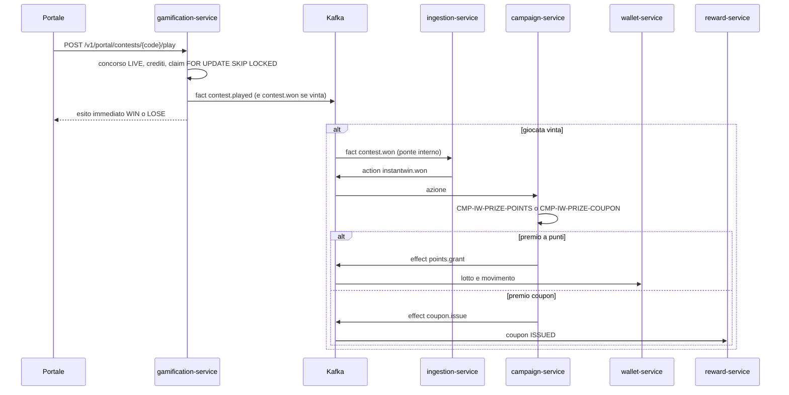
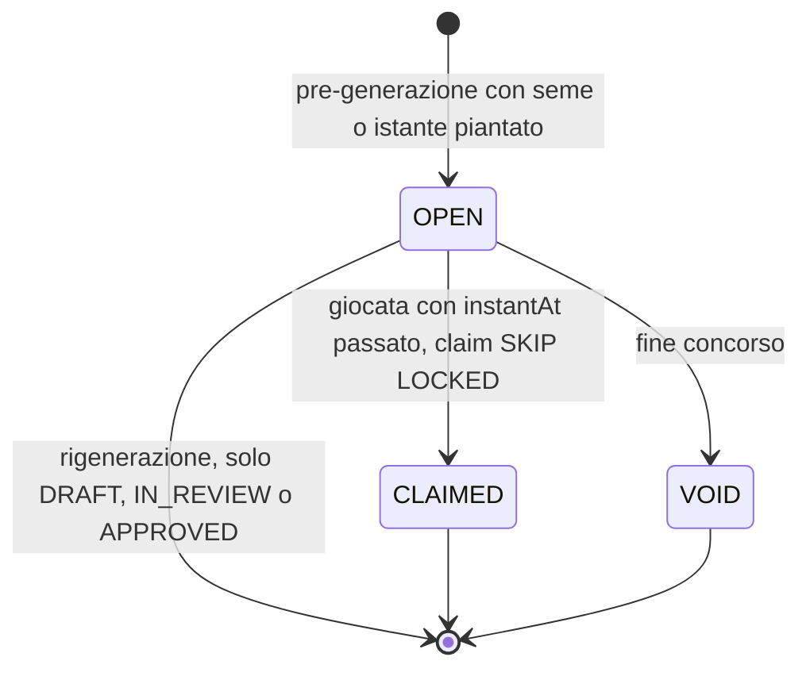

Loyalty Hub trasforma il saldo del membro in valore percepito attraverso catalogo premi, giochi e riconoscimenti. Questa pagina descrive ogni meccanica e i suoi confini.

## Catalogo premi

Il catalogo è organizzato in **fasce** (per esempio 500 pts, 1000 pts, 2500 pts). Ogni fascia contiene uno o più premi. Un premio ha:

- Nome, immagine, descrizione.
- Categoria (per filtri di navigazione).
- Costo in punti.
- Stock disponibile (opzionale, se limitato).
- Regole di visibilità (per esempio "solo tier Gold").

### I cinque tipi di premio

Il campo `type` del premio dice che cosa il membro riceve. Determina anche quali modalità di evasione (`fulfilment`) hanno senso e che schermate vede in portale.

<CardGroup cols={3}>
  <Card title="PHYSICAL" icon="box">
    Oggetto fisico spedito. Per esempio borraccia, gadget brandizzato. Serve l'indirizzo del membro. Evasione tipica: `MANUAL` da BO-13.
  </Card>

  <Card title="COUPON" icon="ticket">
    Codice sconto o buono digitale. Per esempio sconto merchant, buono partner. Estratto dal pool di codici pre-caricati. Evasione tipica: `AUTO_COUPON`.
  </Card>

  <Card title="DIGITAL" icon="download">
    Asset digitale (ebook, wallpaper, download). Nessuna spedizione. Evasione tipica: `INSTANT` con URL o `AUTO_COUPON` con codice.
  </Card>

  <Card title="DONATION" icon="heart">
    Donazione a ente. Il membro spende punti, il programma dona in cambio. Nessun asset da consegnare. Evasione tipica: `INSTANT`.
  </Card>

  <Card title="EXPERIENCE" icon="star">
    Esperienza (biglietto evento, workshop, accesso VIP). Richiede coordinamento con il membro. Evasione tipica: `MANUAL`.
  </Card>
</CardGroup>

| Tipo | Cosa vede il membro | Chi consegna | Fulfilment coerente | Esempio demo |
| --- | --- | --- | --- | --- |
| PHYSICAL | Card premio + form indirizzo | CARE (BO-13) | MANUAL | `RWD-BORRACCIA` |
| COUPON | Codice sconto in wallet | Sistema | AUTO_COUPON | `RWD-SHOP-10` |
| DIGITAL | Link o codice download | Sistema | INSTANT o AUTO_COUPON | `RWD-EBOOK` |
| DONATION | Ringraziamento + attestato | Sistema | INSTANT | `RWD-DONATION-TREE` |
| EXPERIENCE | Voucher + istruzioni | CARE (BO-13) | MANUAL | `RWD-WEEKEND` |

<Note>
  Il `type` è indipendente dalla fascia (`band`) che determina il costo in PTS. Un premio PHYSICAL può stare in qualunque fascia. Vedi il campo `fulfilment` in [Backoffice](/specifiche/frontend-backoffice#opzioni-di-configurazione-ricorrenti) per come si consegna.
</Note>

## Ciclo di vita degli oggetti governati

Campagne, premi, concorsi e contenuti seguono la stessa macchina a stati: bozza, revisione, approvazione, pubblicazione, pausa, chiusura e archiviazione. Il diagramma di riferimento è nella pagina [Governance](/concetti/governance#ciclo-di-vita-degli-oggetti-governati); qui trovi solo i cicli di vita propri dei premi e del gioco.

## Richieste premio con saga

Una richiesta premio non è una scrittura semplice: coinvolge più servizi che devono restare consistenti. Loyalty Hub usa una **saga coreografata** su Kafka: reward prenota lo stock e pubblica la richiesta, wallet spende i punti o rifiuta, reward conferma o rifiuta e ripristina lo stock. Il portale riceve subito `202` con lo stato `PENDING` e interroga la richiesta finché non è confermata o rifiutata.

```mermaid
sequenceDiagram
  accTitle: Richiesta premio con saga coreografata
  accDescr: Il portale chiede un premio a reward, che prenota lo stock e pubblica la richiesta; wallet spende i punti in ordine FIFO o rifiuta per saldo insufficiente; se non risponde entro 10 minuti reward rifiuta per timeout; reward conferma o rifiuta e ripristina lo stock, mentre il portale interroga lo stato.
  participant P as Portale
  participant RWD as reward-service
  participant K as Kafka
  participant WAL as wallet-service
  P->>RWD: POST /v1/portal/redemptions
  RWD->>RWD: valida, prenota stock, stato PENDING
  RWD->>K: fact reward.redemption.requested
  RWD-->>P: 202 {redemptionId, status PENDING}
  K->>WAL: fatto
  alt saldo sufficiente
    WAL->>K: fact wallet.points.spent (spesa FIFO)
    K->>RWD: fatto: CONFIRMED, poi coupon e FULFILLED
  else saldo insufficiente
    WAL->>K: fact wallet.spend.rejected
    K->>RWD: fatto: REJECTED, stock ripristinato
  else nessuna risposta entro 10 minuti
    RWD->>RWD: job di timeout: REJECTED, stock ripristinato
  end
  P->>RWD: GET /v1/portal/redemptions/{id}
```

Se `wallet.points.spent` arriva dopo il timeout, reward pubblica `reward.redemption.cancelled` con rimborso: i punti tornano al membro.

### Stati della richiesta premio

```mermaid
stateDiagram-v2
  accTitle: Ciclo di vita di una richiesta premio
  accDescr: Una richiesta premio nasce in attesa con lo stock prenotato; diventa confermata quando il wallet spende i punti, poi evasa; è rifiutata per saldo insufficiente o timeout; si annulla dal membro in attesa o da CARE con rimborso dopo la conferma.
  [*] --> PENDING: richiesta (stock prenotato)
  PENDING --> CONFIRMED: wallet.points.spent
  PENDING --> REJECTED: wallet.spend.rejected / timeout 10 min
  CONFIRMED --> FULFILLED: coupon emesso (auto) o evasione manuale
  CONFIRMED --> CANCELLED: annullo CARE/ADMIN (rimborso)
  PENDING --> CANCELLED: annullo membro
```

Alla richiesta si validano subito premio visibile, disponibilità, limite per membro e stato del membro: in caso di errore non parte nessun evento. Il controllo del saldo è del wallet. `REJECTED` e `CANCELLED` ripristinano lo stock.

## Coupon

Alcuni premi consegnano un **coupon** (codice sconto, buono digitale). I coupon vengono estratti da un **pool** caricato dal backoffice. Ogni coupon ha uno stato (`AVAILABLE`, `ISSUED`, `USED`, `EXPIRED`, `VOID`) e appartiene a un premio.

> **Nota:** Se il pool si esaurisce al momento dell'emissione, la richiesta premio resta `CONFIRMED` con il segnale `needsAttention` e un operatore la evade a mano; l'effetto `coupon.issue` di una campagna finisce invece in DLQ con `COUPON_POOL_EMPTY`. Configura sempre una soglia di allarme in backoffice.

## Instant win

Un concorso instant win offre giocate immediate con esito prefissato. Il modello di base:

- **Istanti vincenti pre-generati**: alla creazione del concorso il sistema calcola in anticipo N istanti in cui la giocata sarà vincente.
- **Giocate consumate una a una**: il membro guadagna giocate da campagne o azioni.
- **Vincita = azione interna**: se la giocata cade in un istante vincente, gamification pubblica il fatto `contest.won`; il ponte interno lo ripubblica come azione `instantwin.won` e attiva le campagne che consegnano il premio (di solito una campagna di sistema).

### Sequenza di giocata

La giocata è sincrona: il portale riceve subito l'esito. La consegna del premio è asincrona e passa dal ponte interno.

```mermaid
sequenceDiagram
  accTitle: Giocata instant win
  accDescr: Il portale chiede una giocata a gamification, che in una transazione verifica concorso e crediti e tenta il claim del primo istante aperto già passato; risponde subito con l'esito; se vinta, il fatto contest.won passa dal ponte di ingestion e diventa un'azione che le campagne di sistema trasformano in punti o coupon.
  participant P as Portale
  participant GAM as gamification-service
  participant K as Kafka
  participant ING as ingestion-service
  participant CMP as campaign-service
  participant WAL as wallet-service
  participant RWD as reward-service
  P->>GAM: POST /v1/portal/contests/{code}/play
  GAM->>GAM: concorso LIVE, crediti, claim FOR UPDATE SKIP LOCKED
  GAM->>K: fact contest.played (e contest.won se vinta)
  GAM-->>P: esito immediato WIN o LOSE
  alt giocata vinta
    K->>ING: fact contest.won (ponte interno)
    ING->>K: action instantwin.won
    K->>CMP: azione
    CMP->>CMP: CMP-IW-PRIZE-POINTS o CMP-IW-PRIZE-COUPON
    alt premio a punti
      CMP->>K: effect points.grant
      K->>WAL: lotto e movimento
    else premio coupon
      CMP->>K: effect coupon.issue
      K->>RWD: coupon ISSUED
    end
  end
```

La logica di vincita è identica per tutti i concorsi. Quello che cambia è la **meccanica**, cioè l'esperienza che il membro vede nel portale (PT-06) e la metafora usata nel backoffice (BO-14). Il valore della meccanica è dato: né un identificativo tecnico né un contratto evento.

### Le tre meccaniche

<CardGroup cols={3}>
  <Card title="WHEEL" icon="circle-dot">
    **Ruota della fortuna**. Il membro fa girare una ruota animata divisa in spicchi. Adatta a montepremi ampi con più tipi di premio (punti + coupon + oggetto).
  </Card>

  <Card title="SCRATCH" icon="hand-sparkles">
    **Gratta e vinci**. Il membro gratta una superficie per rivelare l'esito. Adatta a montepremi con pochi premi ma di valore alto, o a stagionalità natalizia.
  </Card>

  <Card title="BOX" icon="gift">
    **Pacco regalo**. Il membro sceglie o apre un pacco tra più opzioni visibili. Adatta a concorsi con premi di uguale valore o a periodi di lancio.
  </Card>
</CardGroup>

### Confronto tra meccaniche

| Aspetto | WHEEL | SCRATCH | BOX |
| --- | --- | --- | --- |
| Metafora | Ruota della fortuna | Gratta e vinci | Pacco regalo |
| Interazione portale | Bottone "Gira" → animazione di rotazione | Trascina il dito → superficie che si scopre | Bottone "Apri" o scelta tra pacchi visibili |
| Durata percepita | 3-4 secondi con animazione | 2-3 secondi + interazione | 1-2 secondi immediato |
| Ideale per | Molte tipologie di premio miste | Premi rari ma di alto valore | Periodi di lancio, premi omogenei |
| Esempio nei dati demo | `IW-AUTUNNO` (Ruota d'Autunno) | `IW-NATALE` (Gratta e vinci di Natale) | `IW-ESTATE` (Pacchi d'Estate) |
| Backoffice (BO-14) | Anteprima ruota con spicchi | Anteprima superficie da grattare | Anteprima pacchi disponibili |

<Note>
  La meccanica è puramente presentazionale. Il motore di estrazione, il calendario istanti, la deduplica e la saga di consegna del premio funzionano allo stesso modo. Cambiare `mechanic` di un concorso non modifica gli istanti già pianificati, cambia solo l'esperienza portale al prossimo rendering.
</Note>

Il ruolo LEGAL vede in backoffice l'elenco degli istanti vincenti e i vincitori indipendentemente dalla meccanica scelta.

### Stati degli istanti vincenti

Il concorso segue il ciclo comune degli oggetti governati; gli istanti vincenti hanno un ciclo di vita proprio.

```mermaid
stateDiagram-v2
  accTitle: Ciclo di vita di un istante vincente
  accDescr: Gli istanti nascono aperti dalla pre-generazione o piantati; una giocata dopo l'istante lo reclama; alla fine del concorso gli istanti ancora aperti diventano nulli; rigenerare, ammesso solo prima della pubblicazione, cancella gli istanti e li ricrea.
  [*] --> OPEN: pre-generazione con seme o istante piantato
  OPEN --> CLAIMED: giocata con instantAt passato, claim SKIP LOCKED
  OPEN --> VOID: fine concorso
  OPEN --> [*]: rigenerazione, solo DRAFT, IN_REVIEW o APPROVED
  CLAIMED --> [*]
  VOID --> [*]
```

## Obiettivi e badge

Un **obiettivo** è una condizione cumulativa (per esempio "fai 5 acquisti in un mese"). Al raggiungimento:

- Emette un fatto `achievement.completed`.
- Assegna un **badge** al membro.

I badge sono visibili nel portale ("le mie medaglie") e possono a loro volta essere trigger di campagne (per esempio "chi prende il badge silver riceve 100 punti bonus").

## Classifiche

Loyalty Hub calcola classifiche periodiche su metriche configurabili (punti maturati nel mese, giocate vinte, obiettivi completati). La classifica non è di per sé un premio: usa una campagna per premiare i primi N.

## Referral

Ogni membro ha un `referralCode` univoco. Alla registrazione con un codice amico:

- Il nuovo membro riceve un bonus.
- Il vecchio membro riceve un bonus quando il nuovo completa una condizione (per esempio primo acquisto).

Entrambi i bonus sono campagne configurabili in backoffice, non codice cablato.

## Stati e cicli di vita

Ogni oggetto del catalogo e del gioco attraversa una sequenza di stati. Conoscerli ti aiuta a leggere il backoffice e a diagnosticare i problemi senza aprire i log.

<AccordionGroup>
  <Accordion title="Premio (reward.status)">
    | Stato | Significato | Chi lo cambia | Prossimo stato tipico |
    | --- | --- | --- | --- |
    | `DRAFT` | In composizione, non visibile ai membri | MARKETING | `IN_REVIEW` |
    | `IN_REVIEW` | In attesa di approvazione LEGAL | MARKETING o LEGAL | `APPROVED` o `DRAFT` |
    | `APPROVED` | Pronto per andare in pubblicazione | LEGAL | `LIVE` al pubblica |
    | `LIVE` | Visibile ai membri nel portale | MARKETING | `PAUSED` o `ENDED` |
    | `PAUSED` | Nascosto temporaneamente | MARKETING | `LIVE` o `ENDED` |
    | `ENDED` | Fine vita, non più visibile | MARKETING o sistema | `ARCHIVED` |
    | `ARCHIVED` | Archiviato, conservato per audit | MARKETING | nessuno |
  </Accordion>

  <Accordion title="Richiesta premio / redemption">
    | Stato | Significato | Come si arriva | Come si esce |
    | --- | --- | --- | --- |
    | `PENDING` | In attesa della saga wallet, stock prenotato | Dopo `POST /v1/portal/redemptions` | `wallet.points.spent` → `CONFIRMED`; `wallet.spend.rejected` o timeout di 10 minuti → `REJECTED`; annullo del membro → `CANCELLED` |
    | `CONFIRMED` | Punti spesi, richiesta accettata | Fatto `wallet.points.spent` | `AUTO_COUPON` o `INSTANT`: automatico → `FULFILLED`; `MANUAL`: attende BO-13; annullo CARE o ADMIN con rimborso → `CANCELLED` |
    | `FULFILLED` | Premio consegnato al membro | Sistema o CARE (BO-13) | terminale |
    | `REJECTED` | Richiesta rifiutata | Saldo insufficiente o timeout | terminale, stock ripristinato |
    | `CANCELLED` | Richiesta annullata | Membro (da `PENDING`) o CARE/ADMIN (da `CONFIRMED`, con rimborso) | terminale, stock ripristinato |
  </Accordion>

  <Accordion title="Coupon (coupon.status)">
    | Stato | Significato |
    | --- | --- |
    | `AVAILABLE` | In pool, pronto per essere emesso |
    | `ISSUED` | Emesso a un membro specifico |
    | `USED` | Utilizzato dal membro presso il merchant |
    | `EXPIRED` | Emesso ma scaduto senza essere utilizzato |
    | `VOID` | Annullato o ritirato |
  </Accordion>

  <Accordion title="Lotto punti (points_lot.status)">
    | Stato | Significato |
    | --- | --- |
    | `PENDING` | Accreditato ma non ancora spendibile (es. reso in attesa) |
    | `ACTIVE` | Spendibile, incluso nel saldo del membro |
    | `EXHAUSTED` | Consumato al 100% in richieste premio o rettifiche |
    | `EXPIRED` | Scaduto per policy di scadenza della valuta |
  </Accordion>

  <Accordion title="Concorso (contest.status)">
    | Stato | Significato |
    | --- | --- |
    | `DRAFT` | In configurazione |
    | `SCHEDULED` | Pianificato, in attesa della data di inizio |
    | `LIVE` | Aperto alle giocate dei membri |
    | `PAUSED` | Sospeso temporaneamente |
    | `ENDED` | Chiuso, nessuna nuova giocata |
  </Accordion>

  <Accordion title="Giocata (play.outcome)">
    | Esito | Significato |
    | --- | --- |
    | `WON` | Giocata vincente, attiva la campagna premio |
    | `LOST` | Giocata perdente |
    | `VOIDED` | Annullata da LEGAL per motivi di compliance |
  </Accordion>
</AccordionGroup>

<Note>
  Gli stati si leggono nel backoffice con la LifecycleBar. Sono anche i valori del campo `status` negli eventi `.status.changed` sui fatti Kafka, quindi puoi usarli per filtrare gli stream di `lh.facts.v1`.
</Note>

## Prossimo passo

Vuoi vedere questi meccanismi all'opera? Vai alle [Guide pratiche](guide/inviare-un-evento).
