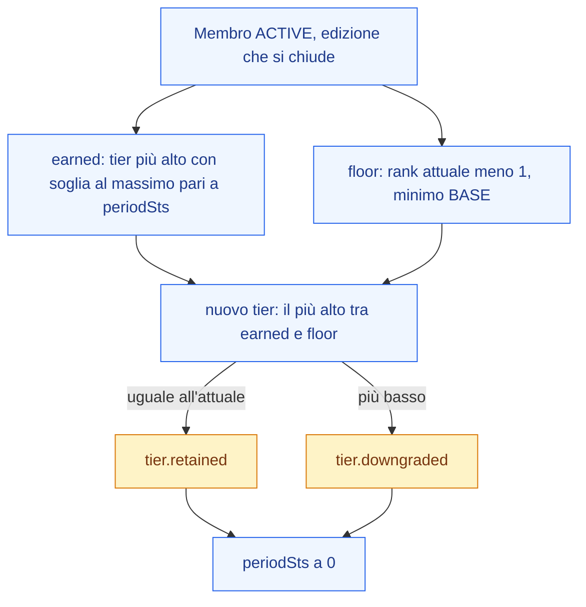

Loyalty Hub tratta il conto del membro come un libro mastro. Ogni movimento è tracciato e ha una motivazione. Questa pagina spiega la doppia valuta, la gestione dei lotti e il funzionamento dei tier.

## Doppia valuta: perché

Due valute perché servono scopi diversi:

| Valuta | Codice | Scopo | Spendibile |
| --- | --- | --- | --- |
| Punti premio | `PTS` | Il membro li spende per premi e coupon. | Sì |
| Punti status | `STS` | Determinano il tier del membro nell'edizione corrente. | No, mai spesi |

Un acquisto tipico accredita entrambi: `PTS` per essere consumati, `STS` per far salire il tier.

## Come si accreditano i punti

Ogni effetto `points.grant` crea un **lotto** con:

- `amount`: quantità di punti.
- `earned_at`: quando sono maturati (data di business).
- `available_at`: quando diventano disponibili (per campagne con delay).
- `expires_at`: quando scadono, in base alla policy della valuta.

Il saldo attivo di un membro è la somma dei lotti in stato `ACTIVE`.

## Come si spendono: FIFO

Il consumo dei punti segue la regola **first-in, first-out**: si consumano prima i lotti più vecchi. Questo protegge il membro dalla perdita di punti che stanno per scadere.

Ogni scrittura sul libro mastro crea:

- Una riga `ledger_entry` con importo, direzione (`+`/`−`), saldo dopo il movimento, correlazione con l'azione o la richiesta premio che l'ha causata.
- Le corrispondenti `lot_consumption` che dicono da quale lotto è stato prelevato quanto.

> **Nota:** Le rettifiche manuali (ruolo CARE o ADMIN) richiedono un motivo (`GOODWILL`, `CORRECTION`, `COMPLAINT`, `TEST`) e una nota di almeno 10 caratteri. La nota è visibile in audit.

## Tier: le regole

Il tier del membro è calcolato sui **punti status maturati nell'edizione corrente**.

### Salita e discesa

- **Salita immediata**: appena il membro supera la soglia del tier successivo, sale subito. La modifica emette il fatto `tier.upgraded` (che rientra come azione interna: puoi premiare la salita con una campagna).
- **Discesa morbida a fine edizione**: la retrocessione avviene solo alla chiusura dell'edizione annuale. Chi ha mantenuto la soglia resta; chi non l'ha mantenuta scende al livello raggiunto nel periodo.

### Il moltiplicatore di tier

Ogni tier ha un `multiplier` (per esempio Silver 1,2×, Gold 1,5×). Wallet applica il moltiplicatore ai punti calcolati dal motore. Il motore decide **quanti** punti dare; wallet **come** ampliarli in base al tier.

### Edizioni

Un'edizione è un periodo (di solito annuale) con:

- `start_date`, `end_date`.
- `redemption_grace_until`: finestra per richiedere premi dopo la chiusura.

Alla chiusura dell'edizione puoi eseguire un dry-run per prevedere quanti membri retrocedono, poi applicare la chiusura vera.

## Scadenza dei punti

Ogni valuta ha una `expiry_policy` (per esempio "rolling 12 mesi"). Un job periodico:

1. Emette **warning di scadenza** ai membri con punti in scadenza entro 30 giorni.
2. **Esperie i lotti** oltre la data, riducendo il saldo e registrando un movimento negativo di tipo `EXPIRE`.

## Cosa vede il membro nel portale

Il portale mostra:

- Saldo `PTS` attivo, pending (ancora non disponibili) e in scadenza a breve.
- Tier corrente, `STS` maturato nell'edizione, mancante al tier successivo, moltiplicatore.
- Elenco movimenti con titolo leggibile, icona per tipo, indicazione di `pending` ed `expiresAt` dove pertinente.

## Stati dei lotti e dell'edizione

I punti non sono un numero unico sul conto. Sono organizzati in lotti, ognuno con una vita propria. Anche l'edizione ha stati che determinano quando i punti scadono e quando il tier viene ricalcolato.

### Lotti punti

| Stato | Significato |
| --- | --- |
| `PENDING` | Accreditato ma non ancora spendibile (per esempio in attesa di conferma reso) |
| `ACTIVE` | Spendibile, incluso nel saldo del membro |
| `EXHAUSTED` | Consumato al 100% in richieste premio o rettifiche |
| `EXPIRED` | Scaduto per policy di scadenza della valuta |

Il consumo segue la regola **FIFO** (first in, first out): quando il membro spende punti, wallet preleva prima dai lotti `ACTIVE` più vecchi. Questo protegge i punti che stanno per scadere. Un rimborso non riapre i lotti consumati: ne crea uno nuovo.

```mermaid
stateDiagram-v2
  accTitle: Ciclo di vita di un lotto punti
  accDescr: Un lotto nasce in attesa se l'effetto prevede giorni di attesa, altrimenti attivo; il job di rilascio lo rende attivo; le spese FIFO e gli addebiti lo consumano fino a esaurirlo; il job di scadenza porta a scaduto un lotto attivo con residuo.
  [*] --> PENDING: accredito con pendingDays maggiore di 0
  [*] --> ACTIVE: accredito, rettifica a credito o rimborso
  PENDING --> ACTIVE: job di rilascio, availableAt raggiunto
  ACTIVE --> ACTIVE: spesa o addebito parziale
  ACTIVE --> EXHAUSTED: remaining a 0
  ACTIVE --> EXPIRED: job di scadenza, expiresAt raggiunto
  EXHAUSTED --> [*]
  EXPIRED --> [*]
```

### Edizione

| Stato | Significato |
| --- | --- |
| `PLANNED` | Creata, con date e soglie tier definite, ma non ancora attiva |
| `ACTIVE` | In corso: i nuovi accrediti `STS` puntano a questa edizione e il tier si calcola sui punti maturati qui |
| `CLOSED` | Chiusa: il calcolo tier è definitivo, i `STS` vengono ricalcolati; i `PTS` residui restano spendibili fino a `redemptionGraceUntil` |

Ce n'è una sola `ACTIVE` alla volta.

```mermaid
stateDiagram-v2
  accTitle: Ciclo di vita di un'edizione
  accDescr: Un'edizione nasce pianificata, diventa attiva quando si chiude la precedente e viene chiusa dal job annuale o dal comando demo; ce n'è una sola attiva alla volta.
  [*] --> PLANNED
  PLANNED --> ACTIVE: chiusura della precedente, la PLANNED con inizio più vicino
  ACTIVE --> CLOSED: chiusura edizione, job annuale o comando demo
  CLOSED --> [*]
```

<Warning>
  Alla chiusura di un'edizione gli `STS` azzerati non sono recuperabili. Pianifica la chiusura con attenzione.
</Warning>

### Chiusura dell'edizione e discesa morbida

Alla chiusura, per ogni membro `ACTIVE`, il nuovo tier è il più alto tra quello guadagnato con gli `STS` dell'edizione e quello un gradino sotto l'attuale. La salita non avviene mai in chiusura: è già immediata durante l'anno.

## Prossimo passo

Ora che il saldo è chiaro, scopri come il membro lo trasforma in valore in [Premi e gioco](concetti/premi-e-gioco).
