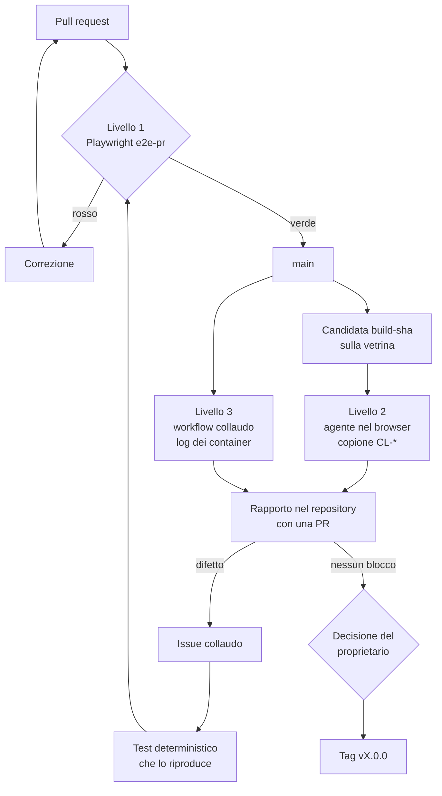
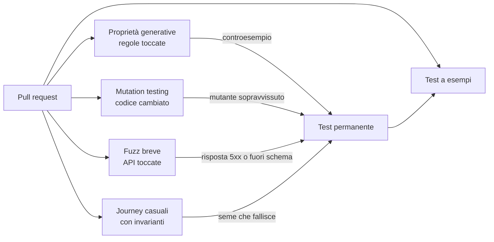
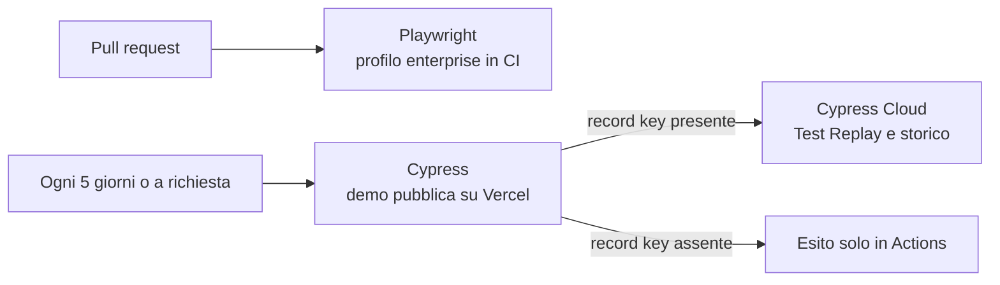

Una major release di Loyalty Hub passa da tre livelli di test. Ognuno copre ciò che gli altri non vedono: il cancello automatico impedisce le regressioni, il collaudo nel browser trova i difetti che nessuno ha previsto, i log dei servizi spiegano perché un errore è successo. La decisione è registrata in ADR-052.

<Note>
Il livello 1 è un cancello: se è rosso la release non parte. Il collaudo del livello 2 è consultivo: produce un rapporto e la decisione di rilascio resta al proprietario del progetto.
</Note>

## Perché tre livelli

- **Playwright in CI** ripete sempre gli stessi percorsi nello stesso modo. Protegge da ciò che è già noto, ma non trova ciò che nessuno ha scritto.
- **Un agente nel browser**, una sessione cloud di Claude con un browser senza interfaccia o Claude in Chrome, usa la vetrina come una persona: legge i testi, prova i flussi, nota gli errori in console e le richieste fallite. Trova difetti nuovi, ma due esecuzioni non sono mai identiche e non può fare da cancello.
- **I log dei servizi** stanno nei container, che il browser non vede. Servono per collegare un errore visto sullo schermo alla sua causa.

## Il flusso di una major release

## Come il cancello cerca i bug non noti

Un test a esempi controlla solo il caso che hai previsto. Per trovare anche i difetti che nessuno ha immaginato, ogni pull request passa da quattro controlli in più (ADR-053):

- **Proprietà generative**: una regola di dominio, come «il saldo è la somma dei lotti attivi», si verifica su migliaia di sequenze generate. Il generatore cerca il controesempio più piccolo.
- **Mutation testing sul codice cambiato**: lo strumento introduce piccoli difetti nel codice nuovo e controlla che almeno un test fallisca.
- **Fuzz breve delle API**: richieste generate dalle OpenAPI dei servizi toccati, senza risposte `5xx` e conformi allo schema.
- **Journey casuali con invarianti**: sequenze casuali di azioni di membri e operatori, con le invarianti di bilancio verificate dopo ogni ciclo.

<Tip>
Ogni esecuzione generativa stampa il seme. Per riprodurre un fallimento, rilancia il test con lo stesso seme.
</Tip>

## La demo pubblica ogni cinque giorni

Playwright verifica il profilo `enterprise` nelle pull request. La demo pubblica, nel profilo `demo` con le persone simulate, la verifica Cypress ogni cinque giorni e a richiesta, con le corse registrate su Cypress Cloud (ADR-054). Così puoi rivedere ogni test dal browser, passo per passo, senza terminale.

<Note>
Il piano gratuito di Cypress Cloud limita i risultati registrati ogni mese. Oltre il limite le corse continuano, senza registrazione.
</Note>

## Cosa vede ogni livello

| Livello | Dove gira | Cosa vede | Esito |
| --- | --- | --- | --- |
| 1. Playwright | GitHub Actions, compose `enterprise` | pagine, invarianti, accessibilità | verde o rosso, blocca il merge |
| 2. Agente nel browser | sessione cloud di Claude con Chromium, oppure Claude in Chrome; vetrina | DOM, console, rete, screenshot | rapporto consultivo |
| 3. Log dei servizi | GitHub Actions, compose `enterprise` | log di hub, web, Keycloak, Kafka, Postgres | artefatto del workflow |

<Warning>
Il collaudo usa solo le credenziali di test pubbliche della vetrina, descritte in [Vetrina enterprise](/concetti/vetrina-enterprise). Non usare mai credenziali di un'altra installazione.
</Warning>

## Stato

L'harness Playwright (M9.1) esiste: sta in `e2e/` e il job `e2e-pr` lo esegue sul compose `enterprise`, con il login vero di Keycloak e la MFA. Per ora copre quattro prove e il job è consultivo: non è ancora tra i controlli obbligatori del merge. Accanto, nello stesso pacchetto, Cypress (M9.8a, ADR-054) prova la demo pubblica in profilo `demo` ogni cinque giorni e a richiesta, con la registrazione su Cypress Cloud: sta fuori dalle pull request e non è un livello del cancello. Il copione di collaudo, il workflow dei log, il `correlationId` negli errori e i quattro controlli per i bug non noti si aggiungono in fette successive. Le scelte sui controlli sono le domande Q-690…Q-694, decise il 2026-10-02. Le scelte di dettaglio sono le domande Q-680…Q-685, decise il 2026-10-02.
