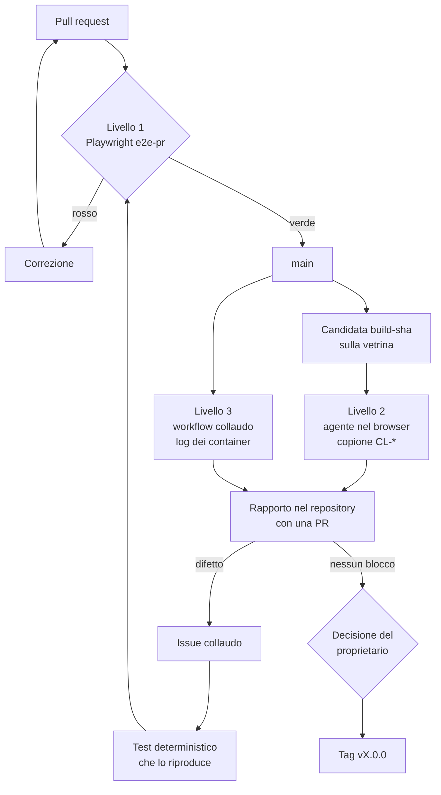

Una major release di Loyalty Hub passa da tre livelli di test. Ognuno copre ciò che gli altri non vedono: il cancello automatico impedisce le regressioni, il collaudo nel browser trova i difetti che nessuno ha previsto, i log dei servizi spiegano perché un errore è successo. La decisione è registrata in ADR-052.

<Note>
Il livello 1 è un cancello: se è rosso la release non parte. Il collaudo del livello 2 è consultivo: produce un rapporto e la decisione di rilascio resta al proprietario del progetto.
</Note>

## Perché tre livelli

- **Playwright in CI** ripete sempre gli stessi percorsi nello stesso modo. Protegge da ciò che è già noto, ma non trova ciò che nessuno ha scritto.
- **Un agente nel browser**, una sessione cloud di Claude con un browser senza interfaccia o Claude in Chrome, usa la vetrina come una persona: legge i testi, prova i flussi, nota gli errori in console e le richieste fallite. Trova difetti nuovi, ma due esecuzioni non sono mai identiche e non può fare da cancello.
- **I log dei servizi** stanno nei container, che il browser non vede. Servono per collegare un errore visto sullo schermo alla sua causa.

## Il flusso di una major release

## Cosa vede ogni livello

| Livello | Dove gira | Cosa vede | Esito |
| --- | --- | --- | --- |
| 1. Playwright | GitHub Actions, compose `enterprise` | pagine, invarianti, accessibilità | verde o rosso, blocca il merge |
| 2. Agente nel browser | sessione cloud di Claude con Chromium, oppure Claude in Chrome; vetrina | DOM, console, rete, screenshot | rapporto consultivo |
| 3. Log dei servizi | GitHub Actions, compose `enterprise` | log di hub, web, Keycloak, Kafka, Postgres | artefatto del workflow |

<Warning>
Il collaudo usa solo le credenziali di test pubbliche della vetrina, descritte in [Vetrina enterprise](/concetti/vetrina-enterprise). Non usare mai credenziali di un'altra installazione.
</Warning>

## Stato

Il cancello Playwright (M9.1), il copione di collaudo, il workflow dei log e il `correlationId` negli errori si aggiungono in fette successive. I dettagli aperti sono le domande Q-680…Q-685.
