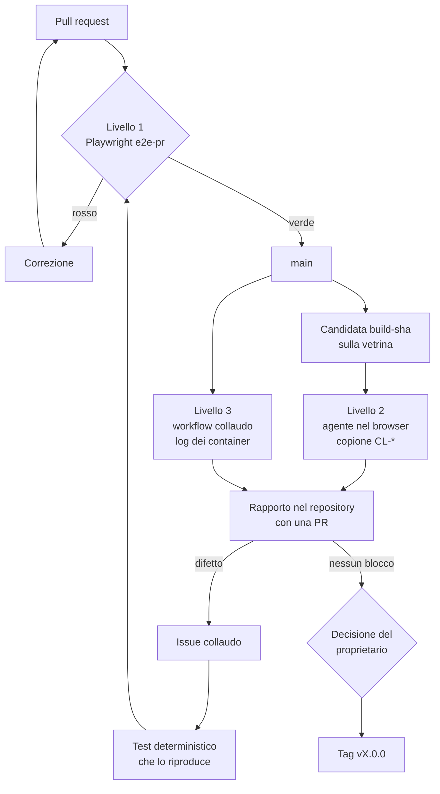
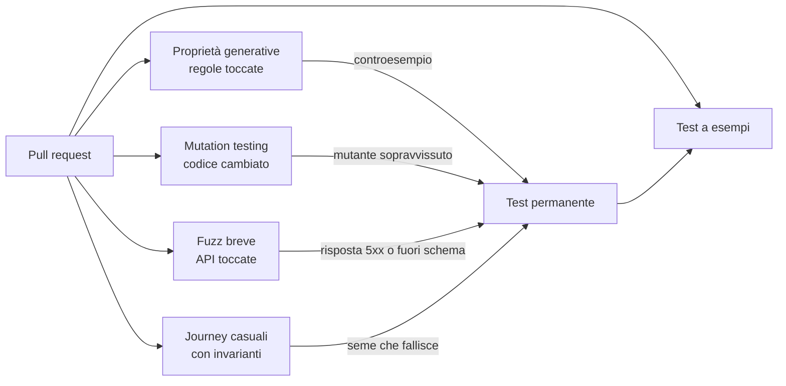
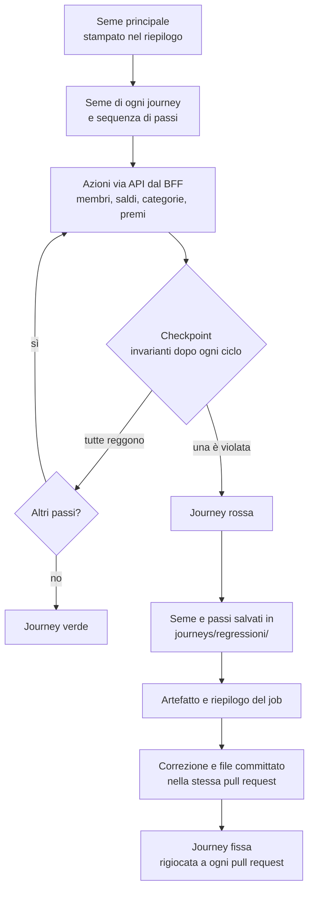
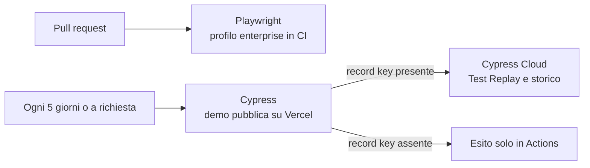
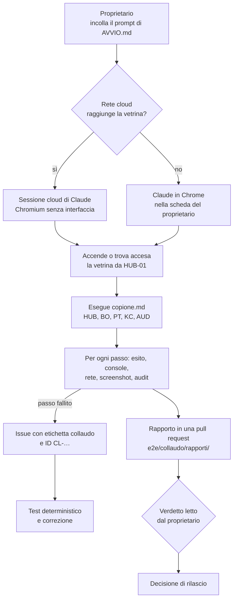
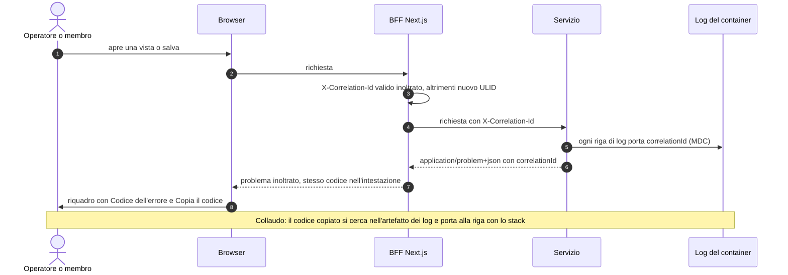

Una major release di Loyalty Hub passa da tre livelli di test. Ognuno copre ciò che gli altri non vedono: il cancello automatico impedisce le regressioni, il collaudo nel browser trova i difetti che nessuno ha previsto, i log dei servizi spiegano perché un errore è successo. La decisione è registrata in ADR-052.

<Note>
Il livello 1 è un cancello: se è rosso la release non parte. Il collaudo del livello 2 è consultivo: produce un rapporto e la decisione di rilascio resta al proprietario del progetto.
</Note>

## Perché tre livelli

- **Playwright in CI** ripete sempre gli stessi percorsi nello stesso modo. Protegge da ciò che è già noto, ma non trova ciò che nessuno ha scritto.
- **Un agente nel browser**, una sessione cloud di Claude con un browser senza interfaccia o Claude in Chrome, usa la vetrina come una persona: legge i testi, prova i flussi, nota gli errori in console e le richieste fallite. Trova difetti nuovi, ma due esecuzioni non sono mai identiche e non può fare da cancello.
- **I log dei servizi** stanno nei container, che il browser non vede. Servono per collegare un errore visto sullo schermo alla sua causa.

## Il flusso di una major release



## Come il cancello cerca i bug non noti

Un test a esempi controlla solo il caso che hai previsto. Per trovare anche i difetti che nessuno ha immaginato, ogni pull request passa da quattro controlli in più (ADR-053):

- **Proprietà generative**: una regola di dominio, come «il saldo è la somma dei lotti attivi», si verifica su migliaia di sequenze generate. Il generatore cerca il controesempio più piccolo.
- **Mutation testing sul codice cambiato**: lo strumento introduce piccoli difetti nel codice nuovo e controlla che almeno un test fallisca.
- **Fuzz breve delle API**: richieste generate dalle OpenAPI dei servizi toccati, senza risposte `5xx` e conformi allo schema.
- **Journey casuali con invarianti**: sequenze casuali di azioni di membri e operatori, con le invarianti di bilancio verificate dopo ogni ciclo.



<Tip>
Ogni esecuzione generativa stampa il seme. Per riprodurre un fallimento, rilancia il test con lo stesso seme.
</Tip>

### Journey casuali con invarianti

Una journey è una sequenza di azioni scelte a caso da un seme: registrare un membro, rettificare il suo saldo, leggere il portafoglio, creare una categoria o un premio, cambiarne lo stock. Le azioni usano le API vere, attraverso il BFF e la sessione dell'operatore, sullo stesso stack `enterprise` del cancello. Ogni pull request ne esegue 20; il workflow `e2e-nightly` ne esegue 500 ogni notte (Q-693).

Dopo ogni ciclo, cioè ogni 3-5 azioni e alla fine, la journey verifica le invarianti di bilancio leggendo le API:

- la somma dei lotti è uguale al saldo;
- la somma dei mesi di scadenza è uguale ai punti in circolazione;
- lo stock residuo non supera il totale;
- il registro dei messaggi non ha doppioni;
- ogni scrittura di configurazione ha una sola voce di audit, con l'attore reale;
- nessuna voce nuova è finita nella DLQ.



<Tip>
Il seme principale è nel riepilogo del job. Per ripetere la stessa corsa imposta `LH_JOURNEY_SEED` con quel numero. Per rigiocare solo la journey che ha fallito, usa il suo file in `e2e/journeys/regressioni/`.
</Tip>

<Warning>
Le invarianti non sono tutte osservabili con le API di oggi: il tracciato completo di ogni `contest.won` e la somma dei lotti su tutti i wallet non si possono ancora verificare (Q-717). Riscatti, concorsi e accrediti da campagna entreranno quando i test avranno un secondo operatore e un membro con il suo token (Q-719).
</Warning>

Per lanciarle in locale, dopo aver acceso lo stack con `bash scripts/smoke-enterprise.sh up`:

```bash
# Prove senza stack: il generatore dà sempre gli stessi passi per lo stesso seme
cd e2e && pnpm test:unit && pnpm test:mock
# Cinque journey casuali con un seme scelto da te
LH_JOURNEY_SEED=42 LH_JOURNEY_COUNT=5 pnpm exec playwright test tests/journey-casuali.spec.ts
```

## La demo pubblica ogni cinque giorni

Playwright verifica il profilo `enterprise` nelle pull request. La demo pubblica, nel profilo `demo` con le persone simulate, la verifica Cypress ogni cinque giorni e a richiesta, con le corse registrate su Cypress Cloud (ADR-054). Così puoi rivedere ogni test dal browser, passo per passo, senza terminale.



<Note>
Il piano gratuito di Cypress Cloud limita i risultati registrati ogni mese. Oltre il limite le corse continuano, senza registrazione.
</Note>

## Cosa vede ogni livello

| Livello | Dove gira | Cosa vede | Esito |
| --- | --- | --- | --- |
| 1. Playwright | GitHub Actions, compose `enterprise` | pagine, invarianti, accessibilità | verde o rosso, blocca il merge |
| 2. Agente nel browser | sessione cloud di Claude con Chromium, oppure Claude in Chrome; vetrina | DOM, console, rete, screenshot | rapporto consultivo |
| 3. Log dei servizi | GitHub Actions, compose `enterprise` | log di hub, web, Keycloak, Kafka, Postgres | artefatto del workflow |

<Warning>
Il collaudo usa solo le credenziali di test pubbliche della vetrina, descritte in [Vetrina enterprise](/concetti/vetrina-enterprise). Non usare mai credenziali di un'altra installazione.
</Warning>

## Come si avvia il collaudo di release

Il collaudo del livello 2 segue un copione scritto nel repository. Il copione dice, passo per passo, con quale utente di test entrare, cosa fare, cosa aspettarsi e quali prove raccogliere. Così due esecuzioni diverse cercano le stesse cose, anche se non sono mai identiche.

### Prerequisiti

- La candidata `build-<sha>` è sulla vetrina (vedi [Vetrina enterprise](/concetti/vetrina-enterprise)) e il livello 1 è verde.
- La rete dell'ambiente cloud di Claude ammette gli indirizzi `*.app.github.dev` della vetrina.
- Hai a disposizione una sessione cloud di Claude in un thread del progetto. In alternativa, Claude in Chrome nella tua scheda del browser.

### Primi passi

1. Apri `e2e/collaudo/AVVIO.md` nel repository e copia il prompt di avvio.
2. Sostituisci la versione (`vX.0.0`) e la candidata (`build-<sha>`).
3. Incolla il prompt in una sessione cloud di Claude. Non devi tenere aperto nulla: l'agente accende la vetrina dal Demo Hub se è spenta e guida un browser senza interfaccia.
4. Attendi la pull request `test(collaudo): rapporto vX.0.0`. Contiene il rapporto, con un esito per ogni passo, le evidenze, i difetti e il verdetto.
5. Leggi il verdetto e decidi tu il rilascio: il collaudo è consultivo.

Se la rete cloud non raggiunge la vetrina, o se vuoi guardare il collaudo mentre gira, usa Claude in Chrome: lo stesso prompt, nella tua scheda, con una finestra in incognito per ogni utente.



### Cosa copre il copione

Il copione `e2e/collaudo/copione.md` ha circa quaranta passi con ID `CL-<AREA>-NNN`, in cinque aree. Ogni passo dichiara l'utente di test, le precondizioni, le azioni, l'esito atteso, le evidenze da raccogliere e gli ID delle specifiche che verifica.

| Area | Cosa verifica | Utenti di test |
| --- | --- | --- |
| `HUB` | Accensione della vetrina dal riquadro «Modalità Enterprise» della demo pubblica, HUB-02, schede degli utenti di test | nessuno |
| `BO` | Un operatore per ruolo, con login, OTP, azioni consentite e azioni negate; il percorso di una campagna e di un premio dalla bozza alla pubblicazione con i quattro occhi | `marta.admin`, `luca.marketing`, `elena.legal`, `paolo.care`, `sara.analyst` |
| `PT` | Saldo, livello, un'azione che dà punti e il riscatto di un premio; il membro viene solo dal token | `anna.rossi`, `marco.bianchi`, `giulia.ferri` |
| `KC` | Console dei due realm pubbliche ma limitate, realm `master` chiuso al pubblico | `vetrina.admin`, `membri.admin` |
| `AUD` | Ogni scrittura di configurazione fatta nei passi `BO` compare in Audit con l'attore reale | `sara.analyst` in sola lettura |

<Warning>
Il collaudo usa solo le credenziali di test pubbliche della vetrina. Le trovi nel runbook `deploy/vetrina/README.md` e in [Vetrina enterprise](/concetti/vetrina-enterprise): il copione non le ricopia. Non scrivere mai password, seme OTP, cookie o token nel rapporto o nelle issue.
</Warning>

### Cosa succede ai difetti

Ogni passo che non dà l'esito atteso diventa una issue GitHub con l'etichetta `collaudo` e l'ID del passo nel titolo. La issue si chiude solo con un test deterministico che riproduce il difetto, una journey Playwright o una riga del testbook, e con la correzione. Così il collaudo esplorativo fa crescere il cancello del livello 1 a ogni release.

### Verifica del copione

Il controllo `scripts/check-collaudo.mjs`, nel job `guard` di ogni pull request, tiene il copione in ordine: ID unici, campi obbligatori in ogni passo, ID di specifica che esistono in `docs/`, ogni scrittura di configurazione coperta da un passo di audit e nessuna credenziale ricopiata.

```bash
# Verifica il copione, il prompt di avvio e il modello del rapporto
node --test scripts/check-collaudo.test.mjs && node scripts/check-collaudo.mjs
```

## Dal messaggio d'errore alla riga di log

Quando un servizio va in errore, la schermata mostra un **codice dell'errore** breve, con il pulsante «Copia il codice». È lo stesso codice che il servizio ha scritto in ogni riga di log di quella richiesta, compresa quella con lo stack: chi fa il collaudo lo cerca nei log del container e trova subito la causa. Il codice non contiene dati personali. Compare sui guasti, cioè sugli errori `5xx` e sui `4xx` inattesi, e non sugli errori di validazione dei campi, che restano sui campi.



## Stato

L'harness Playwright (M9.1) esiste: sta in `e2e/` e il job `e2e-pr` lo esegue sul compose `enterprise`, con il login vero di Keycloak e la MFA. Per ora copre cinque prove e il job è consultivo: non è ancora tra i controlli obbligatori del merge. Accanto, nello stesso pacchetto, Cypress (M9.8a, ADR-054) prova la demo pubblica in profilo `demo` ogni cinque giorni e a richiesta, con la registrazione su Cypress Cloud: sta fuori dalle pull request e non è un livello del cancello. Il workflow `collaudo` (M9 T3, Q-683) alza lo stack `enterprise`, esegue le journey Playwright e allega come artefatto, conservato 14 giorni, i log di ogni container, caricati solo se gitleaks non trova segreti; parte a mano e sui tag `v*.0.0`. Il copione di collaudo (M9 T2, `e2e/collaudo/`) esiste, con il prompt di avvio, il modello del rapporto e il controllo `scripts/check-collaudo.mjs` nel job `guard`. Il codice dell'errore (F2-QA-06, Q-684, Q-716) c'è: ogni servizio mette `X-Correlation-Id` nei log e nella proprietà `correlationId` dei problemi, le schermate lo mostrano sui guasti con «Copia il codice» e una prova Playwright verifica che il codice mostrato sia quello della risposta. Le journey casuali con invarianti (M9.7d, Q-693) girano nel job `e2e-pr`, 20 per pull request, e nel workflow `e2e-nightly`, 500 di notte entro un tetto di tempo (Q-718); un seme che fallisce si salva in `e2e/journeys/regressioni/` e diventa una journey fissa. Gli altri controlli per i bug non noti si aggiungono in fette successive. Il job `mutation` (F2-QA-07) è consultivo: su ogni pull request lancia PIT sulle classi Java e Stryker sui file del web cambiati rispetto a `main` (`bash scripts/mutation.sh all`) e scrive nel riepilogo i mutanti uccisi e sopravvissuti; diventerà obbligatorio, con almeno il 70 % di mutanti uccisi sul diff, alla chiusura di M9. Il job `fuzz` (F2-QA-07, Q-692) è consultivo: su ogni pull request riusa `scripts/security-fuzz.sh` del collaudo notturno sulle sole OpenAPI dei servizi toccati, al massimo cinque minuti per servizio, cerca risposte `5xx` e risposte fuori schema, scrive nel riepilogo servizi, richieste ed errori e conserva il report 14 giorni; se nessun servizio cambia esce verde senza richieste. Le scelte sui controlli sono le domande Q-690…Q-694, decise il 2026-10-02. Le scelte di dettaglio sono le domande Q-680…Q-685, decise il 2026-10-02.
