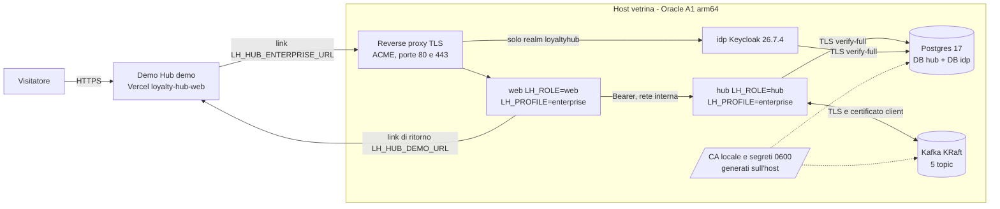
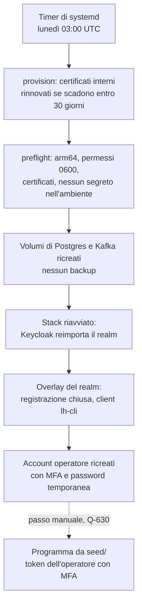
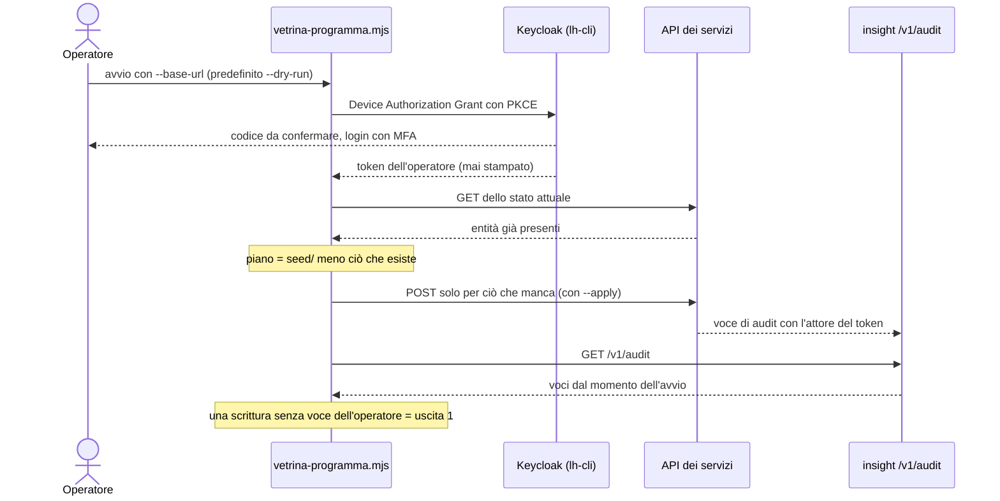
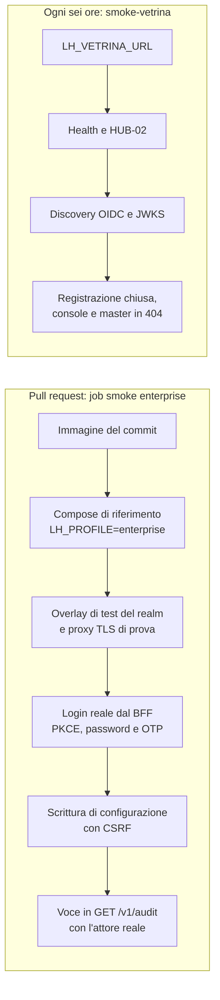

La demo pubblica di Loyalty Hub gira nel profilo `demo`: persone simulate, identità con l'header `X-LH-Actor` e dati del seed. Il profilo `enterprise` (login reale, deny by default, audit con l'attore del token) non si può vedere online con quella demo: si prova installandolo. La **vetrina enterprise** è una seconda installazione ospitata, sempre in `LH_PROFILE=enterprise`, che il Demo Hub raggiunge con un pulsante.

<Note>
La vetrina è una prova da guardare, non un servizio di produzione: non è ad alta disponibilità, contiene solo dati fittizi e si azzera periodicamente.
</Note>

<Note>
**Stato.** L'architettura è decisa (ADR-049) e l'overlay per installare l'istanza è pronto (`deploy/vetrina/`, fetta M8.14c); le altre parti si realizzano con le fette di M8.14 (piano in `docs/18`). Finché la vetrina non è collegata, il pulsante nel Demo Hub resta nascosto.
</Note>

## Come sono collegate le due istanze

Il pulsante non cambia il profilo della demo. Il profilo si fissa all'avvio, lato server, e una configurazione insicura fa uscire il processo; inoltre un interruttore su un'istanza condivisa cambierebbe la modalità a tutti i visitatori. Il pulsante è quindi **un collegamento a un'altra origine**: nessuno stato, cookie, database o bus in comune.

| Ruolo | Dove | Note |
|---|---|---|
| `web` | container sull'host, una replica | Le sessioni del BFF stanno in memoria: un riavvio le chiude e si rientra con l'SSO. |
| `hub` | container sull'host, non esposto | Esegue le migrazioni all'avvio. |
| `idp` | Keycloak con Postgres come database | Un realm da `deploy/idp/realm.json` più un overlay di vetrina: registrazione chiusa, nessuna credenziale pubblicata e un client pubblico `lh-cli` (Device Authorization Grant, con consenso esplicito e ruoli limitati a quelli operatore) per la CLI dell'operatore (Q-626, decisa il 2026-09-30). L'OTP vale per gli account con `MFA_REQUIRED_ROLE` e lo script del realm fallisce per un operatore che non lo ha (Q-618, decisa il 2026-09-30). |
| Postgres e Kafka | sull'host, nel compose | Database e broker **propri**, mai condivisi con la demo. Il traffico verso entrambi è in TLS, con certificati di una CA locale generata sull'host (Q-621): Postgres rifiuta le connessioni in chiaro, Kafka chiede il certificato del client. |
| Reverse proxy TLS | sull'host, porte 80 e 443 | Unico componente esposto, con certificati ACME per due nomi, `web` e `idp` (Q-620); è la parte che distingue il compose della vetrina da quello di riferimento. La console di amministrazione di Keycloak non passa dal proxy. |

L'hosting è un host Oracle Cloud Always Free A1, senza costo e senza sospensione per inattività del traffico (Q-615). Il bus è un broker Kafka KRaft sullo stesso host, con gli stessi 5 topic della demo (Q-616).

## Cosa si ottiene

- **Login OIDC reale** con Keycloak: BFF confidential con PKCE, cookie `__Host-` HttpOnly, CSRF, back-channel logout e MFA con OTP per gli operatori.
- **Servizi come resource server JWT**: l'attore viene dal token, ogni endpoint dichiara il suo ruolo e il profilo non parte con una configurazione insicura.
- **Backoffice con attori reali**: ogni scrittura di configurazione lascia una voce nell'audit con l'attore del token.
- **Una prova d'installazione**: la vetrina usa la stessa immagine unica e lo stesso compose che userebbe chi adotta il prodotto.
- **Andata e ritorno**: dal pulsante di HUB-01 si passa alla vetrina, da HUB-02 si torna alla demo.

## Cosa non si ottiene

- **Alta disponibilità**: un solo host, un broker, un Postgres e una replica del web. Gli obiettivi di livello del servizio di ADR-036 non valgono per la vetrina.
- **Dati reali**: solo dati fittizi, nessun backup e nessuna garanzia di conservazione. La vetrina si azzera ogni settimana e lo dice nel banner di HUB-02 (Q-624).
- **Persone demo**: al posto del selettore di persona c'è il login, e i membri `MBR-*` del seed non esistono in questa istanza.
- **Portale membri**: nel primo passo è chiuso, con la registrazione disattivata (Q-619).
- **Scenari che accreditano punti**: in `enterprise` l'ingresso degli eventi accetta solo il ruolo `SOURCE` (un client `private_key_jwt` per fonte) o un `ADMIN`; le fonti di prova non hanno chiavi pubblicate e gli scenari demo (`/v1/demo/**`) non esistono in questa istanza.
- **Tempo reale in BO-24**: la schermata resta in stato *degraded* finché non c'è un proxy per gli eventi in tempo reale (Q-622).
- **Assistente e CMS**: spenti o non installati in questa istanza.
- **Disponibilità garantita**: dipende dal piano gratuito del fornitore, che ha capacità limitata, può recuperare un'istanza rimasta inattiva e può ridurre le risorse senza preavviso (dal 15 giugno 2026: 2 OCPU e 12 GB in tutto).

## Azzeramento settimanale

La vetrina si azzera ogni lunedì, senza backup (Q-624). Un timer sull'host esegue `deploy/vetrina/vetrina.sh reset`: ricrea i dati, reimporta il realm e ricrea gli account operatore. Il certificato pubblico del proxy resta, così l'azzeramento non consuma le emissioni ACME. L'ultimo passo, la configurazione del programma, chiede l'approvazione di un operatore con MFA e quindi resta manuale (Q-630).

## Accesso degli operatori

Nessuna password è pubblicata: il primo visitatore la cambierebbe e legherebbe l'OTP al proprio telefono. La regola è che la MFA resta sempre richiesta. La decisione (Q-618, 2026-09-30) è che gli account operatore siano **nominativi**, creati dal proprietario su richiesta, con password temporanea consegnata fuori banda. A ogni azzeramento gli account si ricreano dall'elenco tenuto sull'host, con una nuova password temporanea.

## Configurazione del programma

In `enterprise` non c'è un seeder, quindi la vetrina parte vuota. La configurazione del programma arriva da `seed/` con `scripts/vetrina-programma.mjs`, che usa solo le API REST dei servizi e il token di un operatore nominativo (Q-617, decisa il 2026-09-30). Lo script crea tema e messaggi, categorie, fasce, pool di coupon e premi, attributi e segmenti dinamici, badge, obiettivi e classifiche. Non entrano membri, movimenti né altri dati personali. I premi nascono in `DRAFT` e lo script non approva né pubblica nulla. Valute, livelli, tipi di azione `SYSTEM` e mappature interne non hanno un'API di creazione: lo script li salta e li riporta nel piano, e arrivano con le migrazioni dei dati di riferimento (Q-629).

## Verifiche automatiche

Due prove tengono d'occhio il profilo `enterprise`, una prima del rilascio e una sulla vetrina accesa (M8.14, F2-QA-04).

- **Prima del merge.** Il job `smoke enterprise (compose, OIDC)` di `ci.yml` avvia il compose di riferimento con l'immagine della pull request e l'overlay di test del realm. Un operatore fa un login vero dal backoffice: password temporanea cambiata, OTP configurato e codice inserito, senza scorciatoie sui client di produzione. Poi scrive una configurazione e il job cerca la voce in `GET /v1/audit` con l'attore reale. Prova anche i rifiuti: `401` senza token, `403` senza token CSRF, `404 PERSONA_DISABLED` sul selettore di persona. Segreti e certificati di prova nascono nel job e non compaiono nei log.
- **Sulla vetrina.** Il workflow `smoke-vetrina.yml` gira ogni sei ore, senza credenziali e solo in lettura. Controlla la health, HUB-02 con le tessere attive, la discovery OIDC del realm `loyaltyhub`, la registrazione chiusa e che console e realm `master` non siano esposti. La health di hub, database e bus arriva dalle tessere di HUB-02, perché il proxy non espone altro (Q-650). Finché la variabile `LH_VETRINA_URL` del repository è vuota, il workflow si ferma con un avviso.

## Decisione

La decisione, le alternative scartate e i limiti dichiarati sono in [ADR-049](https://github.com/peppe-ruv/Loyalty_Sys/blob/main/docs/13-REGISTRO-DECISIONI.md). Hosting, bus, dati del programma, accesso degli operatori, portale e client `lh-cli` sono decisi (Q-615…Q-619, Q-626, Q-629); dominio e TLS, TLS verso bus e database, tempo reale, `render.yaml` e azzeramento sono decisi con il default proposto (Q-620…Q-624, il 2026-10-01). Il dettaglio è in [Domande aperte](https://github.com/peppe-ruv/Loyalty_Sys/blob/main/docs/15-DOMANDE-APERTE.md). Per installare lo stesso profilo sulla propria infrastruttura vedi [Installazione enterprise](/operations/installazione-enterprise).
