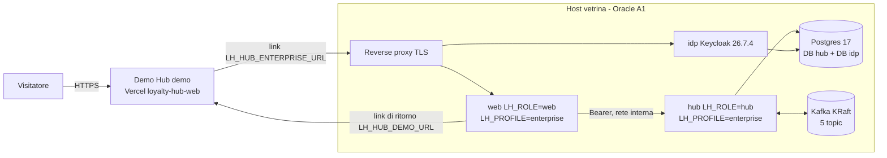

La demo pubblica di Loyalty Hub gira nel profilo `demo`: persone simulate, identità con l'header `X-LH-Actor` e dati del seed. Il profilo `enterprise` (login reale, deny by default, audit con l'attore del token) non si può vedere online con quella demo: si prova installandolo. La **vetrina enterprise** è una seconda installazione ospitata, sempre in `LH_PROFILE=enterprise`, che il Demo Hub raggiunge con un pulsante.

<Note>
La vetrina è una prova da guardare, non un servizio di produzione: non è ad alta disponibilità, contiene solo dati fittizi e si azzera periodicamente.
</Note>

<Note>
**Stato.** L'architettura è decisa (ADR-049); l'istanza e il pulsante si realizzano con le fette di M8.14 (piano in `docs/18`). Finché la vetrina non è collegata, il pulsante nel Demo Hub resta nascosto.
</Note>

## Come sono collegate le due istanze

Il pulsante non cambia il profilo della demo. Il profilo si fissa all'avvio, lato server, e una configurazione insicura fa uscire il processo; inoltre un interruttore su un'istanza condivisa cambierebbe la modalità a tutti i visitatori. Il pulsante è quindi **un collegamento a un'altra origine**: nessuno stato, cookie, database o bus in comune.

| Ruolo | Dove | Note |
|---|---|---|
| `web` | container sull'host, una replica | Le sessioni del BFF stanno in memoria: un riavvio le chiude e si rientra con l'SSO. |
| `hub` | container sull'host, non esposto | Esegue le migrazioni all'avvio. |
| `idp` | Keycloak con Postgres come database | Un realm da `deploy/idp/realm.json` più un overlay di vetrina. |
| Postgres e Kafka | sull'host, nel compose | Database e broker **propri**, mai condivisi con la demo. |
| Reverse proxy TLS | sull'host, porte 80 e 443 | Unico componente esposto; è la parte che distingue il compose della vetrina da quello di riferimento. |

L'hosting è un host Oracle Cloud Always Free A1, senza costo e senza sospensione per inattività del traffico (Q-615). Il bus è un broker Kafka KRaft sullo stesso host, con gli stessi 5 topic della demo (Q-616).

## Cosa si ottiene

- **Login OIDC reale** con Keycloak: BFF confidential con PKCE, cookie `__Host-` HttpOnly, CSRF, back-channel logout e MFA con OTP per gli operatori.
- **Servizi come resource server JWT**: l'attore viene dal token, ogni endpoint dichiara il suo ruolo e il profilo non parte con una configurazione insicura.
- **Backoffice con attori reali**: ogni scrittura di configurazione lascia una voce nell'audit con l'attore del token.
- **Una prova d'installazione**: la vetrina usa la stessa immagine unica e lo stesso compose che userebbe chi adotta il prodotto.
- **Andata e ritorno**: dal pulsante di HUB-01 si passa alla vetrina, da HUB-02 si torna alla demo.

## Cosa non si ottiene

- **Alta disponibilità**: un solo host, un broker, un Postgres e una replica del web. Gli obiettivi di livello del servizio di ADR-036 non valgono per la vetrina.
- **Dati reali**: solo dati fittizi, nessun backup e nessuna garanzia di conservazione. La vetrina si azzera periodicamente e lo dice nel banner di HUB-02 (Q-624).
- **Persone demo**: al posto del selettore di persona c'è il login, e i membri `MBR-*` del seed non esistono in questa istanza.
- **Portale membri**: nel primo passo è chiuso, con la registrazione disattivata (Q-619).
- **Scenari che accreditano punti**: in `enterprise` l'ingresso degli eventi accetta solo il ruolo `SOURCE` (un client `private_key_jwt` per fonte) o un `ADMIN`; le fonti di prova non hanno chiavi pubblicate e gli scenari demo (`/v1/demo/**`) non esistono in questa istanza.
- **Tempo reale in BO-24**: la schermata resta in stato *degraded* finché non c'è un proxy per gli eventi in tempo reale (Q-622).
- **Assistente e CMS**: spenti o non installati in questa istanza.
- **Disponibilità garantita**: dipende dal piano gratuito del fornitore, che ha capacità limitata e può recuperare un'istanza rimasta inattiva.

## Accesso degli operatori

Nessuna password è pubblicata: il primo visitatore la cambierebbe e legherebbe l'OTP al proprio telefono. La regola è che la MFA resta sempre richiesta. Il default proposto (Q-618, ancora aperta) è che gli account operatore siano **nominativi**, creati dal proprietario su richiesta, con password temporanea consegnata fuori banda.

## Decisione e domande aperte

La decisione, le alternative scartate e i limiti dichiarati sono in [ADR-049](https://github.com/peppe-ruv/Loyalty_Sys/blob/main/docs/13-REGISTRO-DECISIONI.md). I dettagli attuativi (dati del programma, dominio e TLS, TLS verso bus e database, azzeramento) sono ancora domande aperte con un default indicato: Q-617…Q-624 in [Domande aperte](https://github.com/peppe-ruv/Loyalty_Sys/blob/main/docs/15-DOMANDE-APERTE.md). Per installare lo stesso profilo sulla propria infrastruttura vedi [Installazione enterprise](/operations/installazione-enterprise).
