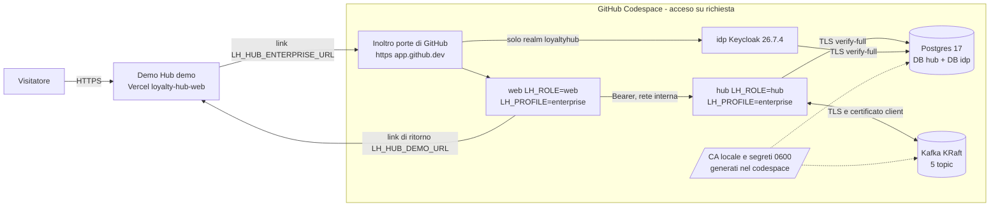
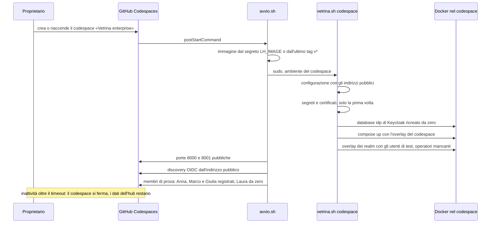
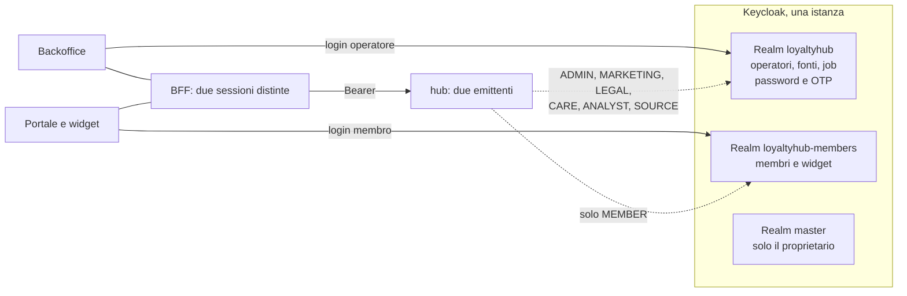
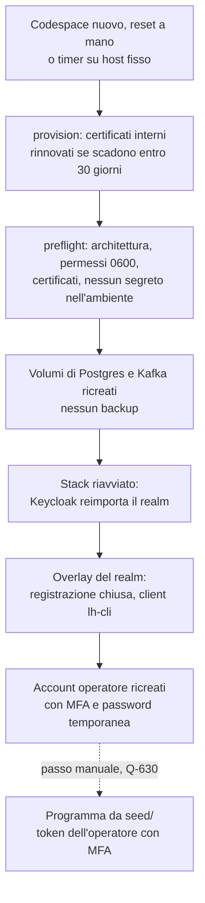
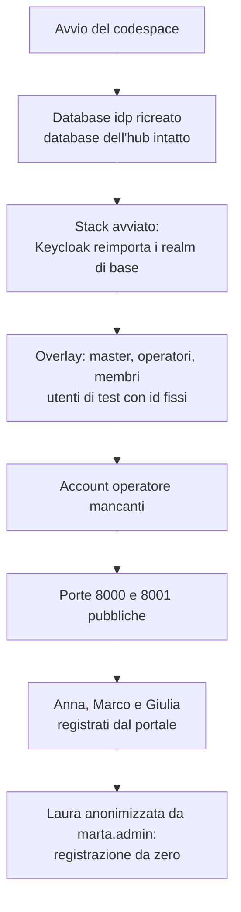
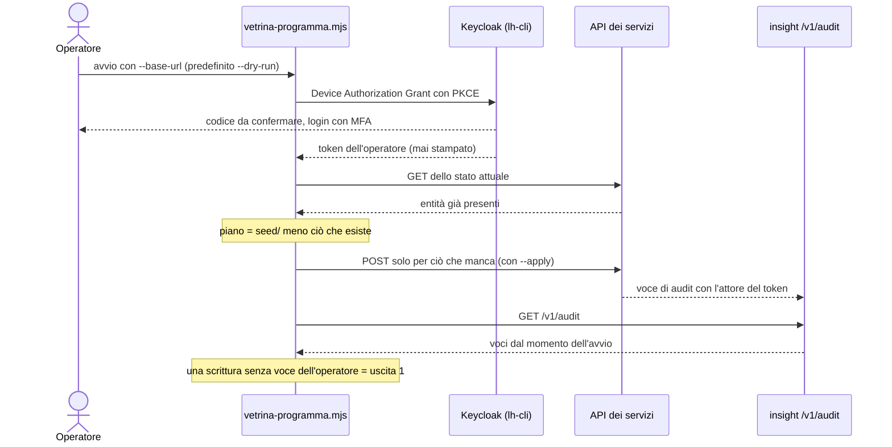
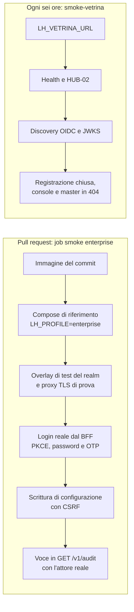

La demo pubblica di Loyalty Hub gira nel profilo `demo`: persone simulate, identità con l'header `X-LH-Actor` e dati del seed. Il profilo `enterprise` (login reale, deny by default, audit con l'attore del token) non si può vedere online con quella demo: si prova installandolo. La **vetrina enterprise** è una seconda installazione ospitata, sempre in `LH_PROFILE=enterprise`, che il Demo Hub raggiunge con un pulsante.

<Note>
La vetrina è una prova da guardare, non un servizio di produzione: non è ad alta disponibilità, contiene solo dati fittizi e si azzera periodicamente.
</Note>

<Note>
**Stato.** L'architettura è decisa (ADR-049) e l'overlay per installare l'istanza è pronto (`deploy/vetrina/`, fetta M8.14c). Dal 2026-10-01 la vetrina si ospita in un GitHub Codespace acceso su richiesta (ADR-050), al posto dell'host Oracle Cloud: il dev container `.devcontainer/vetrina` la avvia e la configura da solo (fetta M8.14 V7), le altre parti arrivano con le fette di M8.14 (piano in `docs/18`). Finché la vetrina non è collegata, il pulsante nel Demo Hub resta nascosto.
</Note>

<Warning>
**Ambiente di test (ADR-051, 2026-10-02).** La vetrina diventa un ambiente di test da usare tutto dal browser: gli utenti di test hanno credenziali fisse e pubbliche, documentate in questa pagina, e Keycloak torna alla configurazione del repository a ogni avvio. Non inserire mai dati personali veri. Utenti di test, reset e membri di prova sono della fetta V8; le altre parti arrivano con le fette V9–V12 di M8.14.
</Warning>

## Come sono collegate le due istanze

Il pulsante non cambia il profilo della demo. Il profilo si fissa all'avvio, lato server, e una configurazione insicura fa uscire il processo; inoltre un interruttore su un'istanza condivisa cambierebbe la modalità a tutti i visitatori. Il pulsante è quindi **un collegamento a un'altra origine**: nessuno stato, cookie, database o bus in comune.

| Ruolo | Dove | Note |
|---|---|---|
| `web` | container nel codespace, una replica | Le sessioni del BFF stanno in memoria: un riavvio le chiude e si rientra con l'SSO. |
| `hub` | container nel codespace, non esposto | Esegue le migrazioni all'avvio. |
| `idp` | Keycloak con Postgres come database | Un realm da `deploy/idp/realm.json` più un overlay di vetrina: registrazione chiusa, nessuna credenziale pubblicata e un client pubblico `lh-cli` (Device Authorization Grant, con consenso esplicito e ruoli limitati a quelli operatore) per la CLI dell'operatore (Q-626, decisa il 2026-09-30). L'OTP vale per gli account con `MFA_REQUIRED_ROLE` e lo script del realm fallisce per un operatore che non lo ha (Q-618, decisa il 2026-09-30). |
| Postgres e Kafka | nel codespace, nel compose | Database e broker **propri**, mai condivisi con la demo. Il traffico verso entrambi è in TLS, con certificati di una CA locale generata nel codespace (Q-621): Postgres rifiuta le connessioni in chiaro, Kafka chiede il certificato del client. |
| Inoltro delle porte | GitHub, due porte pubbliche | Unico ingresso, in https su `*.app.github.dev`: termina il TLS per `web` e `idp` (Q-661). Il reverse proxy con certificati ACME dell'overlay serve solo su un host fisso (Q-620). La console di amministrazione di Keycloak non è esposta. |

L'hosting è un GitHub Codespace del repository: il proprietario lo accende dal browser prima di una demo e si ferma da solo dopo un periodo di inattività. Resta a costo zero perché l'uso si blocca a fine quota gratuita (ADR-050, Q-660); un host sempre acceso è rimandato (TOBE-012). Il bus è un broker Kafka KRaft sullo stesso host, con gli stessi 5 topic della demo (Q-616).

## Avvio nel codespace

Il proprietario crea il codespace dal repository scegliendo la configurazione «Vetrina enterprise» (macchina da 4 core e 16 GB, Q-660) e lo riaccende prima di ogni demo. A ogni avvio lo script del dev container prepara tutto da solo (Q-663):

1. sceglie l'immagine unica pubblicata, all'ultimo tag `v*` o quella indicata nei segreti del codespace;
2. scrive la configurazione con i due indirizzi pubblici, `https://<codespace>-8000.app.github.dev` per il web e `-8001` per Keycloak;
3. genera segreti, CA locale e certificati solo la prima volta, poi li riusa;
4. ricrea da zero il database di Keycloak, avvia lo stack e applica gli overlay dei realm con gli utenti di test, a ogni avvio (Q-672);
5. crea gli account operatore che mancano, dall'elenco tenuto nei segreti del codespace;
6. rende pubbliche le due porte, controlla che la discovery OIDC risponda dall'indirizzo pubblico e registra i membri di prova dal portale (Q-673).

Nel codespace il proxy resta, ma parla HTTP su due porte locali: il TLS lo termina l'inoltro delle porte di GitHub. Il proxy continua a esporre di Keycloak solo il realm `loyaltyhub`; la console di amministrazione resta su una porta privata, visibile solo al proprietario (Q-661).

## Due realm: operatori e membri separati

Con ADR-051 Keycloak ospita due realm nella stessa istanza. Così operatori e membri hanno login, policy delle password, MFA e sessioni separati, e un token del realm membri non può mai portare un ruolo da operatore. I due realm non sono collegati: chi è sia dipendente sia membro ha due registrazioni distinte.

Nella vetrina ogni realm ha un amministratore di test che gestisce utenti, ruoli e sessioni dalla console, senza poter cambiare la configurazione del realm. La console del realm `master` non è pubblica (Q-670, Q-671).

## Cosa si ottiene

- **Login OIDC reale** con Keycloak: BFF confidential con PKCE, cookie `__Host-` HttpOnly, CSRF, back-channel logout e MFA con OTP per gli operatori.
- **Servizi come resource server JWT**: l'attore viene dal token, ogni endpoint dichiara il suo ruolo e il profilo non parte con una configurazione insicura.
- **Backoffice con attori reali**: ogni scrittura di configurazione lascia una voce nell'audit con l'attore del token.
- **Una prova d'installazione**: la vetrina usa la stessa immagine unica e lo stesso compose che userebbe chi adotta il prodotto.
- **Andata e ritorno**: dal pulsante di HUB-01 si passa alla vetrina, da HUB-02 si torna alla demo.

## Cosa non si ottiene

- **Alta disponibilità**: un solo host, un broker, un Postgres e una replica del web. Gli obiettivi di livello del servizio di ADR-036 non valgono per la vetrina.
- **Dati reali**: solo dati fittizi, nessun backup e nessuna garanzia di conservazione. La vetrina parte vuota a ogni codespace nuovo e lo dice nel banner di HUB-02 (Q-624, Q-663).
- **Persone demo**: al posto del selettore di persona c'è il login, e i membri `MBR-*` del seed non esistono in questa istanza.
- **Portale membri**: nel primo passo è chiuso, con la registrazione disattivata (Q-619).
- **Scenari che accreditano punti**: in `enterprise` l'ingresso degli eventi accetta solo il ruolo `SOURCE` (un client `private_key_jwt` per fonte) o un `ADMIN`; le fonti di prova non hanno chiavi pubblicate e gli scenari demo (`/v1/demo/**`) non esistono in questa istanza.
- **Tempo reale in BO-24**: la schermata resta in stato *degraded* finché non c'è un proxy per gli eventi in tempo reale (Q-622).
- **Assistente e CMS**: spenti o non installati in questa istanza.
- **Disponibilità continua**: la vetrina è accesa solo su richiesta, per le demo. La quota gratuita di Codespaces copre decine di ore al mese, non un servizio sempre acceso (TOBE-012).

## Azzeramento

Nel codespace Keycloak riparte dalla configurazione del repository a **ogni avvio**: lo script ricrea il solo database `idp`, e ogni modifica fatta dalle console sparisce (ADR-051 decisione 10, Q-672). I dati dell'hub e i membri registrati restano, perché gli utenti di test hanno id fissi. Un codespace nuovo parte vuoto (Q-663). Lo stesso azzeramento si esegue a mano con `deploy/vetrina/vetrina.sh reset` o, su un host fisso, ogni lunedì con un timer, senza backup (Q-624): ricrea i dati, reimporta il realm e ricrea gli account operatore. Su un host fisso il certificato pubblico del proxy resta, così l'azzeramento non consuma le emissioni ACME. L'ultimo passo, la configurazione del programma, chiede l'approvazione di un operatore con MFA e quindi resta manuale (Q-630).

## Utenti di test

<Warning>
Ambiente di test, dati fittizi. Le credenziali qui sotto sono pubbliche e valgono solo nel codespace: su un host fisso non esistono. Non inserire mai dati personali veri.
</Warning>

Con ADR-051 la vetrina si prova da browser, senza chiedere account al proprietario. La regola di Q-618, account nominativi con password temporanea, resta valida per un host fisso. Nel codespace gli utenti di test hanno id fissi e li ricrea lo script del realm a ogni avvio. Gli operatori hanno la MFA obbligatoria: servono password e codice OTP. Hub e web accettano credenziali fisse solo per chi ha il ruolo `LH_TEST_USER`, e solo con `LH_TEST_USERS_ALLOWED=true` e `LH_ENVIRONMENT=test`.

| Utente | Realm | Ruolo | Password |
|---|---|---|---|
| `marta.admin` | `loyaltyhub` | `ADMIN` | `Aurora-Operatori-26!` |
| `luca.marketing` | `loyaltyhub` | `MARKETING` | `Aurora-Operatori-26!` |
| `elena.legal` | `loyaltyhub` | `LEGAL` | `Aurora-Operatori-26!` |
| `paolo.care` | `loyaltyhub` | `CARE` | `Aurora-Operatori-26!` |
| `sara.analyst` | `loyaltyhub` | `ANALYST` | `Aurora-Operatori-26!` |
| `anna.rossi` | `loyaltyhub-members` | `MEMBER` | `Aurora-Membri-26!` |
| `marco.bianchi` | `loyaltyhub-members` | `MEMBER` | `Aurora-Membri-26!` |
| `giulia.ferri` | `loyaltyhub-members` | `MEMBER` | `Aurora-Membri-26!` |
| `laura.conti` | `loyaltyhub-members` | `MEMBER` | `Aurora-Membri-26!` |
| `vetrina.admin` | `loyaltyhub` (console) | gestione utenti, senza ruoli applicativi | `Aurora-Admin-26!` |
| `membri.admin` | `loyaltyhub-members` (console) | gestione utenti, senza ruoli applicativi | `Aurora-Admin-26!` |

I cinque operatori condividono un solo seme TOTP (SHA-1, 6 cifre, 30 secondi). Aggiungilo a un'app di autenticazione inserendo la chiave a mano, oppure con questo URI.

- Seme in base32: `KZSXI4TJNZQUC5LSN5ZGCMRQGI3EY2BB`
- URI: `otpauth://totp/Vetrina%20Aurora:marta.admin?secret=KZSXI4TJNZQUC5LSN5ZGCMRQGI3EY2BB&issuer=Vetrina%20Aurora&algorithm=SHA1&digits=6&period=30`

Non c'è un'immagine con il codice QR: tra le dipendenze non c'è un generatore offline e il seme non deve passare da servizi esterni. Keycloak non accetta due volte lo stesso codice nella stessa finestra di 30 secondi: se due persone accedono insieme, la seconda aspetta il codice successivo.

Gli amministratori `vetrina.admin` e `membri.admin` gestiscono utenti, ruoli e sessioni del proprio realm dalla console, con i soli ruoli `view-users`, `query-users`, `query-groups`, `manage-users` e `view-events`. Con `manage-users` possono assegnare ruoli agli utenti del loro realm: è il limite accettato da Q-671.

**Limite sull'audit (Q-677).** Gli eventi di amministrazione di Keycloak sono attivi con i dettagli in entrambi i realm, ma le modifiche fatte dalle console non arrivano in `audit_entry` finché non c'è il ponte di M8.12, che coprirà entrambi i realm.

### Scenario dei quattro membri

Lo script `scripts/vetrina-membri.mjs` fa il login vero dal BFF e usa le API del portale, quindi serve che le porte 8000 e 8001 siano pubbliche.

- **Anna, Marco e Giulia** sono già registrati, con i dati del seed: hanno subito profilo e tessera.
- **Laura** (`laura.conti`, cognome e e-mail fittizi) ha un account ma non è registrata: a ogni avvio il suo profilo, se esiste, viene anonimizzato da `marta.admin`, così al primo accesso Laura passa dalla registrazione vera (PT-16).

## Configurazione del programma

In `enterprise` non c'è un seeder, quindi la vetrina parte vuota. La configurazione del programma arriva da `seed/` con `scripts/vetrina-programma.mjs`, che usa solo le API REST dei servizi e il token di un operatore nominativo (Q-617, decisa il 2026-09-30). Lo script crea tema e messaggi, categorie, fasce, pool di coupon e premi, attributi e segmenti dinamici, badge, obiettivi e classifiche. Non entrano membri, movimenti né altri dati personali. I premi nascono in `DRAFT` e lo script non approva né pubblica nulla. Valute, livelli, tipi di azione `SYSTEM` e mappature interne non hanno un'API di creazione: lo script li salta e li riporta nel piano, e arrivano con le migrazioni dei dati di riferimento (Q-629).

## Verifiche automatiche

Due prove tengono d'occhio il profilo `enterprise`, una prima del rilascio e una sulla vetrina accesa (M8.14, F2-QA-04).

- **Prima del merge.** Il job `smoke enterprise (compose, OIDC)` di `ci.yml` avvia il compose di riferimento con l'immagine della pull request e l'overlay di test del realm. Un operatore fa un login vero dal backoffice: password temporanea cambiata, OTP configurato e codice inserito, senza scorciatoie sui client di produzione. Poi scrive una configurazione e il job cerca la voce in `GET /v1/audit` con l'attore reale. Prova anche i rifiuti: `401` senza token, `403` senza token CSRF, `404 PERSONA_DISABLED` sul selettore di persona. Segreti e certificati di prova nascono nel job e non compaiono nei log.
- **Sulla vetrina.** Il workflow `smoke-vetrina.yml` gira ogni sei ore, senza credenziali e solo in lettura. Controlla la health, HUB-02 con le tessere attive, la discovery OIDC del realm `loyaltyhub`, la registrazione chiusa e che console e realm `master` non siano esposti. La health di hub, database e bus arriva dalle tessere di HUB-02, perché il proxy non espone altro (Q-650). Finché la variabile `LH_VETRINA_URL` del repository è vuota, il workflow si ferma con un avviso.

## Decisione

La decisione, le alternative scartate e i limiti dichiarati sono in [ADR-049](https://github.com/peppe-ruv/Loyalty_Sys/blob/main/docs/13-REGISTRO-DECISIONI.md); l'hosting su Codespaces, che sostituisce Oracle Cloud, è in ADR-050, con i dettagli decisi in Q-660…Q-663 (il 2026-10-01). Hosting, bus, dati del programma, accesso degli operatori, portale e client `lh-cli` sono decisi (Q-615…Q-619, Q-626, Q-629); dominio e TLS, TLS verso bus e database, tempo reale, `render.yaml` e azzeramento sono decisi con il default proposto (Q-620…Q-624, il 2026-10-01). Il dettaglio è in [Domande aperte](https://github.com/peppe-ruv/Loyalty_Sys/blob/main/docs/15-DOMANDE-APERTE.md). La vetrina come ambiente di test tutto dal browser, i due realm e le credenziali pubbliche sono in ADR-051 (2026-10-02), con i dettagli in Q-670…Q-677. Per installare lo stesso profilo sulla propria infrastruttura vedi [Installazione enterprise](/operations/installazione-enterprise).
