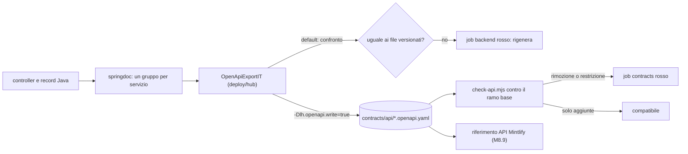

# contracts/api — OpenAPI generata e verificata

Contratto HTTP dei servizi (M8.8, F2-API-01, ADR-046, docs/18 §3.6): le specifiche OpenAPI qui versionate sono
**generate dal codice** (springdoc, `/v3/api-docs`) e **mai scritte a mano**. Sono la fonte per il riferimento API del
sito di documentazione (M8.9), per il client tipizzato degli e2e (M9.1) e per la regola 12 di CLAUDE.md §7
(headless-first: ciò che mostra il portale è ottenibile da queste API).

| File | Contenuto |
|---|---|
| `<servizio>-service.openapi.yaml` | Le API del servizio: i controller del package `io.loyaltyhub.<servizio>` (gestione, portale, demo) |
| `platform.openapi.yaml` | Gli endpoint comuni di `lh-common` (reset e info della demo, approvazioni) e dell'hub (`/`) |
| `portal.openapi.yaml` | L'unione delle sole API `/v1/portal/**` di tutti i servizi |

## Come si generano

`OpenApiExportIT` (in `deploy/hub`) avvia l'hub con tutti i servizi (profilo `demo,inproc`, Postgres in-process, niente
broker) e chiede a springdoc un gruppo per servizio, definito dal package dei controller: è la stessa OpenAPI che il
servizio espone da solo, con gli schemi risolti servizio per servizio. Poi scrive YAML deterministico:

- chiavi in ordine alfabetico a ogni livello, elenchi `required` ordinati;
- niente `servers` (la porta del test è casuale) e `info` fissa (`version: v1`);
- in ogni file solo gli schemi raggiunti dai suoi percorsi;
- in `portal.openapi.yaml` uno schema omonimo con forme diverse tra due servizi fa fallire la generazione.

Di default il test **confronta** ciò che genera con i file versionati e fallisce con «OpenAPI cambiata: rigenera con
…» se differiscono (drift). Gira nel job `backend` con `./mvnw verify`. Dopo aver cambiato un controller o un record
di richiesta/risposta si rigenera dalla radice del repository:

```bash
./mvnw -pl deploy/hub -am verify -Dtest=NoSuchTest -Dsurefire.failIfNoSpecifiedTests=false \
  -Dit.test=OpenApiExportIT -Dfailsafe.failIfNoSpecifiedTests=false -Dlh.openapi.write=true
```

e si versiona il diff insieme al codice che lo causa. Un file che il codice non genera più viene cancellato.

## Cosa verifica `check-api`

`scripts/check-api.mjs` (job `contracts`) confronta ogni specifica con quella del merge-base del ramo base
(`origin/$GITHUB_BASE_REF` nelle pull request, altrimenti `origin/main`). Le API si estendono, non si rompono:

| Incompatibile (exit 1) | Compatibile |
|---|---|
| file, percorso, operazione, risposta 2xx o media type rimossi | nuovi file, percorsi, operazioni, risposte |
| schema di `components` rimosso; proprietà rimossa da uno schema | nuove proprietà e nuovi schemi |
| richiesta: parametro o campo obbligatorio aggiunto, corpo reso obbligatorio, valore di enum rimosso, tipo ristretto | richiesta: parametri e campi facoltativi, nuovi valori di enum, tipo allargato |
| risposta: campo prima obbligatorio non più obbligatorio, tipo allargato (anche a `null`) | risposta: nuovi campi obbligatori, nuovi valori di enum |
| `format` cambiato (es. `int32` → `int64`) | risposte di errore (4xx/5xx) rimosse |

Se la base non ha ancora un file, il file è nuovo e passa. Un cambio incompatibile è una decisione, non un refactor:
serve un'ADR e una nuova versione del percorso; con la label `decisione` sulla PR le rotture sono riportate ma non
bloccano (stessa regola del job `guard`).

```bash
npm --prefix scripts ci --omit=dev        # una volta: installa solo il parser yaml
node scripts/check-api.mjs                # contro origin/main (o un ref: node scripts/check-api.mjs origin/main)
node --test scripts/check-api.test.mjs    # test del confronto
```



Limiti noti: gli `operationId` sono quelli di springdoc (nome del metodo, con suffisso numerico se ripetuto nel
servizio) e possono cambiare quando si aggiunge un metodo omonimo; `check-api` non li considera parte del contratto.
`oneOf`/`anyOf`/`allOf` non sono confrontati in profondità (oggi non compaiono nelle specifiche).
