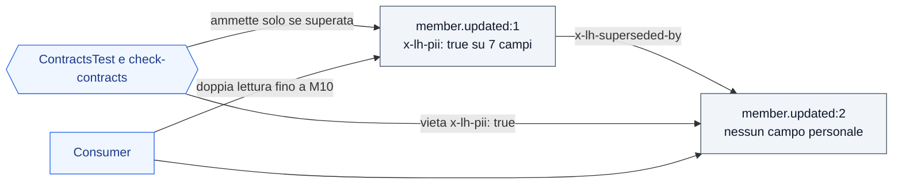

# contracts/events — schemi degli eventi (docs/05)

JSON Schema **2020-12**. Contratto immutabile tra i servizi (`CLAUDE.md §6`, docs/05 §9):
un campo opzionale nuovo resta nella stessa versione; un cambio incompatibile è `:<n+1>` nel `dataschema` + ADR.

```
envelope.schema.json          envelope CloudEvents 1.0 (attributi lh*)
<famiglia>/<nome>.schema.json schema del payload data per ogni type (action | effect | fact | audit)
<famiglia>/<nome>.v<n>.schema.json   versione n>1 dello stesso type (docs/05 §9)
examples/<famiglia>.<nome>.json  un esempio valido per ogni type (e .v<n>.json per le versioni successive)
```

**Dati personali fuori dal bus** (ADR-032, `CLAUDE.md` regola 10): ogni campo dichiara `x-lh-pii: true|false`.
Un campo `true` è ammesso solo in una versione superata, che porta `x-lh-superseded-by` verso la versione
successiva e resta finché i consumer leggono entrambe (Q-346). Oggi è il caso di `fact.member.registered:1`
e `fact.member.updated:1`; le `:2` escono senza nome, cognome, soprannome, e-mail, data di nascita e città.



Il test di contratto `ContractsTest` (in `libs/lh-common`) verifica che ogni esempio validi contro l'envelope
e contro lo schema del proprio `type` e della propria versione, che ogni schema abbia un esempio e la regola sui dati personali.

Copertura: ogni `type` del catalogo di docs/05 §3–§6 (compresi i fatti `reward/contest.status.changed`) ha schema ed esempio; `action.member.birthday` e `fact.member.birthday` sono P2 (nessun produttore nel PoC). Verificato da `TestbookPltContractIT` (TB-PLT-CTR).

> Nota (SPEC-GAP Q-42): docs/05 §9 cita `contracts/examples/`; qui si segue la struttura di `CLAUDE.md §3`
> (`contracts/events/examples/`) mantenendo il nome file `<famiglia>.<nome>.json` di §9.
