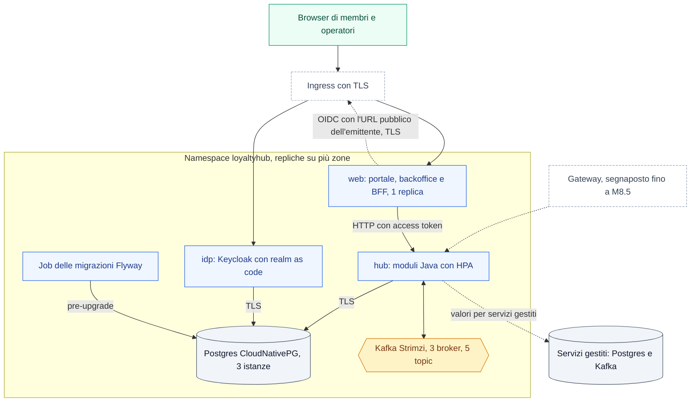

# deploy — ambiente locale e note infrastruttura (docs/11)

`docker-compose.yml`: stessa topologia della demo (docs/11 §9).

```sh
# solo infrastruttura (Kafka KRaft + Postgres 17 + Kafka UI)
docker compose -f deploy/docker-compose.yml up -d kafka postgres kafka-ui
# stack completo (8 servizi + web): Dockerfile di ogni servizio; il web dall'immagine unica deploy/image
docker compose -f deploy/docker-compose.yml --profile all up --build
```

| Servizio | Immagine | Porta host | Note |
|---|---|---|---|
| `kafka` | `apache/kafka:4.2.2` | 9092 | KRaft nodo singolo; `auto.create.topics.enable=false`; linea 4.2 come `kafka-clients` (Q-481) |
| `postgres` | `postgres:17.11` | 5432 | DB `loyaltyhub`, volume `lh-postgres-data` |
| `kafka-ui` | `kafbat/kafka-ui:v1.5.0` | 8090 | ispezione topic su http://localhost:8090 (solo `127.0.0.1`, Q-479) |
| 8 servizi | build di `services/<nome>/Dockerfile` | 8081–8088 | solo con `--profile all` |
| `web` | build di `deploy/image/Dockerfile` (`loyaltyhub:local`), `LH_ROLE=web` | 3000 | solo con `--profile all`; la build compila anche l'hub (Q-484) |

Le immagini di terze parti hanno tag e digest (Keycloak solo il tag, Q-482). Kafka, Postgres e Keycloak hanno la stessa
versione anche nel compose di riferimento e nei values del chart: Dependabot aggiorna solo questo file e
`scripts/check-helm.mjs` fa fallire il job `helm` finché gli altri due non sono allineati. Il job è obbligatorio
nel ruleset (`scripts/setup-branch-protection.sh`): una divergenza blocca il merge (Q-483).

**I 5 topic** non sono creati dal broker: li crea il **profilo Spring `local`** (bean `NewTopic` di `lh-common`,
2 partizioni) quando un servizio si avvia. Verificato da `LocalTopicsIT` (Kafka in-JVM, senza Docker).

Dall'host un servizio avviato con `./mvnw` usa `localhost:9092`; i container della rete compose usano
`kafka:29092` (listener interno).

> Nota ambiente (SPEC-GAP Q-40): in questa sessione il pull delle immagini Docker è negato dal proxy, quindi
> il `docker compose up` non è eseguibile qui; il file è validato con `docker compose config` e la creazione
> dei topic è coperta da un test in-JVM. Il run completo va fatto in un ambiente con accesso a Docker Hub.

---

## Profilo enterprise: chart Helm e compose di riferimento (Fase 2, M8.3)

Tre tagli di installazione, **una sola immagine** (`deploy/image/`, ADR-037): appliance (`LH_ROLE=all`, da M12),
compose di riferimento (`deploy/compose/reference.yml`, F2-DIST-03) e chart Helm (`deploy/helm/loyaltyhub`,
F2-DIST-02). Cambiano solo `LH_ROLE` e il posto dell'infrastruttura; `LH_MODE=external` in entrambi.

### Topologia del chart

Nel cluster ogni ruolo dell'immagine è un Deployment con repliche sparse tra le zone. L'Ingress porta il browser al
ruolo `web` (portale e backoffice) e alle pagine di login di `idp`; l'hub non è esposto: lo chiama il web dentro il
cluster, e le API per fonti e widget passeranno dal gateway di M8.5 (oggi un segnaposto spento). Postgres e Kafka sono
gestiti dagli operatori di default oppure, cambiando due valori, sono servizi gestiti fuori dal cluster. Nel profilo
`enterprise` il web fa da BFF (F2-SEC-06): fa login su `idp` con lo stesso URL pubblico del browser, quindi passando
dall'Ingress, e chiama l'hub con l'access token dell'utente.



### Scelte del chart

| Tema | Scelta |
|---|---|
| Immagine | `image.repository` e `image.tag` **obbligatori**, senza default: `.github/workflows/image.yml` pubblica `ghcr.io/<owner>/loyaltyhub` solo sui tag git `v*`, e un nome inventato finirebbe in `ImagePullBackOff`. Il tag può essere un digest `sha256:…` |
| Ruoli | un Deployment per ruolo: `hub` (tutti i moduli: `LH_SERVICES` accetta solo vuoto o `all`, Q-376 del M8.1), `web`, `idp`. `cms` e `jobs` non sono ancora nell'immagine: il chart **rifiuta** `roles.cms.enabled` e `roles.jobs.enabled` |
| Operatori | **prerequisiti**, non sottochart: Strimzi e CloudNativePG hanno CRD e controller a livello di cluster, con un ciclo di vita diverso da quello dell'applicazione; il chart crea solo le risorse (`Kafka`, `KafkaNodePool`, 5 `KafkaTopic`, `Cluster`, `Database`). Le risorse Strimzi usano l'API `kafka.strimzi.io/v1beta2`, servita da Strimzi 0.46…0.51: Strimzi 1.0 o successivo serve solo l'API `v1`, non ancora supportata dal chart (Q-490). La versione di Kafka la sceglie l'operatore installato (`kafka.strimzi.version` vuoto); con l'API `v1beta2` la linea 4.2 dei compose e dei client c'è solo in Strimzi 0.51 (`kafka.strimzi.version=4.2.0`). Se la fissi, `scripts/check-helm.mjs` verifica che la linea coincida con i compose (Q-481, Q-483) |
| Servizi gestiti | `postgres.mode=external` e `kafka.mode=external` (ADR-026): nessuna risorsa degli operatori, URL e credenziali dai valori |
| Migrazioni | Job `…-migrate` con la stessa immagine: esegue solo Flyway (`io.loyaltyhub.hub.HubMigrate` dal jar dell'hub, non è un nuovo ruolo) e termina; stessi `nodeSelector`, `tolerations` e sicurezza dell'hub. Hook `pre-upgrade` sempre; al primo install `pre-install` con Postgres esterno e `post-install` con CloudNativePG, perché il cluster nasce con la release. L'hub all'avvio rifà le stesse migrazioni: Flyway prende un lock, le due esecuzioni non si pestano (ADR-038) |
| Esposizione | Ingress per `web` e, per `idp`, solo `/realms/<realm>/` e `/resources/`: la console di amministrazione e il realm `master` (con il suo endpoint dei token) restano fuori; `gateway.enabled` crea un `HTTPRoute` verso l'hub (`/v1/`) agganciato a un Gateway esistente, segnaposto di M8.5 |
| Identità | `idp` importa `files/realm.json`, copia di `deploy/idp/realm.json` verificata da `scripts/check-helm.mjs` (Helm non legge file fuori dal chart); tutti i segnaposto `${LH_*}` del realm sono passati come variabili; l'hub valida i token (`LH_OIDC_ISSUER` pubblico, JWKS letto dentro il cluster, `aud=hub`). Nel profilo `enterprise` il Pod `web` riceve la configurazione del BFF: vedi *Configurare il login del web* |
| Sicurezza | Pod Security `restricted`: non root (uid 1000), `seccompProfile: RuntimeDefault`, niente escalation, capability rimosse, token del service account non montato, filesystem in sola lettura con `emptyDir` per `/tmp` (e per la cache di Next.js) — tranne `idp`, vedi Q-374. **Nessuna NetworkPolicy** fino a M8.5 (deny-by-default e mTLS di mesh): il traffico nel namespace non è filtrato |
| Profilo `enterprise` (regola 22) | il chart **rifiuta** Kafka esterno `PLAINTEXT` e Postgres esterno senza `sslmode=require`, `verify-ca` o `verify-full`; la deroga è esplicita (`kafka.external.allowInsecure`, `postgres.external.allowInsecure`), solo per reti già cifrate. Con CloudNativePG l'URL JDBC esige TLS (`sslmode=require`; `verify-full` con la CA del cluster in M8.5) |
| Segreti | nessun valore nel chart: ogni credenziale è `{name, key}` di un Secret esistente; CloudNativePG genera da sé `<cluster>-app` |
| Porte | fisse, non valori: hub 8080 e web 3000 (le impone `deploy/image/entrypoint.sh`), Keycloak 8080 e gestione 9000; `scripts/check-helm.mjs` verifica che chart, compose ed entrypoint coincidano |
| Sonde | hub: liveness e readiness di Actuator; web: liveness sulla porta (`tcpSocket`), readiness su `/api/demo/status`, che interroga l'hub e non deve far riavviare il web quando l'hub è lento; idp: `/health/*` sulla porta di gestione |
| Risorse | requests e limits per ogni ruolo e per il Job; HPA su CPU per `hub` (2–6); PDB `minAvailable: 1` per `hub` e `idp`. `web` ha **una sola replica**, senza HPA né PDB: le sessioni del BFF stanno nella memoria del Pod e nel profilo `enterprise` il chart rifiuta più repliche e il PDB (Q-409, Q-419). Nel profilo `demo`, senza sessioni, `web` si può scalare |
| Valori | `values.schema.json` rifiuta chiavi sconosciute (un refuso non passa in silenzio) e tipi sbagliati; `templates/_helpers.tpl` (`loyaltyhub.validate`) le regole fra più valori: profilo diverso da `enterprise`/`demo`, `global.mode=embedded`, `enterprise` senza `idp` né `oidc.issuer`, partizioni o ISR impossibili, repliche dei topic oltre i broker di Strimzi, chiavi di retention sconosciute, aumento di partizioni non confermato; nel profilo `enterprise` anche emittente OIDC o `publicUrls.web` non `https`, `publicUrls.web` con un percorso o con un host diverso dall'Ingress, emittente o client del BFF diversi da quelli del ruolo `idp`, Secret del BFF non indicati, più di una replica o un PDB del web (vedi *Configurare il login del web*) |

### Installazione con Helm

```bash
# 1. operatori (una volta per cluster; versioni e opzioni dalle rispettive documentazioni).
#    Servono Strimzi con KRaft, KafkaNodePool e l'API v1beta2 (da 0.46 a 0.51: Strimzi 1.0 serve solo l'API v1, Q-490)
#    e CloudNativePG con la risorsa Database (1.25 o successivo); Kubernetes 1.29 o successivo. Senza --version Helm
#    installerebbe l'ultima Strimzi, che non serve più l'API v1beta2. Con Pod Security `restricted` sul namespace,
#    Strimzi deve generare Pod conformi: STRIMZI_POD_SECURITY_PROVIDER_CLASS=restricted nell'operatore.
helm repo add strimzi https://strimzi.io/charts/
helm install strimzi strimzi/strimzi-kafka-operator --version 0.51.0 -n strimzi --create-namespace --set watchAnyNamespace=true \
  --set 'extraEnvs[0].name=STRIMZI_POD_SECURITY_PROVIDER_CLASS' --set 'extraEnvs[0].value=restricted'
helm repo add cnpg https://cloudnative-pg.github.io/charts && helm install cnpg cnpg/cloudnative-pg -n cnpg-system --create-namespace

# 2. Secret (valori generati o dal secret manager; External Secrets in M8.5)
kubectl create secret generic lh-idp-admin --from-literal=password="$(openssl rand -base64 24)"
kubectl create secret generic lh-idp-clients \
  --from-literal=web-client-secret="$(openssl rand -hex 32)" \
  --from-literal=widgets-client-secret="$(openssl rand -hex 32)" \
  --from-literal=cms-client-secret="$(openssl rand -hex 32)"
kubectl create secret generic lh-idp-db --type=kubernetes.io/basic-auth \
  --from-literal=username=idp --from-literal=password="$(openssl rand -base64 24)"
# chiave delle sessioni del BFF del web: 32 byte casuali in base64 (profilo enterprise)
kubectl create secret generic lh-web-session --from-literal=session-key="$(openssl rand -base64 32)"

# 3. chart: immagine pubblicata (obbligatoria), host e URL pubblici propri. Il primo avvio di Kafka, Postgres e
#    Keycloak richiede alcuni minuti: --wait con un margine ampio, altrimenti Helm segna fallita un'installazione sana.
helm install lh deploy/helm/loyaltyhub --wait --timeout 15m \
  --set image.repository=ghcr.io/<owner>/loyaltyhub --set image.tag=<versione, es. v0.7.0> \
  --set publicUrls.web=https://loyalty.example.org --set ingress.hosts.web=loyalty.example.org \
  --set publicUrls.idp=https://idp.example.org --set ingress.hosts.idp=idp.example.org
```

Servizi gestiti al posto degli operatori (nel profilo `enterprise` Kafka con `SSL_PEM` o `SASL_SSL` e Postgres con
`sslmode=require` o più severo, altrimenti il chart non si installa):

```bash
helm install lh deploy/helm/loyaltyhub --wait --timeout 15m \
  --set image.repository=ghcr.io/<owner>/loyaltyhub --set image.tag=<versione> \
  --set postgres.mode=external --set postgres.external.host=pg.example.internal \
  --set postgres.external.jdbcParams='sslmode=verify-full' \
  --set kafka.mode=external --set kafka.external.bootstrapServers=kafka.example.internal:9093 \
  --set kafka.external.sasl.username.name=lh-kafka --set kafka.external.sasl.password.name=lh-kafka
```

Con Postgres esterno servono i Secret `lh-db` (`username`, `password`) e `lh-idp-db`, e i database `loyaltyhub` e
`idp` già creati.

### Configurare il login del web (BFF OIDC, F2-SEC-06)

Nel profilo `enterprise` il web è il client OIDC confidential `web` del realm: fa il login, tiene i token lato server e
dà al browser solo un cookie di sessione (ADR-027). Senza una configurazione completa e sicura il web non parte
(`INSECURE_CONFIG`, regola 22). Chart e compose gli passano queste variabili; nel profilo `demo` non ne passano
nessuna.

| Variabile del web | Chart | Compose di riferimento |
|---|---|---|
| `LH_OIDC_ISSUER` | `oidc.issuer`; vuoto = `<publicUrls.idp>/realms/<global.realm>`, lo stesso dell'hub | `${LH_IDP_PUBLIC_URL}/realms/loyaltyhub`, lo stesso dell'hub |
| `LH_WEB_CLIENT_ID` | `roles.web.bff.clientId` (`web`) | `web` |
| `LH_WEB_CLIENT_SECRET` | Secret di `roles.web.bff.clientSecret`; nome vuoto = `roles.idp.clientSecrets.web`, lo stesso di Keycloak | `LH_WEB_CLIENT_SECRET`, la stessa variabile di `idp` |
| `LH_WEB_URL` | `publicUrls.web` nella forma che ne ricava il web (senza barra finale, host in minuscolo, senza `:443`), lo stesso valore dato a Keycloak | `LH_WEB_URL`, la stessa variabile di `idp` |
| `LH_WEB_SESSION_KEY` | Secret di `roles.web.bff.sessionKey` (default `lh-web-session`, chiave `session-key`) | `LH_WEB_SESSION_KEY` |
| `LH_WEB_SESSION_IDLE_SECONDS`, `LH_WEB_SESSION_MAX_SECONDS`, `LH_WEB_SESSION_MAX_COUNT` | `roles.web.bff.sessionIdleSeconds` (1800), `sessionMaxSeconds` (36000), `sessionMaxCount` (10000) | stesse variabili; vuote = default del web |
| `NODE_EXTRA_CA_CERTS` | ConfigMap di `roles.web.bff.issuerCaBundle`, montato in sola lettura | file di override con il certificato montato |

Nel chart i segreti arrivano solo come riferimenti a Secret esistenti (`secretKeyRef`), mai come valori. Il web accetta
anche `LH_WEB_CLIENT_SECRET_FILE` e `LH_WEB_SESSION_KEY_FILE`.

Il chart rifiuta di installarsi nel profilo `enterprise` quando:

- l'emittente non è `https` (`INSECURE_CONFIG: emittente OIDC …`): il browser vi fa login e il BFF lo chiama;
- con il ruolo `idp`, `oidc.issuer` è impostato ma diverso da `<publicUrls.idp>/realms/<global.realm>`, oppure
  `roles.web.bff.clientId` non è il client del realm che riceve `LH_WEB_CLIENT_SECRET` (`web`);
- `publicUrls.web` non è un'origine `https` senza percorso, anche con il web spento se c'è il ruolo `idp` (il realm la
  usa), o ha un host diverso da `ingress.hosts.web` (lo stesso vale per `publicUrls.idp` e `ingress.hosts.idp`);
- manca il Secret della chiave delle sessioni, o quello del client `web` quando il ruolo `idp` è spento;
- `roles.web.replicas` è maggiore di 1, l'HPA del web può superare una replica o il PDB del web è acceso
  (`WEB_SINGLE_REPLICA`, Q-409, Q-419).

**Raggiungere l'emittente.** Il BFF chiama l'emittente (discovery, scambio del codice, rinnovo, chiavi) con l'URL
pubblico, lo stesso del browser: la discovery rifiuta un emittente diverso da quello chiesto. Quindi i Pod `web`
devono risolvere `publicUrls.idp` e raggiungere l'Ingress, e il certificato dell'Ingress deve essere firmato da una CA
che Node riconosce. Con una CA interna crea un ConfigMap con il certificato PEM e indicalo in
`roles.web.bff.issuerCaBundle`:

```bash
# CA interna che firma il certificato di idp.example.org
kubectl create configmap lh-issuer-ca --from-file=ca.crt=./ca-interna.pem
helm upgrade lh deploy/helm/loyaltyhub --reuse-values --set roles.web.bff.issuerCaBundle.name=lh-issuer-ca
```

Keycloak, a sua volta, chiama il back-channel logout su `publicUrls.web` (Q-421).

**Realm già importato.** Keycloak importa `realm.json` solo al primo avvio. Su un realm esistente modifica a mano il
client `web` nella console: aggiungi la *post logout redirect URI* `<LH_WEB_URL>/` (senza, Keycloak rifiuta il ritorno
al web dopo il logout) e sostituisci la redirect URI `<LH_WEB_URL>/*` con quella esatta
`<LH_WEB_URL>/api/auth/callback`.

### Compose di riferimento

`deploy/compose/reference.yml`: `postgres` 17, `kafka` KRaft (un broker), `migrate` (Flyway una volta sola, come il
Job del chart), `hub`, `web` e `idp`. I container dell'immagine unica girano in sola lettura, senza capability e senza
nuovi privilegi. Keycloak usa un ruolo Postgres proprio (`idp`, proprietario del solo database `idp`, creato da
`postgres-init/10-idp.sh`), non il superutente dell'hub. Sull'host sono pubblicati solo `web` (3000) e `idp` (8180), e
solo su `127.0.0.1`: parlano HTTP in chiaro e sulla porta di `idp` c'è anche la console `/admin`. Per l'accesso da
altre macchine va messo davanti un reverse proxy con TLS (Q-392).

```bash
export LH_IMAGE=ghcr.io/<owner>/loyaltyhub:<versione>
export LH_DB_PASSWORD=… LH_IDP_DB_PASSWORD=… LH_IDP_ADMIN_PASSWORD=…
export LH_WEB_CLIENT_SECRET=… LH_WIDGETS_CLIENT_SECRET=… LH_CMS_CLIENT_SECRET=…
# profilo enterprise: chiave delle sessioni del BFF e URL https del reverse proxy (vedi sotto)
export LH_WEB_SESSION_KEY="$(openssl rand -base64 32)"
export LH_WEB_URL=https://loyalty.example.org LH_IDP_PUBLIC_URL=https://idp.example.org
docker compose -f deploy/compose/reference.yml up -d
# valutazione con i dati fittizi (seed, X-LH-Actor), senza reverse proxy: LH_PROFILE=demo LH_IDENTITY_MODE=header
```

| Variabile | Default | Uso |
|---|---|---|
| `LH_IMAGE` | — (obbligatoria) | immagine unica pubblicata, es. `ghcr.io/<owner>/loyaltyhub:v0.7.0` |
| `LH_PROFILE`, `LH_IDENTITY_MODE` | `enterprise`, `oidc` | `demo` + `header` solo per valutare |
| `LH_DB_PASSWORD` | — (obbligatoria) | superutente `loyaltyhub` di Postgres, usato da `migrate` e `hub` |
| `LH_IDP_DB_PASSWORD` | — (obbligatoria) | ruolo `idp` di Postgres, usato solo da Keycloak |
| `LH_IDP_ADMIN_PASSWORD`, `LH_*_CLIENT_SECRET` | — (obbligatorie) | come in `deploy/idp/README.md`; `LH_WEB_CLIENT_SECRET` va anche al web |
| `LH_WEB_SESSION_KEY` | — (obbligatoria in `enterprise`) | chiave delle sessioni del BFF: 32 byte casuali in base64 (`openssl rand -base64 32`) |
| `LH_WEB_SESSION_IDLE_SECONDS`, `LH_WEB_SESSION_MAX_SECONDS`, `LH_WEB_SESSION_MAX_COUNT` | vuote (default del web: 1800, 36000, 10000) | inattività, durata massima e numero delle sessioni del BFF |
| `LH_BIND_ADDRESS` | `127.0.0.1` | indirizzo dell'host su cui pubblicare `web` e `idp` |
| `LH_IDP_PUBLIC_URL`, `LH_WEB_URL`, `LH_CMS_URL` | `http://localhost:8180`, `:3000`, `:8055` | emittente OIDC e redirect del realm; nel profilo `enterprise` gli URL `https` del reverse proxy, senza barra finale |
| `LH_KAFKA_TOPIC_PARTITIONS`, `LH_KAFKA_CONSUMER_CONCURRENCY` | 12, 2 | forma dei topic e concorrenza (F2-EVT-04) |
| `LH_KAFKA_TOPICS_ALLOW_PARTITION_INCREASE` | `false` | vedi *Aumentare le partizioni* |

I segreti mancanti fermano il container che li usa (`Variabile obbligatoria mancante: …`) prima che faccia qualcosa:
Postgres non inizializza il volume senza entrambe le password. Il web li controlla da sé all'avvio e, nel profilo
`enterprise`, si ferma con `INSECURE_CONFIG` elencando ogni problema (segreto corto o segnaposto, chiave che non vale
32 byte, URL non validi). `hub` e `web` accettano anche `<VAR>_FILE` (lo legge l'entrypoint dell'immagine, per cui
una variabile vuota non oscura il file); `migrate` e Keycloak no.

**Login nel profilo `enterprise` (Q-420).** Il BFF chiama Keycloak con l'URL pubblico dell'emittente, lo stesso del
browser, e accetta `http` solo verso `localhost`: dentro il container `web`, però, `localhost` è il container stesso.
Per questo il login funziona solo dietro un reverse proxy con TLS:

1. Metti il reverse proxy davanti a `web` (porta 3000) e `idp` (porta 8180) e imposta `LH_WEB_URL` e
   `LH_IDP_PUBLIC_URL` sui suoi URL `https`, senza percorso né barra finale: Keycloak confronta alla lettera la
   redirect URI e l'emittente, e una barra in più darebbe `//`. Con gli URL `http` di default, o con una forma
   diversa, il web si ferma subito e dice quale variabile correggere (guardia `x-lh-web-oidc-guard`).
2. Verifica che i container raggiungano quegli URL: `web` chiama `LH_IDP_PUBLIC_URL` e `idp` chiama
   `<LH_WEB_URL>/api/auth/backchannel-logout`. Se i nomi esistono solo nel file hosts dell'host, aggiungili ai container
   con `extra_hosts` in un file di override (per esempio `idp.example.org:host-gateway`), con il proxy in ascolto anche
   sull'interfaccia del bridge di Docker.
3. Usa un certificato di una CA pubblica, oppure monta la CA interna con un file di override: `NODE_EXTRA_CA_CERTS`
   per il web e il truststore di Keycloak (`KC_TRUSTSTORE_PATHS`) per il back-channel logout.

### Partizioni, concorrenza e retention (F2-EVT-04, ADR-028)

I nomi dei 5 topic non cambiano mai; si configurano forma e concorrenza. Le variabili sono lette da ogni servizio e
dall'hub (`LhEnvironmentAliases` di `lh-common`); senza variabili valgono i default di Fase 1.

| Variabile | Proprietà | Default (Fase 1) | Chart / compose |
|---|---|---|---|
| `LH_KAFKA_CONSUMER_CONCURRENCY` | `loyaltyhub.consumer.concurrency` | 2 | 2 (si scala prima con le repliche dell'hub) |
| `LH_KAFKA_TOPIC_PARTITIONS` | `loyaltyhub.topic-settings.partitions` | 2 | 12 |
| `LH_KAFKA_TOPIC_REPLICAS` | `loyaltyhub.topic-settings.replicas` | 1 | 3 (compose: 1) |
| `LH_KAFKA_TOPIC_MIN_INSYNC_REPLICAS` | `loyaltyhub.topic-settings.min-insync-replicas` | default del broker | 2 |
| `LH_KAFKA_TOPIC_RETENTION_MS` | `loyaltyhub.topic-settings.retention-ms` | 3 giorni | 7 giorni |
| `LH_KAFKA_<ACTIONS\|EFFECTS\|FACTS\|AUDIT\|DLQ>_RETENTION_MS` | `loyaltyhub.topic-settings.retention-ms-by-topic.<chiave>` | — | facts e audit: 7 giorni (Q-373) |
| `LH_KAFKA_TOPICS_CREATE` | `loyaltyhub.topic-settings.create` | `true` | `false` con Strimzi (topic dai `KafkaTopic`) |
| `LH_KAFKA_TOPICS_MODIFY_CONFIGS` | `loyaltyhub.topic-settings.modify-configs` | spento, acceso nel profilo `enterprise` | `true` |
| `LH_KAFKA_TOPICS_ALLOW_PARTITION_INCREASE` | `loyaltyhub.topic-settings.allow-partition-increase` | `false` | `false` |

Una forma impossibile (0 partizioni, ISR maggiore delle repliche, chiave di retention sconosciuta, concorrenza 0)
ferma l'avvio invece di creare topic sbagliati.

**Topic che esistono già.** Kafka non cambia da solo un topic creato: una retention nuova (per esempio i 365 giorni
di Q-373) arriva ai topic esistenti solo con `modify-configs`, acceso nel profilo `enterprise` e spento nella demo,
dove il Kafka gratuito può rifiutare `alterConfigs`. Con Strimzi la applica l'operatore dai `KafkaTopic`.

**Aumentare le partizioni.** La partizione di un evento dipende dalla chiave `memberId` e dal numero di partizioni:
aumentarle sposta le chiavi, e gli eventi ancora in volo di uno stesso membro possono essere consumati fuori ordine.
Per questo l'hub rifiuta di partire (`PARTITION_INCREASE_NOT_ACKNOWLEDGED`) e il chart rifiuta l'upgrade dei
`KafkaTopic` esistenti finché non c'è la conferma esplicita. Procedura: fermare i produttori (fonti in ingresso e
hub), attendere lag 0 su tutti i gruppi di consumer, applicare con `LH_KAFKA_TOPICS_ALLOW_PARTITION_INCREASE=true`
(chart: `kafka.topics.allowPartitionIncrease=true`), riportarla a `false` subito dopo. Le partizioni non si possono
diminuire.

### Ancore dell'audit nei log (F2-GRC-07, ADR-043)

Ogni giorno insight verifica la catena di hash dell'audit e scrive l'ultimo hash di ogni servizio sul logger
`io.loyaltyhub.audit.anchor` (standard output del Pod o del container, righe `audit-anchor service=… seq=… entryHash=…`,
senza dati personali); la retention dell'audit fa lo stesso con le ancore `PURGE`. Queste righe sono l'unica prova
fuori dal database: con `GET /v1/audit/verify?service=&seq=&hash=` confronti la catena con una riga copiata dai log e
scopri una riscrittura fatta con le credenziali del database.

- Instrada quel logger verso un archivio durevole, fuori dal cluster o dall'host del database e con accesso separato:
  il raccoglitore di log della piattaforma basta, purché conservi le righe almeno quanto l'audit (180 giorni o più).
- Nel profilo `enterprise` insight rifiuta di partire (`INSECURE_CONFIG`) se il job è spento
  (`LOYALTYHUB_INSIGHT_AUDIT_ANCHORCRON=-`) o se il logger scrive sotto INFO
  (`LOGGING_LEVEL_IO_LOYALTYHUB_AUDIT_ANCHOR=WARN` o più alto). Nel profilo `demo` avvisa soltanto.
- Confronta ogni tanto una riga recente con la verifica: `PURGED` con un `purgedAt` precedente alla riga di log, o una
  verifica completa che non elenca più un servizio presente nei log, sono alterazioni da indagare.

I log non sono firmati né immutabili: la firma e l'esportazione su archivio immutabile sono TOBE-002 in
`docs/19-TO-BE.md`.

### Limiti noti (domande aperte)

- **Q-409, Q-419** — le sessioni del BFF stanno nella memoria del Pod `web`: nel profilo `enterprise` il web ha una
  sola replica, senza HPA né PDB, e un riavvio o un aggiornamento chiude le sessioni (si rientra con l'SSO dell'IdP),
  finché non arriva lo store condiviso.
- **Q-410** — il portale nel profilo `enterprise` non va esposto a membri reali finché M8.10 non lega il membro al
  token nei servizi (`MemberPrincipal`).
- **Q-392, Q-420** — il compose di riferimento parla HTTP in chiaro (web e Keycloak, compresa la console `/admin`):
  porte solo su `127.0.0.1` e reverse proxy con TLS davanti per altri accessi; nel profilo `enterprise` il login
  funziona solo dietro quel proxy. TLS fino ai container con M8.5.
- **Q-421** — Keycloak chiama il back-channel logout sull'URL pubblico del web, passando dall'Ingress; il chart non
  configura un truststore di Keycloak per una CA interna. Se la chiamata fallisce, la sessione del BFF dà accesso al
  più fino alla scadenza dell'access token (5 minuti): al rinnovo l'IdP la rifiuta e il BFF la chiude.
- **Q-373** — ADR-028 vuole `facts` e `audit` a 365 giorni, lecito solo senza PII sul bus (ADR-032). Finché M8.4 non
  pubblica solo `member.*:2` e l'audit mascherato, il default è 7 giorni; `kafka.topics.retentionMsByTopic` lo alza.
- **Q-374** — l'immagine unica non contiene ancora Keycloak né Directus: `idp` usa l'immagine ufficiale di Keycloak
  alla versione bloccata del compose di sviluppo (filesystem scrivibile, perché `kc.sh start` ricompila); `cms`,
  Redis e MinIO arrivano con M10.2.
- **Q-375** — Kafka interno senza TLS né autenticazione fino a M8.5 (mTLS di mesh, principal per modulo, ACL).
- Nessuna NetworkPolicy fino a M8.5.
- **Q-400, Q-403** — chi ha le credenziali applicative del database può ancora riscrivere o svuotare l'audit di insight
  (le funzioni controllate e i ruoli separati arrivano con la migrazione di contract, dopo M8.5): lo rivela solo il
  confronto con le ancore nei log (*Ancore dell'audit nei log*).

### Verifica

```bash
node --test scripts/check-helm.mjs   # statiche sempre; con helm anche lint e scenari (in CI helm è obbligatorio)
helm lint deploy/helm/loyaltyhub --strict -f deploy/helm/loyaltyhub/ci/lint-values.yaml
helm template lh deploy/helm/loyaltyhub --kube-version 1.31.0 -f deploy/helm/loyaltyhub/ci/lint-values.yaml \
  | kubeconform -strict -summary -schema-location default \
      -schema-location 'https://raw.githubusercontent.com/datreeio/CRDs-catalog/main/{{.Group}}/{{.ResourceKind}}_{{.ResourceAPIVersion}}.json'
LH_IMAGE=ghcr.io/example/loyaltyhub:ci docker compose -f deploy/compose/reference.yml config -q
```

In CI lo fa il job `helm` di `.github/workflows/ci.yml` (helm e kubeconform a versione fissa), solo quando cambiano
chart, compose, immagine, realm o la verifica, e sempre su `main`.
