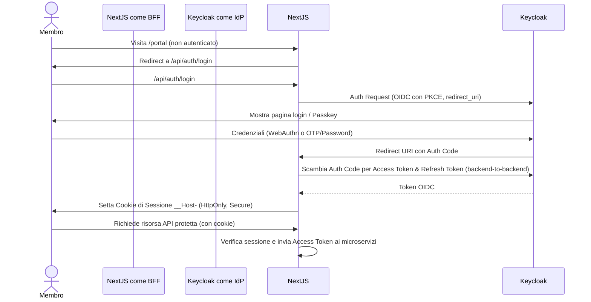
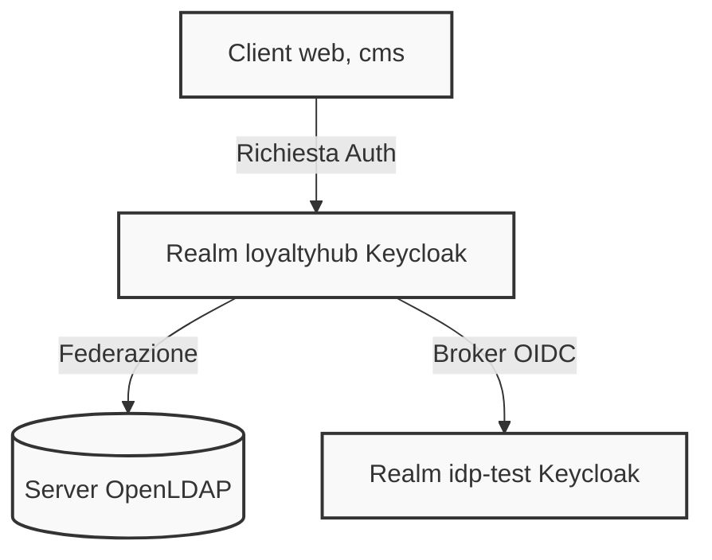

# Configurazione IdP (Identity Provider)

Questa directory contiene la configurazione as-code dell'Identity Provider per il progetto Loyalty Hub (profilo `enterprise`), implementato tramite Keycloak. La gestione avviene secondo l'ADR-027.

## Contenuto

- `realm.json`: Export del realm `loyaltyhub` contenente client, ruoli, mapper e utenti senza password.
- `bootstrap.sh`: Script per l'impostazione delle password temporanee post-avvio per gli utenti demo del backoffice.
- `test-idp/`: Contiene file per l'avvio e la configurazione di un IdP secondario e di un server LDAP di prova (broker e federazione).

## Verifica manuale e avvio locale

L'IdP principale, assieme all'IdP di test e al server LDAP, possono essere avviati tramite Docker Compose utilizzando il profilo `idp`:

```bash
docker compose -f deploy/docker-compose.yml --profile idp up -d idp idp-test ldap
```

Keycloak importa automaticamente il `realm.json` all'avvio.

### Inizializzazione password demo

Poiché il file `realm.json` non include segreti per gli operatori demo (per conformità e sicurezza), è necessario impostare delle password temporanee:

```bash
./deploy/idp/bootstrap.sh
```

Questo script utilizzerà l'account admin predefinito di bootstrap per assegnare una password temporanea (`cambiami123` di default) ai 5 utenti demo: `marta.admin`, `luca.marketing`, `elena.legal`, `paolo.care`, `sara.analyst`.

Il sistema richiederà il cambio password al primo accesso.

## Diagrammi

### Autenticazione portale tramite BFF



### Federazione Identity Broker e LDAP



## Verifica statica

Per assicurarsi che il file `realm.json` sia conforme alle policy (no password in chiaro, redirect URI non assolute con wildcard, token lifespan limitati), eseguire:

```bash
node --test scripts/check-realm.mjs
```

## Strumenti di prova

Usa il file `test-idp/verify.sh` per esempi di come testare login manuale ed ottenere token dagli utenti definiti in LDAP o tramite OIDC identity brokering.
