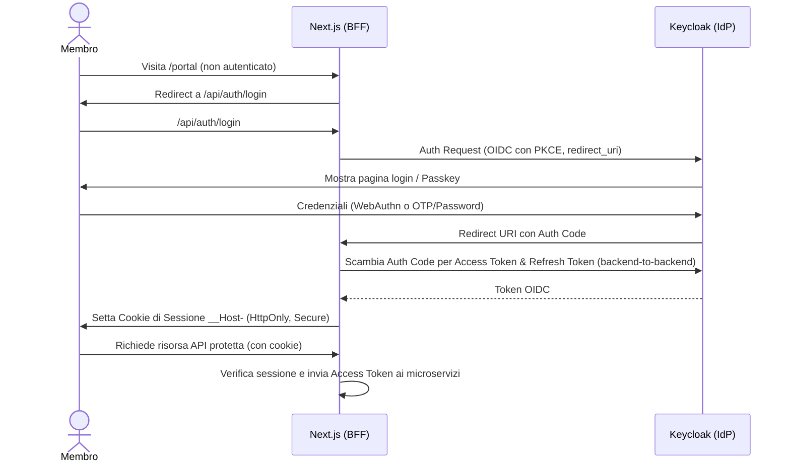
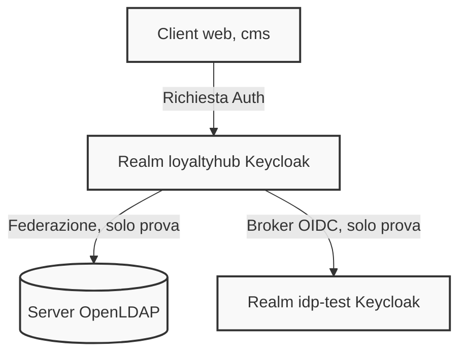

# Configurazione IdP (Identity Provider)

Questa directory contiene la configurazione as-code dell'Identity Provider per il progetto Loyalty Hub (profilo `enterprise`), implementato tramite Keycloak. La gestione avviene secondo l'ADR-027.

## Contenuto

- `realm.json`: export del realm `loyaltyhub` con client, ruoli, client scope (quelli standard di Keycloak 26 più `hub-audience` e `lh-roles-scope`), flussi e utenti senza password. I valori variabili sono segnaposto `${LH_*}` che Keycloak sostituisce con le variabili d'ambiente all'import.
- `bootstrap.sh`: imposta le password temporanee degli operatori demo dopo l'avvio.
- `test-idp/` (**solo prova**, F2-IAM-04): IdP OIDC secondario (`test-realm.json`), LDAP (`ldap-seed.ldif`), overlay del realm (`realm-test-overlay.json`), lo script che lo applica (`apply-overlay.sh`) e la verifica (`verify.sh`).

> Perché i client scope standard sono nel file: se un export contiene l'array `clientScopes`, Keycloak **non** crea i propri scope predefiniti (`profile`, `email`, `roles`, `basic`…). Senza di essi i token non avrebbero `preferred_username`, che `OidcActorFilter` di `libs/lh-common` usa come attore. `scripts/check-realm.mjs` verifica che ogni scope referenziato sia definito.

## Variabili d'ambiente

Il servizio `idp` del compose passa a Keycloak tutte le variabili usate come segnaposto in `realm.json` (lo verifica `scripts/check-realm.mjs`). I segreti non hanno valore nel repository né default: se uno manca il container si ferma subito con `Variabile obbligatoria mancante: <NOME>` (guardia `x-lh-require-env`, CLAUDE.md regola 20). Il controllo è all'avvio e non in interpolazione (`${VAR:?}`) perché Compose interpola anche i servizi dei profili non attivi: `${VAR:?}` renderebbe obbligatori i segreti dell'IdP anche per `up -d kafka postgres kafka-ui`.

| Variabile | Obbligatoria | Default locale | Uso |
|---|---|---|---|
| `LH_IDP_ADMIN_PASSWORD` | sì | — | password dell'amministratore di bootstrap di Keycloak |
| `LH_IDP_ADMIN_USERNAME` | no | `admin` | utente dell'amministratore di bootstrap |
| `LH_WEB_CLIENT_SECRET` | sì | — | segreto del client confidential `web` (BFF) |
| `LH_WIDGETS_CLIENT_SECRET` | sì | — | segreto del client `widgets` |
| `LH_CMS_CLIENT_SECRET` | sì | — | segreto del client `cms` (Directus) |
| `LH_WEB_URL` | no | `http://localhost:3000` | origine del BFF: redirect URI e back-channel logout del client `web` |
| `LH_CMS_URL` | no | `http://localhost:8055` | origine di Directus: redirect URI del client `cms` |
| `LH_JOBS_JWKS_URL` | no | `http://localhost/jwks/lh-jobs.json` | JWKS del client `lh-jobs` (`private_key_jwt`) |
| `LH_SOURCE_<FONTE>_JWKS_URL` | no | `http://localhost/jwks/<fonte>.json` | JWKS dei client fonte `crm`, `app`, `ecommerce`, `billing`, `partner`, `internal`, `simulator` |

Keycloak valida gli URL all'import: un segnaposto non sostituito (es. `${LH_WEB_URL}/…`) fa fallire l'avvio con `Backchannel logout URL is not a valid URL` o `JWKS URL is not a valid URL`. I default JWKS sono segnaposto sintatticamente validi: finché non puntano al JWKS reale della fonte, l'autenticazione `private_key_jwt` di quel client fallisce (fail-closed).

Solo per il profilo di prova `idp-test` (servizi `idp-test` e `ldap`, mai in produzione):

| Variabile | Uso |
|---|---|
| `LH_TEST_IDP_ADMIN_PASSWORD` | amministratore del Keycloak di prova (`idp-test`) |
| `LH_TEST_IDP_SECRET` | segreto del client `loyaltyhub-broker` nel realm `idp-test` e del broker `test-idp` |
| `LH_TEST_IDP_AUTH_URL`, `LH_TEST_IDP_TOKEN_URL`, `LH_TEST_IDP_USERINFO_URL`, `LH_TEST_IDP_ISSUER` | endpoint del realm `idp-test` usati dal broker; con `sslRequired=external` devono essere `https` o puntare a un host locale/privato (es. `http://idp-test:8080/…` nella rete compose) |
| `LH_LDAP_BIND_CREDENTIAL` | password admin dell'LDAP di prova e `bindCredential` della federazione |
| `LH_LDAP_TEST_CLIENT_SECRET` | segreto del client di prova `lh-ldap-test` |

## Avvio locale

```bash
export LH_IDP_ADMIN_PASSWORD=… LH_WEB_CLIENT_SECRET=… LH_WIDGETS_CLIENT_SECRET=… LH_CMS_CLIENT_SECRET=…
docker compose -f deploy/docker-compose.yml up -d postgres
docker compose -f deploy/docker-compose.yml --profile idp up -d idp
```

Keycloak importa `realm.json` al primo avvio (`--import-realm`); se il realm esiste già l'import viene saltato.

### Inizializzazione password demo

Il file `realm.json` non include credenziali per gli operatori demo: dopo l'avvio si assegnano password temporanee.

```bash
KC_BOOTSTRAP_ADMIN_PASSWORD="$LH_IDP_ADMIN_PASSWORD" ./deploy/idp/bootstrap.sh
```

Lo script imposta una password temporanea (da `TEMP_PASS_*` o generata) ai 5 utenti demo `marta.admin`, `luca.marketing`, `elena.legal`, `paolo.care`, `sara.analyst`; Keycloak chiede di cambiarla al primo accesso.

## IdP e LDAP di prova (F2-IAM-04)

`--import-realm` legge solo i file al primo livello della cartella di import e salta un realm già esistente, quindi l'overlay non si applica da solo. `apply-overlay.sh` lo applica al realm avviato:

- broker `test-idp` e client di prova `lh-ldap-test` con `POST /admin/realms/loyaltyhub/partialImport` (`ifResourceExists: OVERWRITE`);
- federazione LDAP con l'API `components` (il partial import non gestisce i componenti): il provider `ldap` esistente viene rimosso e ricreato, i mapper dell'overlay aggiornano quelli predefiniti.

Le API admin non sostituiscono i segnaposto: lo fa lo script, solo per le variabili elencate, e si ferma se ne manca una. Lo script è idempotente.

```bash
export LH_TEST_IDP_ADMIN_PASSWORD=… LH_TEST_IDP_SECRET=… LH_LDAP_BIND_CREDENTIAL=… LH_LDAP_TEST_CLIENT_SECRET=…
export LH_TEST_IDP_AUTH_URL=http://localhost:8089/realms/idp-test/protocol/openid-connect/auth
export LH_TEST_IDP_TOKEN_URL=http://idp-test:8080/realms/idp-test/protocol/openid-connect/token
export LH_TEST_IDP_USERINFO_URL=http://idp-test:8080/realms/idp-test/protocol/openid-connect/userinfo
export LH_TEST_IDP_ISSUER=http://localhost:8089/realms/idp-test
docker compose -f deploy/docker-compose.yml --profile idp --profile idp-test up -d idp idp-test ldap
KC_BOOTSTRAP_ADMIN_PASSWORD="$LH_IDP_ADMIN_PASSWORD" ./deploy/idp/test-idp/apply-overlay.sh
./deploy/idp/test-idp/verify.sh
```

`verify.sh` ottiene un token per l'utente LDAP `testuser` con il client di prova `lh-ldap-test` (il client `web` di produzione ha i direct access grants disattivati), decodifica l'access token e verifica che `aud` contenga `hub`, che `preferred_username` sia `testuser` e che il claim `lh_roles` sia presente. Un utente LDAP senza ruoli applicativi mappati riceve in `lh_roles` solo i ruoli di default del realm (`default-roles-loyaltyhub`, `offline_access`, `uma_authorization`).

Il broker verso `test-idp` richiede un login interattivo nel browser: è un passo manuale descritto in fondo a `verify.sh`. F2-IAM-04 resta aperto finché non è eseguito e registrato.

## Verifica statica

```bash
node --test scripts/check-realm.mjs
```

Controlla ruoli, assenza di segreti letterali (`secret`, `clientSecret`, `bindCredential`) in `realm.json` e nell'overlay, redirect URI senza wildcard assolute, durata dell'access token, `private_key_jwt` per i service account, che ogni client scope referenziato sia definito e che ogni segnaposto `${LH_*}` di `realm.json` sia passato al servizio `idp` del compose. Gira nel job `seed` della CI.

## Diagrammi

### Autenticazione portale tramite BFF



### Federazione Identity Broker e LDAP


