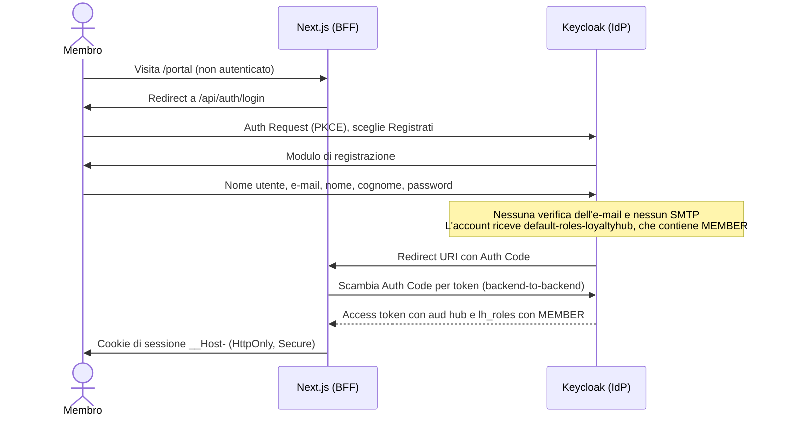
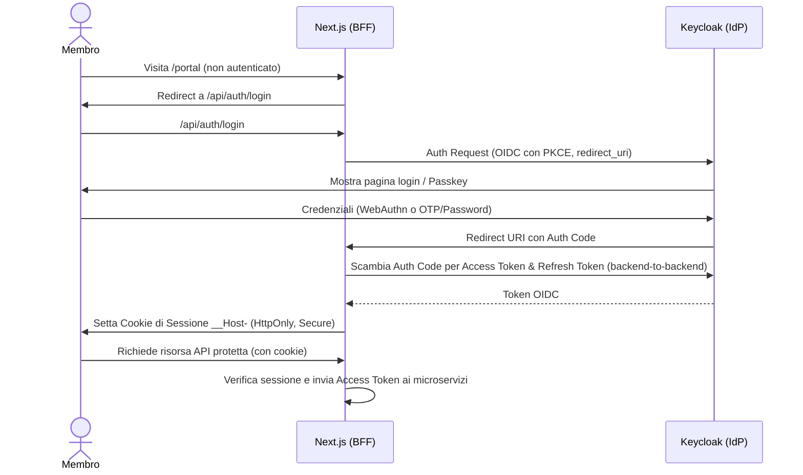
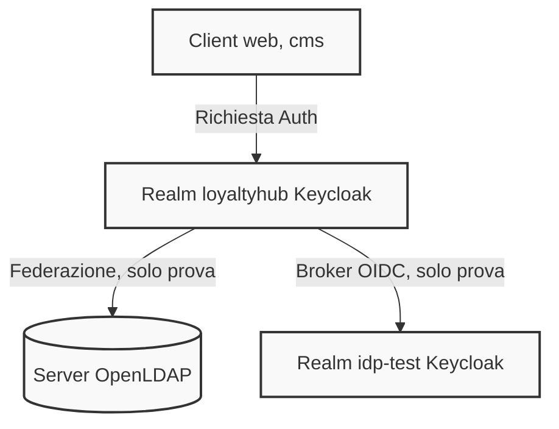

# Configurazione IdP (Identity Provider)

Questa directory contiene la configurazione as-code dell'Identity Provider per il progetto Loyalty Hub (profilo `enterprise`), implementato tramite Keycloak. La gestione avviene secondo l'ADR-027.

## Contenuto

- `realm.json`: export del realm `loyaltyhub` con client, ruoli, client scope (quelli standard di Keycloak 26 più `hub-audience` e `lh-roles-scope`), flussi e utenti senza password. I valori variabili sono segnaposto `${LH_*}` che Keycloak sostituisce con le variabili d'ambiente all'import.
- Fonti di ingestion (Q-492): un client confidential `src-<codice>` per ogni fonte HTTP di `seed/sources.json`, non per le fonti `INTERNAL` (`internal`, `simulator`: non entrano da HTTP e non hanno chiavi da custodire) (`private_key_jwt`, solo service account, JWKS da `LH_SOURCE_<FONTE>_JWKS_URL`, nessun segreto) e l'utenza di servizio `service-account-src-<codice>` con il solo ruolo realm `SOURCE`, incluso nel claim `lh_roles`. Il ruolo `SOURCE` non è una persona: non lo riceve nessun utente demo. Per una fonte creata dopo l'installazione vedi `deploy/README.md` (Q-494).
- Auto-registrazione dei membri (Q-557, ADR-048): `registrationAllowed: true`, `verifyEmail: false` dichiarato, nessun `smtpServer`, ruolo `MEMBER` nel composito del ruolo predefinito `default-roles-loyaltyhub`. L'utenza di servizio del client `lh-jobs` è dichiarata con `realmRoles: []` perché non erediti `MEMBER`. Vedi «Auto-registrazione dei membri».
- `bootstrap.sh`: imposta le password temporanee degli operatori demo dopo l'avvio.
- `test-idp/` (**solo prova**, F2-IAM-04, F2-IAM-03): IdP OIDC secondario (`test-realm.json`), LDAP (`ldap-seed.ldif`), overlay del realm con il broker, il client di prova `lh-ldap-test` e il membro di prova `testmember` (`realm-test-overlay.json`), lo script che lo applica (`apply-overlay.sh`) e la verifica non interattiva della federazione e dei ruoli nei token (`verify.sh`).

> Perché i client scope standard sono nel file: se un export contiene l'array `clientScopes`, Keycloak **non** crea i propri scope predefiniti (`profile`, `email`, `roles`, `basic`…). Senza di essi i token non avrebbero `preferred_username`, che `OidcActorFilter` di `libs/lh-common` usa come attore. `scripts/check-realm.mjs` verifica che ogni scope referenziato sia definito.

## Variabili d'ambiente

Il servizio `idp` del compose passa a Keycloak tutte le variabili usate come segnaposto in `realm.json` (lo verifica `scripts/check-realm.mjs`). I segreti non hanno valore nel repository né default: se uno manca il container si ferma subito con `Variabile obbligatoria mancante: <NOME>` (guardia `x-lh-require-env`, CLAUDE.md regola 20). Il controllo è all'avvio e non in interpolazione (`${VAR:?}`) perché Compose interpola anche i servizi dei profili non attivi: `${VAR:?}` renderebbe obbligatori i segreti dell'IdP anche per `up -d kafka postgres kafka-ui`.

| Variabile | Obbligatoria | Default locale | Uso |
|---|---|---|---|
| `LH_IDP_ADMIN_PASSWORD` | sì | — | password dell'amministratore di bootstrap di Keycloak |
| `LH_IDP_ADMIN_USERNAME` | no | `admin` | utente dell'amministratore di bootstrap |
| `LH_WEB_CLIENT_SECRET` | sì | — | segreto del client confidential `web` (BFF) |
| `LH_WIDGETS_CLIENT_SECRET` | sì | — | segreto del client `widgets` |
| `LH_CMS_CLIENT_SECRET` | sì | — | segreto del client `cms` (Directus) |
| `LH_WEB_URL` | no | `http://localhost:3000` | origine del BFF senza barra finale, la stessa data al web: redirect URI esatta `/api/auth/callback`, ritorno dopo il logout `/` e back-channel logout del client `web` |
| `LH_CMS_URL` | no | `http://localhost:8055` | origine di Directus: redirect URI del client `cms` |
| `LH_JOBS_JWKS_URL` | no | `http://localhost/jwks/lh-jobs.json` | JWKS del client `lh-jobs` (`private_key_jwt`) |
| `LH_SOURCE_<FONTE>_JWKS_URL` | no | `http://localhost/jwks/<fonte>.json` | JWKS del client fonte `src-<fonte>` (`crm`, `app`, `ecommerce`, `billing`, `partner`); la chiave pubblica della fonte si registra qui, all'installazione |

Keycloak valida gli URL all'import: un segnaposto non sostituito (es. `${LH_WEB_URL}/…`) fa fallire l'avvio con `Backchannel logout URL is not a valid URL` o `JWKS URL is not a valid URL`. I default JWKS sono segnaposto sintatticamente validi: finché non puntano al JWKS reale della fonte, l'autenticazione `private_key_jwt` di quel client fallisce (fail-closed).

Solo per il profilo di prova `idp-test` (servizi `idp-test` e `ldap`, mai in produzione):

| Variabile | Uso |
|---|---|
| `LH_TEST_IDP_ADMIN_PASSWORD` | amministratore del Keycloak di prova (`idp-test`) |
| `LH_TEST_IDP_SECRET` | segreto del client `loyaltyhub-broker` nel realm `idp-test` e del broker `test-idp` |
| `LH_TEST_IDP_AUTH_URL`, `LH_TEST_IDP_TOKEN_URL`, `LH_TEST_IDP_USERINFO_URL`, `LH_TEST_IDP_ISSUER` | endpoint del realm `idp-test` usati dal broker; con `sslRequired=external` devono essere `https` o puntare a un host locale/privato (es. `http://idp-test:8080/…` nella rete compose) |
| `LH_LDAP_BIND_CREDENTIAL` | password admin dell'LDAP di prova e `bindCredential` della federazione |
| `LH_LDAP_TEST_CLIENT_SECRET` | segreto del client di prova `lh-ldap-test` |
| `LH_MEMBER_TEST_PASSWORD` | password del membro di prova `testmember` (segnaposto dell'overlay, come le altre credenziali di prova) |

## Avvio locale

```bash
export LH_IDP_ADMIN_PASSWORD=… LH_WEB_CLIENT_SECRET=… LH_WIDGETS_CLIENT_SECRET=… LH_CMS_CLIENT_SECRET=…
docker compose -f deploy/docker-compose.yml up -d postgres
docker compose -f deploy/docker-compose.yml --profile idp up -d idp
```

Keycloak importa `realm.json` al primo avvio (`--import-realm`); se il realm esiste già l'import viene saltato.

### Realm già importato prima di M8.2f (aggiornamento, ADR-038)

Poiché l'import viene saltato, un realm creato prima di M8.2f **non ha** il ruolo `SOURCE` né i client `src-<codice>`: ha ancora i client `crm`, `app`, `ecommerce`, `billing`, `partner`, `internal` e `simulator` senza il ruolo, quindi ogni chiamata di ingestion in `enterprise` risponde `403` dopo l'aggiornamento del servizio. Un aggiornamento di realm è una migrazione da gestire (ADR-038): fai questi passi prima di aggiornare i servizi, con un amministratore del realm.

1. **Prepara il file dell'import parziale** dal nuovo `realm.json` con `jq`: prendi il ruolo `SOURCE` (`roles.realm`), i client `src-*` e le utenze `service-account-src-*`, e sostituisci ogni segnaposto `${LH_SOURCE_<FONTE>_JWKS_URL}` con il JWKS reale della fonte (l'import parziale non sostituisce i segnaposto).

   ```bash
   # Ruolo SOURCE, client src-* e utenze di servizio, con ifResourceExists=SKIP (non tocca ciò che c'è già)
   jq '{ifResourceExists: "SKIP",
        roles: {realm: [.roles.realm[] | select(.name == "SOURCE")]},
        clients: [.clients[] | select(.clientId | startswith("src-"))],
        users: [.users[] | select(.username | startswith("service-account-src-"))]}' \
      deploy/idp/realm.json > partial-import.json
   ```

2. **Importa** con `POST /admin/realms/loyaltyhub/partialImport` (token dell'amministratore, `Content-Type: application/json`).
3. **Correggi `lh-jobs`**: nel client, in *Keys*, attiva *Use JWKS URL* (`use.jwks.url = true`); prima non poteva autenticarsi.
4. **Aggiorna ogni sistema di fonte**: il suo `client_id` diventa `src-<codice>` (per esempio `src-ecommerce`) e il token deve avere l'audience `hub`.
5. **Elimina i vecchi client** `crm`, `app`, `ecommerce`, `billing`, `partner`, `internal` e `simulator` quando tutte le fonti sono passate; non creare client `src-internal` né `src-simulator` (le fonti `INTERNAL` non entrano da HTTP).

Nessuna versione rilasciata contiene `realm.json` prima di M8.2f: la procedura serve solo a chi ha costruito l'IdP da `main` nel frattempo.

### Realm già importato prima dell'auto-registrazione dei membri (aggiornamento, ADR-038)

Poiché l'import viene saltato, un realm creato prima di Q-557 ha ancora `registrationAllowed: false`, nessun `MEMBER` tra i ruoli predefiniti e l'utenza di servizio di `lh-jobs` con il ruolo predefinito (l'ha creata Keycloak). Un aggiornamento di realm è una migrazione da gestire (ADR-038): fai questi passi con un amministratore del realm; sono idempotenti e vanno fatti **prima** di rilasciare i moduli che leggono `MEMBER` dal token. I comandi sono stati provati su Keycloak 26.7.4 partendo da un realm importato con il `realm.json` precedente.

1. **Prepara il token di amministrazione e il prefisso delle chiamate** (la password dell'amministratore resta nell'ambiente, mai nella riga di comando):

   ```bash
   KC=http://localhost:8080 ; R="$KC/admin/realms/loyaltyhub"
   TOKEN=$(curl -sS -f -X POST "$KC/realms/master/protocol/openid-connect/token" -d client_id=admin-cli -d grant_type=password \
             -d username="${LH_IDP_ADMIN_USERNAME:-admin}" --data-urlencode "password=$LH_IDP_ADMIN_PASSWORD" | jq -r .access_token)
   AUTH="Authorization: Bearer $TOKEN"
   ```

2. **Apri la registrazione, senza verifica dell'e-mail** (la `PUT` è parziale: cambia solo i campi indicati):

   ```bash
   curl -sS -f -X PUT "$R" -H "$AUTH" -H 'Content-Type: application/json' -d '{"registrationAllowed": true, "verifyEmail": false}'
   ```

3. **Aggiungi `MEMBER` al composito dei ruoli predefiniti**:

   ```bash
   MEMBER=$(curl -sS -f "$R/roles/MEMBER" -H "$AUTH" | jq -c '[{id, name}]')
   curl -sS -f -X POST "$R/roles/default-roles-loyaltyhub/composites" -H "$AUTH" -H 'Content-Type: application/json' -d "$MEMBER"
   ```

   Ogni utente che ha già il ruolo predefinito (per esempio un operatore creato dalla console dopo l'import) riceve così anche `MEMBER`: il suo token diventa misto e vale come operatore, mai come membro (Q-554); nessun potere cambia.

4. **Togli il ruolo predefinito all'utenza di servizio di `lh-jobs`** (un job non è un membro). Ripeti per ogni altra utenza `service-account-*` creata dalla console dopo l'import e senza ruoli applicativi; le utenze `service-account-src-*` hanno già solo `SOURCE`:

   ```bash
   ID=$(curl -sS -f "$R/users?username=service-account-lh-jobs&exact=true" -H "$AUTH" | jq -r '.[0].id')
   DEFAULT=$(curl -sS -f "$R/roles/default-roles-loyaltyhub" -H "$AUTH" | jq -c '[{id, name}]')
   curl -sS -f -X DELETE "$R/users/$ID/role-mappings/realm" -H "$AUTH" -H 'Content-Type: application/json' -d "$DEFAULT"
   ```

5. **Verifica**: la pagina di login del client `web` mostra «Registrati»; dopo una registrazione di prova l'access token ha `MEMBER` in `lh_roles` (elimina poi l'account di prova dalla console). Sul realm di prova lo stesso controllo, non interattivo, è `verify.sh member sources` (vedi «Verifica dei ruoli nei token»). Il realm non si reimporta: l'import salta un realm esistente.

### Inizializzazione password demo

Il file `realm.json` non include credenziali per gli operatori demo: dopo l'avvio si assegnano password temporanee.

```bash
KC_BOOTSTRAP_ADMIN_PASSWORD="$LH_IDP_ADMIN_PASSWORD" ./deploy/idp/bootstrap.sh
```

Lo script imposta una password temporanea (da `TEMP_PASS_*` o generata) ai 5 utenti demo `marta.admin`, `luca.marketing`, `elena.legal`, `paolo.care`, `sara.analyst`; Keycloak chiede di cambiarla al primo accesso.

## Auto-registrazione dei membri (Q-557, F2-IAM-03)

Il realm è aperto alla registrazione: la pagina di login mostra «Registrati» e il flusso `registration` predefinito di Keycloak (nome utente, e-mail, nome, cognome, password) crea l'account e riporta al client `web` già autenticato. Chi si registra riceve il solo ruolo `MEMBER` (più quelli tecnici di Keycloak) e con quel token può usare soltanto le funzioni del portale. Il legame tra l'account e il membro (`member_identity`) lo crea la registrazione dal portale, non l'IdP (ADR-048).

| Impostazione di `realm.json` | Valore | Perché |
|---|---|---|
| `registrationAllowed` | `true` | sblocca PT-16 (auto-registrazione) senza componenti nuovi |
| `verifyEmail` | `false`, dichiarato | la verifica richiede un `smtpServer`, cioè una nuova destinazione di rete in uscita: caso «Fermati e chiedi» di CLAUDE.md §7, serve un'ADR e non prima del modulo `delivery` (M8.4) |
| `smtpServer` | assente | come sopra |
| ruolo predefinito `default-roles-loyaltyhub` | `MEMBER` (Keycloak aggiunge `offline_access`, `uma_authorization` e i ruoli del client `account`) | ogni account creato dopo l'import diventa membro |


```mermaid
sequenceDiagram
    accTitle: Auto-registrazione di un membro
    accDescr: Il membro si registra nel modulo di Keycloak senza verifica dell'e-mail, riceve il ruolo predefinito MEMBER e il BFF ottiene un token con lh_roles che contiene MEMBER
    actor Membro
    participant NextJS as Next.js (BFF)
    participant Keycloak as Keycloak (IdP)

    Membro->>NextJS: Visita /portal (non autenticato)
    NextJS->>Membro: Redirect a /api/auth/login
    Membro->>Keycloak: Auth Request (PKCE), sceglie Registrati
    Keycloak->>Membro: Modulo di registrazione
    Membro->>Keycloak: Nome utente, e-mail, nome, cognome, password
    Note over Keycloak: Nessuna verifica dell'e-mail e nessun SMTP<br/>L'account riceve default-roles-loyaltyhub, che contiene MEMBER
    Keycloak->>NextJS: Redirect URI con Auth Code
    NextJS->>Keycloak: Scambia Auth Code per token (backend-to-backend)
    Keycloak-->>NextJS: Access token con aud hub e lh_roles con MEMBER
    NextJS->>Membro: Cookie di sessione __Host- (HttpOnly, Secure)
```

Il token di un membro appena registrato (provato con un import reale su Keycloak 26.7.4) ha `aud` = `hub` e `account`, `preferred_username`, `email`, `email_verified: false` e `lh_roles` = `default-roles-loyaltyhub`, `offline_access`, `uma_authorization`, `MEMBER`. Per `OidcActorFilter` è un token di solo membro: `MEMBER` senza ruoli operatore.

Da sapere:

- **L'e-mail non è verificata.** `email_verified` resta `false` e non è una garanzia: nessun collegamento tra un account e un membro già esistente (CRM, import) può fondarsi sull'e-mail (Q-558). Per abilitare la verifica servono un'ADR, uno `smtpServer` e `verifyEmail: true`; `scripts/check-realm.mjs` la vieta finché non cambia insieme all'ADR.
- **Chi riceve `MEMBER`.** Ogni account creato dopo l'import: registrazione, console di amministrazione, utenti federati da LDAP o dal broker senza ruoli mappati. Un operatore creato dalla console riceve `MEMBER` insieme al ruolo operatore: il token misto vale come operatore (Q-554). Non lo ricevono gli utenti elencati in `realm.json`, perché l'import assegna solo i `realmRoles` scritti (operatori demo e utenze `service-account-src-*`), né `service-account-lh-jobs`: un client con service account non dichiarato negli `users` ottiene da Keycloak un'utenza con il ruolo predefinito, quindi con `MEMBER`; dichiararla con `realmRoles: []` lo evita, e `scripts/check-realm.mjs` lo controlla per ogni client con service account.
- **Il realm è condiviso** con il backoffice (`web`), con Directus (`cms`) e con i widget: un account registrato può autenticarsi su qualunque client del realm. `MEMBER` non dà nulla fuori dal portale, e la mappatura dei ruoli di Directus (M10.2) non deve concederlo. `bruteForceProtected` protegge gli accessi, non le registrazioni: Keycloak non ne limita la frequenza, e un limite va messo davanti all'IdP.
- **Perché il file è fatto così.** Per l'import di Keycloak i composti del ruolo predefinito valgono solo nell'entry `default-roles-loyaltyhub` di `roles.realm`, e `defaultRole` deve nominarla: i `composites` scritti dentro `defaultRole` sono ignorati in silenzio, e senza `defaultRole` Keycloak crea un secondo ruolo `default-roles-loyaltyhub-1` come predefinito e `MEMBER` non arriva a nessuno (verificato con l'import reale; lo controlla `scripts/check-realm.mjs`).

## IdP e LDAP di prova (F2-IAM-04)

`--import-realm` legge solo i file al primo livello della cartella di import e salta un realm già esistente, quindi l'overlay non si applica da solo. `apply-overlay.sh` lo applica al realm avviato:

- broker `test-idp`, client di prova `lh-ldap-test` e membro di prova `testmember` con `POST /admin/realms/loyaltyhub/partialImport` (`ifResourceExists: OVERWRITE`);
- federazione LDAP con l'API `components` (il partial import non gestisce i componenti): il provider `ldap` esistente viene rimosso e ricreato, i mapper dell'overlay aggiornano quelli predefiniti.

Le API admin non sostituiscono i segnaposto: lo fa lo script, solo per le variabili elencate, e si ferma se ne manca una. Lo script è idempotente.

```bash
export LH_TEST_IDP_ADMIN_PASSWORD=… LH_TEST_IDP_SECRET=… LH_LDAP_BIND_CREDENTIAL=… LH_LDAP_TEST_CLIENT_SECRET=… LH_MEMBER_TEST_PASSWORD=…
export LH_TEST_IDP_AUTH_URL=http://localhost:8089/realms/idp-test/protocol/openid-connect/auth
export LH_TEST_IDP_TOKEN_URL=http://idp-test:8080/realms/idp-test/protocol/openid-connect/token
export LH_TEST_IDP_USERINFO_URL=http://idp-test:8080/realms/idp-test/protocol/openid-connect/userinfo
export LH_TEST_IDP_ISSUER=http://localhost:8089/realms/idp-test
docker compose -f deploy/docker-compose.yml --profile idp --profile idp-test up -d idp idp-test ldap
KC_BOOTSTRAP_ADMIN_PASSWORD="$LH_IDP_ADMIN_PASSWORD" ./deploy/idp/test-idp/apply-overlay.sh
KC_BOOTSTRAP_ADMIN_PASSWORD="$LH_IDP_ADMIN_PASSWORD" ./deploy/idp/test-idp/verify.sh
```

**Credenziali di prova.** Le password e i segreti dell'overlay sono segnaposto `${LH_*}` sostituiti da `apply-overlay.sh` dalle variabili d'ambiente (lo script si ferma se una manca e non stampa mai i valori); nel repository non c'è nessun valore, e `scripts/check-realm.mjs` verifica che ogni credenziale dell'overlay, compresa la password di `testmember`, sia un segnaposto e che i segnaposto dell'overlay coincidano con l'elenco `OVERLAY_VARS` di `apply-overlay.sh`. Fanno eccezione solo i due utenti fittizi `testuser` dei server di prova, con la password nel seed `ldap-seed.ldif` e in `test-realm.json` (dati di prova, non segreti).

`verify.sh` esegue tre controlli, in quest'ordine, e si ferma al primo che fallisce (esce con 1). Si può scegliere quali con gli argomenti: `verify.sh member sources`.

| Controllo | Cosa verifica | Variabili |
|---|---|---|
| `ldap` | Un token per l'utente LDAP `testuser` con il client di prova `lh-ldap-test` (il client `web` di produzione ha i direct access grants disattivati): `aud` contiene `hub`, `preferred_username` è `testuser`, il claim `lh_roles` è presente. Un utente LDAP senza ruoli applicativi mappati riceve in `lh_roles` solo i ruoli di default del realm (`default-roles-loyaltyhub`, `offline_access`, `uma_authorization` e, dall'auto-registrazione dei membri, `MEMBER`). | `LH_LDAP_TEST_CLIENT_SECRET` |
| `member` | Il token di `testmember` (Q-557, ADR-048): `lh_roles` contiene `MEMBER` e nessun altro ruolo applicativo, `email_verified` è `false`. | `LH_LDAP_TEST_CLIENT_SECRET`, `LH_MEMBER_TEST_PASSWORD` |
| `sources` | Un token `client_credentials` per ogni client `src-*` del realm: `lh_roles` è esattamente `["SOURCE"]`, quindi mai `MEMBER` né ruoli operatore (Q-557, Q-494, ADR-048). | `KC_BOOTSTRAP_ADMIN_PASSWORD` (o `LH_IDP_ADMIN_PASSWORD`) |

Il broker verso `test-idp` richiede un login interattivo nel browser: è un passo manuale descritto in fondo a `verify.sh` (stampato dal controllo `ldap`). F2-IAM-04 resta aperto finché non è eseguito e registrato.

### Verifica dei ruoli nei token (F2-IAM-03, Q-557)

I controlli `member` e `sources` fanno fallire con un messaggio esplicito (e uscita 1) ogni deriva che farebbe cambiare valore a un token nel portale o nell'ingestion: un ruolo operatore o `SOURCE` sul membro, `MEMBER` tolto dal composito del ruolo predefinito, `email_verified` diventato `true`, `MEMBER` (o altro) sull'utenza di servizio di una fonte.

- **Il membro di prova.** `testmember` è nell'overlay con il solo ruolo predefinito `default-roles-loyaltyhub`, come un account registrato: un utente creato con `partialImport` non riceve il ruolo predefinito da solo (provato su Keycloak 26.7.4: senza `realmRoles` il token non ha `lh_roles`), quindi lo dichiara. `MEMBER` gli arriva dal composito del ruolo predefinito: il controllo prova che il realm importato lo contiene davvero.
- **«Solo MEMBER».** Nel claim Keycloak espande il composito e aggiunge i propri ruoli tecnici: il token del membro ha `lh_roles` = `default-roles-loyaltyhub`, `offline_access`, `uma_authorization`, `MEMBER`, lo stesso di un account registrato. Il controllo `member` accetta quei tre ruoli tecnici e `MEMBER`; qualunque altro ruolo (operatore, `SOURCE`, `MFA_REQUIRED_ROLE`) e l'assenza di `MEMBER` sono un errore. Per le fonti l'uguaglianza è stretta: `["SOURCE"]` e nient'altro, perché le loro utenze non hanno ruoli predefiniti.
- **Il token delle fonti.** I client `src-*` autenticano con `private_key_jwt` e il repository non ha le chiavi delle fonti. Il controllo `sources` genera quindi una coppia RSA usa-e-getta in una cartella temporanea (`0700`, cancellata all'uscita, mai nel repository), registra per pochi secondi la chiave pubblica come JWKS inline del client (solo gli attributi `use.jwks.url`, `use.jwks.string` e `jwks.string`, con un `PUT` parziale dell'API admin), firma l'asserzione, chiede il token e **ripristina subito gli attributi originali**. Il ripristino avviene anche se il controllo fallisce o viene interrotto (`INT`, `TERM`); se non riesce, lo script si ferma con un errore (uscita 1) e stampa cosa correggere a mano. I client si leggono dal realm (`clientId` che inizia per `src-`), non dal repository, quindi anche una fonte creata dopo l'installazione (Q-494) è controllata; un realm senza client `src-*` è un errore, un client disabilitato è saltato con un avviso.
- **Solo sul realm di prova.** `sources` si rifiuta di girare se nel realm manca il client `lh-ldap-test`, cioè se l'overlay non è stato applicato: non registra chiavi di prova sui client di un realm che potrebbe servire fonti vere. Non va mai eseguito contro la produzione.

## Verifica statica

```bash
node --test scripts/check-realm.mjs
```

Controlla ruoli (compreso `SOURCE`), un client `src-<codice>` per ogni fonte del seed con impostazioni e utenza di servizio (solo `SOURCE`), assenza di segreti letterali (`secret`, `clientSecret`, `bindCredential`) in `realm.json` e nell'overlay, redirect URI senza wildcard assolute, URI del client `web` uguali ai percorsi del BFF (callback, ritorno dopo il logout, back-channel logout), durata dell'access token, `private_key_jwt` per i service account, che ogni client scope referenziato sia definito, che ogni segnaposto `${LH_*}` di `realm.json` sia passato al servizio `idp` del compose, la registrazione aperta senza verifica dell'e-mail né `smtpServer` (Q-557), `MEMBER` come solo composito del ruolo predefinito (con `defaultRole` che lo nomina e nessun `SOURCE`, operatore o MFA tra i predefiniti) e un'utenza dichiarata, con ruoli espliciti e senza ruolo predefinito, per ogni client con service account. Verifica anche l'overlay di prova: che ogni credenziale sia un segnaposto (compresa la password di `testmember`), che il membro di prova abbia il solo ruolo predefinito e l'e-mail non verificata e che i segnaposto dell'overlay coincidano con `OVERLAY_VARS` di `apply-overlay.sh`. La copia del realm nel chart è verificata da `scripts/check-helm.mjs`. Gira nel job `seed` della CI. `verify.sh` non gira in CI: ha bisogno di un Keycloak avviato con l'overlay (e dell'LDAP di prova per `ldap`).

## Diagrammi

### Autenticazione portale tramite BFF


```mermaid
sequenceDiagram
    accTitle: Autenticazione BFF
    accDescr: Flusso di login per i membri tramite Backend-for-Frontend
    actor Membro
    participant NextJS as Next.js (BFF)
    participant Keycloak as Keycloak (IdP)

    Membro->>NextJS: Visita /portal (non autenticato)
    NextJS->>Membro: Redirect a /api/auth/login
    Membro->>NextJS: /api/auth/login
    NextJS->>Keycloak: Auth Request (OIDC con PKCE, redirect_uri)
    Keycloak->>Membro: Mostra pagina login / Passkey
    Membro->>Keycloak: Credenziali (WebAuthn o OTP/Password)
    Keycloak->>NextJS: Redirect URI con Auth Code
    NextJS->>Keycloak: Scambia Auth Code per Access Token & Refresh Token (backend-to-backend)
    Keycloak-->>NextJS: Token OIDC
    NextJS->>Membro: Setta Cookie di Sessione __Host- (HttpOnly, Secure)
    Membro->>NextJS: Richiede risorsa API protetta (con cookie)
    NextJS->>NextJS: Verifica sessione e invia Access Token ai microservizi
```

### Federazione Identity Broker e LDAP


```mermaid
flowchart TD
    accTitle: Federazione Identità
    accDescr: Schema della connessione del realm principale con IdP secondario e LDAP

    Client[Client web, cms] -->|Richiesta Auth| KMain[Realm loyaltyhub Keycloak]
    KMain -->|Federazione, solo prova| LDAP[(Server OpenLDAP)]
    KMain -->|Broker OIDC, solo prova| KTest[Realm idp-test Keycloak]

    classDef default fill:#f9f9f9,stroke:#333,stroke-width:2px;
```
