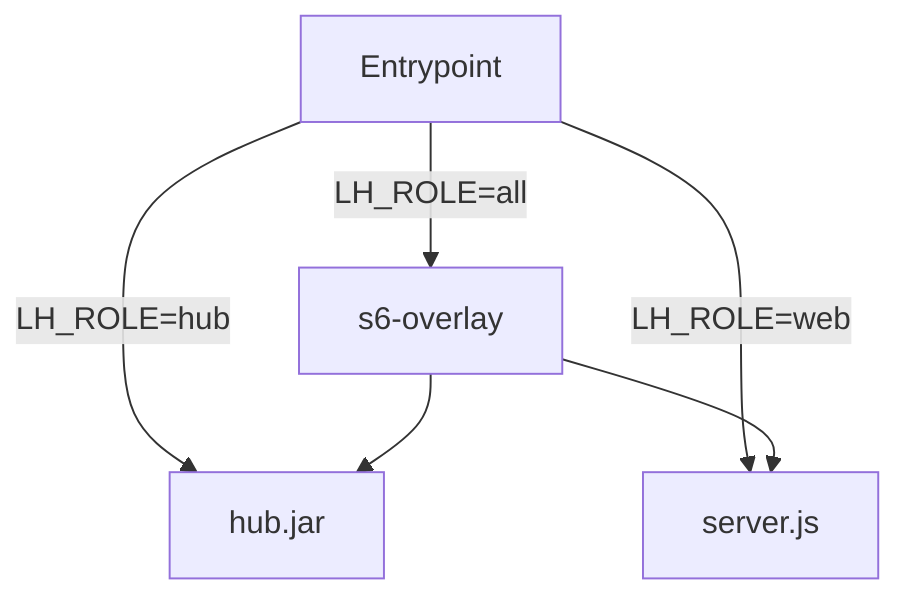

# Immagine unica a ruoli

L'immagine unica raccoglie in un solo artefatto (`ghcr.io/loyaltyhub/loyaltyhub`) i servizi backend Java e il frontend web. Consente di avviare l'architettura tramite ruoli configurabili.

| Variabile | Valori previsti | Descrizione |
| --------- | --------------- | ----------- |
| `LH_ROLE` | `hub`, `web`, `all` | Sceglie cosa eseguire. |
| `LH_SERVICES` | es. `member-service,campaign-service` | Moduli da caricare in Spring (di default li carica tutti). |
| `LH_MODE` | `external` | Modalità d'uso, per ora supporta solo database e bus esterni al container. |
| `LH_PROFILE`| `demo`, `enterprise` | Il profilo che viene passato al backend Java (es. profili Spring). |

Supporta per ogni variabile anche l'uso del suffisso `_FILE` (es. `LH_PROFILE_FILE=/run/secrets/profile_file`).

