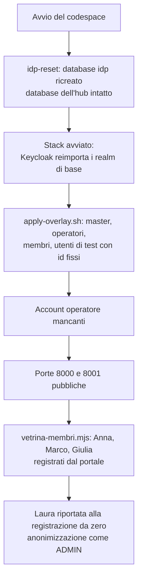

# Vetrina enterprise: runbook

Questa cartella installa e mantiene la **vetrina enterprise** (F2-DIST-09, ADR-049): una seconda installazione di Loyalty Hub in `LH_PROFILE=enterprise`, separata dalla demo, in un GitHub Codespace acceso su richiesta (ADR-050) oppure su un host fisso (ADR-049). Usa il compose di riferimento (`deploy/compose/reference.yml`, F2-DIST-03) più l'overlay di questa cartella.

La vetrina serve a far vedere online login reale, MFA e audit con l'attore del token. Non è ad alta disponibilità, contiene solo dati fittizi e si azzera ogni settimana, senza backup (Q-624). Il contesto per chi legge la documentazione è nella pagina «Vetrina enterprise» del sito (`concetti/vetrina-enterprise.mdx`).

## Cosa c'è nella cartella

| File | A cosa serve |
|---|---|
| `compose.vetrina.yml` | Overlay del compose di riferimento: reverse proxy TLS, TLS verso Kafka e Postgres, segreti da file, profilo fisso. |
| `caddy/Caddyfile` | Reverse proxy con certificati ACME per i due nomi `web` e `idp` (Q-620). |
| `postgres/pg_hba.conf` | Postgres accetta dalla rete solo connessioni TLS (Q-621). |
| `kafka/client-ssl.properties` | Client TLS del controllo di salute di Kafka. |
| `compose.codespace.yml` | Overlay aggiuntivo per il codespace: proxy in HTTP su `127.0.0.1:8000` e `8001`, niente ACME né alias (Q-661). |
| `caddy/Caddyfile.codespace` | Proxy del codespace: instrada per porta, Keycloak solo per il realm `loyaltyhub`. |
| `vetrina.sh` | Comandi: `codespace`, `provision`, `preflight`, `up`, `down`, `reset`, `idp-reset`, `operators`, `membri`, `programma`, `compose`. |
| `scripts/vetrina-membri.mjs` | Registra Anna, Marco e Giulia dal portale e riporta Laura alla registrazione da zero (Q-673). |
| `operatori.py` | Crea gli account operatore nominativi con MFA (Q-618) a ogni azzeramento. |
| `vetrina.env.example` | Modello della configurazione dell'host, senza segreti. |
| `systemd/` | Servizio e timer dell'azzeramento settimanale (solo host fisso). |

Il dev container del codespace è in `.devcontainer/vetrina/` (`devcontainer.json` e `avvio.sh`).

## Come è fatta l'istanza

- **Un solo componente nuovo: il reverse proxy** (Caddy, regola 8-bis, ADR-049). Ottiene da solo i certificati ACME per `LH_VETRINA_WEB_HOST` e `LH_VETRINA_IDP_HOST` ed è l'unico servizio con porte raggiungibili da fuori: 80 e 443, pubblicate sull'indirizzo privato dell'istanza (`LH_VETRINA_PUBLIC_ADDRESS`), mai su `0.0.0.0`.
- **Web e Keycloak solo su `127.0.0.1`** (`LH_BIND_ADDRESS=127.0.0.1`). L'hub è su `127.0.0.1:8080` solo per lo script del programma. Postgres e Kafka restano sulla rete interna.
- **Keycloak dal proxy solo per il realm `loyaltyhub`.** La console `/admin` e il realm `master` rispondono `404` da fuori: si usano da `127.0.0.1:8180` con un tunnel SSH.
- **TLS verso bus e database con una CA locale** generata sull'host (Q-621). Kafka ha un listener SSL con certificato del client obbligatorio (l'hub usa `KAFKA_SECURITY=SSL_PEM`). Postgres rifiuta le connessioni in chiaro e hub, migrazioni e Keycloak si collegano con `sslmode=verify-full`, che controlla anche CA e nome. Se un URL del database perde `verify-full` o Kafka non è `SSL_PEM`, il container si ferma con `INSECURE_CONFIG`.
- **Segreti solo da file** (regola 20). Ogni segreto arriva al container come `<VAR>_FILE` da `/run/secrets`. La variabile in chiaro è forzata a vuoto, e il container si ferma se la trova piena.
- **Limiti di memoria per ogni container**, per circa 6,5 GB in tutto sui 12 GB dell'host: Postgres 1 GB, Kafka 1 GB (heap 512 MB), hub 2 GB, web 768 MB, Keycloak 1,5 GB, proxy 128 MB.

## Vetrina in un codespace

È l'hosting scelto (ADR-050, Q-660…Q-663): un GitHub Codespace del repository, acceso dal proprietario prima di una demo, che si ferma da solo dopo l'inattività. Il resto di questo file vale per un host fisso.

### Una volta sola

1. **Quota a costo zero** (Q-660). In *Settings → Billing and licensing* dell'account GitHub verifica che Codespaces non abbia un metodo di pagamento, oppure imposta un budget a 0: a fine quota gratuita l'uso si blocca invece di addebitare.
2. **Timeout di inattività.** In *Settings → Codespaces* alza il *Default idle timeout* (fino a 240 minuti) se una demo dura più di 30 minuti: il traffico dei visitatori non conta come attività, solo il terminale.
3. **Segreti del codespace** (*Settings → Codespaces → Secrets*, con accesso a questo repository), tutti facoltativi:

   | Segreto | Contenuto |
   |---|---|
   | `LH_VETRINA_OPERATORS` | Account operatore, una riga per account o separati da `;`: `<nome utente> <RUOLO> <e-mail>` (Q-618, Q-663). |
   | `LH_IMAGE` | Immagine unica da usare; senza, `ghcr.io/<proprietario>/loyaltyhub` all'ultimo tag `v*` del repository. |
   | `LH_HUB_DEMO_URL` | Origine https della demo per «Torna alla demo» in HUB-02. |

### Prima di una demo

1. Dal repository: *Code → Codespaces → … → New with options*, configurazione **Vetrina enterprise**, macchina da 4 core. Se il codespace esiste già, riaccendilo da *Code → Codespaces*.
2. Attendi la fine di `avvio.sh` (il terminale *Creation log*, oppure `sudo cat /workspaces/.loyaltyhub-vetrina/avvio.log`). Al primo avvio servono alcuni minuti per scaricare le immagini e avviare Keycloak e Kafka.
3. Se lo script avvisa che non riesce a rendere pubbliche le porte, nel pannello *Porte* fai clic destro su 8000 e 8001, *Visibilità della porta → Pubblica*. Le altre porte restano private.
4. L'indirizzo della vetrina è `https://<nome del codespace>-8000.app.github.dev`. Mettilo in `LH_HUB_ENTERPRISE_URL` della demo per il pulsante di HUB-01: il nome del codespace non cambia finché non lo cancelli.
5. Al primo avvio, o dopo un azzeramento, applica il programma dal terminale del codespace: `sudo --preserve-env=LH_VETRINA_CONFIG env "PATH=$PATH" bash deploy/vetrina/vetrina.sh programma` (`PATH` serve a trovare Node.js) (Q-630). Le password temporanee degli operatori sono in `/workspaces/.loyaltyhub-vetrina/operator-passwords.txt` (leggile con `sudo cat`): consegnale fuori banda e cancella il file.

Fermare e riaccendere il codespace conserva dati e account. Un codespace nuovo parte vuoto; per azzerare quello attuale usa `sudo --preserve-env=LH_VETRINA_CONFIG bash deploy/vetrina/vetrina.sh reset`.

### Come cambia rispetto all'host fisso

- **Ingresso.** Niente IP pubblico né certificati ACME: il TLS lo termina l'inoltro delle porte di GitHub. Il proxy Caddy resta, in HTTP su `127.0.0.1:8000` (web) e `127.0.0.1:8001` (Keycloak), per tenere fuori la console `/admin` e il realm `master` e per le intestazioni di sicurezza.
- **Emittente OIDC.** Web e hub chiamano Keycloak con lo stesso indirizzo pubblico del browser, passando dall'inoltro di GitHub (Q-420): per questo la porta 8001 deve essere pubblica.
- **Console di Keycloak.** Si apre dal browser, senza comandi sul tuo PC: nel codespace, scheda *Porte*, riga 8180 «Keycloak con console /admin (resta privata)», icona del globo, poi `/admin/`. L'indirizzo è `https://<nome>-8180.<dominio di inoltro>/admin/` e `vetrina.sh codespace` lo stampa all'avvio. La porta resta **privata**: GitHub la apre solo al proprietario del codespace, dopo il suo login; poi Keycloak chiede l'utente `admin` e la password di `/workspaces/.loyaltyhub-vetrina/secrets/idp-admin-password` (leggila con `sudo cat`). Non renderla pubblica: dal proxy pubblico (porta 8001) `/admin` e il realm `master` restano `404`.
- **Architettura.** Il codespace è amd64: `preflight` controlla le immagini per l'architettura dell'host, non più solo arm64.
- **Azzeramento.** Niente timer settimanale (non gira a codespace fermo): vale Q-663.

### Utenti di test (ADR-051 decisione 1)

> **Ambiente di test, dati fittizi.** Le credenziali qui sotto sono **pubbliche** e valgono solo nel codespace: sull'host fisso `vetrina.sh` applica gli overlay con `--no-test-users` e questi account non esistono. Non inserire mai dati personali veri.

Gli utenti hanno id fissi (UUID) e li ricrea `deploy/idp/vetrina/apply-overlay.sh` a ogni avvio dai due overlay `realm-vetrina-overlay.json` e `realm-members-vetrina-overlay.json`, che sono l'unica fonte. Gli operatori hanno `MFA_REQUIRED_ROLE`, quindi chiedono password **e** codice OTP. Tutti hanno il ruolo `LH_TEST_USER`, l'unico che hub e web accettano per credenziali fisse e solo con `LH_TEST_USERS_ALLOWED=true` e `LH_ENVIRONMENT=test`.

| Utente | Realm | Ruolo | Password |
|---|---|---|---|
| `marta.admin` | `loyaltyhub` | `ADMIN` | `Aurora-Operatori-26!` |
| `luca.marketing` | `loyaltyhub` | `MARKETING` | `Aurora-Operatori-26!` |
| `elena.legal` | `loyaltyhub` | `LEGAL` | `Aurora-Operatori-26!` |
| `paolo.care` | `loyaltyhub` | `CARE` | `Aurora-Operatori-26!` |
| `sara.analyst` | `loyaltyhub` | `ANALYST` | `Aurora-Operatori-26!` |
| `anna.rossi` | `loyaltyhub-members` | `MEMBER` | `Aurora-Membri-26!` |
| `marco.bianchi` | `loyaltyhub-members` | `MEMBER` | `Aurora-Membri-26!` |
| `giulia.ferri` | `loyaltyhub-members` | `MEMBER` | `Aurora-Membri-26!` |
| `laura.conti` | `loyaltyhub-members` | `MEMBER` | `Aurora-Membri-26!` |
| `vetrina.admin` | `loyaltyhub` (console) | gestione utenti, senza ruoli applicativi | `Aurora-Admin-26!` |
| `membri.admin` | `loyaltyhub-members` (console) | gestione utenti, senza ruoli applicativi | `Aurora-Admin-26!` |

**Codice OTP degli operatori.** I cinque operatori condividono un solo seme TOTP (SHA-1, 6 cifre, 30 secondi). Aggiungilo a un'app di autenticazione inserendo la chiave a mano, oppure con questo URI:

- seme in base32: `KZSXI4TJNZQUC5LSN5ZGCMRQGI3EY2BB`
- URI: `otpauth://totp/Vetrina%20Aurora:marta.admin?secret=KZSXI4TJNZQUC5LSN5ZGCMRQGI3EY2BB&issuer=Vetrina%20Aurora&algorithm=SHA1&digits=6&period=30`

Non c'è un'immagine con il codice QR: nessun generatore offline è tra le dipendenze del repository, e non si usano servizi esterni per non far uscire il seme. Per la stessa finestra di 30 secondi Keycloak non accetta due volte lo stesso codice: se due persone accedono insieme, la seconda aspetta il codice successivo.

Gli amministratori `vetrina.admin` e `membri.admin` aprono la console del proprio realm e hanno solo i cinque ruoli di `realm-management` `view-users`, `query-users`, `query-groups`, `manage-users` e `view-events`: non cambiano la configurazione del realm (Q-671). Con `manage-users` possono però assegnare ruoli agli utenti del loro realm: è il limite accettato dalla decisione. Gli eventi di amministrazione di Keycloak sono attivi con i dettagli della rappresentazione in entrambi i realm, e anche in `master`. **Limite (Q-677):** le modifiche fatte da questi amministratori nelle console restano negli eventi di Keycloak e non arrivano in `audit_entry` finché non c'è il ponte di M8.12, che coprirà entrambi i realm. La console del realm `master` resta privata (Q-670).

### Keycloak da zero a ogni avvio

A ogni avvio `vetrina.sh codespace` ricrea il database `idp` di Keycloak (comando `idp-reset`), prima di avviare lo stack. Così il realm torna alla configurazione del repository e non resta nulla dei cambi fatti dalla console. Il database dell'hub non si tocca: i membri registrati restano e il loro legame con l'utente di Keycloak resta valido, perché gli id degli utenti sono fissi.



### Scenario dei quattro membri

`scripts/vetrina-membri.mjs` (comando `vetrina.sh membri`) usa solo il login e le API reali, passando dal BFF all'indirizzo pubblico del web. Per questo serve che le porte 8000 e 8001 siano pubbliche: `avvio.sh` lo lancia dopo averle pubblicate e `vetrina.sh codespace` lo tenta prima in modo morbido.

- **Anna, Marco e Giulia** sono già registrati: lo script entra con il loro login e crea il profilo con i dati del seed (`POST /v1/portal/members`, idempotente). Hanno subito tessera e profilo.
- **Laura** (`laura.conti`, cognome e e-mail fittizi) esiste in Keycloak ma **non è registrata** nel portale: a ogni avvio lo script cerca il suo profilo e, se c'è, lo anonimizza con `marta.admin` (`ADMIN`, con il suo OTP). Alla prima visita Laura passa quindi dalla registrazione vera.

Se la registrazione risponde `409 EMAIL_TAKEN`, lo script lo dice in chiaro e rimanda a `vetrina.sh reset`.

## Prerequisiti (host fisso)

- Un account Oracle Cloud con un'istanza **Ampere A1** (arm64) del piano Always Free: 2 OCPU e 12 GB, Ubuntu 24.04 o Oracle Linux 9 per arm64, almeno 50 GB di disco.
- Due nomi DNS su un sottodominio gratuito di un servizio DNS (Q-620), entrambi con un record A verso l'IP pubblico dell'istanza.
- L'immagine unica pubblicata per `linux/arm64` (pipeline `image.yml` sui tag `v*`).
- Sull'host: Docker Engine con il plugin compose, `python3`, `openssl`, `curl`, `flock` e Node.js 22 (solo per il passo del programma).

## Primi passi

### 1. Verifica l'architettura

```bash
# Deve stampare aarch64: Oracle Cloud A1 è arm64
uname -m
```

`vetrina.sh preflight` ripete il controllo e verifica anche che **ogni immagine** del compose abbia una variante `linux/arm64` nel registro.

### 2. Apri la rete

1. Nella *Security List* (o nel *Network Security Group*) della subnet consenti in ingresso TCP 80 e 443 da ovunque e TCP 22 solo dal tuo indirizzo.
2. Apri le stesse porte nel firewall dell'host. Le immagini Ubuntu di Oracle Cloud bloccano tutto tranne la 22 con `iptables`:

   ```bash
   # Ubuntu: regole prima del rifiuto finale, poi salvate per il riavvio
   sudo iptables -I INPUT 5 -p tcp --dport 80 -m state --state NEW -j ACCEPT
   sudo iptables -I INPUT 5 -p tcp --dport 443 -m state --state NEW -j ACCEPT
   sudo netfilter-persistent save
   # Oracle Linux
   sudo firewall-cmd --permanent --add-service=http --add-service=https && sudo firewall-cmd --reload
   ```

3. Annota l'**indirizzo privato** dell'istanza (`ip -4 addr`): va in `LH_VETRINA_PUBLIC_ADDRESS`.

### 3. Installa i programmi e il repository

```bash
# Repository al tag della release che vuoi mostrare
sudo git clone --branch v0.0.0 https://github.com/<owner>/Loyalty_Sys.git /opt/loyaltyhub
```

Installa Docker Engine con il plugin compose dalla documentazione ufficiale di Docker per la tua distribuzione arm64, poi `python3`, `openssl`, `curl` e Node.js 22.

### 4. Scrivi la configurazione

```bash
sudo install -d -m 700 /etc/loyaltyhub-vetrina
sudo install -m 600 /opt/loyaltyhub/deploy/vetrina/vetrina.env.example /etc/loyaltyhub-vetrina/vetrina.env
# Modifica immagine, nomi DNS, indirizzo privato e LH_HUB_DEMO_URL
sudoedit /etc/loyaltyhub-vetrina/vetrina.env
```

Aggiungi i due nomi al file `/etc/hosts` dell'host, verso l'indirizzo privato. Così gli script sull'host (programma e verifiche) raggiungono il proxy senza uscire e rientrare dall'IP pubblico:

```bash
# Esempio con l'indirizzo privato 10.0.0.10
echo "10.0.0.10 web-vetrina.example.org idp-vetrina.example.org" | sudo tee -a /etc/hosts
```

Dentro la rete compose non serve: il proxy ha i due nomi come alias di rete.

### 5. Genera segreti e certificati, poi avvia

```bash
cd /opt/loyaltyhub
# Segreti, CA locale e certificati in /etc/loyaltyhub-vetrina (file 0600, nessun valore stampato)
sudo deploy/vetrina/vetrina.sh provision
# Controlli: architettura, immagini arm64, permessi, certificati, nessun segreto nell'ambiente
sudo deploy/vetrina/vetrina.sh preflight
# Primo avvio completo: compose, realm con l'overlay di vetrina e account operatore
sudo deploy/vetrina/vetrina.sh reset
```

Il primo avvio di Keycloak e di Kafka richiede alcuni minuti. Il proxy ottiene i certificati appena i nomi DNS puntano all'istanza e le porte 80 e 443 sono aperte.

### 6. Crea gli account operatore

Gli account sono nominativi, con password temporanea consegnata fuori banda e MFA obbligatoria (Q-618). Scrivi l'elenco, una riga per account:

```bash
sudo install -m 600 /dev/null /etc/loyaltyhub-vetrina/operators.list
sudoedit /etc/loyaltyhub-vetrina/operators.list
# Formato: <nome utente> <RUOLO> <e-mail>, per esempio
#   anna.admin ADMIN anna.admin@example.org
sudo deploy/vetrina/vetrina.sh operators
```

Il comando crea solo gli account che mancano, con il ruolo indicato e `MFA_REQUIRED_ROLE`, e poi esegue `apply-overlay.sh --check-operators`. Le password temporanee vanno solo in `/etc/loyaltyhub-vetrina/operator-passwords.txt` (permessi `0600`): consegnale fuori banda e cancella il file. Al primo accesso l'operatore sceglie la password e configura l'OTP.

### 7. Applica la configurazione del programma

```bash
deploy/vetrina/vetrina.sh programma
```

Lo script `scripts/vetrina-programma.mjs` mostra un indirizzo e un codice: aprili nel browser, entra con il **tuo** account `ADMIN` (password e OTP) e approva il client `lh-cli`. Approva solo codici che hai avviato tu (Q-626). Lo script crea solo ciò che manca e verifica nell'audit una voce con il tuo nome per ogni scrittura.

### 8. Pianifica l'azzeramento settimanale

```bash
sudo cp deploy/vetrina/systemd/loyaltyhub-vetrina-reset.* /etc/systemd/system/
sudo systemctl daemon-reload
sudo systemctl enable --now loyaltyhub-vetrina-reset.timer
# Prossima esecuzione
systemctl list-timers loyaltyhub-vetrina-reset.timer
```

Ogni lunedì alle 03:00 UTC il timer esegue `vetrina.sh reset`:

1. rinnova i certificati interni che scadono entro 30 giorni;
2. ripete i controlli preliminari;
3. ferma lo stack e ricrea i volumi di Postgres e Kafka (nessun backup, Q-624);
4. riavvia lo stack: Keycloak reimporta il realm da `deploy/idp/realm.json`;
5. applica l'overlay del realm (`deploy/idp/vetrina/apply-overlay.sh`);
6. ricrea gli account operatore da `operators.list`, con nuove password temporanee.

Il passo 7 (programma) resta da fare a mano dopo ogni azzeramento: chiede l'approvazione di un operatore con MFA (Q-626) e il timer non può darla (Q-630). Fino ad allora le schermate del programma restano vuote.

## Verifica

```bash
# Stato dei container (tutti healthy, il proxy running)
sudo deploy/vetrina/vetrina.sh compose ps
# Discovery OIDC raggiungibile con un certificato valido
curl -fsS https://idp-vetrina.example.org/realms/loyaltyhub/.well-known/openid-configuration >/dev/null && echo ok
# La console di amministrazione non è esposta: atteso 404
curl -s -o /dev/null -w '%{http_code}\n' https://idp-vetrina.example.org/admin/
# HUB-02 della vetrina
curl -fsS -o /dev/null -w '%{http_code}\n' https://web-vetrina.example.org/
```

### Smoke pianificato

Il workflow `.github/workflows/smoke-vetrina.yml` (M8.14 V6) controlla la vetrina ogni sei ore, senza credenziali e solo con richieste `GET`: health del web, HUB-02 con banner e tessere attive, login avviato dal BFF verso il realm `loyaltyhub`, discovery OIDC e JWKS, registrazione chiusa (Q-619), console `/admin` e realm `master` in `404`, API del BFF chiuse senza sessione. La health di hub, Postgres e Kafka si legge dalle tessere di HUB-02, perché il proxy non espone altro (Q-650).

Quando la vetrina è online, imposta la variabile del repository `LH_VETRINA_URL` (*Settings → Secrets and variables → Actions → Variables*) con l'origine https del web, per esempio `https://web-vetrina.example.org`. Finché è vuota il workflow esce verde con un avviso. La stessa prova si lancia a mano da qualunque macchina con Node 22:

```bash
node scripts/smoke-enterprise.mjs vetrina --web https://web-vetrina.example.org
```

Il login reale di un operatore con OTP e la voce di audit con l'attore reale li prova invece il job `smoke enterprise (compose, OIDC)` di `ci.yml`, sul compose di riferimento con l'overlay di test del realm, a ogni pull request che tocca il codice.

## Esercizio

### Usare la console di Keycloak

La console non passa dal proxy. Apri un tunnel SSH e usa `http://127.0.0.1:8180/admin/` nel browser:

```bash
ssh -L 8180:127.0.0.1:8180 ubuntu@<ip-pubblico>
```

La password di amministrazione è nel file `/etc/loyaltyhub-vetrina/secrets/idp-admin-password`: leggila sull'host solo quando serve, senza copiarla altrove.

### Aggiornare l'immagine

Cambia `LH_IMAGE` in `/etc/loyaltyhub-vetrina/vetrina.env` e rilancia `sudo deploy/vetrina/vetrina.sh up`. Le migrazioni sono expand/contract (ADR-038), quindi non serve un azzeramento.

### Segreti e certificati

`vetrina.sh provision` genera ogni file una sola volta e non lo riscrive. Non stampa mai un valore, solo nomi e percorsi.

| File in `$LH_VETRINA_DIR` | Contenuto | Proprietario e permessi | Lo legge |
|---|---|---|---|
| `secrets/db-password` | password del ruolo `loyaltyhub` | 1000, `0600` | Postgres, migrazioni, hub |
| `secrets/idp-db-password` | password del ruolo `idp` | 1000, `0600` | Postgres, Keycloak |
| `secrets/idp-admin-password` | amministratore iniziale di Keycloak | 1000, `0600` | Keycloak, `vetrina.sh` |
| `secrets/web-client-secret`, `portal-client-secret`, `widgets-client-secret`, `cms-client-secret` | segreti dei client dei due realm (`portal` e `widgets` nel realm dei membri, ADR-051) | 1000, `0600` | Keycloak, web |
| `secrets/web-session-key` | chiave delle sessioni del BFF | 1000, `0600` | web |
| `secrets/subject-key` | `LH_SUBJECT_KEY`, **immutabile** (docs/11 §16) | 1000, `0600` | hub |
| `ca/ca.key`, `ca/ca.crt` | CA locale | root, `0600` | solo `vetrina.sh` sull'host |
| `tls/ca.crt` | certificato della CA, pubblico | root, `0644` | hub, Keycloak, Kafka |
| `tls/postgres.key`, `tls/postgres.crt` | certificato del server Postgres | 999, `0600` (chiave) | Postgres |
| `tls/kafka-keystore.pem` | chiave e certificato del broker | 1000, `0600` | Kafka |
| `tls/kafka-client-*.b64` | CA, certificato e chiave dell'hub verso Kafka | 1000, `0600` | hub |

L'uid 1000 è l'utente dei container dell'immagine unica, di Keycloak e di Kafka; il 999 è l'utente `postgres` dell'immagine di Postgres. Sull'host lo stesso uid può essere l'utente di accesso (`ubuntu` o `opc`), che ha già i privilegi di amministratore.

I certificati interni durano 397 giorni e l'azzeramento li rinnova quando ne mancano meno di 30. Per cambiare la CA, cancella `ca/` e rilancia `provision`: riemette tutti i certificati. Non cancellare mai `secrets/subject-key` fuori da un azzeramento: cambiare la chiave scollega i token dai membri (docs/11 §16).

> **Nota:** l'elenco dei segreti è lo stesso in `vetrina.sh` (`SECRETS`) e in `compose.vetrina.yml` (`secrets:`); `scripts/check-vetrina.mjs` verifica che coincidano.

## Limiti noti

- **Codespace acceso solo su richiesta** (ADR-050, TOBE-012): fuori dalle demo la vetrina è spenta e il pulsante di HUB-01 porta a una pagina di GitHub. L'uso si blocca a fine quota gratuita (Q-660).
- **Segreti leggibili dall'utente del codespace.** Nel codespace l'uid 1000 dei container coincide con l'utente `vscode`: chi apre il terminale del codespace, cioè solo il proprietario, può leggere i file di `secrets/`.
- **Pagina di avviso di GitHub.** Al primo accesso da un browser a una porta pubblica GitHub può mostrare una pagina di conferma prima della vetrina.

- **Non è HA.** Un host, un broker, un Postgres e una replica del web; gli obiettivi di ADR-036 non valgono.
- **Azzeramento non del tutto automatico** (Q-630): il programma si riapplica a mano con `vetrina.sh programma`.
- **HTTP in chiaro dentro la rete compose** tra proxy, web, Keycloak e hub, sullo stesso host (TOBE-011). Bus e database sono in TLS.
- **Guardia TLS nel container, non nell'hub** (Q-631): la rifiuta l'entrypoint dell'overlay, non ancora il codice dell'hub.
- **Tempo reale in BO-24** in stato *degraded* finché non arriva il proxy SSE nel BFF (Q-622).
- **Piano gratuito del fornitore**: capacità A1 limitata, istanze inattive recuperabili e risorse riducibili senza preavviso (ADR-049).
- **Limiti di emissione ACME**: i certificati del proxy stanno nel volume `lh-vetrina-caddy-data`, che l'azzeramento non tocca. Non cancellarlo a ogni prova.
