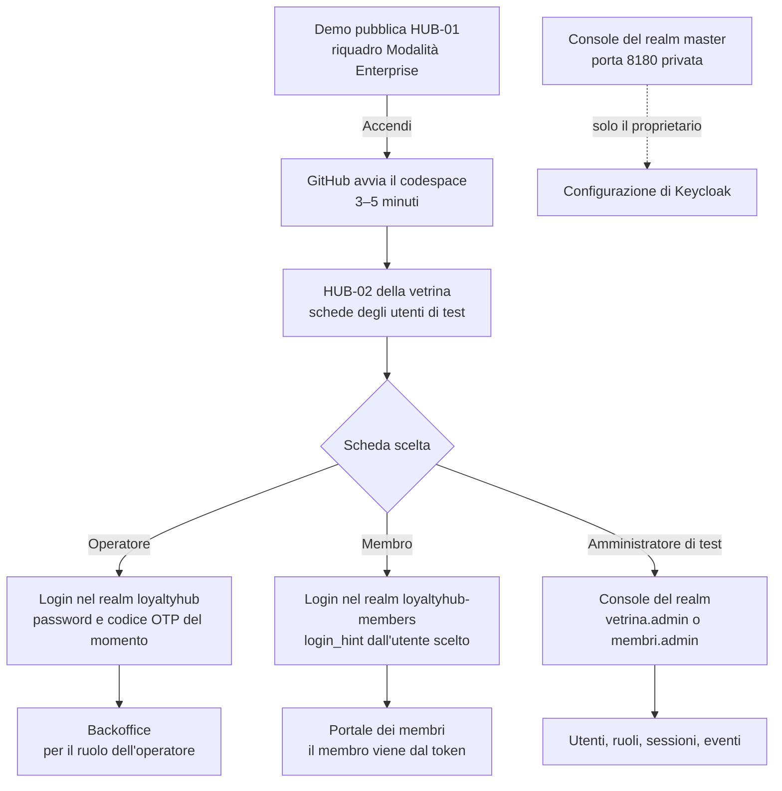
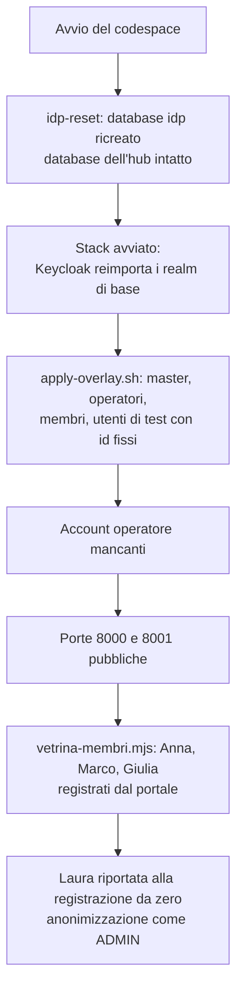

# Vetrina enterprise: runbook

Questa cartella installa e mantiene la **vetrina enterprise** (F2-DIST-09, ADR-049): una seconda installazione di Loyalty Hub in `LH_PROFILE=enterprise`, separata dalla demo, in un GitHub Codespace acceso su richiesta (ADR-050, ADR-051). Usa il compose di riferimento (`deploy/compose/reference.yml`, F2-DIST-03) più l'overlay di questa cartella.

La vetrina serve a far vedere online login reale, MFA e audit con l'attore del token. Non è ad alta disponibilità, contiene solo dati fittizi e riparte vuota a ogni codespace nuovo, senza backup (Q-663). Il contesto per chi legge la documentazione è nella pagina «Vetrina enterprise» del sito (`concetti/vetrina-enterprise.mdx`).

## Cosa c'è nella cartella

| File | A cosa serve |
|---|---|
| `compose.vetrina.yml` | Overlay del compose di riferimento: reverse proxy TLS, TLS verso Kafka e Postgres, segreti da file, profilo fisso. |
| `caddy/Caddyfile` | Proxy dell'overlay di base: nel codespace lo sostituisce `caddy/Caddyfile.codespace`. |
| `postgres/pg_hba.conf` | Postgres accetta dalla rete solo connessioni TLS (Q-621). |
| `kafka/client-ssl.properties` | Client TLS del controllo di salute di Kafka. |
| `compose.codespace.yml` | Overlay aggiuntivo per il codespace: proxy in HTTP su `127.0.0.1:8000` e `8001`, niente ACME né alias (Q-661). |
| `caddy/Caddyfile.codespace` | Proxy del codespace: instrada per porta; Keycloak solo per i realm `loyaltyhub` e `loyaltyhub-members` con le loro console, `master` sempre `404` (Q-670). |
| `vetrina.sh` | Comandi per il codespace: `codespace`, `provision`, `preflight`, `up`, `down`, `reset`, `idp-reset`, `operators`, `membri`, `programma`, `compose`. Contiene ancora una modalità per un host fisso: non è supportata e si rimuove (ADR-051 decisione 5). |
| `scripts/vetrina-membri.mjs` | Registra Anna, Marco e Giulia dal portale e riporta Laura alla registrazione da zero (Q-673). |
| `operatori.py` | Crea gli account operatore nominativi con MFA (Q-618) a ogni azzeramento. |
| `vetrina.env.example` | Elenco delle chiavi di configurazione, senza segreti: nel codespace le scrive da solo `vetrina.sh codespace`. |

Il dev container del codespace è in `.devcontainer/vetrina/` (`devcontainer.json` e `avvio.sh`).

## Come è fatta l'istanza

- **Un solo componente nuovo: il reverse proxy** (Caddy, regola 8-bis, ADR-049). Nel codespace parla in HTTP su `127.0.0.1:8000` (web) e `127.0.0.1:8001` (Keycloak) e GitHub le rende pubbliche con il suo inoltro, che termina il TLS (Q-661). È l'unico servizio raggiungibile da fuori.
- **Web e Keycloak solo su `127.0.0.1`** (`LH_BIND_ADDRESS=127.0.0.1`). L'hub è su `127.0.0.1:8080` solo per lo script del programma. Postgres e Kafka restano sulla rete interna.
- **Keycloak dal proxy solo per i due realm di vetrina.** Il proxy apre `loyaltyhub` e `loyaltyhub-members` con le loro console; il realm `master` risponde `404` da fuori e si usa dalla porta privata 8180: vedi «Console di Keycloak» più sotto.
- **TLS verso bus e database con una CA locale** generata nel codespace (Q-621). Kafka ha un listener SSL con certificato del client obbligatorio (l'hub usa `KAFKA_SECURITY=SSL_PEM`). Postgres rifiuta le connessioni in chiaro e hub, migrazioni e Keycloak si collegano con `sslmode=verify-full`, che controlla anche CA e nome. Se un URL del database perde `verify-full` o Kafka non è `SSL_PEM`, il container si ferma con `INSECURE_CONFIG`.
- **Segreti solo da file** (regola 20). Ogni segreto arriva al container come `<VAR>_FILE` da `/run/secrets`. La variabile in chiaro è forzata a vuoto, e il container si ferma se la trova piena.
- **Limiti di memoria per ogni container**, per circa 6,5 GB in tutto sui 16 GB della macchina da 4 core: Postgres 1 GB, Kafka 1 GB (heap 512 MB), hub 2 GB, web 768 MB, Keycloak 1,5 GB, proxy 128 MB.

## Vetrina in un codespace

È l'hosting scelto (ADR-050, Q-660…Q-663): un GitHub Codespace del repository, acceso dal proprietario prima di una demo, che si ferma da solo dopo l'inattività. Il codespace è amd64: `preflight` controlla che ogni immagine ne abbia la variante.

### Una volta sola

1. **Quota a costo zero** (Q-660). In *Settings → Billing and licensing* dell'account GitHub verifica che Codespaces non abbia un metodo di pagamento, oppure imposta un budget a 0: a fine quota gratuita l'uso si blocca invece di addebitare.
2. **Timeout di inattività.** In *Settings → Codespaces* alza il *Default idle timeout* (fino a 240 minuti) se una demo dura più di 30 minuti: il traffico dei visitatori non conta come attività, solo il terminale.
3. **Segreti del codespace** (*Settings → Codespaces → Secrets*, con accesso a questo repository), tutti facoltativi:

   | Segreto | Contenuto |
   |---|---|
   | `LH_VETRINA_OPERATORS` | Account operatore, una riga per account o separati da `;`: `<nome utente> <RUOLO> <e-mail>` (Q-618, Q-663). |
   | `LH_IMAGE` | Immagine unica da usare; senza, `ghcr.io/<proprietario>/loyaltyhub` all'ultimo tag `v*` del repository. |
   | `LH_HUB_DEMO_URL` | Origine https della demo per «Torna alla demo» in HUB-02. |

4. **Pulsante di accensione sulla demo** (Q-674), solo se vuoi accendere la vetrina dal browser. Lo imposti **tu**, una volta, nelle variabili d'ambiente del progetto Vercel della demo (*Settings → Environment Variables*, ambiente Production), poi rifai il deploy:

   | Variabile | Contenuto |
   |---|---|
   | `LH_VETRINA_CODESPACE` | Nome del codespace della vetrina (quello nell'indirizzo `https://<nome>-8000.app.github.dev`). |
   | `LH_VETRINA_GITHUB_TOKEN` | Token *fine-grained* del tuo account GitHub (*Settings → Developer settings → Fine-grained tokens*): solo il repository Loyalty_Sys, permessi **Codespaces** in lettura (per leggere lo stato) e **Codespaces lifecycle admin** in scrittura (per avviare) e nient'altro, scadenza al massimo un anno (Q-674, Q-720). Segnalo come *Sensitive* su Vercel. |

   Serve anche `LH_HUB_ENTERPRISE_URL` (l'indirizzo del punto 4 di «Prima di una demo»). Con una delle due variabili assente il riquadro «Modalità Enterprise» mostra «Disponibile su richiesta» e la route risponde `404`. Il token non finisce mai nel browser né nei log (regola 20): lo usa solo il server della demo, e solo verso `https://api.github.com`. Prima della scadenza genera un token nuovo e sostituiscilo su Vercel.

### Prima di una demo

1. Dal repository: *Code → Codespaces → … → New with options*, configurazione **Vetrina enterprise**, macchina da 4 core. Se il codespace esiste già, riaccendilo da *Code → Codespaces*.
2. Attendi la fine di `avvio.sh` (il terminale *Creation log*, oppure `sudo cat /workspaces/.loyaltyhub-vetrina/avvio.log`). Al primo avvio servono alcuni minuti per scaricare le immagini e avviare Keycloak e Kafka.
3. Se lo script avvisa che non riesce a rendere pubbliche le porte, nel pannello *Porte* fai clic destro su 8000 e 8001, *Visibilità della porta → Pubblica*. Le altre porte restano private.
4. L'indirizzo della vetrina è `https://<nome del codespace>-8000.app.github.dev`. Mettilo in `LH_HUB_ENTERPRISE_URL` della demo per il pulsante di HUB-01: il nome del codespace non cambia finché non lo cancelli.
5. Al primo avvio, o dopo un azzeramento, applica il programma con il pulsante **Carica il programma di esempio** del backoffice (V10, Q-673) o, come ripiego, dal terminale del codespace: `sudo --preserve-env=LH_VETRINA_CONFIG env "PATH=$PATH" bash deploy/vetrina/vetrina.sh programma` (`PATH` serve a trovare Node.js) (Q-630). Le password temporanee degli operatori sono in `/workspaces/.loyaltyhub-vetrina/operator-passwords.txt` (leggile con `sudo cat`): consegnale fuori banda e cancella il file.

Fermare e riaccendere il codespace conserva dati e account. Un codespace nuovo parte vuoto; per azzerare quello attuale usa `sudo --preserve-env=LH_VETRINA_CONFIG bash deploy/vetrina/vetrina.sh reset`.

### Tutto dal browser (ADR-051)

Dopo la configurazione una tantum non serve più il terminale. Il percorso parte dalla demo pubblica su Vercel (HUB-01) e arriva alle schermate della vetrina (HUB-02, backoffice, portale) e alle console di Keycloak:



1. **Accendi.** Sulla demo, il riquadro **Modalità Enterprise** (HUB-01) mostra lo stato della vetrina: *spenta*, *in accensione*, *accesa*. Con **Accendi la modalità Enterprise** il server della demo chiede a GitHub di avviare il codespace (Q-674); l'avvio richiede 3–5 minuti e il pulsante diventa **Apri la vetrina** da solo. Il codespace si spegne dopo circa 30 minuti senza uso del terminale: riaccendilo dallo stesso pulsante. Il pulsante ammette al più un avvio ogni 60 secondi (lo stato è letto da GitHub al più ogni 5 secondi), controlla l'origine della richiesta e consuma le ore gratuite di Codespaces del proprietario.
2. **Scegli un utente di test.** HUB-02 mostra le schede degli utenti di test (tabella in «Utenti di test»): cinque operatori per il backoffice, quattro membri per il portale. Ogni scheda ha nome utente e password da copiare e un pulsante **Entra come…** che porta al login del **realm giusto** con `login_hint`: il nome utente arriva già compilato e resta da scrivere la password.
3. **Codice OTP.** Gli operatori hanno la MFA: la scheda mostra il **codice OTP del momento**, calcolato dal seme documentato più sotto, con il conto alla rovescia dei 30 secondi. Il codice è visibile solo in questo ambiente di test dichiarato (Q-676) e non in una installazione `enterprise` vera.
4. **Entra.** Dopo il login l'operatore apre il backoffice con il ruolo della scheda (`ADMIN`, `MARKETING`, `LEGAL`, `CARE`, `ANALYST`). Il membro apre il portale (fetta V9b): il membro viene solo dal token. Con una sessione da membro già aperta, la scheda del suo utente dice «Sei dentro come…» con **Apri il portale** e le altre schede di membro offrono **Esci per entrare come…** (chiude la sola sessione del membro). **Laura** non è registrata: dopo il login il portale la porta alla registrazione (PT-16) con nome ed e-mail dell'account in sola lettura; si accetta il regolamento e si invia, poi si attende la tessera e si apre la Home.
5. **Utenti membri.** Nel backoffice, `ADMIN` e `CARE` hanno la voce **Utenti membri**: apre la console del realm `loyaltyhub-members` (password, sessioni e blocchi degli account di accesso dei membri).

### Console di Keycloak

| Console | Indirizzo | Chi entra | Visibilità |
|---|---|---|---|
| Realm operatori | `https://<nome>-8001.<dominio di inoltro>/admin/loyaltyhub/console/` | `vetrina.admin` | pubblica (porta 8001) |
| Realm membri | `https://<nome>-8001.<dominio di inoltro>/admin/loyaltyhub-members/console/` | `membri.admin` | pubblica (porta 8001) |
| Realm `master` | `https://<nome>-8180.<dominio di inoltro>/admin/master/console/` | utente `admin`, password in `/workspaces/.loyaltyhub-vetrina/secrets/idp-admin-password` (leggila con `sudo cat`) | **privata**: solo il proprietario del codespace, dopo il login di GitHub |

`vetrina.sh codespace` stampa i tre indirizzi all'avvio. HUB-02 linka le due console pubbliche; la console `master` non ha un pulsante.

**Cosa lascia passare il proxy sulla porta 8001** (`caddy/Caddyfile.codespace`, nell'ordine in cui lo applica):

1. `404` per tutto ciò che riguarda `master`: `/admin/master*`, `/admin/realms/master*`, `/realms/master*` e `/resources/master/*`. Il confronto non distingue maiuscole e minuscole e lavora sul percorso decodificato, quindi `/admin/realms/MASTER`, `%4Daster` e `%2F` non aggirano la regola.
2. `404` per i percorsi con trucchi di normalizzazione: `\`, `;` e `%` rimasto dopo la decodifica. I segmenti `..` non hanno una regola propria: Caddy pulisce il percorso prima del confronto, quindi `/realms/loyaltyhub/../master/` diventa `/realms/master/` e cade nel `404` di `master` (la prova con Caddy lo verifica). Limite dichiarato: un nome (utente, ruolo, gruppo) che contiene `%`, `;` o `\` non si può gestire dalla console pubblica.
3. Solo i percorsi dell'elenco, uno per uno commentato nel Caddyfile: `/realms/loyaltyhub*` e `/realms/loyaltyhub-members*` (login, token, certificati), `/resources/*` (script e stili), la pagina `/admin/<realm>/console` di ciascun realm, le API `/admin/realms/<realm>` che la console chiama dal browser (`ui-ext` compreso) e `/admin/serverinfo`, che la console legge all'avvio. Le API le protegge il realm con i suoi token.
4. Tutto il resto è `404`: `/admin`, l'elenco `/admin/realms`, `/js/*`, la pagina iniziale.

**Come funziona l'indirizzo di `master`.** `KC_HOSTNAME_ADMIN` non è impostato nel codespace: la console dei due realm usa l'indirizzo pubblico di `KC_HOSTNAME`. Il realm `master` ha l'attributo `frontendUrl` sull'indirizzo della porta 8180, che `apply-overlay.sh` imposta a ogni avvio (l'indirizzo dipende dal codespace, quindi non sta in `master.json`) e rilegge: se Keycloak lo rifiuta o lo scarta, lo script fallisce. Con hostname v2 il `frontendUrl` del realm ha la precedenza sull'indirizzo di frontend e, senza `KC_HOSTNAME_ADMIN`, anche su quello di amministrazione (`HostnameV2Provider` di Keycloak 26.7.4): console e login di `master` stanno quindi solo sulla porta 8180.

> **Ripiego dichiarato (Q-670).** Se in un codespace reale la console di `master` non si aprisse su 8180 (da verificare al primo avvio con la fetta V9), `master` resta raggiungibile solo dal terminale del codespace: `sudo --preserve-env=LH_VETRINA_CONFIG bash deploy/vetrina/vetrina.sh compose exec idp /opt/keycloak/bin/kcadm.sh …`. Il proxy pubblico continua a rispondere `404` su `master` in ogni caso.

**Limiti.** Le console dei due realm sono pubbliche e, con la password documentata, chiunque ha il link può usarle: per questo gli amministratori di test hanno solo i ruoli di gestione utenti (Q-671). Le modifiche fatte nelle console restano negli eventi di amministrazione di Keycloak e non arrivano in `audit_entry` fino al ponte di M8.12 (Q-677). Ogni avvio ripristina Keycloak dal repository (Q-672).

### Ingresso e rete

- **Ingresso.** Niente IP pubblico né certificati ACME: il TLS lo termina l'inoltro delle porte di GitHub. Il proxy Caddy resta, in HTTP su `127.0.0.1:8000` (web) e `127.0.0.1:8001` (Keycloak), per tenere fuori il realm `master`, aprire solo le console dei due realm di vetrina e aggiungere le intestazioni di sicurezza.
- **Emittente OIDC.** Web e hub chiamano Keycloak con lo stesso indirizzo pubblico del browser, passando dall'inoltro di GitHub (Q-420): per questo la porta 8001 deve essere pubblica.
- **Console di Keycloak.** Quelle dei realm `loyaltyhub` e `loyaltyhub-members` sono pubbliche sulla porta 8001; quella del realm `master` è solo sulla porta 8180 privata. Indirizzi, accessi e limiti sono nella sezione «Console di Keycloak».
- **Azzeramento.** Niente timer settimanale (non gira a codespace fermo): un codespace nuovo parte vuoto e quello attuale si azzera a mano con `vetrina.sh reset` (Q-663).

### Utenti di test (ADR-051 decisione 1)

> **Ambiente di test, dati fittizi.** Le credenziali qui sotto sono **pubbliche** e valgono solo nel codespace. Non inserire mai dati personali veri.

Gli utenti hanno id fissi (UUID) e li ricrea `deploy/idp/vetrina/apply-overlay.sh` a ogni avvio dai due overlay `realm-vetrina-overlay.json` e `realm-members-vetrina-overlay.json`, che sono l'unica fonte. Gli operatori hanno `MFA_REQUIRED_ROLE`, quindi chiedono password **e** codice OTP. Tutti hanno il ruolo `LH_TEST_USER`, l'unico che hub e web accettano per credenziali fisse e solo con `LH_TEST_USERS_ALLOWED=true` e `LH_ENVIRONMENT=test`.

| Utente | Realm | Ruolo | Password |
|---|---|---|---|
| `marta.admin` | `loyaltyhub` | `ADMIN` | `Aurora-Operatori-26!` |
| `luca.marketing` | `loyaltyhub` | `MARKETING` | `Aurora-Operatori-26!` |
| `elena.legal` | `loyaltyhub` | `LEGAL` | `Aurora-Operatori-26!` |
| `paolo.care` | `loyaltyhub` | `CARE` | `Aurora-Operatori-26!` |
| `sara.analyst` | `loyaltyhub` | `ANALYST` | `Aurora-Operatori-26!` |
| `anna.rossi` | `loyaltyhub-members` | `MEMBER` | `Aurora-Membri-26!` |
| `marco.bianchi` | `loyaltyhub-members` | `MEMBER` | `Aurora-Membri-26!` |
| `giulia.ferri` | `loyaltyhub-members` | `MEMBER` | `Aurora-Membri-26!` |
| `laura.conti` | `loyaltyhub-members` | `MEMBER` | `Aurora-Membri-26!` |
| `vetrina.admin` | `loyaltyhub` (console) | gestione utenti, senza ruoli applicativi | `Aurora-Admin-26!` |
| `membri.admin` | `loyaltyhub-members` (console) | gestione utenti, senza ruoli applicativi | `Aurora-Admin-26!` |

**Codice OTP degli operatori.** I cinque operatori condividono un solo seme TOTP (SHA-1, 6 cifre, 30 secondi). Aggiungilo a un'app di autenticazione inserendo la chiave a mano, oppure con questo URI:

- seme in base32: `KZSXI4TJNZQUC5LSN5ZGCMRQGI3EY2BB`
- URI: `otpauth://totp/Vetrina%20Aurora:marta.admin?secret=KZSXI4TJNZQUC5LSN5ZGCMRQGI3EY2BB&issuer=Vetrina%20Aurora&algorithm=SHA1&digits=6&period=30`

Non c'è un'immagine con il codice QR: nessun generatore offline è tra le dipendenze del repository, e non si usano servizi esterni per non far uscire il seme. Per la stessa finestra di 30 secondi Keycloak non accetta due volte lo stesso codice: se due persone accedono insieme, la seconda aspetta il codice successivo.

Gli amministratori `vetrina.admin` e `membri.admin` aprono la console del proprio realm e hanno solo i cinque ruoli di `realm-management` `view-users`, `query-users`, `query-groups`, `manage-users` e `view-events`: non cambiano la configurazione del realm (Q-671). Con `manage-users` possono però assegnare ruoli agli utenti del loro realm: è il limite accettato dalla decisione. Gli eventi di amministrazione di Keycloak sono attivi con i dettagli della rappresentazione in entrambi i realm, e anche in `master`. **Limite (Q-677):** le modifiche fatte da questi amministratori nelle console restano negli eventi di Keycloak e non arrivano in `audit_entry` finché non c'è il ponte di M8.12, che coprirà entrambi i realm. La console del realm `master` resta privata, solo sulla porta 8180 (Q-670).

### Keycloak da zero a ogni avvio

A ogni avvio `vetrina.sh codespace` ricrea il database `idp` di Keycloak (comando `idp-reset`), prima di avviare lo stack. Così il realm torna alla configurazione del repository e non resta nulla dei cambi fatti dalla console. Il database dell'hub non si tocca: i membri registrati restano e il loro legame con l'utente di Keycloak resta valido, perché gli id degli utenti sono fissi.



### Scenario dei quattro membri

`scripts/vetrina-membri.mjs` (comando `vetrina.sh membri`) usa solo il login e le API reali, passando dal BFF all'indirizzo pubblico del web. Per questo serve che le porte 8000 e 8001 siano pubbliche: `avvio.sh` lo lancia dopo averle pubblicate e `vetrina.sh codespace` lo tenta prima in modo morbido.

- **Anna, Marco e Giulia** sono già registrati: lo script entra con il loro login e crea il profilo con i dati del seed (`POST /v1/portal/members`, idempotente). Hanno subito tessera e profilo.
- **Laura** (`laura.conti`, cognome e e-mail fittizi) esiste in Keycloak ma **non è registrata** nel portale: a ogni avvio lo script cerca il suo profilo e, se c'è, lo anonimizza con `marta.admin` (`ADMIN`, con il suo OTP). Alla prima visita Laura passa quindi dalla registrazione vera.

Se la registrazione risponde `409 EMAIL_TAKEN`, lo script lo dice in chiaro e rimanda a `vetrina.sh reset`.

## Verifica

```bash
# Dal terminale del codespace: stato dei container (tutti healthy, il proxy running)
sudo --preserve-env=LH_VETRINA_CONFIG bash deploy/vetrina/vetrina.sh compose ps
# Discovery OIDC raggiungibile dall'indirizzo pubblico della porta 8001
curl -fsS "https://<nome>-8001.<dominio di inoltro>/realms/loyaltyhub/.well-known/openid-configuration" >/dev/null && echo ok
# Il realm master non è esposto: atteso 404
curl -s -o /dev/null -w '%{http_code}\n' "https://<nome>-8001.<dominio di inoltro>/realms/master/"
# HUB-02 della vetrina
curl -fsS -o /dev/null -w '%{http_code}\n' "https://<nome>-8000.<dominio di inoltro>/"
```

### Smoke pianificato

Il workflow `.github/workflows/smoke-vetrina.yml` (M8.14 V6) controlla la vetrina ogni sei ore, senza credenziali e solo con richieste `GET`: health del web, HUB-02 con banner e tessere attive, login avviato dal BFF verso il realm `loyaltyhub`, discovery OIDC e JWKS, registrazione chiusa (Q-619), realm `master` in `404`, API del BFF chiuse senza sessione. La health di hub, Postgres e Kafka si legge dalle tessere di HUB-02, perché il proxy non espone altro (Q-650).

Quando la vetrina è online, imposta la variabile del repository `LH_VETRINA_URL` (*Settings → Secrets and variables → Actions → Variables*) con l'origine https del web, cioè `https://<nome del codespace>-8000.app.github.dev`. Finché è vuota il workflow esce verde con un avviso. La stessa prova si lancia a mano da qualunque macchina con Node 22:

```bash
node scripts/smoke-enterprise.mjs vetrina --web https://<nome del codespace>-8000.app.github.dev
```

Il login reale di un operatore con OTP e la voce di audit con l'attore reale li prova invece il job `smoke enterprise (compose, OIDC)` di `ci.yml`, sul compose di riferimento con l'overlay di test del realm, a ogni pull request che tocca il codice.

## Esercizio

### Aggiornare l'immagine

Cambia il segreto del codespace `LH_IMAGE` e riavvia il codespace: `avvio.sh` riscrive la configurazione con la nuova immagine. Le migrazioni sono expand/contract (ADR-038), quindi non serve un azzeramento.

### Segreti e certificati

`vetrina.sh provision` genera ogni file una sola volta e non lo riscrive. Non stampa mai un valore, solo nomi e percorsi.

| File in `/workspaces/.loyaltyhub-vetrina` (`$LH_VETRINA_DIR`) | Contenuto | Proprietario e permessi | Lo legge |
|---|---|---|---|
| `secrets/db-password` | password del ruolo `loyaltyhub` | 1000, `0600` | Postgres, migrazioni, hub |
| `secrets/idp-db-password` | password del ruolo `idp` | 1000, `0600` | Postgres, Keycloak |
| `secrets/idp-admin-password` | amministratore iniziale di Keycloak | 1000, `0600` | Keycloak, `vetrina.sh` |
| `secrets/web-client-secret`, `portal-client-secret`, `widgets-client-secret`, `cms-client-secret` | segreti dei client dei due realm (`portal` e `widgets` nel realm dei membri, ADR-051) | 1000, `0600` | Keycloak, web |
| `secrets/web-session-key` | chiave delle sessioni del BFF | 1000, `0600` | web |
| `secrets/subject-key` | `LH_SUBJECT_KEY`, **immutabile** (docs/11 §16) | 1000, `0600` | hub |
| `ca/ca.key`, `ca/ca.crt` | CA locale | root, `0600` | solo `vetrina.sh` |
| `tls/ca.crt` | certificato della CA, pubblico | root, `0644` | hub, Keycloak, Kafka |
| `tls/postgres.key`, `tls/postgres.crt` | certificato del server Postgres | 999, `0600` (chiave) | Postgres |
| `tls/kafka-keystore.pem` | chiave e certificato del broker | 1000, `0600` | Kafka |
| `tls/kafka-client-*.b64` | CA, certificato e chiave dell'hub verso Kafka | 1000, `0600` | hub |

L'uid 1000 è l'utente dei container dell'immagine unica, di Keycloak e di Kafka; il 999 è l'utente `postgres` dell'immagine di Postgres. Nel codespace lo stesso uid è l'utente `vscode`, che ha già i privilegi di amministratore.

I certificati interni durano 397 giorni e l'azzeramento li rinnova quando ne mancano meno di 30. Per cambiare la CA, cancella `ca/` e rilancia `provision`: riemette tutti i certificati. Non cancellare mai `secrets/subject-key` fuori da un azzeramento: cambiare la chiave scollega i token dai membri (docs/11 §16).

> **Nota:** l'elenco dei segreti è lo stesso in `vetrina.sh` (`SECRETS`) e in `compose.vetrina.yml` (`secrets:`); `scripts/check-vetrina.mjs` verifica che coincidano.

## Limiti noti

- **Codespace acceso solo su richiesta** (ADR-050, TOBE-012): fuori dalle demo la vetrina è spenta e il pulsante di HUB-01 porta a una pagina di GitHub. L'uso si blocca a fine quota gratuita (Q-660).
- **Segreti leggibili dall'utente del codespace.** Nel codespace l'uid 1000 dei container coincide con l'utente `vscode`: chi apre il terminale del codespace, cioè solo il proprietario, può leggere i file di `secrets/`.
- **Pagina di avviso di GitHub.** Al primo accesso da un browser a una porta pubblica GitHub può mostrare una pagina di conferma prima della vetrina.
- **Non è HA.** Un codespace, un broker, un Postgres e una replica del web; gli obiettivi di ADR-036 non valgono.
- **Azzeramento non del tutto automatico** (Q-630): il programma si riapplica a mano, con il pulsante del backoffice (V10) o, come ripiego, con `vetrina.sh programma` (che non crea campagne né storie).
- **HTTP in chiaro dentro la rete compose** tra proxy, web, Keycloak e hub, dentro lo stesso codespace (TOBE-011). Bus e database sono in TLS.
- **Guardia TLS nel container, non nell'hub** (Q-631): la rifiuta l'entrypoint dell'overlay, non ancora il codice dell'hub.
- **Tempo reale in BO-24** in stato *degraded* finché non arriva il proxy SSE nel BFF (Q-622).
