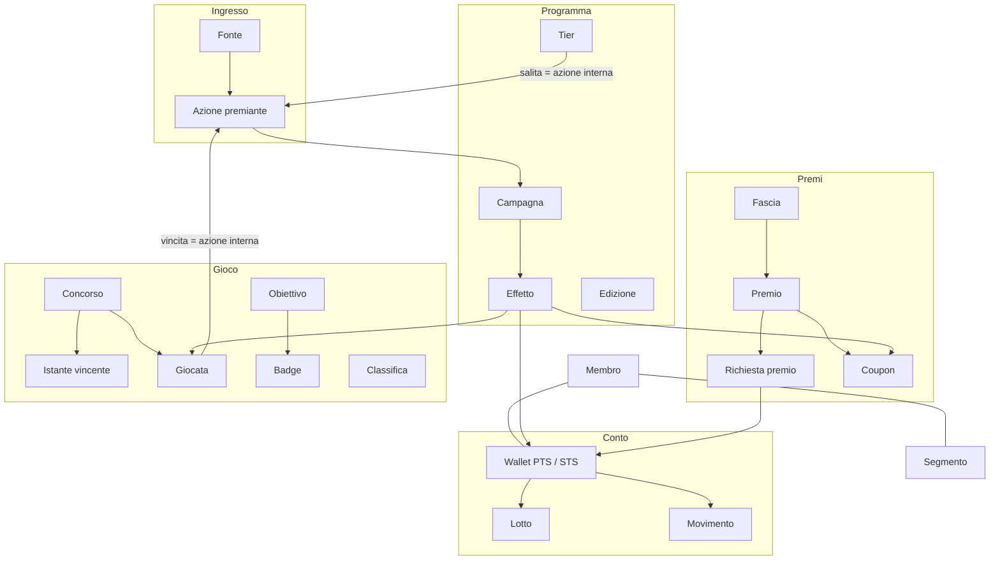
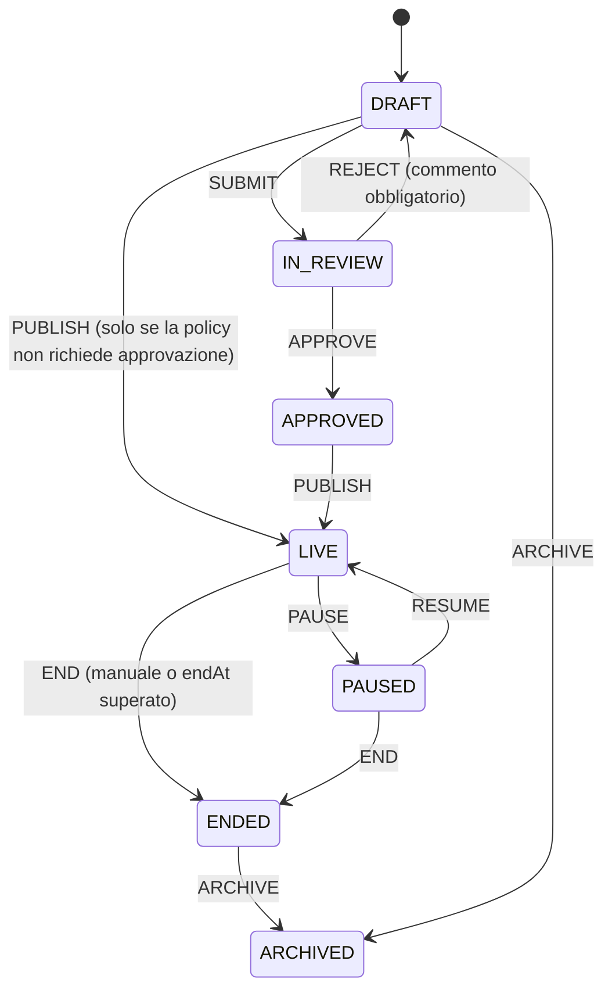
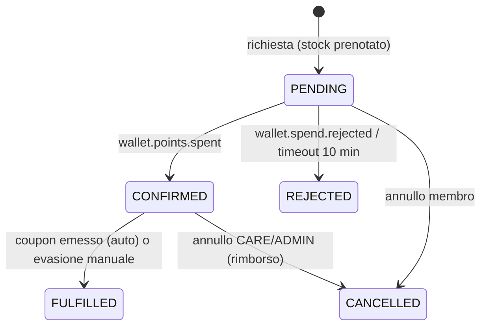

# 03 — Modello di dominio

Regole di business valide per tutti i servizi. Dove un algoritmo è scritto qui, l'implementazione deve seguirlo alla lettera (è coperto da unit test, `docs/06 §9`).

Convenzioni: fuso orario di business `Europe/Rome`; tutti i timestamp persistiti in UTC; i punti sono **interi** (`long`), mai decimali.

## 1. Mappa dei contesti



## 2. Membro

| Campo chiave | Regola |
|---|---|
| `id` | `MBR-` + 6 cifre, sequenza; immutabile |
| `externalId`, `email` | univoci se presenti; usati per risolvere le azioni in ingresso |
| `status` | `ACTIVE` (default), `INACTIVE` (uscito), `BLOCKED` (sospeso), `ANONYMIZED` (irreversibile) |
| `referralCode` | 8 caratteri `A-Z2-9`, univoco, generato alla creazione |
| `attributes` | mappa chiave → valore (string, number, boolean, date) |
| profilo completo | `firstName, lastName, email, phone, birthDate, city` tutti valorizzati |

Invarianti: solo i membri `ACTIVE` accumulano, spendono, giocano. Un membro `BLOCKED` conserva i saldi ma ogni azione è `REJECTED` in ingresso. L'anonimizzazione sostituisce nome → "Membro anonimo", e-mail/telefono → `null`, conserva `id`, movimenti e statistiche.

## 3. Azioni, campagne ed effetti

### 3.1 Azione
Un'azione è un CloudEvent su `lh.actions.v1` (forma in `docs/05`). Proprietà di dominio: `type` (es. `purchase.completed`), `memberId`, `time` (momento in cui è accaduta: **è la data di business** per calendari, limiti e scadenze), `source`, `data`.

### 3.2 Campagna — struttura
```jsonc
{
  "code": "CMP-PURCHASE-BASE",
  "name": "Punti sugli acquisti",
  "triggerActionTypes": ["purchase.completed"],
  "audience": { "all": true, "tiers": [], "segments": [] },
  "conditions": { "op": "all", "rules": [ { "field": "data.amount", "cmp": "gte", "value": 5 } ] },
  "effects": [
    { "type": "GRANT_POINTS", "currency": "PTS", "mode": "PER_AMOUNT", "amountField": "data.amount",
      "value": 1, "unitStep": 1, "rounding": "FLOOR", "tierMultiplierApplies": true, "pendingDays": 0 },
    { "type": "GRANT_POINTS", "currency": "STS", "mode": "PER_AMOUNT", "amountField": "data.amount",
      "value": 1, "unitStep": 1, "rounding": "FLOOR", "tierMultiplierApplies": false }
  ],
  "limits": { "perMember": [ { "max": 3, "period": "DAY" } ], "perMemberPoints": null,
              "global": { "maxPoints": 500000, "maxMatches": null }, "cooldownMinutes": 0 },
  "schedule": { "startAt": "2026-01-01T00:00:00Z", "endAt": null, "daysOfWeek": [], "hours": null },
  "priority": 100, "exclusiveGroup": null, "system": false, "requiresLegal": false
}
```

### 3.3 Condizioni
Nodo = gruppo `{op: all|any|not, rules: [...]}` oppure foglia `{field, cmp, value}`.

| Spazio dei campi | Esempi | Origine |
|---|---|---|
| `data.*` | `data.amount`, `data.channel`, `data.items[*].category` (su array: vero se **almeno un** elemento soddisfa) | payload dell'azione |
| `member.*` | `tier`, `status`, `segments`, `labels`, `attributes.<k>`, `registeredDaysAgo`, `age` | snapshot locale del membro |
| `context.*` | `source`, `dayOfWeek` (`MON`…`SUN`), `hour` (0–23), `date` (ISO) — calcolati su `time` dell'azione in `Europe/Rome` | evento |
| `history.*` | `actionCount` (azioni dello stesso tipo **precedenti** a questa per il membro), `daysSinceLastAction` | contatori del motore |

Comparatori: `eq neq gt gte lt lte in nin contains ncontains exists nexists between startsWith`. Campo assente → la foglia è falsa (tranne `nexists`). Tipi incompatibili → falsa, mai eccezione.

### 3.4 Effetti
| Tipo | Parametri | Risultato |
|---|---|---|
| `GRANT_POINTS` | `currency`, `mode`, `value`, `amountField?`, `unitStep?`, `rounding?`, `lookup?`, `min?`, `max?`, `pendingDays?`, `tierMultiplierApplies?`, `description?` | effetto `points.grant` verso il wallet |
| `MULTIPLIER` | `currency`, `factor`, `scope: ALL_GRANTS` oppure `labels[]` | moltiplica i `GRANT_POINTS` della stessa valuta raccolti dalle **altre** campagne sulla stessa azione |
| `GRANT_PLAYS` | `contestCode`, `count` | effetto `plays.grant` |
| `ISSUE_COUPON` | `rewardCode` oppure `rewardCodeField` | effetto `coupon.issue` |
| `AWARD_BADGE` | `badgeCode` | effetto `badge.award` |
| `SEND_MESSAGE` | `templateCode`, `params?` | effetto `message.send` |

Modi di `GRANT_POINTS`: `FIXED` → `value` · `PER_AMOUNT` → `rounding(amount / unitStep) × value` · `FROM_FIELD` → valore intero letto da `amountField` · `LOOKUP` → `lookup[ valore di amountField ]` (assente → 0, effetto scartato). Poi si applicano `min`/`max`. Risultato ≤ 0 → effetto scartato.

### 3.5 Algoritmo di valutazione (deterministico)
1. Carica lo snapshot del membro. Assente o non `ACTIVE` → registra `NO_MEMBER`, fine.
2. Candidate = campagne `LIVE` con `type` tra i trigger. Per ciascuna, in ordine `priority` decrescente poi `code` crescente:
   1. calendario contiene `time` dell'azione, altrimenti `NOT_IN_SCHEDULE`;
   2. pubblico soddisfatto, altrimenti `AUDIENCE`;
   3. condizioni vere, altrimenti `CONDITION` (con elenco foglie fallite);
   4. se `exclusiveGroup` già assegnato in questa valutazione → `EXCLUSIVE`;
   5. limiti: incremento atomico dei contatori (`UPDATE … WHERE count < max`); fallito → `LIMIT`; budget esaurito → `BUDGET`;
   6. raccogli gli effetti.
3. Applica i `MULTIPLIER`: fattore complessivo = prodotto dei fattori, tetto `engine.maxMultiplier` (default 5). Arrotonda per difetto.
4. `effectId` = `sha256(actionId + campaignCode + indiceEffetto)` troncato a 26 caratteri → idempotenza a valle.
5. Nella **stessa transazione**: contatori, `evaluation_log`, outbox (effetti + fatto `campaign.evaluated`).

La **simulazione** esegue 1–4 senza il punto 2.5 (i limiti sono solo letti) e senza scrivere.

### 3.6 Ciclo di vita degli oggetti governati
Vale per campagne, premi, concorsi, contenuti.



Regole: un oggetto `LIVE` si modifica solo nei campi "sicuri" (nome, descrizione, `endAt`, priorità, immagine); per il resto va duplicato. `APPROVE`/`REJECT` richiedono il ruolo indicato dalla policy (`docs/06 §7`). Ogni transizione scrive storico (chi, quando, commento) e audit.

## 4. Wallet, punti e tier

### 4.1 Valute
| Codice | Spendibile | Scadenza (seed) | Uso |
|---|---|---|---|
| `PTS` punti premio | sì | `ROLLING_MONTHS` = 12 (fine mese) | catalogo premi |
| `STS` punti status | no | nessuna; contatore per edizione | tier |

Policy alternative per `PTS`: `END_OF_EDITION_PLUS_GRACE` (scadono a `edition.redemptionGraceUntil`), `NEVER`.

### 4.2 Movimenti e lotti
- Tipi movimento: `EARN`, `SPEND`, `EXPIRE`, `ADJUST_CREDIT`, `ADJUST_DEBIT`, `REFUND`, `RELEASE` (pending → attivo, importo informativo).
- Ogni `EARN`/`ADJUST_CREDIT`/`REFUND` crea un **lotto** `{amount, remaining, availableAt, expiresAt, status}`. `pendingDays > 0` → `PENDING` fino a `availableAt`.
- **Saldo attivo** = Σ `remaining` dei lotti `ACTIVE`. **In attesa** = Σ dei lotti `PENDING`. Invariante: saldo attivo ≥ 0 sempre.
- **Spesa FIFO**: consuma i lotti `ACTIVE` per `expiresAt` crescente (null per ultimi), poi `earnedAt`. Tutto-o-niente: saldo insufficiente → nessun movimento, fatto `wallet.spend.rejected`.
- **Rimborso**: nuovo lotto con `expiresAt` = max(scadenza originaria più lontana tra i lotti consumati, oggi + 30 giorni).
- **Scadenza** (job): lotti `ACTIVE` con `expiresAt ≤ asOf` → `EXPIRED`, un movimento `EXPIRE` per membro/valuta con il totale.
- **Moltiplicatore di tier**: se l'effetto ha `tierMultiplierApplies` e valuta `PTS`, importo finale = `floor(base × tier.multiplier)`; il movimento conserva `metadata = {baseAmount, tierCode, tierMultiplier, campaignMultiplier}`.
- **Rettifica manuale**: `reason` obbligatorio tra `GOODWILL, CORRECTION, FRAUD, MIGRATION, OTHER` + nota ≥ 10 caratteri. Un addebito non può portare il saldo sotto zero.

### 4.3 Tier
| Tier | Rank | Soglia STS nell'edizione | Moltiplicatore PTS |
|---|---|---|---|
| `BASE` | 0 | 0 | 1.00 |
| `SILVER` | 1 | 1 000 | 1.25 |
| `GOLD` | 2 | 3 000 | 1.50 |
| `PLATINUM` | 3 | 7 000 | 2.00 |

- `periodSts` = STS guadagnati nell'edizione corrente.
- **Salita immediata**: dopo ogni accredito `STS`, se `periodSts` ≥ soglia di un tier di rank superiore → nuovo tier (il più alto raggiunto), fatto `tier.upgraded {previousTier, newTier}`.
- **Chiusura edizione** (job annuale o comando demo, con `dryRun`):
  ```
  per ogni membro ACTIVE:
     earned  = tier più alto con soglia ≤ periodSts dell'edizione che si chiude
     floor   = tier con rank = max(0, rank(attuale) − 1)        # discesa morbida
     nuovo   = il più alto tra earned e floor
     esito   = nuovo == attuale ? tier.retained : tier.downgraded
     periodSts = 0
  edizione → CLOSED; la successiva → ACTIVE
  ```
  La salita non avviene mai in chiusura (è già immediata durante l'anno).
- **Progresso** mostrato al membro: STS mancanti al tier successivo; a `PLATINUM`: "livello massimo". Da ottobre in poi il portale mostra anche l'avviso di mantenimento ("ti mancano N punti status per mantenere GOLD").

### 4.4 Edizione
`{code: "2026", startDate, endDate, redemptionGraceUntil, status: PLANNED|ACTIVE|CLOSED}`. Una sola `ACTIVE`. Periodi contigui, senza sovrapposizioni.

## 5. Premi e richieste

- Il **costo** di un premio è `band.pointsThreshold` (una fascia = un prezzo).
- Visibile al membro se: `LIVE`, dentro validità, tier/segmento ammessi. Un premio visibile ma non raggiungibile si mostra con i punti mancanti.
- **Richiesta premio**:


  Validazioni alla richiesta (errore immediato, nessun evento): premio non visibile, esaurito, limite per membro raggiunto, membro non attivo. Il controllo del saldo è del wallet (saga). `REJECTED`/`CANCELLED` ripristinano lo stock.
- **Coupon**: `AVAILABLE → ISSUED → USED` oppure `EXPIRED`/`VOID`. Codice = `prefisso-XXXX-XXXX` (`A-Z2-9`). Pool esaurito in fase di emissione → la richiesta resta `CONFIRMED` con flag `needsAttention`.

## 6. Instant win

- **Pre-generazione**: per ogni premio, `quantityTotal` istanti in `[startAt, endAt)`. Distribuzione `UNIFORM` (casuale uniforme) o `BUSINESS_HOURS` (solo 08–22 `Europe/Rome`). Generatore con **seme** salvato sul concorso (riproducibilità e verifica). Rigenerare è permesso solo in `DRAFT`/`IN_REVIEW`/`APPROVED`.
- **Crediti**: disponibili = Σ `play_grant.count` − giocate "da credito" + giocata gratuita giornaliera se non ancora usata oggi (`Europe/Rome`). Tetto `maxPlaysPerMemberPerDay`.
- **Giocata** (una transazione):
  ```sql
  -- 1. verifica concorso LIVE e crediti; 2. tenta il claim
  UPDATE winning_instant SET status='CLAIMED', claimed_by=:member, claimed_at=now(), play_id=:play
   WHERE id = ( SELECT id FROM winning_instant
                 WHERE contest_id=:contest AND status='OPEN' AND instant_at <= now()
                 ORDER BY instant_at LIMIT 1 FOR UPDATE SKIP LOCKED )
  RETURNING prize_id;
  -- riga restituita -> WIN (decrementa prize.quantity_remaining), altrimenti LOSE
  ```
  Un membro può vincere più volte salvo `maxWinsPerMember` (default illimitato; il claim lo verifica prima).
- **Consegna**: la vincita produce il fatto `contest.won`; il ponte lo trasforma nell'azione `instantwin.won {contestCode, prizeCode, prizeType, points?, rewardCode?}`; le campagne di sistema `CMP-IW-PRIZE-POINTS` / `CMP-IW-PRIZE-COUPON` consegnano. Premi `PHYSICAL`: consegna manuale tracciata sull'elenco vincitori.
- **Fine concorso**: istanti `OPEN` residui → `VOID`; report premi non assegnati.

## 7. Nota normativa (non implementata nel PoC)
I concorsi a premio reali richiedono tipicamente regolamento depositato, garanzie sul montepremi, perizia sul software di assegnazione, verbali di assegnazione e infrastruttura sul territorio nazionale. Il modello (seme riproducibile, istanti immutabili dopo l'avvio, audit, ruolo `LEGAL`) è pensato per non ostacolare questi adempimenti.

## 8. Obiettivi, badge, classifiche, referral

- **Obiettivo**: `{actionTypes[], filter (condizioni su data.*), metric, target, period, repeatable}`.
  | Metrica | Progresso |
  |---|---|
  | `COUNT` | numero di azioni |
  | `SUM` | somma di `sumField` |
  | `DISTINCT_TYPES` | numero di tipi azione distinti tra quelli elencati |
  | `STREAK` | unità consecutive (`DAY`/`WEEK`) con almeno un'azione; un buco azzera |
  Periodo `NONE, DAY, WEEK, MONTH, EDITION` → `periodKey` (es. `2026-09`). Al raggiungimento: `achievement.completed` (+ `badge.awarded` se collegato). Non ripetibile → una sola volta per sempre; ripetibile → una per periodo.
- **Classifica**: punteggio per `(leaderboard, periodKey, member)` aggiornato dai fatti/azioni; parimerito → vince chi ha raggiunto prima il punteggio. Il nome mostrato è il `nickname` del membro (default: nome + iniziale del cognome).
- **Referral**: la registrazione con codice valido crea il legame (un solo invitante, non modificabile, non se stessi). Alla **prima** azione qualificante dell'invitato (`referral.qualifyingActionType`, seed: `purchase.completed`) → due fatti `referral.completed` (`role: REFERRER` sul presentatore, `role: REFEREE` sull'invitato).

## 9. Contenuti e messaggi

- **Selezione contenuti per posizionamento**: `LIVE` ∧ in calendario ∧ pubblico soddisfatto, ordinati per `priority` desc; `HOME_HERO` ne mostra 1, `HOME_GRID` fino a 6.
- **Pop-up**: al più uno per visita; candidato = primo per priorità che rispetta la frequenza (`ONCE`: mai visto; `ONCE_PER_DAY`: non visto oggi).
- **Messaggi**: una regola collega un tipo di fatto (+ condizione opzionale) a un template; segnaposto `{{data.campo}}`, `{{member.firstName}}`. Deduplica per `(memberId, sourceEventId, templateCode)`.

## 10. Segmenti dinamici
Criteri nello stesso formato delle condizioni (§3.3) sullo spazio `member.*` esteso con: `balance.PTS`, `lifetimeEarned.PTS`, `lastActivityDaysAgo`, `actions.<type>.count30d`, `purchases.amount90d`, `city`. Il ricalcolo confronta l'appartenenza precedente ed emette `member.segment.entered/left` solo per le differenze.
