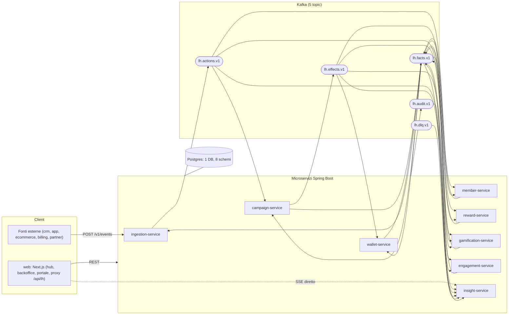
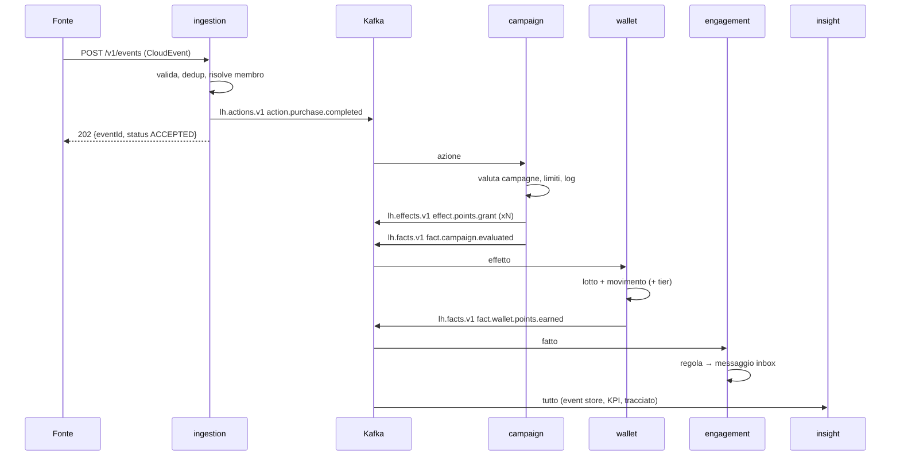
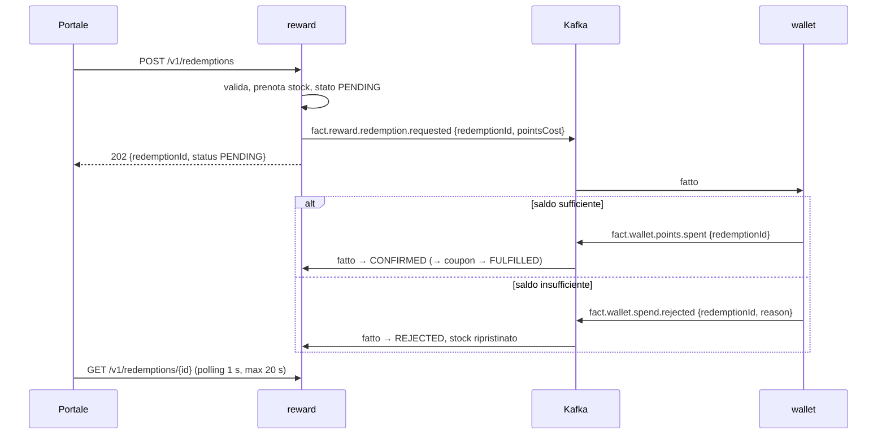

# 04 — Architettura

## 1. Principi

1. **Event-driven, coreografato.** I servizi reagiscono a eventi su Kafka; nessun orchestratore, nessuna chiamata HTTP tra servizi (ADR-002).
2. **Autonomia dei dati.** Ogni servizio possiede il proprio schema e mantiene *snapshot locali* dei dati altrui costruiti dai fatti (es. tier del membro nel motore campagne).
3. **Un solo ingresso per le azioni.** `ingestion-service` è l'**unico produttore** di `lh.actions.v1`, sia per le fonti esterne sia per gli accadimenti interni (ponte fatti → azioni). Un solo punto per validazione, dedup, anti-loop (ADR-003).
4. **Il motore decide, gli altri eseguono.** Solo `campaign-service` produce effetti; wallet, reward, gamification, engagement li applicano in modo idempotente.
5. **Affidabilità semplice.** Outbox transazionale + consumer idempotenti + DLQ. Niente transazioni Kafka, niente saghe orchestrate.
6. **Progettato per dormire.** Ogni servizio può spegnersi e riaccendersi: l'arretrato resta su Kafka, lo stato su Postgres.

## 2. Vista d'insieme



## 3. Servizi e confini

| Servizio | Porta locale | Schema | Possiede | Non possiede |
|---|---|---|---|---|
| `ingestion-service` | 8081 | `ingestion` | fonti, tipi azione e schemi, eventi in ingresso, dedup, ponte interno, simulatore e scenari | regole, punti |
| `member-service` | 8082 | `member` | membri, attributi, etichette, segmenti, referral, statistiche di attività | saldi, tier (solo proiezione) |
| `campaign-service` | 8083 | `campaign` | campagne, motore regole, limiti e budget, registro valutazioni | movimenti punti |
| `wallet-service` | 8084 | `wallet` | valute, wallet, lotti, movimenti, tier, edizioni | catalogo premi |
| `reward-service` | 8085 | `reward` | fasce, categorie, premi, stock, richieste premio, pool e coupon | saldo punti |
| `gamification-service` | 8086 | `gamification` | concorsi, premi in palio, istanti, giocate, obiettivi, badge, classifiche | consegna di punti/coupon |
| `engagement-service` | 8087 | `engagement` | contenuti, pop-up, template, regole di notifica, inbox, tema, webhook | — |
| `insight-service` | 8088 | `insight` | event store, tracciati, KPI, audit, DLQ, stream SSE | nessun dato di dominio (sola lettura degli eventi) |
| `web` | 3000 | — | UI, proxy, Demo Hub, aggregazioni di sola lettura (approvazioni, scheda 360°) | logica di business |

Le schede di dettaglio sono in `docs/servizi/`.

## 4. Flussi principali

### 4.1 Azione esterna → punti → notifica


### 4.2 Accadimento interno che rientra come azione
`wallet` emette `fact.tier.upgraded` → `ingestion` (ponte) pubblica `action.tier.upgraded` con `source = urn:loyaltyhub:source:internal`, stesso `lhcorrelationid`, `lhhop + 1` → `campaign` valuta `CMP-TIER-UP-BONUS` → nuovi punti. Anti-loop: `lhhop > 3` → DLQ con causa `LOOP_GUARD`. Il ponte non ripubblica mai i fatti `wallet.points.*` e `campaign.*`.

### 4.3 Richiesta premio (saga coreografata)


### 4.4 Giocata instant win
Portale → `POST /v1/contests/{code}/play` (sincrono, esito immediato dal claim SQL) → `fact.contest.played` e, se vinta, `fact.contest.won` → ponte → `action.instantwin.won` → campagne di sistema → `effect.points.grant` o `effect.coupon.issue`.

## 5. Pattern di affidabilità (implementati in `lh-common`)

| Pattern | Regola |
|---|---|
| **Outbox** | si scrive in `outbox` nella stessa transazione del cambiamento di stato; un relay (`fixedDelay` 500 ms, `FOR UPDATE SKIP LOCKED`, lotti da 100) pubblica e marca `published_at`. Pulizia oltre 24 h |
| **Consumer idempotente** | `processed_event(consumer, event_id)`; insert + logica + outbox in una transazione; offset confermato dopo il commit (ack manuale) |
| **Idempotenza di dominio** | chiavi naturali univoche dove servono: `ledger_entry.effect_id`, `coupon.effect_id`, `play_grant.effect_id`, `inbox_message (member, sourceEvent, template)` |
| **Ritentativi** | 3 tentativi con backoff 1 s / 5 s / 15 s; errori non ritentabili (validazione, deserializzazione) diretti in DLQ |
| **DLQ** | `lh.dlq.v1` con header `lh-original-topic`, `lh-consumer`, `lh-error-class`, `lh-error-message`, `lh-attempts` |
| **Ordinamento** | chiave = `memberId` (o id aggregato per fatti di configurazione); 2 partizioni; concorrenza listener = 2 |
| **Correlazione** | `lhcorrelationid` = id dell'azione radice, propagato ovunque; `lhcausationid` = id dell'evento padre |
| **Snapshot locali** | tabelle `member_snapshot` alimentate dai fatti `member.*`, `tier.*`, `member.segment.*`; mai query cross-schema |

Coerenza: **eventuale** tra servizi, **forte** dentro il servizio. La UI lo rende esplicito (stato "in elaborazione", `docs/07 §7`).

## 6. Stack

| Strato | Scelta | Note |
|---|---|---|
| Linguaggio / runtime | Java 25 (LTS), virtual thread attivi | ADR-005 |
| Framework | Spring Boot 4.1.x, Spring for Apache Kafka, Spring Data JDBC + `JdbcClient`, Flyway, springdoc-openapi, Actuator + Micrometer | niente JPA, niente Spring Cloud, niente Spring Security |
| Build | Maven multi-modulo con wrapper | parent `pom.xml` alla radice |
| Messaggistica | Apache Kafka (KRaft in locale; Aiven free in demo) | 5 topic × 2 partizioni |
| Database | PostgreSQL 17 (container in locale; Neon free in demo) | 1 DB, 8 schemi, JSONB dove serve flessibilità |
| Frontend | Next.js (App Router) + React 19 + TypeScript strict, Tailwind v4, shadcn/ui, TanStack Query/Table, react-hook-form + zod, Recharts | `docs/07` |
| Container | un Dockerfile multi-stage per servizio, contesto = radice repo | `docs/11 §5` |
| CI | GitHub Actions | build, test, lint, check-seed |
| Hosting demo | Vercel (web), Render free (servizi), Neon free, Aiven free | `docs/11` |

## 7. Struttura di un servizio

```
services/<nome>/
  Dockerfile
  pom.xml
  src/main/java/io/loyaltyhub/<nome>/
    <Nome>Application.java
    api/            controller REST, DTO (record), mapper
    domain/         modello, regole pure, porte (interfacce)
    application/    casi d'uso, transazioni
    infra/          repository JdbcClient, configurazione
    messaging/      listener Kafka, handler per type, publisher (via outbox)
    demo/           seeder, endpoint /v1/demo/** (solo profilo demo)
  src/main/resources/
    application.yml  application-local.yml  application-free.yml  application-demo.yml
    db/migration/    V1__init.sql …
  src/test/java/…
```
Il dominio non dipende da Spring. I listener non contengono logica: deserializzano, instradano per `type`, chiamano un caso d'uso.

## 8. Architettura target (oltre il PoC)

Stessi servizi e stessi contratti; cambia il contorno: Kubernetes multi-zona, Kafka gestito con topic dei fatti suddivisi per dominio e Schema Registry, Postgres per servizio, OIDC verso lo IAM aziendale, API gateway, stack Prometheus/Thanos-Loki-Tempo-Grafana, ClickHouse + Superset per la BI dentro il backoffice, CMS headless opzionale solo per contenuti editoriali. Il PoC non deve impedire nulla di tutto ciò: per questo nomi dei topic, URL dei servizi e credenziali sono **solo configurazione**.
