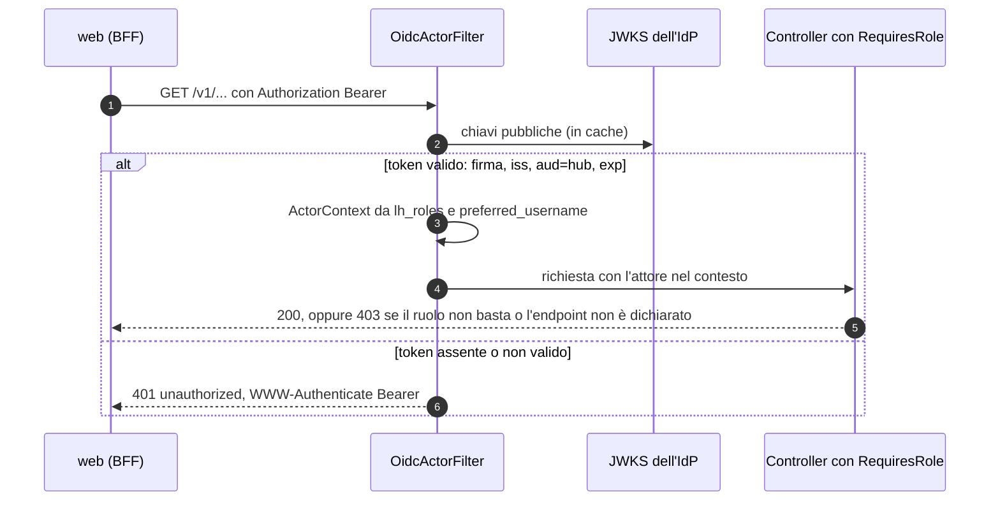
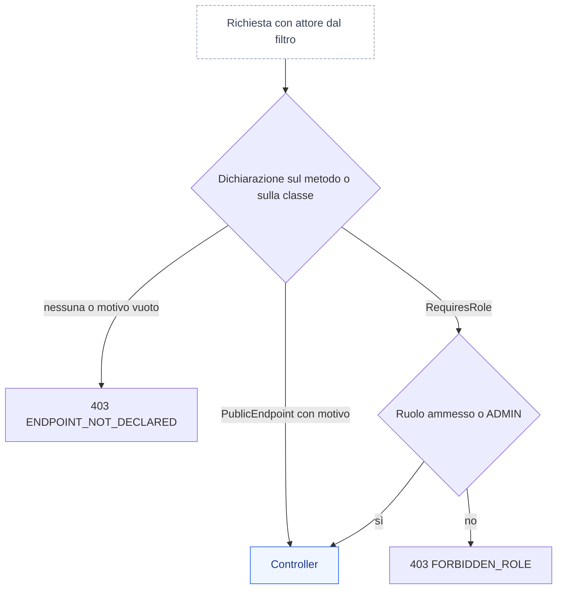

# 06 — Convenzioni backend

Valgono per tutti gli 8 servizi. Le schede in `docs/servizi/` danno per scontato quanto scritto qui.

## 1. `libs/lh-common` (starter condiviso, auto-configurato)

| Package `io.loyaltyhub.common.…` | Contenuto |
|---|---|
| `event` | `LhEvent<T>` (record dell'envelope), `LhEventTypes` (costanti dei `type`), `LhEventFactory` (crea figli propagando correlation/causation/hop/actor), serializzazione Jackson, validatore JSON Schema |
| `outbox` | tabella + `OutboxWriter` (da usare dentro `@Transactional`), `OutboxRelay` schedulato, pulizia |
| `inbox` | `IdempotentHandler` (template: `processed_event` + logica + outbox in una transazione), `EventRouter` (dispatch per `type`, ignora i tipi non registrati) |
| `kafka` | factory producer/consumer, sicurezza (`PLAINTEXT`, `SSL_PEM`, `SASL_SSL`), error handler con retry + DLQ, `NewTopic` (solo profilo `local`), header `lh-*` |
| `web` | `ProblemDetail` handler, `PageResponse<T>`, `ActorContext` (da `X-LH-Actor`), filtro CORS, filtro log MDC |
| `approval` | macchina a stati di `docs/03 §3.6`, `TransitionRequest`, storico, policy per tipo oggetto |
| `audit` | `AuditPublisher` (scrive su outbox → `lh.audit.v1`) |
| `demo` | `SeedLoader` (legge `seed/*.json` dal classpath), `DemoResettable`, controller base `/v1/demo/reset` |
| `ids` | ULID, generatori di codici (`A-Z2-9`) |
| `time` | `Clock` iniettabile, `BusinessCalendar` (`Europe/Rome`, `periodKey`) |

Regola: in `lh-common` entra solo ciò che è **identico** in almeno 3 servizi. Nessuna logica di dominio.

Migrazioni comuni: ogni servizio include `V0__lh_common.sql` (copiata dalla libreria) con `outbox`, `processed_event`, `approval_history`.

```sql
CREATE TABLE outbox (
  id uuid PRIMARY KEY, topic text NOT NULL, msg_key text NOT NULL, type text NOT NULL,
  payload jsonb NOT NULL, created_at timestamptz NOT NULL DEFAULT now(), published_at timestamptz);
CREATE INDEX outbox_unpublished ON outbox (created_at) WHERE published_at IS NULL;
CREATE TABLE processed_event (
  consumer text NOT NULL, event_id text NOT NULL, processed_at timestamptz NOT NULL DEFAULT now(),
  PRIMARY KEY (consumer, event_id));
CREATE TABLE approval_history (
  id uuid PRIMARY KEY, entity_type text NOT NULL, entity_id text NOT NULL, from_status text, to_status text NOT NULL,
  action text NOT NULL, actor text NOT NULL, comment text, created_at timestamptz NOT NULL DEFAULT now());
```

## 2. API REST

- Base path `/v1`. JSON `camelCase`. Date RFC 3339 UTC. Enum in `UPPER_SNAKE`.
- **Tre famiglie di endpoint** per servizio: gestione (`/v1/<risorsa>` — backoffice), portale (`/v1/portal/**` — sempre con `memberId` esplicito), demo (`/v1/demo/**` — solo profilo `demo`).
- Elenchi: `?page=0&size=20&sort=campo,desc` + filtri come query param. Risposta:
  ```json
  { "items": [], "page": { "number": 0, "size": 20, "totalItems": 0, "totalPages": 0 } }
  ```
  `size` massimo 100.
- Creazione → `201` + corpo; comandi asincroni → `202` + `{id, status}`; transizioni → `POST /v1/<risorsa>/{id}/transitions` con `{ "action": "SUBMIT", "comment": "…" }` → `200` + risorsa.
- Identificativi: entità di configurazione hanno `id` (ULID) **e** `code` (univoco, leggibile, `^[A-Z][A-Z0-9-]{2,39}$`); nei path si accetta indifferentemente `id` o `code`. Membri: `MBR-000123`.
- OpenAPI: springdoc su `/v3/api-docs` e `/swagger-ui.html`; ogni endpoint ha `summary` e tag = area.
- CORS: origini da `LH_CORS_ALLOWED_ORIGINS` (lista), metodi tutti, header `X-LH-Actor`, `Content-Type`.

### Errori — RFC 9457 `application/problem+json`
```json
{ "type": "urn:loyaltyhub:problem:validation", "title": "Dati non validi", "status": 422,
  "detail": "Il premio non è più disponibile", "code": "REWARD_OUT_OF_STOCK",
  "instance": "/v1/redemptions", "errors": [ { "field": "rewardCode", "message": "esaurito" } ] }
```
| Stato | `type` suffix | Quando |
|---|---|---|
| 400 | `bad-request` | JSON malformato, parametri errati |
| 403 | `forbidden-role` | il ruolo in `X-LH-Actor` non può eseguire l'azione |
| 403 | `endpoint-not-declared` | l'endpoint non dichiara `@RequiresRole` né `@PublicEndpoint` (`ENDPOINT_NOT_DECLARED`, §3.2): errore del codice, rifiutato a tutti |
| 404 | `not-found` | risorsa inesistente |
| 409 | `conflict` | transizione non valida, codice duplicato, modifica non ammessa su oggetto `LIVE` |
| 422 | `validation` | regola di business violata (`code` specifico, elencati nelle schede servizio) |
| 503 | `dependency-unavailable` | DB/Kafka non raggiungibili |

`detail` è in italiano e mostrabile all'utente; `code` è stabile e usato dal frontend.

## 3. Identità simulata

- Header `X-LH-Actor: <RUOLO>:<username>` (es. `MARKETING:luca.marketing`). Assente → `ANALYST:anonymous` (sola lettura). Vale solo la forma canonica (ruolo noto in maiuscolo, un solo `:`, username non vuoto e senza spazi ai bordi); ogni altra forma (ruolo sconosciuto o minuscolo, `LEGAL`, `CARE:`, `:paolo`, `ADMIN:a:b`…) vale `ANALYST` (Q-261, Q-298).
- Controllo **minimo** lato servizio (annotazione `@RequiresRole`): scritture ⇒ ruolo ≠ `ANALYST`; `APPROVE/REJECT` ⇒ ruolo della policy o `ADMIN`; rettifiche punti ⇒ `CARE`/`ADMIN`; `/v1/demo/**` ⇒ `ADMIN` (eccetto simulatore e scenari: tutti tranne `ANALYST`). Le letture elencano tutti i ruoli, `ANALYST` compreso (§3.2).
- Gli endpoint `/v1/portal/**` non richiedono header; l'attore è `member:<memberId>`.
- Ogni scrittura da backoffice pubblica un audit con l'attore.

### 3.1 Profilo `enterprise`: attore dal token (M8.2, ADR-027)

- `loyaltyhub.identity.mode` (`LH_IDENTITY_MODE`): `header` (default, solo profilo `demo`) oppure `oidc`. Con `oidc` il filtro `OidcActorFilter` sostituisce `ActorFilter`: ogni richiesta porta `Authorization: Bearer`; il token è verificato con il JWKS dell'emittente (`LH_OIDC_ISSUER`, `LH_OIDC_JWKS_URI`, default Keycloak `<issuer>/protocol/openid-connect/certs`): firma, scadenza, `iss` esatto, `aud` che contiene `hub` (`LH_OIDC_AUDIENCE`). `X-LH-Actor` è ignorato.
- Token assente o non valido ⇒ `401` `unauthorized` con `WWW-Authenticate: Bearer`, sempre lo stesso corpo (nessun indizio sul motivo). Liberi solo `/actuator/health/**` e `/actuator/info`.
- Ruoli dal claim `lh_roles`: `ADMIN` vince; un solo ruolo operatore vale quel ruolo; più ruoli operatore diversi o nessuno ⇒ `ANALYST` (Q-365). Username da `preferred_username`, poi `azp`, poi `sub`.
- Un token di solo `MEMBER` vale soltanto su `/v1/portal/**` (altrimenti `403`); il `sub` è disponibile come attributo della richiesta per `MemberPrincipal` (M8.10).
- Avvio: con il profilo `enterprise` e `mode` diverso da `oidc`, o `oidc` senza emittente, il servizio **non parte** (`INSECURE_CONFIG`, regola 22). L'autorizzazione resta `@RequiresRole`; niente catena di filtri di Spring Security (solo `spring-security-oauth2-jose` per decoder e validatori).



### 3.2 Deny by default: `@RequiresRole` o `@PublicEndpoint` (M8.10, F2-SEC-09, ADR-042)

Ogni endpoint dichiara chi può chiamarlo. Un endpoint senza dichiarazione è rifiutato a tutti, in ogni profilo: così un controller nuovo non nasce aperto per dimenticanza (CLAUDE.md regola 18).

- **Dichiara l'accesso su ogni metodo mappato** di un `@RestController`, sul metodo o sulla classe. La dichiarazione del metodo prevale su quella della classe.
  - `@RequiresRole(...)`: semantica di §3, invariata. `ADMIN` passa sempre; un elenco vuoto vale la regola «scrittura».
  - `@PublicEndpoint(reason = "…")`: nessun controllo di ruolo. Il motivo è obbligatorio e non vuoto; un motivo vuoto vale come endpoint non dichiarato.
  - Se lo stesso elemento porta entrambe, vince `@RequiresRole` e la regola ArchUnit fallisce.
- **Le letture elencano tutti i ruoli**: `@RequiresRole({Role.ADMIN, Role.MARKETING, Role.LEGAL, Role.CARE, Role.ANALYST})`. Tutte le personas leggono tutto (docs/08 §2) e nel profilo `demo` una richiesta senza `X-LH-Actor` vale `ANALYST:anonymous`, quindi l'accesso della demo non cambia. Non usare `@PublicEndpoint` per una lettura: nel profilo `enterprise` la stessa annotazione chiede un token con uno di quei ruoli.
- **`@PublicEndpoint` toglie solo il controllo di ruolo.** Nel profilo `enterprise` il filtro OIDC chiede comunque un token valido (§3.1); aprire un endpoint senza token è un'altra decisione (Q-411). Un nuovo `@PublicEndpoint` è un caso di *Fermati e chiedi* (CLAUDE.md §7). Oggi c'è un solo `@PublicEndpoint`: `GET /` dell'hub, la pagina di stato che apre il probe della piattaforma.
- **Endpoint non dichiarato** ⇒ `403` `endpoint-not-declared`, `code` `ENDPOINT_NOT_DECLARED`, anche per `ADMIN`. Il log registra solo classe e metodo, mai percorso, parametri o attore.
- **Fuori ambito**: i controller dei framework (`org.springframework.*`, `org.springdoc.*`: pagina d'errore, OpenAPI) e gli endpoint di Actuator. Nel profilo `enterprise` li protegge il filtro OIDC, tranne i probe.
- **Verifica di build.** `EndpointAccessRules` di `libs/lh-test-support` (ArchUnit) fallisce se un metodo mappato di un controller non ha la dichiarazione, se un `@PublicEndpoint` non ha motivo o se un elemento porta entrambe le annotazioni. Ogni modulo con controller la applica con `EndpointAccessArchTest`; nuovo modulo, nuovo test:

  ```java
  // Deny by default nel modulo wallet: fallisce la build se un endpoint non dichiara l'accesso
  @Test
  void everyEndpointDeclaresAccess() {
      EndpointAccessRules.check("io.loyaltyhub.wallet");
  }
  ```

- **Nuove dichiarazioni.** `@RequiresRole` e `@PublicEndpoint` portano la meta-annotazione `@EndpointAccess`. Una dichiarazione futura (per esempio il membro dal token per `/v1/portal/**`, Q-410) porta la stessa meta-annotazione e si applica in `EndpointAccessInterceptor`: finché l'interceptor non la conosce, l'endpoint resta rifiutato.



## 4. Persistenza

- Spring Data JDBC per aggregati semplici; `JdbcClient` con SQL esplicito per elenchi filtrati, contatori atomici, claim. Niente ORM.
- Schema per servizio: `spring.flyway.schemas=<schema>`, `default-schema=<schema>`, connessione con `currentSchema=<schema>`. **Vietato** referenziare altri schemi.
- JSONB per strutture flessibili (condizioni, effetti, attributi, payload): converter `PGobject` ⇄ `JsonNode`/record in `lh-common`.
- Colonne standard: `created_at`, `updated_at` (timestamptz), `created_by`, `updated_by` sulle entità di configurazione; `version int` per optimistic locking dove c'è modifica da UI (409 su conflitto).
- Pool: Hikari `maximumPoolSize=4`, `minimumIdle=0`, `idleTimeout=60s`, `connectionTimeout=20s` (il DB serverless può essere in risveglio).
- Flyway usa l'URL **diretto** (`DB_URL_DIRECT`), l'applicazione può usare quello con pooler.
- Pulizie schedulate (RNF-07): `outbox` pubblicati > 24 h; `processed_event` > 14 giorni; tabelle di log indicate nelle schede.

### SQL dinamico: `SqlWhere` / `SqlOrder` (regola 19, ADR-042)

Il testo SQL è **costante** oppure composto dal builder di `lh-common` (package `io.loyaltyhub.common.sql`, F2-SEC-10); mai input nel testo SQL, mai `String.format`/`formatted` o concatenazioni con valori.

- **Colonne solo da enum.** Ogni repository dichiara un `enum` che implementa `SqlColumn` con l'espressione costante della colonna (es. `e.occurred_at`); il builder rifiuta colonne che non sono costanti enum.
- **Valori solo come parametri.** `SqlWhere` produce `" WHERE …"` (o `""` se vuoto; `andSql()` per accodarsi a un `WHERE` costante) con parametri con nome `:w0`, `:w1`, … e li lega con `bind(spec)`. I nomi `wN` sono riservati: gli altri parametri della query usano nomi diversi (es. `:limit`). Condizioni in `AND`; `anyOf(…)` apre un gruppo in `OR`.
- **Filtri facoltativi** con `eqIfPresent` (salta `null` e testo vuoto) o `when(condizione, w -> …)`. `in(colonna, [])` non corrisponde a nessuna riga (`1 = 0`); un valore `null` in un filtro obbligatorio è un errore (usare `isNull`).
- **Ricerca testuale** con `like`/`ilike`: `%`, `_` e `\` dell'input sono neutralizzati e la condizione dichiara `ESCAPE '\'`.
- **Ordinamento** con `SqlOrder`: `sort=campo,desc` (§2) si traduce con `SqlOrder.parse(sort, allowlist)`, dove l'allowlist mappa il nome API sulla colonna enum; campo o direzione non ammessi → `400` con `code` `INVALID_SORT`.
- La paginazione resta `PageParams` (`web`); `LIMIT`/`OFFSET` sono parametri con nome.

```java
enum LedgerColumn implements SqlColumn {
    MEMBER_ID("e.member_id"), CURRENCY("e.currency"), OCCURRED_AT("e.occurred_at");
    private final String sql;
    LedgerColumn(String sql) { this.sql = sql; }
    @Override public String sql() { return sql; }
}

SqlWhere where = new SqlWhere()
        .eq(LedgerColumn.MEMBER_ID, memberId)
        .eqIfPresent(LedgerColumn.CURRENCY, currency)
        .when(from != null, w -> w.gte(LedgerColumn.OCCURRED_AT, Timestamp.from(from)));
SqlOrder order = SqlOrder.parse(sort, Map.of("occurredAt", LedgerColumn.OCCURRED_AT),
        SqlOrder.desc(LedgerColumn.OCCURRED_AT));
List<Row> rows = where.bind(jdbc.sql(SELECT + where.sql() + order.sql() + " LIMIT :limit"))
        .param("limit", page.size())
        .query(MAPPER).list();
```

## 5. Kafka

- Listener: uno per topic per servizio, `concurrency=2`, ack `MANUAL_IMMEDIATE` dopo il commit DB, `max.poll.records=50`.
- **Attenzione**: con `spring.main.lazy-initialization=true` (profilo `free`) i bean con `@KafkaListener` e gli `@Scheduled` vanno annotati `@Lazy(false)`.
- Il listener delega a `EventRouter`; ogni handler è una classe `@Component` che dichiara i `type` gestiti.
- Produzione **solo** tramite `OutboxWriter`. `KafkaTemplate` è usato unicamente da `OutboxRelay` e dal recoverer DLQ. `acks=all`, `enable.idempotence=true`.
- Configurazione:
  ```yaml
  loyaltyhub:
    topics: { actions: lh.actions.v1, effects: lh.effects.v1, facts: lh.facts.v1, audit: lh.audit.v1, dlq: lh.dlq.v1 }
    kafka:
      security: ${KAFKA_SECURITY:PLAINTEXT}      # PLAINTEXT | SSL_PEM | SASL_SSL
      ssl: { ca-b64: ${KAFKA_SSL_CA_B64:}, cert-b64: ${KAFKA_SSL_CERT_B64:}, key-b64: ${KAFKA_SSL_KEY_B64:} }
      sasl: { username: ${KAFKA_SASL_USERNAME:}, password: ${KAFKA_SASL_PASSWORD:}, mechanism: SCRAM-SHA-256 }
  ```
  `SSL_PEM`: i PEM arrivano in base64 da variabili d'ambiente e sono passati al client come `ssl.keystore.type=PEM` / `ssl.truststore.type=PEM` (nessun file su disco).

## 6. Profili Spring

| Profilo | Effetto |
|---|---|
| `local` | Kafka e Postgres locali, crea i topic, log leggibili |
| `free` | tuning per 512 MB / 0.1 CPU: lazy init, pool ridotti, Tomcat `threads.max=20`, virtual thread, JMX off |
| `demo` | carica i seed se lo schema è vuoto; abilita `/v1/demo/**`; job disponibili su richiesta |

Deploy demo = `demo,free`. Sviluppo = `demo,local`. `server.port=${PORT:<porta locale>}`.

## 7. Approvazioni (uso della macchina a stati comune)

Il diagramma di riferimento della macchina è in `docs/03 §3.6` e vale per campagne, premi, concorsi e contenuti: le schede servizio lo richiamano invece di ripeterlo.

Ogni servizio proprietario di oggetti governati espone:
- `POST /v1/<risorsa>/{id}/transitions` → applica la transizione, scrive `approval_history`, audit e fatto `*.status.changed`;
- `GET /v1/approvals?status=IN_REVIEW` → elementi in attesa nel formato comune `{entityType, id, code, name, submittedBy, submittedAt, requiredRole, summary}`.

Policy (configurazione `loyaltyhub.approval.policy`, seed):
| Tipo oggetto | Approvazione richiesta | Ruolo |
|---|---|---|
| `CONTEST` | sempre | `LEGAL` |
| `REWARD` | sempre | `LEGAL` |
| `CAMPAIGN` | se `requiresLegal = true` o budget > 100 000 punti | `LEGAL` |
| `CONTENT` | mai (pubblicazione diretta) | — |

Fino a M7 la proprietà `loyaltyhub.approval.enabled=false` consente `DRAFT → LIVE` diretto per tutti.

**Fase 2 — quattro occhi** (ADR-044, M8.13, F2-GRC-03). Chi sottomette un oggetto non può approvarlo: `APPROVE` dallo stesso attore del `SUBMIT` → `422 SELF_APPROVAL_FORBIDDEN`, anche per `ADMIN` (l'*override* di ADMIN resta solo per oggetti sottomessi da altri). Le operazioni sensibili hanno un doppio controllo configurabile con la stessa macchina a stati (richiesta → approvazione da un secondo operatore): rettifiche punti sopra soglia, chiusura di edizione, modifica di ruoli, esportazioni di dati personali, cambio della scala dei livelli (soglie di default in Q-358). Nel profilo `enterprise` il doppio controllo non si spegne con un flag lasciato a `false` per comodità: l'avvio lo rifiuta (regola 22).

## 8. Log, salute, metriche

- Log JSON (profilo `free`) con MDC: `service, eventId, eventType, correlationId, memberId, actor`.
- Actuator: `health` (con componenti `db`, `kafka`, esposti sempre), `info`, `metrics`, `prometheus`. Liveness su `/actuator/health/liveness`.
- Health `kafka`: `AdminClient.describeCluster` con timeout 3 s (in cache 30 s).
- Metriche custom: `lh_events_consumed_total{type}`, `lh_events_published_total{type}`, `lh_outbox_pending`, `lh_handler_seconds{type}`.

## 9. Test

| Livello | Cosa | Strumenti |
|---|---|---|
| Unit | regole pure: condizioni, effetti, limiti, FIFO, scadenze, tier e discesa morbida, claim istanti (logica), metriche obiettivi, selezione contenuti | JUnit 5, AssertJ, `Clock` fisso |
| Integrazione | per ogni handler: evento in ingresso → stato DB + evento in outbox; **doppio invio = stesso stato** (RNF-03); migrazioni Flyway | Testcontainers Postgres + Kafka |
| Contratto | esempi ↔ schemi; evento prodotto ↔ schema | validatore JSON Schema di `lh-common` |
| Concorrenza | claim istante vincente con 20 giocate parallele → una sola vincita per istante; contatori limite | Testcontainers, executor |
| API | slice test dei controller: validazione, errori RFC 9457, ruoli | MockMvc |
| E2E | `scripts/smoke.sh` su docker compose: `SCN-SMOKE` → saldo atteso entro 15 s | bash + curl + jq |

Copertura: nessuna soglia numerica; **obbligatorio** un test per ogni regola numerata in `docs/03` e per ogni handler. I test non dipendono dai seed (creano i propri dati), tranne lo smoke.

IT su Kafka senza attese a tempo: il modulo `libs/lh-test-support` (`io.loyaltyhub.testsupport`) offre `TopicReader` (lettura di un topic senza consumer group, fino alla fine osservata, dopo la barriera `processed_event` e a outbox svuotato) e `ListenerGroups` (`awaitStable` prima di pubblicare, `awaitCommitted` per doppioni, type ignorati e DLQ, `awaitQuiescent` per catene tra servizi). Un'assenza o un "esattamente uno" si verifica dopo una barriera di elaborazione, mai dopo una finestra di tempo. Lo stesso modulo offre `EndpointAccessRules`, la regola ArchUnit del deny by default (§3.2). Il modulo si dichiara **solo con scope `test`**: non entra mai in un jar di produzione.

## 10. Endpoint demo comuni

| Metodo | Path | Effetto |
|---|---|---|
| POST | `/v1/demo/reset` | tronca le tabelle del servizio (tranne `flyway_schema_history`) e ricarica i seed; audit `RESET` |
| GET | `/v1/demo/info` | profili attivi, versione, conteggi principali, ultimo reset |

Gli altri endpoint demo (job, istanti piantati, scenari) sono nelle schede dei servizi.

## 11. Fase 2 — sicurezza applicativa (profilo `enterprise`)

Convenzioni introdotte dalla Fase 2 (`docs/18 §3.10`, ADR-042); diventano vincolanti con la fetta citata. Nel profilo `demo` restano valide le convenzioni di §3 finché la fetta non le sostituisce.

- **Deny by default: `@RequiresRole` o `@PublicEndpoint`** (M8.10, F2-SEC-09). **Attivo in ogni profilo** (§3.2): ogni metodo di un `@RestController` dichiara `@RequiresRole(...)` oppure `@PublicEndpoint(reason = "…")` con una motivazione leggibile; senza dichiarazione l'endpoint risponde `403 ENDPOINT_NOT_DECLARED` e un test ArchUnit fa fallire la build. Un nuovo `@PublicEndpoint` è un caso di *Fermati e chiedi* (`CLAUDE.md §7`).
- **`MemberPrincipal` nel portale** (M8.2/M8.10). Le API `/v1/portal/*` ricavano il membro solo dal token (`MemberPrincipal`); `memberId` da path, query o corpo è ignorato o rifiutato (`400`), mai usato (difesa da BOLA). Le API di gestione controllano la proprietà dell'oggetto dove il ruolo non basta.
- **DTO espliciti.** I controller legano solo `record` DTO con Bean Validation, mai entità; `status`, `version`, `createdBy` e simili non sono legabili (niente *mass assignment*).
- **SQL solo parametrico: `SqlWhere` / `SqlOrder`** (M8.10, F2-SEC-10). Solo `JdbcClient` con parametri; il testo SQL è costante oppure costruito dal builder comune di `lh-common`, che accetta colonne solo da enum/allowlist (filtri, ordinamenti, campi dei segmenti e degli attributi `jsonb`). Vietati `Statement`, `String.format`/`formatted` e concatenazione nel testo SQL; una regola Semgrep fallisce su `.sql(` con argomento non costante fuori dal builder.
- **Limiti di input** (M8.10). Bean Validation su ogni DTO (lunghezze, pattern, enum, intervalli); limiti Jackson `StreamReadConstraints` (dimensione, profondità, lunghezza dei numeri); corpo massimo per endpoint; paginazione con tetto 100; `FAIL_ON_UNKNOWN_PROPERTIES` sulle scritture REST (non sugli eventi); nessuna deserializzazione polimorfica.
- **`Idempotency-Key`** (M8.10, F2-SEC-11). Obbligatoria sulle `POST` che spendono o assegnano valore (riscatto, giocata, rettifica punti, import: Q-353); stessa chiave entro 24 h → stesso esito, nessun doppio effetto; chiave assente → `400`.
- **Firma dei messaggi** (M8.10, F2-SEC-08). Ogni envelope pubblicato porta `lhsig`/`lhkid` (JWS *detached* Ed25519, chiave per modulo); il consumer verifica firma e produttore ammesso (`contracts/events/producers.yaml`) prima dell'idempotenza; errori → DLQ `SIGNATURE_INVALID` / `PRODUCER_NOT_ALLOWED`. Dettagli in `docs/05 §2` e §9.
- **Template e contenuti.** Motore di template senza logica con escaping; nessuna valutazione di espressioni su testi degli operatori; contenuti ricchi sanitizzati con allowlist alla pubblicazione.
- **Richieste in uscita (SSRF).** Destinazioni dei webhook risolte e rifiutate se private, loopback o link-local; nessun redirect seguito; CMS e LLM solo verso URL di configurazione. Una nuova destinazione di rete in uscita è un caso di *Fermati e chiedi*.
- **Log.** Nessun dato personale né credenziale nei log; MDC con identificativi tecnici (`eventId`, `correlationId`, `memberId`).
