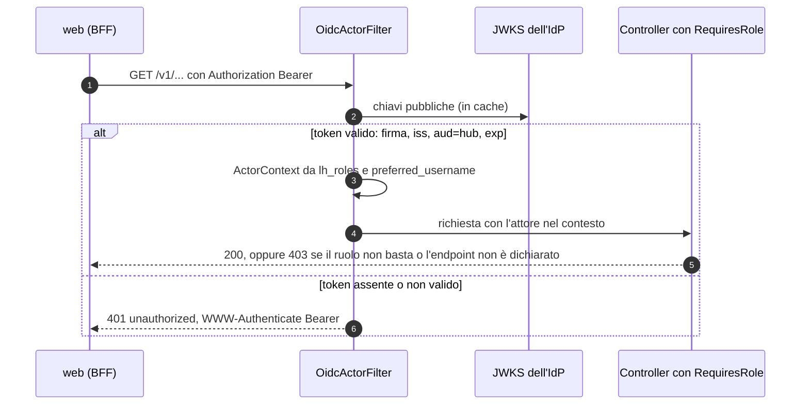
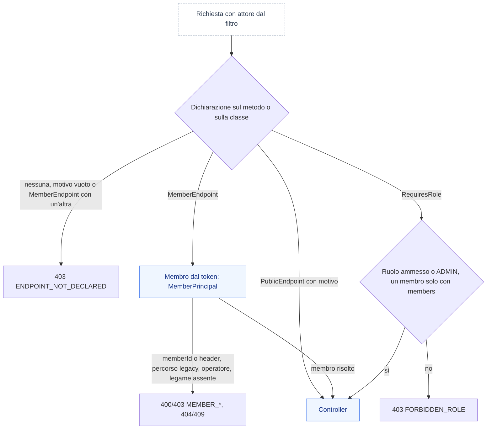
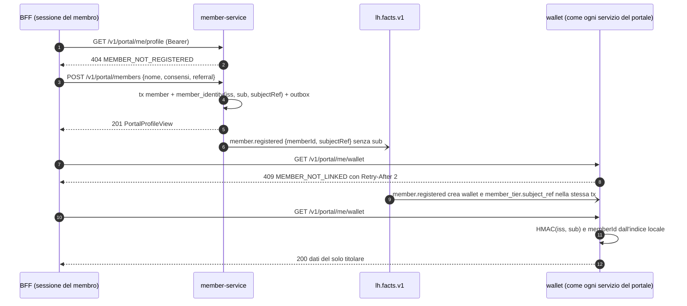

# 06 — Convenzioni backend

Valgono per tutti gli 8 servizi. Le schede in `docs/servizi/` danno per scontato quanto scritto qui.

## 1. `libs/lh-common` (starter condiviso, auto-configurato)

| Package `io.loyaltyhub.common.…` | Contenuto |
|---|---|
| `event` | `LhEvent<T>` (record dell'envelope), `LhEventTypes` (costanti dei `type`), `LhEventFactory` (crea figli propagando correlation/causation/hop/actor), serializzazione Jackson, validatore JSON Schema |
| `outbox` | tabella + `OutboxWriter` (da usare dentro `@Transactional`), `OutboxRelay` schedulato, pulizia |
| `inbox` | `IdempotentHandler` (template: `processed_event` + logica + outbox in una transazione), `EventRouter` (dispatch per `type`, ignora i tipi non registrati) |
| `kafka` | factory producer/consumer, sicurezza (`PLAINTEXT`, `SSL_PEM`, `SASL_SSL`), error handler con retry + DLQ, `NewTopic` (solo profilo `local`), header `lh-*` |
| `web` | `ProblemDetail` handler, `PageResponse<T>`, `ActorContext` (da `X-LH-Actor`), filtro CORS, filtro log MDC |
| `approval` | macchina a stati di `docs/03 §3.6`, `TransitionRequest`, storico, policy per tipo oggetto |
| `audit` | `AuditPublisher` (scrive su outbox → `lh.audit.v1`) |
| `demo` | `SeedLoader` (legge `seed/*.json` dal classpath), `DemoResettable`, controller base `/v1/demo/reset` |
| `ids` | ULID, generatori di codici (`A-Z2-9`) |
| `time` | `Clock` iniettabile, `BusinessCalendar` (`Europe/Rome`, `periodKey`) |

Regola: in `lh-common` entra solo ciò che è **identico** in almeno 3 servizi. Nessuna logica di dominio.

Migrazioni comuni: ogni servizio include `V0__lh_common.sql` (copiata dalla libreria) con `outbox`, `processed_event`, `approval_history`.

```sql
CREATE TABLE outbox (
  id uuid PRIMARY KEY, topic text NOT NULL, msg_key text NOT NULL, type text NOT NULL,
  payload jsonb NOT NULL, created_at timestamptz NOT NULL DEFAULT now(), published_at timestamptz);
CREATE INDEX outbox_unpublished ON outbox (created_at) WHERE published_at IS NULL;
CREATE TABLE processed_event (
  consumer text NOT NULL, event_id text NOT NULL, processed_at timestamptz NOT NULL DEFAULT now(),
  PRIMARY KEY (consumer, event_id));
CREATE TABLE approval_history (
  id uuid PRIMARY KEY, entity_type text NOT NULL, entity_id text NOT NULL, from_status text, to_status text NOT NULL,
  action text NOT NULL, actor text NOT NULL, comment text, created_at timestamptz NOT NULL DEFAULT now());
```

## 2. API REST

- Base path `/v1`. JSON `camelCase`. Date RFC 3339 UTC. Enum in `UPPER_SNAKE`.
- **Tre famiglie di endpoint** per servizio: gestione (`/v1/<risorsa>` — backoffice), portale (`/v1/portal/**` — nel profilo `demo` con `memberId` esplicito o l'header `X-LH-Member`; nel profilo `enterprise` il membro viene solo dal token, §3.4), demo (`/v1/demo/**` — solo profilo `demo`).
- Elenchi: `?page=0&size=20&sort=campo,desc` + filtri come query param. Risposta:
  ```json
  { "items": [], "page": { "number": 0, "size": 20, "totalItems": 0, "totalPages": 0 } }
  ```
  `size` massimo 100.
- Creazione → `201` + corpo; comandi asincroni → `202` + `{id, status}`; transizioni → `POST /v1/<risorsa>/{id}/transitions` con `{ "action": "SUBMIT", "comment": "…" }` → `200` + risorsa.
- Identificativi: entità di configurazione hanno `id` (ULID) **e** `code` (univoco, leggibile, `^[A-Z][A-Z0-9-]{2,39}$`); nei path si accetta indifferentemente `id` o `code`. Membri: `MBR-000123`.
- OpenAPI: springdoc su `/v3/api-docs` e `/swagger-ui.html`; ogni endpoint ha `summary` e tag = area.
- CORS: origini da `LH_CORS_ALLOWED_ORIGINS` (lista), metodi tutti, header `X-LH-Actor`, `Content-Type`.

### Errori — RFC 9457 `application/problem+json`
```json
{ "type": "urn:loyaltyhub:problem:validation", "title": "Dati non validi", "status": 422,
  "detail": "Il premio non è più disponibile", "code": "REWARD_OUT_OF_STOCK",
  "instance": "/v1/redemptions", "errors": [ { "field": "rewardCode", "message": "esaurito" } ] }
```
| Stato | `type` suffix | Quando |
|---|---|---|
| 400 | `bad-request` | JSON malformato, parametri errati |
| 400 | `member-from-token` | in `oidc`, su un endpoint del portale: `memberId` in query, campo form o corpo (a qualunque profondità), oppure header `X-LH-Member`, anche se è l'id del titolare (`MEMBER_FROM_TOKEN`, §3.4) |
| 400 | `member-mismatch` | nel profilo `demo`, due fonti del membro in disaccordo: `memberId` esplicito, `X-LH-Member`, variabile di percorso legacy (`MEMBER_MISMATCH`, §3.4) |
| 403 | `forbidden-role` | il ruolo in `X-LH-Actor` (o nel token) non può eseguire l'azione; in `oidc` anche un token di solo membro su un handler che non è del portale del membro (§3.4) |
| 403 | `member-from-token` | in `oidc`, l'id del membro nel percorso di un endpoint legacy (`/v1/portal/wallets/{memberId}`, `/v1/portal/members/{id}`): vale solo in `demo` (`MEMBER_FROM_TOKEN`, §3.4) |
| 403 | `member-required` | operatore o token misto su una funzione del membro, `REQUIRED` o `REGISTRATION` (`MEMBER_REQUIRED`, §3.4) |
| 403 | `source-mismatch` | una fonte autenticata (ruolo `SOURCE`) dichiara un `source` diverso dal proprio client `src-<codice>` (`SOURCE_MISMATCH`, §3.3): nulla è salvato né pubblicato |
| 403 | `endpoint-not-declared` | l'endpoint non dichiara `@RequiresRole`, `@PublicEndpoint` né `@MemberEndpoint`, oppure dichiara `@MemberEndpoint` insieme a `@RequiresRole` o `@PublicEndpoint` sullo stesso elemento (`ENDPOINT_NOT_DECLARED`, §3.2): errore del codice, rifiutato a tutti |
| 404 | `not-found` | risorsa inesistente; nel portale anche un oggetto di un altro membro (`NOT_FOUND`, mai `403`: non rivela che esiste) |
| 404 | `member-not-registered` | il `sub` del token non ha un legame in member-service (`MEMBER_NOT_REGISTERED`, §3.4) |
| 409 | `conflict` | transizione non valida, codice duplicato, modifica non ammessa su oggetto `LIVE` |
| 409 | `member-not-linked` | il `sub` del token non è ancora legato a un membro in questo servizio: il fatto `member.registered` non è arrivato (`MEMBER_NOT_LINKED`, §3.4). Porta `Retry-After: 2` |
| 422 | `validation` | regola di business violata (`code` specifico, elencati nelle schede servizio) |
| 503 | `dependency-unavailable` | DB/Kafka non raggiungibili |

`detail` è in italiano e mostrabile all'utente; `code` è stabile e usato dal frontend. I codici `MEMBER_*` (ADR-048, Q-553) non ripetono mai l'id ricevuto nel `detail`; il suffisso di `type` è il `code` in minuscolo con i trattini, come per `source-mismatch` ed `endpoint-not-declared`. Sono decisi e diventano operativi con la fetta `lh-common` di M8.10f.

## 3. Identità simulata

- Ruoli: cinque persone del backoffice (`ADMIN`, `MARKETING`, `LEGAL`, `CARE`, `ANALYST`) e un ruolo di integrazione, `SOURCE` (§3.3): l'utenza di servizio di una fonte di ingestion, mai una persona; il web non lo offre tra le persone.
- Header `X-LH-Actor: <RUOLO>:<username>` (es. `MARKETING:luca.marketing`; per una fonte `SOURCE:<client-id>`, es. `SOURCE:src-crm`). Assente → `ANALYST:anonymous` (sola lettura). Vale solo la forma canonica (ruolo noto in maiuscolo, un solo `:`, username non vuoto e senza spazi ai bordi); ogni altra forma (ruolo sconosciuto o minuscolo, `LEGAL`, `CARE:`, `:paolo`, `ADMIN:a:b`…) vale `ANALYST` (Q-261, Q-298).
- Controllo **minimo** lato servizio (annotazione `@RequiresRole`): scritture ⇒ ruolo operatore ≠ `ANALYST` (`SOURCE` non è mai incluso: arriva solo dove è elencato, §3.3); `APPROVE/REJECT` ⇒ ruolo della policy o `ADMIN`; rettifiche punti ⇒ `CARE`/`ADMIN`; `/v1/demo/**` ⇒ `ADMIN`, con tre eccezioni: simulatore e avvio degli scenari (`POST /v1/demo/simulator/fire`, `POST /v1/demo/scenarios/{code}/run`: tutti tranne `ANALYST`) e le letture `GET /v1/demo/personas`, `GET /v1/demo/scenarios`, `GET /v1/demo/scenario-runs/{id}`, aperte a tutti i ruoli come prima. Le letture aperte elencano tutti i ruoli, `ANALYST` compreso (§3.2).
- Gli endpoint `/v1/portal/**` non richiedono `X-LH-Actor`. Nel profilo `demo` il membro è il `memberId` esplicito oppure, da M8.10f (Q-555), l'header `X-LH-Member`, messo dal BFF dalla persona; quando un id è legato a un `@MemberEndpoint` l'attore è `member:<memberId>`, mentre in `demo`, senza id (o su una lettura `members = true`), l'attore resta `ANALYST:anonymous`. Nel profilo `enterprise` il membro viene solo dal token (§3.4) e l'attore vale `member:-` finché il membro non è risolto, poi `member:<memberId>`. L'attore del membro non porta mai il nome utente (regola 20): da M8.10f `ActorContext` ha un flag `member`, ruolo `ANALYST` (sola lettura), e `Role` non cambia (Q-556).
- Ogni scrittura da backoffice pubblica un audit con l'attore.

### 3.1 Profilo `enterprise`: attore dal token (M8.2, ADR-027)

- `loyaltyhub.identity.mode` (`LH_IDENTITY_MODE`): `header` (default, solo profilo `demo`) oppure `oidc`. Con `oidc` il filtro `OidcActorFilter` sostituisce `ActorFilter`: ogni richiesta porta `Authorization: Bearer`; il token è verificato con il JWKS dell'emittente (`LH_OIDC_ISSUER`, `LH_OIDC_JWKS_URI`, default Keycloak `<issuer>/protocol/openid-connect/certs`): firma, scadenza, `iss` esatto, `aud` che contiene `hub` (`LH_OIDC_AUDIENCE`). `X-LH-Actor` è ignorato.
- Token assente o non valido ⇒ `401` `unauthorized` con `WWW-Authenticate: Bearer`, sempre lo stesso corpo (nessun indizio sul motivo). Liberi solo `/actuator/health/**` e `/actuator/info`.
- Ruoli dal claim `lh_roles`: `ADMIN` vince; un solo ruolo operatore vale quel ruolo; più ruoli operatore diversi o nessuno ⇒ `ANALYST` (Q-365). Username da `preferred_username`, poi `azp`, poi `sub`. `SOURCE` non è un ruolo operatore e non ne aumenta i poteri: un token con `SOURCE` e nessun ruolo operatore vale `SOURCE` e l'attore prende il nome del client (`azp`, poi `client_id`), non lo username dell'utenza di servizio; con ruoli operatore valgono questi (§3.3).
- Un token di solo `MEMBER` vale soltanto su `/v1/portal/**` (altrimenti `403`); il `sub` è disponibile come attributo della richiesta per `MemberPrincipal` (M8.10). Da M8.10f (ADR-048, §3.4): nel portale solo funzioni del membro e letture `members = true`; attore `member:-` finché il membro non è risolto, poi `member:<memberId>` (mai `preferred_username`, regola 20; Q-556); `iss` e `sub` diventano attributi della richiesta per `MemberPrincipal` e non si registrano; un operatore o un token misto non agisce mai come membro (`MEMBER_REQUIRED`, Q-554: coerente con Q-365, mai l'unione dei poteri); `MEMBER` con `SOURCE` resta `403` sul portale.
- Avvio: con il profilo `enterprise` e `mode` diverso da `oidc`, o `oidc` senza emittente, il servizio **non parte** (`INSECURE_CONFIG`, regola 22). L'autorizzazione resta `@RequiresRole`; niente catena di filtri di Spring Security (solo `spring-security-oauth2-jose` per decoder e validatori).



### 3.2 Deny by default: `@RequiresRole`, `@PublicEndpoint` o `@MemberEndpoint` (M8.10, F2-SEC-09, ADR-042, ADR-048)

Ogni endpoint dichiara chi può chiamarlo. Un endpoint senza dichiarazione è rifiutato a tutti, in ogni profilo: così un controller nuovo non nasce aperto per dimenticanza (CLAUDE.md regola 18). Le dichiarazioni sono un elenco chiuso; con ADR-048 diventano tre, ma in codice oggi esistono solo `@RequiresRole` e `@PublicEndpoint`: `@MemberEndpoint` (§3.4) arriva con la fetta `lh-common` di M8.10f.

- **Dichiara l'accesso su ogni metodo mappato** di un `@RestController`, sul metodo o sulla classe. La dichiarazione del metodo prevale su quella della classe.
  - `@RequiresRole(...)`: semantica di §3. `ADMIN` passa sempre; un elenco vuoto vale la regola «scrittura» (ogni ruolo operatore tranne `ANALYST` e `SOURCE`).
  - `@PublicEndpoint(reason = "…")`: nessun controllo di ruolo. Il motivo è obbligatorio e non vuoto; un motivo vuoto vale come endpoint non dichiarato.
  - Se lo stesso elemento porta entrambe, vince `@RequiresRole` e la regola ArchUnit fallisce.
  - `@MemberEndpoint(REQUIRED | OPTIONAL | REGISTRATION)` (ADR-048, §3.4): il membro viene solo dal token e il controller riceve un `MemberPrincipal` (o un `MemberSubject` per la registrazione). Sullo stesso elemento non può convivere con `@RequiresRole` né con `@PublicEndpoint`: la combinazione è rifiutata (`403 ENDPOINT_NOT_DECLARED`) e la regola ArchUnit fallisce.
  - `@RequiresRole(..., members = true)` (ADR-048): lettura di programma aperta anche al token di solo membro (tema, livelli, edizioni, categorie premio), senza parametri legati alla richiesta. Un token di solo membro su un handler `@RequiresRole` senza `members` riceve `403 FORBIDDEN_ROLE`; il filtro OIDC continua a limitarlo a `/v1/portal/**` (difesa in profondità).
- **Le letture aperte elencano tutti i ruoli**: `@RequiresRole({Role.ADMIN, Role.MARKETING, Role.LEGAL, Role.CARE, Role.ANALYST})`. Tutte le personas leggono tutto (docs/08 §2) e nel profilo `demo` una richiesta senza `X-LH-Actor` vale `ANALYST:anonymous`, quindi l'accesso della demo non cambia. Non usare `@PublicEndpoint` per una lettura: nel profilo `enterprise` la stessa annotazione chiede un token con uno di quei ruoli. I cinque ruoli non comprendono `SOURCE`: una fonte non legge nulla (§3.3). Le letture con un elenco più stretto restano tali: `GET /v1/demo/info` e `GET /v1/audit/verify` (`ADMIN`), `GET /v1/contests/{id}/instants` (`ADMIN`, `LEGAL`) e l'istogramma `GET /v1/contests/{id}/instants/histogram` (`ADMIN`, `MARKETING`, `LEGAL`).
- **`@PublicEndpoint` toglie solo il controllo di ruolo.** Nel profilo `enterprise` il filtro OIDC chiede comunque un token valido (§3.1); aprire un endpoint senza token è un'altra decisione (Q-411). Oggi nessun endpoint di produzione usa `@PublicEndpoint` (nemmeno `GET /` dell'hub, che chiede un ruolo come le altre letture aperte): un nuovo `@PublicEndpoint` è un caso di *Fermati e chiedi* (CLAUDE.md §7) e richiede una Q o un'ADR in `docs/15`.
- **Endpoint non dichiarato** ⇒ `403` `endpoint-not-declared`, `code` `ENDPOINT_NOT_DECLARED`, anche per `ADMIN`. Il log registra solo classe e metodo, mai percorso, parametri o attore.
- **Fuori ambito**: i soli controller dei framework nei package `org.springframework.boot.`, `org.springframework.web.servlet.` e `org.springdoc.` (`/error` e `/v3/api-docs`), e gli endpoint di Actuator. Un controller in un altro package `org.springframework.*` (per esempio Spring Data REST) non è esentato. Nel profilo `enterprise` li protegge il filtro OIDC, tranne i probe. Il controllo gira sulla richiesta iniziale: un dispatch asincrono (`DispatcherType.ASYNC`) di una richiesta già autorizzata non si ricontrolla.
- **Verifica di build.** `EndpointAccessRules` di `libs/lh-test-support` (ArchUnit) fallisce se un handler di un controller non ha la dichiarazione, se un `@PublicEndpoint` non ha motivo o se un elemento porta entrambe le annotazioni. Considera handler anche i metodi con mappatura ereditata da una superclasse (anche non controller) o dichiarata su un'interfaccia, e accetta solo `@RequiresRole` e `@PublicEndpoint`, come l'interceptor. Nell'hub `OpenApiExportIT` percorre inoltre tutti gli handler registrati e verifica che ciascuno risolva una dichiarazione valida con `EndpointAccessInterceptor.resolve`. Con ADR-048 la regola conta come dichiarazione anche `@MemberEndpoint` (l'elenco chiuso di tre lo fissa `EndpointAccessRulesTest`) e aggiunge: (1) `@MemberEndpoint` insieme a `@RequiresRole` o `@PublicEndpoint` sullo stesso elemento è una violazione; (2) un parametro `MemberPrincipal` o `MemberSubject` richiede `@MemberEndpoint`: `REQUIRED` e `OPTIONAL` vogliono esattamente un `MemberPrincipal`, `REGISTRATION` esattamente un `MemberSubject`, e l'handler deve usarlo; (3) un `@MemberEndpoint` non lega `memberId` (in qualunque grafia) né `X-LH-Member` con un `@RequestParam`, `@PathVariable`, `@RequestHeader` o `@CookieValue` dal nome esplicito; (4) `members = true` è ammesso solo su `GET` sotto `/v1/portal/` e mai sotto `/v1/portal/me`; (5) **regola del portale**: ogni handler sotto `/v1/portal/**` è `@MemberEndpoint` oppure `@RequiresRole(members = true)` senza parametri legati alla richiesta, compresi gli id di oggetti. La regola del portale si attiva per servizio con `EndpointAccessRules.checkPortal(pkg)` nell'`EndpointAccessArchTest` del servizio e diventa predefinita in `check()` quando tutti i servizi l'hanno adottata. Ogni modulo con controller la applica con `EndpointAccessArchTest`; nuovo modulo, nuovo test:

  ```java
  // Deny by default nel modulo wallet: fallisce la build se un endpoint non dichiara l'accesso
  @Test
  void everyEndpointDeclaresAccess() {
      EndpointAccessRules.check("io.loyaltyhub.wallet");
  }
  ```

- **Controllo dei handler nell'hub.** ArchUnit può non vedere i nomi impliciti dei parametri (`@RequestParam String memberId` senza nome esplicito): li copre `OpenApiExportIT`, che a runtime (`-parameters`) verifica, per ogni handler `@MemberEndpoint` (per operazione, non per controller: i handler di backoffice dello stesso controller non sono toccati), che nessun parametro risolto si chiami `memberId`, che `demoPathVariable` compaia solo su handler `@Deprecated` e che ogni `@MemberEndpoint` stia sotto `/v1/portal/`. Sul contratto generato verifica inoltre che nessuna operazione sotto `/v1/portal/me/**` abbia un parametro o una proprietà di corpo `memberId` (a qualunque profondità) e che, sotto `/v1/portal/**`, un parametro di percorso `memberId` (o `id` sotto `/members/`) e una proprietà di corpo `memberId` compaiano solo su operazioni o campi `deprecated`. Questo sposta una parte del controllo di `docs/18 §3.10` («portale con `memberId` da parametri») da ArchUnit a un test di build con lo stesso effetto (ADR-048).
- **Nuove dichiarazioni.** `@RequiresRole`, `@PublicEndpoint` e (da M8.10f) `@MemberEndpoint` portano la marcatura documentale `@EndpointAccess`, che non decide nulla: interceptor e regola ArchUnit applicano lo stesso elenco esplicito, chiuso a tre (ADR-048, Q-410). Una dichiarazione futura si aggiunge all'interceptor e alla regola nello stesso cambiamento: finché l'interceptor non la conosce, l'endpoint resta rifiutato.



### 3.3 Fonti di ingestion: ruolo `SOURCE` e client `src-<codice>` (M8.2f, F2-SEC-07, F2-IAM-02, ADR-042, Q-492)

Le fonti esterne non si autenticano con una chiave statica: sono utenze di integrazione con **client credentials `private_key_jwt`**, **un client per fonte**, collegato al registro fonti di ingestion (`client_id` ⇔ `source`, docs/18 §3.2 e §3.10).

- **Convenzione.** Il client della fonte `<codice>` è `src-<codice>` (il prefisso evita scontri con `web`, `widgets`, `cms`; nessuna modifica al database). `ActorContext.sourceCode()` ricava il codice dal client: senza prefisso `src-`, o con il solo prefisso, nessuna fonte è consentita.
- **Ruolo `SOURCE`.** Il realm (`deploy/idp/realm.json`) ha un client confidential `src-<codice>` per ogni fonte del seed che arriva da HTTP (`kind=HTTP`), con l'utenza di servizio che ha il solo ruolo `SOURCE`, incluso nel claim `lh_roles` come gli altri. Le fonti `INTERNAL` (`internal`, il ponte dei fatti, e `simulator`) non entrano mai da HTTP e non hanno client: nessuna chiave da custodire per loro (minimo privilegio). Nessuna chiave o segreto nel repository: il JWKS di ogni fonte si registra all'installazione (`LH_SOURCE_<FONTE>_JWKS_URL`, `deploy/idp/README.md`).
- **Cosa raggiunge.** Solo `POST /v1/events`, `POST /v1/events/batch` e `POST /v1/transactions` (`@RequiresRole(Role.SOURCE)`, `ADMIN` passa per regola). `SOURCE` non è nell'elenco dei cinque ruoli delle letture e non rientra nella regola «scrittura»: ogni altro endpoint risponde `403 FORBIDDEN_ROLE`. Il filtro `OidcActorFilter` lo garantisce anche fuori dai controller: un token di sola fonte vale solo sui tre percorsi d'ingresso, quindi `/actuator/metrics`, `/actuator/prometheus` e `/v3/api-docs` rispondono `403` (restano libere le sole probe `/actuator/health` e `/actuator/info`). Con `SOURCE` insieme a ruoli operatore valgono i ruoli operatore (mai un'escalation).
- **Legame con la fonte.** Il `source` dichiarato da ogni evento (l'URN `urn:loyaltyhub:source:<codice>`) o dalla transazione deve coincidere con il codice del client dell'attore `SOURCE`, altrimenti `403 SOURCE_MISMATCH` prima di qualunque scrittura o pubblicazione. Il confronto è esatto sul codice. In un batch un solo elemento con un'altra fonte respinge l'intera richiesta; un elemento senza `source` resta un errore di forma dell'elemento (`INVALID`). `ADMIN` non è soggetto al controllo. Restano i controlli per fonte già esistenti (fonte abilitata, `allowedTypes`).
- **Profilo `demo`.** Nessun login (regola 6): una fonte di prova invia `X-LH-Actor: SOURCE:src-<codice>`, per esempio `SOURCE:src-ecommerce` (lo fanno `scripts/smoke.sh` e il pannello demo del portale). Senza header o come `ANALYST` l'ingresso risponde `403`.
- **Residuo.** Una fonte creata a runtime da BO-09 non ha ancora un client nel realm: si crea a mano (`deploy/README.md`, TOBE-009, Q-494).

### 3.4 Membro dal token: `@MemberEndpoint`, `MemberPrincipal` e legame `sub` → `memberId` (M8.10f, F2-SEC-09, F2-IAM-03, ADR-048)

Nel profilo `enterprise` un servizio del portale non riceve mai il `memberId` da parametri: lo ricava dal token (ADR-042, regola 18). **Stato:** decisa con ADR-048 (Q-550…Q-559); il codice arriva a fette di M8.10f, con `lh-common` per prima. Finché non c'è vale §3.1 (senza ruoli operatore l'attore è `ANALYST`, Q-365: un token di solo `MEMBER` passa gli handler del portale) e il portale `enterprise` non si espone a membri reali (Q-410). Il profilo `demo` non cambia (regola 6-bis).

**Dichiarazione.** `@MemberEndpoint(value, demoPathVariable)` è la terza dichiarazione di accesso (§3.2) e passa al controller un `MemberPrincipal`, mai un `memberId` letto dalla richiesta.

| Modo | Uso | Membro non risolto |
|---|---|---|
| `REQUIRED` | funzioni del membro: profilo, wallet, inbox, giocate, richieste premio | `oidc`: `404 MEMBER_NOT_REGISTERED` (member-service) o `409 MEMBER_NOT_LINKED` con `Retry-After: 2` (altri servizi); `demo`: la validazione di oggi (`400` se manca l'id) |
| `OPTIONAL` | letture che si personalizzano (campagne, contenuti, catalogo): con il membro la vista personale, senza la vista generica | principal `NONE`, vista generica |
| `REGISTRATION` | `POST /v1/portal/members`: parametro `MemberSubject` (`iss`, `sub`, `subjectRef`, membro già legato) | nessuna lookup obbligatoria: il legame lo crea il servizio |

`demoPathVariable` è ammesso solo sui percorsi legacy deprecati (`/v1/portal/wallets/{memberId}`, `/v1/portal/members/{id}`): nomina la variabile di percorso con l'id, valida solo in `demo`. `MemberPrincipal(memberId, origin)` ha origine `TOKEN`, `DEMO` o `NONE` e quattro metodi: `idOrNull()`; `requireParam()` (in `demo` senza id: `400 BAD_REQUEST` «Parametro obbligatorio assente: memberId», identico a oggi); `merge(legacyBody)` (con `TOKEN` un `memberId` nel corpo dà `400`; con `DEMO` null o uguale dà l'id, diverso dà `400 MEMBER_MISMATCH`); `checkOwner(owner)` (con un id, `TOKEN` o `DEMO`, diverso dal proprietario dell'oggetto ⇒ `404 NOT_FOUND`; con origine `DEMO` senza id passa, come oggi; con `NONE` in `oidc` ⇒ `404 NOT_FOUND`: fallisce chiuso).

**Risoluzione** (`EndpointAccessInterceptor`, prima del controller):
1. Un token di solo membro (mai `SOURCE`) ha attore `member:-` e porta `iss` e `sub` come attributi della richiesta, senza registrarli. Su un handler che non è `@MemberEndpoint` passa solo con `@RequiresRole(..., members = true)` o `@PublicEndpoint`; altrimenti `403 FORBIDDEN_ROLE` («Un membro può usare solo le funzioni del portale a lui dedicate»). Un `memberId` in qualunque grafia o `X-LH-Member` dà `400 MEMBER_FROM_TOKEN` già qui.
2. Su un `@MemberEndpoint` in `oidc`, nell'ordine: header `X-LH-Member` o parametro `memberId` in qualunque grafia (query **o campo form**) ⇒ `400 MEMBER_FROM_TOKEN`; variabile `demoPathVariable` presente ⇒ `403 MEMBER_FROM_TOKEN`; nessun token di solo membro (operatore, token misto) ⇒ `403 MEMBER_REQUIRED` per `REQUIRED` e `REGISTRATION`, principal `NONE` per `OPTIONAL`; altrimenti `ref = HMAC(iss, sub)` e la lookup locale del modulo dà il `memberId` (attore e MDC diventano `member:<memberId>`). Il corpo si controlla a parte: un `memberId` non nullo, a qualunque profondità, dà `400 MEMBER_FROM_TOKEN`; la verifica del corpo fallisce chiusa: un corpo annidato oltre la profondità esaminata (4) è rifiutato con `400`.
3. Su un `@MemberEndpoint` in `header` (`demo`): un attore `SOURCE` ⇒ `403 FORBIDDEN_ROLE`; le fonti del membro sono l'header `X-LH-Member` (forma `MBR-nnnnnn`, altrimenti `400`), il parametro `memberId` e la variabile legacy; due fonti diverse ⇒ `400 MEMBER_MISMATCH`; con un id l'attore diventa `member:<id>`. L'interceptor non impone la presenza dell'id: la validazione resta dove è oggi, quindi le risposte demo non cambiano. Il BFF demo non manda `X-LH-Member` con una persona di backoffice, così BO-17 su `GET campaigns?codes=` ha la vista generica (Q-560, `docs/07 §3`).
4. Un membro `BLOCKED`, `SUSPENDED`, `INACTIVE` o `CLOSED` si risolve comunque e decidono le regole di dominio di oggi; solo `ANONYMIZED` cancella il legame.
5. Un parametro `MemberPrincipal` senza `@MemberEndpoint`, o un `@MemberEndpoint` combinato con un'altra dichiarazione sullo stesso elemento, è rifiutato (`403 ENDPOINT_NOT_DECLARED`): fallisce chiuso.

| Chiamante | Funzioni del membro `REQUIRED` | `OPTIONAL` | `members = true` (tema, livelli, edizioni, categorie premio) | Percorsi legacy con id | Letture di backoffice |
|---|---|---|---|---|---|
| `enterprise`, token di solo membro | sì, solo i propri dati | sì, personalizzate | sì | `403 MEMBER_FROM_TOKEN` | `403 FORBIDDEN_ROLE` |
| `enterprise`, operatore o token misto | `403 MEMBER_REQUIRED` | vista generica | sì | `403` | per ruolo |
| `enterprise`, `MEMBER` con `SOURCE` | `403` | `403` | `403` | `403` | `403` |
| `enterprise`, senza token | `401` | `401` | `401` (il tema senza sessione è Q-411) | `401` | `401` |
| `demo`, `ANALYST:anonymous` con `memberId` o `X-LH-Member` | come oggi, attore `member:<id>` | come oggi | sì | come oggi | sì |
| `demo`, `SOURCE:*` | `403` | `403` | `403` | `403` | per elenco |

**Da `sub` a `memberId`, senza chiamate sincrone e senza dati personali sul bus** (Q-550, Q-551, Q-552, ADR-032):
- **Legame.** member-service è l'unico servizio che conosce il `sub`: la tabella `member_identity(member_id PK, issuer, subject, subject_ref UNIQUE, linked_at)` ha `UNIQUE(issuer, subject)`; `external_id` resta l'id del CRM. La registrazione dal portale inserisce `member` e `member_identity` e scrive `member.registered` in outbox nella stessa transazione, ed è idempotente su `(issuer, subject)` (`201` la prima volta, poi `200` col profilo esistente). L'anonimizzazione cancella il legame nella stessa transazione.
- **Sul bus solo `subjectRef`** = HMAC-SHA256 esadecimale minuscolo (64 caratteri) di `len(iss):iss len(sub):sub` con `LH_SUBJECT_KEY` (base64, almeno 32 byte; in `enterprise` una chiave assente o corta impedisce l'avvio, regola 22). Codifica esatta dell'input: `iss` e poi `sub`, ciascuno come «lunghezza in byte UTF-8 in decimale, `:`, valore», le due parti separate da un solo spazio (`<len(iss)>:<iss> <len(sub)>:<sub>`, per esempio `3:iss 3:sub`); la chiave dell'HMAC sono i byte decodificati da base64. I vettori fissi di `SubjectRefTest` fissano la codifica. Campo opzionale di `member.registered` e `member.updated` (`:1` e `:2`, `x-lh-pii: false`, `docs/05 §10`): assente = legame invariato, `null` = legame rimosso. Ogni `member.updated` rinfresca il legame nelle proiezioni, che così si riparano da sole.
- **Proiezioni locali.** Ogni servizio del portale copia `subjectRef` in tre colonne additive della propria tabella snapshot (`subject_ref`, `subject_ref_at`, `subject_erased`, indice unico parziale su `subject_ref`) con una migrazione `expand`: wallet in `member_tier` (`MemberLifecycleHandler`, che gestisce anche `member.updated`, nella stessa transazione del wallet), reward in `reward_member_snapshot`, gamification in `gamification_member_snapshot`, engagement in `engagement_member_snapshot`, campaign in `member_snapshot`. La lookup (`MemberSubjectLookup`, una per modulo; nell'hub e con `LH_ROLE=all` vince il prefisso di package più lungo) è una `SELECT` costante su `subject_ref` con `NOT subject_erased`. In `lh-common` sta solo la decisione pura (`MemberSubjectRules`), senza SQL né nomi di tabelle altrui (regole 2 e 19). **Dipendenza di fiducia:** il legame si fida dei fatti `member.*` sul bus; finché F2-SEC-08 (firma e `producers.yaml`, solo member-service produce `member.registered` e `member.updated`) o le ACL Kafka su `lh.facts.v1` non sono attive, un produttore non ammesso potrebbe ri-legare un `subjectRef` a un altro membro; il portale `enterprise` non si espone a membri reali prima di F2-SEC-08.
- **Regole di proiezione**, in ordine: (1) anonimizzazione ⇒ `subject_ref` a `NULL`, `subject_erased = true`, lapide definitiva; (2) `subjectRef` assente ⇒ nessun effetto (un member-service vecchio non slega nessuno durante un rilascio progressivo); (3) lapide, oppure istante dell'evento anteriore a `subject_ref_at` ⇒ nessun effetto (un replay non ri-lega); (4) `subjectRef: null` ⇒ slega; (5) riferimento già di un altro membro con istante più recente (o pari e `memberId` maggiore) ⇒ nessun effetto; (6) altrimenti il riferimento passa a questo membro nella stessa transazione (a parità di istante vince il `memberId` maggiore, uguale su ogni replica) e si incrementa `lh_member_subject_relinked_total`. Vince il più recente, non «scarta entrambi»: dopo un'anonimizzazione la stessa persona può registrarsi di nuovo (Q-558) e i fatti dei due membri viaggiano su partizioni diverse, quindi il risultato converge da solo.
- **Consistenza eventuale.** Finché il fatto non è arrivato il servizio risponde `409 MEMBER_NOT_LINKED` con `Retry-After: 2`; il web ritenta (join del portale, stato *degraded*).



**Forma delle API** (Q-410, alternativa A: additiva; ADR-048). I percorsi con query o corpo restano; il controller non lega più `memberId` (in `demo` lo legge l'interceptor) e il parametro esce dal contratto; i campi `memberId` dei DTO di richiesta restano con `deprecated: true` («solo profilo demo»). I percorsi con l'id nel percorso hanno un equivalente `/me`; i vecchi restano deprecati, validi solo in `demo` e mai rimossi. L'header `X-LH-Member` e le dichiarazioni di accesso non compaiono nell'OpenAPI: un meccanismo demo non si pubblica ai consumatori headless (regola 12).

| Servizio | Handler `/v1/portal/…` | Dichiarazione | Note |
|---|---|---|---|
| campaign | `GET campaigns` | `OPTIONAL` | BO-17 legge `codes=` con la vista generica |
| engagement | `GET content` | `OPTIONAL` | |
| engagement | `GET inbox`, `inbox/unread-count`, `POST inbox/{id}/read`, `inbox/read-all`, `GET popups/next`, `POST popups/{id}/seen` | `REQUIRED` | messaggio o pop-up di un altro membro ⇒ `404` |
| engagement | `GET theme` | `@RequiresRole(…, members = true)` | il web lo legge col bearer del membro (Q-411) |
| gamification | `GET achievements`, `badges`, `contests`, `contests/{code}/plays`, `leaderboards`, `leaderboards/{code}`; `POST contests/{code}/play` | `REQUIRED` | `resolve=ids` ignorato per un principal da token (Q-559); `isMe` dal principal; `lhactor` `member:<id>` |
| member | `GET` e `PATCH me/profile`, `GET me/referral` (legacy `members/{id}` e `members/{id}/referral`: `@Deprecated`, `demoPathVariable = "id"`) | `REQUIRED` | audit con attore `member:<id>`; `PortalProfileView` aggiunge `status` |
| member | `POST members` (registrazione, Q-157) | `REGISTRATION` | `201` con `Location: /v1/portal/me/profile` la prima volta, poi `200`; il DTO `PortalRegistrationRequest` non ha `memberId`, `externalId`, `status` né `channel` (`PORTAL` lo imposta il server) |
| reward | `GET catalog`, `rewards/{code}` | `OPTIONAL` | |
| reward | `GET coupons`, `GET` e `POST redemptions`, `GET redemptions/{id}`, `POST redemptions/{id}/cancel` | `REQUIRED` | la proprietà si controlla sempre (`checkOwner`, `cancelByMember`): oggetto altrui ⇒ `404`; `lhactor` `member:<id>` |
| reward | `GET reward-categories` (alias di `GET /v1/reward-categories`) | `members = true` | |
| wallet | `GET me/wallet`, `me/wallet/activity` (legacy `wallets/{memberId}[/activity]`: `@Deprecated`, `demoPathVariable = "memberId"`) | `REQUIRED` | `/me/activity` resta riservato a PT-18 (M8.12) |
| wallet | `GET tiers`; `GET editions` (alias di `GET /v1/editions`) | `members = true` | |

`POST /v1/members` resta la creazione dal backoffice: `@RequiresRole({ADMIN, CARE})` nell'ultima fetta di M8.10f, dopo un rilascio del web migrato (Q-157, Q-493, docs/08 §2). `POST /v1/members/nicknames`, `GET /v1/demo/personas`, `POST /v1/events` e `GET /v1/stream/events` non cambiano (Q-411).

**Compatibilità** (expand/contract, ADR-038, regola 14). Solo aggiunte: colonne nullable, una tabella, un campo evento opzionale, percorsi nuovi, parametri che escono dal contratto (`check-api` non segnala un parametro di query rimosso), `status` in `PortalProfileView`. Web vecchio con servizi nuovi: in `demo` percorsi e parametri legacy rispondono come prima. member-service nuovo con consumer vecchi: `subjectRef` è ignorato e quei servizi rispondono `409` (falliscono chiusi). member-service vecchio con consumer nuovi: «assente = invariato», nessuno viene slegato. L'unico restringimento è `POST /v1/members`.

## 4. Persistenza

- Spring Data JDBC per aggregati semplici; `JdbcClient` con SQL esplicito per elenchi filtrati, contatori atomici, claim. Niente ORM.
- Schema per servizio: `spring.flyway.schemas=<schema>`, `default-schema=<schema>`, connessione con `currentSchema=<schema>`. **Vietato** referenziare altri schemi.
- JSONB per strutture flessibili (condizioni, effetti, attributi, payload): converter `PGobject` ⇄ `JsonNode`/record in `lh-common`.
- Colonne standard: `created_at`, `updated_at` (timestamptz), `created_by`, `updated_by` sulle entità di configurazione; `version int` per optimistic locking dove c'è modifica da UI (409 su conflitto).
- Pool: Hikari `maximumPoolSize=4`, `minimumIdle=0`, `idleTimeout=60s`, `connectionTimeout=20s` (il DB serverless può essere in risveglio).
- Flyway usa l'URL **diretto** (`DB_URL_DIRECT`), l'applicazione può usare quello con pooler.
- Pulizie schedulate (RNF-07): `outbox` pubblicati > 24 h; `processed_event` > 14 giorni; tabelle di log indicate nelle schede.

### SQL dinamico: `SqlWhere` / `SqlOrder` (regola 19, ADR-042)

Il testo SQL è **costante** oppure composto dal builder di `lh-common` (package `io.loyaltyhub.common.sql`, F2-SEC-10); mai input nel testo SQL, mai `String.format`/`formatted` o concatenazioni con valori.

- **Colonne solo da enum.** Ogni repository dichiara un `enum` che implementa `SqlColumn` con l'espressione costante della colonna (es. `e.occurred_at`); il builder rifiuta colonne che non sono costanti enum.
- **Valori solo come parametri.** `SqlWhere` produce `" WHERE …"` (o `""` se vuoto; `andSql()` per accodarsi a un `WHERE` costante) con parametri con nome `:w0`, `:w1`, … e li lega con `bind(spec)`. I nomi `wN` sono riservati: gli altri parametri della query usano nomi diversi (es. `:limit`). Condizioni in `AND`; `anyOf(…)` apre un gruppo in `OR`.
- **Filtri facoltativi** con `eqIfPresent` (salta `null` e testo vuoto) o `when(condizione, w -> …)`. `in(colonna, [])` non corrisponde a nessuna riga (`1 = 0`); un valore `null` in un filtro obbligatorio è un errore (usare `isNull`).
- **Ricerca testuale** con `like`/`ilike`: `%`, `_` e `\` dell'input sono neutralizzati e la condizione dichiara `ESCAPE '\'`.
- **Ordinamento** con `SqlOrder`: `sort=campo,desc` (§2) si traduce con `SqlOrder.parse(sort, allowlist)`, dove l'allowlist mappa il nome API sulla colonna enum; campo o direzione non ammessi → `400` con `code` `INVALID_SORT`.
- La paginazione resta `PageParams` (`web`); `LIMIT`/`OFFSET` sono parametri con nome.

```java
enum LedgerColumn implements SqlColumn {
    MEMBER_ID("e.member_id"), CURRENCY("e.currency"), OCCURRED_AT("e.occurred_at");
    private final String sql;
    LedgerColumn(String sql) { this.sql = sql; }
    @Override public String sql() { return sql; }
}

SqlWhere where = new SqlWhere()
        .eq(LedgerColumn.MEMBER_ID, memberId)
        .eqIfPresent(LedgerColumn.CURRENCY, currency)
        .when(from != null, w -> w.gte(LedgerColumn.OCCURRED_AT, Timestamp.from(from)));
SqlOrder order = SqlOrder.parse(sort, Map.of("occurredAt", LedgerColumn.OCCURRED_AT),
        SqlOrder.desc(LedgerColumn.OCCURRED_AT));
List<Row> rows = where.bind(jdbc.sql(SELECT + where.sql() + order.sql() + " LIMIT :limit"))
        .param("limit", page.size())
        .query(MAPPER).list();
```

## 5. Kafka

- Listener: uno per topic per servizio, `concurrency=2`, ack `MANUAL_IMMEDIATE` dopo il commit DB, `max.poll.records=50`.
- **Attenzione**: con `spring.main.lazy-initialization=true` (profilo `free`) i bean con `@KafkaListener` e gli `@Scheduled` vanno annotati `@Lazy(false)`.
- Il listener delega a `EventRouter`; ogni handler è una classe `@Component` che dichiara i `type` gestiti.
- Produzione **solo** tramite `OutboxWriter`. `KafkaTemplate` è usato unicamente da `OutboxRelay` e dal recoverer DLQ. `acks=all`, `enable.idempotence=true`.
- Configurazione:
  ```yaml
  loyaltyhub:
    topics: { actions: lh.actions.v1, effects: lh.effects.v1, facts: lh.facts.v1, audit: lh.audit.v1, dlq: lh.dlq.v1 }
    kafka:
      security: ${KAFKA_SECURITY:PLAINTEXT}      # PLAINTEXT | SSL_PEM | SASL_SSL
      ssl: { ca-b64: ${KAFKA_SSL_CA_B64:}, cert-b64: ${KAFKA_SSL_CERT_B64:}, key-b64: ${KAFKA_SSL_KEY_B64:} }
      sasl: { username: ${KAFKA_SASL_USERNAME:}, password: ${KAFKA_SASL_PASSWORD:}, mechanism: SCRAM-SHA-256 }
  ```
  `SSL_PEM`: i PEM arrivano in base64 da variabili d'ambiente e sono passati al client come `ssl.keystore.type=PEM` / `ssl.truststore.type=PEM` (nessun file su disco).

## 6. Profili Spring

| Profilo | Effetto |
|---|---|
| `local` | Kafka e Postgres locali, crea i topic, log leggibili |
| `free` | tuning per 512 MB / 0.1 CPU: lazy init, pool ridotti, Tomcat `threads.max=20`, virtual thread, JMX off |
| `demo` | carica i seed se lo schema è vuoto; abilita `/v1/demo/**`; job disponibili su richiesta |

Deploy demo = `demo,free`. Sviluppo = `demo,local`. `server.port=${PORT:<porta locale>}`.

## 7. Approvazioni (uso della macchina a stati comune)

Il diagramma di riferimento della macchina è in `docs/03 §3.6` e vale per campagne, premi, concorsi e contenuti: le schede servizio lo richiamano invece di ripeterlo.

Ogni servizio proprietario di oggetti governati espone:
- `POST /v1/<risorsa>/{id}/transitions` → applica la transizione, scrive `approval_history`, audit e fatto `*.status.changed`;
- `GET /v1/approvals?status=IN_REVIEW` → elementi in attesa nel formato comune `{entityType, id, code, name, submittedBy, submittedAt, requiredRole, summary}`.

Policy (configurazione `loyaltyhub.approval.policy`, seed):
| Tipo oggetto | Approvazione richiesta | Ruolo |
|---|---|---|
| `CONTEST` | sempre | `LEGAL` |
| `REWARD` | sempre | `LEGAL` |
| `CAMPAIGN` | se `requiresLegal = true` o budget > 100 000 punti | `LEGAL` |
| `CONTENT` | mai (pubblicazione diretta) | — |

Fino a M7 la proprietà `loyaltyhub.approval.enabled=false` consente `DRAFT → LIVE` diretto per tutti.

**Fase 2 — quattro occhi** (ADR-044, M8.13, F2-GRC-03). Chi sottomette un oggetto non può approvarlo: `APPROVE` dallo stesso attore del `SUBMIT` → `422 SELF_APPROVAL_FORBIDDEN`, anche per `ADMIN` (l'*override* di ADMIN resta solo per oggetti sottomessi da altri). Le operazioni sensibili hanno un doppio controllo configurabile con la stessa macchina a stati (richiesta → approvazione da un secondo operatore): rettifiche punti sopra soglia, chiusura di edizione, modifica di ruoli, esportazioni di dati personali, cambio della scala dei livelli (soglie di default in Q-358). Nel profilo `enterprise` il doppio controllo non si spegne con un flag lasciato a `false` per comodità: l'avvio lo rifiuta (regola 22).

## 8. Log, salute, metriche

- Log JSON (profilo `free`) con MDC: `service, eventId, eventType, correlationId, memberId, actor`.
- Actuator: `health` (con componenti `db`, `kafka`, esposti sempre), `info`, `metrics`; `prometheus` compare tra gli endpoint esposti ma è inerte: sul classpath non c'è alcun registro Prometheus, quindi `/actuator/prometheus` non esiste (`SPEC-GAP: Q-520`). Nel profilo `enterprise` `/actuator/*` tranne le sonde esige un ruolo operatore (§3.3): per questo le metriche escono in push (sotto) e non per scrape. Liveness su `/actuator/health/liveness`.
- Health `kafka`: `AdminClient.describeCluster` con timeout 3 s (in cache 30 s).
- Metriche custom: `lh_events_consumed_total{type}`, `lh_events_published_total{type}`, `lh_events_dlq_total{type,errorCode}`, `lh_outbox_pending`, `lh_handler_seconds{type}` e, in insight, `lh_action_to_points_seconds` (istogramma dell'SLI azione → punti, bucket 1, 2, 5, 10, 30 e 60 s, senza etichette; `docs/servizi/insight-service.md` §5, Q-523).
- **Esportazione OTLP** (M8.6a, F2-OBS-01, ADR-012, ADR-036): l'hub invia le metriche Micrometer in OTLP HTTP a un collector OpenTelemetry (push, `SPEC-GAP: Q-520`); nessun endpoint in ingresso e nessun `@PublicEndpoint`. È **spenta di default** (la demo ospitata e il profilo `demo` non inviano nulla, ADR-044): la accendono chart e compose con `LH_OTEL_METRICS_ENABLED=true`. Variabili di `deploy/hub` (`hub.yml`): `LH_OTEL_METRICS_URL` (default `http://localhost:4318/v1/metrics`), `LH_OTEL_METRICS_STEP` (`30s`), `LH_OTEL_SERVICE_NAMESPACE` (`loyaltyhub`), `LH_OTEL_INSTANCE_ID` (nome del Pod). Le metriche escono in secondi, cumulative, con gli attributi della risorsa `service.name=hub`, `service.namespace` e `service.instance.id`: in Prometheus il `job` vale `<namespace>/hub` (Q-527). Le variabili `OTEL_*` standard dell'ambiente sono ignorate (`management.opentelemetry.map-environment-variables=false`, `service.name` fissato): Boot le mapperebbe in una fonte con precedenza su `hub.yml` e un webhook di piattaforma accenderebbe l'invio, aggirerebbe il controllo `INSECURE_CONFIG` del chart, passerebbe a temporalità delta e cambierebbe il `job`; solo `LH_OTEL_*` configura l'esportazione. Nel profilo `enterprise` `HubObservabilityGuard` rifiuta all'avvio (`INSECURE_CONFIG`) l'invio in `http` fuori dal cluster (regola 22). Le richieste HTTP del server (`http.server.requests`) hanno bucket espliciti alle soglie degli SLO (50 ms, 100 ms, 250 ms, 500 ms, 1 s, 2,5 s, 5 s). Le etichette sono solo tecniche: `uri` è il modello del percorso (`/v1/portal/contests/{code}/play`), mai un identificativo di membro (regola 10); nessuna traccia né log (M8.6b, Q-526). Il registro di `lh-common` (`SimpleMeterRegistry`) resta dov'è: con l'esportazione accesa Boot lo affianca al registro OTLP in un registro composito primario, così le metriche `lh_*` di `LhMetrics` arrivano anche in OTLP (`HubOtlpMetricsIT`). Collector, regole e dashboard sono del chart e del compose di riferimento: `docs/11` §15, `deploy/README.md`, pagina Mintlify «Osservabilità».

## 9. Test

| Livello | Cosa | Strumenti |
|---|---|---|
| Unit | regole pure: condizioni, effetti, limiti, FIFO, scadenze, tier e discesa morbida, claim istanti (logica), metriche obiettivi, selezione contenuti | JUnit 5, AssertJ, `Clock` fisso |
| Integrazione | per ogni handler: evento in ingresso → stato DB + evento in outbox; **doppio invio = stesso stato** (RNF-03); migrazioni Flyway | Testcontainers Postgres + Kafka |
| Contratto | esempi ↔ schemi; evento prodotto ↔ schema | validatore JSON Schema di `lh-common` |
| Concorrenza | claim istante vincente con 20 giocate parallele → una sola vincita per istante; contatori limite | Testcontainers, executor |
| API | slice test dei controller: validazione, errori RFC 9457, ruoli | MockMvc |
| E2E | `scripts/smoke.sh` su docker compose: `SCN-SMOKE` → saldo atteso entro 15 s | bash + curl + jq |

Copertura: nessuna soglia numerica; **obbligatorio** un test per ogni regola numerata in `docs/03` e per ogni handler. I test non dipendono dai seed (creano i propri dati), tranne lo smoke.

IT su Kafka senza attese a tempo: il modulo `libs/lh-test-support` (`io.loyaltyhub.testsupport`) offre `TopicReader` (lettura di un topic senza consumer group, fino alla fine osservata, dopo la barriera `processed_event` e a outbox svuotato) e `ListenerGroups` (`awaitStable` prima di pubblicare, `awaitCommitted` per doppioni, type ignorati e DLQ, `awaitQuiescent` per catene tra servizi). Un'assenza o un "esattamente uno" si verifica dopo una barriera di elaborazione, mai dopo una finestra di tempo. Lo stesso modulo offre `EndpointAccessRules`, la regola ArchUnit del deny by default (§3.2). Il modulo si dichiara **solo con scope `test`**: non entra mai in un jar di produzione.

## 10. Endpoint demo comuni

| Metodo | Path | Effetto |
|---|---|---|
| POST | `/v1/demo/reset` | tronca le tabelle del servizio (tranne `flyway_schema_history`) e ricarica i seed; audit `RESET` |
| GET | `/v1/demo/info` | profili attivi, versione, conteggi principali, ultimo reset |

Gli altri endpoint demo (job, istanti piantati, scenari) sono nelle schede dei servizi.

## 11. Fase 2 — sicurezza applicativa (profilo `enterprise`)

Convenzioni introdotte dalla Fase 2 (`docs/18 §3.10`, ADR-042); diventano vincolanti con la fetta citata. Nel profilo `demo` restano valide le convenzioni di §3 finché la fetta non le sostituisce.

- **Deny by default: `@RequiresRole`, `@PublicEndpoint` o `@MemberEndpoint`** (M8.10, F2-SEC-09, ADR-048). **Attivo in ogni profilo** (§3.2): ogni metodo di un `@RestController` dichiara `@RequiresRole(...)`, `@PublicEndpoint(reason = "…")` con una motivazione leggibile oppure, da M8.10f, `@MemberEndpoint` (§3.4); senza dichiarazione l'endpoint risponde `403 ENDPOINT_NOT_DECLARED` e un test ArchUnit fa fallire la build. Un nuovo `@PublicEndpoint` è un caso di *Fermati e chiedi* (`CLAUDE.md §7`).
- **`MemberPrincipal` nel portale** (M8.2/M8.10). Le API `/v1/portal/*` ricavano il membro solo dal token (`MemberPrincipal`, §3.4, ADR-048); in `enterprise` un `memberId` da query, corpo o header è rifiutato (`400 MEMBER_FROM_TOKEN`) e da percorso è rifiutato (`403`), mai usato (difesa da BOLA). Le API di gestione controllano la proprietà dell'oggetto dove il ruolo non basta.
- **DTO espliciti.** I controller legano solo `record` DTO con Bean Validation, mai entità; `status`, `version`, `createdBy` e simili non sono legabili (niente *mass assignment*).
- **SQL solo parametrico: `SqlWhere` / `SqlOrder`** (M8.10, F2-SEC-10). Solo `JdbcClient` con parametri; il testo SQL è costante oppure costruito dal builder comune di `lh-common`, che accetta colonne solo da enum/allowlist (filtri, ordinamenti, campi dei segmenti e degli attributi `jsonb`). Vietati `Statement`, `String.format`/`formatted` e concatenazione nel testo SQL; una regola Semgrep fallisce su `.sql(` con argomento non costante fuori dal builder.
- **Limiti di input** (M8.10). Bean Validation su ogni DTO (lunghezze, pattern, enum, intervalli); limiti Jackson `StreamReadConstraints` (dimensione, profondità, lunghezza dei numeri); corpo massimo per endpoint; paginazione con tetto 100; `FAIL_ON_UNKNOWN_PROPERTIES` sulle scritture REST (non sugli eventi); nessuna deserializzazione polimorfica.
- **`Idempotency-Key`** (M8.10, F2-SEC-11). Obbligatoria sulle `POST` che spendono o assegnano valore (riscatto, giocata, rettifica punti, import: Q-353); stessa chiave entro 24 h → stesso esito, nessun doppio effetto; chiave assente → `400`.
- **Firma dei messaggi** (M8.10, F2-SEC-08). Ogni envelope pubblicato porta `lhsig`/`lhkid` (JWS *detached* Ed25519, chiave per modulo); il consumer verifica firma e produttore ammesso (`contracts/events/producers.yaml`) prima dell'idempotenza; errori → DLQ `SIGNATURE_INVALID` / `PRODUCER_NOT_ALLOWED`. Dettagli in `docs/05 §2` e §9.
- **Template e contenuti.** Motore di template senza logica con escaping; nessuna valutazione di espressioni su testi degli operatori; contenuti ricchi sanitizzati con allowlist alla pubblicazione.
- **Richieste in uscita (SSRF).** Destinazioni dei webhook risolte e rifiutate se private, loopback o link-local; nessun redirect seguito; CMS e LLM solo verso URL di configurazione. Una nuova destinazione di rete in uscita è un caso di *Fermati e chiedi*.
- **Log.** Nessun dato personale né credenziale nei log; MDC con identificativi tecnici (`eventId`, `correlationId`, `memberId`).
