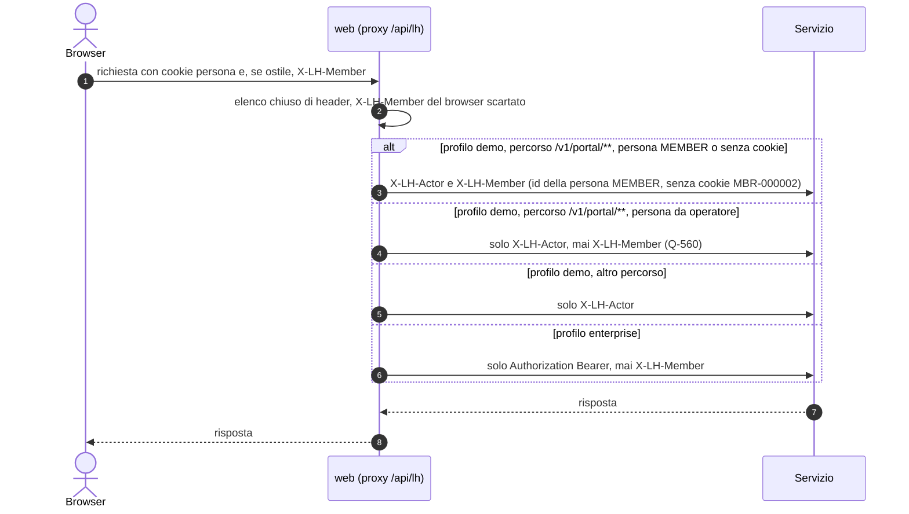
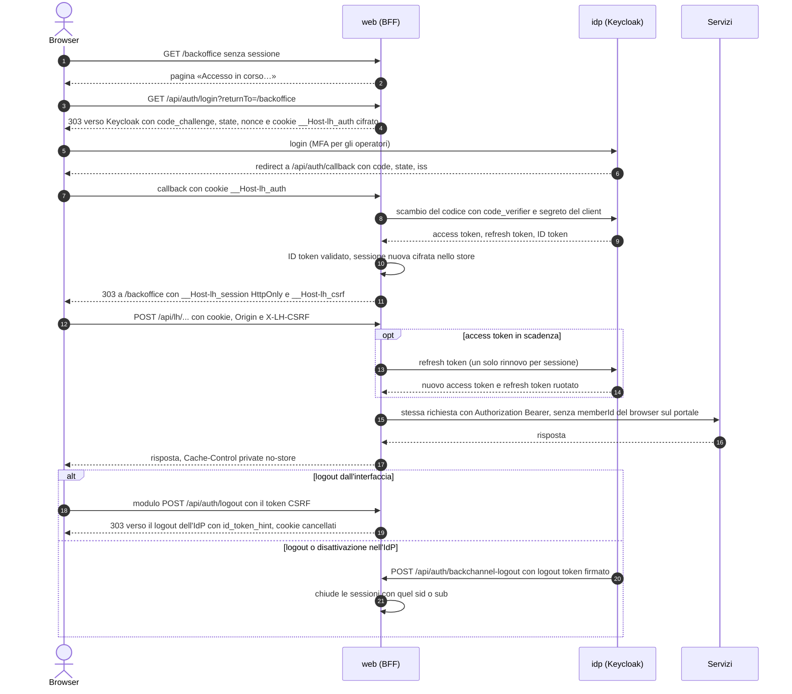
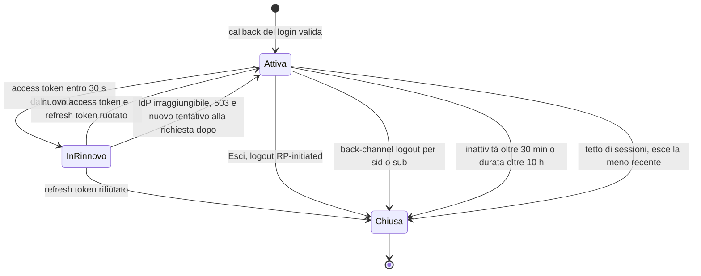

# 07 — Frontend: fondamenta

Vale per tutta l'app `web/`. Le schermate sono in `docs/08` (backoffice) e `docs/09` (portale).

## 1. Stack
| Cosa | Scelta |
|---|---|
| Framework | Next.js (App Router) · React 19 · TypeScript `strict` · `pnpm` |
| Stile | Tailwind CSS v4 con token in `@theme` · shadcn/ui (copiato in `components/ui`) · `lucide-react` |
| Dati | TanStack Query v5 (cache, polling, invalidazioni) · TanStack Table v8 |
| Form | `react-hook-form` + `zod` (gli schemi zod sono anche i tipi delle API) |
| Grafici | Recharts |
| Animazione | CSS + `motion` solo per ruota/gratta e tessera; tutto rispetta `prefers-reduced-motion` |
| Test | Vitest + Testing Library (unità), Playwright (3 percorsi E2E: `docs/12`) |
| Tipi API | scritti a mano in `lib/api/types/<servizio>.ts` (generazione da OpenAPI: P1) |

**Una sola app**, tre aree. `backoffice/` e `portal/` non si importano a vicenda; il codice comune vive in `components/shared` e `lib/`.

## 2. Struttura
```
web/
  app/
    page.tsx                      # HUB-01 Demo Hub
    backoffice/(shell)/…          # layout con sidebar, selettore persona, rail eventi
    portal/(shell)/…              # layout mobile-first con tab bar e tray demo
    api/lh/[service]/[...path]/route.ts   # proxy verso i microservizi
    api/demo/status/route.ts      # stato aggregato
    api/demo/wake/route.ts        # risveglio
  components/{ui,shared,backoffice,portal}/
  lib/
    api/{client.ts, keys.ts, types/*, hooks/*}
    persona/{personas.ts, cookie.ts, permissions.ts}
    realtime/{sse.ts, useLiveEvents.ts, usePendingTrace.ts}
    format/{points.ts, dates.ts}   # Intl it-IT, Europe/Rome
  styles/{tokens.css, backoffice.css, portal.css}
  public/demo/                    # immagini seed
```

## 3. Proxy e accesso ai servizi
- Il browser chiama **sempre** `/api/lh/<service>/v1/...`; il route handler inoltra a `LH_SVC_<SERVICE>_URL` (es. `LH_SVC_WALLET_URL`), copia metodo, query, corpo, e **aggiunge** `X-LH-Actor` leggendo il cookie persona (profilo `demo`) oppure `Authorization: Bearer` dalla sessione del BFF (profilo `enterprise`, §4-bis), `X-Correlation-Id` (nuovo ULID se assente). Dal browser passano solo `content-type` e `idempotency-key` (`lib/api/proxyHeaders.ts`): mai `Authorization`, `X-LH-Actor`, `X-LH-Member` o cookie. **`X-LH-Member` (profilo `demo`, ADR-048, Q-555):** sulle sole API del portale (`/v1/portal/**`) il proxy aggiunge `X-LH-Member: MBR-nnnnnn` col membro della persona: quello della persona `MEMBER` e, **senza cookie** (visitatore anonimo del portale), `MBR-000002` (`lib/persona/demoMember.ts`, lo stesso id che il layout del portale mostra, §4); con una **persona da operatore (`BO`) l'header non c'è mai** (Q-560, ADR-048 punto 6: un operatore non agisce mai come membro). Un id del cookie che non ha la forma `MBR-nnnnnn` non si inoltra: senza header i servizi si comportano come prima. Sugli altri percorsi l'header non c'è, nemmeno nelle chiamate che il proxy fa in proprio (i soprannomi a member-service), e il percorso a valle è validato in **entrambi i profili** (F2-SEC-03, ADR-042, `lib/api/proxyPath.ts`): ogni segmento solo `[A-Za-z0-9._~-]`, mai vuoto, `.` o `..` (Next decodifica `%2F` e `%2e%2e`, `new URL()` normalizza `..`), altrimenti `400 INVALID_PATH` senza chiamare il servizio; identità e `X-LH-Member` si decidono quindi sul percorso esatto che parte. Così BO-17 (`/v1/portal/campaigns?codes=`, `OPTIONAL` in docs/06 §3.4) riceve la vista generica (Q-560, decisa da Giuseppe il 2026-09-29, alternativa A); il portale aperto con una persona BO mostra comunque `MBR-000002` (solo interfaccia) e lavora col `memberId` esplicito, che in `demo` resta valido. Quello scelto dal browser, in qualunque grafia, si scarta sempre. Il `memberId` in query, percorso o corpo resta valido in `demo` e le pagine usano lo stesso id, che viene dalla stessa persona: se un servizio vede due membri diversi risponde `400 MEMBER_MISMATCH` (docs/06 §3.4). Nel profilo `enterprise` l'header non viaggia mai (§4-bis). Eccezione del solo profilo `demo` (Q-492): sull'ingresso delle azioni (`POST /v1/events`, `/v1/events/batch`, `/v1/transactions`), che accetta solo il ruolo `SOURCE`, il proxy presenta `X-LH-Actor: SOURCE:src-<codice>` con la fonte che l'evento dichiara, al posto della persona (`lib/api/demoSource.ts`, usato dal pannello demo del portale); `SOURCE` non è mai una persona del web. `Accept` lo decide il proxy: `application/json`, oppure `text/csv, application/problem+json` per i file `….csv` (vincitori BO-14, rapporto import BO-32). `HEAD` si inoltra come `HEAD`, senza corpo come `GET` e con la stessa richiesta al servizio; al browser arriva il `content-length` del servizio, se il proxy non riscrive il corpo. Le risposte `204`, `205` e `304` del servizio arrivano al browser con lo stesso stato e senza corpo. Timeout 25 s. Niente CORS sui servizi per le chiamate REST.
- Eccezione: **SSE** va diretto a `NEXT_PUBLIC_LH_INSIGHT_URL/v1/stream/events` (le funzioni serverless non reggono connessioni lunghe). Se l'SSE fallisce 3 volte → **polling** di `/v1/events?from=<ultimo>` ogni 3 s, con indicatore "live ridotto".
- `503/502/504` o errore di rete dal proxy → risposta `{type: "SERVICE_ASLEEP", service}`: l'UI mostra lo stato *degraded* (§6) e innesca `wake`.



## 4. Identità simulata (nessuna login)
- Cookie `lh_persona` (JSON, 30 giorni): `{kind: "BO", username, role}` oppure `{kind: "MEMBER", memberId}`. Default: `marta.admin` nel backoffice, `MBR-000002` nel portale. Il **membro attivo** del portale (`lib/persona/demoMember.ts`) è quello della persona `MEMBER`, altrimenti `MBR-000002`: lo usa il layout del portale per mostrare e per le chiavi di cache. Il proxy lo manda ai servizi in `X-LH-Member` sulle API del portale con una persona `MEMBER` e senza cookie, **mai con una persona `BO`**: per un operatore `MBR-000002` è solo interfaccia (un ripiego per non mostrare un portale vuoto), non un'identità (§3, Q-555, Q-560).
- **Selettore persona** sempre visibile: nel backoffice in alto a destra (avatar con iniziali + ruolo in chiaro); nel portale dentro il tray demo (PT-14). Cambiare persona invalida tutta la cache di Query.
- I permessi (`lib/persona/permissions.ts`, matrice in `docs/08 §2`) **nascondono o disabilitano** le azioni; il backend le rifiuta comunque con `403` (`@RequiresRole`). Un'azione disabilitata mostra in tooltip il ruolo richiesto.
- Banner fisso in fondo al Demo Hub: "Ambiente dimostrativo: dati fittizi, nessuna autenticazione".

## 4-bis. Identità reale nel profilo `enterprise`: BFF con sessione lato server (M8.2, ADR-027)
Vale solo con `LH_PROFILE=enterprise`; senza, tutto il §4 resta com'è (la demo ospitata non cambia). Il server Next è il client OIDC **confidential** `web` del realm (`deploy/idp/realm.json`) e fa da *Backend-for-Frontend* (docs/18 §3.2). Codice in `web/lib/auth/`.

- **Configurazione** (variabili in `docs/11 §8`): `LH_OIDC_ISSUER`, `LH_WEB_CLIENT_ID` (predefinito `web`), `LH_WEB_CLIENT_SECRET`, `LH_WEB_URL`, `LH_WEB_SESSION_KEY` (32 byte casuali in base64); i segreti anche da `*_FILE`. Configurazione assente o insicura (segreto corto o segnaposto, chiave non casuale, `http` fuori da `localhost`, `LH_PROFILE` sconosciuto) ⇒ il server **non parte** (`INSECURE_CONFIG`, `instrumentation.ts`) e, se ci arriva comunque, ogni richiesta autenticata risponde `500 INSECURE_CONFIG`: mai un ripiego sul demo (regola 22).
- **Login**: `GET /api/auth/login?returnTo=/percorso` → Authorization Code con PKCE `S256`, `state` e `nonce`; lo stato del login viaggia in un cookie `__Host-lh_auth` cifrato (AES-256-GCM, 10 minuti). `returnTo` è accettato solo come percorso relativo della stessa origine, fuori da `/api` (niente open redirect); altrimenti `/`. `GET /api/auth/callback` verifica `state` e `iss`, scambia il codice, valida l'ID token (firma, `iss`, `aud`, scadenza, `nonce`) e apre una sessione **nuova** (l'eventuale sessione precedente del browser si chiude: niente session fixation). Errori → `/auth/error?reason=expired|denied|rejected|idp_unavailable` con «Riprova».
- **Sessione**: nel browser solo `__Host-lh_session` (id opaco da 256 bit, `HttpOnly`, `Secure`, `SameSite=Lax`, `Path=/`) e `__Host-lh_csrf` (leggibile dal JavaScript, per l'header CSRF). Token (access, refresh, ID) solo lato server, nello store delle sessioni cifrato con una chiave derivata da `LH_WEB_SESSION_KEY` e legato all'id; l'id stesso è conservato come impronta SHA-256. Inattività 30 minuti e durata massima 10 ore (`LH_WEB_SESSION_IDLE_SECONDS`, `LH_WEB_SESSION_MAX_SECONDS`, Q-354); al massimo 10 sessioni per account (esce la sua più vecchia) e `LH_WEB_SESSION_MAX_COUNT` in tutto. Store in memoria per una replica (Q-409), condiviso da route handler e pagine dello stesso processo: la configurazione si riconosce dall'impronta dei valori, non dall'oggetto (Next carica i moduli in più istanze).
- **Rinnovo**: trasparente, 30 s prima della scadenza dell'access token (5 minuti nel realm), con il refresh token a rotazione; **un solo rinnovo per sessione** anche con molte richieste parallele (con la rotazione, due rinnovi in gara farebbero revocare la sessione dall'IdP). Refresh token rifiutato ⇒ sessione chiusa e `401`; IdP irraggiungibile ⇒ `503 IDP_UNAVAILABLE`, la sessione resta.
- **Proxy `/api/lh`**: senza sessione ⇒ `401 {code: "UNAUTHENTICATED"}` e la UI (`app/providers.tsx`) porta al login riportando alla pagina corrente; con sessione ⇒ `Authorization: Bearer <access token>` aggiunto lato server; risposte `Cache-Control: private, no-store`. Il percorso inoltrato è esattamente quello chiesto: ogni segmento solo `[A-Za-z0-9._~-]`, mai vuoto, `.` o `..` (niente `%2F`, `%2e%2e`, `;` di matrice, `\`) ⇒ altrimenti `400 INVALID_PATH`. `X-Correlation-Id` del browser accettato solo se `[A-Za-z0-9-]{1,64}`, altrimenti nuovo ULID (in entrambi i profili). Un account di solo membro chiama solo `/v1/portal/**` (`403 FORBIDDEN_ROLE` altrove). Sulle API del portale **il membro viene solo dal token** (regole 6-bis e 18) e il BFF **rifiuta**, non ripulisce: `memberId` in query (ogni grafia) ⇒ `400 MEMBER_FROM_TOKEN`; corpo non vuoto solo `application/json` (`415` per form, multipart e altro) e un solo oggetto JSON (`400 INVALID_BODY` con testo in coda, array, JSON non valido); `memberId` a qualunque livello del corpo ⇒ `400 MEMBER_FROM_TOKEN`; `memberId` nel percorso (`/v1/portal/wallets/{id}`, `/v1/portal/members/{id}`) ⇒ `403 MEMBER_FROM_TOKEN`. `X-LH-Member` non esiste in questo profilo (ADR-048, Q-555): il proxy non lo manda mai, con nessun token, e quello del browser si scarta come ogni header fuori elenco; su un `@MemberEndpoint`, o con un token di solo membro, un servizio che lo ricevesse risponderebbe `400 MEMBER_FROM_TOKEN` (docs/06 §3.4), e resta il rifiuto di `memberId` fatto qui. **Il portale enterprise non va esposto finché M8.10 non lega il membro al token nei servizi** (Q-410): questi controlli sono difesa in profondità, non il controllo di proprietà.
- **CSRF**: su ogni richiesta che cambia stato (`POST`, `PUT`, `PATCH`, `DELETE`) verso `/api/lh` e `/api/auth/logout`: `Sec-Fetch-Site` (se presente) = `same-origin`, `Origin` = origine di `LH_WEB_URL`, token = HMAC dell'id di sessione, nell'header `X-LH-CSRF` (lo aggiunge `lhFetch` dal cookie `__Host-lh_csrf`) o, per il logout, nel campo `csrf` del modulo. Errore ⇒ `403 CSRF_REJECTED` (logout: 303 verso `/auth/error?reason=logout_failed`).
- **Logout**: «Esci» nella barra del backoffice e del portale è un modulo inviato a pagina intera a `POST /api/auth/logout`: il BFF chiude la sessione e risponde `303` verso il logout dell'IdP con `id_token_hint` (RP-initiated logout). L'ID token va dal server all'IdP nell'header `Location` e non passa mai dal JavaScript (regola 20). **Back-channel logout**: l'IdP chiama `POST /api/auth/backchannel-logout` con un logout token firmato (verificati firma dal JWKS, `iss`, `aud=web`, `iat` recente, `exp`, `jti` non già visto, evento di back-channel logout, niente `nonce`); il BFF chiude le sessioni con quel `sid` o, senza `sid`, tutte quelle del `sub` (deprovisioning, docs/18 §3.15). Token non valido o già usato ⇒ `400`; JWKS dell'IdP non scaricabile ⇒ `503` (l'IdP può riprovare).
- **UI**: backoffice e portale senza sessione mostrano «Accesso in corso…» e vanno al login; un account del tipo sbagliato (membro nel backoffice, operatore nel portale) vede «Accesso non consentito» con «Esci». Nome e ruolo mostrati vengono dai claim (`preferred_username`, `name`, `lh_roles` con la regola di Q-365); selettore persona, tray demo del portale e `POST /api/persona` non esistono.





## 5. Direzione visiva
Due caratteri distinti, stessa famiglia tipografica di base. Evitare: gradienti viola generici, card tutte uguali con ombra, eyebrow in maiuscolo ovunque, Inter di default, palette crema/terracotta.

### 5.1 Tipografia
| Ruolo | Font | Uso |
|---|---|---|
| UI | **Hanken Grotesk** (400/500/600/700) | tutto il backoffice, testi del portale |
| Display | **Bricolage Grotesque** (600/800) | solo portale: saldo, titoli hero, nome tier |
| Mono | **JetBrains Mono** | ID, codici, payload JSON, `correlationId` |
Caricati con `next/font`. Numeri in `tabular-nums` ovunque ci siano importi.

### 5.2 Backoffice — "sala controllo"
| Token | Valore |
|---|---|
| `--bo-bg` | `#F4F6F8` · superfici `#FFFFFF` · bordo `#DCE1E7` |
| `--bo-ink` | `#0F1B2D` · secondario `#51607A` |
| `--bo-accent` | `#0B7A75` (teal) |
| Sidebar | `#0F1B2D` con testo `#C9D3E0`, voce attiva con barra teal a sinistra |
| Topic | actions `#1D4ED8` · effects `#6D28D9` · facts `#0B7A75` · audit `#64748B` · dlq `#BE123C` |
| Semantica punti | earn `#15803D` · spend `#B45309` · expire `#B91C1C` · STS `#6D28D9` |
- **Bordi, non ombre**; raggio 6 px; densità alta (righe tabella 40 px); titoli pagina 20 px/600.
- **Elemento firma: il rail eventi live** — colonna destra richiudibile (320 px) presente in tutto il backoffice: ogni evento è una riga con pallino del colore del topic, tipo breve, membro, ora; clic → tracciato (BO-25). In pausa al passaggio del mouse. È ciò che rende visibile l'architettura a eventi.
- Stati oggetto come *pill* con punto colorato: `DRAFT` grigio, `IN_REVIEW` ambra, `APPROVED` blu, `SCHEDULED` indaco, `LIVE` verde, `PAUSED` arancio, `ENDED` slate, `REJECTED` rosso, `ARCHIVED` grigio chiaro.

### 5.3 Portale — tema "Aurora" (sostituibile a runtime)
| Token | Default | Fonte |
|---|---|---|
| `--pt-night` | `#0E1B2C` | `theme.colors.night` |
| `--pt-primary` | `#1FB98F` | `theme.colors.primary` |
| `--pt-secondary` | `#7A5CFA` | `theme.colors.secondary` |
| `--pt-coin` | `#FFB547` | `theme.colors.coin` |
| `--pt-bg` | `#F3F7F9` | `theme.colors.bg` |
Il layout del portale legge `GET /portal/theme` e imposta le variabili CSS sull'elemento radice; fallback ai default se il servizio dorme.
- **Elemento firma: la tessera membro** — in cima a PT-01: fondo `night` con sfumatura aurorale (primary→secondary, 12 % opacità), **bordo inferiore perforato** (maschera radiale ripetuta), nome, numero tessera in mono, saldo in display 44 px, e una fascia col **materiale del tier**: BASE carta opaca, SILVER spazzolato chiaro, GOLD gradiente caldo, PLATINUM iridescente leggero (`conic-gradient`). Al tier-up la tessera si capovolge (rotazione Y 600 ms) e mostra il nuovo materiale.
- Raggio 16 px, ombre morbide solo su elementi sollevati (tessera, fogli modali), bersagli tocco ≥ 44 px, tab bar fissa con 5 voci.
- Saldo con **count-up** 600 ms al cambio; coriandoli solo per vincita e tier-up (disattivati con `prefers-reduced-motion`).

## 6. Stati di interfaccia (obbligatori per ogni vista con dati)
| Stato | Comportamento |
|---|---|
| **Loading** | skeleton della forma finale (mai spinner a pagina intera); tabelle: 8 righe scheletro |
| **Empty** | icona tenue + frase che spiega *perché* è vuoto + azione primaria (es. "Nessuna campagna in bozza. Crea la prima") |
| **Error** | riquadro in linea con `title` del problema RFC 9457, `detail`, `correlationId` copiabile, "Riprova" |
| **Degraded** (`SERVICE_ASLEEP`) | riquadro ambra: "Il servizio *wallet* si sta svegliando…" con barra indeterminata; riprova automatica ogni 5 s fino a 90 s; il resto della pagina resta usabile |
| **Forbidden** | azione disabilitata + tooltip "Richiede ruolo LEGAL"; pagina intera vietata → schermata con invito a cambiare persona |
| **Validation** | errori di campo dal backend (`errors[]` del problema) mappati sui campi del form |
| **Stale** | dato più vecchio di 60 s con SSE assente → etichetta "aggiornato alle 10:42" + ricarica |

## 7. Asincronia visibile: "in elaborazione"
Le scritture che producono eventi rispondono `202` con `correlationId`. Schema unico (`usePendingTrace(correlationId)`):
1. l'UI mostra subito una riga/segnaposto **"in elaborazione"** (pulsazione tenue);
2. ascolta l'SSE filtrato per `correlationId` (fallback: polling di `/insight/v1/traces/{id}` ogni 2 s);
3. all'arrivo del fatto atteso (es. `wallet.points.earned`, `reward.redemption.fulfilled`) invalida le query interessate e sostituisce il segnaposto col dato reale, con evidenziazione 1,5 s;
4. **timeout 20 s** → "Ci sta mettendo più del solito" + collegamento al tracciato; voce DLQ sullo stesso `correlationId` → errore con causa.
Mappa *azione UI → fatto atteso → query da invalidare* in `lib/realtime/expectations.ts`.
Nessun aggiornamento ottimistico dei saldi: il saldo cambia solo quando lo dice il wallet.

## 8. HUB-01 — Demo Hub (`/`)
Scopo: accendere la demo, capire lo stato, scegliere da dove entrare.
- **Intestazione**: nome progetto, una riga di pitch, link al repo.
- **Pannello stato** (elemento centrale): griglia di 10 tessere — 8 servizi + Kafka + Postgres — ciascuna `SLEEPING` (grigio) / `WAKING` (ambra pulsante) / `UP` (verde) / `DOWN` (rosso), con tempo di risposta. Sotto: barra "pronti 6/10" e tempo trascorso.
- **Pulsante "Accendi la demo"** → `POST /api/demo/wake` (lancia in parallelo `GET <svc>/actuator/health/liveness` verso tutti, senza attendere), poi polling di `/api/demo/status` ogni 3 s. Testo di attesa onesto: "Il primo avvio richiede 1–3 minuti: i servizi gratuiti si addormentano quando nessuno li usa". Kafka `DOWN` per più di 2 min → riquadro "Il cluster Kafka gratuito potrebbe essere stato spento per inattività: va riacceso dalla console del fornitore" con link a `docs/11 §3`.
- **Due ingressi** (attivi da 4/10 pronti con ingestion, member, campaign, wallet `UP`): *Backoffice* con scelta della persona (5 schede: nome, ruolo, cosa può fare) e *Portale* con scelta del membro (12 schede: nome, tier, saldo, "storia" in una riga).
- **Percorso consigliato**: 5 passi numerati (è una sequenza reale) che collegano a BO-29 scenari, BO-24 live, PT-01, BO-06, BO-30.
- `/api/demo/status` → `{services[] {name, state, latencyMs, version?}, kafka: {state}, db: {state}, readyCount, checkedAt}`; Kafka e DB si ricavano da `ingestion /actuator/health` (componenti `kafka`, `db`). Cache 2 s.
- **Keep-alive gentile** (F-DEMO-07): hook `useKeepAlive` montato nei layout — ogni 4 min chiama `/api/demo/wake` **solo se** `document.visibilityState === "visible"`; si ferma dopo 45 min senza interazione. Nessun pinger esterno, mai.

## 9. Convenzioni di codice
- Hook dati per risorsa: `useMembers(filters)`, `useMember(id)`, `useAdjustPoints()`; chiavi in `lib/api/keys.ts`; `staleTime` 15 s (liste), 5 s (saldi), 60 s (configurazioni).
- URL come stato: filtri, pagina, ordinamento e scheda attiva stanno nella query string (link condivisibili durante la demo).
- Formati: punti `1.850`, valute `€ 129,90`, date `18 set 2026, 10:42`, relative "3 min fa" sotto le 24 h.
- Testi UI in **italiano**, in `lib/i18n/it.ts` (un solo dizionario, pronto a diventare multilingua).
- Accessibilità: ogni controllo ha etichetta; focus visibile (anello 2 px accent); tabelle con `scope`; grafici con tabella alternativa; ruota/gratta hanno sempre un pulsante "Gioca" equivalente.
- Ogni schermata dichiara in testa al file: ID (`BO-nn`/`PT-nn`), feature coperte, servizi chiamati.
