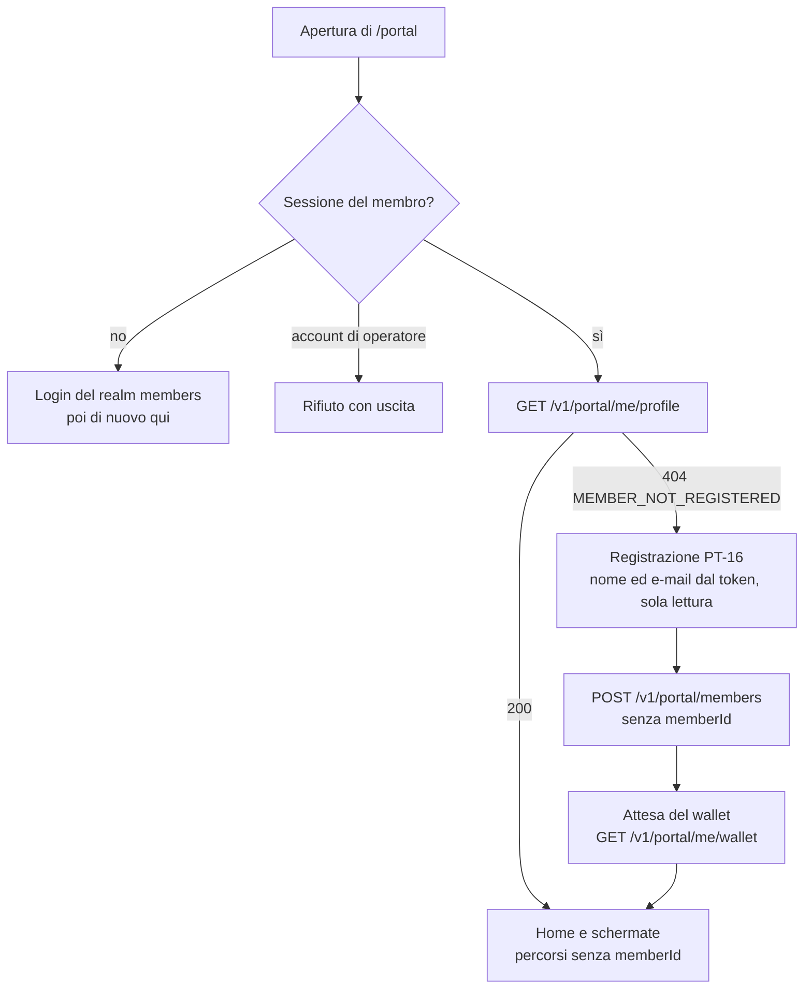

# 09 — Frontend: portale del membro

Area `/portal` dell'app `web/`. Fondamenta: `docs/07` (tema "Aurora", tessera membro, stati, asincronia). Qui: shell, regole trasversali e le schermate `PT-01…PT-14`. Il portale è **ciò che il cliente finale vedrebbe**: niente gergo tecnico, niente ID di sistema, niente stati interni. Tutto ciò che mostra (card, pop-up, premi, concorsi, testi, colori) è **configurato dal backoffice**.

Notazione endpoint come in `docs/08`. Nel profilo `demo` ogni chiamata porta il `memberId` della persona attiva (`docs/07 §4`). Nel profilo `enterprise` (M8.14 V9b, F2-SEC-09, ADR-048, ADR-051) **il membro viene solo dal token** della sessione del BFF: nessuna schermata scrive un `memberId` né nel percorso, né in query, né nel corpo (§2-bis).

## 1. Shell

```
┌────────────────────────────┐   ≥ 900 px: colonna centrale max 1080 px,
│ Logo programma      🔔 (3) │   la tab bar diventa barra di navigazione
├────────────────────────────┤   in alto, PT-01 passa a due colonne
│                            │   (tessera fissa a sinistra).
│        contenuto           │
│                            │
│                     [Demo] │ ← pulsante flottante del tray PT-14
├────────────────────────────┤
│ Home Guadagna Premi Gioca Io│ ← tab bar fissa, 5 voci, bersagli ≥ 44 px
└────────────────────────────┘
```
- **Tab bar**: Home (PT-01) · Guadagna (PT-02) · Premi (PT-03) · Gioca (PT-05) · Io (PT-08). Pallino su *Gioca* se c'è una giocata disponibile; su *Io* se il profilo è incompleto.
- **Campanella**: contatore non letti (`engagement GET /v1/portal/inbox/unread-count`, ogni 30 s e a ogni fatto ricevuto) → PT-12.
- **Tema**: il layout legge `engagement GET /v1/portal/theme` e imposta le variabili CSS; nome e logo del programma vengono da lì.
- **Pop-up**: all'ingresso in PT-01 (al più **uno per visita**) `GET /v1/portal/popups/next`; alla chiusura `POST …/seen {dismissed}`.

| ID | Schermata | Route (`/portal…`) | Accesso | M |
|---|---|---|---|---|
| PT-01 | Home | `/` | tab | M1 (contenuti M6) |
| PT-02 | Guadagna | `/earn` | tab | M1 |
| PT-03 | Catalogo premi | `/rewards` | tab | M4 |
| PT-04 | Dettaglio premio e richiesta | `/rewards/[code]` | da PT-03 | M4 |
| PT-05 | Gioca | `/play` | tab | M5 |
| PT-06 | Giocata instant win | `/play/[code]` | da PT-05, card | M5 |
| PT-07 | Attività | `/activity` | da PT-01 | M1 |
| PT-08 | Profilo e livello | `/profile`, `/join` | tab | M3 (registrazione M5) |
| PT-09 | Obiettivi e badge | `/achievements` | da PT-01, PT-08 | M5 |
| PT-10 | Classifica | `/leaderboard` | da PT-05 | M5 |
| PT-11 | Porta un amico | `/invite` | da PT-02, PT-08 | M5 |
| PT-12 | Notifiche | `/inbox` | campanella | M6 |
| PT-13 | I miei premi e coupon | `/my-rewards` | da PT-03, PT-08 | M4 |
| PT-14 | Pannello demo | tray | pulsante flottante | M1 |

Una voce non ancora realizzata non compare (stessa regola del backoffice).

## 2. Regole trasversali

- **Linguaggio**: "punti" (PTS) e "punti status" (STS) coi nomi del tema; mai `PTS/STS`, codici campagna, `correlationId`. Date relative ("oggi", "ieri", "3 giorni fa"), poi estese.
- **Il saldo non mente**: cambia solo quando arriva il fatto del wallet (`docs/07 §7`). Nel frattempo compare una riga "in arrivo…" in PT-01/PT-07. All'arrivo: count-up 600 ms e, se c'è un cambio tier, capovolgimento della tessera.
- **Realtime**: `useLiveEvents({memberId})` filtra l'SSE sul membro attivo; ogni fatto invalida le query interessate (mappa in `lib/realtime/expectations.ts`). Senza SSE: polling 5 s solo mentre c'è qualcosa in elaborazione.
- **Membro non attivo**: `BLOCKED`/`INACTIVE` → banda in alto "Il tuo profilo è sospeso: puoi consultare ma non accumulare o richiedere premi"; pulsanti d'azione disabilitati. `ANONYMIZED` non è selezionabile come persona.
- **Servizio che dorme**: ogni sezione degrada da sola con un riquadro gentile ("Stiamo recuperando i tuoi premi…"); la tessera usa l'ultimo saldo noto con l'etichetta "aggiornato alle 10:42".
- **Vuoti utili**: ogni stato vuoto invita a un'azione (es. "Nessun movimento ancora. Scopri come guadagnare punti").
- **Movimento**: coriandoli solo per vincita e salita di livello; tutto disattivato con `prefers-reduced-motion` (rivelazione diretta).
- **Componenti condivisi col backoffice**: `ContentCard`, `PopupModal`, `WinCard`, `MemberCard` (tessera) vivono in `components/shared/content` così l'anteprima di BO-18/BO-20 è fedele.

## 2-bis. Portale dal token (profilo `enterprise`, M8.14 V9b)

Le schermate non cambiano: cambia come dicono «chi sono» ai servizi. Un solo punto, `lib/portal/memberApi.ts` (`portalApi`, letto con `usePortalApi()`), restituisce percorsi, parametri di query e corpi per i due profili; nessuna schermata scrive un `memberId` a mano. In `demo` i percorsi sono quelli di sempre (persona del cookie, `memberId` esplicito). In `enterprise`:

| Vista | `demo` | `enterprise` (membro dal token) |
|---|---|---|
| Identità del membro (id solo per mostrare, mai rinviato) | cookie `lh_persona` | `GET /v1/portal/me/profile` |
| Saldo, livello (PT-01, PT-03, PT-04, PT-08) | `GET /v1/portal/wallets/{id}` | `GET /v1/portal/me/wallet` |
| Movimenti (PT-01, PT-07) | `GET /v1/portal/wallets/{id}/activity` | `GET /v1/portal/me/wallet/activity` |
| Nome e stato per tessera e saluto | `GET /v1/members/{id}` | `GET /v1/portal/me/profile` |
| Profilo (PT-08) e modifica | `GET`/`PATCH /v1/portal/members/{id}` | `GET`/`PATCH /v1/portal/me/profile` |
| Codice amico e invitati (PT-11) | `GET /v1/portal/members/{id}/referral` | `GET /v1/portal/me/referral` |
| Campagne, contenuti, catalogo, premio, concorsi, giocate, classifiche, traguardi, badge, coupon, richieste premio, notifiche, pop-up | stessi percorsi `/v1/portal/**` con `memberId` in query o nel corpo | gli stessi percorsi **senza** `memberId` |
| Annullamento di una richiesta premio (PT-13) | `POST /v1/portal/redemptions/{id}/cancel?memberId=` | `POST /v1/portal/redemptions/{id}/cancel` |
| Categorie premio (PT-03, PT-04) | `GET /v1/reward-categories` | `GET /v1/portal/reward-categories` (la variante del backoffice è del realm operatori) |
| Edizioni per l'avviso di mantenimento (PT-01) | `GET /v1/editions` | `GET /v1/portal/editions` |

- **Ingresso** (`EnterpriseMemberGate`, nel layout del portale): senza sessione del membro il layout porta al login del realm dei membri (`/api/auth/login?returnTo=/portal…`, il portale è sempre del realm `members`); un account di operatore vede «Il portale è riservato ai membri». Con la sessione, il portale chiede `GET /v1/portal/me/profile`: *loading* («Sto aprendo il tuo portale…»), *degraded* se member-service dorme (riprova ogni 5 s), *error* con «Riprova», e `404 MEMBER_NOT_REGISTERED` → `/portal/join` (PT-16). Un membro già registrato che apre `/portal/join` va alla Home.


- **Senza membro** (solo la pagina di registrazione) shell e campanella non chiamano nessun servizio e la tab bar non compare.
- **Tempo reale**: l'`EventSource` di `insight` non ha un token (il proxy SSE del BFF è rinviato, BO-24, Q-622): in `enterprise` l'attesa «in arrivo…» usa solo il polling del wallet ogni 5 s.
- **Tema**: il layout legge `GET /v1/portal/theme` lato server senza token; in `enterprise` può rispondere `401` e allora vale il tema Aurora (stato *degraded* innocuo). Con V9b la parte web di Q-410 è chiusa: nessun percorso del web invia un `memberId` in `enterprise` (verificato dai test del portale intero).
- **Subito dopo la registrazione** i servizi rispondono `409 MEMBER_NOT_LINKED` (`Retry-After: 2`, Q-553) finché non hanno consumato `member.registered`: la regola di nuovo tentativo di TanStack Query (`lib/api/retry.ts`) lo riprova ogni 2 s fino a 5 volte. Un aggiornamento in secondo piano fallito di `GET /v1/portal/me/profile` (per esempio dopo il salvataggio del profilo) non sostituisce il portale con un riquadro d'errore: gli stati *degraded* ed *error* dell'ingresso compaiono solo senza un dato già noto.
- **Classifica** (PT-10): senza `memberId` il BFF non può evidenziare la riga del membro né, con un token di solo membro, risolvere i soprannomi (`Giocatore <posizione>`, stato *degraded*; SPEC-GAP: Q-411). Resta la riga «la tua posizione» che il servizio calcola dal token.

## 3. Schermate

### PT-01 — Home
- **Scopo**: "quanto ho, a che punto sono, cosa posso fare adesso". Feature `F-WAL-01`, `F-TIER-02`, `F-WAL-06`, `F-CNT-01/02`.
- **Dati**: `wallet GET /v1/portal/wallets/{id}` · `engagement GET /v1/portal/content?placement=HOME_HERO|HOME_GRID` · `gamification GET /v1/portal/contests`, `/v1/portal/achievements` · `wallet GET /v1/portal/wallets/{id}/activity?size=3`.
- **Layout** (dall'alto): saluto col nome · **tessera membro** (`docs/07 §5.3`): nome, numero tessera, saldo punti in display, materiale del tier · **barra verso il prossimo livello** con testo "Ti mancano 120 punti status per GOLD" (al livello massimo: "Hai raggiunto il livello più alto"); se `keepWarning`: "Per mantenere GOLD servono ancora 2.350 punti status entro il 31 dic" · **avviso scadenza** (solo se `expiringSoon.amount > 0`): "1.900 punti scadono il 31 ott — usali" → PT-03 · **card hero** (una, da `HOME_HERO`) · riga **azioni rapide**: *Gioca* (con numero di giocate), *Premi*, *Porta un amico* · **griglia card** (`HOME_GRID`, 2 colonne) · **obiettivo più vicino** (barra col progresso più alto non completato) → PT-09 · **ultimi 3 movimenti** → PT-07.
- **Note**: tocco sulla tessera → PT-08. La CTA di una card porta alla destinazione configurata (concorso, premio, campagna → PT-02 con ancora, pagina, URL).

### PT-02 — Guadagna
- **Scopo**: rendere leggibili le campagne attive. Feature `F-CMP-11`.
- **Dati**: `campaign GET /v1/portal/campaigns?memberId=`.
- **Layout**: elenco di schede: icona, nome per il membro, descrizione, **riepilogo premio** ("+300 punti", "×2 nel weekend", "1 giocata"), progresso sui limiti ("2 di 5 questo mese", barra), scadenza ("fino a domenica"). In cima le campagne **a tempo**; in fondo quelle già completate ("Fatto ✓", attenuate). Sezione finale "Porta un amico" → PT-11.
- **Note**: le campagne moltiplicatore hanno un trattamento distinto (fascia colorata `coin`). Nessuna azione reale parte da qui: per provarle c'è il tray demo (PT-14), richiamato da un link discreto "Prova questa azione (demo)".

### PT-03 — Catalogo premi
- **Scopo**: far vedere cosa è raggiungibile. Feature `F-RWD-01…04`.
- **Dati**: `reward GET /v1/portal/catalog?memberId=` · `wallet GET /v1/portal/wallets/{id}` · `engagement GET /v1/portal/content?placement=CATALOG_TOP`.
- **Layout**: intestazione fissa col saldo · banner `CATALOG_TOP` · **fasce come sezioni** in ordine di soglia: titolo "Fascia 1.500 punti" + stato rispetto al saldo — *raggiunta* (segno di spunta, sezione piena) oppure *"ti mancano 350 punti"* (barra, sezione attenuata ma navigabile). Dentro ogni fascia: griglia 2 colonne di premi (immagine, nome, categoria). Filtro per categoria a chip; interruttore "Solo quelli che posso richiedere".
- **Stati del premio**: `LOW` → "Ultimi pezzi" · `SOLD_OUT` → attenuato "Esaurito" · `lockedByTier` → lucchetto "Riservato a GOLD" · `perMemberLimitReached` → "Già richiesto".
- Collegamento in alto a destra: *I miei premi* → PT-13.

### PT-04 — Dettaglio premio e richiesta
- **Dati**: `reward GET /v1/portal/rewards/{code}?memberId=`, `POST /v1/portal/redemptions`, `GET /v1/portal/redemptions/{id}`.
- **Layout**: immagine grande, nome, categoria, costo in punti, descrizione, termini (pieghevole), disponibilità. Barra d'azione fissa in basso: **"Richiedi per 1.500 punti"**, oppure motivo del blocco ("Ti mancano 350 punti", "Riservato a GOLD", "Esaurito").
- **Flusso di richiesta** (`F-RWD-05`): 1) foglio di conferma col **saldo prima → dopo**; per i premi fisici form spedizione (nome, indirizzo, CAP, città) — 2) `POST` → `202` → schermata d'attesa "Stiamo confermando la tua richiesta…" (la saga passa dal wallet) — 3a) `CONFIRMED`/`FULFILLED` → esito positivo: per i coupon il **codice in grande** con copia e scadenza, per i fisici "Ti avviseremo alla spedizione"; saldo aggiornato con count-up — 3b) `REJECTED` → "Punti non sufficienti" (o causa), nessun addebito — timeout 20 s → "Ci stiamo mettendo più del solito: troverai l'esito in *I miei premi*".
- Errori immediati (`422`) mostrati nel foglio: esaurito, limite raggiunto, livello non idoneo, spedizione mancante.

### PT-05 — Gioca
- **Dati**: `gamification GET /v1/portal/contests?memberId=` · `engagement GET /v1/portal/content?placement=CONTEST`.
- **Layout**: per ogni concorso `LIVE` una scheda grande: nome, immagine/card collegata, "termina tra 12 giorni", **giocate disponibili** (numero in evidenza) e stato della giocata gratuita ("Giocata di oggi disponibile" / "Torna domani"), vetrina dei premi in palio (senza quantità), **Gioca ora** → PT-06. Sotto: "Come ottenere altre giocate" (collegamento a PT-02) e ingresso alla **Classifica** (PT-10). Nessun concorso attivo → stato vuoto con rimando a PT-02.

### PT-06 — Giocata instant win
- **Scopo**: il momento più spettacolare della demo. Feature `F-IW-04`, `F-CNT-03`.
- **Dati**: `gamification POST /v1/portal/contests/{code}/play` (risposta **sincrona** con l'esito) · `engagement GET /v1/portal/content?placement=WIN&prizeCode=` · storico `GET …/plays`.
- **Meccaniche** (l'esito lo decide sempre il server; l'animazione lo **rivela**):
  - `WHEEL` — ruota con uno spicchio per premio (colore da `wheelColor`) alternato a spicchi "Ritenta"; al tocco di *Gira* parte la richiesta, la ruota accelera e **si ferma sullo spicchio dell'esito** (4 s, decelerazione morbida);
  - `SCRATCH` — superficie da grattare (canvas) che scopre l'esito; al 55 % scoperto si rivela tutto;
  - `GIFT` — tre pacchi: qualunque si scelga contiene l'esito.
  Sempre presente un pulsante **"Gioca"** equivalente (tastiera, lettori di schermo, `prefers-reduced-motion` → rivelazione diretta).
- **Esito `WIN`**: coriandoli + `WinCard` configurata in BO-18 per quel premio (fallback generico). Premio in punti → "I punti stanno arrivando…" finché non giunge `wallet.points.earned` (la vincita rientra come azione interna: `docs/04`). Premio coupon → collegamento a PT-13 quando il coupon è emesso. Premio fisico → "Ti contatteremo per la consegna".
- **Esito `LOSE`**: messaggio leggero "Non è andata: riprova domani" + giocate rimaste; se > 0, *Gioca ancora*.
- Errori: `NO_PLAYS_AVAILABLE` → invito a PT-02; `DAILY_LIMIT_REACHED`; `CONTEST_NOT_LIVE`.
- In fondo: "Le tue giocate" (ultime 10 con esito) e collegamento al regolamento.

### PT-07 — Attività
- **Dati**: `wallet GET /v1/portal/wallets/{id}/activity` (paginazione a scorrimento).
- **Layout**: elenco per giorno. Riga: icona, **titolo leggibile** ("Acquisto online", "Bolletta digitale attivata", "Premio richiesto: Buono cinema"), sottotitolo (campagna in parole, "Doppio weekend ×2"), quantità con segno e colore (guadagno verde, spesa ambra, scadenza rossa, status viola). Tocco → dettaglio: **scomposizione** ("130 punti base × 1,25 livello SILVER = 162"), data di scadenza del lotto, stato *in attesa* con data di rilascio.
- Filtri a chip: tutti · guadagnati · spesi · scaduti · punti status. In testa, le righe **"in arrivo…"** delle azioni in elaborazione. Riquadro "In scadenza": prossime scadenze per mese.

### PT-08 — Profilo e livello
- **Dati**: `member GET/PATCH /v1/portal/members/{id}` · `wallet GET /v1/portal/wallets/{id}` · `wallet GET /v1/portal/tiers` (scala, vantaggi, soglie).
- **Layout**: tessera grande · sezione **Il tuo livello**: scala dei 4 livelli col materiale, livello attuale evidenziato, vantaggi per livello, moltiplicatore ("Guadagni ×1,25 punti"), punti status dell'edizione, regola di permanenza spiegata in una frase ("A fine anno puoi scendere al massimo di un livello") · sezione **I tuoi dati**: nome, e-mail, telefono, data di nascita, città, consensi; **indicatore di completezza** con i campi mancanti e il premio previsto ("Completa il profilo: +150 punti") — al salvataggio dell'ultimo campo parte `member.profile.completed` · collegamenti: obiettivi (PT-09), i miei premi (PT-13), porta un amico (PT-11), notifiche (PT-12).
- **Registrazione** (`/portal/join`, `F-MBR-06`; profilo `demo`): form minimo — nome, cognome, e-mail, codice amico opzionale (precompilato da `?ref=`), consenso. Invio → `member POST /v1/members` → il nuovo membro diventa la persona attiva → PT-01 con pop-up di benvenuto e "+100 punti in arrivo…". Codice amico non valido → errore sul campo.
- **Registrazione da zero in `enterprise`** (PT-16, F2-SEC-09, ADR-048, ADR-051, Q-673; la schermata di Laura): l'account esiste nel realm dei membri ma `GET /v1/portal/me/profile` risponde `404 MEMBER_NOT_REGISTERED`, e il portale porta a `/portal/join`. Titolo «Ciao <Nome>, completa l'iscrizione»; **nome e cognome** ed **e-mail** vengono dall'ID token (claim `given_name`, `family_name`, `email`, altrimenti `name`, letti lato server dal BFF: al browser arrivano solo questi tre valori, mai i token, regola 20) e sono **in sola lettura nell'interfaccia**: nessun campo per scegliere un altro membro. Il servizio però accetta il corpo così com'è (non confronta nome ed e-mail con i claim del token): rischio accettato con Q-557, l'e-mail non è verificata. Si compilano solo il codice amico (facoltativo, da `?ref=`), il consenso a regolamento e informativa (**obbligatorio**) e il marketing (facoltativo). Invio → `member POST /v1/portal/members` con `{firstName, lastName, email, referralCode?, consents}` (senza `memberId`, canale né stato: il membro nasce dal `sub` del token, idempotente) → «Benvenuta, <Nome>» con «Stiamo preparando il tuo saldo…» finché `GET /v1/portal/me/wallet` risponde (al più 20 s; una sessione scaduta, `401`, ferma l'attesa e porta al login) → PT-01 con «+100 punti in arrivo…»; se il saldo non arriva entro 20 s la Home si apre comunque (`/portal?welcome=1&pending=1`) con la nota «Il saldo arriva a breve». Stati: *loading* (ingresso), *error* (codice amico non valido sul campo, rifiuto del servizio in un riquadro in testa), *degraded* (token senza nome o e-mail: «Non disponibile…» e invio spento). SPEC-GAP: Q-557.

### PT-09 — Obiettivi e badge
- **Dati**: `gamification GET /v1/portal/achievements`, `/v1/portal/badges`.
- **Layout**: due sezioni. **Obiettivi**: schede con icona, nome, descrizione, barra `value/target`, periodo ("questo mese"), premio collegato; completati con segno di spunta e data; le **serie** (`STREAK`) mostrano i giorni come pallini. **Badge**: griglia — ottenuti a colori con data, da ottenere in grigio con indicazione di come sbloccarli. Al completamento in tempo reale: la scheda pulsa e compare un toast "Badge sbloccato".

### PT-10 — Classifica
- **Dati**: `gamification GET /v1/portal/leaderboards`, `/v1/portal/leaderboards/{code}`.
- **Layout**: selettore classifica (mese / edizione) · podio dei primi 3 · elenco top N con nickname, punteggio · **riga del membro sempre visibile** (fissata in basso se fuori dalla top N: "Sei 14°"). Solo nickname, mai nomi reali.
- **Soprannomi (Fase 2, Q-368)**: il proxy `/api/lh` chiede a gamification la variante `resolve=ids`, inserisce lato server i soprannomi di member-service e al browser restituisce solo `{rank, nickname, score, isMe}` (`isMe` calcolato dal membro che chiede): mai i `memberId` degli altri membri. Se member-service non risponde la classifica resta visibile con `Giocatore <rank>` al posto del soprannome; stati *loading/empty/error/degraded* invariati.

### PT-11 — Porta un amico
- **Dati**: `member GET /v1/portal/members/{id}/referral`.
- **Layout**: spiegazione in 3 passi (invita → l'amico si iscrive → al suo primo acquisto premio per entrambi) coi valori reali delle campagne · **codice amico** in grande con *Copia* e *Condividi* (Web Share API; fallback copia del link `/portal/join?ref=<code>`) · elenco invitati con stato (*iscritto*, *premio ottenuto*) · contatore "3 di 10 inviti premiati in questa edizione".

### PT-12 — Notifiche
- **Dati**: `engagement GET /v1/portal/inbox`, `POST …/read`, `…/read-all`.
- **Layout**: elenco cronologico: icona per categoria (punti, livello, premio, vincita, scadenza, benvenuto), titolo, testo, quando; non letti con pallino e fondo leggero. Tocco → segna letto e segue il link (premio, attività, gioco). *Segna tutte come lette*. Arrivo in tempo reale: nuova riga in cima + incremento della campanella.

### PT-13 — I miei premi e coupon
- **Dati**: `reward GET /v1/portal/redemptions?memberId=`, `/v1/portal/coupons?memberId=`, `POST /v1/portal/redemptions/{id}/cancel`.
- **Layout**: due schede. **Richieste**: premio, data, punti, stato in parole (*in conferma*, *confermata*, *spedita*, *annullata — punti restituiti*, *non andata a buon fine*), linea di avanzamento per i fisici; *Annulla* solo se ancora in conferma. **Coupon**: schede "biglietto" con codice in mono grande, *Copia*, scadenza, origine ("da premio" / "vinto a Ruota d'Autunno"), stato (*attivo*, *usato*, *scaduto*); i non attivi in fondo, attenuati.

### PT-14 — Pannello demo (tray)
- **Scopo**: far accadere le cose restando nel portale; è l'unico punto "tecnico" e lo dichiara. Feature `F-DEMO-02/03`.
- **Dati**: `member GET /v1/demo/personas` · `ingestion POST /v1/demo/simulator/fire` · `ingestion GET /v1/event-types`.
- **Layout**: pulsante flottante "Demo" (sopra la tab bar, trascinabile sul bordo) → foglio dal basso con tre parti: **Chi sei** — membro attivo + cambio membro (12 schede con tier, saldo, storia in una riga) + *Nuovo membro* (→ `/portal/join`) · **Fai accadere qualcosa** — scorciatoie che inviano azioni reali per il membro attivo: *Acquisto* (campo importo, default 130 €), *Accesso all'app*, *Attiva bolletta digitale*, *Attiva domiciliazione*, *Invia autolettura*, *Completa sondaggio*; dopo l'invio il foglio si chiude e il portale mostra l'"in arrivo…" · **Dietro le quinte** — ultimo tracciato del membro con collegamento a BO-25, e *Apri il backoffice*.
- **Note**: visibile solo col profilo `demo` (`NEXT_PUBLIC_LH_DEMO=true`). Stile volutamente diverso dal portale (bordo tratteggiato, mono) per non confonderlo col prodotto.

## 4. Percorsi E2E di riferimento (Playwright)
1. **Tier-up di Giulia**: PT-14 acquisto 130 € → "in arrivo…" → saldo con count-up → tessera che passa a GOLD → notifica in PT-12.
2. **Premio con coupon**: come Davide, PT-03 → PT-04 richiesta `RWD-COFFEE-5` → codice mostrato → presente in PT-13 → saldo diminuito.
3. **Vincita garantita**: da BO-14 *Pianta un istante*, poi come Matteo PT-06 *Gira* → `WIN` → card vincita → punti in arrivo.
