# 18 — Fase 2: piattaforma enterprise

Specifica della **Fase 2** del Loyalty Hub: da PoC dimostrativo (M0–M7, chiusi il 2026-09-24) a prodotto **enterprise ready**, installabile da ogni azienda a partire da una sola immagine Docker, configurabile senza rilasci, sicuro e resiliente. Estende `docs/01–17` senza riscriverli: dove questo documento e un documento di Fase 1 divergono, vale la regola di precedenza di `CLAUDE.md §6` **dopo** la registrazione delle ADR 026–045 in `docs/13` (Appendice A). Per le feature di Fase 2 questo documento ha il rango di `docs/02`+`docs/03` (comportamento funzionale); le schede `docs/servizi/experience-service.md` e `docs/servizi/assistant-service.md` nascono con le rispettive fette e da lì in poi vincono su questo documento per le loro API.

Stato del repo alla data di stesura (2026-09-25): Fase 1 completa (M0–M7), fette FIN in corso, testbook `docs/16` + `docs/testbook/*` eseguibili, audit backend `docs/audit/2026-09`, sito di documentazione GitBook/Mintlify. Le fette FIN si chiudono **prima** di aprire M8. Il sito di documentazione è Mintlify (deployment `poc-0ae60636`, ramo `main`); GitBook viene dismesso (ADR-040).

> **Nota di adozione (M8.0, 2026-09-26).** Numerazione allineata allo stato del repo all'adozione: le domande nuove di questo documento sono `Q-343…Q-364` (in stesura erano `Q-289…Q-310`, numeri già usati in `docs/15` dai testbook di Fase 1); l'ADR su springdoc registrata il 2026-09-26, prima dell'adozione, è `ADR-046`, così le ADR 026–045 restano quelle di questo documento.

---

## 1. Inquadramento

### 1.1 Da PoC a prodotto

| Fase 1 (PoC, resta come profilo `demo`) | Fase 2 (profilo `enterprise`) |
|---|---|
| Costo zero, servizi che dormono, bus in-process (ADR-023/024/025) | Kubernetes multi-zona, Kafka reale, Postgres per servizio; **oppure** appliance a un solo container in modalità `embedded` |
| Identità simulata `X-LH-Actor` / `memberId` (ADR-010) | OIDC ovunque: Keycloak come ruolo `idp` dell'immagine, broker verso l'IdP aziendale |
| Contenuti come entità del backoffice (ADR-011) | Composizione del portale in Directus (ruolo `cms`), runtime nei servizi |
| Configurabile il motore (campagne, premi, concorsi, contenuti come dati) | Configurabile anche l'**esperienza**: pagine, navigazione, blocchi, giochi, tema, lingue |
| Solo italiano; portale = unico canale | N lingue; **headless-first**: API pubbliche + kit di widget incorporabili |
| PII negli snapshot di tutti i servizi e sul bus | **PII mai sul bus**, a riposo solo dove serve a uno scopo dichiarato |

### 1.2 Principi (valgono per ogni fetta di Fase 2)

- **P1 Headless-first.** Tutto ciò che il portale mostra è ottenibile dalle API pubbliche documentate (`contracts/api/`); ogni blocco del Registry rende da quelle API; il kit di widget usa le stesse. Un'azienda con app proprie non deve adottare il portale.
- **P2 PII mai sul bus.** Gli eventi trasportano `memberId` e attributi non identificanti; nome, e-mail, telefono, data di nascita, indirizzi vivono solo nel servizio che ne ha bisogno per uno scopo dichiarato, con retention e anonimizzazione. I topic a lunga retention non contengono nulla da cancellare.
- **P3 Minimo enterprise prima del tutto.** M8–M12 producono un prodotto installabile e sicuro con un set chiuso di pagine; page builder completo, agente ed esercizio avanzato vengono dopo (M13–M15). Niente all'80 %.
- **P4 Tipi nel codice, istanze nei dati.** L'Element Registry definisce i tipi (blocchi, pagine, meccaniche, canali); il numero e il contenuto delle istanze cambiano senza rilascio. Un nuovo *tipo* richiede un rilascio, ed è voluto.
- **P5 Una sola immagine, più ruoli, due modalità.** Stesso artefatto per appliance, compose e Kubernetes.
- **P6 Human-in-the-loop.** L'agente propone bozze con evidenze; scrive solo oggetti `DRAFT`; approva `LEGAL`.
- **P7 Conformità verificata dal software.** Contrasto, accessibilità, blocchi obbligatori del profilo `pa`, compatibilità dei contratti: bloccano la pubblicazione o la CI, non dipendono dalla memoria di chi opera.
- Restano intatte le regole d'oro di Fase 1 che non sono superate esplicitamente in §7: spec-first, un solo proprietario per entità, nessuna chiamata sincrona tra servizi, contratti immutabili, neutralità, dati demo di prima classe.

### 1.3 Perimetro

**Dentro Fase 2**: immagine unica e distribuzione · identità Keycloak/OIDC · chart Helm con operatori e compose di riferimento · sicurezza e supply chain · PII fuori dal bus · ingresso batch e import file · API headless documentate + widget kit · Element Registry, Directus, `experience-service` con composizione versionata · design system a token con profili `brand`/`pa` e accessibilità WCAG 2.1 AA · multilingua · collaudo E2E/carico/installazione/aggiornamento · agente regolamento self-hosted · SLO, DR, esercizio · documentazione su Mintlify con diagrammi Mermaid · governance del repository con `main` protetto · supporto a chi adotta con certificazione ISO/IEC 27001 (evidenze, quattro occhi, ciclo di vita dei dati, obblighi del fornitore) · economia del programma (budget, costo per punto, scadenze previste), punteggi esterni come attributi, premi da cataloghi esterni, missioni e serie a tempo.

**Fuori Fase 2**: SPID/CIE, App IO, Web Analytics Italia, catalogo del riuso · multi-programma nella stessa installazione (ADR-013 confermata: un programma per installazione) · schema registry (JSON Schema nel repo) · modelli LLM cloud (solo endpoint self-hosted) · dispositivi reali nel collaudo (solo emulazione) · **rinviati a una fase successiva** (elencati in §9): gruppi di controllo e misura dell'incrementalità, nucleo familiare, wallet mobile, antifrode a punteggio, «vedi come il membro», percorsi di comunicazione in più passi, azioni sostenibili e sconto in bolletta come premio, donazioni, centro preferenze, modelli predittivi dentro il prodotto.

---

## 2. Decisioni prese (riferimento rapido)

| # | Decisione | ADR |
|---|---|---|
| D-1 | Profilo `enterprise` accanto a `demo`; ADR-010/011/014 superate per `enterprise`, ADR-004/009 confermate con motivazione aggiornata | 026 |
| D-2 | Immagine unica con ruoli `all·hub·web·cms·idp·jobs` e modalità `embedded·external`; appliance dichiarata non HA | 037 |
| D-3 | Chart Helm con operatori open source di default (Strimzi, CloudNativePG), servizi gestiti come valori alternativi; ambiente di riferimento EKS eu-south-1 | 026 |
| D-4 | Keycloak come ruolo `idp`, realm as code, broker verso IdP aziendale, membri via OIDC | 027 |
| D-5 | Un solo programma per installazione | 013 (confermata) |
| D-6 | Directus dentro l'immagine (ruolo `cms`), licenza dichiarata a chi installa | 030 |
| D-7 | Ruolo C1: dominio nel backoffice, composizione in Directus con collezioni `ref_*` e collegamenti incrociati | 030 |
| D-8 | Element Registry nel codice, unica fonte dei tipi; schema Directus e tipi TS generati, drift bloccato in CI | 029 |
| D-9 | `experience-service` (ex engagement) con proiezione versionata, notify-and-pull; Directus mai nel percorso di runtime | 031 |
| D-10 | I 5 topic restano; scalano per partizioni; compatibilità additiva verificata in CI; nessuno schema registry | 028 |
| D-11 | PII fuori dagli eventi: `member.*` in versione `:2` senza dati identificativi; consegna esterna dei messaggi nel member-service | 032 |
| D-12 | Multilingua con prefisso URL `/it` `/en` nel portale, `LocalizedText` nei servizi, `MessageSource` nel backend | 033 |
| D-13 | Design system a token, profili `brand`/`pa` su token e pattern del Design System .italia, blocchi strutturali, validatore; WCAG 2.1 AA portale e backoffice | 039 |
| D-14 | Collaudo prima del bilingue; journey DSL, invarianti, matrice device × lingua × profilo, carico, install/upgrade | 034 |
| D-15 | Agente regolamento in `assistant-service`, solo endpoint OpenAI-compatibile self-hosted, estrazione per articolo, output a schema, `LEGAL` approva | 035 |
| D-16 | Migrazioni expand/contract, aggiornamento N−1 → N, immagine firmata con SBOM, base minimale non root | 038 |
| D-17 | SLO: portale 99,9 %, azione → punti p95 < 5 s, giocata p99 < 500 ms, RPO 15 min, RTO 1 h | 036 |
| D-18 | Mintlify unico sito di documentazione, docs-as-code, diagrammi Mermaid obbligatori per ogni concetto; GitBook e `docs_v2/` dismessi | 040 |
| D-20 | Zero trust: ogni chiamata (HTTP, bus, database) autenticata e autorizzata al minimo; BFF con sessione server-side al posto della silent authentication; messaggi firmati; ASVS 5.0 L2 come riferimento | 027, 042 |
| D-19 | `main` protetto da ruleset: solo pull request, controlli obbligatori, storia lineare, niente force push né cancellazione; ADR solo in aggiunta | 041 |
| D-21 | Audit unificato: le modifiche fatte in Directus e in Keycloak confluiscono nello stesso `audit_entry` di `insight-service`; nuova attività del membro (login, consensi, giocate, riscatti) come capacità separata, retention estesa a 400 giorni | 043 |
| D-23 | Economia del programma nel wallet e in insight (budget con soglie e allarmi, costo per punto e valore per livello e campagna, punti in scadenza previsti) · punteggi di propensione calcolati fuori e caricati come attributi con validità · premi da cataloghi esterni con adattatori e riserva/conferma nella saga · missioni e serie a tempo come configurazione della meccanica di gioco | 045 |
| D-22 | Il prodotto si comporta da fornitore di un'azienda certificata ISO/IEC 27001:2022: mappa dei controlli Annex A con responsabilità condivisa, sicuro per impostazione, quattro occhi sulle operazioni sensibili, ciclo di vita dei dati governato, evidenze prodotte dal software, processo vulnerabilità conforme al CRA | 044 |

---

## 3. Architettura target

### 3.1 Immagine unica, ruoli e modalità (ADR-037)

```
ghcr.io/<org>/loyaltyhub:<semver>            multi-arch amd64/arm64, non root, FS in sola lettura
  /opt/lh/hub.jar        tutti i servizi come moduli (ingestion, member, campaign, wallet, insight,
                         reward, gamification, experience, assistant) selezionabili con LH_SERVICES
  /opt/lh/web/           Next.js standalone: backoffice + portale + BFF + /widgets/lh.js
  /opt/lh/cms/           Directus (versione bloccata) + estensioni compilate + snapshot schema generato
  /opt/lh/idp/           Keycloak (versione bloccata) + realm as code + temi di login
  /opt/lh/registry/      Element Registry (manifesto + JSON Schema + tipi generati)
  /opt/lh/packages/      program package vuoto + "Club Aurora"
  /opt/lh/bin/lh         CLI: init · doctor · migrate · config validate · package import/export · backup · restore · a11y-report
```

| Variabile | Valori | Note |
|---|---|---|
| `LH_ROLE` | `all` \| `hub` \| `web` \| `cms` \| `idp` \| `jobs` | `all` = appliance con supervisore (s6-overlay); in Kubernetes un ruolo per Deployment |
| `LH_SERVICES` | elenco moduli, default tutti | vale col ruolo `hub`: `LH_SERVICES=wallet,reward` |
| `LH_MODE` | `embedded` \| `external` | `embedded` = Postgres in-process (3 database: `lh`, `cms`, `idp`), bus in-process (ADR-024), asset su volume; **solo valutazione e piccoli programmi**; `external` = `LH_DB_URL` per schema/servizio, `LH_KAFKA_*`, `LH_REDIS_URL` (solo `cms` multi-replica), `LH_S3_*` |
| `LH_PROFILE` | `demo` \| `enterprise` | `demo` mantiene `X-LH-Actor`, seed e Console; `enterprise` esige OIDC |
| `LH_LLM_BASE_URL`, `LH_LLM_MODEL`, `LH_LLM_API_KEY` | endpoint OpenAI-compatibile | assente ⇒ `assistant` spento con messaggio chiaro |
| `LH_CMS_*`, `LH_IDP_*` | URL interni, token a scope minimo, segreti | mai valori di default in chiaro; supporto convenzione `*_FILE` |

Requisiti minimi dichiarati: appliance 4 vCPU / 8 GB (4 GB senza `idp` e `cms`); ruolo per ruolo in `deploy/helm/values.yaml`. Il profilo `demo` ospitato di Fase 1 diventa `LH_ROLE=hub LH_MODE=external LH_PROFILE=demo`: nessun artefatto separato.

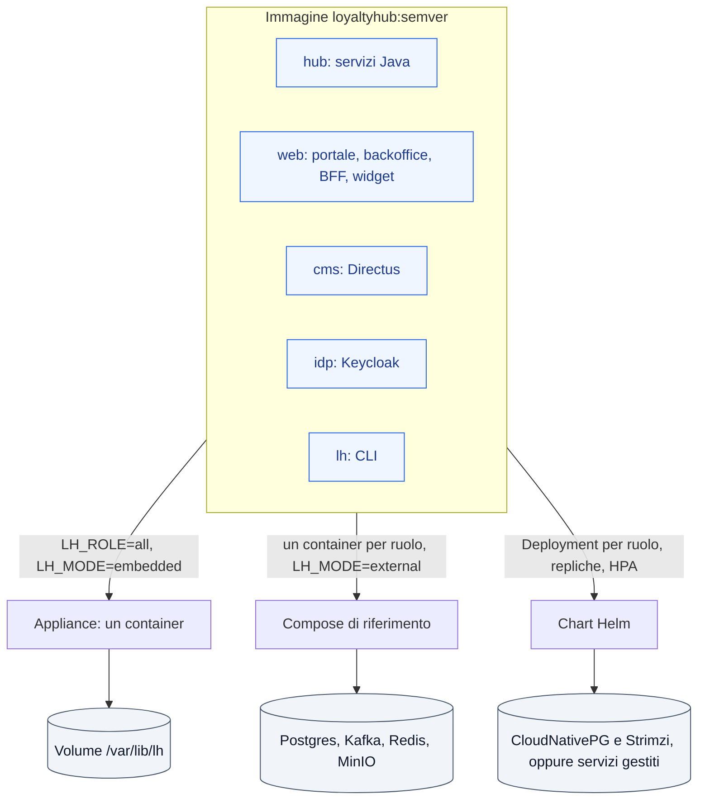

**Tre tagli di installazione, stessa immagine**: appliance (`docker run` + volume) · compose di riferimento (ruoli in container separati + Postgres, Kafka KRaft, Redis, MinIO) · chart Helm (Deployment per ruolo, HPA, PDB, migrazioni come Job, operatori Strimzi e CloudNativePG di default, servizi gestiti via `values`).

### 3.2 Identità e sessioni (ADR-027)

Nessuna *silent authentication* via iframe (`prompt=none`): con i cookie di terze parti bloccati dai browser non funziona più e lascerebbe i token nel JavaScript. Il paradigma è il **Backend-for-Frontend** (raccomandazione IETF *OAuth 2.0 for Browser-Based Apps*): il proxy Next.js esistente (`/api/lh/[service]/...`) diventa il client OIDC.

- **Realm as code** in `deploy/idp/realm.json`: client `web` (**confidential**, Authorization Code + PKCE, usato dal BFF per portale e backoffice), `widgets` (solo token exchange), un client *client credentials* per ogni fonte di ingresso e per ogni job, `cms`, audience `hub` per i servizi; ruoli `ADMIN, MARKETING, LEGAL, CARE, ANALYST, MEMBER` nel claim `lh_roles`; importato al primo avvio, aggiornabile con `lh migrate idp`.
- **Sessione del BFF**: nel browser solo il cookie opaco `__Host-lh_session` (`HttpOnly`, `Secure`, `SameSite=Lax`); token lato server, cifrati nel database del ruolo `web`; access token di 5 minuti, refresh token a rotazione; il rinnovo è trasparente e lo fa il BFF. CSRF: `SameSite`, controllo di `Origin` e header `X-LH-CSRF` su ogni richiesta non idempotente. Logout: *back-channel logout* di Keycloak chiude la sessione nel BFF.
- **Autenticazione**: passkey (WebAuthn) per i membri, password come alternativa gestita solo da Keycloak; MFA obbligatoria per tutti i ruoli del backoffice; sessioni del backoffice più brevi (idle 30 min, massimo 10 h).
- **Servizi**: resource server JWT con verifica di firma, `iss`, `aud=hub`, scadenza; `ActorContext` resta l'astrazione, alimentata dal token in `enterprise` e dall'header `X-LH-Actor` solo in `demo`.
- **Membri**: account Keycloak + record in member-service legato dal `sub` (`member.external_id = sub`); il `memberId` non arriva mai da parametri della richiesta ma solo dal token (§3.10).
- **Widget nelle app del cliente**: il backend dell'app ospite scambia il proprio token con uno del Loyalty Hub via **token exchange** (RFC 8693), con audience e scope limitati ai widget e al solo membro; il widget lo riceve da `tokenProvider` e lo tiene in memoria; DPoP opzionale per legarlo al client.
- **Fonti e job**: client credentials con `private_key_jwt` (o mTLS), un client per fonte collegato al registro fonti di ingestion (`source` ⇔ `client_id`); niente API key statiche.
- **In azienda**: il ruolo `idp` fa da broker verso l'IdP aziendale (OIDC/SAML) e federazione LDAP; chi ha già un OIDC compatibile non avvia `idp` e configura `LH_OIDC_ISSUER`.
- **Temi di login** per i profili `brand`/`pa`; **Directus** usa lo stesso IdP (`AUTH_PROVIDERS` OIDC, ruoli dal claim).

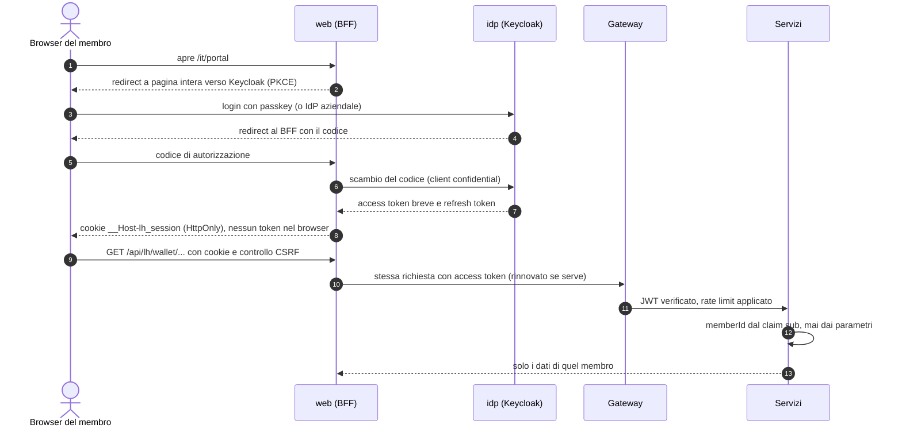

### 3.3 Bus ed eventi (ADR-028)

- I **5 topic** (`lh.actions.v1`, `lh.effects.v1`, `lh.facts.v1`, `lh.audit.v1`, `lh.dlq.v1`) restano con i nomi attuali: in `enterprise` scalano per **partizioni** (default 12, chiave `memberId`) e concorrenza dei consumer; una suddivisione per dominio richiederebbe una nuova ADR e non è prevista.
- **Compatibilità**: `scripts/check-contracts.mjs` confronta gli schemi con l'ultimo tag e fallisce su rimozioni, rinomine o restrizioni (solo aggiunte opzionali senza cambio versione; `docs/05 §9`).
- **Retention**: `facts` e `audit` lunghe (default 365 giorni) — possibile solo grazie a §3.4.

### 3.4 Dati personali fuori dal bus (ADR-032)

- Ogni campo degli schemi in `contracts/events/` dichiara `x-lh-pii: true|false`; un test di contratto fallisce se un campo `pii:true` compare in un evento pubblicato.
- `member.registered` e `member.updated` passano a `dataschema …:2`: restano `memberId, externalId, status, channel, registeredAt, locale, birthYear, province, referralCode, referredBy, labels, attributes` (solo `attribute_definition.pii=false`); escono `firstName, lastName, nickname, email, birthDate, city`. Doppia lettura temporanea nei consumer, poi rimozione della `:1` (Q-346).
- **Consumer**: campaign valuta età e territorio da `birthYear`/`province` (le condizioni `member.age`, `member.city` migrano; `docs/03 §3.3`); experience rende i template con segnaposto `{{member.firstName}}` **non risolti** nel corpo memorizzato; il **BFF** li risolve a lettura (`GET /api/lh/…/inbox`) chiamando member-service; reward raccoglie l'indirizzo di consegna dal portale via HTTP e lo conserva localmente con retention; insight non ha PII.
- **Consegna esterna** (e-mail, push, webhook CPaaS): nuovo modulo `delivery` **nel member-service** (unico proprietario di e-mail/telefono) che consuma `message.send` e usa adattatori (`SMTP`, `WEBHOOK`; `PUSH` predisposto); `EMAIL_FAKE` resta nel profilo `demo`. Produce `message.delivered` con esito.
- **Audit**: le voci mascherano i valori dei campi `pii:true` (`"email": "***"`), conservano nome campo e attore.
- **Anonimizzazione** (M7.5): invariata nei database; sul bus non c'è più nulla da propagare oltre `member.status.changed`.

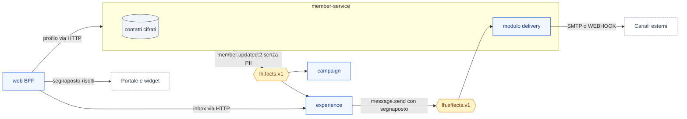

### 3.5 Esperienza data-driven (ADR-029, 030, 031)

**Element Registry** — `registry/elements.yaml` + `registry/schemas/*.json` (JSON Schema 2020-12). Per ogni tipo: `kind` (`block|page|nav_item|theme|structural`), `props` (schema), `renderer` (componente in `web/components/blocks/`), `dataSources` (API pubbliche usate), `paRequired`, `wcag` (criteri coperti e come), `sinceRegistryVersion`. Comando `pnpm registry:build` genera: snapshot Directus (`cms/schema/snapshot.yaml`), tipi TS (`web/lib/registry/types.ts`), documentazione (`docs/registry/`). La CI fallisce se lo snapshot committato differisce dal generato.

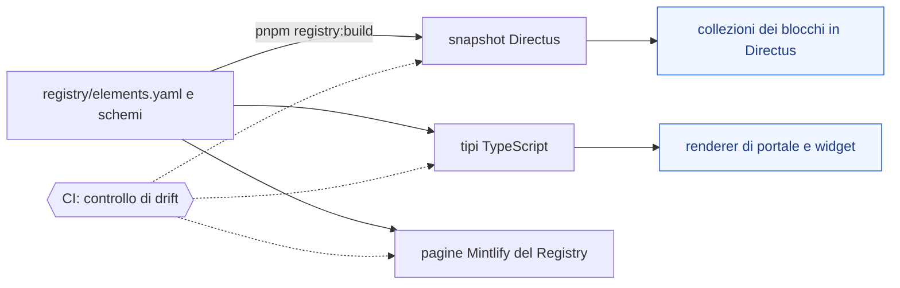

**Set chiuso di M10** (esteso in M13): pagine `home, earn, rewards, play, activity, profile, page` (editoriale); blocchi `hero, member_card, balance, tier_progress, earn_list, catalog, reward_detail, game (WHEEL|SCRATCH|BOX), leaderboard, achievements, inbox_teaser, content_card, content_grid, popup, win_card, rich_text, faq, regulation`; strutturali `header_slim, header_center, header_navbar, footer_institutional, breadcrumb, skip_link, cookie_bar, language_switch, accessibility_link`.

**Directus (ruolo `cms`)** — editor della composizione e dei contenuti: `pages` (slug per lingua, layout, stato, traduzioni), `page_blocks` (M2A verso `block_<tipo>`), `navigation`, `theme` (singleton: profilo, token semantici, loghi), `settings` (singleton: lingue, lingua di default, interruttori), `media`, `regulations` (file + concorso di riferimento). Collezioni `ref_contests, ref_campaigns, ref_rewards, ref_prizes` in sola lettura, alimentate dai fatti `*.status.changed` tramite webhook firmato (F-WBH-01 → Flow Directus). Estensioni: interfaccia di scelta per i `ref_*`, pannello "Apri nel backoffice", collegamento "Crea nuovo concorso" verso BO-14. Versioning e live preview nativi. Ruoli `Editor, Marketing, Publisher` dal claim OIDC.

**`experience-service`** (rinomina di engagement-service; schema `experience`, stesse tabelle + nuove) — proprietario a runtime di: contenuti e inbox (come oggi), **composizione versionata** (`composition_version`: manifesto immutabile pagine+blocchi+navigazione+tema+traduzioni risolte, `status ACTIVE|PREVIOUS|DRAFT`, `published_by`, `cms_revision`), **selezione** per pubblico/calendario/frequenze/priorità, **utilizzi** (`block_reference`: quale blocco riferisce quale oggetto di dominio). Flusso: Flow Directus su *published* → `POST /v1/cms/notify {itemId, revision}` (segreto condiviso) → il servizio **estrae** dall'API Directus con token a scope minimo (notify-and-pull) → valida contro il Registry e le regole del profilo (§3.7) → crea la versione → attiva. Rollback = riattivare `PREVIOUS`. `POST /v1/cms/sync` completo dal backoffice (BO-31). Il portale legge `GET /v1/portal/pages/{slug}?locale=` (blocchi già filtrati e con i dati del membro dal token). Directus può essere spento: il portale non se ne accorge.

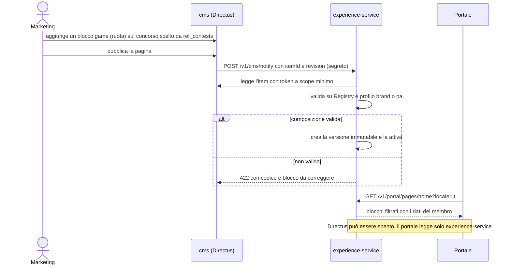

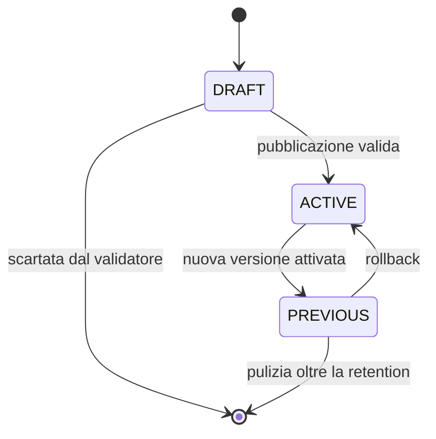

**Collegamenti incrociati**: BO-14/BO-06/BO-11 mostrano «Usato in» (da `block_reference`) e avvisano se un oggetto `LIVE` non è esposto da alcun blocco (regola *nessuna entità senza lettore* resa visibile); il validatore di pubblicazione rifiuta un blocco che riferisce un oggetto inesistente o non pubblicabile.

### 3.6 Headless e widget (P1)

- **OpenAPI** generata da springdoc per ogni servizio (`/v3/api-docs`), raccolta in `contracts/api/<servizio>.openapi.yaml` a ogni build e verificata come i contratti evento (solo cambi compatibili); `contracts/api/portal.openapi.yaml` è l'unione delle sole API `/v1/portal/*`. Le pagine `api/*.mdx` del sito di documentazione derivano da questi file.
- **Widget kit** `widgets/` (pacchetto `@loyaltyhub/widgets`, web components, ESM + IIFE, servito anche da `/widgets/lh.js` del ruolo `web`): `<lh-member-card>`, `<lh-balance>`, `<lh-earn-list>`, `<lh-catalog>`, `<lh-game contest="…">`, `<lh-inbox>`; token OIDC fornito dall'app ospite via `tokenProvider` o attributo; tema via CSS custom properties (stessi token del design system); pagina di esempio `widgets/example.html`; stessi renderer dei blocchi del Registry (nessuna seconda implementazione).
- **Ingresso batch** (`F-ING-10` da P2 a P0): `POST /v1/events/batch` fino a 1000 eventi con esito per elemento; `POST /v1/imports` (NDJSON/CSV su S3 o upload) come job asincrono con rapporto (accettati/duplicati/respinti/non abbinati) e riprova dei non abbinati da BO-26; **BO-32 Import**.

### 3.7 Design system e conformità (ADR-039)

- **Token a tre livelli** (`web/styles/tokens/{primitive,semantic,component}.css`): il tema modifica solo i semantici; nel profilo `pa` font (Titillium Web, Lora, Roboto Mono) e palette (token del Design System .italia, Blu Italia primario) sono vincolati agli insiemi ammessi; `THEME_CONTRAST_TOO_LOW` resta e si estende a tutti i semantici.
- **Profili**: `brand` (Aurora di Fase 1, `docs/07 §5`) e `pa`; il profilo è nel singleton `theme` del CMS; le icone del profilo `pa` sono quelle del Design System .italia (licenza compatibile, copiate nel repo).
- **Blocchi strutturali** obbligatori nel profilo `pa` (`paRequired`): header a tre fasce, footer istituzionale con privacy, dichiarazione di accessibilità, note legali; breadcrumb; skip link; cookie bar senza profilazione; selettore lingua.
- **Validatore di composizione** (in `experience-service`, alla pubblicazione): blocchi obbligatori presenti, un solo H1 per pagina, testo alternativo per ogni immagine, contrasto dei token, collegamenti obbligatori nel footer, lingue complete per le pagine pubblicate. Errori `422` con codice (`COMPOSITION_PA_BLOCK_MISSING`, …) e rimando al blocco.
- **Accessibilità**: WCAG 2.1 AA su portale, widget, backoffice e pagine di login; ogni tipo del Registry dichiara nel manifesto i criteri coperti e il meccanismo (es. `game`: pulsante «Gioca» equivalente, esito annunciato via `aria-live`, animazioni sotto `prefers-reduced-motion`); `lh a11y-report` produce i dati per la dichiarazione di accessibilità e l'elenco delle limitazioni note (tra cui lo Studio del CMS).

### 3.8 Multilingua (ADR-033)

- **UI**: `next-intl` con segmento `/[locale]`; messaggi `web/messages/{it,en}.json`; regola ESLint `no-literal-string` in `app/` e `components/`; formati numerici e di data per locale, fuso sempre Europe/Rome (fuso del programma). Redirect da `/portal` alla lingua preferita (cookie) o di default; backoffice con preferenza utente (claim `locale` o cookie).
- **Backend**: `MessageSource` in `lh-common` (`messages_it.properties`, `messages_en.properties`); `LhException` con chiave e argomenti; `Accept-Language` inoltrato dal proxy; i `code` restano il contratto.
- **Dominio**: tipo `LocalizedText` (jsonb `{"it": …, "en": …}`) su tier (nome, benefici), campagne (nome, descrizione), premi e categorie, concorsi e premi in palio, obiettivi, badge, classifiche, template messaggi, contenuti; le API `/v1/portal/*` risolvono `name` dalla lingua richiesta con fallback alla lingua di default; le API di gestione espongono `nameI18n`.
- **Membro**: `member.locale` (PT-08), nel fatto `member.updated:2`; l'inbox si rende nella lingua del membro al momento dell'invio.
- **Seed**: testi IT/EN per tutte le collezioni; `check-seed` verifica la completezza per lingua.
- **Documentazione**: `docs/` in italiano; README in inglese con sezione italiana.

### 3.9 Agente regolamento (ADR-035, M14)

`assistant-service` (schema `assistant`): `POST /v1/regulation-imports` (PDF → file nel CMS, job asincrono), `GET …/{id}` (stato, bozza, evidenze). Pipeline: antivirus (ClamAV via adattatore) → estrazione testo con PDFBox (tabelle premi preservate; OCR opzionale) → segmentazione per articolo → estrazione strutturata per articolo con `response_format` a schema (`contracts/assistant/regulation-draft.schema.json`) → fusione → quadratura Σ valore premi = montepremi. Bozza con `evidence` (estratto) e `confidence` per campo; sezioni `manifestazione, contest, prizes, campaigns, rewards, contents, templates, unmapped`. **BO-33 Importa regolamento**: revisione affiancata al testo, diff, applicazione via API esistenti in `DRAFT` con `origin=REGULATION_IMPORT` e riferimento al documento; approvazione `LEGAL` (M7.1). Dominio: `contest.regulation` jsonb (promotore, territorio, ONLUS, estremi del deposito, termine consegna) con lettori BO-14 «Legale» e blocco `regulation` nel portale. Golden set in `e2e/fixtures/regulations/` con bozze attese; record/replay in CI, eval notturna contro l'endpoint dell'ambiente di riferimento. Formato di riferimento: regolamento delle manifestazioni a premio (DPR 430/2001).

```mermaid
flowchart LR
  accTitle: Pipeline dell'agente regolamento
  accDescr: Il PDF passa da antivirus, estrazione del testo, segmentazione per articolo, estrazione a schema con modello self-hosted, fusione e quadratura, revisione umana, applicazione in bozza e approvazione legale.
  PDF[/Regolamento PDF/] --> AV[Antivirus] --> TXT[Testo e tabelle] --> ART[Segmentazione per articolo]
  ART --> LLM[Estrazione a schema, modello self-hosted] --> MRG[Fusione e quadratura montepremi]
  MRG --> REV[BO-33: revisione affiancata al testo]
  REV --> DR[Oggetti in DRAFT via API]
  DR --> LEG{LEGAL approva?}
  LEG -->|sì| LIVE[LIVE]
  LEG -->|no, con commento| DR
  classDef svc fill:#EFF6FF,stroke:#2563EB,color:#1E3A8A
  classDef store fill:#F1F5F9,stroke:#475569,color:#0F172A
  classDef topic fill:#FEF3C7,stroke:#D97706,color:#78350F
  classDef ext fill:#FFFFFF,stroke:#94A3B8,stroke-dasharray:4 2,color:#334155
  classDef human fill:#ECFDF5,stroke:#059669,color:#064E3B
  class REV,LEG human
  class LLM svc
```

### 3.10 Sicurezza: zero trust e difesa in profondità (ADR-042, ADR-038)

Principio: **nessuna chiamata è fidata per posizione di rete**. Ogni richiesta HTTP, ogni messaggio sul bus e ogni connessione al database porta un'identità verificata ed è autorizzata al minimo necessario. Riferimento di verifica: **OWASP ASVS 5.0 livello 2** e **OWASP API Security Top 10 (2023)**; la tabella di conformità vive in `docs/security/asvs.md` e si aggiorna a ogni milestone.

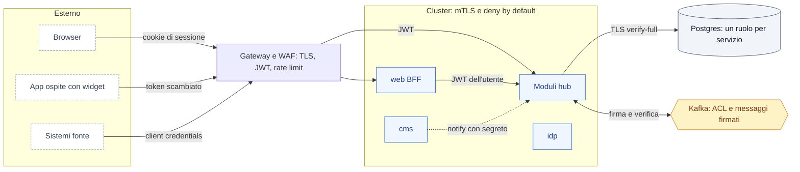

**1. Identità di ogni chiamante, anche interno**

| Chiamante → chiamato | Autenticazione | Autorizzazione |
|---|---|---|
| Browser → BFF | cookie di sessione `__Host-` + CSRF (§3.2) | sessione valida |
| BFF, gateway → moduli | access token utente (`aud=hub`) | ruolo dal claim + controllo di proprietà dell'oggetto |
| App ospite → widget API | token scambiato (RFC 8693), scope `widgets` | solo il membro del token, solo API `/v1/portal/*` |
| Fonte → ingestion | client credentials `private_key_jwt` o mTLS | `client_id` ⇔ `source` del registro fonti; solo i `type` ammessi alla fonte |
| Job (`LH_ROLE=jobs`) → moduli | client credentials del job | scope del solo job |
| Directus → experience (`/v1/cms/notify`) | HMAC del corpo con segreto + mTLS in mesh | solo notifica; i dati si estraggono (notify-and-pull) |
| experience → Directus API | token statico di servizio a scope minimo (sola lettura delle collezioni di composizione) | policy Directus |
| Modulo → modulo via Kafka | principal Kafka per modulo (mTLS o SASL/SCRAM) + **firma del messaggio** | ACL per topic + elenco dei produttori ammessi per `type` |
| Pod → pod (Kubernetes) | mTLS della mesh (Linkerd di default nel chart, identità SPIFFE per service account) | policy di mesh: ogni servizio accetta solo dai chiamanti previsti |
| Modulo → Postgres | ruolo per servizio, TLS `verify-full`, credenziali brevi (CNPG o secret manager) | `GRANT` sul solo schema proprio |
| Operatore → console di Directus, Keycloak, Actuator | OIDC con MFA | allowlist di rete; Actuator su porta di gestione separata (8081), mai esposta; solo `health` senza token |

Nelle modalità in un solo processo (`LH_ROLE=all`, `embedded`) i moduli condividono il JVM: il confine di fiducia è il processo. Lì la separazione è garantita dall'isolamento dei moduli (test ArchUnit: nessun modulo dipende dalle classi di un altro) e il bus in-process esegue la **stessa** firma e verifica dei messaggi, così il comportamento è identico in ogni taglio.

**2. Messaggi firmati sul bus.** I 5 topic sono condivisi: senza firma un modulo compromesso potrebbe pubblicare `wallet.points.earned`. Ogni envelope porta la firma JWS *detached* (Ed25519) di data e attributi principali negli header `lhsig` e `lhkid`; la chiave privata è per modulo (generata da `lh init` o dal secret manager, rotazione con `kid`), le chiavi pubbliche sono distribuite come JWKS di configurazione. `contracts/events/producers.yaml` elenca per ogni `type` il modulo che può produrlo (dalle tabelle di `docs/05`). Il consumer verifica firma e produttore prima dell'idempotenza; in caso di errore il messaggio va in DLQ con `SIGNATURE_INVALID` o `PRODUCER_NOT_ALLOWED` e scatta un allarme. I messaggi delle fonti esterne sono firmati da ingestion dopo l'autenticazione della fonte. Inoltre ogni `data` viene validato contro il suo JSON Schema **anche in consumo**, con limiti di dimensione e profondità.

**3. Autorizzazione: deny by default.** Ogni endpoint dichiara `@RequiresRole(...)` oppure `@PublicEndpoint` con motivazione; un test ArchUnit fallisce se un metodo di `@RestController` non ha né l'uno né l'altro (oggi 207 mapping, 80 con `@RequiresRole`: le letture sono aperte ad `ANALYST:anonymous` per scelta del PoC). Le API `/v1/portal/*` non accettano `memberId` da path, query o corpo: lo ricavano da `MemberPrincipal` (difesa da BOLA, OWASP API1); le API di gestione controllano la proprietà dell'oggetto dove il ruolo non basta (es. `CARE` vede i membri, non modifica campagne). Nessun *mass assignment*: i controller legano solo record DTO espliciti, mai entità; campi come `status`, `version`, `createdBy` non sono legabili.

**4. Iniezione SQL e accesso ai dati**
- Solo `JdbcClient` con parametri; vietati `Statement`, SQL costruito da input, `String.format`/`formatted` e concatenazione nel testo SQL fuori dal builder comune.
- Il codice attuale compone i `WHERE` dinamici con frammenti costanti e parametri posizionali (es. `InboxRepository`, `WebhookDeliveryRepository`): nessuna iniezione trovata nei casi esaminati, ma nulla la impedisce per costruzione. Nuovo builder `lh-common` `SqlWhere`/`SqlOrder` che accetta solo colonne da enum (ordinamenti, filtri, campi dei segmenti dinamici e degli attributi personalizzati `jsonb` passano da allowlist); regola **Semgrep** personalizzata che fallisce su `.sql(` con argomento non costante fuori dal builder; query CodeQL `java/sql-injection` attiva.
- Privilegi minimi: per ogni servizio un ruolo *owner* usato solo dal Job di migrazione (DDL) e un ruolo *app* con sola DML sul proprio schema; `REVOKE ALL ON SCHEMA public`; `search_path` fissato; `statement_timeout` e `lock_timeout` per ruolo; `pgaudit` sulle DDL; insight in sola lettura dove legge.

**5. Validazione dell'input e degli output**
- Bean Validation su ogni DTO (lunghezze, pattern, enum, intervalli); limiti Jackson (`StreamReadConstraints`: dimensione, profondità, lunghezza dei numeri); corpo massimo per endpoint; paginazione con tetto 100 (già uniformato dall'audit); `FAIL_ON_UNKNOWN_PROPERTIES` sulle API di scrittura REST (non sugli eventi, che devono tollerare campi aggiunti); default typing Jackson disattivato, nessuna deserializzazione Java.
- Template dei messaggi: motore senza logica (stile Mustache) con escaping; nessuna valutazione di espressioni (SpEL o simili) su testi forniti dagli operatori.
- Contenuti ricchi dal CMS: sanitizzati con allowlist alla **pubblicazione** in experience-service e resi da React senza `dangerouslySetInnerHTML` non sanitizzato (oggi nessun uso).
- Header HTTP: CSP con nonce e `strict-dynamic`, `frame-ancestors 'none'` (i widget sono web component, non iframe), HSTS, `X-Content-Type-Options`, `Referrer-Policy`, `Permissions-Policy`, COOP/CORP; CORS esplicito e per origine registrata per i widget.
- Errori RFC 9457 senza stack trace né dettagli interni (già così).

**6. Richieste in uscita (SSRF).** Webhook verso URL configurati dagli operatori, pull da Directus, endpoint LLM: le destinazioni dei webhook si risolvono e si rifiutano se private, loopback o link-local (controllo dopo la risoluzione, niente redirect seguiti); CMS e LLM solo verso URL di configurazione; in Kubernetes egress consentito solo verso le destinazioni previste (network policy o proxy di uscita).

**7. Abusi e logica di business.** Rate limit al gateway per client e IP e, nei moduli, per membro su giocate, riscatti, registrazioni e login; **`Idempotency-Key`** obbligatoria sulle POST che spendono o assegnano valore (riscatto, giocata, rettifica punti), con conservazione 24 h; blocco ottimistico (già presente); controlli di velocità (troppi guadagni o giocate in poco tempo) come segnale in insight e sospensione manuale da BO-03 (P1).

**8. File caricati.** Regolamenti PDF e media: dimensione massima, riconoscimento del tipo reale (non dall'estensione), antivirus, conservazione fuori dalla radice web, `Content-Disposition` e `X-Content-Type-Options` al download; SVG solo sanitizzati.

**9. Segreti e crittografia.** Nessun segreto nel codice o in variabili in chiaro: secret manager tramite External Secrets, convenzione `*_FILE`, rotazione; TLS 1.2+ ovunque (1.3 dove possibile); cifratura a colonna AES-GCM con chiave derivata per i contatti (chiave master in KMS o `LH_MASTER_KEY`); HMAC per webhook e notifiche CMS; Ed25519 per gli eventi; backup cifrati.

**10. Esecuzione.** Container non root con filesystem in sola lettura, capability rimosse, seccomp `RuntimeDefault`, Pod Security `restricted`, nessun token di service account montato se non serve, network policy *deny by default*; verifica delle firme cosign all'ammissione (Kyverno, opzionale nei `values`).

**11. Registrazione e rilevazione.** Eventi di sicurezza (login falliti, 401/403, firme non valide, rate limit, cambi di ruolo) nel log strutturato e in audit, con `correlationId` e senza dati personali; esportazione verso SIEM tramite OTel; allarmi su picchi di 401/403, `SIGNATURE_INVALID`, DLQ.

**12. Verifica continua** (la conformità la verifica il software, P7)

| Controllo | Dove | Blocca |
|---|---|---|
| ArchUnit: endpoint senza `@RequiresRole`/`@PublicEndpoint`, portale con `memberId` da parametri, dipendenze tra moduli | `./mvnw verify` | sì |
| Semgrep con regole del progetto (SQL, SpEL, `Statement`, header) + CodeQL | job `security` | sì |
| Fuzzing delle API da OpenAPI con **Schemathesis** (input malevoli, confini, codici attesi) | job `security` notturno | sì su 5xx |
| ZAP API scan autenticato sulle OpenAPI | job `security` notturno | sì su alti |
| Scansione dipendenze, immagini, IaC (Trivy, kube-linter/Checkov) e segreti | job `security` | sì su alti |
| Testbook di sicurezza `TB-SEC` (BOLA, BFLA, mass assignment, iniezioni, SSRF, firme del bus, rate limit, idempotenza) | `e2e/` | sì |
| Penetration test esterno | M15 | — |

Deliverable: threat model STRIDE per confine in `docs/security/threat-model.md`, tabella ASVS in `docs/security/asvs.md`, `SECURITY.md` con la procedura di segnalazione delle vulnerabilità e `/.well-known/security.txt` nel ruolo `web`.

**Punti deboli dell'attuale codice da chiudere** (fotografia del 2026-09-25): API del portale con `memberId` in query (chiunque legge qualunque membro) · letture senza ruolo per scelta del PoC · `POST /v1/events` non autenticato · qualunque modulo può pubblicare qualunque `type` sui topic condivisi · SQL dinamico corretto ma non vincolato da regole. Tutti rientrano in M8.2, M8.5, M8.10.

Restano validi: **CMS e IdP** (console dietro allowlist, ruolo pubblico Directus disabilitato, estensioni dinamiche spente, notify-and-pull); **agente** (PDF come input non fidato: output a schema, nessuno strumento di scrittura, nessun dato membro nel prompt, audit di prompt e risposte); **concorsi** (impronta firmata degli istanti al `LIVE`, verbale, export per la ritenuta, M14.4).

### 3.11 Resilienza e SLO (ADR-036)

| Componente | Meccanismo |
|---|---|
| Servizi | ≥2 repliche multi-AZ, PDB, HPA su CPU e lag Kafka (KEDA), probe che includono outbox e consumer |
| Kafka | 3 broker, RF 3, `min.insync.replicas` 2, DLQ con riprocesso (M7.3), alert su lag e arretrato outbox |
| Postgres | HA (CloudNativePG o gestito), PITR, replica in seconda region, prova di ripristino in M15 |
| Esperienza | composizione versionata con rollback, CDN sulle risposte pubbliche, fallback per blocco; Directus fuori dal runtime |
| Portale/BFF | timeout e bulkhead per servizio, stato `degraded` per sezione (già presente), cache dell'ultima composizione |
| Obiettivi | portale 99,9 %; azione → punti p95 < 5 s; giocata p99 < 500 ms; RPO 15 min; RTO 1 h; misurati da dashboard Grafana nel chart |

### 3.12 Documentazione su Mintlify (ADR-040)

Il sito di documentazione è **Mintlify** (deployment `poc-0ae60636`, ramo di pubblicazione `main`, già collegato al repo). GitBook (`gitbook-docs.yaml`, `docs/SUMMARY.md`) e i duplicati in `docs_v2/` si dismettono: una sola fonte, un solo sito.

**Fonti e generazione**

| Sezione del sito | Fonte | Come si produce |
|---|---|---|
| Introduzione, concetti, guide, operazioni | `site/**/*.mdx` scritte a mano | redazione, con diagrammi obbligatori (tabella sotto) |
| Specifiche | `docs/NN-*.md`, `docs/servizi/*.md`, `docs/testbook/*.md` | `scripts/docs-sync.mjs` genera `site/specifiche/**/*.mdx` (frontmatter, escape di `<` e `{`, link riscritti); mai modificate a mano |
| Riferimento API | `contracts/api/*.openapi.yaml` (M8.8) | voce `openapi` in `docs.json`: pagine per endpoint e playground generati da Mintlify |
| Eventi | `contracts/events/**` | `scripts/docs-sync.mjs` genera una pagina per famiglia con i `type` e i campi (`x-lh-pii` evidenziato) |
| Element Registry | `registry/` | `pnpm registry:build` genera `site/registry/*.mdx` (M10.1) |
| Lingue | `site/it/**`, `site/en/**` | `navigation.languages` in `docs.json`; inglese da M11 per Introduzione, Concetti, Guide, Operazioni |

`docs.json` e le pagine si spostano in `site/` (il percorso del monorepo si imposta nel pannello Mintlify: operazione del proprietario). `docs/` resta la fonte che leggono gli agenti.

**Diagrammi Mermaid.** Mintlify rende nativamente i blocchi `mermaid`; GitHub fa lo stesso sui `.md`. Regole:
- ogni pagina *Concetti* e *Operazioni* e ogni scheda servizio ha **almeno un diagramma**; ogni sezione di `docs/18 §3` ne ha già uno ed è il modello di riferimento;
- ogni diagramma ha `accTitle` e `accDescr` (accessibilità, coerente con ADR-039) ed è accompagnato da testo che lo spiega: il diagramma chiarisce, non sostituisce;
- al più ~15 nodi; se ne servono di più, due diagrammi a livelli diversi (panoramica e dettaglio);
- etichette nella lingua della pagina, senza HTML; identificativi dei nodi stabili (`HUB`, `WEB`, nomi dei servizi);
- stessa palette ovunque, con le righe `classDef` standard (`svc`, `store`, `topic`, `ext`, `human`) copiate da questo documento; verifica in tema chiaro e scuro;
- tipi consigliati: `flowchart` (architettura, flussi), `sequenceDiagram` (interazioni), `stateDiagram-v2` (cicli di vita), `erDiagram` (modello dati delle schede servizio); niente `gantt` con date non decise;
- mai immagini di diagrammi: sempre sorgente Mermaid versionato.

**Catalogo minimo dei diagrammi** (M8.9 per le pagine di Fase 1, poi ogni fetta aggiunge i propri)

| Pagina | Diagrammi |
|---|---|
| Panoramica | dal comportamento del cliente ai punti: azione → regole → effetti → saldo → messaggio |
| Architettura | servizi, topic e proprietari; profili `demo` ed `enterprise` affiancati |
| Eventi | sequenza ingestion → campaign → wallet con outbox; famiglie action, effect, fact, audit, dlq |
| Punti e livelli | stati del lotto (attivo, speso, scaduto); anno di edizione con discesa morbida |
| Premi | sequenza della saga di riscatto; stati della richiesta |
| Gioco | sequenza di una giocata instant win; stati del concorso con approvazione |
| Governance | macchina delle approvazioni; webhook con ritenti; DLQ |
| Esperienza | Registry → Directus → experience → portale; pubblicazione (§3.5) |
| Identità | accesso di membro e operatore (§3.2); broker verso IdP aziendale |
| Dati personali | flusso di §3.4 |
| Installazione | tre tagli (§3.1); primo avvio con `lh init`; aggiornamento N−1 → N |
| Esercizio | topologia Helm multi-AZ; percorso di ripristino |
| Schede servizio | un `erDiagram` delle tabelle proprie (§3.12-bis) e un diagramma consumi/produzioni per servizio |
| Contribuire | flusso di §3.13 |

**Controlli in CI** (job `docs`): `docs-sync` senza differenze; `npx mint broken-links` nella cartella `site/`; `scripts/check-mermaid.mjs` (fornito con questa specifica) estrae ogni blocco Mermaid da `site/` e `docs/`, lo analizza con `mermaid.parse` su jsdom (senza browser) e fallisce su errori di sintassi o su `accTitle`/`accDescr` mancanti; controllo del frontmatter (`title`, `description`). Anteprime per pull request di Mintlify se il piano le include; altrimenti `mint dev` in locale.

### 3.12-bis Tracciati, stati e mapping delle fonti (requisito trasversale)

**Stato attuale (verificato sul codice, 2026-09-26)**: ogni scheda `docs/servizi/*.md` ha già §2 "Modello dati" con le tabelle in forma testuale (`Tabella | Colonne principali`); i cicli di vita esistono già come `stateDiagram-v2` in `docs/03 §3.6` (oggetti governati) e `§6` (instant win); il mapping fonte→azione esiste già in `docs/servizi/ingestion-service.md §2/§3` (`source`, `internal_mapping`, `allowed_types`). **Nessuno di questi è oggi reso come `erDiagram` o diagramma navigabile**: chi arriva nuovo deve ricostruire a mente lo schema delle tabelle e il percorso fonte → tipo di azione → regola di campagna → effetto → saldo leggendo prosa sparsa su più file. Questa sezione rende esplicito, come requisito e non solo come riga di catalogo, cosa ogni scheda deve avere da M8.9 in poi.

**1. Tracciato delle tabelle.** Ogni scheda `docs/servizi/*.md` aggiunge, sotto la tabella testuale di §2 (che resta, è la fonte leggibile riga per riga), un `erDiagram` con le stesse tabelle: entità = tabelle del servizio, attributi = solo le colonne che partecipano a chiavi o relazioni (PK, FK, colonne di stato), relazioni con cardinalità (`||--o{`, …). Non sostituisce la tabella testuale, la accompagna: il diagramma mostra la forma, la tabella i dettagli (tipi, vincoli, default). Generato a mano finché non esiste un introspettore automatico dalle migrazioni Flyway (possibile evoluzione M8.9, non vincolante ora); la CI (`check-mermaid`) verifica solo sintassi e accessibilità, non la fedeltà allo schema reale — resta a chi tocca la fetta tenerlo aggiornato quando cambia una migrazione (*Definizione di fatto*, vedi §7).

**2. Stati.** Ogni entità con un ciclo di vita dichiarato (`status` con transizioni vincolate: concorso, richiesta premio, lotto punti, versione di composizione, import regolamento) ha un `stateDiagram-v2` nella pagina Mintlify del concetto a cui appartiene — non serve una pagina a parte per gli stati. Dove lo stato è condiviso da una macchina comune (`docs/06 §7`, usata da concorsi e richieste premio), un solo diagramma di riferimento con nota su quali entità la usano, invece di ripeterlo identico più volte.

**3. Mapping fonte → punti.** Nuovo diagramma obbligatorio nella pagina "Eventi" (già nel catalogo minimo, riga *Eventi*, qui specificato): un `flowchart` che percorre **fonte di ingresso → tipo di azione ammesso per quella fonte → regola/campagna che lo valuta → effetto prodotto → saldo o oggetto aggiornato**, usando gli esempi già presenti nel seed (`docs/servizi/ingestion-service.md §2` per `source`/`allowed_types`, `docs/03 §3` per condizioni ed effetti). Questo è il diagramma che risponde alla domanda "se arriva un evento da questa fonte, con questo tipo, cosa succede fino al saldo del membro" — oggi ricostruibile solo leggendo tre schede in sequenza.

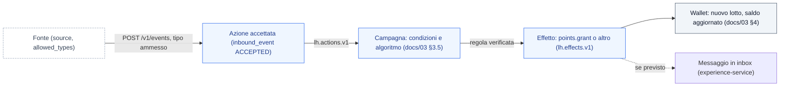

**Non è una fetta a parte**: si esegue dentro M8.9 (documentazione) per le pagine di Fase 1, e da lì in poi è parte della *Definizione di fatto* di ogni fetta che tocca uno schema di tabella, uno stato o una fonte (regola 17, §7): chi aggiunge una colonna a una tabella esistente aggiorna anche il suo `erDiagram`, chi aggiunge una fonte o un tipo ammesso aggiorna il diagramma di mapping.

### 3.13 Governance del repository (ADR-041)

**Ruleset `main-protetto`** sul ramo di default, applicato dal proprietario con `scripts/setup-branch-protection.sh` dopo il merge di M8.0:
- modifiche **solo tramite pull request**, niente push diretti (vale anche per gli agenti);
- **controlli obbligatori** (nomi dei job come compaiono in GitHub): `backend (Java 25)`, `web (Next.js)`, `seed`, `contracts`; si aggiungono `guard` (M8.0), `docs` (M8.9), `security` (M8.5), `e2e-pr` (M9), `registry` (M10.1) quando i job esistono, rilanciando lo script;
- storia lineare, niente force push, niente cancellazione del ramo; conversazioni di revisione risolte;
- approvazioni richieste: **0** finché il proprietario è l'unico maintainer (GitHub non permette di approvare le proprie PR e gli agenti aprono PR a suo nome); si porta a 1 con revisione `CODEOWNERS` quando arriva un secondo maintainer;
- controlli non "strict" (la PR non deve essere aggiornata su `main` prima del merge) per non serializzare i worktree paralleli: il job notturno su `main` fa da rete;
- bypass solo per il ruolo admin e solo tramite pull request (emergenze);
- impostazioni del repo: merge **squash** (una fetta = un commit su `main`), cancellazione automatica dei rami dopo il merge, secret scanning con push protection, Dependabot per `maven`, `npm` e `github-actions`.

**Controllo `guard`** (job CI): `scripts/check-adr-append-only.mjs` fallisce se una PR modifica o rimuove righe di un'ADR esistente in `docs/13` (sono ammesse nuove ADR e la riga «Superata da ADR-nnn»); fallisce se cambia un ID in `seed/` senza la label `decisione`.

**`CODEOWNERS`**: `docs/13`, `CLAUDE.md`, `contracts/`, `registry/`, `.github/`, `deploy/helm/` al proprietario (notifica oggi, revisione obbligatoria dal secondo maintainer).

**Tracciabilità**: da Fase 2 `docs/14` spunta le fette con il **numero della PR** (`#123`) oltre all'hash dello squash; il titolo della PR porta gli ID (`F2-…`, `ADR-…`); il modello `.github/pull_request_template.md` riporta la *Definizione di fatto*. I rami di integrazione di Fase 1 (`integ*`) non servono più: ogni worktree apre la propria PR verso `main`.

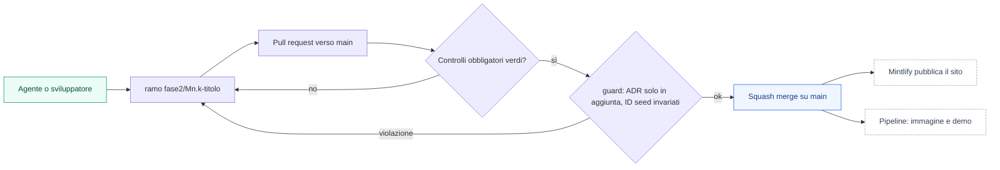

### 3.14 Audit unificato (ADR-043)

**Stato attuale (verificato sul codice, 2026-09-26)**: `insight-service` è già il registro tecnico — ogni servizio di dominio (`member`, `campaign`, `wallet`, `reward`, `gamification`, `experience`) pubblica un `AuditEntry` (`AuditPublisher`) sul fatto `io.loyaltyhub.audit.entry`, consumato in `audit_entry` (`actor_role`, `actor_name`, `service`, `entity_type/id`, `action`, `before/after` in `jsonb`, `correlation_id`) ed esposto in sola lettura da `GET /v1/audit` (`docs/servizi/insight-service.md §3`). Copre bene "chi ha modificato cosa" **nel backoffice**. Tre lacune, non coperte da nessuna fetta di Fase 2 fin qui: (1) le modifiche fatte **in Directus** (pagine, blocchi, tema) e **in Keycloak** (utenti, ruoli, sessioni, MFA) restano nei log interni di quei due prodotti, mai nello stesso registro; (2) non esiste una capacità di **attività del membro finale** — `PortalActivityController` (`GET /v1/portal/wallets/{memberId}/activity`, PT-07) mostra solo i movimenti punti, non login, consensi, giocate o riscatti; (3) la retention di `audit_entry` è 180 giorni (`docs/servizi/insight-service.md §5`), corta per un requisito enterprise.

**Decisione**: un solo registro di audit (`audit_entry`, invariato nello schema) per **tutte** le modifiche di configurazione — backoffice, Directus, Keycloak — più una capacità nuova e separata di **attività del membro**, entrambe con lo stesso principio dello zero trust (§3.10): l'attore è sempre quello del token verificato, mai un valore dichiarato dal chiamante.

**1. Bridge Directus → audit.** Directus scrive `activity` e `revisions` proprie a ogni cambiamento. Un Flow interno (già previsto per i webhook di pubblicazione, §3.5) intercetta ogni evento `items.create/update/delete` sulle collezioni di composizione e contenuto e chiama `POST /v1/audit/external` su `experience-service` (nuovo endpoint, solo per questo scopo, autenticato con lo stesso segreto HMAC di `/v1/cms/notify`) con `{collection, item, action, editor (dal claim OIDC di Directus), before, after}`; `experience-service` traduce in `AuditEntry` (`service=cms`, `entity_type=<collection>`) e lo pubblica come oggi. La pubblicazione di una composizione (creazione di `composition_version`) è già di per sé una scrittura tracciata: diventa anch'essa una voce audit con `action=PUBLISH`.

**2. Bridge Keycloak → audit.** Keycloak espone nativamente *admin events* (chi ha cambiato un utente, un ruolo, un client) e *user events* (login, logout, cambio password, fallimenti) via un **event listener SPI**; si abilita quello integrato (`jboss-logging` non basta: serve l'estensione che pubblica su HTTP o su un topic). Scelta: listener che chiama `POST /v1/audit/external` su **member-service** (per gli eventi utente, mappati su `member_id` via `external_id = sub`) e su un endpoint equivalente esposto dal futuro modulo di amministrazione (per gli admin events, `service=idp`, nessun dato membro). Solo eventi di *cambiamento* (non ogni singolo login riuscito, che appartiene al punto 3): creazione/cancellazione utente, cambio ruolo, reset password, abilitazione MFA, blocco account.

**3. Attività del membro (nuova capacità, non un'estensione dell'audit di backoffice).** Il registro `audit_entry` resta per gli **operatori** (backoffice, CMS, IdP); l'attività del **membro finale** è un concetto diverso — cosa ha fatto lui, per lui stesso e per chi lo assiste — ed entra in un nuovo servizio dati `member_activity` **dentro member-service** (stesso proprietario del `sub`, coerente con P2): tabella `member_activity_entry` (`member_id`, `at`, `kind` `LOGIN|CONSENT_CHANGED|REDEMPTION|PLAY|PROFILE_UPDATED|DATA_EXPORT_REQUESTED`, `summary`, `metadata jsonb` senza PII di altri). Alimentata da: eventi Keycloak *user events* (login) via lo stesso bridge del punto 2; fatti già pubblicati sul bus (`points.redeemed`, `game.played`, `member.updated` per i consensi — filtrati per non duplicare l'audit di backoffice); una scrittura diretta quando il membro stesso agisce dal portale. Esposta come **BO-03 estesa** («Attività» nella scheda membro, per `CARE`/`ADMIN`) e come **nuova pagina portale "La mia attività"** (`PT-18`, blocco Registry `activity_log`, dietro l'autenticazione del membro, solo i propri dati via `MemberPrincipal`): soddisfa la richiesta di accesso GDPR art. 15 senza dover interrogare quattro servizi a mano.

**4. Retention e integrità.** `audit_entry` passa da 180 a **400 giorni** (copre un anno solare più margine per verifiche); resta *append-only* (nessun `UPDATE`, solo `INSERT`/`DELETE` da retention job) e le voci mascherano già i campi `pii:true` (ADR-032); si aggiunge un vincolo di sola-inserzione lato database (nessun `GRANT UPDATE` sul ruolo applicativo di `insight`, coerente con i ruoli *owner*/*app* di §3.10 punto 4). `member_activity_entry` segue la stessa regola di sola-inserzione e la sua retention segue quella del membro (cancellata all'anonimizzazione, M7.5).

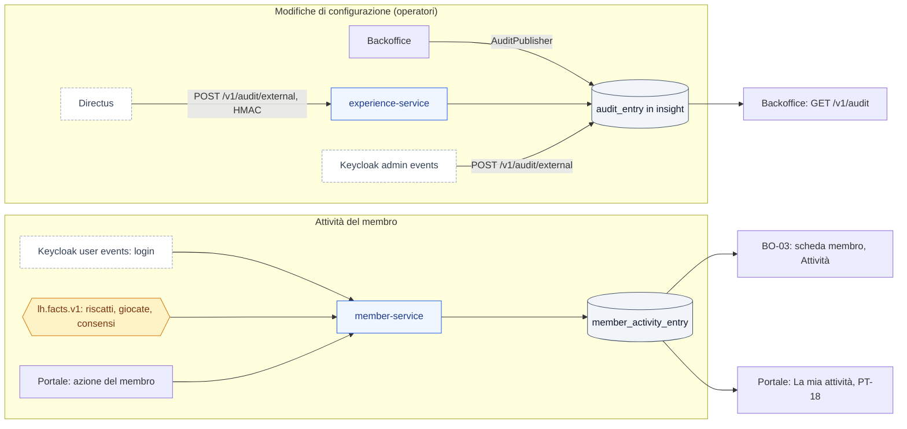

**Non fa parte di questa fetta**: un SIEM esterno resta il punto 11 di §3.10 (eventi di sicurezza come login falliti, 401/403); questa sezione riguarda l'audit **funzionale** (chi ha cambiato cosa, cosa ha fatto il membro), non la rilevazione di intrusioni.

### 3.15 Il prodotto come fornitore di un'azienda ISO/IEC 27001 (ADR-044)

Una certificazione ISO/IEC 27001 riguarda il **sistema di gestione dell'azienda che adotta**, non il software: nessun prodotto è "certificato 27001". Quello che l'azienda chiede al Loyalty Hub è di (a) non aprire buchi nei suoi controlli, (b) darle **evidenze** per dimostrarli all'auditor, (c) comportarsi come un **fornitore** che rispetta i controlli sulla catena di fornitura (Annex A 5.19–5.23, 8.25–8.30). Fase 2 copre già molto (identità e MFA, zero trust, crittografia, audit, SAST/DAST, SBOM, change management via PR); questa sezione chiude ciò che un auditor troverebbe mancante.

**Lacune trovate nel codice attuale (2026-09-26)**
- **Nessuna separazione dei compiti sulle approvazioni** (A.5.3): la policy di `docs/06 §7` ammette l'approvazione dal "ruolo della policy o `ADMIN`" e nessun controllo impedisce che chi sottomette un concorso sia anche chi lo approva.
- **Retention fissa** (A.5.33, A.8.10): `audit-max-age-days` ha un solo valore di default; non esiste una politica per categoria di dato né una prova della cancellazione.
- **Il ripristino resuscita i membri anonimizzati** (A.8.10, GDPR art. 17): `lh restore` da un backup precedente riporta in vita i dati personali di chi nel frattempo è stato anonimizzato.
- **Nessun controllo sulle esportazioni** (A.8.12): le pagine del backoffice che esportano elenchi non chiedono un permesso dedicato né un motivo.
- **Revisione del codice a zero approvazioni** (A.8.25, A.5.3 lato fornitore): con ADR-041 le PR degli agenti partono a nome del proprietario, che quindi non può approvarle; per un auditor del cliente è codice senza quattro occhi.

**1. Mappa dei controlli e responsabilità condivisa.** `docs/compliance/iso27001-annex-a.md`: i 93 controlli dell'Annex A 2022, ciascuno con responsabilità **Prodotto / Adottante / Condivisa**, la funzione del prodotto che lo supporta e l'evidenza che produce (comando, report, voce di audit). È il documento che l'azienda allega alla propria *Dichiarazione di Applicabilità*. Accanto, la stessa mappa verso ISO/IEC 27701 (privacy) e GDPR art. 30/32/33, e verso NIS2 (D.Lgs. 138/2024) per gli adottanti soggetti essenziali o importanti. I controlli fisici e sulle persone (A.6, A.7) sono dell'adottante e lo si dichiara.

**2. Sicuro per impostazione, rifiuto all'avvio.** `LH_PROFILE=enterprise` non parte (errore esplicito, codice `INSECURE_CONFIG`) se: segreti di default o vuoti, TLS disattivato verso database o bus, `X-LH-Actor` abilitato, endpoint `/v1/demo/**` attivi, account amministrativi senza MFA, console Directus o Keycloak esposte senza allowlist, telemetria verso l'esterno attiva. `lh doctor --security` produce lo stesso controllo come report firmato (base per A.8.9 *configuration management*); il profilo `demo` rifiuta di avviarsi su un database che contiene membri non di seed. **Nessuna telemetria in uscita** di default: il prodotto non contatta nulla fuori dalle destinazioni configurate.

**3. Governo degli accessi** (A.5.15–5.18, A.8.2)
- **Quattro occhi**: sottomissione e approvazione di uno stesso oggetto da due persone diverse (`422 SELF_APPROVAL_FORBIDDEN`, vale anche per `ADMIN`); stesso principio, configurabile, sulle operazioni sensibili: rettifiche punti sopra soglia, chiusura di edizione, modifica di ruoli, esportazioni di dati personali, cambio della scala dei livelli.
- **Ciclo di vita delle utenze**: provisioning e deprovisioning dall'IdP aziendale (SCIM o federazione con gruppi → ruoli); un operatore disabilitato nell'IdP perde la sessione nel BFF alla successiva verifica (back-channel logout, §3.2); nessun account locale fuori dal flusso di break-glass.
- **Revisione periodica degli accessi**: BO-34 elenca operatori, ruoli, ultimo accesso, MFA, account inattivi oltre soglia; campagna di ricertificazione trimestrale con esito firmato ed esportabile.
- **Break-glass**: un account di emergenza per installazione, credenziali sigillate, ogni uso genera allarme e voce di audit con motivo obbligatorio.

**4. Ciclo di vita dei dati** (A.5.12–5.14, A.5.33–5.34, A.8.10–8.12)
- **Classificazione**: ogni colonna dichiara `x-lh-class` (`PUBLIC`, `INTERNAL`, `CONFIDENTIAL`, `PERSONAL`) accanto a `x-lh-pii` degli eventi; il registro dei trattamenti (GDPR art. 30) si genera da queste etichette con `lh compliance ropa`.
- **Retention per categoria**, configurabile dall'adottante dentro limiti minimi del prodotto: audit (default 400 giorni, minimo 365), attività del membro, eventi, inbound, DLQ, sessioni; il job di retention scrive un rapporto di cancellazione (quante righe, di che categoria, quando).
- **Anonimizzazione che sopravvive al ripristino**: ogni anonimizzazione scrive una voce in un registro di cancellazioni (`erasure_log`, solo `memberId` e data) conservato fuori dai backup ordinari; `lh restore` riapplica il registro prima di riaprire il servizio. Opzione di *crypto-shredding*: i contatti sono cifrati con chiave per membro, distrutta all'anonimizzazione, così anche i backup diventano illeggibili per quel membro.
- **Ambienti non di produzione** (A.8.31, A.8.33): `lh data mask` produce una copia con dati personali sostituiti da valori sintetici coerenti; il profilo `demo` resta solo con dati di seed.
- **Esportazioni** (A.8.12): permesso dedicato `DATA_EXPORT`, motivo obbligatorio, limite di righe, voce di audit con il filtro usato, file con nome e marcatura dell'operatore; le esportazioni di dati personali rientrano nei quattro occhi se l'adottante lo configura.
- **Dismissione** (A.7.14 lato dati): `lh decommission` esporta i dati in formato aperto, distrugge le chiavi e produce un attestato di cancellazione.

**5. Evidenze prodotte dal software** (A.5.28, A.8.15–8.17)
- **Audit a prova di manomissione**: ogni voce di `audit_entry` porta l'hash della precedente (catena per servizio); un job giornaliero firma l'ultimo hash e lo esporta su storage immutabile (S3 Object Lock o volume WORM); `lh audit verify` ricalcola la catena e segnala interruzioni. La sola-inserzione di ADR-043 protegge dall'applicazione, la catena protegge anche da chi ha accesso al database.
- **Esportazione verso il SIEM** dell'adottante in formato OCSF (o syslog/CEF), sia per l'audit funzionale sia per gli eventi di sicurezza (§3.10 punto 11); orologio da fonte NTP dichiarata, orari sempre UTC nel registro (A.8.17).
- **Raccolta per incidenti**: `lh forensics export --from --to` produce un pacchetto firmato (audit, eventi di sicurezza, log, configurazione attiva) con hash di ogni file; interrogazione "quali membri sono stati toccati dall'attore X nella finestra Y" per la valutazione di un data breach entro le 72 ore (GDPR art. 33).
- **Prova di ripristino automatica** (A.8.13, A.5.30): job mensile che ripristina l'ultimo backup in un ambiente temporaneo, verifica le invarianti di M9 e archivia il rapporto.

**6. Obblighi del fornitore** (A.5.19–5.23, A.8.8, A.8.25–8.30)
- **Pacchetto di evidenze per ogni rilascio**: SBOM (CycloneDX), **VEX** per le CVE note non sfruttabili, attestazione di provenienza **SLSA** livello 3 della build, firme cosign, report di SAST/DAST/scansioni, changelog di sicurezza; pubblicati accanto all'immagine.
- **Gestione delle vulnerabilità**: `SECURITY.md` con tempi di risposta (critica: correzione o mitigazione entro 7 giorni; alta: 30), advisory GitHub pubblicati, canale di notifica agli adottanti.
- **Cyber Resilience Act**: dall'11 settembre 2026 chi mette a disposizione sul mercato UE un prodotto con elementi digitali deve segnalare le vulnerabilità sfruttate attivamente e gli incidenti gravi tramite la piattaforma unica ENISA (preallarme 24 h, notifica 72 h, rapporto finale); gli obblighi completi (marcatura, documentazione tecnica, periodo di supporto) si applicano dall'11 dicembre 2027. Il regime dipende da chi distribuisce e come (commerciale, *open-source steward*): è una scelta del titolare del progetto da registrare come Q, ma il **processo** di segnalazione lo prevediamo comunque.
- **Politica di supporto**: versioni LTS con periodo di supporto dichiarato, data di fine vita per ogni versione, percorso di aggiornamento garantito N−1 → N (M12.5).
- **Licenze**: rapporto automatico delle licenze di tutti i componenti (incluse le condizioni di Directus), incluso nel pacchetto di rilascio.
- **Sviluppo del prodotto**: gli agenti aprono le PR con un'identità propria (GitHub App dedicata), così il proprietario può **approvarle**: approvazioni richieste da 0 a 1 prima del primo rilascio `enterprise` (v1.0). Codice scritto da agenti e revisionato da una persona: quattro occhi reali senza secondo maintainer.

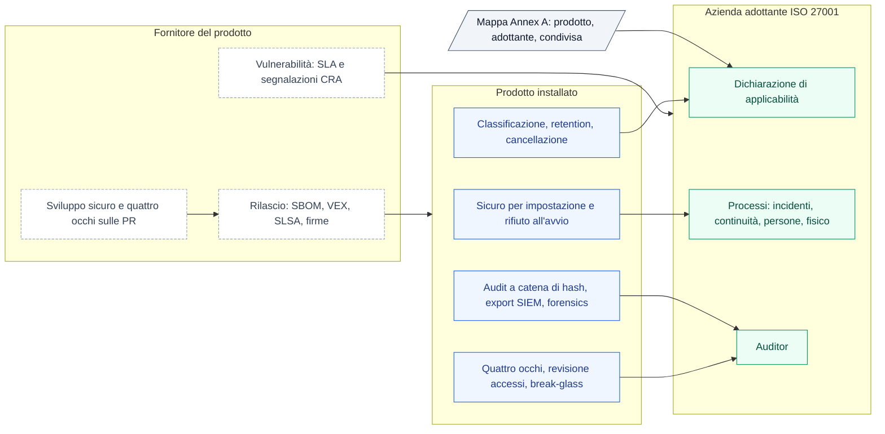

### 3.16 Economia del programma, punteggi esterni, cataloghi esterni, missioni (ADR-045)

Quattro funzioni scelte tra le candidate di prodotto perché rendono il programma **governabile dal controllo di gestione** e **alimentabile senza operazioni manuali**; il resto è rinviato (§9). Tutte e quattro sono estensioni di ciò che esiste, non sottosistemi nuovi: il codice attuale ha già `campaign.limits.global.maxPoints`, `GET /v1/liability` con `byExpiryMonth`, `attribute_definition` con tipo `NUMBER` usabile nelle condizioni come `member.attributes.<k>`, `reward.type=EXPERIENCE` con tre modi di evasione, e `achievement.metric=STREAK` con `streak_unit`.

**1. Economia del programma** (wallet-service e insight-service; BO-36 «Economia»)
- **Costo del punto**: in `currency` nuovo campo `unit_cost` (valore contabile per punto, con storico `currency_cost_history` per data di validità: cambiarlo non riscrive il passato). Ogni movimento del libro mastro valorizza `cost_at_entry` al costo in vigore alla data di business; la passività (`/v1/liability`) espone anche il controvalore.
- **Valore generato**: per livello e per campagna, il rapporto tra valore economico delle azioni che hanno generato punti (`data.amount` delle azioni di acquisto, o un `value_field` dichiarato per tipo di azione nel catalogo di ingestion) e costo dei punti concessi. Calcolato in insight da `wallet.points.earned` (che porta già `campaignCode`) e dagli snapshot di livello; esposto in `GET /v1/kpi/economics?by=tier|campaign&from=&to=`. Dove il valore dell'azione non è definito, il rapporto è «n/d», mai zero.
- **Budget per campagna con soglie**: `campaign.budget jsonb` = `{maxPoints, maxCost, warnAt: [50, 80, 95], onExhausted: PAUSE|CONTINUE_NO_POINTS|STOP_ACCRUAL}`; `maxPoints` sostituisce e assorbe `limits.global.maxPoints` (letto ancora per compatibilità). Il motore, nel consumare il budget, emette `campaign.budget.threshold` (fatto) al superamento di ciascuna soglia una sola volta e `campaign.budget.exhausted`; experience li trasforma in messaggi agli operatori (inbox backoffice) e webhook; BO-06 mostra la barra del budget. `onExhausted=PAUSE` porta la campagna in `PAUSED` con audit (attore `system`).
- **Punti che scadranno senza essere spesi**: proiezione mensile in wallet, `GET /v1/liability/forecast?months=12`: per ogni mese i punti in scadenza (già noto) più la stima di quanti non verranno spesi, calcolata con il tasso storico di spesa per fascia di anzianità del lotto e per livello (finestra configurabile, default 12 mesi); `confidence` bassa se la storia è più corta della finestra. Configurabile: finestra, se includere i lotti `PENDING`, soglia di allarme sui punti in scadenza nel mese (`liability.expiry.warnAt`) con fatto `wallet.expiry.forecast.threshold`. Il portale e le campagne di sistema (F-CMP-12) usano già l'avviso di scadenza al membro; questa è la vista del programma, non del singolo.

**2. Punteggi di propensione come attributi** (member-service; nessun modello dentro il prodotto)
- Nuovo tipo di `attribute_definition`: `kind=SCORE` con `type=NUMBER`, `range [min,max]`, `validity_days`, `source` (testo: sistema o modello che lo produce), `pii=false`. Un punteggio scaduto (`computed_at + validity_days < oggi`) è **assente** nelle condizioni: `nexists` diventa vera, ogni confronto falsa (regola del cast tipizzato di `docs/06`). Così una campagna non decide su un dato vecchio.
- **Caricamento**: `POST /v1/members/attributes/batch` (fino a 10 000 righe: `memberId|externalId`, `key`, `value`, `computedAt`) e import file via `POST /v1/imports` di M8.7 con `kind=ATTRIBUTES`; client credentials dedicato (`scope=attributes:write`), audit con conteggio e non con i valori, `member.updated:2` solo se cambia un attributo con `pii=false` (già così).
- **Uso**: `member.attributes.churn_risk >= 0.7` nelle condizioni di campagna e nei segmenti dinamici, senza modifiche al motore; BO-03 mostra i punteggi con data di calcolo e fonte; il portale non li vede mai (`portal_visible=false` forzato per `kind=SCORE`).
- **Fuori perimetro**: addestrare o eseguire modelli, spiegare i punteggi, decisioni automatiche con effetto giuridico sul membro (GDPR art. 22: un punteggio può modulare un'offerta, non negare un premio dovuto; regola nel validatore delle campagne: un `SCORE` non può comparire nelle condizioni di una campagna con effetto negativo o nelle regole di idoneità di un premio).

**3. Premi da cataloghi esterni** (reward-service; adattatori)
- Nuovo `fulfilment=EXTERNAL` con `provider_code` e `external_sku`; nuova tabella `reward_provider` (`code`, `adapter` (`GIFT_CARD_GENERIC_REST`, `EXPERIENCE_GENERIC_REST`, `WEBHOOK`), `base_url`, credenziali dal secret manager, `sync_catalog bool`, `sync_stock bool`, `reserve_ttl_minutes`, stato `ACTIVE|DEGRADED|DISABLED`, ultimo esito). Gli adattatori sono un'interfaccia in `lh-common` (`catalog()`, `stock(sku)`, `reserve(sku, redemptionId)`, `confirm(reservationId)`, `release(reservationId)`, `status(reservationId)`) con due implementazioni generiche a mappatura configurabile (JSONata o JSON path sulla risposta) e una a webhook per i fornitori che non hanno API di catalogo: aggiungere un aggregatore specifico è un adattatore, non una fetta di dominio.
- **Saga estesa**: `PENDING` → `reserve` presso il fornitore (risposta `RESERVED` con `reservationId`, scadenza) → spesa punti nel wallet (come oggi) → `confirm` → `FULFILLED` con il codice o il voucher ricevuto (`coupon_code` / `fulfilment_note` / `voucher_url`); ogni rifiuto o timeout **prima** della spesa rilascia la riserva senza toccare i punti; un fallimento del `confirm` dopo la spesa → `needs_attention`, riprova con `Idempotency-Key` (§3.10 punto 7) e, oltre il limite, rimborso automatico (F-RWD-07) con fatto `reward.redemption.refunded` e voce audit. Ogni chiamata al fornitore ha timeout, circuit breaker e passa dal controllo SSRF (§3.10 punto 6); i fornitori sono destinazioni di rete dichiarate (*Fermati e chiedi*).
- **Catalogo e giacenza**: job di sincronizzazione (default ogni ora, configurabile) che crea o aggiorna premi in `DRAFT` con `origin=PROVIDER_SYNC` e mai li pubblica da solo (P6, l'operatore o `LEGAL` approva); `stock_remaining` per gli `EXTERNAL` è la giacenza del fornitore alla sincronizzazione, con `stock_mode=PROVIDER` (mai decrementato localmente); un fornitore `DEGRADED` (tre errori consecutivi) nasconde i suoi premi dal portale con stato `degraded` per sezione (già previsto nel portale) e allarme; BO-37 «Fornitori premi» con esito delle sincronizzazioni e riserve aperte.
- **Dati personali**: al fornitore va solo ciò che il premio richiede (e-mail per la consegna del voucher, indirizzo per gli oggetti fisici), passando da member-service come per la consegna esterna dei messaggi (ADR-032): il reward-service chiede al modulo `delivery` di inoltrare i dati di contatto al fornitore, non li possiede. Il fornitore è un responsabile del trattamento e compare nel registro dei trattamenti generato (§3.15 punto 4).

**4. Missioni e serie a tempo** (gamification-service; nuovo tipo del Registry)
- **Serie**: `achievement.metric=STREAK` esiste già (giorno/settimana); si completano `streak_unit=MONTH`, la **tolleranza** (`grace_units`: quante unità si possono saltare senza azzerare), il **congelamento** su evento (`freeze_on: [member.status.changed→SUSPENDED]`), la **ripresa** (`on_break: RESET|HALVE`) e l'emissione di `achievement.streak.at_risk` quando manca un'unità alla rottura (per un messaggio «non perdere la serie»).
- **Missioni**: nuova entità `mission` (`code`, `name/description` `LocalizedText`, `window` (`{from, to}` fisso oppure `{startsOn: FIRST_QUALIFYING_ACTION, durationDays}` relativo al membro), `steps[]` ordinati o liberi, ciascuno con `action_types`, `filter`, `target`; `reward` (`points`, `badge`, `plays`, `coupon`) emesso come **azione interna** `mission.completed` (come `contest.won`, F-IW-06: sono le campagne a decidere i punti, la missione non accredita da sola); `repeatable` con `cooldown`; `audience` come le campagne; `status` con la macchina a stati comune e approvazione `LEGAL` solo se il premio è un concorso). Progresso per membro in `mission_progress` (`step_index`, `values`, `started_at`, `expires_at`, `completed_at`); fatti `mission.started/progressed/completed/expired`. Il portale mostra la missione con il blocco Registry `mission_card` (passi, tempo residuo, premio) e le serie con `streak_widget`; BO-38 «Missioni» con imbuto per passo e tasso di completamento.
- **Coerenza con il resto**: una missione non è una campagna (non produce effetti) e non è un obiettivo (ha finestra e passi); il costruttore riusa il costruttore di condizioni del backoffice; le finestre relative al membro sono la novità di calcolo: valutate dal consumer con il `time` dell'azione, mai con l'orologio del server.

```mermaid
flowchart LR
  accTitle: Le quattro estensioni e dove si innestano
  accDescr: L'economia del programma vive nel wallet e in insight; i punteggi esterni entrano come attributi del membro e vengono letti dalle condizioni delle campagne; i premi esterni passano da adattatori nella saga di riscatto; missioni e serie vivono nella gamification e premiano tramite azioni interne valutate dalle campagne.
  EXT1[Modelli esterni] -->|"batch attributi kind=SCORE"| MS[member-service]
  MS -->|"member.attributes.churn_risk"| CMP[campaign-service: condizioni]
  CMP -->|"points.grant con budget e soglie"| WAL[wallet-service: costo, passività, previsione]
  WAL --> INS[insight: economia per livello e campagna]
  INS --> BO["BO-36 Economia"]
  GAM[gamification: missioni e serie] -->|"mission.completed come azione interna"| CMP
  RWD[reward-service: saga con riserva e conferma] -->|adattatore| EXT2[Cataloghi esterni]
  RWD -->|"spesa punti"| WAL
  classDef svc fill:#EFF6FF,stroke:#2563EB,color:#1E3A8A
  classDef store fill:#F1F5F9,stroke:#475569,color:#0F172A
  classDef topic fill:#FEF3C7,stroke:#D97706,color:#78350F
  classDef ext fill:#FFFFFF,stroke:#94A3B8,stroke-dasharray:4 2,color:#334155
  classDef human fill:#ECFDF5,stroke:#059669,color:#064E3B
  class MS,CMP,WAL,INS,GAM,RWD svc
  class EXT1,EXT2 ext
  class BO human
```

```mermaid
stateDiagram-v2
  accTitle: Riscatto di un premio da catalogo esterno
  accDescr: La richiesta riserva il premio presso il fornitore, poi spende i punti, poi conferma; ogni fallimento prima della spesa rilascia la riserva senza toccare i punti; un fallimento dopo la spesa passa per la riprova e infine per il rimborso automatico.
  [*] --> PENDING
  PENDING --> RESERVED: reserve ok
  PENDING --> REJECTED: reserve rifiutata o timeout
  RESERVED --> CONFIRMED: wallet.points.spent
  RESERVED --> REJECTED: wallet rifiuta, riserva rilasciata
  CONFIRMED --> FULFILLED: confirm ok, voucher ricevuto
  CONFIRMED --> NEEDS_ATTENTION: confirm fallito
  NEEDS_ATTENTION --> FULFILLED: riprova con Idempotency-Key
  NEEDS_ATTENTION --> REFUNDED: oltre il limite di riprove
  FULFILLED --> [*]
  REJECTED --> [*]
  REFUNDED --> [*]
```

---

## 4. Catalogo funzionale di Fase 2

ID `F2-<DOM>-nn`; priorità P0 = necessaria al minimo enterprise (M8–M12), P1 = M13–M15.

| ID | Feature | Pr. | Milestone |
|---|---|---|---|
| F2-DIST-01 | Immagine unica multi-arch con ruoli e modalità | P0 | M8.1 |
| F2-DIST-02 | Chart Helm con operatori di default, valori per servizi gestiti | P0 | M8.3 |
| F2-DIST-03 | Compose di riferimento (ruoli + infra open source) | P0 | M8.3 |
| F2-DIST-04 | Modalità `embedded` (Postgres in-process, bus in-process, volume) | P0 | M12.1 |
| F2-DIST-05 | CLI `lh` (init, doctor, migrate, config validate, backup, restore) | P0 | M12.2 |
| F2-DIST-06 | Wizard di primo avvio (admin, programma, package) | P0 | M12.3 |
| F2-DIST-07 | Program package export/import versionato | P1 | M13.3 |
| F2-DIST-08 | Rilascio firmato: SBOM, cosign, note di sicurezza, percorso N−1 → N | P0 | M8.5, M12.4 |
| F2-IAM-01 | Keycloak ruolo `idp`, realm as code | P0 | M8.2 |
| F2-IAM-02 | Servizi resource server JWT; `ActorContext` dal token | P0 | M8.2 |
| F2-IAM-03 | Login e registrazione membri via OIDC; `member.external_id = sub` | P0 | M8.2 |
| F2-IAM-04 | Broker verso IdP aziendale e federazione LDAP (documentati e provati) | P0 | M8.2 |
| F2-SEC-01 | Gateway con JWT, rate limit, CORS per widget, header di sicurezza | P0 | M8.5 |
| F2-SEC-02 | Mesh mTLS, network policy, ACL Kafka, ruoli DB per servizio (owner/app), External Secrets, Pod Security `restricted` | P0 | M8.5 |
| F2-SEC-03 | Supply chain in CI (SBOM, scansione, firma, CodeQL, secret scanning, IaC) | P0 | M8.5 |
| F2-SEC-04 | Cifratura a colonna dei contatti nel member-service | P0 | M8.4 |
| F2-SEC-05 | Impronta firmata degli istanti, verbale, export ritenuta | P1 | M14.4 |
| F2-SEC-06 | BFF con sessione server-side, CSRF, back-channel logout, passkey, MFA operatori | P0 | M8.2 |
| F2-SEC-07 | Client credentials per fonti e job; token exchange per i widget | P0 | M8.2 |
| F2-SEC-08 | Messaggi firmati sul bus con elenco dei produttori ammessi e validazione in consumo | P0 | M8.10 |
| F2-SEC-09 | Deny by default (`@RequiresRole`/`@PublicEndpoint`), `MemberPrincipal` nel portale, DTO espliciti | P0 | M8.10 |
| F2-SEC-10 | Builder SQL con allowlist, regole Semgrep, limiti di input, template senza logica, sanitizzazione contenuti | P0 | M8.10 |
| F2-SEC-11 | Difesa SSRF, `Idempotency-Key`, rate limit per membro, controlli sui file caricati | P0 | M8.10 |
| F2-SEC-12 | Verifica continua: ArchUnit, Semgrep, Schemathesis, ZAP, `TB-SEC`, tabella ASVS, `SECURITY.md` | P0 | M8.11 |
| F2-SEC-13 | Bridge audit Directus → `audit_entry` (`POST /v1/audit/external` su experience-service, HMAC) | P0 | M8.12 |
| F2-SEC-14 | Bridge audit Keycloak → `audit_entry` (admin events + user events, event listener SPI) | P0 | M8.12 |
| F2-SEC-15 | Attività del membro (`member_activity_entry`, BO-03 estesa, portale PT-18 «La mia attività»), retention audit 400 giorni, sola-inserzione | P0 | M8.12 |
| F2-GRC-01 | Mappa Annex A 2022 con responsabilità condivisa, mappe ISO 27701, GDPR, NIS2 | P0 | M12.6 |
| F2-GRC-02 | Rifiuto all'avvio con configurazione insicura, `lh doctor --security`, nessuna telemetria in uscita | P0 | M12.6 |
| F2-GRC-03 | Quattro occhi: niente auto-approvazione, operazioni sensibili con doppio controllo configurabile | P0 | M8.13 |
| F2-GRC-04 | Deprovisioning dall'IdP, revisione periodica degli accessi (BO-34), break-glass | P0 | M8.13 |
| F2-GRC-05 | Classificazione `x-lh-class`, registro dei trattamenti, retention per categoria con rapporto, esportazioni controllate | P0 | M8.13 |
| F2-GRC-06 | `erasure_log` riapplicato al ripristino, crypto-shredding dei contatti, `lh data mask`, `lh decommission` | P0 | M8.13, M12.6 |
| F2-GRC-07 | Audit a catena di hash con ancoraggio immutabile, export OCSF, `lh forensics export`, prova di ripristino mensile | P0 | M8.12, M12.6 |
| F2-GRC-08 | Pacchetto di rilascio: SBOM, VEX, SLSA L3, report; SLA vulnerabilità, processo CRA, politica LTS, rapporto licenze | P0 | M12.4, M12.6 |
| F2-GRC-09 | Identità propria degli agenti (GitHub App) e approvazione obbligatoria delle PR prima di v1.0 | P0 | M8.0, M12.4 |
| F2-ECO-01 | Costo del punto con storico, `cost_at_entry`, controvalore della passività | P1 | M13.4 |
| F2-ECO-02 | Valore generato per livello e per campagna (`/v1/kpi/economics`), BO-36 | P1 | M13.4 |
| F2-ECO-03 | Budget per campagna con soglie, fatti `campaign.budget.*`, azione a esaurimento, barra in BO-06 | P1 | M13.4 |
| F2-ECO-04 | Previsione dei punti in scadenza non spesi (`/v1/liability/forecast`), soglia e allarme configurabili | P1 | M13.4 |
| F2-SCO-01 | `attribute_definition.kind=SCORE` con validità, batch e import attributi, uso nelle condizioni, mai nel portale, vincoli art. 22 nel validatore | P1 | M13.5 |
| F2-RWD-09 | `fulfilment=EXTERNAL`, `reward_provider`, adattatori generici REST e webhook, saga con riserva/conferma/rilascio, rimborso automatico | P1 | M13.6 |
| F2-RWD-10 | Sincronizzazione catalogo e giacenza in `DRAFT`, stato `DEGRADED`, BO-37 «Fornitori premi» | P1 | M13.6 |
| F2-GAM-01 | Serie: unità mese, tolleranza, congelamento, ripresa, `streak.at_risk`, blocco `streak_widget` | P1 | M13.7 |
| F2-GAM-02 | Missioni a tempo con passi e finestra relativa, azione interna `mission.completed`, blocco `mission_card`, BO-38 | P1 | M13.7 |
| F2-EVT-01 | Contratti con `x-lh-pii`, test che vieta PII sul bus, compat check contro ultimo tag | P0 | M8.4 |
| F2-EVT-02 | `member.registered/updated` `:2` senza PII; doppia lettura | P0 | M8.4 |
| F2-EVT-03 | Modulo `delivery` nel member-service con adattatori SMTP/WEBHOOK | P0 | M8.4 |
| F2-EVT-04 | Partizioni e concorrenza configurabili; retention lunga | P0 | M8.3 |
| F2-ING-01 | `POST /v1/events/batch` fino a 1000 | P0 | M8.7 |
| F2-ING-02 | Import file asincrono con rapporto (BO-32) | P0 | M8.7 |
| F2-API-01 | OpenAPI generata e verificata; `contracts/api/` | P0 | M8.8 |
| F2-API-02 | Widget kit web components | P0 | M10.6 |
| F2-OBS-01 | OTel → Prometheus/Loki/Tempo/Grafana nel chart, dashboard SLO | P0 | M8.6 |
| F2-QA-01 | Harness `e2e/`, journey DSL, invarianti | P0 | M9.1–M9.2 |
| F2-QA-02 | Matrice device, screenshot, axe/pa11y | P0 | M9.3 |
| F2-QA-03 | Carico k6 con profili 100k–2M membri | P0 | M9.4 |
| F2-QA-04 | Test di installazione (3 tagli) e di aggiornamento N−1 → N | P0 | M9.5, M12.5 |
| F2-QA-05 | Gate di sicurezza (ZAP baseline, scansioni) e chaos notturno | P1 | M9.5, M15 |
| F2-EXP-01 | Element Registry con generazione e drift check | P0 | M10.1 |
| F2-EXP-02 | Directus nell'immagine: schema generato, SSO, ruoli, `ref_*`, estensioni | P0 | M10.2 |
| F2-EXP-03 | `experience-service`: composizione versionata, notify-and-pull, validatore, rollback | P0 | M10.3 |
| F2-EXP-04 | Renderer del portale su composizione (set chiuso) + `GET /v1/portal/pages` | P0 | M10.4 |
| F2-EXP-05 | «Usato in» e avviso oggetto LIVE non esposto (BO-14/06/11, BO-31) | P0 | M10.5 |
| F2-EXP-06 | Page builder completo: pagine libere, navigazione, tutti i blocchi | P1 | M13.1 |
| F2-EXP-07 | Feature flag e interruttori (giochi, riscatti, registrazioni, manutenzione) | P1 | M13.2 |
| F2-DS-01 | Token a tre livelli, profili `brand`/`pa`, tema dal CMS | P0 | M10.4 |
| F2-DS-02 | Blocchi strutturali AgID e validatore di conformità | P0 | M10.4 |
| F2-DS-03 | Accessibilità WCAG 2.1 AA verificata + `lh a11y-report` | P0 | M9.3, M12.2 |
| F2-I18N-01 | UI multilingua con prefisso URL, lint, formati | P0 | M11.1–M11.3 |
| F2-I18N-02 | `MessageSource` backend, `LhException` a chiavi | P0 | M11.4 |
| F2-I18N-03 | `LocalizedText`, `member.locale`, inbox nella lingua del membro, seed EN | P0 | M11.5 |
| F2-AST-01 | `assistant-service`: import regolamento, bozza con evidenze | P1 | M14.1–M14.2 |
| F2-AST-02 | BO-33 revisione e applicazione in DRAFT | P1 | M14.3 |
| F2-AST-03 | Golden set, record/replay, eval notturna | P1 | M14.4 |
| F2-OPS-01 | SLO, runbook, prova DR, game day, penetration test | P1 | M15 |
| F2-GOV-01 | Ruleset `main-protetto`, impostazioni del repo, `CODEOWNERS`, modello di PR, Dependabot | P0 | M8.0 |
| F2-GOV-02 | Controllo `guard` (ADR solo in aggiunta, ID seed invariati) | P0 | M8.0 |
| F2-DOC-01 | Mintlify unico sito: `site/`, dismissione GitBook e `docs_v2/` | P0 | M8.9 |
| F2-DOC-02 | Specifiche ed eventi generati (`docs-sync`), riferimento API da OpenAPI | P0 | M8.9 |
| F2-DOC-03 | Catalogo minimo dei diagrammi Mermaid e controllo `check-mermaid` | P0 | M8.9 |
| F2-DOC-04 | Documentazione in inglese (`navigation.languages`) | P0 | M11.6 |
| F2-DOC-05 | `erDiagram` per scheda servizio, `stateDiagram-v2` per ogni ciclo di vita, mapping fonte→azione→effetto→saldo (§3.12-bis) | P0 | M8.9 |

## 5. Schermate nuove o modificate

| ID | Schermata | Note |
|---|---|---|
| HUB-02 | Demo Hub `enterprise` | tessere per ruolo (`hub, web, cms, idp`) e per infrastruttura; stato migrazioni; sostituisce la scelta persona con il login |
| BO-31 | Composizione | versione attiva/precedente, ultima sincronizzazione, «Sincronizza», «Ripristina precedente», utilizzi, esito del validatore, «Apri in Directus» |
| BO-32 | Import | job di import file, rapporto per esito, riprova non abbinati |
| BO-33 | Importa regolamento | M14 |
| BO-03 (estesa) | Scheda membro | tab «Attività»: login, consensi, giocate, riscatti (`member_activity_entry`), sola lettura |
| BO-14/06/11 | «Usato in» | riquadro utilizzi + avviso «LIVE ma non esposto» |
| BO-19 | Consegna esterna | esiti `message.delivered` per canale (SMTP/WEBHOOK) |
| PT-15 | Pagina editoriale | resa dal blocco `rich_text`/`faq`/`regulation` |
| PT-16 | Login / registrazione | Keycloak, tema del profilo |
| PT-17 | Selettore lingua | strutturale, obbligatorio nel profilo `pa` |
| PT-19 | Missioni e serie | blocchi `mission_card` e `streak_widget`; tempo residuo, passi, avviso «serie a rischio» |
| PT-18 | La mia attività | blocco `activity_log`; solo i dati del membro autenticato (`MemberPrincipal`); copre GDPR art. 15 |
| BO-34 | Revisione accessi | operatori, ruoli, ultimo accesso, MFA, inattivi; campagna di ricertificazione con esito esportabile |
| BO-36 | Economia | costo del punto e storico, passività con controvalore, previsione scadenze, valore per livello e campagna, budget delle campagne con soglie |
| BO-37 | Fornitori premi | adattatori, esito delle sincronizzazioni, riserve aperte, stato `DEGRADED` |
| BO-38 | Missioni | costruttore di passi e finestra, imbuto per passo, tasso di completamento; serie nella scheda obiettivi |
| BO-35 | Conformità | esito di `lh doctor --security`, verifica della catena di audit, ultime prove di ripristino, rapporti di retention, pacchetto del rilascio installato |

Le schermate di Fase 1 restano con gli stessi ID; in `enterprise` il selettore di persona (PT-14, HUB-01) è sostituito dal login.

---

## 6. Milestone

Convenzioni come `docs/12`: fette `Mn.k`, ogni fetta chiude con la *Definizione di fatto* (`CLAUDE.md §6`, integrata da §7 qui sotto). **Minimo enterprise = M8–M12**; M13–M15 dopo.

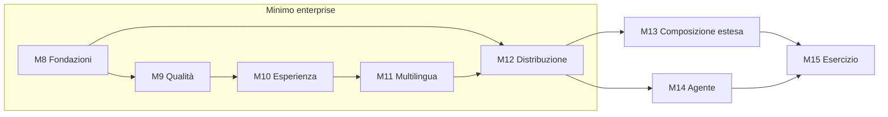

### M8 — Fondazioni enterprise
Fette: **M8.0** adozione e governance: registrazione ADR 026–045 in `docs/13`, aggiornamento `CLAUDE.md`, `docs/12`, `docs/14`, `docs/15`, `docs/01 §4`, `docs/README` (Appendice B); `.github/CODEOWNERS`, `.github/pull_request_template.md`, `.github/dependabot.yml`, `scripts/setup-branch-protection.sh`, job `guard`; al termine il proprietario applica il ruleset e da lì in poi si lavora solo per PR (§3.13) · **M8.1** immagine unica (`deploy/image/Dockerfile` multi-stage, entrypoint a ruoli, `LH_ROLE/LH_SERVICES/LH_MODE=external`, s6-overlay per `all`, base Wolfi, non root, healthcheck per ruolo; CI: build multi-arch su tag, `hub` di Fase 1 = `LH_ROLE=hub`) · **M8.2** identità (Keycloak `idp`, realm as code, BFF con sessione server-side, CSRF, back-channel logout, passkey e MFA operatori, Spring resource server, `ActorContext` dal token, `member.external_id = sub`, client credentials per fonti e job, token exchange per i widget, broker e LDAP provati con un IdP di test) · **M8.3** chart Helm (`deploy/helm/loyaltyhub`, Deployment per ruolo, Strimzi e CloudNativePG di default, `values` per gestiti, migrazioni Job, Ingress + gateway) e compose di riferimento (`deploy/compose/reference.yml`); partizioni e concorrenza configurabili · **M8.4** PII fuori dal bus (`x-lh-pii`, test di contratto, `member.*:2`, doppia lettura, campaign su `birthYear/province`, segnaposto risolti dal BFF, modulo `delivery` con SMTP/WEBHOOK, audit mascherato, cifratura contatti) · **M8.5** sicurezza di piattaforma (gateway con JWT/rate limit/CORS/header, mesh mTLS Linkerd, network policy, ACL Kafka, ruoli DB owner/app per servizio, External Secrets, Pod Security `restricted`, SBOM/Trivy/cosign/CodeQL/IaC/secret scanning in CI, `docs/security/threat-model.md`) · **M8.6** osservabilità (OTel in tutti i ruoli, values Prometheus/Loki/Tempo/Grafana, dashboard SLO) · **M8.7** ingresso batch e import file (BO-32) · **M8.8** OpenAPI generata e verificata (`contracts/api/`) · **M8.10** sicurezza applicativa (§3.10 punti 2–9: firma dei messaggi e `producers.yaml`, validazione in consumo, deny by default e `MemberPrincipal`, builder SQL e regole Semgrep, limiti di input, template senza logica, sanitizzazione, SSRF, `Idempotency-Key`, rate limit per membro, file caricati) · **M8.11** verifica di sicurezza (ArchUnit, Schemathesis, ZAP, testbook `TB-SEC`, `docs/security/asvs.md`, `SECURITY.md`, job `security` obbligatorio) · **M8.12** audit unificato (§3.14: bridge Directus e Keycloak verso `audit_entry`, `member_activity_entry` in member-service, BO-03 estesa, PT-18 «La mia attività», retention audit a 400 giorni e sola-inserzione) · **M8.13** governo di accessi e dati (§3.15 punti 3–4: niente auto-approvazione e quattro occhi configurabili, deprovisioning dall'IdP, BO-34, break-glass, `x-lh-class` e registro dei trattamenti, retention per categoria, `erasure_log` e crypto-shredding, esportazioni con permesso e motivo; catena di hash dell'audit in M8.12) · **M8.9** documentazione (§3.12): contenuti in `site/`, dismissione di GitBook e `docs_v2/`, `docs-sync`, pagine eventi e riferimento API da OpenAPI, catalogo minimo dei diagrammi per le pagine di Fase 1, job `docs` con `broken-links` e `check-mermaid`.

**Accettazione**
- `docker run` dell'immagine con `LH_MODE=external` verso Postgres e Kafka di compose: tutti i ruoli `UP`, migrazioni applicate, smoke di Fase 1 verde con login OIDC reale.
- `helm install` su un cluster kind in CI: pod di tutti i ruoli `Ready`, Strimzi e CNPG provisionati, smoke verde attraverso il gateway.
- Test di contratto: nessun campo `pii:true` in alcun evento pubblicato; `check-contracts` contro l'ultimo tag verde.
- `luca.marketing` via Keycloak non può portare un concorso a `LIVE` (M7.1 invariata sotto OIDC); un membro vede solo i propri dati (test negativo su `memberId` altrui → 403).
- Batch di 1000 eventi accettato con esito per elemento in < 10 s in locale; import file di 10 000 righe con rapporto.
- Pipeline di rilascio produce immagine firmata con SBOM; scansione senza CVE alte.
- Sicurezza: chiamata a `/v1/portal/*` con il token di un membro e l'id di un altro → dati del solo titolare (il parametro è ignorato o `400`); endpoint senza dichiarazione di ruolo → build rossa; messaggio pubblicato da un modulo non ammesso per quel `type` → DLQ `PRODUCER_NOT_ALLOWED` e allarme; payload di iniezione SQL dal fuzzing Schemathesis → nessun `5xx` né effetto; webhook verso `http://169.254.169.254` → rifiutato; secondo riscatto con la stessa `Idempotency-Key` → stesso esito, nessun doppio addebito; nessun token OAuth visibile al JavaScript del browser.
- Un push diretto su `main` viene rifiutato; una PR che modifica il testo di un'ADR esistente fallisce `guard`.
- Una pagina pubblicata in Directus da `luca.marketing` produce una voce in `GET /v1/audit` con `service=cms` e l'attore reale (dal claim OIDC, non "directus"); un cambio di ruolo in Keycloak produce una voce con `service=idp`; nessun `UPDATE` è possibile su `audit_entry` (solo `INSERT`, verificato a livello di privilegi database). Un membro autenticato su `PT-18` vede login, consensi, giocate e riscatti propri e nessun dato di altri membri; `CARE` vede la stessa cronologia da BO-03.
- Governo: un `ADMIN` che sottomette un concorso non può approvarlo (`422 SELF_APPROVAL_FORBIDDEN`); un operatore disabilitato nell'IdP non ha più accesso entro la scadenza dell'access token; un ripristino da backup precedente a un'anonimizzazione non restituisce i dati di quel membro; un'esportazione senza permesso `DATA_EXPORT` o senza motivo è rifiutata; `lh audit verify` segnala una voce alterata direttamente nel database.
- Il sito Mintlify pubblicato da `main` mostra Specifiche, Eventi e Riferimento API generati; ogni pagina del catalogo minimo ha il suo diagramma; `docs` verde.

### M9 — Qualità
Fette: **M9.1** harness `e2e/` (Playwright, client API tipizzato da OpenAPI, personas, macchina del tempo, invarianti; stack CI = immagine `LH_ROLE=all LH_MODE=external` + Postgres e Kafka come service container) · **M9.2** percorsi di `docs/09 §4` + permessi + 4 journey lunghe (anno di un membro, concorso completo, saga premi con annulli, edizione) + fuzz journey con seme, selettori per ruolo/`data-testid` · **M9.3** matrice device (`desktop-chromium`, `desktop-firefox`, `desktop-webkit`, `bo-narrow`, `iPad Pro 11`, `iPhone 15`, `Pixel 7`), screenshot di riferimento con maschere, axe + pa11y, percorsi da tastiera · **M9.4** carico k6 (ingresso azioni, giocate concorrenti, riscatti; profili 100k e 2M membri) con soglie SLO · **M9.5** test di installazione dei tagli disponibili e gate di sicurezza (ZAP baseline); job `e2e-pr` (smoke, 2 progetti) e `e2e-nightly` (matrice completa, report come artifact).

**Accettazione**: invarianti verdi dopo ogni ciclo di ogni journey (Σ lotti = saldo, Σ mesi liability = in circolazione, stock ≤ totale, ogni `contest.won` con tracciato completo senza DLQ, nessun doppione in inbox, una voce audit per scrittura BO); nessuna violazione axe di livello *serious/critical* nella matrice; k6 entro SLO sul profilo 100k; `e2e-pr` < 15 min.

### M10 — Esperienza data-driven (nucleo)
Fette: **M10.1** Element Registry (manifesto, schemi, `registry:build`, drift check, `docs/registry/`) · **M10.2** Directus nell'immagine (ruolo `cms`, versione bloccata, snapshot generato, SSO, ruoli, `ref_*` via webhook, estensioni compilate, DB `cms`) · **M10.3** `experience-service` (rinomina con migrazione dello schema `engagement → experience` e doppia lettura dei consumer group; `composition_version`, notify-and-pull, validatore, rollback, `block_reference`, `GET /v1/portal/pages`; scheda `docs/servizi/experience-service.md`) · **M10.4** design system (token a tre livelli, profili `brand`/`pa`, tema dal CMS, blocchi strutturali, validatore di conformità) e renderer del portale sul set chiuso di pagine e blocchi · **M10.5** BO-31 e «Usato in» (BO-14/06/11) · **M10.6** widget kit.

**Accettazione**: una seconda ruota su un secondo concorso creata in Directus da `luca.marketing` senza rilascio e visibile nel portale entro la pubblicazione; con Directus spento il portale serve la composizione attiva; rollback in un clic; il profilo `pa` senza footer istituzionale non si pubblica (`422`); ogni blocco del set chiuso passa axe su tutta la matrice; `<lh-game>` incorporato in `widgets/example.html` gioca con un token reale; drift check verde.

### M11 — Multilingua
Fette: **M11.1** `next-intl` con `/[locale]`, redirect, lint, formati · **M11.2** estrazione stringhe backoffice · **M11.3** estrazione stringhe portale e widget, frasi generate come messaggi ICU · **M11.4** `MessageSource` e `LhException` a chiavi, `Accept-Language` · **M11.5** `LocalizedText` sulle entità elencate in §3.8, `member.locale`, inbox nella lingua del membro, seed EN, `check-seed` per lingua · **M11.6** E2E in matrice locale × device × profilo; README EN.

**Accettazione**: nessuna stringa letterale in `app/` e `components/` (lint verde); `/en/portal` completo senza fallback mancanti (report `i18n:coverage` = 100 %); un membro con `locale=en` riceve l'inbox in inglese; errori `422` localizzati; il sito Mintlify ha la versione inglese delle sezioni Introduzione, Concetti, Guide, Operazioni.

### M12 — Distribuzione (appliance)
Fette: **M12.1** modalità `embedded` (Postgres in-process con 3 database, bus in-process, asset su volume `/var/lib/lh`) · **M12.2** CLI `lh` (init, doctor, migrate, config validate, backup, restore, a11y-report) · **M12.3** wizard di primo avvio (admin, programma, lingue, profilo, package opzionale; segreti generati e stampati una volta) · **M12.4** pipeline di rilascio (semver, changelog, note di sicurezza, chart pubblicato in OCI, immagini per tag) e guida di installazione/aggiornamento · **M12.5** test di aggiornamento N−1 → N con dati e verifica invarianti · **M12.6** pacchetto di conformità (§3.15: `docs/compliance/iso27001-annex-a.md` e mappe collegate, rifiuto all'avvio e `lh doctor --security`, `lh data mask`, `lh decommission`, `lh forensics export`, export OCSF, prova di ripristino mensile, BO-35, VEX e SLSA nel rilascio, processo di segnalazione CRA in `SECURITY.md`, politica LTS, rapporto licenze).

**Accettazione**: `docker run -p 8080:8080 -v lh-data:/var/lib/lh …:<ver>` → in ≤ 3 min wizard raggiungibile, programma «Club Aurora» importabile, smoke verde; `lh backup` + `lh restore` su installazione pulita = stessi dati (test in CI); aggiornamento da versione precedente senza fermo del portale su Helm (expand/contract verificato). Conformità: `LH_PROFILE=enterprise` con un segreto di default non si avvia; ogni controllo dell'Annex A ha responsabilità ed evidenza dichiarate; il rilascio v1.0 ha SBOM, VEX, provenienza SLSA verificabile e PR tutte approvate da una persona diversa dall'autore.

### M13 — Composizione estesa
Fette: **M13.1** page builder completo (pagine libere, navigazione data-driven, tutti i blocchi del Registry, anteprima per membro da BO-31) · **M13.2** feature flag e interruttori consumati a caldo · **M13.3** program package export/import con versione del Registry e trasformazioni · **M13.4** economia del programma (§3.16 punto 1: `unit_cost` e storico, `cost_at_entry`, `/v1/kpi/economics`, `campaign.budget` con soglie e fatti, `/v1/liability/forecast`, BO-36) · **M13.5** punteggi esterni (§3.16 punto 2: `kind=SCORE`, batch e import attributi, validità, vincoli nel validatore) · **M13.6** cataloghi esterni (§3.16 punto 3: `fulfilment=EXTERNAL`, `reward_provider`, adattatori, saga con riserva, sincronizzazione, BO-37) · **M13.7** missioni e serie (§3.16 punto 4: `mission`, estensioni `STREAK`, blocchi `mission_card` e `streak_widget`, BO-38, PT-19).

**Accettazione (M13.4–M13.7)**: una campagna con `budget.maxPoints=10 000` e `warnAt=[80]` genera un solo `campaign.budget.threshold` all'80 % e va in `PAUSED` all'esaurimento con voce audit; `/v1/liability/forecast` su dati sintetici di 12 mesi restituisce una stima con `confidence` e la soglia genera l'allarme; un punteggio caricato con `validity_days=30` è visibile in BO-03 e, dopo 31 giorni, la condizione `nexists` diventa vera; una campagna con effetto negativo che usa uno `SCORE` è rifiutata dal validatore; un riscatto `EXTERNAL` con fornitore che rifiuta la riserva non spende punti; con `confirm` che fallisce oltre le riprove il membro è rimborsato e la voce audit lo mostra; un fornitore con tre errori passa a `DEGRADED` e i suoi premi escono dal portale con stato `degraded`; una missione a finestra relativa scade in base al `time` dell'azione di avvio anche se il server è avviato dopo; una serie mensile con `grace_units=1` sopravvive a un mese saltato; `mission.completed` produce punti solo tramite una campagna che lo ascolta.

### M14 — Agente regolamento
Fette: **M14.1** `assistant-service`, contratto `regulation-draft.schema.json`, `contest.regulation`, blocco `regulation`, golden set · **M14.2** pipeline (antivirus, PDFBox, per articolo, schema, fusione, quadratura) contro endpoint OpenAI-compatibile · **M14.3** BO-33 e applicazione in DRAFT via API esistenti · **M14.4** record/replay in CI, eval notturna, impronta firmata degli istanti, verbale ed export ritenuta.

**Accettazione**: sul golden set accuratezza per campo ≥ 90 % sui campi obbligatori del concorso; nessuna scrittura `LIVE` possibile dall'agente; con endpoint assente BO-33 spiega come attivarlo.

### M15 — Esercizio
Fette: **M15.1** runbook e dashboard SLO · **M15.2** prova di ripristino DR e game day (pod, broker, AZ) · **M15.3** audit di accessibilità con tecnologie assistive e dichiarazione · **M15.4** penetration test e hardening finale.

---

## 7. Regole d'oro di Fase 2 (delta rispetto a `CLAUDE.md §1`)

Valgono per ogni fetta da M8.0 in poi; le regole 1, 2, 3, 4, 7, 9 di `CLAUDE.md §1` restano invariate.

- **5-bis.** I 5 topic restano i 5 topic. Si scala per partizioni e concorrenza (ADR-028); una suddivisione richiede ADR.
- **6-bis.** Identità reale: OIDC ovunque nel profilo `enterprise` (ADR-027). `X-LH-Actor` e `memberId` espliciti sopravvivono **solo** nel profilo `demo`. Non scrivere codice che gestisce password.
- **8-bis.** Ogni componente infrastrutturale è dichiarato nel chart e nel compose; niente dipendenze fuori da `LH_MODE`. La modalità `embedded` non è HA e lo dice.
- **10. PII mai sul bus.** Un campo `x-lh-pii: true` non entra in un evento pubblicato; il test di contratto lo impedisce (ADR-032).
- **11. Tipi nel codice, istanze nei dati.** Un nuovo blocco, meccanica o canale passa dal Registry e da `registry:build`; non esistono blocchi "speciali" fuori dal Registry (ADR-029).
- **12. Headless-first.** Nessun dato mostrato dal portale o dai widget che non sia ottenibile dalle API in `contracts/api/`.
- **13. Conformità verificata dal software.** Contrasto, blocchi obbligatori, un solo H1, testi alternativi, compatibilità dei contratti e delle API: validatori, non checklist.
- **14. Aggiornabile senza fermo.** Ogni migrazione è expand/contract; ogni fetta lascia funzionante la versione precedente dei consumer (ADR-038).
- **15. L'agente propone, non decide.** Solo `DRAFT`, con evidenze; `LEGAL` approva.
- **16. Solo pull request verso `main`.** Una fetta = un ramo = una PR con gli ID nel titolo; niente push diretti, niente force push; le ADR si aggiungono, non si modificano (ADR-041).
- **17. Documentare con un diagramma.** Ogni fetta che introduce o cambia un concetto, un flusso o un ciclo di vita aggiorna la pagina Mintlify corrispondente con un diagramma Mermaid conforme a §3.12; le specifiche in `site/` non si scrivono a mano (ADR-040).
- **18. Zero trust.** Ogni chiamata, anche tra moduli, porta un'identità verificata: token per l'HTTP, principal e firma per il bus, ruolo per il database. Nessun endpoint senza `@RequiresRole` o `@PublicEndpoint`; nel portale il membro viene solo dal token (ADR-042).
- **19. SQL solo parametrico.** Testo SQL costante o costruito dal builder comune con colonne da allowlist; mai input nel testo SQL (ADR-042).
- **20. Nessun segreto nel codice, nei log o nel browser.** Token solo lato server (BFF), segreti dal secret manager, log senza dati personali né credenziali.
- **21. Ogni scrittura di configurazione lascia una traccia.** Una modifica fatta da un operatore — nel backoffice, in Directus o in Keycloak — produce sempre una voce in `audit_entry` con l'attore reale dal token; `audit_entry` è sola-inserzione (ADR-043). Un nuovo tipo di scrittura di configurazione senza il bridge verso l'audit è un errore di fetta, non un dettaglio da rimandare.
- **22. Nessuno approva se stesso; il prodotto non parte insicuro.** Chi sottomette non approva; le operazioni sensibili hanno doppio controllo configurabile; il profilo `enterprise` rifiuta configurazioni insicure invece di avvisare; ogni funzione nuova dichiara in `docs/compliance/iso27001-annex-a.md` quali controlli tocca e quale evidenza produce (ADR-044).

- **23. I punteggi modulano, non negano.** Un attributo `kind=SCORE` viene da fuori, ha una validità e scaduto è assente; può ampliare un'offerta, mai escludere da un premio dovuto o comparire in un effetto negativo; non è mai visibile al membro (ADR-045). Un fornitore di premi esterno è una destinazione di rete dichiarata e un responsabile del trattamento nel registro.
*Definizione di fatto* integrata: (6) OpenAPI rigenerata e `check-contracts` verde; (7) `registry:build` senza drift quando si tocca un blocco; (8) axe verde sulla matrice `e2e-pr` per le schermate toccate; (9) messaggi in entrambe le lingue da M11 in poi; (10) pagina Mintlify aggiornata con diagramma e job `docs` verde; (11) PR con gli ID nel titolo e `docs/14` aggiornato con il numero della PR; (17-bis) chi tocca una migrazione aggiorna l'`erDiagram` della scheda servizio, chi aggiunge o cambia uno stato aggiorna il relativo `stateDiagram-v2`, chi aggiunge una fonte o un tipo ammesso in ingestion aggiorna il diagramma di mapping fonte→saldo (§3.12-bis); (21) una voce di audit verificata in `GET /v1/audit` per ogni scrittura di configurazione introdotta dalla fetta, con attore reale e nessun `UPDATE` possibile.

*Fermati e chiedi* integrato: nuovo endpoint `@PublicEndpoint`, nuova destinazione di rete in uscita, nuovo produttore per un `type` in `producers.yaml`, nuovo ruolo dell'immagine, nuova collezione Directus fuori dal Registry, nuovo campo `pii:true` in qualunque schema, nuovo provider LLM cloud, qualunque cosa che renda il portale dipendente da Directus a runtime, una nuova scrittura di configurazione che non produce una voce di audit, una nuova esportazione di dati personali, un'impostazione che in `enterprise` può restare insicura, un nuovo adattatore verso un fornitore di premi, un uso di `SCORE` fuori dalle condizioni di campagna e dai segmenti → STOP → ADR o Q in `docs/15`.

---

## 8. Rischi di piano

| Rischio | Segnale | Risposta |
|---|---|---|
| Onere di manutenzione dell'immagine (CVE di Directus, Keycloak, Node, JRE) | > 1 rilascio di sicurezza al mese richiesto | Treno di rilascio mensile + patch fuori ciclo; rivalutare in M12 il bundling di `cms`/`idp` (immagini ufficiali bloccate come alternativa, ADR) |
| Perimetro troppo ampio per la squadra | fette che restano `[~]` oltre due settimane | Tenere il minimo enterprise (M8–M12); M13–M15 solo dopo |
| Cambi alle API delle estensioni Directus | build delle estensioni rotta all'aggiornamento | Estensioni minime (interfaccia `ref_*`, pannello); logica nel servizio, non nel CMS |
| Modelli self-hosted deboli sul testo giuridico | accuratezza < 90 % sul golden set | Estrazione per articolo, esempi few-shot dal golden set, revisione umana comunque obbligatoria |
| Stack di frontiera (Java 25, Boot 4.1) | librerie terze in ritardo | Come Fase 1: Q in `docs/15`, alternative documentate |
| Deriva delle traduzioni e dei seed | `check-seed` per lingua rosso | Blocco in CI, EN generato assistito e rivisto |
| Directus senza licenza in uso aziendale | installatore sopra soglia | Avviso nel wizard e in `lh doctor`; responsabilità dichiarata |

---

---

## 9. Candidate rinviate a una fase successiva

Funzioni discusse e ritenute utili per un programma fedeltà di una multiutility o di un ente, escluse da Fase 2 per il principio P3. Non hanno ID né ADR: entrano in una specifica di Fase 3 quando il minimo enterprise è in esercizio. Le prime due toccano il modello dati e vanno riconsiderate per prime.

| Candidata | Perché | Nota di progetto |
|---|---|---|
| Gruppi di controllo e misura dell'incrementalità | Dimostrare che i punti cambiano i comportamenti, non solo li premiano | Esclusione casuale per campagna e confronto trattati/non trattati; poco codice, grande valore per il controllo di gestione |
| Nucleo familiare / account condiviso | Per una utility il cliente è la fornitura, non la persona | Impatta wallet, livelli e riscatti: decidere il modello prima di aggiungere l'interfaccia |
| Azioni sostenibili con indicatore d'impatto | Bolletta digitale, domiciliazione, autolettura, riduzione dei consumi; kWh o CO₂ risparmiati per il bilancio di sostenibilità | Nuovi tipi di azione e un rapporto: il motore regge già il resto |
| Sconto in bolletta come premio | Il premio più percepito dal cliente di una utility | Premio di tipo credito con adattatore verso la fatturazione, stessa saga di §3.16 punto 3 |
| Donazione dei punti | Coerente con un'azienda di servizi pubblici | `reward.type=DONATION` esiste già; manca la rendicontazione |
| Carta in Apple Wallet e Google Wallet | Canale più usato dopo l'app aziendale | Si appoggia alle API headless (P1) |
| Centro preferenze e profilazione progressiva | Dati dichiarati dal cliente, con consenso | Sondaggi e quiz come azioni; risposte come attributi |
| Antifrode di business a punteggio | Referral abusivi, account multipli, giocate anomale | §3.10 punto 7 dà già i segnali di velocità; manca la regola di punteggio con coda di revisione |
| «Vedi come il membro» per l'assistenza | Riduce i tempi di CARE | Portale in sola lettura con voce di audit |
| Percorsi di comunicazione in più passi | Attesa, condizione, messaggio | Quasi un prodotto a sé: meglio integrare una piattaforma esterna via webhook |
| Modelli predittivi nel prodotto | — | Esclusi per scelta (ADR-045): i punteggi arrivano da fuori |

## Appendice A — Testi ADR da registrare in `docs/13` (fetta M8.0)

Da aggiungere alla tabella indice e in coda al documento, stato `ACCETTATA` (D-1…D-17 sono decisioni del proprietario del 2026-09-24/25). Formato compatto del registro.

### ADR-026 — Profilo `enterprise`: Kubernetes con operatori, Postgres per servizio, Kafka reale
**Contesto.** La Fase 1 ha ottimizzato per il costo zero (ADR-014, 023, 024, 025). La Fase 2 deve produrre un prodotto installabile da qualunque azienda, sicuro e resiliente. **Decisione.** Introdurre il profilo `enterprise`: chart Helm con Strimzi e CloudNativePG di default e servizi gestiti come `values` alternativi; Postgres per servizio (compimento di ADR-007); Kafka reale con 3 broker; ambiente di riferimento EKS eu-south-1. Il profilo `demo` resta un profilo di deploy della stessa immagine. Supera ADR-014 per `enterprise`; attua lo stack dedicato previsto da ADR-012. **Conseguenze.** + Portabilità reale (operatori); + un solo codice per demo e prodotto. − Il team deve saper operare gli operatori; alternativa gestita documentata. **Scartate.** Servizi gestiti di default (lega al cloud); doppio artefatto demo/prodotto.

### ADR-027 — Identità OIDC con Keycloak come ruolo `idp` e Backend-for-Frontend
**Contesto.** ADR-010 rinviava l'identità reale. L'immagine unica deve funzionare anche senza IdP esterno. La *silent authentication* via iframe non funziona più con i cookie di terze parti bloccati e lascerebbe i token nel browser. **Decisione.** Keycloak (Apache 2.0) come ruolo `idp` opzionale della stessa immagine, realm as code, broker verso IdP aziendale e LDAP. Portale e backoffice seguono il pattern **BFF**: il server Next.js è client confidential (Authorization Code + PKCE), il browser ha solo un cookie di sessione `__Host-` `HttpOnly`, i token restano lato server con rotazione del refresh, CSRF con `SameSite` + `Origin` + header, back-channel logout. Passkey per i membri, MFA per gli operatori. Widget: token exchange RFC 8693 dal backend dell'app ospite. Fonti e job: client credentials con `private_key_jwt` o mTLS. Servizi come resource server JWT (`aud=hub`); `ActorContext` dal token; `X-LH-Actor` solo in `demo`. Directus usa lo stesso IdP. Supera ADR-010. **Conseguenze.** + Nessun token nel JavaScript; + nessun codice di password nostro; + funziona con i browser moderni. − Il ruolo `web` diventa stateful (sessioni nel suo database; più repliche condividono lo store); − +~500 MB RAM per `idp` nell'appliance. **Scartate.** Silent authentication via iframe; SPA con token in memoria e refresh nel browser; IdP scritto da noi; solo OIDC esterno.

### ADR-028 — Cinque topic anche in `enterprise`; scala per partizioni; nessuno schema registry
**Contesto.** ADR-004 nasceva dal limite del Kafka gratuito, ma i nomi dei topic sono un contratto tra servizi. **Decisione.** I 5 topic restano; in `enterprise` partizioni (default 12, chiave `memberId`) e concorrenza configurabili; retention lunga su `facts`/`audit` (possibile grazie ad ADR-032). Contratti come JSON Schema nel repo con controllo di compatibilità additiva contro l'ultimo tag in CI; nessuno schema registry. Conferma ADR-004 e ADR-009 con motivazione aggiornata. **Conseguenze.** + Nessun cambio di contratto; + fan-out invariato. − Un consumer lento rallenta il suo gruppo: si risolve con partizioni e repliche. **Scartate.** Topic per dominio (nuova ADR se il lag lo imporrà); Apicurio (componente in più senza beneficio finché gli schemi sono nel repo).

### ADR-029 — Element Registry: tipi nel codice, istanze nei dati
**Contesto.** Serve cambiare numero e contenuto degli elementi del portale senza rilasci, con i tipi definiti a priori. **Decisione.** `registry/elements.yaml` + JSON Schema come unica fonte dei tipi (blocchi, pagine, navigazione, tema, strutturali); da esso si generano lo snapshot Directus, i tipi TS e la documentazione; la CI blocca il drift. Ogni tipo dichiara renderer, sorgenti dati (API pubbliche), `paRequired`, criteri WCAG. **Conseguenze.** + CMS e codice non divergono; + i widget riusano gli stessi renderer. − Un nuovo tipo richiede un rilascio (voluto). **Scartate.** Schema disegnato a mano in Directus (deriva); blocchi generici "HTML libero" (accessibilità e sicurezza non verificabili).

### ADR-030 — Directus dentro l'immagine come piano di composizione (supera in parte ADR-011)
**Contesto.** ADR-011 escludeva un CMS esterno per evitare entità senza lettore. La Fase 2 richiede un editor di composizione data-driven. **Decisione.** Directus come ruolo `cms` della stessa immagine, versione bloccata, schema generato dal Registry, SSO, ruoli Editor/Marketing/Publisher. Ruolo **C1**: il dominio (campagne, premi, concorsi, livelli, obiettivi, template) resta nel backoffice; Directus compone pagine e blocchi e riferisce il dominio tramite collezioni `ref_*` in sola lettura alimentate dai fatti. Il portale non legge mai Directus a runtime (ADR-031). Licenza BSL/MSCL dichiarata a chi installa (README, wizard, `lh doctor`). **Conseguenze.** + Marketing crea una seconda ruota o un'altra pagina senza rilascio; + un solo proprietario per entità; − onere di licenza e di aggiornamento trasferito all'installatore; − Studio non sotto il nostro controllo (accessibilità dichiarata come limitazione). **Scartate.** C2 console unica in Directus (riscrittura dei form); C3 Directus system of record (validazioni asincrone, doppio schema); Payload MIT (scelta del proprietario per Directus).

### ADR-031 — `experience-service` con composizione versionata (notify-and-pull)
**Contesto.** Il portale deve restare disponibile e veloce anche con il CMS spento o compromesso; la selezione dei contenuti dipende da dati loyalty. **Decisione.** engagement-service diventa `experience-service`: mantiene contenuti, inbox e selezione e acquisisce la composizione versionata: Directus notifica (`POST /v1/cms/notify`, segreto), il servizio estrae con token a scope minimo, valida contro Registry e profilo, crea una versione immutabile e la attiva; rollback = riattivare la precedente; `block_reference` per gli utilizzi. Il portale legge `GET /v1/portal/pages/{slug}`. **Conseguenze.** + Directus fuori dal percorso critico; + rollback immediato; + validazione centralizzata. − Doppia copia della composizione (sorgente e versione attiva), per scelta. **Scartate.** Portale che legge Directus (ISR) — dipendenza a runtime; webhook con payload fidato.

### ADR-032 — Dati personali mai sul bus
**Contesto.** `member.registered/updated` trasportano nome, e-mail, data di nascita, città; con retention lunga e topic compattati l'anonimizzazione non può ripulire il bus. **Decisione.** Campi `x-lh-pii` negli schemi; test di contratto che vieta PII negli eventi pubblicati; `member.*` in versione `:2` con soli dati non identificativi (`birthYear`, `province`, `locale`, attributi `pii:false`); segnaposto risolti dal BFF a lettura; consegna esterna dei messaggi in un modulo `delivery` del member-service (unico proprietario dei contatti) con adattatori; audit mascherato; cifratura a colonna dei contatti. Modifica gli snapshot locali di membro (`docs/04`) e i contratti `member.*` secondo `docs/05 §9` (versione `:2`, doppia lettura temporanea). **Conseguenze.** + Retention lunga lecita; + anonimizzazione banale sul bus; − una chiamata in più nel BFF per i nomi; − campaign perde la precisione del giorno di nascita (accettata: `birthYear`). **Scartate.** Crypto-shredding (le chiavi finirebbero sul bus o richiederebbero chiamate sincrone); cifratura dei topic a riposo soltanto (non risolve la retention).

### ADR-033 — Multilingua a tre livelli con prefisso URL
**Contesto.** Q-07; N lingue per installazione; enti PA richiedono selettore esplicito. **Decisione.** UI con `next-intl` e segmento `/[locale]`; backend con `MessageSource` e `LhException` a chiavi; dominio con `LocalizedText` jsonb e risoluzione per `Accept-Language` nelle API portale; `member.locale`; seed multilingua verificato. Fuso sempre Europe/Rome. Decide Q-07. **Conseguenze.** + Lingue aggiungibili senza rilascio (testi) e con rilascio minimo (dizionari UI); − i percorsi del portale cambiano (`/it/portal/...`), redirect mantenuti. **Scartate.** Cookie senza prefisso (non condivisibile, non conforme ai pattern PA); sottodomini per lingua.

### ADR-034 — Strategia di collaudo: journey, invarianti, matrice, carico, installazione
**Contesto.** Gli E2E di Fase 1 erano fuori dal repo e non in CI. **Decisione.** Cartella `e2e/` con Playwright su stack reale (immagine + Postgres + Kafka in CI), journey DSL con macchina del tempo e invarianti di dominio via API, matrice device × lingua × profilo con screenshot e axe/pa11y, k6 per il carico, test di installazione e aggiornamento; `e2e-pr` smoke, `e2e-nightly` completa. **Conseguenze.** + Il bilingue e la composizione sono verificabili per costruzione; − tempi di CI (mitigati con smoke/nightly). **Scartate.** Dispositivi reali (costo); mock delle API per i journey (non provano il sistema).

### ADR-035 — Agente regolamento in `assistant-service`, solo modelli self-hosted, human-in-the-loop
**Contesto.** Il marketing deve poter configurare un concorso da un regolamento; i dati non devono uscire dall'installazione. **Decisione.** `assistant-service` con job asincroni, estrazione per articolo a schema JSON contro un endpoint OpenAI-compatibile self-hosted (`LH_LLM_*`), bozza con evidenze e confidenza, applicazione in `DRAFT` via API esistenti dal BFF, `LEGAL` approva (M7.1); golden set e record/replay; PDF come input non fidato. Agente spento senza endpoint. **Conseguenze.** + Residenza dei dati garantita; − qualità dipendente dal modello disponibile (mitigata dalla revisione umana). **Scartate.** Provider cloud di default; estrazione nel BFF (timeout, nessun audit); Directus Flow (non testabile).

### ADR-036 — Resilienza e obiettivi di servizio
**Contesto.** Prodotto enterprise. **Decisione.** SLO: portale 99,9 %, azione → punti p95 < 5 s, giocata p99 < 500 ms, RPO 15 min, RTO 1 h; repliche multi-AZ, PDB, HPA su lag (KEDA), Kafka RF 3 / ISR 2, Postgres HA con PITR e replica in seconda region, composizione con rollback, prova di ripristino e game day in M15. **Conseguenze.** + Misurabile con le dashboard del chart; − costo infrastrutturale minimo dichiarato. **Scartate.** SLO più aggressivi senza dati (si rivedono con le misure di M15).

### ADR-037 — Distribuzione a immagine unica con ruoli e modalità
**Contesto.** Requisito: installabile da una sola immagine sul Docker di ogni azienda; e insieme resilienza su Kubernetes. **Decisione.** Un'unica immagine multi-arch con `LH_ROLE` (`all·hub·web·cms·idp·jobs`), `LH_SERVICES`, `LH_MODE` (`embedded·external`); tre tagli (appliance, compose, Helm) dalla stessa immagine; appliance dichiarata non HA; CLI `lh`; base minimale non root; firma e SBOM. Il `hub` di ADR-023 diventa `LH_ROLE=hub`. **Conseguenze.** + Un artefatto, una pipeline; + `docker run` in minuti; − immagine grande (~2 GB) e responsabilità sulle CVE di quattro upstream (rischio §8). **Scartate.** Un'immagine per servizio (contraddice il requisito); master container che avvia altri container (richiede il socket Docker: rischio di sicurezza).

### ADR-038 — Politica di rilascio, aggiornamento e supply chain
**Contesto.** Chi installa deve poter aggiornare senza fermo e fidarsi dell'artefatto. **Decisione.** Semver; percorso supportato N−1 → N; migrazioni expand/contract (Flyway, snapshot CMS, realm IdP) con lock; treno mensile + patch di sicurezza fuori ciclo; changelog con note di sicurezza; SBOM, scansione bloccante, firma cosign con verifica opzionale all'ammissione, provenance dalla CI; test di aggiornamento in CI. **Conseguenze.** + Aggiornamenti prevedibili; − disciplina di migrazione su ogni fetta. **Scartate.** Migrazioni distruttive con finestra di fermo.

### ADR-039 — Design system a token con profili `brand` e `pa`; accessibilità come gate
**Contesto.** Il portale deve essere moderno e utilizzabile da enti affiliati alla PA (linee guida AgID: identità visiva e accessibilità); l'accessibilità è comunque obbligo per grandi imprese e per l'EAA. **Decisione.** Token a tre livelli; profili di tema `brand` (Aurora) e `pa` (token, font e icone del Design System .italia, blocchi strutturali obbligatori) selezionati dal CMS; validatore di conformità alla pubblicazione; WCAG 2.1 AA su portale, widget, backoffice, login, verificata da axe/pa11y in CI e da audit con tecnologie assistive in M15; `lh a11y-report` per la dichiarazione. Componenti nostri sui token e pattern ufficiali (opzione C). SPID/CIE e servizi PA fuori perimetro. Integra `docs/07 §5` (che si sdoppia nei due profili). **Conseguenze.** + Un solo codice per due profili; + conformità tracciabile token per token; − mappa "pattern AgID → blocco" da mantenere. **Scartate.** `design-react-kit` come libreria (conflitti CSS, aspetto istituzionale non brandizzabile); tema `pa` senza validatore.

### ADR-040 — Mintlify unico sito di documentazione, docs-as-code con diagrammi Mermaid
**Contesto.** Coesistono GitBook, pagine Mintlify scritte a mano e duplicati in `docs_v2/`: tre copie delle stesse specifiche che derivano. **Decisione.** Mintlify (deployment collegato a `main`) è l'unico sito; contenuti in `site/`; le sezioni Specifiche ed Eventi sono generate da `docs/` e `contracts/events/`, il Riferimento API da `contracts/api/`, le pagine del Registry da `registry/`; diagrammi Mermaid obbligatori per ogni concetto, con `accTitle`/`accDescr` e palette comune; job CI `docs` (drift, link rotti, validità dei diagrammi). GitBook e `docs_v2/` dismessi. **Conseguenze.** + Una fonte per contenuto; + API ed eventi sempre allineati al codice; + concetti comprensibili a colpo d'occhio. − Dipendenza da un servizio esterno per la pubblicazione (il sorgente resta nel repo, portabile). **Scartate.** GitBook (sincronizzazione bidirezionale che crea divergenze); sito statico costruito da noi (manutenzione).

### ADR-041 — Governance del repository: `main` protetto e ADR solo in aggiunta
**Contesto.** Con agenti in parallelo e un prodotto distribuito, un push errato su `main` diventa un rilascio errato; le ADR "non si riscrivono" ma nulla lo impediva. **Decisione.** Ruleset `main-protetto` (solo PR, controlli obbligatori, storia lineare, niente force push né cancellazione, bypass admin solo via PR), merge squash, cancellazione automatica dei rami, secret scanning con push protection, Dependabot, `CODEOWNERS`, controllo `guard` su `docs/13` e ID dei seed; approvazioni a 0 finché c'è un solo maintainer, poi 1 con `CODEOWNERS`. **Conseguenze.** + `main` sempre verde e rilasciabile; + regole del registro applicate dalla CI. − Ogni modifica, anche di documentazione, passa da una PR. **Scartate.** Protezione classica per ramo (i ruleset sono più granulari e versionabili via script); approvazione obbligatoria con un solo maintainer (bloccherebbe il lavoro).

### ADR-042 — Zero trust e sicurezza applicativa verificata dal software
**Contesto.** Nel PoC le letture erano aperte, il portale riceveva `memberId` dalla richiesta, l'ingresso eventi non era autenticato e qualunque modulo poteva pubblicare qualunque `type` sui topic condivisi. Un prodotto enterprise installato da terzi deve reggere un attaccante interno alla rete. **Decisione.** Ogni chiamata porta un'identità verificata e un'autorizzazione minima: token per l'HTTP (anche tra moduli e da Directus), mTLS di mesh in Kubernetes, principal Kafka con ACL e **messaggi firmati** (Ed25519, `lhsig`/`lhkid`) con elenco dei produttori ammessi per `type`, validazione degli schemi anche in consumo, ruoli di database *owner*/*app* per servizio. Deny by default sugli endpoint (`@RequiresRole` o `@PublicEndpoint`), membro solo dal token, DTO espliciti. SQL solo parametrico con builder ad allowlist e regole Semgrep; limiti di input; template senza logica; sanitizzazione dei contenuti; difesa SSRF; `Idempotency-Key` sulle operazioni di valore; controlli sui file. Riferimento OWASP ASVS 5.0 L2 e API Top 10; verifica continua con ArchUnit, Semgrep, CodeQL, Schemathesis, ZAP, testbook `TB-SEC`, penetration test. **Conseguenze.** + Un modulo compromesso non può falsificare fatti di altri moduli né leggere schemi altrui; + le regole sono controlli di build, non convenzioni. − Firma e verifica costano qualche decina di microsecondi per messaggio; − gestione delle chiavi per modulo (automatizzata da `lh init` e dal secret manager). **Scartate.** Fiducia nella rete interna; firma solo sui topic esterni; topic separati per produttore al posto della firma (contraddice ADR-028).

### ADR-043 — Audit unificato: modifiche di backoffice/CMS/IdP e attività del membro
**Contesto.** `insight-service` registra già le modifiche fatte dal backoffice (`audit_entry`, alimentato da `AuditPublisher` in ogni servizio di dominio), ma non quelle fatte in Directus (pagine, blocchi, tema) né in Keycloak (utenti, ruoli, MFA): restano nei log interni di quei due prodotti. Non esiste inoltre una vista dell'attività del singolo membro finale (login, consensi, giocate, riscatti): `PortalActivityController` mostra solo i movimenti punti. La retention di `audit_entry` è 180 giorni, corta per un requisito enterprise. **Decisione.** Un solo registro (`audit_entry`, schema invariato) per tutte le modifiche di configurazione: Directus notifica via `POST /v1/audit/external` (stesso HMAC di `/v1/cms/notify`) a `experience-service`; Keycloak notifica tramite event listener SPI (admin events e user events di cambiamento) verso member-service e verso il servizio che gestisce l'IdP. Retention estesa a 400 giorni, tabella sola-inserzione (nessun `GRANT UPDATE` sul ruolo applicativo). Attività del membro finale come capacità **separata**, non un'estensione dell'audit di backoffice: nuova tabella `member_activity_entry` in member-service, alimentata da eventi Keycloak (login), fatti di dominio (riscatti, giocate, consensi) e azioni dirette dal portale; esposta come BO-03 estesa (operatori) e PT-18 «La mia attività» (il membro, i propri dati soltanto, via `MemberPrincipal`), a copertura dell'accesso GDPR art. 15. **Conseguenze.** + Un solo posto dove cercare "chi ha cambiato cosa", qualunque sia stato lo strumento; + il membro e chi lo assiste vedono la stessa cronologia di attività senza incrociare quattro servizi a mano; + retention coerente con un anno solare di verifiche. − Un endpoint nuovo e autenticato per servizio che riceve i bridge; − il listener Keycloak è un componente in più da mantenere aggiornato alla versione bloccata dell'immagine. **Scartate.** Audit unico per backoffice e membro nella stessa tabella (semantiche diverse: operatore che agisce su altri vs. membro che agisce su di sé, retention e visibilità diverse); esportare i log nativi di Directus/Keycloak così come sono verso un SIEM esterno senza normalizzarli in `audit_entry` (impossibile fare una query unica "cosa ha fatto x" tra backoffice e CMS).

### ADR-044 — Il prodotto come fornitore di un'azienda ISO/IEC 27001
**Contesto.** Chi adotta il Loyalty Hub è spesso certificata ISO/IEC 27001:2022 e, nel caso di utility e PA, soggetta a NIS2; dall'11 settembre 2026 valgono gli obblighi di segnalazione del Cyber Resilience Act. Il codice attuale ammette l'auto-approvazione, ha una retention unica, ripristina i membri anonimizzati, non governa le esportazioni, e le PR degli agenti non possono essere approvate dal proprietario. **Decisione.** Il prodotto si dichiara fornitore e fornisce: mappa Annex A con responsabilità Prodotto/Adottante/Condivisa (più ISO 27701, GDPR, NIS2); rifiuto all'avvio in `enterprise` con configurazioni insicure e nessuna telemetria in uscita; quattro occhi (niente auto-approvazione, doppio controllo configurabile), deprovisioning dall'IdP, revisione degli accessi, break-glass; classificazione `x-lh-class`, retention per categoria con rapporto, `erasure_log` riapplicato al ripristino e crypto-shredding, mascheramento per ambienti non di produzione, esportazioni controllate, dismissione con attestato; audit a catena di hash con ancoraggio immutabile, export OCSF, pacchetto forense, prova di ripristino mensile; per ogni rilascio SBOM, VEX, provenienza SLSA L3, SLA sulle vulnerabilità, processo di segnalazione CRA, politica LTS, rapporto licenze. Gli agenti aprono PR con un'identità propria e le PR richiedono un'approvazione umana prima di v1.0 (supera parzialmente ADR-041 sul numero di approvazioni). **Conseguenze.** + L'adottante integra il prodotto nella Dichiarazione di Applicabilità senza lavoro di ricostruzione; + le evidenze le produce il software, non la memoria degli operatori; + il fornitore regge una valutazione di terza parte. − Più comandi della CLI e un job in più; − il proprietario deve revisionare ogni PR. **Scartate.** "Certificare" il prodotto (la 27001 certifica un'organizzazione, non un software); lasciare all'adottante la cancellazione nei backup (non è in grado di farla senza supporto del prodotto); approvazioni a 0 fino al secondo maintainer (codice senza quattro occhi in produzione presso terzi).

### ADR-045 — Economia del programma, punteggi esterni, cataloghi esterni, missioni
**Contesto.** Il motore copre campagne, valute, livelli, premi, coupon, instant win, obiettivi, classifiche e referral, ma non risponde al controllo di gestione (quanto costa il programma, quanto rende per livello e campagna, quanti punti scadranno inutilizzati, quando fermare una campagna), non usa segnali predittivi, richiede la gestione manuale di codici e giacenze dei premi e non ha meccaniche di continuità nel tempo. **Decisione.** Quattro estensioni di componenti esistenti: (1) economia nel wallet e in insight (`unit_cost` con storico, `cost_at_entry`, valore per livello e campagna, `campaign.budget` con soglie e azione a esaurimento, previsione dei punti in scadenza non spesi con soglia); (2) punteggi di propensione calcolati fuori dal prodotto e caricati come `attribute_definition.kind=SCORE` con validità, usati dalle condizioni esistenti, mai visibili al membro e mai in effetti negativi o idoneità ai premi; (3) premi da cataloghi esterni con `fulfilment=EXTERNAL`, adattatori generici configurabili in `lh-common`, saga riserva → spesa → conferma con rilascio e rimborso automatico, sincronizzazione in `DRAFT`, contatti inoltrati da member-service; (4) missioni a tempo con passi e finestra relativa al membro, serie estese con tolleranza, congelamento e avviso di rischio, premio tramite azione interna valutata dalle campagne. Tutte in M13 (dopo il minimo enterprise). **Conseguenze.** + Il programma diventa misurabile e governabile a budget; + le campagne possono usare segnali predittivi senza portare modelli nel prodotto; + niente giacenze e codici gestiti a mano; + meccaniche di abitudine con la stessa spiegabilità del resto. − Tre nuove schermate e due nuovi blocchi del Registry; − dipendenza da fornitori esterni gestita con stato `DEGRADED` e circuit breaker. **Scartate.** Modelli predittivi dentro il prodotto (competenza e ciclo di vita diversi da un motore di regole); missioni come tipo di campagna (avrebbero mescolato progresso a passi con effetti immediati); un adattatore per ciascun aggregatore nel nucleo (gli aggregatori cambiano: interfaccia generica a mappatura); il budget come solo `maxPoints` (non dice nulla del costo né avvisa prima).

## Appendice B — Modifiche ai documenti esistenti (fetta M8.0)

1. **`docs/13`**: tabella indice + testi dell'Appendice A (ADR-026…045, stato `ACCETTATA`); in ADR-041 aggiungere solo la riga «Superata in parte da ADR-044 (approvazioni)»; ADR-022 resta `PROPOSTA`.
2. **`CLAUDE.md`**: nuova sezione `## 7. Fase 2 (profilo enterprise)` con il testo di §7 di questo documento; in §1 aggiungere la nota «le regole 5, 6, 8 valgono nel profilo `demo`; nel profilo `enterprise` vedi §7»; in §2 (mappa di lettura) aggiungere `docs/18` e `registry/`; in §3 (struttura) aggiungere `registry/`, `widgets/`, `e2e/`, `deploy/image`, `deploy/helm`, `deploy/compose`, `deploy/idp`, `cms/`, `contracts/api/`, `services/experience-service`, `services/assistant-service`; in §4 (comandi) `pnpm registry:build`, `pnpm --filter e2e test`, `lh doctor`; in §6 «Non toccare» aggiungere «`registry/elements.yaml` senza `registry:build` e senza fetta che lo cita».
3. **`docs/12`**: §2 vista d'insieme aggiornata (Fase 2 = M8–M15); §3 aggiungere le milestone M8–M15 copiando §6 di questo documento; §4 sostituire il paragrafo Playwright con il rimando a `e2e/`; §5 aggiungere i rischi di §8.
4. **`docs/14`**: nel *Quadro* aggiungere le righe M8–M15 (`[ ]`); sezione `## M8 — Fondazioni enterprise` con le fette e le feature `F2-*` del catalogo §4; «Prossima fetta da lavorare» = M8.0 dopo la chiusura delle FIN.
5. **`docs/15`**: nuove domande (stato `APERTA`, default proposto = quanto scritto qui): `Q-343` provider di test per il broker OIDC (Keycloak secondario o mock SAML) · `Q-344` granularità di `province`/`birthYear` in `member.*:2` (default: sigla provincia, anno) · `Q-345` adattatore push (`PUSH`) in M8.4 o M13 (default: predisposto) · `Q-346` finestra di doppia lettura `member.*:1`/`:2` (default: fino a M10) · `Q-347` base image (Wolfi vs Debian slim; default Wolfi) · `Q-348` Directus: versione da bloccare e chiave di registrazione MSCL (default: ultima LTS disponibile alla M10.2, variabile predisposta) · `Q-349` set di lingue del seed oltre IT/EN (default: nessuna) · `Q-350` modello open-weight di riferimento per l'eval (default: da scegliere sul golden set in M14.1). Marcare **DECISE**: Q-07 (ADR-033), Q-25 se riguarda la compattazione (ADR-028/032).
6. **`docs/01 §4`**: aggiornare la tabella «Fuori dal PoC» con la colonna «Fase 2» (OIDC → ADR-027; i18n → ADR-033; Kubernetes/DR → ADR-026/036; import massivi → M8.7; e-mail reali → M8.4; Schema Registry → resta P2 per ADR-028; adempimenti concorsi → M14.4; multi-tenant → ADR-013 confermata).
7. **`docs/README.md`, `docs.json`**: voce «18 — Fase 2: piattaforma enterprise». La dismissione di `gitbook-docs.yaml`, `docs/SUMMARY.md` e `docs_v2/` e lo spostamento in `site/` avvengono in M8.9, non in M8.0, per non rompere il sito pubblicato prima che `docs-sync` esista.
8. **`docs/servizi/README.md`**: righe segnaposto per `experience-service` (M10.3) e `assistant-service` (M14.1).
9. **`docs/16` / `docs/17`**: nuovi domini di testbook `TB-DIST`, `TB-IAM`, `TB-EXP`, `TB-I18N`, `TB-AST` in stato «pianificata»; epic `E-F2-*` con le storie principali (una per feature P0 di §4).
10. **`.github/`**: `CODEOWNERS`, `pull_request_template.md`, `dependabot.yml`, job `guard` in `ci.yml`; `scripts/setup-branch-protection.sh` e `scripts/check-adr-append-only.mjs` (§3.13). Il proprietario esegue lo script di protezione **dopo** il merge di M8.0.
11. **`CLAUDE.md §4` e §6**: flusso di lavoro per PR (`gh pr create`, titolo con ID), divieto di push su `main`, regole 16 e 17.
12. **`docs/06-CONVENZIONI-BACKEND.md`**: nuove sezioni per `@PublicEndpoint`, `MemberPrincipal`, builder `SqlWhere`/`SqlOrder`, `Idempotency-Key`, firma dei messaggi, limiti di input; `docs/05`: header `lhsig`/`lhkid` e `contracts/events/producers.yaml`; `docs/15`: `Q-351` mesh (default Linkerd; alternativa Istio ambient) · `Q-352` rotazione delle chiavi di firma degli eventi (default 90 giorni, due `kid` attivi) · `Q-353` POST con `Idempotency-Key` obbligatoria (default: riscatto, giocata, rettifica punti, import) · `Q-354` durata delle sessioni del backoffice (default idle 30 min, massimo 10 h).
13. **`docs/03-MODELLO-DI-DOMINIO.md`**, **`docs/servizi/insight-service.md`**, **`docs/servizi/member-service.md`**: sezione audit estesa con la fonte `cms`/`idp` in `audit_entry` (ADR-043), nuova entità `member_activity_entry` in member-service, retention `audit_entry` corretta da 180 a 400 giorni; **`docs/15`**: `Q-355` formato esatto degli admin/user events di Keycloak da mappare (default: solo gli eventi di cambiamento elencati in §3.14, non ogni login riuscito nell'audit di backoffice) · `Q-356` se `member_activity_entry` richiede un proprio topic o resta lettura diretta da member-service (default: lettura diretta, coerente con "nessuna chiamata sincrona tra servizi" solo per la scrittura via bus, non per l'esposizione read-only al portale).
14. **`docs/06 §7`**: regola `SELF_APPROVAL_FORBIDDEN` e operazioni sensibili con doppio controllo; **`docs/servizi/*.md`**: `x-lh-class` per colonna; **`docs/15`**: `Q-357` regime CRA del titolare (produttore commerciale o *open-source steward*; default: processo di segnalazione attivo comunque) · `Q-358` soglie delle operazioni sensibili con doppio controllo (default: rettifiche > 10 000 punti, chiusura edizione, ruoli, export di dati personali) · `Q-359` periodo di supporto LTS (default: 24 mesi per le versioni LTS, una LTS all'anno) · `Q-360` crypto-shredding attivo di default o su scelta dell'adottante (default: attivo in `enterprise`); nuovo dominio di testbook `TB-GRC`.
15. **`docs/servizi/wallet-service.md`, `campaign-service.md`, `member-service.md`, `reward-service.md`, `gamification-service.md`, `insight-service.md`**: righe segnaposto «Fase 2, M13.4–M13.7 (ADR-045)» per `currency.unit_cost`, `campaign.budget`, `attribute_definition.kind=SCORE`, `reward_provider` e `fulfilment=EXTERNAL`, `mission`; **`docs/05`**: nuovi `type` `campaign.budget.threshold/exhausted`, `wallet.expiry.forecast.threshold`, `reward.redemption.refunded`, `achievement.streak.at_risk`, `mission.started/progressed/completed/expired` e l'azione interna `mission.completed` (con riga in `producers.yaml`); **`docs/15`**: `Q-361` metodo di stima dei punti non spesi (default: tasso storico per anzianità del lotto e livello, finestra 12 mesi) · `Q-362` formato del catalogo degli adattatori generici (default: mappatura JSONata) · `Q-363` chi approva i premi sincronizzati (default: come i premi manuali, `LEGAL`) · `Q-364` limite di passi per missione e di missioni attive per membro (default: 10 passi, 5 missioni).
