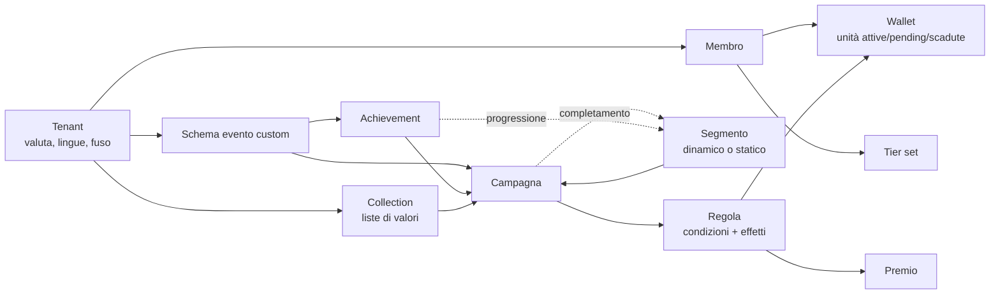

# Linee guida UX del backoffice Loyalty Hub

Stato: **approvate** (ADR-026, 17 settembre 2026) · Fonte: playlist ufficiale [Open Loyalty Feature Showcase](https://www.youtube.com/playlist?list=PLy63lpwi0sbk-9EeR0ZFFX5PN35kLhdNk) (37 video, aprile–dicembre 2024) · Requisiti collegati: RF-137..RF-142 (vedi `docs/SPECIFICA-LOYALTY-HUB.md`, sezione «Backoffice e CMS»)

Il backoffice di Loyalty Hub deve rendere configurabili da un marketer, senza sviluppatori, le stesse leve di Open Loyalty. Questo documento traduce i 37 video della playlist in linee guida UX numerate (LG-xx) da applicare al backoffice Next.js/Payload e le collega ai requisiti funzionali di parità (RF-60..RF-116) e Loyalty 4.0 (RF-125..RF-136).

## Scopo, fonte e metodo

Per ogni video è stata letta la descrizione e analizzati i fotogrammi a intervalli di 6–14 secondi; i video sono quasi tutti senza voce, quindi il comportamento è ricostruito da ciò che si vede.

Limiti:

- **Due generazioni di interfaccia.** I video fino a giugno 2024 mostrano la UI precedente (sidebar viola scura, bottoni maiuscoli); da luglio 2024 c'è il redesign (sidebar chiara a gruppi, topbar con guida e API). Le linee guida seguono la UI nuova e usano la vecchia solo dove aggiunge un comportamento.
- **Niente codice né API.** Ciò che segue riguarda rappresentazione e interazione; la parità funzionale resta nei requisiti RF-60..RF-116.
- **Il simulatore di campagne** è citato più volte ma non viene mai mostrato: il suo comportamento è un punto aperto (vedi fondo).

## Modello mentale del prodotto

Open Loyalty funziona perché pochi oggetti riusabili si citano a vicenda: un segmento diventa condizione di una campagna, una campagna completata diventa condizione di un segmento, un achievement diventa trigger. Il backoffice di Loyalty Hub deve esporre questi stessi mattoni, non schermate verticali per singolo caso d'uso.

Si legge da sinistra: il tenant isola dati e configurazione; campagne e achievement consumano eventi, segmenti e liste; gli effetti delle regole muovono unità nei wallet o assegnano premi; le frecce tratteggiate chiudono il ciclo verso i segmenti.

Come la UI distribuisce gli oggetti (sidebar dopo il redesign di luglio 2024):

| Gruppo sidebar | Voce | Sottopagine (sidebar contestuale) |
| --- | --- | --- |
| Administrator | Global management | Analytics, Settings (Roles, Admins, Tenants, Channels, Translations), Config duplication, Usage |
| General | Dashboard | General overview, Points wallet overview, Additional metrics, Members by tiers |
| General | Members | List of members, Segments, Transactions, Custom events, Referred members, Imports / Exports |
| General | Webhooks | — |
| Loyalty modules | Campaigns | List of campaigns, Campaign simulator, Imports / Exports |
| Loyalty modules | Tiers, Wallets, Achievements, Rewards, Collections | Wallets: Types of wallets, Unit transfers, Imports / Exports |
| Fondo sidebar | Imports / Exports | Tab Imports e Exports con storico |

**Mappa sulla sidebar di Loyalty Hub** (adotta LG-02 e aggiunge i gruppi propri del prodotto):

| Gruppo Loyalty Hub | Voci | Collezioni CMS / servizi |
| --- | --- | --- |
| Amministrazione | Impostazioni, Ruoli, Canali, Traduzioni, Webhook, Andamenti (Superset), Import/Export | `settings`, `roles`, `channels`, `webhooks`, `read-model`, BI (RF-79, RF-78, RF-111..116, RF-120..124) |
| Generale | Dashboard, Membri, Segmenti, Transazioni, Schemi evento, Coda di scarto | `member-service`, `segment-service`, `ingress-adapters` (RF-44..46, RF-71..73, RF-98..101) |
| Moduli loyalty | Campagne, Regole punti, Wallet, Tier, Achievement, Premi, Collection | `rules-engine`, `ledger`, `tier-service`, `engagement-service`, `catalog-redemption` (RF-05..18, RF-60..70, RF-74..76, RF-80..109) |
| Concorsi e programma | Programma annuale, Missioni, Instant win, Registro giocate, Estrazione di recupero | `contest-service` (RF-20..39) |
| Contenuti | Card concorso, Card vincita, Pop-up, Media | CMS (RF-40..42) |
| Decisioni | Policy, Offerte, Esperimenti, Provider previsioni, Regole frode, Routing consegna, Finalità consensi | `decision-service`, `fraud-service`, `notifier` (RF-125..136) |

**LG-01 — Oggetti componibili.** Ogni oggetto configurabile (segmento, collection, achievement, schema evento, premio) deve essere selezionabile per nome dentro condizioni ed effetti degli altri, tramite dropdown con ricerca. *RF-71, RF-80, RF-99, RF-101.*

**LG-02 — Tassonomia a gruppi.** Sidebar divisa in Amministrazione (cross-tenant), Generale (membri, dashboard, integrazioni) e Moduli loyalty. Nel CMS di Loyalty Hub i contenuti (card concorsi, vincite, pop-up) vanno in un gruppo «Contenuti» e i concorsi/programma in «Concorsi e programma», non mescolati ai moduli; il livello decisionale di Loyalty 4.0 ha il proprio gruppo «Decisioni». *RF-40, RF-43, RF-125.*

## Principi trasversali

Sette comportamenti tornano in quasi tutti i video e fanno la qualità percepita del prodotto più delle singole feature.

**LG-03 — Navigazione a due livelli.** Cliccando un modulo la sidebar si sostituisce con i suoi sottomenu e un link «< Modulo» per tornare. Breadcrumb in testa alla pagina («Campagne / Nuova campagna»), tenant switcher sul logo, ricerca globale con scorciatoia ⌘+/. Nella topbar: lingua, guida utente, documentazione API, impostazioni, profilo. *RF-43, RI-05.*

**LG-04 — Una tabella standard per ogni lista.** Stessa anatomia ovunque: «+ Aggiungi filtro», contatore con mini-grafico ad anello «618 (83,5%) di 740 membri», ricerca live con selettore di colonna, intestazioni ordinabili, menu ⋮ per riga, «Gestisci colonne (n nascoste)», paginazione. Righe inattive in grigio. Colonne numeriche allineate a destra con unità nell'intestazione («Spesa media (EUR)»). *RF-44, RF-46, RF-113.*

**LG-05 — Filtri come chip.** Un filtro si costruisce con tre controlli [attributo][operatore][valore] e resta visibile come chip rimovibile («Wallet: uguale a default ✕»). Il contatore si aggiorna subito, così l'utente vede quanta parte della base sta guardando. *RF-44, RF-71.*

**LG-06 — Form lunghi a sezioni fisse.** Ogni oggetto si crea in una pagina unica con sezioni sempre nello stesso ordine: tipo (card) → impostazioni base → logica (condizioni/regole) → attributi custom → limiti → stato → CTA in basso a destra. Lo stato è sempre l'ultima scelta e ha un testo che ne spiega l'effetto («La campagna partirà solo se attiva»). In Loyalty Hub lo stato è il workflow di D14 (vedi «Dove Loyalty Hub fa diversamente»). *RF-40..42, D14.*

**LG-07 — Scelte strutturali come card.** Le decisioni che cambiano il resto del form (tipo campagna, trigger, tipo segmento, tipo achievement) sono card con titolo, descrizione di una riga e checkbox, mai dropdown. Le card degli achievement mostrano anche esempi concreti. *RF-80, RF-90.*

**LG-08 — Aiuto dentro il campo.** Ogni campo non ovvio ha un testo sotto che spiega la conseguenza, non la definizione («le unità scadono il giorno scelto ogni anno dopo mezzanotte, nel fuso impostato»), più un link «Scopri di più» o «esempi di configurazione». Le metriche hanno un tooltip «?» con la definizione. *RF-87, RF-111.*

**LG-09 — Feedback coerente.** Salvataggio sincrono: toast scuro in basso a destra («Campagna creata»). Operazione lunga (import): modale «Import avviato, puoi seguirlo nella lista degli import» con link. Azione distruttiva: avviso rosso fisso nel punto in cui si modifica («modificando le regole si perde il progresso dei membri»). *RF-45, RF-114.*

**LG-10 — Localizzazione per campo.** Nome e descrizione di ogni oggetto hanno «+ Aggiungi traduzione»; la lingua è nell'etichetta («Nome campagna (it)»). Valute del programma nei nomi delle metriche («Spesa totale (EUR)»). Formati numerici e date seguono la lingua dell'utente. *RF-79, RF-115.*

## Linee guida per area funzionale

La campagna è il cuore del prodotto e il suo editor è lo schermo da progettare per primo: tutte le altre aree riusano i suoi componenti (card di scelta, frasi-condizione, formula, limiti).

### Campagne (RF-80..RF-86)

**LG-11 — Tipo e trigger prima di tutto.** Il form parte da due gruppi di card: tipo (Diretta «regole per un membro», Referral «due lati, chi invita e chi è invitato», A tempo) e trigger. Trigger osservati: transazione di acquisto, reso, evento interno, evento custom, achievement completato, codice di riscatto; per le campagne a tempo: giornaliera, compleanno, anniversario di iscrizione, giorni della settimana o del mese. Il trigger scelto filtra le condizioni disponibili più sotto. *RF-80, RF-60, RF-68, RF-69, RF-85.*

**LG-12 — Regole = condizioni + effetti.** Una campagna contiene una o più regole, ciascuna in una card con nome e descrizione modificabili in linea (✎), duplica, elimina, comprimi e ordine trascinabile. Dentro, due blocchi «Condizioni» ed «Effetti» con «+ Aggiungi». Gli scaglioni (500–1.000 € → 100 punti, 1.000–1.500 € → 200) si fanno duplicando la regola e cambiando il range. *RF-80, RF-81, RF-07.*

**LG-13 — Condizioni scritte come frasi.** Una condizione salvata si legge come frase con chip: «1. [Tier] non è uno di [Elite]», «2. [Valore scontrino] è tra [500] e [1000]». Si modifica in un pannello in linea (Tipo → Operatore → Valore, poi Annulla / Salva condizione). Mai mostrare UUID al posto dei nomi. *RF-81.*

**LG-14 — Libreria condizioni con categorie.** «Aggiungi condizione» apre una modale con ricerca e tre categorie: Popolari (le più usate dal team), Dati membro, Basate sul trigger. Le condizioni legate a un contesto lo dichiarano nel nome: «Punti attivi (Wallet premio)», «Spesa media (EUR)». Esiste un tipo «Espressione» (SpEL) per i casi non coperti. *RF-81, RF-84.*

**LG-15 — Filtri sugli articoli come scenari.** Per le transazioni, prima delle regole si definiscono scenari nominati («Scenario 1») che filtrano le righe dello scontrino per categoria, brand, SKU, prezzo, nome o attributo custom, anche con «non in» e con collection. Le condizioni poi citano lo scenario («valore delle righe dello Scenario 1»). Più criteri sullo stesso articolo si combinano in AND, con valori inseriti come tag («scrivi e premi invio»). *RF-62, RF-63, RF-101.*

**LG-16 — Effetti con formula guidata.** Tipi di effetto: aggiungi unità, togli unità, assegna premio, imposta o rimuovi attributo custom del membro, badge, tier. Il valore è una formula resa come chip («200», «add_days_to_date(transaction.purchasedAt, 7)») con operatori + − × ÷, link a variabili ed esempi. Un clic apre il popup, doppio clic modifica in linea. *RF-82, RF-84, RF-76.*

**LG-17 — Eccezioni visibili al default.** Scadenza e attivazione differita delle unità seguono il wallet. Un toggle «Sovrascrivi regole di scadenza» nell'effetto mostra, quando è spento, la regola ereditata in sola lettura («Scadenza: dopo X giorni») e, quando è acceso, i campi formula con l'avviso «vale solo per questo effetto». Dopo il salvataggio l'eccezione resta in un accordion «Impostazioni avanzate». *RF-66, RF-83, RF-87.*

**LG-18 — Limiti e visibilità separati dalla logica.** Sezione «Limiti» con tre tetti (unità emesse dalla campagna, unità per membro, completamenti per membro; default Illimitato) e budget per periodo. Visibilità come select (tutti / segmento / tier) che fa comparire il campo «Segmenti destinatari», con testo che distingue visibilità (chi la vede) da targeting (chi la ottiene, deciso dalle regole). Ordine di visualizzazione numerico. *RF-65, RF-66, RF-83.*

**LG-19 — Dopo il salvataggio, una pagina di cruscotto.** La creazione porta alla pagina della campagna: badge di stato, menu Azioni, KPI (engagement totale, membri coinvolti) con grafico sul periodo e confronto, poi il riepilogo in sola lettura delle regole. La lista campagne mostra N., Nome, Tipo, Trigger, Stato, Da, A, Creata. *RF-46, RF-111.*

**LG-20 — Sequenze senza editor di flussi.** Le campagne a catena (secondo acquisto, percorsi di tier, referral) non hanno un editor dedicato: si ottengono con un segmento «ha completato la campagna X n volte» usato come visibilità o condizione della successiva. Loyalty Hub parte allo stesso modo, aggiungendo nella pagina campagna un riquadro «Usata da / Usa» che mostri le dipendenze. *RF-86, RF-71.*

### Wallet e unità (RF-87..RF-89)

**LG-21 — Il wallet è una valuta configurata una volta.** Form: nome, codice tecnico, nome singolare/plurale dell'unità («Punto/Punti»), metodo di scadenza (nessuna, dopo X giorni, ogni anno in una data scelta), metodo di attivazione differita, tetto globale e tetto per membro, possibilità di saldo negativo. In Loyalty Hub i due wallet di partenza sono punti premio (`PREMIO`) e punti status (`STATUS`); lo status non è spendibile e la UI nasconde i campi che non si applicano. *RF-87, D05.*

**LG-22 — Dettaglio in linguaggio umano.** La scheda del wallet è in sola lettura a due colonne etichetta/valore e traduce la configurazione in frasi («Scade ogni anno: 30 dicembre»), non in codici. *RF-87.*

**LG-23 — Saldo sempre scomposto.** Ovunque compaia un wallet (profilo membro, dashboard) si mostrano insieme: attive (numero grande), in attesa, spese, scadute, bloccate, totale guadagnato, tetto e residuo al tetto. Il saldo negativo (per esempio dopo un reso) si vede come tale. *RF-88, RF-89, RF-04.*

### Tier (RF-105..RF-107)

**LG-24 — Tier set in due passi.** Primo passo: nome del set, condizioni che valgono per tutti i livelli (punti attivi di un wallet, punti guadagnati in totale, mesi dall'iscrizione), regola di retrocessione e stato. Secondo passo: i livelli come tab («Base», «+ Aggiungi tier») con nome, descrizione e benefici. *RF-105, RF-106.*

**LG-25 — Soglie in una matrice.** Le soglie si inseriscono in una griglia livelli × condizioni; la prima riga (livello base) è a zero e bloccata; «Espandi» apre la vista larga. È il modo più veloce per vedere se la progressione è coerente. *RF-105, RF-12.*

**LG-26 — Tier forzabile a mano.** Nel profilo membro il tier corrente ha un lucchetto che lo blocca contro il ricalcolo (con causale, autore e scadenza), e la sezione Tier mostra ultima promozione, ultima retrocessione, prossimo ricalcolo e barra di avanzamento verso il livello successivo. Per la «discesa morbida» di Loyalty Hub questo riquadro va tenuto. *RF-70, RF-11, RF-107.*

### Segmenti (RF-71, RF-108, RF-109)

**LG-27 — Dinamico o statico dichiarato subito.** Card iniziali: dinamico («si ricalcola dalle condizioni») o statico («da un CSV di membri»). Lo statico, una volta creato, apre uno stato vuoto con Guida import, Importa CSV e CSV di esempio; l'identificativo del CSV è selezionabile (ID, numero carta, email, telefono). *RF-71, RF-100.*

**LG-28 — Un solo modello logico, operatore sempre scritto.** In Open Loyalty le condizioni dentro una «Regola» di segmento sono in OR e le regole tra loro in AND, mentre la campagna usa AND dentro la regola. Loyalty Hub adotta **una semantica unica per tutti i costruttori** (AND dentro la regola, OR tra regole) e mostra sempre l'operatore tra ogni coppia di righe. *RF-71, RF-81.*

**LG-29 — Condizioni di segmento osservate.** Data di iscrizione (esattamente / entro / tra N giorni fa), tier, spesa media in un range, numero di transazioni in un periodo con date, ultima transazione tra X e Y giorni fa, progresso o completamento di un achievement (N volte), completamento di campagna, città, età, canale d'acquisto, brand, SKU. Ogni valore numerico porta l'unità come suffisso nel campo («giorni», «volte», «EUR»). *RF-71, RF-108.*

**LG-30 — Il segmento è anche un report.** La lista segmenti mostra per ognuno membri, valore medio transazione, numero medio transazioni, spesa media. Lo stato «Attivo» spiega che il ricalcolo avviene solo se attivo. *RF-71, RF-112.*

### Achievement (RF-90..RF-97)

**LG-31 — Galleria di modelli come ingresso.** «Crea achievement» apre una griglia di card filtrabile per categoria (Transazioni, Eventi custom, Referral) con ricerca; la prima card è «Configurazione libera», le altre sono modelli con badge di categoria, descrizione del valore di business e «Usa modello». Il modello precompila il form, che resta modificabile. *RF-90, RF-91.*

**LG-32 — Regole come tab con nomi parlanti.** Un achievement può richiedere più regole («Collega account» + «Due acquisti > 10 €»); ogni regola è una tab rinominabile. Ogni regola ha: tipo, trigger, modo di conteggio (numero di occorrenze o somma di un attributo, con esempi nella card), limite di frequenza, obiettivo (Occorrenza: complessiva / ultimi X giorni / consecutiva + valore) e condizioni aggiuntive sull'evento. *RF-90, RF-92.*

**LG-33 — Avvertire prima di perdere progressi.** Sopra le regole un avviso rosso fisso: modificarle azzera il progresso dei membri. Loyalty Hub fa lo stesso e in più chiede conferma al salvataggio indicando quanti membri hanno progresso non nullo. *RF-90, RF-41.*

**LG-34 — Progresso correggibile dal supporto.** Nel profilo membro la tab Achievement elenca progresso («3.378/100.000» con barra), periodi completati e contatore; da ⋮ si apre una piccola modale «Valore attuale 4 → Nuovo valore» con Esci senza salvare / Salva. In Loyalty Hub ogni correzione manuale ha commento obbligatorio e va nel registro di audit con autore e motivo. *RF-18, RF-41, RF-93.*

### Membri (RF-44, RF-72, RF-73)

**LG-35 — Profilo a due colonne.** A sinistra la scheda identità fissa: iniziali, stato, email, codice referral, ID, telefono, numero tessera (ciascuno con icona copia), tier come chip, data di nascita con «tra N giorni», data di iscrizione, segmenti come chip, livello di rischio (RF-133). A destra le tab: Dashboard personale, Timeline, Transazioni, Stato achievement, Premi disponibili, Premi riscattati, Giocate, Consensi, Decisioni. In alto a destra il menu Azioni. *RF-44, RF-72, RF-100.*

**LG-36 — Dashboard personale utile al supporto.** Card metriche: spesa totale, transazioni, valore medio, resi (totale, numero, medio), giorni dall'ultima transazione. Le metriche predittive (spesa prevista, probabilità di acquisto) compaiono solo se il `PredictionProvider` configurato le espone (RF-129). Poi riquadro Tier e wallet scomposti (LG-23). *RF-44, RF-129.*

**LG-37 — Timeline come registro leggibile.** Linea verticale con data, icona e tipo evento in maiuscoletto (MOVIMENTO, PREMIO, TRANSAZIONE, CAMBIO TIER, GIOCATA, DECISIONE), titolo in frase («Guadagnati 984 punti premio: bolletta pagata puntuale») e metadati (ora, punti del movimento, saldo attivo dopo il movimento). Filtrabile per data, tipo e wallet con i chip di LG-05. È lo strumento anti-frode e di assistenza. *RF-44, RF-37, RF-131.*

**LG-38 — Operazioni manuali in modale breve.** Aggiungi/togli unità (tipo, wallet, valore, commento obbligatorio), transazione manuale (dati membro + righe prodotto con «Aggiungi prodotto»), correzione achievement. Sopra la soglia configurata la modale mostra «Richiede seconda approvazione» (quattro occhi). Ogni operazione chiude con toast e compare subito in timeline. *RF-18, RF-38, RF-79.*

**LG-39 — Transazione collegata.** Il dettaglio di una transazione mostra stato di abbinamento al membro, membro abbinato (con link al profilo), righe prodotto con totale e, per un reso, la transazione d'acquisto collegata (RF-62). *RF-62, RI-02.*

### Analytics (RF-46, RF-111, RF-120..RF-124)

**LG-40 — KPI come tab di un solo grafico.** In dashboard e nella pagina campagna i KPI sono una fila di tab (valore grande + tooltip definizione); il KPI selezionato pilota l'unico grafico sotto. Fila KPI generale: iscritti, attivi, ricavi, spesa media, transazioni, valore medio, transazioni medie. Fila wallet: emesse, attive, in attesa, spese, scadute, tasso di riscatto, tasso di breakage. *RF-46, RF-111.*

**LG-41 — Sempre il periodo precedente.** Ogni grafico disegna il periodo scelto a linea piena e il precedente tratteggiato; il tooltip mostra le due date e i due valori. Filtri sotto il grafico (periodo, wallet) e icona download. Completano la pagina una tabella metriche × ultimo giorno/settimana/mese/anno e una ciambella membri per tier con il totale al centro. *RF-111.*

**LG-42 — Vista «Andamenti» separata.** Le analitiche approfondite stanno nella voce Andamenti del gruppo Amministrazione, che incorpora Apache Superset (token ospite, row-level security per ruolo) e deve ereditare LG-40 e LG-41 per coerenza visiva: stessi nomi KPI, stesso confronto con il periodo precedente. *RF-120..RF-124, D20.*

### Import ed export (RF-100, RF-113, RF-114)

**LG-43 — Duplicazione configurazione tra ambienti.** Il multi-tenant è fuori ambito, ma la stessa UI serve a copiare configurazioni tra ambienti (test → staging → produzione): tab per tipo di oggetto (wallet, schemi evento, premi, achievement, campagne), sorgente, checkbox multipla e bottone «Esporta selezionati (n)» disattivo finché non si sceglie qualcosa. *RF-113.*

**LG-44 — Import con revisione delle dipendenze.** Dopo ogni import, pagina «Revisione import» divisa in «Importati» (✓, Visualizza) e «Azione richiesta» (⚠, Modifica) per gli oggetti che citano qualcosa che nella destinazione non esiste. «Modifica» apre il form con il campo mancante in errore e un dropdown per rimapparlo. La pagina ricorda di provare le campagne nel simulatore. *RF-113, RF-08.*

**LG-45 — Import asincroni tracciati.** Tipi: membri, membri in segmento, trasferimenti unità in aggiunta e in detrazione, valori di collection, campagne/achievement/schemi evento in JSON. Upload in modale con dropzone (formato e peso massimo dichiarati), guida e file di esempio. Storico in Import/Export con ID, file, data, tipo e numero record. Export CSV della lista membri con il conteggio nel link («Esporta .CSV (3K)»). *RF-72, RF-100, RF-113, RF-45.*

### Collections, schemi evento, app membro

**LG-46 — Collections per liste lunghe.** Liste di valori (300 SKU, 50 città, 100 partner) create con nome, stato e import CSV o API, poi citate nelle condizioni («[città] è uno dei valori di [Città Piemonte]»). *RF-101.*

**LG-47 — Schemi evento come contratto visibile.** Lista schemi con nome, identificativo tecnico, data, stato e attributi come chip con tipo. Sono esportabili/importabili in JSON. In Loyalty Hub corrispondono ai tipi CloudEvents dell'ingresso multi-fonte, quindi lo schema mostrato è lo stesso JSON Schema validato dal backend (schema registry, RI-05): nessuna doppia definizione. *RF-98, RF-99, RI-05.*

**LG-48 — Lato membro: poche azioni rapide.** L'app di riferimento mostra una barra con Scansiona scontrino, Scansiona codice promo, Il mio codice, e una schermata di esito illustrata con una frase e un solo bottone. Le card concorso e vincita del CMS di Loyalty Hub seguono lo stesso schema esito + CTA unica (RF-48). *RF-69, RF-48, RF-51.*

## Catalogo dei pattern UI

Quindici componenti coprono tutte le schermate viste: costruirli per primi nel design system del backoffice rende le aree successive quasi solo configurazione. I contratti TypeScript sono in `web/backoffice-design-system/patterns.ts`.

| Componente | Dove compare | Regole di comportamento |
| --- | --- | --- |
| DataTable | Tutte le liste | Filtri a chip, contatore con anello e %, ricerca live per colonna, ordinamento, colonne mostra/nascondi e riordina (preferenza salvata per utente), ⋮ per riga, righe inattive in grigio, modalità selezione con barra azioni e contatore |
| FilterBuilder | Liste, timeline | [attributo con ricerca][operatore][valore] → chip rimovibile; nessun bottone «Applica» |
| ChoiceCards | Tipo, trigger, tipo segmento/achievement | Titolo + descrizione + checkbox; selezione singola; opzionalmente esempi; cambia i campi successivi |
| SectionForm | Ogni creazione | Sezioni in ordine fisso (LG-06), CTA in basso a destra, stato/workflow come ultima sezione |
| ConditionRow | Campagne, segmenti, tier, achievement | Frase numerata con chip; azioni modifica/duplica/elimina; editor in linea Tipo → Operatore → Valore; unità come suffisso; operatore logico visibile tra le righe |
| ConditionPicker | Aggiungi condizione | Modale con ricerca e categorie (Popolari, Membro, Trigger); nomi con contesto tra parentesi |
| RuleCard | Campagne, segmenti | Nome e descrizione in linea, duplica, elimina, comprimi, trascina; blocchi Condizioni ed Effetti |
| FormulaInput | Effetti, obiettivi achievement | Chip formula; clic = popup, doppio clic = modifica; link a operatori, variabili, esempi; validazione SpEL prima del salvataggio |
| InheritedSetting | Scadenza/attivazione unità | Toggle «sovrascrivi»; spento = valore ereditato in sola lettura; acceso = campi + avviso di portata |
| TemplateGallery | Achievement, campagne | Tab per categoria, ricerca, prima card «da zero», card con badge, valore di business e «Usa modello» |
| KpiTabsChart | Dashboard, campagna, wallet | Tab KPI con tooltip; un grafico; periodo precedente tratteggiato; filtri periodo/wallet; download |
| EntityProfile | Membro, premio | Scheda identità a sinistra con copia; tab o pannelli a destra; menu Azioni |
| Timeline | Profilo membro | Evento = data, icona, tipo, frase, metadati con saldo dopo; filtri a chip |
| ImportFlow | Membri, segmenti, unità, collection, configurazioni | Dropzone con formato e peso, guida, file di esempio; esito asincrono in modale; storico; pagina di revisione dipendenze |
| EmptyState | Ogni sezione vuota | Icona, titolo d'azione («Aggiungi la prima condizione»), una frase su cosa succede dopo, CTA primaria ed eventuale guida |

Uno stile coerente rende leggibili anche gli stati: toast scuri per le conferme, badge verde/rosso/grigio per Attivo/Inattivo/Bozza, avvisi gialli per conseguenze di navigazione, avvisi rossi per perdita di dati. I token di colore, tipografia e spaziatura sono quelli del mockup «Backoffice Loyalty Hub» (`web/backoffice-design-system/tokens.css`).

## Dove Loyalty Hub fa diversamente

Emulare non vuol dire copiare: sei punti dei video sono deboli o non coprono vincoli già decisi per Loyalty Hub.

| Tema | Cosa si vede in Open Loyalty | Indicazione per Loyalty Hub | Requisito |
| --- | --- | --- | --- |
| Stato degli oggetti | Solo toggle Attivo/Inattivo | Ciclo Bozza → In revisione → Approvato → Verifica Legal → Programmato → Pubblicato → Bloccato (D14), con approvazione Legal per tipo di oggetto; il toggle diventa l'ultimo passo, abilitato solo dopo l'approvazione | RF-137 |
| Logica AND/OR | Semantica diversa tra segmenti e campagne | Un solo modello per tutti i costruttori, operatore sempre scritto tra le righe (LG-28) | RF-138 |
| Riferimenti | UUID mostrato al posto del nome tier | Mai ID tecnici in frasi e chip; ID solo in scheda con icona copia | RF-139 |
| Correzioni manuali | Nessuna traccia del motivo a video | Commento obbligatorio e registro di audit consultabile dal profilo membro | RF-140, RF-18, RF-41 |
| Dipendenze | Catene di campagne ricostruibili solo a mente | Riquadro «Usato da / Usa» su segmenti, campagne, achievement, collection, premi; blocco dell'eliminazione se referenziato | RF-141 |
| Concorsi e instant win | Non presenti nella playlist | Nuovo modulo con lo stesso scheletro (LG-06): regolamento, periodo, istanti vincenti pre-generati (solo conteggio residuo, RF-31), premi, card CMS collegate, stesso cruscotto KPI (LG-40) | RF-142, RF-30..RF-39 |

Per il resto conviene restare vicini all'originale: chi valuta il prodotto confronterà le schermate con Open Loyalty, e i pattern di LG-04, LG-13, LG-17 e LG-44 sono già maturi.

## Mappa video → linee guida → requisiti

Ogni video della playlist è coperto da almeno una linea guida; la tabella segue l'ordine della playlist (dal più recente) e serve per tornare alla fonte quando si progetta una schermata.

| # | Video | Pubblicato | Cosa mostra della UI | LG | RF |
| --- | --- | --- | --- | --- | --- |
| 1 | [Global Management](https://www.youtube.com/watch?v=woVyfvbrCP4) | dic 2024 | Tenant, area Global Admin, duplicazione config, analytics globali | 02, 03, 42, 43 | 111, 113 |
| 2 | [Reward specific products](https://www.youtube.com/watch?v=MjTx7XUKigI) | ott 2024 | Editor campagna completo: scenari, regole, libreria condizioni, formula | 11–16 | 62, 63, 80–84 |
| 3 | [Annual expiration date](https://www.youtube.com/watch?v=VjgEk1NYU9M) | ott 2024 | Form e scheda wallet, scadenza annuale | 21, 22 | 87 |
| 4 | [Segment by registration date](https://www.youtube.com/watch?v=pbSjAeX-KA4) | ott 2024 | Card dinamico/statico, condizione su giorni fa, toast | 27, 29 | 71 |
| 5 | [Pending and expiring units](https://www.youtube.com/watch?v=VUWFP_HjMbU) | set 2024 | Override scadenza nell'effetto, pagina campagna dopo il salvataggio | 17, 19 | 66, 83 |
| 6 | [Segment by tier](https://www.youtube.com/watch?v=MvzfOvhawf8) | set 2024 | Regole di segmento, lista segmenti con metriche | 13, 30 | 71, 112 |
| 7 | [Copy campaigns to tenants](https://www.youtube.com/watch?v=MgwIis_kevk) | ago 2024 | Selezione multipla, modale destinazione, revisione import | 43, 44 | 113 |
| 8 | [Redesign](https://www.youtube.com/watch?v=5v4cbXrH8jw) | lug 2024 | Prima/dopo della navigazione e della dashboard | 02, 03 | 43 |
| 9 | [Anniversary and selected days](https://www.youtube.com/watch?v=b8pr5cuB7w0) | lug 2024 | Trigger a tempo, ripetizione, target, effetto premio | 11, 16, 18 | 60, 76, 85 |
| 10 | [Bulk wallet transfers](https://www.youtube.com/watch?v=vhAQuEoxH7E) | lug 2024 | Pagina Import, tipi di import, wallet nel profilo | 23, 45 | 88, 113 |
| 11 | [Negative wallets](https://www.youtube.com/watch?v=DKCznHNXBWI) | lug 2024 | Profilo membro, premio, transazione manuale e reso collegato | 23, 35, 36, 38, 39 | 04, 18, 44, 62 |
| 12 | [Achievement status control](https://www.youtube.com/watch?v=XER3NV-j_PM) | lug 2024 | Tab achievement del membro, modale correzione | 34 | 93 |
| 13 | [Import/export campaigns](https://www.youtube.com/watch?v=eTlNsmVtp-A) | lug 2024 | Revisione import con «Azione richiesta» e rimappatura | 44 | 113 |
| 14 | [Wallet transactions in timeline](https://www.youtube.com/watch?v=SLudaorxshs) | lug 2024 | Filtri a chip, timeline, trasferimento manuale | 05, 37, 38 | 44, 88 |
| 15 | [Achievement import/export, rule names](https://www.youtube.com/watch?v=iSXIPtMAcCQ) | lug 2024 | Regole come tab, avviso perdita progressi, limiti | 32, 33 | 90, 92 |
| 16 | [Achievement templates](https://www.youtube.com/watch?v=-7xR0b4eHjM) | lug 2024 | Galleria modelli, form precompilato, progresso nel profilo | 31, 34 | 90, 91 |
| 17 | [Transactions in a period](https://www.youtube.com/watch?v=S6Q3KgoyF_A) | giu 2024 | Condizione con range e date, famiglia di segmenti | 29 | 71 |
| 18 | [Reorganize campaign rules](https://www.youtube.com/watch?v=ccV3wDImViw) | giu 2024 | Nome regola in linea, trigger compleanno, wallet ereditato | 12, 17 | 80, 87 |
| 19 | [Custom event schemas export](https://www.youtube.com/watch?v=6S_3t0nYtOo) | giu 2024 | Lista schemi con attributi, export JSON, modale upload | 45, 47 | 98, 113 |
| 20 | [Segment by achievement progress](https://www.youtube.com/watch?v=DxibBp23pVY) | mag 2024 | Obiettivo e formula achievement, visibilità per segmento | 18, 29, 32 | 65, 90 |
| 21 | [Segment by achievement count](https://www.youtube.com/watch?v=DLuk78Bgl6M) | apr 2024 | Condizione «completato N volte» | 29 | 71, 108 |
| 22 | [Multiple criteria](https://www.youtube.com/watch?v=KNIejMbllHg) | apr 2024 | Criteri articolo in AND come tag | 15 | 63 |
| 23 | [Last transaction segments](https://www.youtube.com/watch?v=vO9CgYPLXmI) | apr 2024 | Condizione «tra X e Y giorni» | 29 | 71 |
| 24 | [Import custom segments](https://www.youtube.com/watch?v=NTz1xOojZZg) | apr 2024 | Segmento statico, stato vuoto, import asincrono | 27, 45 | 71, 100 |
| 25 | [AND and OR segments](https://www.youtube.com/watch?v=zVQtwY-ttro) | apr 2024 | Semantica AND di OR | 28 | 71, 138 |
| 26 | [Advanced point metrics](https://www.youtube.com/watch?v=nb7EcI7weGc) | apr 2024 | KPI wallet, riscatto e breakage | 40 | 111 |
| 27 | [Daily campaigns](https://www.youtube.com/watch?v=4TU34IbZfMU) | apr 2024 | Trigger giornaliero con target tier | 11, 18 | 65, 85 |
| 28 | [Custom tiers](https://www.youtube.com/watch?v=lfEx2U81oZQ) | apr 2024 | Tier set, retrocessione, matrice soglie | 24, 25 | 105, 106 |
| 29 | [Expiring points](https://www.youtube.com/watch?v=7HNrC7zFBn8) | apr 2024 | Impostazioni avanzate, data/ora di scadenza | 17 | 83, 87 |
| 30 | [Performance over time](https://www.youtube.com/watch?v=EKZtMS-e6q4) | apr 2024 | Periodo di confronto, metriche aggiuntive, tier a ciambella | 41 | 111 |
| 31 | [Follow-up campaigns](https://www.youtube.com/watch?v=tg7tCHiF7SA) | apr 2024 | Segmento «campagna completata» come catena | 20 | 86 |
| 32 | [Column configuration](https://www.youtube.com/watch?v=WWrKjDRZLm0) | apr 2024 | Popover colonne con toggle e trascinamento | 04 | 44 |
| 33 | [Variables catalogs](https://www.youtube.com/watch?v=PPNSl8u_vtc) | apr 2024 | Collections, import CSV, uso in condizione | 46 | 101 |
| 34 | [Advanced targeting](https://www.youtube.com/watch?v=EsuBfNghT84) | apr 2024 | Condizioni con contesto, lista effetti | 14, 16, 18 | 65, 81, 82 |
| 35 | [Timed achievements](https://www.youtube.com/watch?v=74ap6vJwyVI) | apr 2024 | Modo di conteggio con esempi, ultimi X giorni | 07, 32 | 90 |
| 36 | [Scan codes](https://www.youtube.com/watch?v=Q_nFfRpa2P0) | apr 2024 | App membro: azioni rapide, esito | 48 | 69 |
| 37 | [Condition library](https://www.youtube.com/watch?v=cCu1vMo2mgQ) | apr 2024 | Modale condizioni con categorie | 14 | 81 |

## Punti aperti

- [ ] Simulatore di campagne: mai mostrato; definire input (membro reale o fittizio, evento di prova) e output (regole scattate, unità calcolate) prima di progettarlo. Proposta: riusare `POST /v1/evaluations` del rules-engine (RF-125) e `POST /api/simulate/decision` del CMS, mostrando l'esito con lo stesso RuleCard in sola lettura.
- [ ] Modelli di campagna: Open Loyalty li ha solo per gli achievement; decidere se estendere la galleria (LG-31) anche alle campagne tipiche Iren (autolettura, bolletta digitale, domiciliazione).
- [ ] Doppia valuta punti premio/status: stabilire se un effetto può muovere entrambi i wallet in un'unica riga o servono due effetti. Proposta: due effetti, per tenere una riga = un movimento di ledger.
- [ ] Metriche predittive del profilo (spesa prevista, probabilità di acquisto): hanno senso per clienti utility o vanno sostituite con indicatori di consumo e pagamento? Dipende dai provider configurati in `prediction-providers` (RF-129).
- [ ] Lingua del backoffice: solo italiano o italiano + inglese, dato che LG-10 impone traduzioni per campo. Lo scaffold prevede it/en (RF-79).
