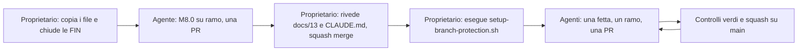
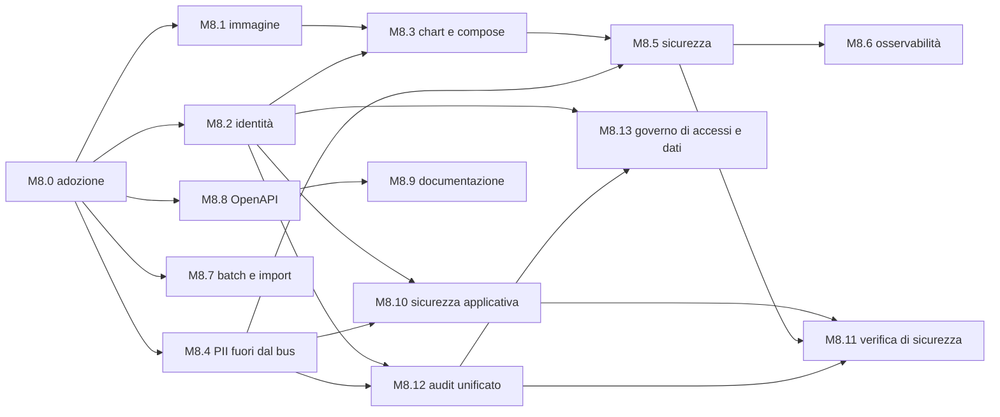

# Fase 2 — Istruzioni per lo sviluppatore (Claude Code)

Prompt da dare a Claude Code per avviare e condurre la Fase 2. La specifica è `docs/18-FASE-2.md`; le decisioni diventano vincolanti con la fetta **M8.0**, che registra le ADR 026–045 in `docs/13`, aggiorna `CLAUDE.md` e prepara la governance del repository.

## 0. Prerequisiti (a carico del proprietario)

- Fette `FIN-*` di Fase 1 chiuse in `docs/14`; `main` verde (`./mvnw verify`, `pnpm lint typecheck test build`, `check-seed`, `check-contracts`).
- Copiati nel repo, così come forniti:
  - `docs/18-FASE-2.md`, `docs/prompts/fase2-kickoff.md` (questo file);
  - `.github/CODEOWNERS`, `.github/pull_request_template.md`, `.github/dependabot.yml`;
  - `scripts/setup-branch-protection.sh` (`chmod +x`), `scripts/check-mermaid.mjs`.
- Una **GitHub App** (o utenza macchina) per gli agenti, installata sul repo con permessi `contents` e `pull_requests`: le PR degli agenti partono da quell'identità e il proprietario può approvarle (ADR-044). Credenziali solo nel secret store dell'ambiente degli agenti.
- Risposte a `Q-343…Q-364` in `docs/15`, **oppure** default accettati (l'agente li applica e marca `SPEC-GAP`).
- Operazioni che solo il proprietario può fare (mai segreti nel repo): organizzazione GHCR per le immagini; cluster di riferimento (o `kind` in CI come minimo); in M8.9 il percorso `site/` nel pannello Mintlify (deployment `poc-0ae60636`); da M14 un endpoint OpenAI-compatibile per l'eval notturna.



## 1. Sessione 0 — Adozione e governance (fetta M8.0)

Ultima volta in cui si può lavorare senza protezione: si lavora comunque su un ramo e si apre una PR, così il flusso è già quello definitivo.

```
Leggi CLAUDE.md, docs/14-STATO-AVANZAMENTO.md e docs/18-FASE-2.md (tutto, incluse le appendici).
Crea il ramo fase2/M8.0-adozione ed esegui la fetta M8.0 come descritta in docs/18 §6, §3.13 e Appendice B,
con un commit per documento:

1. docs/13-REGISTRO-DECISIONI.md: aggiungi ADR-026…045 alla tabella indice e in coda, con i testi dell'Appendice A
   di docs/18 (stato ACCETTATA; ADR-022 resta PROPOSTA). Non riscrivere le ADR esistenti: dove un'ADR nuova ne supera
   una vecchia, aggiungi alla vecchia solo la riga "Superata da ADR-nnn (profilo enterprise)".
2. CLAUDE.md: sezione "## 7. Fase 2 (profilo enterprise)" con il testo di docs/18 §7 (regole 5-bis…23 e integrazioni
   della Definizione di fatto e del "Fermati e chiedi"); aggiorna §1, §2, §3, §4, §6 come da Appendice B punti 2 e 11,
   incluso il flusso di lavoro per PR (ramo fase2/Mn.k-titolo, `gh pr create`, titolo con gli ID, mai push su main).
3. docs/12, docs/14, docs/15, docs/01 §4, docs/README.md, docs.json, docs/servizi/README.md, docs/16, docs/17:
   come da Appendice B punti 3–9. In docs/14 da Fase 2 le fette si spuntano con il numero della PR.
4. Governance (§3.13): verifica che .github/CODEOWNERS, .github/pull_request_template.md, .github/dependabot.yml,
   scripts/setup-branch-protection.sh e scripts/check-mermaid.mjs siano presenti; scrivi scripts/check-adr-append-only.mjs
   (confronta docs/13 con il ramo base: fallisce se righe di un'ADR esistente vengono modificate o rimosse, ammesse solo
   nuove sezioni ADR, nuove righe della tabella indice e la riga "Superata da ADR-nnn"; fallisce se cambia un ID in seed/
   senza la label "decisione") e aggiungi a .github/workflows/ci.yml il job `guard` (nome esatto: guard) che lo esegue
   sulle pull_request. Aggiungi mermaid@11 e jsdom come devDependencies alla radice (o in un package scripts/) per
   check-mermaid, ma NON aggiungere ancora il job `docs`: arriva con M8.9.
5. Apri la PR verso main con titolo "docs(fase2): adozione e governance M8.0 [ADR-026…042, docs/18]" e il modello
   compilato. Non fare merge.

Vincoli: nessun codice di prodotto in questa fetta. Al termine elenca le voci di docs/15 che ritieni bloccanti per
M8.1–M8.4, se ce ne sono.
```

**Passi del proprietario dopo la PR di M8.0**
1. Rivedere `docs/13` (ADR nuove) e `CLAUDE.md §7`: sono le fonti che vincono su tutto.
2. Merge squash della PR.
3. Eseguire `scripts/setup-branch-protection.sh` (prima `--dry-run`). Controlli obbligatori iniziali: `backend (Java 25)`, `web (Next.js)`, `seed`, `contracts`, `guard`.
4. Verificare: `git push origin main` rifiutato; una PR di prova mostra i cinque controlli.
5. Rilanciare lo script aggiungendo i controlli quando nascono: `security` (M8.5, esteso in M8.11 con Schemathesis e ZAP notturni), `docs` (M8.9), `e2e-pr` (M9), `registry` (M10.1). Esempio: `LH_REQUIRED_CHECKS="backend (Java 25)|web (Next.js)|seed|contracts|guard|docs" scripts/setup-branch-protection.sh`.

## 2. Prompt per ogni fetta (modello)

```
Leggi CLAUDE.md (incluso §7), docs/14 e docs/18 §3 e §6 per la milestone corrente; leggi le ADR citate dalla fetta.
Lavora la fetta <Mn.k> "<titolo>" di docs/18 §6 sul ramo fase2/<Mn.k>-<titolo-breve> creato da main aggiornato.
- Implementa solo ciò che la fetta cita, con gli ID F2-* del catalogo docs/18 §4 e gli ID di schermata docs/18 §5.
- Definizione di fatto (CLAUDE.md §6 + §7): test verdi, OpenAPI rigenerata, registry:build senza drift se tocchi un
  blocco, axe verde sulle schermate toccate, stati loading/empty/error/degraded, migrazioni expand/contract.
- Documentazione: aggiorna la pagina Mintlify del concetto toccato con almeno un diagramma Mermaid conforme a
  docs/18 §3.12 (accTitle, accDescr, palette classDef standard, al più ~15 nodi); non scrivere a mano le pagine
  generate (specifiche, eventi, API, registry). Verifica con `node scripts/check-mermaid.mjs`.
- Sicurezza (CLAUDE.md regole 18–21, docs/18 §3.10, §3.14): ogni nuovo endpoint con @RequiresRole o @PublicEndpoint motivato;
  nel portale il membro solo da MemberPrincipal; SQL solo costante o dal builder SqlWhere/SqlOrder; DTO espliciti con
  Bean Validation; nuovi type evento aggiunti a producers.yaml; nessun segreto o dato personale nei log; aggiungi le
  righe TB-SEC pertinenti; ogni nuova scrittura di configurazione (backoffice, Directus, Keycloak) produce una voce
  in audit_entry con l'attore reale dal token; nessuna auto-approvazione; ogni impostazione nuova fallisce l'avvio
  in enterprise se lasciata insicura; aggiorna docs/compliance/iso27001-annex-a.md con i controlli toccati.
- Se serve un nuovo ruolo dell'immagine, un @PublicEndpoint, una nuova destinazione di rete in uscita, una collezione fuori dal Registry, un campo pii:true, un provider LLM cloud
  o una dipendenza del portale da Directus a runtime: fermati e apri una Q in docs/15.
- Scostamenti dalla spec → `// SPEC-GAP: Q-nnn` e voce in docs/15.
- Aggiorna docs/14 (fetta e feature) e, se previsto, la scheda in docs/servizi/.
Apri la PR verso main con titolo "<tipo>(<ambito>): <cosa> [F2-…, ADR-…, docs/18 §…]" e il modello compilato;
dopo l'apertura aggiorna docs/14 con il numero della PR nello stesso ramo. Non fare merge e non fare push su main.
```

## 3. Ordine e parallelismo (per i worktree agent)

Ogni fetta ha il suo ramo e la sua PR verso `main`: i rami di integrazione (`integ*`) di Fase 1 non servono più. Due fette in parallelo non devono toccare lo stesso `contracts/`, lo stesso servizio o lo stesso file di `docs/` nello stesso giorno; se capita, la seconda PR si aggiorna su `main` dopo il merge della prima.



Nota: M8.12 (audit unificato, §3.14) dipende da M10.2 (Directus) solo per il bridge dal CMS — la parte Keycloak e `member_activity_entry` procede subito dopo M8.2/M8.4; se M10 non è ancora chiuso, la fetta M8.12 implementa comunque il bridge Keycloak e l'attività del membro, e aggiunge il bridge Directus come compito residuo tracciato in docs/14 quando M10.2 chiude.

```
M9.1 ──► M9.2 ──► M9.3 ──► M9.5          M9.4 carico (dopo M8.3)
M10.1 Registry ──► M10.2 Directus ──► M10.3 experience ──► M10.4 design system + renderer ──► M10.5 ──► M10.6 widget
M11.1 ──► M11.2 ∥ M11.3 ──► M11.6        M11.4 backend ∥ M11.5 dominio (dopo M11.1)
M12.1 embedded ──► M12.2 CLI ──► M12.3 wizard ──► M12.4 rilascio ──► M12.5 upgrade test ──► M12.6 pacchetto di conformità
M13.1 ──► M13.2 ──► M13.3    M13.4 economia ∥ M13.5 punteggi ∥ M13.6 cataloghi esterni ∥ M13.7 missioni (indipendenti tra loro, dopo M12)
M13, M14, M15 dopo il minimo enterprise (M8–M12) chiuso e provato.
```

Su ogni milestone chiusa: PR di verifica con l'agente di revisione già in uso (Jules), sempre verso `main` e con gli stessi controlli.

## 4. Documentazione Mintlify: cosa chiedere in M8.9

```
Leggi docs/18 §3.12 e ADR-040. Sul ramo fase2/M8.9-documentazione:
1. Sposta docs.json e le pagine .mdx in site/ (introduzione, concetti, guide, operazioni); elimina docs_v2/,
   gitbook-docs.yaml e docs/SUMMARY.md; non toccare i contenuti di docs/.
2. Scrivi scripts/docs-sync.mjs: genera site/specifiche/** da docs/NN-*.md, docs/servizi/*.md, docs/testbook/*.md
   (frontmatter title/description, escape di < e { fuori dai blocchi di codice, link relativi riscritti) e
   site/eventi/** da contracts/events (una pagina per famiglia, campi con x-lh-pii evidenziati). Pagine generate
   con intestazione "generata da docs-sync, non modificare".
3. docs.json: navigazione Introduzione / Concetti / Guide / Operazioni / Specifiche / Eventi / Riferimento API
   (openapi da contracts/api/*.openapi.yaml) / Contribuire; predisponi navigation.languages con solo "it".
4. Diagrammi: porta i diagrammi esistenti a conformità (accTitle, accDescr, classDef standard) e completa il catalogo
   minimo di docs/18 §3.12 per le pagine di Fase 1 (panoramica, architettura, eventi, punti e livelli, premi, gioco,
   governance, schede servizio con erDiagram, contribuire).
5. Job CI `docs`: docs-sync senza differenze, `npx mint broken-links` in site/, `node scripts/check-mermaid.mjs docs site`,
   frontmatter obbligatorio.
6. Nella descrizione della PR indica al proprietario di impostare il percorso site/ nel pannello Mintlify prima del merge.
```

Il proprietario imposta il percorso nel pannello, fa il merge, poi aggiunge `docs` ai controlli obbligatori (§1, passo 5).

## 5. Checklist di revisione del proprietario (per chiudere una milestone)

- [ ] `docs/14`: tutte le fette spuntate con numero di PR; feature `F2-*` della milestone spuntate.
- [ ] Criteri di accettazione di `docs/18 §6` eseguiti davvero (comandi o test citati nella PR), non solo dichiarati.
- [ ] Nessun `SPEC-GAP` senza Q; nessuna Q **BLOCCANTE** aperta.
- [ ] `check-contracts` contro l'ultimo tag verde; nessun campo `pii:true` negli eventi (da M8.4).
- [ ] Immagine: `lh doctor` (da M12) o, prima, `docker run` con `LH_MODE=external` verde in CI.
- [ ] `security` verde; nessun endpoint nuovo senza dichiarazione di ruolo; tabella `docs/security/asvs.md` aggiornata (da M8.11).
- [ ] Ogni scrittura di configurazione introdotta dalla milestone (backoffice, Directus, Keycloak) produce una voce in `GET /v1/audit` con l'attore reale; `audit_entry` resta sola-inserzione (da M8.12).
- [ ] Governo (da M8.13): nessuna auto-approvazione possibile; `lh audit verify` verde; rapporto di retention prodotto. Conformità (da M12.6): `lh doctor --security` verde sull'installazione di riferimento, mappa Annex A aggiornata, pacchetto di rilascio completo (SBOM, VEX, SLSA).
- [ ] Dal rilascio v1.0: ogni PR approvata dal proprietario (identità degli agenti distinta); `LH_REQUIRED_APPROVALS=1` applicato con lo script.
- [ ] `guard` verde su tutte le PR della milestone; nessun bypass admin usato (o motivato nella PR).
- [ ] Sito Mintlify pubblicato da `main` aggiornato, con i diagrammi dei concetti toccati.
- [ ] Demo ospitata (`LH_PROFILE=demo`) ancora verde: la Fase 2 non deve rompere il profilo `demo`.

## 6. Cosa NON chiedere a Claude Code in Fase 2

- Push su `main`, force push, merge delle proprie PR (ADR-041).
- Modificare il testo di ADR esistenti (si aggiunge una nuova ADR).
- Scrivere a mano pagine generate del sito o immagini di diagrammi (ADR-040).
- Codice di gestione password (ADR-027: è Keycloak) o token OAuth nel JavaScript del browser (il BFF li tiene lato server).
- SQL con testo costruito da input, endpoint senza dichiarazione di ruolo, `memberId` preso dalla richiesta nel portale (ADR-042).
- Avvisi al posto di rifiuti per configurazioni insicure in `enterprise`, auto-approvazioni «per comodità», esportazioni di dati personali senza permesso e motivo (ADR-044).
- Una nuova scrittura di configurazione (backoffice, Directus, Keycloak) senza il bridge verso `audit_entry`, o un `UPDATE`/`DELETE` diretto su `audit_entry` fuori dal job di retention (ADR-043).
- Far leggere Directus dal portale a runtime (ADR-031).
- Aggiungere campi identificativi a eventi (ADR-032).
- Configurare provider LLM cloud (ADR-035).
- Suddividere i topic o introdurre uno schema registry (ADR-028).
- Anticipare M13–M15 prima che M8–M12 siano chiuse (principio P3).
- Modelli predittivi dentro il prodotto, `SCORE` visibili al membro o usati per negare premi, adattatori verso fornitori di premi non dichiarati come destinazioni di rete (ADR-045).
- Le candidate di docs/18 §9 (gruppi di controllo, nucleo familiare, wallet mobile, …): sono di una fase successiva.
