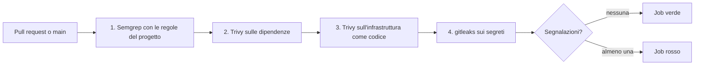

# Job `security`: come funzionano i controlli di sicurezza in CI

> Fonte: `docs/18 §3.10` punto 2 e §3.11 (ADR-042, ADR-044), F2-SEC-10, F2-SEC-12, F2-SEC-03. Consegnato da M8.11b. Il contesto delle minacce è in `docs/security/threat-model.md`, la tabella dei requisiti in `docs/security/asvs.md`, la mappa dei controlli ISO in `docs/compliance/iso27001-annex-a.md`.

Il job `security` di `.github/workflows/ci.yml` verifica a ogni pull request e su `main` che il codice, le dipendenze, l'infrastruttura come codice e la storia del repository rispettino le regole di sicurezza del progetto. La conformità la verifica il software, non una checklist (regola 13 di `CLAUDE.md`).

Leggi questa pagina per sapere cosa controlla il job, come riprodurre un esito in locale e cosa fare quando fallisce.

## Cosa controlla



| # | Controllo | Strumento | Cosa cerca | Blocca su |
|---|---|---|---|---|
| 1 | SAST | Semgrep con le regole in `.semgrep/rules` | violazioni delle regole 19 e 20 di `CLAUDE.md` (ADR-042) | qualunque segnalazione |
| 2 | Dipendenze | Trivy `fs` su `pom.xml`, `web/pnpm-lock.yaml`, `scripts/package-lock.json` | vulnerabilità note | HIGH e CRITICAL con correzione disponibile |
| 3 | IaC | Trivy `config` con `scripts/security-iac.sh` | configurazioni insicure di chart, compose e Dockerfile | HIGH e CRITICAL |
| 4 | Segreti | gitleaks sulla storia intera | credenziali nel codice o nella storia | qualunque segnalazione |

Ogni passo dopo il primo gira anche se uno precedente è fallito (`if: ${{ !cancelled() }}`), così una PR vede subito tutti gli esiti e non uno alla volta.

Il job è **consultivo**: non è tra i controlli obbligatori del ruleset `main-protetto` (`scripts/setup-branch-protection.sh`). Il proprietario lo rende obbligatorio quando si dimostra stabile (Q-500, ADR-047).

Restano fuori da questo job, e stanno in M8.11 o M8.5a: CodeQL, Schemathesis, ZAP, il testbook `TB-SEC`, le immagini, l'SBOM e la firma.

## Versioni e installazione

Le versioni sono fissate: Semgrep e Helm in `env` del job, Trivy nell'azione `.github/actions/setup-trivy`, gitleaks nel passo «Installa gitleaks» di `ci.yml`. Aggiornale nello stesso punto.

| Strumento | Versione | Come si installa |
|---|---|---|
| Semgrep | 1.178.0 | `pip install semgrep==1.178.0`; nessun token, nessun registro remoto, `--metrics=off` |
| Trivy | 0.74.0 | azione locale `.github/actions/setup-trivy`: release ufficiale con SHA-256 verificato, la stessa di `image.yml` |
| gitleaks | 8.30.1 | release ufficiale `gitleaks_8.30.1_linux_x64.tar.gz` con SHA-256 verificato nel passo «Installa gitleaks» |
| Helm | v3.18.4 | `azure/setup-helm`, come nel job `helm` |

Trivy e gitleaks si scaricano dalla release fissata e se ne verifica lo SHA-256 prima di installarli: nessuna azione di terze parti, nessuna toolchain Go, nessuna cache da invalidare (Q-501). Per aggiornare uno strumento cambia la versione e la somma (la riga del file `*_checksums.txt` della release) nello stesso punto. Le regole di Trivy per l'IaC sono quelle incorporate nella versione fissata (`--skip-check-update`): il risultato cambia solo se cambi la versione. Il database delle vulnerabilità si aggiorna a ogni esecuzione, per costruzione.

## 1. Semgrep e le regole del progetto

Le regole sono in `.semgrep/rules`, le fixture di prova in `.semgrep/tests`. Ogni regola ha un messaggio in italiano che cita la regola o l'ADR, almeno un caso che deve segnalare (`ruleid`) e uno che non deve (`ok`).

| Regola | Regola di `CLAUDE.md` | Cosa segnala |
|---|---|---|
| `lh-sql-testo-da-input` | 19 (ADR-042, F2-SEC-10) | un parametro di metodo, o il risultato di `String.format`, `formatted`, `String.join`, `String.valueOf`, `concat`, `new StringBuilder(...)`/`new StringBuffer(...)` o `x.append(...)` seguiti da `.toString()`, che arriva al testo SQL di `JdbcClient`, `JdbcTemplate`, `NamedParameterJdbcTemplate` o `Connection.prepareStatement`, anche attraverso variabili locali |
| `lh-sql-operando-dinamico` | 19 | nell'argomento di `.sql(...)`, o nel primo argomento dei metodi di `JdbcTemplate`/`JdbcOperations`/`NamedParameter*`/`Connection` (`query`, `update`, `execute`, `queryForList`, `queryForObject`, `batchUpdate`, …), un operando di `+` che non è un letterale, una costante `static final` in MAIUSCOLO o una catena che finisce con `.sql()`/`.andSql()` del builder |
| `lh-sql-variabile-concatenata` | 19 | una variabile locale `String`/`var` inizializzata con un `+` che ha un operando non costante e poi passata a `.sql(x)` |
| `lh-jdbc-statement-vietato` | 19 | `java.sql.Statement`, `createStatement`, `execute`/`executeQuery`/`executeUpdate` con testo SQL |
| `lh-spel-espressione-non-costante` | ADR-042 | `parseExpression` o `parseRaw` di un parser SpEL con un argomento che non è un letterale o una costante |
| `lh-header-valore-da-richiesta` | ADR-042 | un valore che viene da `@PathVariable`, `@RequestParam`, `@RequestHeader`, `@CookieValue`, `@RequestBody` o da `HttpServletRequest` e arriva a `setHeader`, `addHeader`, `HttpHeaders.set/add` o `.header(...)` senza bonifica |
| `lh-log-segreto` | 20 | un argomento del logger il cui nome nomina token, secret, password, Authorization, chiavi, credenziali, bearer, jwt o cookie |

Il builder `SqlWhere`/`SqlOrder` di `lh-common` e la regola sul testo costante sono descritti in `docs/06`, sezione «SQL dinamico». Le bonifiche riconosciute dalla regola sugli header sono: il builder `ContentDisposition`, la codifica URL, la conversione in numero, la rimozione esplicita di CR/LF e una funzione con nome `sanitize…`, `stripCrlf…`, `safeHeader…`, `neutralize…` o `encodeHeader…`.

### Riproduci in locale

```bash
# Installa la versione fissata del job (in un ambiente virtuale, per non toccare il sistema)
python3 -m venv .venv-semgrep && . .venv-semgrep/bin/activate
pip install semgrep==1.178.0

# Prova le regole: ogni fixture deve dare l'esito atteso
semgrep --test --config .semgrep/rules .semgrep/tests --metrics=off --disable-version-check

# Scansiona il codice come fa il job
semgrep scan --config .semgrep/rules --metrics=off --disable-version-check --error libs services deploy
```

### Quando una regola segnala

1. Correggi il codice: i valori vanno come parametri (`?` o `:nome`), gli identificatori vengono da un `enum`, i nomi di file negli header passano da `ContentDisposition`, i segreti non si registrano.
2. Se il caso è legittimo e nessuna correzione è possibile (un nome di tabella non si lega come parametro), scrivi sopra la riga una giustificazione e poi `// nosemgrep: <id-regola>`. Una regola più precisa è preferibile a un `nosemgrep`; l'unico oggi è in `DemoResetController` (Q-505).

> **Attenzione:** un `nosemgrep` senza giustificazione non passa la revisione. Non spegnere una regola per far tornare verde il job.

### Cosa le regole non vedono

Sono controlli sintattici e di flusso locale, non un'analisi completa (Q-505):

- Una variabile locale costruita da una lettura del database (senza `+`) e passata da sola a `.sql(x)` non si vede. Le regole guardano i parametri di metodo, le funzioni che costruiscono stringhe, gli operandi di `+` dentro `.sql(...)` o nel primo argomento dei metodi di JDBC, e le variabili locali costruite con `+` poi passate a `.sql(x)`.
- Falsi positivi: un operando che è un enum o un intero (mai input di un utente) è segnalato lo stesso, perché le regole guardano la forma e non il tipo. Preferisci una costante o il builder; se non è possibile, `// nosemgrep: <id-regola>` con la ragione sulla riga sopra (Q-505).
- Le regole sono solo per Java. Il BFF web (TypeScript, `web/`) non è ancora scansionato da Semgrep: l'ambito di questa fetta sono le regole Java; del web il job controlla oggi solo le dipendenze (Trivy) e i segreti (gitleaks).
- Le regole sugli header e sui log si basano sui nomi. Un segreto in una variabile chiamata `x` non si vede.
- Il codice di test (`src/test`) non è scansionato: apre di proposito SQL dinamico e fixture.

CodeQL (M8.11) copre il flusso dei dati tra metodi e classi.

## 2. Dipendenze

Trivy legge `pom.xml` (le dipendenze transitive dai POM del repository Maven locale `~/.m2`, ripristinato dalla cache del job `backend` o risolto da `./mvnw dependency:resolve`; `--offline-scan` evita le richieste di Trivy a Maven Central, che dagli IP condivisi dei runner rispondeva 429), `web/pnpm-lock.yaml` e `scripts/package-lock.json`, anche le dipendenze di sviluppo (`--include-dev-deps`). Blocca le vulnerabilità HIGH e CRITICAL per le quali esiste una versione corretta (`--ignore-unfixed`).

Stato all'ultima verifica (2026-09-29, Trivy 0.74.0): nessuna vulnerabilità HIGH o CRITICAL, né con `--ignore-unfixed` né senza.

```bash
# Dipendenze, come fa il job (serve trivy nel PATH; prima ./mvnw -q dependency:resolve se ~/.m2 è vuoto)
trivy fs --scanners vuln --severity HIGH,CRITICAL --ignore-unfixed --include-dev-deps --offline-scan \
  --ignorefile .trivyignore.yaml --exit-code 1 --no-progress \
  --skip-dirs '**/node_modules' --skip-dirs '**/target' .
```

### Quando una dipendenza segnala

1. Aggiorna la dipendenza alla versione corretta. La politica di Dependabot ammette solo patch per gli override di `jackson` e `lz4` (`.github/dependabot.yml`): un aggiornamento maggiore o minore è una decisione, non una correzione automatica.
2. Se non puoi aggiornare, accetta la vulnerabilità in `.trivyignore.yaml`, nella sezione `vulnerabilities`, con `id`, `statement` (la ragione), `expired_at` (una data) e il riferimento a una domanda `Q-nnn` in `docs/15` o a una voce `TOBE-nnn` in `docs/19`. Niente eccezioni senza scadenza.

## 3. Infrastruttura come codice

`scripts/security-iac.sh` fa quattro cose:

1. **Prova i controlli del progetto.** Scansiona `.trivy/tests/compose-violazioni.yml`, che viola di proposito le regole, e fallisce se Trivy non le segnala tutte (6 volte `LH-DC-0001`, 5 volte `LH-DC-0002`); la stessa fixture contiene i casi che non devono segnalare (`127.0.0.1::8080`, `[::1]`, `host_ip: 127.0.0.1`). Un controllo che non segnala mai nulla è un controllo rotto.
2. **Rende il chart** con `helm template` in quattro scenari (i tre del job `helm`: valori di CI con gateway, valori di `kind`, servizi gestiti esterni; e osservabilità accesa, `ci/observability-values.yaml`, con il collector OpenTelemetry, la sua NetworkPolicy e la PrometheusRule) e lo scansiona.
3. **Scansiona `deploy/`**: compose di riferimento (`deploy/compose/reference.yml`), compose locale (`deploy/docker-compose.yml`) e `deploy/image/Dockerfile`. Resta fuori `deploy/helm` (già reso al punto 2); `deploy/hub` ha il passo 4.
4. **Scansiona i Dockerfile di Fase 1** (`deploy/hub/Dockerfile` e `services/*/Dockerfile`), uno per cartella, in modo bloccante solo se hanno un'istruzione `USER` (vedi «Dockerfile di Fase 1»).

Trivy non conosce Docker Compose. I controlli sul Compose sono del progetto e stanno in `.trivy/checks`, scritti in Rego e letti da Trivy come YAML generico:

| ID | Cosa segnala | Gravità |
|---|---|---|
| `LH-DC-0001` | `privileged: true`, rete/PID/IPC dell'host, socket di Docker, capability pericolose (`SYS_ADMIN`, `NET_ADMIN`, `NET_RAW`, `ALL`…), profili seccomp/AppArmor disattivati, utente root | HIGH |
| `LH-DC-0002` | porta pubblicata senza indirizzo di ascolto (`8080:8080`) o con un indirizzo che vuol dire «tutte le interfacce» (`0.0.0.0:`, `[::]:`, `${VAR:-0.0.0.0}`, `host_ip: 0.0.0.0`); `127.0.0.1::8080` (porta dell'host scelta da Docker) resta su loopback e non segnala | HIGH |

```bash
# Serve trivy e helm nel PATH (o TRIVY=/percorso/trivy HELM=/percorso/helm)
bash scripts/security-iac.sh
```

### Eccezioni in vigore

Ogni eccezione ha una scadenza: dopo quella data la segnalazione torna e il job fallisce, così la decisione non resta dimenticata.

| Cosa | Dove | Ragione | Scade | Riferimento |
|---|---|---|---|---|
| `KSV-0014` sul solo container `idp` (Keycloak senza filesystem in sola lettura) | `.trivy/ignore-policy.rego` | `kc.sh start` ricompila e scrive nella propria cartella; si chiude con un'immagine ottimizzata | 2027-03-31 | Q-502, Q-374, TOBE-007 |
| `LH-DC-0002` sul compose locale `deploy/docker-compose.yml` | `.trivyignore.yaml` | solo sviluppo su una macchina propria; il compose di riferimento ascolta su `127.0.0.1` per default | 2027-03-31 | Q-503, Q-479, Q-480 |

L'eccezione su `idp` ha un ambito preciso: la stessa segnalazione su `hub`, `web` o sulle migrazioni resta un errore.

### Dockerfile di Fase 1

Solo `deploy/hub/Dockerfile` sta dietro la demo ospitata su Render; i `services/*/Dockerfile` servono al compose. Finché un Dockerfile non ha un'istruzione `USER` non root (Trivy `DS-0002`, HIGH) lo script lo scansiona ma non blocca (`--exit-code 0`, con il messaggio «Q-504 in sospeso»); appena ha `USER`, la stessa scansione blocca (`--exit-code 1`). Q-504 è deciso (utente non root, M8.1c): quando M8.1c e questa fetta sono entrambe unite, la scansione diventa bloccante da sola, senza altre modifiche.

Trivy stampa a volte una riga `ERROR ... Falling back to embedded checks` (o simile) quando non può scaricare le regole aggiornate: è innocua, perché lo script usa comunque le regole incorporate nella versione fissata (`--skip-check-update`).

## 4. Segreti

gitleaks (`gitleaks git`) scansiona tutta la storia raggiungibile da `HEAD` (`fetch-depth: 0` nel checkout e `--log-opts="--full-history HEAD"`, quindi ogni commit, anche di rami già uniti) con le regole predefinite estese da `.gitleaks.toml`. Il flag `--redact` fa sì che il valore del segreto non compaia mai nel log.

```bash
# Segreti nella storia del repository, senza mostrarne il valore
gitleaks git --config .gitleaks.toml --redact --no-banner --log-opts="--full-history HEAD" .
```

Le eccezioni in `.gitleaks.toml` riguardano solo dati fittizi noti, ognuna con la giustificazione e limitata da percorso **e** valore. Oggi ce n'è una: `idempotencyKey` negli esempi JSON di `docs/*.md`, che è un identificativo di deduplicazione e non una credenziale (Q-506).

> **Attenzione:** se gitleaks trova un segreto vero, non basta cancellarlo dal codice: resta nella storia. Ruotalo subito e segnalalo come descrive `SECURITY.md`. Non aggiungere mai un segreto vero a `.gitleaks.toml`.

### Secret scanning di GitHub

Il secret scanning con push protection di GitHub è un'impostazione del repository, non del codice: la abilita il proprietario in Settings → Code security (ADR-047, `docs/18` §3.13). Blocca il push di un segreto prima che entri nella storia; gitleaks lo rileva dopo, in CI. Sono complementari (Q-506).

## Come si legge un esito

| Passo del job | Se fallisce | Cosa fare |
|---|---|---|
| Regole del progetto (`semgrep --test`) | una fixture non dà l'esito atteso | correggi la regola o la fixture in `.semgrep/` |
| Semgrep sul codice | il codice viola una regola | correggi il codice (vedi la tabella delle regole) |
| Dipendenze | vulnerabilità HIGH o CRITICAL con correzione | aggiorna o accetta con scadenza in `.trivyignore.yaml` |
| IaC | configurazione insicura o controllo del progetto rotto | correggi il chart, il compose o il Dockerfile; per un'eccezione vedi «Eccezioni in vigore» |
| Segreti | credenziale nella storia | ruota il segreto; eccezione solo per dati fittizi |

## Evidenze per la conformità

| Requisito | Evidenza |
|---|---|
| ISO 27001 A.8.8, A.8.25, A.8.28, A.8.29, A.8.9, A.5.17, A.8.12 | righe in `docs/compliance/iso27001-annex-a.md` con l'evidenza «job `security` in `ci.yml`» |
| ASVS V1 (codifica) e V13 (configurazione) | righe in `docs/security/asvs.md` |
| Threat model B5 (SQL), B9 (catena di fornitura, segreti) | righe in `docs/security/threat-model.md` |
