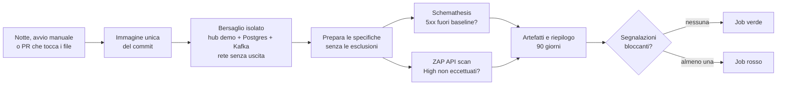
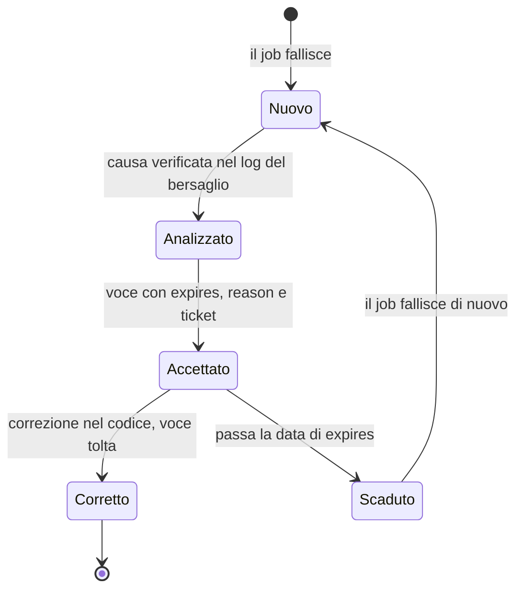

# Verifica dinamica notturna: fuzzing delle API e ZAP

> Fonte: `docs/18 §3.10` punto 12, ADR-042, ADR-044, F2-SEC-12. Consegnato da M8.11c. Le regole di Semgrep, Trivy e gitleaks a ogni PR sono in `docs/security/ci-security.md`; il contesto delle minacce in `docs/security/threat-model.md`; la tabella dei requisiti in `docs/security/asvs.md`; la mappa dei controlli ISO in `docs/compliance/iso27001-annex-a.md`; il testbook applicativo in `docs/testbook/TB-SEC-sicurezza.md`.

Ogni notte, e a ogni pull request che tocca questi file o `contracts/api/**`, il workflow `.github/workflows/security-nightly.yml` costruisce l'immagine unica del commit, avvia l'hub in profilo `demo` in una rete Docker senza uscita e lo attacca con due strumenti, su ogni operazione di `contracts/api`: **Schemathesis** (fuzzing guidato dalle OpenAPI: input malevoli, confini, tipi sbagliati) e **ZAP** (API scan autenticato con l'identità demo). La conformità la verifica il software, non una checklist (regola 13 di `CLAUDE.md`).

Leggi questa pagina per sapere cosa prova ogni strumento, cosa fa fallire il job, come si accetta un difetto noto (con scadenza) e come si riproduce un esito in locale.

Schemathesis e ZAP sono **strumenti di verifica in CI, non componenti del prodotto**: come Semgrep e Trivy nel job `security`, non stanno nel chart né nei compose e la regola 8-bis non si applica. Il repository è pubblico, quindi i minuti di GitHub Actions non costano; il bersaglio non ha uscita di rete, quindi il prodotto non guadagna alcuna destinazione in uscita (ADR-042). Nessun endpoint `@PublicEndpoint`, nessun campo `pii`, nessun segreto.

## Come funziona



Il workflow ha due job indipendenti (`fuzz` e `zap`), ciascuno con il proprio bersaglio, così un guasto di uno strumento non nasconde l'esito dell'altro. Il workflow è **consultivo**: non è tra i controlli obbligatori del ruleset `main-protetto` (Q-530, come il job `security` con Q-500).

**Il job `fuzz` è atteso rosso, per ora.** Le cause (2)…(7) di Q-532 continuano a produrre operazioni nuove a ogni seme, e l'esecuzione in CI differisce da quella locale (Kafka, limite di frequenza dell'ingresso non da loopback): finché le correzioni (a) e (c) di Q-532 non sono in `main`, quasi ogni notte il job fallirà per un `500` non ancora registrato. Non è un guasto dello strumento e non va ignorato: la causa si legge nel riepilogo e si registra come da «Registrare i 5xx trovati». Il conto delle **notti consecutive verdi** che Q-530 pone come condizione per renderlo obbligatorio **parte solo dopo** quelle correzioni. Sulle pull request l'esito del fuzzing è solo informativo (`continue-on-error`, con un avviso): la PR mostra che il job parte e chiude, non un rosso causato da un seme sfortunato; ZAP resta bloccante anche sulla PR.

## Controlli

| Controllo | Strumento e versione | Cosa invia | Blocca su | Non blocca |
|---|---|---|---|---|
| Fuzzing delle API | Schemathesis 4.28.0, immagine `ghcr.io/schemathesis/schemathesis` fissata per digest | per ogni operazione di ogni specifica: parametri e corpi validi, non validi, ai confini (stringhe lunghe, NUL, caratteri di controllo, numeri estremi, parametri in più); identità `X-LH-Actor: ADMIN:lh-dast` | un `5xx` fuori dalla baseline con scadenza; una voce di baseline scaduta o non valida; errori di rete o timeout | qualunque `4xx`; la conformità delle risposte allo schema OpenAPI (controlli spenti, Q-535); un `5xx` su un'operazione che ha già una voce di baseline (vedi «Cosa copre una voce») |
| DAST | ZAP 2.17.0 (`zap-api-scan.py`), immagine `ghcr.io/zaproxy/zaproxy` fissata per digest | importa l'OpenAPI e attacca ogni operazione con le regole attive di ZAP (iniezioni, path traversal, XSS, divulgazione di informazioni), con l'identità `ADMIN:lh-dast` | un avviso **High** con confidenza diversa da 0 non coperto da un'eccezione con scadenza | Medium, Low e Info; gli avvisi con confidenza 0 (falso positivo dichiarato da ZAP) |
| Testbook | `TB-SEC-FUZ-001…064` e `TB-SEC-ERR-001…007` in `deploy/hub/.../TestbookSecHubIT` | gli stessi input ostili in forma deterministica: iniezione SQL, NUL, 10 000 caratteri, path traversal, CRLF, espressioni di template | a ogni `./mvnw verify` (non nel workflow notturno) | — |

Il testbook è il minimo deterministico che gira a ogni build; il fuzzing e ZAP lo estendono a ogni operazione e a ogni parametro. Sulle operazioni con una voce di baseline il fuzzing non vede 5xx nuovi: lì il testbook è l'unica rete (vedi «Cosa copre una voce»). La fase di copertura di Schemathesis resta attiva, in locale e in Docker (Q-535).

## Il bersaglio

`scripts/security-target.sh up` prepara un ambiente usa e getta:

- **Immagine:** l'immagine unica costruita da `deploy/image/Dockerfile` (tag `lh-image:dast`), ruolo `hub`, con lo stesso ambiente della prova di avvio di `image.yml`. Kafka e Postgres sono quelli di `deploy/docker-compose.yml` (progetto `lh-dast`).
- **Profilo `demo`, identità simulata (Q-531).** L'hub gira con i dati fittizi del seed (Club Aurora) e accetta `X-LH-Actor`; gli strumenti inviano `ADMIN:lh-dast`, che passa ogni guardia di ruolo e raggiunge quindi ogni operazione. Nel profilo `enterprise` l'identità viene dal token OIDC: un bersaglio `enterprise` (con l'IdP e un client di prova) arriva con lo stack di M9; fino ad allora il fuzzing prova la logica e la robustezza delle API, non la catena di autenticazione.
- **Rete senza uscita (Q-534).** L'hub sta in una rete Docker creata con `--internal` (nessun instradamento verso l'esterno), e Kafka e Postgres del compose vi si aggiungono con i loro nomi (`kafka`, `postgres`): l'hub non ha quindi altra rete. Lo script **prova** l'isolamento invece di darlo per scontato: prova a raggiungere `https://github.com` dalla rete e, se ci riesce, fallisce con «rete del bersaglio non isolata». Anche gli strumenti girano in container su quella rete. Il database si distrugge a fine job (`down`), quindi nessun dato sopravvive e i rapporti non contengono dati personali reali: solo il seed fittizio.
- **Limite di frequenza dell'ingresso (Q-536).** Da un indirizzo non locale `POST /v1/events` e `POST /v1/transactions` accettano 60 richieste al minuto per IP (`docs/11 §11`). Il fuzzing le invia a 25 al minuto ciascuna (`.dast/schemathesis.toml`), sotto il limite; altrimenti misurerebbe solo i `429`. Anche `POST /v1/events/batch` conta nella stessa finestra un evento per elemento: ha una frequenza propria di 5 al minuto, ma un batch con molti elementi può comunque esaurire la finestra e spingere le altre due operazioni a `429` (si perde copertura, non si nasconde un `5xx`). Lo ZAP non ha un limite proprio: oltre soglia riceve `429` sulle due operazioni, che non sono un difetto.
- **Esclusioni (Q-533)** in `.dast/exclusions.json`, ciascuna con motivo e riferimento; `node scripts/security-dast.mjs prepare` fallisce se una esclusione non corrisponde più a nulla.

| Esclusione | Perché |
|---|---|
| `portal.openapi.yaml` (intera specifica) | è l'unione dei percorsi `/v1/portal/**` che stanno già nelle specifiche dei servizi: provarla sarebbe provare due volte le stesse operazioni |
| `POST /v1/demo/reset` | azzera e ricarica il seed: ripetuto dal fuzzing svuota lo stato e rallenta tutto; è coperto da `TB-PLT-RST` |
| risposte `text/event-stream` (oggi `GET /v1/stream/events`) | flusso SSE: la connessione resta aperta per costruzione, lo strumento non ne vedrebbe la fine |

Da `contracts/api` escono così 9 specifiche in JSON (8 servizi e la piattaforma) in `target/security/<fuzz|zap>/specs/`.

## Cosa fa fallire il job

**Job `fuzz` (Schemathesis).** Fallisce se, per almeno una specifica:

- c'è un `5xx` su un'operazione senza voce di baseline, o la sua voce è scaduta (Schemathesis la tratta di nuovo come nuova);
- una voce della baseline non ha `expires` (entro 90 giorni), `reason` (almeno 10 caratteri) e `ticket` (`Q-nnn` o `TOBE-nnn`): lo dice `baseline-check`, prima di lanciare lo strumento;
- ci sono errori o timeout (richiesta oltre 30 s, connessione caduta) o Schemathesis esce con un codice diverso da 0 e 1 (per esempio 2: configurazione non valida);
- una specifica non prova alcuna operazione (`tested = 0`), oppure manca il rapporto;
- il bersaglio non diventa sano in 5 minuti, o la rete non risulta isolata (passo «Bersaglio isolato»).

**Job `zap` (ZAP).** Fallisce se:

- c'è un avviso **High** con confidenza diversa da 0 su un'istanza non coperta da un'eccezione valida e non scaduta;
- `.dast/zap-exceptions.json` contiene una voce non valida (plugin non numerico, motivo troppo corto, riferimento diverso da `Q-nnn`/`TOBE-nnn`, scadenza non reale o oltre 90 giorni, `uriRegex` che non compila);
- ZAP esce con un codice diverso da 0 e 2 (3 = errore di importazione o di esecuzione), o manca il rapporto di una specifica, o il rapporto non ha alcun sito (nessun URL importato);
- il bersaglio non diventa sano, o la rete non risulta isolata.

**Medium, Low e Info non fanno mai fallire il job:** compaiono nel riepilogo e nel rapporto HTML come evidenza. Un'eccezione scaduta o mai usata è solo un avviso nel riepilogo.

## Esiti accettati, sempre con scadenza

Un difetto noto che non si corregge subito si **accetta per iscritto**, con una scadenza, invece di spegnere il controllo. Nessuna eccezione senza scadenza, motivo e `Q`/`TOBE`.



- **Baseline di Schemathesis** (`.dast/schemathesis-baseline.json`). Il formato è quello dello strumento: `id`, `operation`, `check`, `failure`, `signature`, `first_seen`, `last_seen`, `expires`. Il progetto pretende in più `reason` (in italiano, la causa verificata, non «da guardare») e `ticket`. `expires` non supera 90 giorni dalla data del commit: dopo quella data Schemathesis stesso considera la voce scaduta e il difetto torna a far fallire il job.
- **Eccezioni di ZAP** (`.dast/zap-exceptions.json`): `pluginId`, `reason`, `ref` (`Q-nnn` o `TOBE-nnn`), `expires` (entro 90 giorni) e, facoltativi, `method` e `uriRegex` (ancorata, per non coprire più del necessario). Un falso positivo si accetta con motivo «falso positivo: …» e la spiegazione del perché.
- **Una voce si toglie quando il difetto è corretto**, nella stessa PR della correzione; una voce mai usata è segnalata come avviso.

### Registrare i 5xx trovati (`baseline_update`)

La baseline **fotografa** i difetti già noti; non distingue però un difetto nuovo dallo stesso `500` già registrato (vedi «Cosa copre una voce»). Il flusso:

1. Avvia a mano il workflow con `baseline_update` a `true`. Lo script aggiunge alla baseline i `5xx` trovati e carica l'artefatto `security-fuzz`, che contiene anche `.dast/schemathesis-baseline.json` aggiornato.
2. Scarica l'artefatto e per ogni voce nuova cerca la causa nel log del bersaglio (`security-target.sh logs`, o il log del job in caso di errore). Compila `expires`, `reason` e `ticket`; apri o aggiorna la Q (o la voce del backlog) che traccia la correzione.
3. Apri una PR con la baseline annotata. Lo script `baseline-check` la rifiuta finché una voce manca di `expires`, `reason` o `ticket`.

Un'esecuzione a mano con `baseline_update` a `true` non sostituisce la revisione: la PR con le voci annotate è il punto in cui una persona decide che il difetto si può accettare.

### Cosa copre una voce

Una voce **non** copre «quel difetto»: copre **ogni `500` della stessa operazione**. Schemathesis 4.28.0 riconosce una voce per (operazione, controllo, classe del difetto, firma) e, per `not_a_server_error`, la firma è il solo codice di stato (`ServerError._unique_key` restituisce `str(status_code)`, in `schemathesis/baseline/model.py`). Finché una voce resta, su quell'operazione il fuzzing **non vede 5xx nuovi**, qualunque ne sia la causa: una nuova iniezione SQL che produce un `500` su `GET /v1/members`, `/v1/campaigns`, `/v1/rewards` o `/v1/events` comparirebbe come «già noto». Le 79 voci coprono 79 delle 219 operazioni provate, comprese le quattro ricerche libere `q` che sono i bersagli delle righe SQL del testbook. Il **minimo deterministico** su quelle operazioni è quindi `TB-SEC` (`TestbookSecHubIT`, a ogni `./mvnw verify`), non il fuzzing.

Per questo:

- le voci sulle quattro ricerche hanno scadenza a **30 giorni** (2026-10-29) invece di 90: tornano presto a far vedere i `5xx`;
- la correzione (a) di Q-532 (`GlobalExceptionHandler`: `InvalidParameterException` → `400`) è **urgente**, perché toglie 50 voci in una volta e restituisce al fuzzing altrettante operazioni;
- ogni voce tolta, per correzione, è una operazione che torna interamente coperta.

### Stato iniziale della baseline (Q-532)

La prima esecuzione, contro l'hub in locale, ha trovato **79 operazioni che rispondono `500`** a input ostili (nessuna fuga di dettagli: la risposta è sempre il messaggio generico). Sono nella baseline con scadenza 2026-12-28 (2026-10-29 per le quattro ricerche libere), ciascuna con la causa verificata: 50 per un parametro di query senza nome (`?=x`), 8 per un `asOf` non valido nei job demo, 9 per un byte NUL, 6 per una `NullPointerException` su un corpo incompleto, 4 per un `page` fuori scala, 1 per la paginazione in memoria e 1 per un multipart troncato. Le cause, le correzioni proposte e l'ordine di resa sono in `docs/15` (Q-532). Non si corregge codice di prodotto in questa fetta.

Schemathesis genera input diversi a ogni esecuzione (il seme è nel riepilogo) e la causa più diffusa tocca ogni operazione con parametri di query: una notte può quindi trovare un'operazione non ancora registrata e far fallire il job. Si tratta come sopra (`baseline_update`, causa, PR). Le operazioni della prima causa (parametro di query senza nome) sono complete, perché un controllo esaustivo (`?=x` su ogni operazione delle 9 specifiche) non ne trova altre; le altre cause possono ancora rivelare operazioni nuove. Correggere la prima causa di Q-532 le toglie tutte insieme.

## Riprodurre in locale

**Senza Docker** (Schemathesis; ZAP richiede Docker). Avvia l'hub come da `docs/11` (per esempio `PORT=18181 SPRING_PROFILES_ACTIVE=demo,inproc … java -jar deploy/hub/target/hub-*-boot.jar`, con un Postgres locale), poi dalla radice del repository:

```bash
python3 -m venv .venv-dast && . .venv-dast/bin/activate
pip install schemathesis==4.28.0
npm --prefix scripts ci --omit=dev
SCHEMATHESIS=.venv-dast/bin/schemathesis LH_FUZZ_URL=http://127.0.0.1:18181 LH_FUZZ_MAX_TIME=60 bash scripts/security-fuzz.sh
```

I risultati sono in `target/security/fuzz/<specifica>/` (`report.json`, `junit.xml`). Per riprodurre una sola richiesta, Schemathesis stampa il comando `curl` di ogni difetto e il seme (`--seed`) dell'esecuzione.

**Con Docker** (come in CI: bersaglio isolato e immagini fissate):

```bash
docker build -f deploy/image/Dockerfile -t lh-image:dast .
npm --prefix scripts ci --omit=dev
bash scripts/security-target.sh up      # hub, Kafka e Postgres in una rete senza uscita
bash scripts/security-fuzz.sh           # Schemathesis: target/security/fuzz/
bash scripts/security-zap.sh            # ZAP:          target/security/zap/
bash scripts/security-target.sh logs    # log dell'hub, se serve la causa di un 5xx
bash scripts/security-target.sh down    # smonta tutto
```

Variabili utili: `LH_FUZZ_MAX_TIME` (secondi per specifica, 120), `LH_FUZZ_BASELINE_UPDATE=1`, `LH_ZAP_MAX_MINUTES` (minuti per specifica, 5), `LH_DAST_ACTOR`, `LH_IMAGE`, `LH_DAST_NETWORK`. Le funzioni di contorno hanno i loro test: `node --test scripts/security-dast.test.mjs`.

### Cosa cambia tra un'esecuzione locale e la CI

- **Loopback.** Da `127.0.0.1` il limite di frequenza dell'ingresso non si applica (Q-339): in locale le due operazioni di ingresso non sono rallentate. In CI il fuzzing arriva da un altro container e il limite c'è.
- **Bus.** In locale l'hub gira con `inproc` (bus in-process, senza Kafka); in CI con Kafka, come nella prova di avvio di `image.yml`. I difetti legati al broker si vedono solo in CI.
- **Tempo.** La PR usa 60 s di fuzzing e 2 minuti di ZAP per specifica; la notte 300 s e 5 minuti (regolabili dall'avvio manuale). Più tempo, più casi: una notte pulita non prova l'assenza di difetti, ne riduce la probabilità. Il seme cambia a ogni esecuzione e si stampa nel riepilogo.

## Aggiornare le versioni (Q-537)

Le immagini sono fissate per **digest**, definito una sola volta, come valore predefinito di una variabile d'ambiente dello script che lo usa (con il commento `# Q-537: aggiornamento a mano`): `SCHEMATHESIS_IMAGE` in `scripts/security-fuzz.sh`, `ZAP_IMAGE` in `scripts/security-zap.sh`, `CURL_IMAGE` in `scripts/security-target.sh`. Il workflow non li ripete. Dependabot non segue i digest negli script: si aggiornano a mano, leggendo il digest dell'indice multi-architettura dal registro e cambiando insieme tag e digest. Per un'esecuzione locale senza Docker la versione di Schemathesis è `schemathesis==4.28.0`, la stessa dell'immagine. Dopo l'aggiornamento serve un'esecuzione a mano del workflow: una versione nuova può trovare difetti nuovi, e la baseline dichiara la versione con cui è stata scritta (`schemathesis_version`).

## Evidenze di conformità (ADR-044, regola 22)

| Controllo ISO 27001 | Evidenza |
|---|---|
| A.8.29 Test di sicurezza nello sviluppo e nell'accettazione (DAST e fuzzing) | artefatti `security-fuzz` e `security-zap` (JUnit, JSON, HTML, 90 giorni), riepilogo del job, `.dast/*`, `TestbookSecHubIT` |
| A.8.33 Informazioni di test | il bersaglio usa solo il seed fittizio, su un database usa e getta distrutto a fine job; `scripts/security-target.sh`, `security-nightly.yml` |

Domande aperte: Q-530 (consultivo), Q-531 (identità), Q-532 (difetti trovati), Q-533 (esclusioni), Q-534 (isolamento), Q-535 (controlli e ZAP), Q-536 (limite di frequenza), Q-537 (versioni), Q-538 (righe del testbook con divergenza), in `docs/15`.
