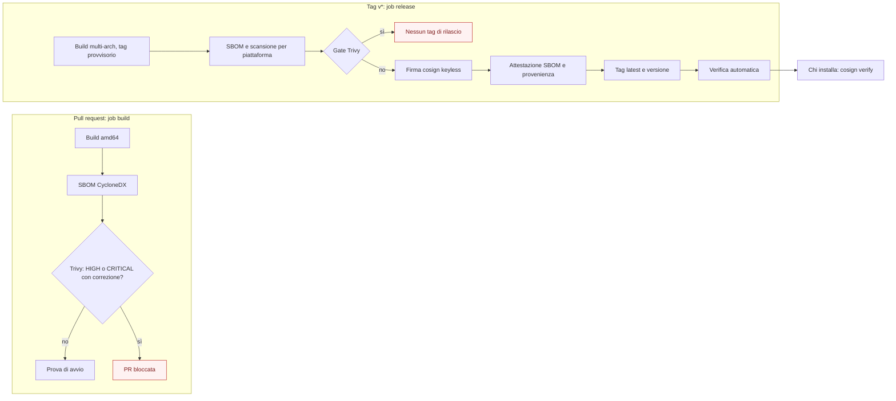

# Supply chain dell'immagine unica

> Fonte: `docs/18 §3.11` (scansione dipendenze, immagini e segreti), `docs/18 §3.15` (evidenze di rilascio), ADR-038 e
> ADR-044. Fetta M8.5a (F2-SEC-03, F2-DIST-08 in parte). Il codice è in `.github/workflows/image.yml`,
> `.github/actions/setup-trivy/action.yml` e `deploy/image/.trivyignore.yaml`. Come verificare l'immagine da
> utente: `deploy/README.md`, sezione «Verificare l'immagine».

Questa pagina dice cosa produce la pipeline dell'immagine unica (`deploy/image/Dockerfile`), dove trovare ogni prodotto,
come verificarlo e cosa manca ancora.

## 1. Cosa produce la pipeline

| Prodotto | Quando | Dove si trova | Strumento |
|---|---|---|---|
| SBOM CycloneDX dell'immagine | ogni PR che costruisce l'immagine; ogni tag `v*` (una per piattaforma) | artefatto del workflow (`image-sbom-e-scansione`, `sbom-e-scansione-<tag>`, 90 giorni); sui tag anche come attestazione nel registro | Trivy (`trivy image --format cyclonedx`) |
| Rapporto di scansione completo (JSON) | come l'SBOM | stesso artefatto | Trivy |
| Scansione bloccante | come l'SBOM | esito del job `build` (PR) o `release` (tag) | Trivy, HIGH e CRITICAL con correzione disponibile |
| Firma dell'immagine | solo tag `v*` | registro, accanto all'immagine; voce nel log di trasparenza di Sigstore | cosign, firma keyless con l'OIDC di GitHub |
| Attestazione dell'SBOM | solo tag `v*` | registro, sul digest di ogni piattaforma | `cosign attest --type cyclonedx` |
| Attestazione di provenienza della build | solo tag `v*` | registro e archivio delle attestazioni di GitHub, sul digest dell'indice | `actions/attest-build-provenance` |

Sulle PR non si pubblica e non si firma nulla: il job `build` ha solo `contents: read`. L'identità OIDC (`id-token: write`)
e la scrittura su GHCR (`packages: write`) esistono solo nel job `release`, che gira sui tag `v*` (Q-510).

## 2. Come funziona la scansione

- **Che cosa guarda.** Trivy scansiona i pacchetti del sistema operativo (Wolfi), le librerie Java dentro
  `hub.jar` e i pacchetti di `node_modules` del ruolo `web`. Solo vulnerabilità (`--scanners vuln`): i segreti li
  cerca il job `security` di M8.11.
- **Quando blocca.** Un risultato HIGH o CRITICAL **con correzione disponibile** (`--ignore-unfixed`) fa fallire il
  job. Le vulnerabilità senza correzione compaiono nel rapporto JSON ma non bloccano: non c'è nulla da aggiornare.
- **Eccezioni.** Un'eccezione accettata sta in `deploy/image/.trivyignore.yaml` e ha sempre tre cose: il motivo, il
  riferimento (una `Q-nnn` di `docs/15` o una `TOBE-nnn` di `docs/19`) e una data di scadenza entro 90 giorni. Alla
  scadenza Trivy smette di ignorare la voce e la scansione torna a fallire: si corregge, oppure il proprietario
  rinnova la decisione. Il file è dell'immagine e non è il `.trivyignore*` della radice del repository.
  Alla consegna di M8.5a il file non ha voci: le librerie di Keycloak (Q-482, TOBE-007) e OpenLDAP di prova (Q-480)
  stanno in immagini di terze parti, non in questa.
- **Versioni.** Trivy 0.74.0 è scaricato dalla release ufficiale con SHA-256 fissato in
  `.github/actions/setup-trivy/action.yml`; cosign 3.1.3 con `sigstore/cosign-installer` 4.1.2; provenienza con
  `actions/attest-build-provenance` 4.2.2. L'aggiornamento di Trivy e cosign è manuale (Q-512).

## 3. Come funziona la firma

1. Il job `release` costruisce `linux/amd64` e `linux/arm64` e pubblica con il tag provvisorio `build-<commit>`.
   BuildKit non aggiunge attestazioni proprie (`provenance: false`, `sbom: false`): le attestazioni sono quelle dei
   passi successivi, firmate con la stessa identità, e l'indice contiene solo le due piattaforme.
2. Trivy genera un SBOM e una scansione **per piattaforma**, sul digest del manifest di ciascuna.
3. Se la scansione è pulita, cosign firma l'indice e ciascun manifest **per digest**, senza chiavi da custodire: il
   certificato di breve durata lega la firma all'identità del workflow (`image.yml` di questo repository sul tag) e la
   firma finisce nel log di trasparenza pubblico di Sigstore (Rekor).
4. `cosign attest --type cyclonedx` allega l'SBOM di ogni piattaforma al digest di quella piattaforma (Q-511).
5. `actions/attest-build-provenance` allega la provenienza della build all'indice.
6. Solo dopo `latest` e il tag di versione puntano all'indice già firmato, e il job verifica firme e attestazioni con
   gli stessi comandi che usa chi installa.

Un'immagine con un tag di rilascio è quindi sempre firmata e scansionata. Il tag provvisorio `build-<commit>` può esistere
anche per una build che non ha passato la scansione: non si usa mai in un'installazione.

## 4. Come verificare

I comandi sono in `deploy/README.md`, sezione «Verificare l'immagine»: `cosign verify` con l'identità del workflow,
`cosign verify-attestation --type cyclonedx` per l'SBOM, `gh attestation verify` per la provenienza e come scaricare
l'SBOM.

## 5. Cosa manca ancora

| Manca | Perché | Dove si fa |
|---|---|---|
| VEX per le CVE note e non sfruttabili | oggi le eccezioni sono voci di Trivy con scadenza, non un documento VEX firmato e consegnato | M12.4, M12.6 (F2-GRC-08), TOBE-009 |
| Provenienza SLSA livello 3 | l'attestazione di provenienza c'è; il livello 3 chiede un workflow riusabile isolato e la verifica delle sue garanzie | M12.6, TOBE-009 |
| Pacchetto di rilascio con SBOM, VEX, provenienza, firme, rapporti e note di sicurezza pubblicato accanto all'immagine | oggi SBOM e rapporti sono artefatti del workflow (90 giorni), non allegati a una release | M12.4 (F2-DIST-08), TOBE-009 |
| Immagine per `main` (firma per ogni merge) | il workflow pubblica solo sui tag | Q-510 |
| SBOM sull'indice multi-arch e verifica all'ammissione dell'attestazione per tag | l'SBOM descrive una piattaforma | Q-511, TOBE-009 |
| SBOM e scansione delle immagini di terze parti (Kafka, Postgres, Keycloak) | fuori dall'immagine unica; hanno le loro eccezioni (Q-481, Q-482) | job `security` di M8.11 |
| Build riproducibile con i pacchetti Wolfi fissati | `apk add` prende la versione corrente a ogni build; SBOM e scansione dicono cosa è finito nell'immagine, ma la build non è riproducibile bit a bit | TOBE-009 |

## 6. Prova dello stato attuale

`M8.5a` è stata scritta senza poter costruire l'immagine (nell'ambiente della fetta `cgr.dev` è bloccato e non c'è un
demone Docker): la prima scansione, la prima firma e la prima verifica reali sono quelle della CI. Provati in locale:
la sintassi del workflow (`actionlint`), il formato del file delle eccezioni (una voce valida ignora, una scaduta no), la
generazione dell'SBOM CycloneDX e i flag di Trivy su un caso di prova.
