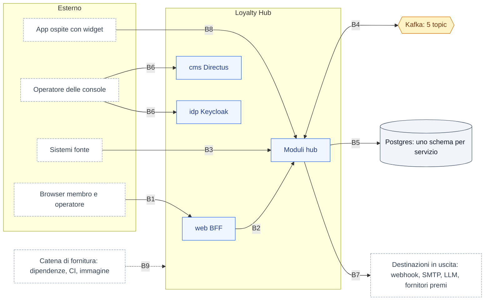

# Threat model — confini di fiducia (STRIDE)

> Fonte: `docs/18 §3.10` (ADR-042, ADR-038), `docs/18 §3.15` (ADR-044). Deliverable di M8.5/M8.11 (F2-SEC-03, F2-SEC-12). Si rivede a ogni milestone di Fase 2 e a ogni fetta che aggiunge un confine, un endpoint pubblico, una destinazione in uscita o un produttore di eventi (CLAUDE.md §7, *Fermati e chiedi*).

Questo documento elenca, per ogni **confine di fiducia** del Loyalty Hub, le minacce secondo STRIDE (*Spoofing*, *Tampering*, *Repudiation*, *Information disclosure*, *Denial of service*, *Elevation of privilege*), la contromisura prevista e la fetta che la porta. Lo stato distingue ciò che esiste oggi nel codice da ciò che è pianificato: un threat model che dichiara coperto ciò che non lo è vale meno di nessun threat model.

**Legenda stato:** ✅ presente nel codice di `main` · 🟡 in revisione (PR aperta) · ⏳ pianificato (milestone indicata) · ⚠️ rischio accettato nel profilo `demo`.

## 1. Mappa dei confini

| Confine | Da → a | Dati che lo attraversano | Identità richiesta (`enterprise`) |
|---|---|---|---|
| B1 | Browser → web (BFF Next.js) | sessione, dati del membro, azioni del backoffice | cookie di sessione `__Host-` + CSRF |
| B2 | BFF → moduli (`/v1`) | richieste API con dati personali | access token dell'utente (`aud=hub`), ruolo dal claim `lh_roles` |
| B3 | Sistemi fonte → ingestion | azioni del membro (acquisti, visite, eventi custom), file di import | client credentials `private_key_jwt` o mTLS, fonte ⇔ `client_id` |
| B4 | Modulo ↔ Kafka | eventi CloudEvents su `lh.actions.v1`, `lh.effects.v1`, `lh.facts.v1`, `lh.audit.v1`, `lh.dlq.v1` | principal Kafka per modulo + firma Ed25519 del messaggio |
| B5 | Modulo → Postgres | tutte le tabelle del servizio | ruolo per servizio, TLS `verify-full`, `GRANT` sul solo schema proprio |
| B6 | Operatore → console Directus e Keycloak | configurazione, contenuti, utenti e ruoli | OIDC con MFA, allowlist di rete |
| B7 | Modulo → destinazioni in uscita | notifiche, contatti per la consegna, prompt | destinazione dichiarata; HMAC sui webhook |
| B8 | App ospite → widget API | dati del solo membro del token | token scambiato (RFC 8693), scope `widgets` |
| B9 | Catena di fornitura → immagine | codice, dipendenze, immagine | revisione della PR, firma cosign, SBOM |

Nelle modalità in un solo processo (`LH_ROLE=all`, `embedded`) B2, B4 e B5 restano confini logici: il bus in-process esegue la stessa firma e la stessa verifica, e l'isolamento dei moduli è verificato da ArchUnit (`docs/18 §3.10` punto 1).

## 2. Minacce e contromisure per confine

### B1 — Browser → BFF

| STRIDE | Minaccia | Contromisura | Stato |
|---|---|---|---|
| S | Furto o riuso della sessione di un membro o di un operatore | Sessione server-side nel BFF, cookie `__Host-` `Secure` `HttpOnly` `SameSite=Lax`, back-channel logout, passkey e MFA per gli operatori (F2-SEC-06) | ⏳ M8.2 |
| S | Identità simulata con `X-LH-Actor` o `memberId` esplicito | Solo nel profilo `demo`; in `enterprise` l'avvio fallisce con `INSECURE_CONFIG` se l'identità non è OIDC (`IdentityGuard`, F2-IAM-02) | 🟡 PR #51 · ⚠️ `demo` |
| T | CSRF su azioni del backoffice | Token CSRF legato alla sessione su ogni POST/PUT/DELETE del BFF | ⏳ M8.2 |
| T | XSS da contenuti del CMS o da input del membro | React senza `dangerouslySetInnerHTML` non sanitizzato; sanitizzazione con allowlist alla pubblicazione in experience-service; CSP con nonce e `strict-dynamic` | ✅ nessun uso oggi · ⏳ CSP M8.5 |
| I | Token di accesso esposti nel browser | Token solo lato server (regola 20); il browser vede solo il cookie di sessione | ⏳ M8.2 |
| I | Il portale restituisce i `memberId` di altri membri (classifiche, vincitori) | Il BFF compone i soprannomi lato server e restituisce solo rango, soprannome e punteggio (Q-368) | ⏳ M8.4 parte 2d |
| D | Flood di richieste dal browser | Rate limit al gateway per IP e client | ⏳ M8.5 |
| E | Un membro accede a funzioni del backoffice | Rotte del backoffice protette dal ruolo della sessione; le API verificano comunque il ruolo (B2) | ⏳ M8.2 |

### B2 — BFF e gateway → moduli

| STRIDE | Minaccia | Contromisura | Stato |
|---|---|---|---|
| S | Token contraffatto o scaduto | Validazione JWT: firma da JWKS, `iss`, `aud=hub`, `exp` (`OidcActorFilter`) | 🟡 PR #51 |
| S | Chiamata diretta ai moduli saltando il gateway | Mesh mTLS e policy *deny by default*: i moduli accettano solo dai chiamanti previsti | ⏳ M8.5 |
| T | *Mass assignment* di `status`, `version`, `createdBy` | Controller che legano solo record DTO espliciti, mai entità | ✅ convenzione (`docs/06`) · ⏳ ArchUnit M8.11 |
| R | Un operatore nega una modifica di configurazione | Ogni scrittura di configurazione produce una voce in `audit_entry` con l'attore reale dal token, sola-inserzione (regola 21, ADR-043) | ✅ attore da header · ⏳ attore da token M8.2, catena di hash M8.12 |
| I | BOLA: il portale legge un membro qualunque passando `memberId` in query | Le API `/v1/portal/*` ricavano il membro da `MemberPrincipal`, mai da path, query o corpo (F2-SEC-09) | ⚠️ oggi aperto · ⏳ M8.10 |
| I | Letture del backoffice senza ruolo | Deny by default: ogni endpoint con `@RequiresRole` o `@PublicEndpoint` motivato; test ArchUnit che fallisce altrimenti | ⚠️ letture aperte ad `ANALYST` nel PoC · ⏳ M8.10/M8.11 |
| I | Errori che rivelano stack trace o SQL | Errori RFC 9457 senza dettagli interni | ✅ |
| D | Richieste molto grandi o costose (paginazione illimitata, filtri) | Limiti di input e di pagina; rate limit per membro su giocate, riscatti, registrazioni | ✅ limiti di pagina · ⏳ rate limit M8.10 |
| E | Un ruolo operativo esegue azioni riservate ad `ADMIN` | Ruoli dal claim `lh_roles` con risoluzione conservativa (Q-365); controllo di proprietà dove il ruolo non basta | 🟡 PR #51 · ⏳ M8.10 |
| E | Auto-approvazione di una campagna o di un premio | Regola `SELF_APPROVAL_FORBIDDEN`; doppio controllo configurabile sulle operazioni sensibili (F2-GRC-03) | ⏳ M8.13 |

### B3 — Sistemi fonte → ingestion

| STRIDE | Minaccia | Contromisura | Stato |
|---|---|---|---|
| S | Una fonte si spaccia per un'altra o `POST /v1/events` anonimo | Client credentials per fonte; il `client_id` deve coincidere con la `source` del registro fonti (F2-SEC-07) | ⚠️ oggi non autenticato · ⏳ M8.2 |
| T | Una fonte invia `type` non ammessi per ottenere punti | Registro fonti con `allowed_types`; azioni fuori elenco rifiutate | ✅ |
| T | Replay dello stesso evento per accumulare punti | Idempotenza per `id` evento e fonte; consumer idempotenti a valle | ✅ |
| R | La fonte contesta di aver inviato un evento | `inbound_event` conserva ricezione, fonte e esito; audit dei rifiuti | ✅ |
| I | File di import con dati personali lasciati accessibili | File trattati in modo asincrono, fuori dalla radice web, con retention del rapporto (F2-ING-02) | ⏳ M8.7 |
| D | Batch o file enormi che saturano il servizio | Batch fino a 1000 eventi; limiti di dimensione del file e di righe; executor limitato | ⏳ M8.7 |
| E | Un evento di fonte che imita un fatto interno | Ingestion pubblica solo su `lh.actions.v1` e firma dopo l'autenticazione; i consumer verificano il produttore ammesso per `type` | ⏳ M8.10 |

### B4 — Moduli ↔ Kafka

| STRIDE | Minaccia | Contromisura | Stato |
|---|---|---|---|
| S | Un modulo compromesso pubblica `wallet.points.earned` | Firma JWS *detached* Ed25519 per modulo (`lhsig`, `lhkid`); `contracts/events/producers.yaml`; errore `PRODUCER_NOT_ALLOWED` in DLQ (F2-SEC-08) | ⏳ M8.10 |
| S | Client Kafka non autorizzato | Principal per modulo (mTLS o SASL/SCRAM) e ACL per topic | ⏳ M8.5 |
| T | Messaggio alterato in transito o a riposo | Firma verificata prima dell'idempotenza (`SIGNATURE_INVALID` in DLQ); TLS verso il broker | ⏳ M8.10 · M8.5 |
| T | Payload malformato che rompe un consumer | Validazione di `data` contro lo JSON Schema anche in consumo, con limiti di dimensione e profondità; DLQ dopo i tentativi | ✅ DLQ · ⏳ validazione in consumo M8.10 |
| R | Nessuna traccia di chi ha prodotto un effetto | `correlationId`/`causationId` negli envelope; tracciati in insight | ✅ |
| I | Dati personali conservati a lungo sul bus (retention lunga, topic compattati) | `x-lh-pii` su ogni campo; test di contratto che vieta `pii:true` nelle versioni pubblicate; `member.*:2` senza dati identificativi (ADR-032) | 🟡 PR #50 e fette M8.4 |
| D | Un messaggio avvelenato blocca una partizione | Retry limitati e DLQ; consumer idempotenti | ✅ |
| E | Un topic nuovo aggira le ACL | Esattamente 5 topic (ADR-004, regola 5-bis); nuovi flussi come nuovi `type` | ✅ |

### B5 — Moduli → Postgres

| STRIDE | Minaccia | Contromisura | Stato |
|---|---|---|---|
| S | Credenziali del database condivise tra servizi | Ruolo per servizio (*owner* per le migrazioni, *app* per l'esercizio), credenziali brevi | ⏳ M8.5 |
| T | Iniezione SQL | SQL solo parametrico; builder `SqlWhere`/`SqlOrder` con colonne da enum; regola Semgrep e query CodeQL in CI (regola 19, F2-SEC-10) | ✅ SQL parametrico · ⏳ builder e regole M8.10/M8.11 |
| T | Modifica dell'audit da parte dell'applicazione | `audit_entry` sola-inserzione, nessun `GRANT UPDATE` al ruolo *app* | ⏳ M8.12 |
| R | Modifica dell'audit da parte di chi ha accesso al database | Catena di hash con ancoraggio immutabile e `lh audit verify` (F2-GRC-07) | ⏳ M8.12 |
| I | Un servizio legge lo schema di un altro | `GRANT` sul solo schema proprio; nessuna query tra schemi (regola §5) | ✅ convenzione · ⏳ `GRANT` M8.5 |
| I | Contatti leggibili in chiaro da un dump o da un backup | Cifratura a colonna AES-GCM dei contatti nel member-service, chiave derivata da `LH_MASTER_KEY` o KMS; backup cifrati; crypto-shredding opzionale (F2-SEC-04, F2-GRC-06) | ⏳ M8.4, M8.13 |
| D | Query costose senza limiti | Paginazione obbligatoria `{items,page}`, indici sulle colonne di filtro | ✅ |

### B6 — Operatore → console di Directus e Keycloak

| STRIDE | Minaccia | Contromisura | Stato |
|---|---|---|---|
| S | Accesso alle console con credenziali rubate | OIDC con MFA obbligatoria; console non esposte senza allowlist (rifiuto all'avvio in `enterprise`) | ⏳ M8.2, M8.13 |
| R | Una modifica in Directus o Keycloak senza traccia nell'audit del prodotto | Bridge Directus → `POST /v1/audit/external` (HMAC) e bridge Keycloak (event listener SPI) verso `audit_entry` (F2-SEC-13, F2-SEC-14) | ⏳ M8.12 |
| E | Un operatore si assegna ruoli da solo | Revisione periodica degli accessi (BO-34), deprovisioning dall'IdP, break-glass tracciato (F2-GRC-04) | ⏳ M8.13 |

### B7 — Moduli → destinazioni in uscita

| STRIDE | Minaccia | Contromisura | Stato |
|---|---|---|---|
| S | Il destinatario di un webhook non può verificare il mittente | Firma HMAC del corpo con segreto per webhook | ✅ |
| T | SSRF: un operatore configura un webhook verso servizi interni | Risoluzione del nome e rifiuto di indirizzi privati, loopback e link-local dopo la risoluzione, niente redirect seguiti; egress limitato in Kubernetes (F2-SEC-11) | ⏳ M8.10, M8.5 |
| I | Contatti inviati a un fornitore non dichiarato | Solo il modulo `delivery` del member-service tratta i contatti (F2-EVT-03); ogni fornitore è una destinazione dichiarata e un responsabile del trattamento nel registro | ⏳ M8.4, M13 |
| I | Dati personali in un prompt verso un LLM esterno | Nessun provider LLM cloud senza ADR (*Fermati e chiedi*); l'agente propone solo `DRAFT` | ⏳ M14 |
| D | Una destinazione lenta blocca i consumer | Invio asincrono con timeout e retry limitati; stato `DEGRADED` dei fornitori | ✅ webhook · ⏳ fornitori M13 |

### B8 — App ospite → widget API

| STRIDE | Minaccia | Contromisura | Stato |
|---|---|---|---|
| S | Un sito terzo usa i widget con l'identità di un membro | Token exchange RFC 8693 con scope `widgets`, legato al membro del token | ⏳ M8.2, M10.6 |
| I | Un widget legge dati di altri membri | Solo API `/v1/portal/*` con il membro del token (headless-first, regola 12) | ⏳ M8.10, M10.6 |
| T | Clickjacking o incorporamento non autorizzato | Widget come web component, `frame-ancestors 'none'`, CORS per origine registrata | ⏳ M8.5, M10.6 |

### B9 — Catena di fornitura

| STRIDE | Minaccia | Contromisura | Stato |
|---|---|---|---|
| T | Dipendenza compromessa o con vulnerabilità nota | Dependabot per `maven`, `npm`, `github-actions`; scansione Trivy di dipendenze, immagini e IaC; blocco sugli alti | ✅ Dependabot · ⏳ Trivy M8.5/M8.11 |
| T | Immagine sostituita nel registry | Firma cosign, verifica all'ammissione (Kyverno, opzionale), SBOM CycloneDX per rilascio (F2-DIST-08) | ⏳ M8.5, M12.4 |
| T | Codice non revisionato su `main` | Solo PR verso `main`, ruleset `main-protetto`, job `guard`, revisione umana delle PR degli agenti (ADR-041, ADR-044) | ✅ PR e `guard` · ⏳ identità propria degli agenti (F2-GRC-09) |
| I | Segreti nel repository o nei log | Nessun segreto nel codice (regola 20); secret scanning con push protection; log senza dati personali né credenziali | ✅ regola · ⏳ secret scanning nel job `security` M8.11 |
| R | Non si sa quale commit ha prodotto un'immagine | Provenienza SLSA livello 3 nel pacchetto di rilascio (F2-GRC-08) | ⏳ M12.4 |

## 3. Rischi accettati nel profilo `demo`

Il profilo `demo` esiste per essere acceso in un minuto senza credenziali (CLAUDE.md regola 6). Per questo accetta, **solo** con dati fittizi del `seed/`, i rischi seguenti; il profilo `enterprise` li rifiuta all'avvio (ADR-044, `INSECURE_CONFIG`).

| Rischio | Perché è accettato in `demo` | Cosa impedisce di usarlo in produzione |
|---|---|---|
| Identità dichiarata con `X-LH-Actor` e `memberId` esplicito | nessun login nel PoC, dati solo fittizi | `IdentityGuard` rifiuta l'avvio in `enterprise` senza OIDC |
| `POST /v1/events` senza autenticazione | la demo e gli scenari inviano eventi dal browser | client credentials obbligatorie in `enterprise` (M8.2) |
| Letture del backoffice aperte ad `ANALYST` | esplorare la demo senza scegliere un ruolo | deny by default e ArchUnit (M8.10, M8.11) |
| Endpoint `/v1/demo/**` (macchina del tempo, reset) | necessari alla dimostrazione | rifiuto all'avvio in `enterprise` se attivi (`docs/18 §3.15` punto 2) |
| Il profilo `demo` su un database con membri reali | — | la `demo` rifiuta di avviarsi su un database con membri non di seed (M12.6) |

## 4. Come si aggiorna

- Una fetta che introduce un confine, un endpoint `@PublicEndpoint`, una destinazione in uscita, un produttore per un `type` o un campo `pii:true` aggiorna la tabella del confine toccato nella stessa PR (casella *Sicurezza* del modello di PR).
- Quando una contromisura passa da ⏳ a ✅, la PR che la porta aggiorna la riga con il numero della PR.
- La tabella ASVS (`docs/security/asvs.md`) e la mappa Annex A (`docs/compliance/iso27001-annex-a.md`) rimandano a questo documento per il contesto delle minacce.
