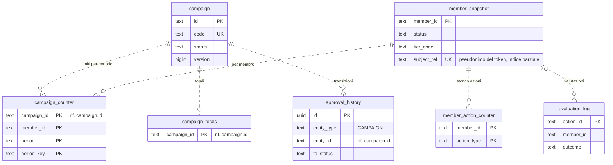
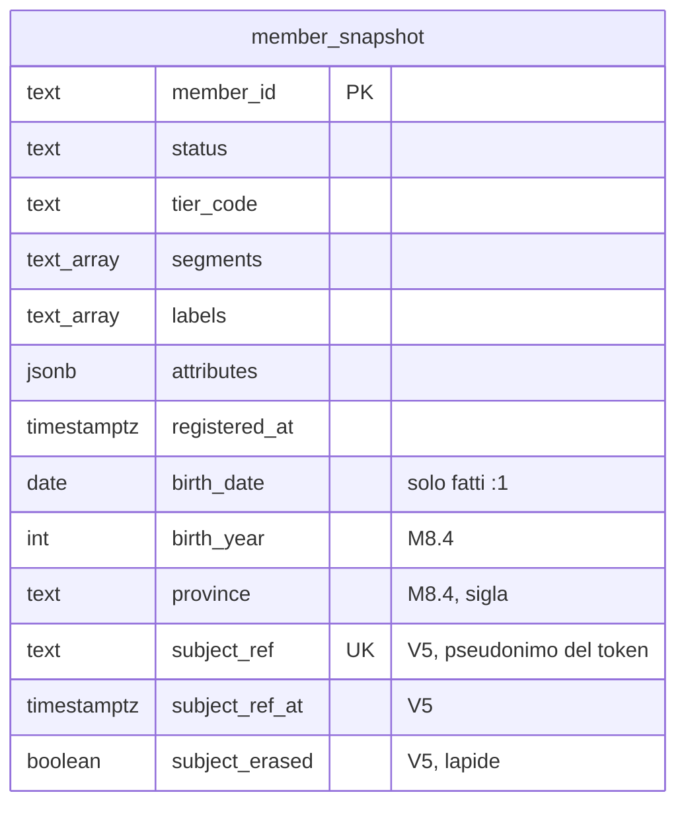
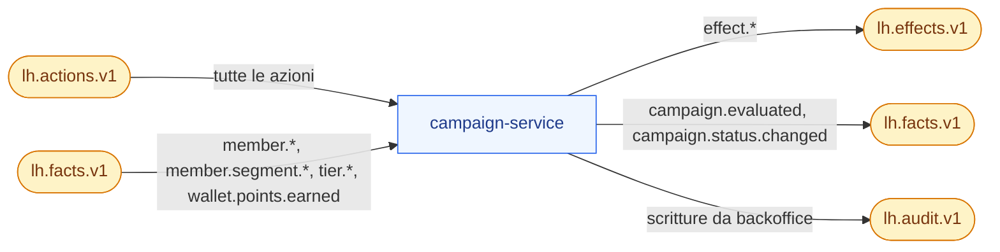

# campaign-service

**Porta** 8083 · **Schema** `campaign` · **Feature** `F-CMP-*` · **Milestone** M1 (motore, punti, limiti, simulazione), M2 (statistiche), M3 (moltiplicatori, esclusività), M5 (altri effetti, campagne di sistema), M6 (segmenti), M7 (approvazione)

## 1. Scopo e confini
Il **motore regole**: valuta ogni azione contro le campagne attive e decide gli effetti. Unico produttore di `lh.effects.v1`. Tiene contatori dei limiti, budget e il registro delle valutazioni (spiegabilità).
Non applica gli effetti e non conosce i saldi.

## 2. Modello dati
| Tabella | Colonne principali |
|---|---|
| `campaign` | `id`, `code` UQ, `name`, `description`, `member_description` (testo per il portale), `icon`, `trigger_action_types text[]`, `audience jsonb`, `conditions jsonb`, `effects jsonb`, `limits jsonb`, `schedule jsonb`, `priority int`, `exclusive_group`, `visible_in_portal bool`, `system bool`, `requires_legal bool`, `labels text[]`, `status`, `version`, audit cols |
| `campaign_counter` | (`campaign_id`, `member_id`, `period`, `period_key`) PK, `matches int`, `points bigint`, `last_match_at` (`time` di business dell'ultimo match, per `cooldownMinutes`). Una riga per periodo dichiarato nei limiti più la riga `ALWAYS`/`ALWAYS`, sempre presente: accumula i punti del membro (`perMemberPoints`) |
| `campaign_totals` | `campaign_id` PK, `matches`, `unique_members`, `points_decided bigint`, `points_granted bigint` (da fatti wallet), `last_match_at` |
| `member_action_counter` | (`member_id`, `action_type`) PK, `count`, `first_at`, `last_at` |
| `member_snapshot` | `member_id` PK, `status`, `tier_code`, `segments text[]`, `labels text[]`, `attributes jsonb`, `registered_at`, `birth_date` (solo dai fatti `:1`, rimossa con la `:1`), `birth_year`, `province` (M8.4, V4); proiezione del legame account↔membro (Q-550, ADR-048, `V5`): `subject_ref` (pseudonimo HMAC di `iss`+`sub`, mai il `sub`), `subject_ref_at` (istante dell'ultimo aggiornamento del legame), `subject_erased` (lapide dell'anonimizzazione) · indice unico parziale su `subject_ref` |
| `evaluation_log` | `action_id` PK, `member_id`, `action_type`, `action_time`, `evaluated_at`, `correlation_id`, `outcome` (`MATCHED, NO_MATCH, NO_MEMBER`), `results jsonb` |

Tracciato delle tabelle (docs/18 §3.12-bis, verificato sulle migrazioni `V1`–`V5`). Le migrazioni di campaign non dichiarano vincoli `FOREIGN KEY`: tutte le relazioni sono logiche (linee tratteggiate) e le tiene il codice. Le tabelle comuni di lh-common (`outbox`, `processed_event`, `approval_history`, docs/06 §1) esistono in ogni schema; qui compare solo `approval_history`, che registra le transizioni delle campagne (`entity_type = CAMPAIGN`, docs/03 §3.6).

Dettaglio dello snapshot del membro (M8.4, M8.10f):

`results` = `[{campaignCode, campaignName, matched, reason?, failedConditions?[{field,cmp,value,actual}], effects?[…]}]`. Pulizia `evaluation_log` > 30 giorni.

## 3. API
### Gestione
| Metodo | Path | Note |
|---|---|---|
| GET | `/v1/campaigns` | filtri `status, actionType, q, label, system`; include `totals` |
| POST/GET/PUT | `/v1/campaigns`, `/v1/campaigns/{id}` | `{id}` = id o `code` (vale per tutti i path `/v1/campaigns/{id}/…`, docs/06 §2). POST: `code` nel formato `^[A-Z][A-Z0-9-]{2,39}$` (`422 INVALID_CODE`), `requiresLegal` opzionale (default `false`; solo alla creazione, SPEC-GAP Q-254). PUT su `LIVE` → solo campi sicuri, altrimenti `409 CAMPAIGN_LIVE_LOCKED`; `code` mai modificabile (`409 CODE_IMMUTABLE`, Q-51). Il PUT porta la `version` letta: assente → `409 VERSION_REQUIRED` (Q-249), superata → `409 VERSION_CONFLICT` (Q-112) |
| POST | `/v1/campaigns/{id}/transitions` | `docs/06 §7`; le `system` non ammettono `ARCHIVE` |
| POST | `/v1/campaigns/{id}/duplicate` | nuovo `code` = `<code>-COPY-n` (primo `n` libero; base accorciata se servisse a restare entro 40 caratteri, SPEC-GAP Q-253), stato `DRAFT` |
| POST | `/v1/campaigns/validate` | valida struttura di condizioni/effetti/limiti senza salvare → `{valid, errors[]}` |
| POST | `/v1/campaigns/simulate` | `{action: {type, time?, source?, data}, memberId? , memberOverride?: {tier, segments, attributes}, campaignIds?: []}` → stessa forma di `evaluation_log.results` + totali per valuta. Con `campaignIds` include anche bozze |
| GET | `/v1/campaigns/{id}/stats` | totali + serie giornaliera 30 giorni (da `evaluation_log`) |
| GET | `/v1/evaluations` | filtri `memberId, actionId, outcome, from, to`; `limit` da 1 a 100 (predefinito 50): minore di 1 o non numerico → 400 `BAD_REQUEST`, oltre il massimo (`PageParams.MAX_SIZE`) si riduce al massimo (Q-532) |
| GET | `/v1/evaluations/{actionId}` | dettaglio completo |
| GET | `/v1/approvals` | formato comune |
| GET | `/v1/meta/condition-fields` | campi `member.*`, `context.*`, `history.*` con tipo e valori ammessi (i `data.*` arrivano da ingestion) |

### Portale
Il membro viene solo dal token (Q-410, ADR-048, docs/06 §3.4): nessun `memberId` in query, che in `enterprise` dà `400 MEMBER_FROM_TOKEN` (come `X-LH-Member`). L'elenco è `@MemberEndpoint(OPTIONAL)`: con un membro (il token in `enterprise`; `X-LH-Member` o il `memberId` esplicito in `demo`, regola 6-bis) le campagne sono filtrate per il suo pubblico; senza (un operatore o un token misto: BO-17 legge le regole con `codes=`, Q-554 e Q-560; un membro non ancora legato o anonimizzato) vale la vista generica, mai un errore. Il portale di campaign non ha scritture.

| GET | `/v1/portal/campaigns?codes=` | campagne `LIVE`, `visible_in_portal`, con pubblico soddisfatto per il membro del token: `{code, name, memberDescription, icon, rewardSummary ("+300 punti"), memberLimit?: {max, period}, endsAt?}`; `codes` (elenco, opzionale) le seleziona per codice anche se non elencate in «Guadagna» (PT-11 referral). `@MemberEndpoint(OPTIONAL)`. Il parametro `memberId` è uscito dal contratto e vale solo in `demo` |

## 4. Eventi
| Direzione | Topic | Tipi |
|---|---|---|
| Consuma | `lh.actions.v1` | tutte |
| Consuma | `lh.facts.v1` | `member.*`, `member.segment.*`, `tier.*` → `member_snapshot` (`member.registered`/`updated` portano anche il legame `subjectRef`, §5); `wallet.points.earned` → `campaign_totals.points_granted` |
| Produce | `lh.effects.v1` | tutti gli `effect.*` |
| Produce | `lh.facts.v1` | `campaign.evaluated`, `campaign.status.changed` |
| Produce | `lh.audit.v1` | scritture da backoffice |

A sinistra i topic che campaign consuma, a destra quelli su cui pubblica (sempre tramite outbox, docs/04 §5).

## 5. Regole
- Algoritmo: `docs/03 §3.5`, senza deviazioni. Il motore è una classe pura `CampaignEngine.evaluate(action, memberSnapshot, campaigns, counters, clock)` testabile senza Spring.
- Le campagne `LIVE` sono tenute in cache in memoria, invalidata a ogni scrittura/transizione (e comunque ogni 30 s).
- Fine automatica: job ogni minuto porta a `ENDED` le `LIVE`/`PAUSED` con `schedule.endAt` superato.
- `rewardSummary` per il portale è generato dagli effetti: `FIXED` → "+300 punti"; `PER_AMOUNT` → "1 punto ogni 1 €"; `MULTIPLIER` → "Punti ×2"; `GRANT_PLAYS` → "+1 giocata".
- Validazioni di salvataggio (`422`): almeno un trigger; almeno un effetto; `MULTIPLIER.factor` tra 1.1 e 5; `GRANT_PLAYS.contestCode`, `ISSUE_COUPON.rewardCode` (o `rewardCodeField`), `AWARD_BADGE.badgeCode` e `SEND_MESSAGE.templateCode` non vuoti (l'esistenza non è verificabile senza chiamate sincrone: l'errore emergerà a valle in DLQ e nel tracciato); `GRANT_POINTS.unitStep` > 0 se presente (Q-228); `audience` oggetto con le sole chiavi `all`, `tiers`, `segments` (Q-214); `schedule.startAt`/`endAt`, se presenti e non `null`, istanti ISO-8601 anche da soli (Q-243); `endAt > startAt`.
- Pubblico (docs/03 §3.2, F-CMP-06; motore e portale usano la stessa regola): assente (`null` o `{}`) = tutti (Q-213); `tiers`/`segments` non vuoti restringono sempre, anche con `all=true` (Q-210); insieme vanno soddisfatti entrambi — AND tra i criteri, OR dentro ciascuno, come il pubblico dei contenuti (Q-212, Q-161); senza elenchi non vuoti vale solo `all=true`, altrimenti nessuno (`AUDIENCE`, Q-211).
- Scelte conservative del motore (docs/15): `hours: [da, a]` è la fascia `[da, a)` — `[9, 18]` finisce alle 18:00 (Q-238); `rounding: ROUND` porta la metà esatta per difetto (130,5 → 130, Q-227); `PER_AMOUNT` con `unitStep` ≤ 0 o `ISSUE_COUPON` con `rewardCodeField` non risolvibile dall'azione scartano l'intera campagna con `EFFECT_NOT_SUPPORTED_YET`, prima dei limiti (Q-228, Q-232); l'accredito che supera il residuo di `limits.global.maxPoints` (o di `perMemberPoints`) si riduce al residuo (Q-237).
- Limiti per membro oltre ai periodi (F-CMP-05, docs/03 §3.2; SPEC-GAP Q-165): `limits.perMemberPoints` — punti già decisi dalla campagna per il membro da sempre ≥ tetto → `LIMIT` (sotto il tetto l'ultimo accredito si riduce al residuo, come il budget: Q-237); `limits.cooldownMinutes` — meno di N minuti tra il `time` dell'ultimo match del membro sulla campagna e quello dell'azione → `LIMIT`. Letti anche dalla simulazione, consumati solo dalla valutazione reale.
- **Condizioni** (docs/03 §3.3): cast tipizzato comune di lh-common (`io.loyaltyhub.common.condition.TypedCast`, Q-215/Q-216 decise), identico in campaign, member, gamification ed engagement: il **tipo bersaglio è quello del dato** e si converte il valore della regola, mai il contrario; numero ← numero JSON o testo `^-?\d+(\.\d+)?$` esatto (confronto `BigDecimal`), booleano ← `true`/`false` JSON o testo esatto, data ← `AAAA-MM-GG` valida, istante ← data e ora ISO-8601 con fuso (stessa granularità: una data non si confronta con un istante), testo ← solo testo; cast fallito → foglia falsa per ogni comparatore, negazioni comprese; `contains/ncontains/startsWith` solo su testo (una data non è testo); campo assente o `null` → falsa tranne `nexists`; comparatore sconosciuto → falsa. Gruppi (decisioni conservative): operatore sconosciuto → falso (Q-223), `any` senza regole → falso (Q-222), foglia senza `field` o senza `cmp` → falsa (Q-224, Q-219); condizioni `null` o `{}` → vere. Al salvataggio (`POST/PUT /v1/campaigns`) gli stessi casi, il valore mancante o di forma sbagliata e il valore non convertibile nel tipo dei campi calcolati dal motore (`member.tier/status/age/registeredDaysAgo`, `context.source/dayOfWeek/hour/date`, `history.*`) → `422 CONDITION_INVALID` con il percorso JSON in `errors[].field` (es. `conditions.rules[0].cmp`); `POST /v1/campaigns/validate` li restituisce come `percorso: messaggio`. I tipi di `data.*` (catalogo di ingestion) e di `member.attributes.*` (definizioni di member) non sono raggiungibili senza chiamate sincrone: li verifica il costruttore del backoffice con la stessa politica (SPEC-GAP: Q-215).
- **Fonti ammesse** (docs/08 §BO-06 «2 Quando», Q-208): nessun campo dedicato nella campagna. Sono la regola `context.source in ["urn:loyaltyhub:source:<codice>", …]` figlia del gruppo TUTTE alla radice di `conditions` (il valore di `context.source` è l'URN della fonte dell'azione, docs/05 §2); assente = tutte le fonti. Righe TB-CMP-CTX-023…025.
- Validazioni di salvataggio (`422`): almeno un trigger; almeno un effetto; `MULTIPLIER.factor` tra 1.1 e 5; `GRANT_PLAYS.contestCode`, `ISSUE_COUPON.rewardCode` (o `rewardCodeField`), `AWARD_BADGE.badgeCode` e `SEND_MESSAGE.templateCode` non vuoti (l'esistenza non è verificabile senza chiamate sincrone: l'errore emergerà a valle in DLQ e nel tracciato); `endAt > startAt`.
- Limiti per membro oltre ai periodi (F-CMP-05, docs/03 §3.2; SPEC-GAP Q-165): `limits.perMemberPoints` — punti già decisi dalla campagna per il membro da sempre ≥ tetto → `LIMIT` (l'ultimo accredito sotto il tetto non si riduce, come il budget); `limits.cooldownMinutes` — meno di N minuti tra il `time` dell'ultimo match del membro sulla campagna e quello dell'azione → `LIMIT`. Letti anche dalla simulazione, consumati solo dalla valutazione reale.
- **Legame token↔membro** (Q-550, ADR-048, docs/06 §3.4): `member.registered` e `member.updated` (schemi `:1` e `:2`) portano il campo opzionale `subjectRef`; `MemberSubjectProjection` lo applica a `member_snapshot` con `MemberSubjectRules` di lh-common, nella stessa transazione dello snapshot e dell'inbox idempotente (`MemberSnapshotHandler`). Assente = nessun effetto (un member-service più vecchio non slega nessuno); `null` = slega; un fatto più vecchio di `subject_ref_at` o di un membro già cancellato non ri-lega; lo stesso pseudonimo su due membri va al più recente (a parità, all'id maggiore) e il sorpasso incrementa `lh_member_subject_relinked_total`; l'anonimizzazione (`member.status.changed`/`updated` con `ANONYMIZED`) azzera il legame e scrive la lapide `subject_erased`, che nessun replay ripristina. Un fatto senza `time` non vale «adesso»: non sorpassa un detentore datato e lascia `subject_ref_at` com'è (l'anonimizzazione vale comunque). Due membri che reclamano lo stesso pseudonimo da partizioni diverse convergono per ritentativo: il secondo commit viola l'indice unico `campaign_member_subject_ref_uq`, il consumer ritenta e le regole si rivalutano. `CampaignMemberSubjectLookup` risolve il membro del token con l'indice locale (non autorevole). Poiché l'unico handler del portale è `OPTIONAL`, un legame assente (il fatto non è ancora arrivato, o il membro è anonimizzato) dà la vista generica e non `409 MEMBER_NOT_LINKED`: non serve un ritentativo, e la vista generica non rivela nulla di un membro. Nessuna chiamata sincrona, nessun dato personale sul bus.
- Azione per membro assente dallo snapshot: ritenta 3 volte (il fatto `member.registered` può essere in arrivo), poi `NO_MEMBER`. Il consumer delle azioni rilegge lo snapshot dopo 0,5 s, 1 s e 2 s (`loyaltyhub.engine.member-wait-ms`), prima della transazione del consumer idempotente; scaduti i tentativi la valutazione registra `NO_MEMBER`, senza DLQ. L'attesa non blocca il consumer: il listener fa `nack` con il ritardo, il container mette in pausa le partizioni e resta nel `poll()`, poi riconsegna lo stesso record. Così un ribilanciamento del gruppo `lh-campaign`, che condivide i consumer di azioni e fatti, si chiude durante l'attesa e il consumer dei fatti riceve le partizioni da cui arriva lo snapshot (Q-489). I tentativi si contano per record; si rinuncia solo a tentativi esauriti e ad almeno 3,5 s dalla prima consegna, e un record già esaurito non riapre l'attesa se la valutazione viene ritentata. Il container delle azioni usa `pollTimeout` 250 ms (`loyaltyhub.engine.actions-poll-timeout-ms`): la ripresa dopo un nack si valuta tra due `poll()`, quindi ogni ritardo si allunga al più di un `pollTimeout` e `NO_MEMBER` arriva dopo circa 3,5–4,5 s (con il default di 5 s sarebbero circa 15 s, con le partizioni di quel consumer ferme). Nel profilo `inproc` il bus riconsegna lo stesso record dopo il ritardo, sul suo unico thread. Solo uno snapshot assente attende: un membro noto ma non `ACTIVE` è `NO_MEMBER` subito (SPEC-GAP: Q-169). Caso tipico: l'azione del ponte interno `member.registered` (bonus di benvenuto) che precede il fatto omonimo, su un altro topic.

## 6. Seed
`seed/campaigns.json` (19 campagne, `docs/10 §4`), `seed/members.json` + `seed/wallets.json` (snapshot), `seed/activity-history.json` (contatori e 60 valutazioni storiche).

## 7. Accettazione minima
- Azione `purchase.completed` da 130 € per un membro `SILVER` di martedì → due effetti `points.grant` (`PTS` 130 con `tierMultiplierApplies`, `STS` 130), log `MATCHED`.
- Stessa azione di sabato → `PTS` 260 (`campaignMultiplier` 2.0), `STS` 130.
- `app.login.daily` due volte nello stesso giorno → la seconda `skipped` con `LIMIT`.
- Doppia consegna della stessa azione → un solo insieme di effetti in outbox, contatori incrementati una volta.
- Simulazione di `ebill.activated` per un membro che l'ha già ottenuta → `matched=false`, `reason=LIMIT`, nessuna scrittura.
- Condizione su campo assente → foglia falsa, nessuna eccezione.

## 8. Fase 2 (profilo `enterprise`)

Riferimento: `docs/18`. Le righe qui sotto sono segnaposto dell'adozione (M8.0): la fetta citata le rende normative aggiornando questa scheda.

- **Membro dal token** (M8.10f, ADR-048, Q-410, Q-550; F2-SEC-09): `V5__member_subject.sql` aggiunge a `member_snapshot` il legame `subject_ref` (pseudonimo, mai il `sub`) con `subject_ref_at` e la lapide `subject_erased`; `MemberSubjectProjection` lo alimenta da `member.registered`/`member.updated`; l'elenco `GET /v1/portal/campaigns` è `@MemberEndpoint(OPTIONAL)` e `memberId` esce dal contratto (valido solo in `demo`). Sequenza completa in docs/06 §3.4. Testbook: TB-CMP-MBP (`docs/testbook/TB-CMP-campagne.md` §16).
- **Dati personali** (ADR-032, M8.4): `member_snapshot` guadagna `birth_year` e `province` (V4, fase expand; `birth_date` resta finché si leggono i fatti `:1`, Q-346). Doppia lettura: dalla `:2` `birthYear`/`province`, dalla `:1` l'anno ricavato dalla data; un fatto senza il campo non lo cancella. `member.age` con il solo anno = età minima certa (Q-366); nuovo campo condizione `member.province` (sigla, Q-344).
- **Budget** (ADR-045, M13.4): `campaign.budget` con soglie (`warnAt`) e azione a esaurimento; fatti `campaign.budget.threshold` e `campaign.budget.exhausted`.
- **Punteggi** (ADR-045, M13.5): gli attributi `SCORE` sono ammessi solo nelle condizioni e mai in effetti negativi (validatore al salvataggio).

**Classificazione `x-lh-class`** (`docs/18 §3.15`, F2-GRC-05; prima stesura M8.0, verificata e resa per colonna in M8.13). Tutto ciò che non è elencato è `INTERNAL`.
- `PERSONAL`: `member_snapshot.birth_date` (fino a M8.4), `member_snapshot.attributes` con `pii:true`.
- `CONFIDENTIAL`: `evaluation_log.results` (profilazione per membro), `campaign_counter`, `member_action_counter`.
- `PUBLIC`: `campaign.member_description`, `icon` delle campagne visibili nel portale.
