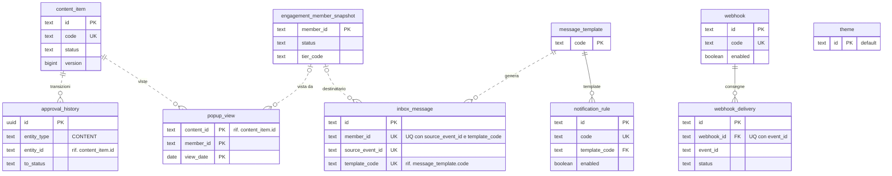
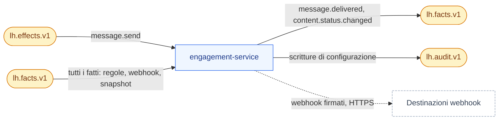

# engagement-service

**Porta** 8087 · **Schema** `engagement` · **Feature** `F-CNT-*`, `F-MSG-*`, `F-THM-01`, `F-WBH-01` · **Milestone** M6 (inbox, template, regole, contenuti, pop-up, tema, anteprima), M7 (webhook)

## 1. Scopo e confini
È il **CMS del programma**: card, pop-up, banner, card di vincita; **inbox** in-app generata dai fatti; **tema** del portale; **webhook** in uscita.
Non invia email/SMS/push reali: il canale `EMAIL_FAKE` produce solo un'anteprima consultabile da BO-19.

## 2. Modello dati
| Tabella | Colonne principali |
|---|---|
| `content_item` | `id`, `code` UQ, `kind` (`CARD, POPUP, BANNER`), `placement` (`HOME_HERO, HOME_GRID, CATALOG_TOP, CONTEST, WIN`), `title`, `body`, `image_url`, `cta_label`, `cta_target` (path del portale o URL), `link_type` (`NONE, CONTEST, CAMPAIGN, REWARD, PRIZE`), `link_code`, `audience jsonb` (`{tiers[], segments[], statuses[]}`; vuoto = tutti), `start_at`, `end_at`, `priority`, `frequency` (`ONCE, ONCE_PER_DAY, ALWAYS`; solo pop-up), `dismissible`, `style jsonb` (`{tone: PRIMARY/SECONDARY/COIN/NIGHT, layout}`), `status` (`DRAFT, LIVE, PAUSED, ENDED, ARCHIVED`), `version` |
| `popup_view` | (`content_id`,`member_id`,`view_date`) PK, `seen_at`, `dismissed_at` |
| `message_template` | `code` PK, `name`, `channel` (`INAPP, EMAIL_FAKE`), `title_tpl`, `body_tpl`, `icon`, `link_target`, `category` (`POINTS, TIER, REWARD, GAME, PROGRAM`) |
| `notification_rule` | `id`, `code` UQ (SPEC-GAP Q-69), `fact_type`, `condition jsonb` null (stesso formato condizioni, spazio `data.*`), `template_code`, `enabled` |
| `inbox_message` | `id` (ULID), `member_id`, `template_code`, `channel`, `title`, `body`, `icon`, `link_target`, `category`, `source_event_id`, `source_type` (tipo breve dell'evento sorgente, registro BO-19), `correlation_id`, `created_at`, `read_at` · UQ (`member_id`,`source_event_id`,`template_code`) |
| `theme` | `id` = `default`, `program_name`, `tagline`, `logo_url`, `colors jsonb` (`{primary, secondary, coin, night, bg}`), `hero_title`, `hero_subtitle`, `font_display`, `currency_names jsonb` (nomi delle valute nel portale, Q-79), `updated_at` |
| `webhook` | `id`, `code` UQ (SPEC-GAP Q-97), `name`, `url`, `secret`, `fact_types text[]`, `enabled`, `created_by` |
| `webhook_delivery` | `id`, `webhook_id`, `event_id`, `fact_type`, `attempt`, `status` (`PENDING, OK, FAILED, GAVE_UP`), `http_status`, `response_excerpt`, `next_attempt_at`, `created_at` · UQ (`webhook_id`,`event_id`); in più (SPEC-GAP Q-97) `member_id`, `test`, `payload`, `signature`, `error`, `duration_ms`, `last_attempt_at`, `claimed_until` |
| `engagement_member_snapshot` | `member_id` PK, `first_name`, `status`, `tier_code`, `segments text[]`, `registered_at` (V3, Q-71), `updated_at`. Prefisso `engagement_` per non collidere con `campaign.member_snapshot` nel search_path dell'hub (ADR-023) |

Tracciato delle tabelle (docs/18 §3.12-bis, verificato sulle migrazioni `V1`–`V5`). Linee continue: vincolo `FOREIGN KEY` nella migrazione (`notification_rule.template_code`, `webhook_delivery.webhook_id`); tratteggiate: riferimento logico tenuto dal codice. Delle tabelle comuni di lh-common (docs/06 §1) compare solo `approval_history`, che registra le transizioni dei contenuti (`entity_type = CONTENT`, ciclo comune di docs/03 §3.6). `theme` è una riga sola (`default`) senza relazioni.

## 3. API
### Gestione
| Metodo | Path | Note |
|---|---|---|
| GET/POST/PUT | `/v1/contents`, `/v1/contents/{id}` | filtri `kind, placement, status, q`; PUT su `LIVE` o `PAUSED` → solo campi sicuri (titolo, testo, immagine, priorità, `endAt`; docs/03 §3.6, Q-174), altrimenti `409 CONTENT_LIVE_LOCKED`; PUT su `ENDED` o `ARCHIVED` → `409 CONTENT_NOT_EDITABLE` (Q-174) |
| POST | `/v1/contents/{id}/transitions` | `CONTENT` non richiede approvazione (`DRAFT → LIVE` diretto) |
| GET | `/v1/contents/{id}/approval-history` | storico delle transizioni (`approval_history`, `entity_type = CONTENT`: chi, quando, da/verso; docs/03 §3.6, docs/06 §7), dal più recente |
| POST | `/v1/contents/{id}/duplicate` | |
| GET | `/v1/contents/preview?memberId=&placement=` | ciò che vedrebbe quel membro adesso, con il motivo di esclusione degli altri (`NOT_IN_AUDIENCE, OUT_OF_SCHEDULE, NOT_LIVE, FREQUENCY`) |
| GET/POST/PUT | `/v1/message-templates`, `/v1/notification-rules` | |
| POST | `/v1/message-templates/{code}/render` | `{sampleEvent}` → anteprima con segnaposto risolti |
| GET | `/v1/messages?memberId=&category=&channel=` | registro messaggi per BO-19 e Scheda 360° |
| GET/PUT | `/v1/theme` | colori validati come esadecimali; contrasto testo/primario ≥ 4.5 altrimenti `422 THEME_CONTRAST_TOO_LOW` |
| GET/POST/PUT/DELETE | `/v1/webhooks` · GET `/v1/webhooks/{id}/deliveries` · POST `/v1/webhooks/{id}/test` · POST `/v1/webhook-deliveries/{id}/retry` | il `secret` si legge solo alla creazione |

### Portale
| Metodo | Path | Note |
|---|---|---|
| GET | `/v1/portal/content?memberId=&placement=` | elenco ordinato; per `WIN` aggiungere `&prizeCode=` |
| GET | `/v1/portal/popups/next?memberId=` | `204` se nessuno |
| POST | `/v1/portal/popups/{id}/seen` | `{memberId, dismissed}` |
| GET | `/v1/portal/inbox?memberId=&page=` · GET `/v1/portal/inbox/unread-count?memberId=` | |
| POST | `/v1/portal/inbox/{id}/read` · POST `/v1/portal/inbox/read-all` | |
| GET | `/v1/portal/theme` | cache 60 s |

## 4. Eventi
| Direzione | Topic | Tipi |
|---|---|---|
| Consuma | `lh.effects.v1` | `message.send` |
| Consuma | `lh.facts.v1` | tutti (regole di notifica, webhook); `member.*`, `tier.*`, `member.segment.*` anche per lo snapshot |
| Produce | `lh.facts.v1` | `message.delivered`, `content.status.changed` |
| Produce | `lh.audit.v1` | scritture su contenuti, template, regole, tema, webhook |

A sinistra i topic che engagement consuma, a destra quelli su cui pubblica (tramite outbox, docs/04 §5). I webhook in uscita non passano da Kafka: sono chiamate HTTP verso destinazioni configurate.

## 5. Regole
Dominio in `docs/03 §9`. Note implementative:
- **Motore template**: sostituzione `{{percorso}}` su contesto `{data, member, event}`; percorso assente → stringa vuota + log `WARN`; nessuna logica nei template. Formattatori: `{{data.amount|number}}`, `{{data.expiresAt|date}}`.
- `message.delivered` **non** è mai oggetto di regole né di webhook (evita cicli).
- **Condizione della regola** (spazio `data.*` del fatto, docs/03 §3.3): cast tipizzato comune di lh-common (`io.loyaltyhub.common.condition.TypedCast`, Q-215/Q-216 decise), identico in campaign, member, gamification ed engagement: il **tipo bersaglio è quello del dato** e si converte il valore della regola, mai il contrario; numero ← numero JSON o testo `^-?\d+(\.\d+)?$` esatto (confronto `BigDecimal`), booleano ← `true`/`false` JSON o testo esatto, data ← `AAAA-MM-GG` valida, istante ← data e ora ISO-8601 con fuso (stessa granularità: una data non si confronta con un istante), testo ← solo testo; cast fallito → foglia falsa per ogni comparatore, negazioni comprese; `contains/ncontains/startsWith` solo su testo (una data non è testo); campo assente o `null` → falsa tranne `nexists`; comparatore sconosciuto → falsa. Decisioni conservative (Q-179): `null` = assente, `between` con estremi inclusi, la stringa numerica del dato resta testo, `all` vuoto vero, `any` vuoto falso, comparatore sconosciuto falso. Al salvataggio: operatore di gruppo sconosciuto, `any` vuoto, foglia senza `field` o `cmp`, comparatore sconosciuto, campo fuori da `data.*`, valore mancante o di forma sbagliata → `422 RULE_INVALID` sul campo `condition` con il percorso nel messaggio (es. `condition.rules[0].cmp: …`) (Q-215).
- **Webhook**: corpo = CloudEvent originale; header `X-LH-Signature: sha256=<HMAC(secret, body)>`, `X-LH-Event-Id`, `X-LH-Delivery-Id`; timeout 5 s; ritenti a 1, 5, 15 min poi `GAVE_UP`; scheduler ogni 30 s; solo URL `https://` (in `local` anche `http://localhost`); blocca indirizzi privati/loopback nel profilo `free` (anti-SSRF).
- **Destinatari** (regole e `message.send`): nessun messaggio ai membri `ANONYMIZED` (Q-70) né `INACTIVE` (Q-180); i `BLOCKED` e i membri di cui manca ancora lo snapshot lo ricevono.
- **Webhook**: corpo = CloudEvent originale; header `X-LH-Signature: sha256=<HMAC(secret, body)>`, `X-LH-Event-Id`, `X-LH-Delivery-Id`; timeout 5 s; ritenti a 1, 5, 15 min poi `GAVE_UP`; scheduler ogni 30 s; solo URL `https://` (in `local` anche `http://localhost`); blocca indirizzi privati/loopback nel profilo `free` (anti-SSRF); un host numerico è accettato solo in forma puntata canonica `a.b.c.d` (forme decimali, esadecimali, ottali o abbreviate come `2130706433`, `0x7f000001`, `127.1` → `422` al salvataggio, in ogni profilo; Q-184).

Ciclo di vita di una consegna (`webhook_delivery.status`, `WebhookRetry`): il primo invio e tre ritenti a 1, 5 e 15 minuti; un 2xx chiude in `OK`, il quarto fallimento in `GAVE_UP`. *Riprova* (BO-23) è un solo tentativo immediato su una consegna `FAILED` o `GAVE_UP` che rientra nella stessa tabella dei ritenti (SPEC-GAP Q-98).

```mermaid
stateDiagram-v2
  accTitle: Ciclo di vita di una consegna webhook
  accDescr: Una consegna nasce in attesa; un 2xx la chiude in OK; un fallimento la porta in FAILED con il prossimo tentativo a 1, 5 o 15 minuti; al quarto fallimento diventa GAVE_UP; Riprova manuale fa un tentativo immediato da FAILED o GAVE_UP.
  [*] --> PENDING: fatto sottoscritto o evento di prova
  PENDING --> OK: 2xx
  PENDING --> FAILED: errore, ritento a 1 min
  FAILED --> OK: 2xx al ritento
  FAILED --> FAILED: errore, ritento a 5 o 15 min
  FAILED --> GAVE_UP: quarto tentativo fallito
  GAVE_UP --> OK: Riprova con 2xx
  GAVE_UP --> GAVE_UP: Riprova fallito
  OK --> [*]
```

- `popups/next`: primo per priorità che passa pubblico, calendario e frequenza; la registrazione della vista avviene con `seen` (non alla lettura) così un errore di rendering non consuma il pop-up.
- `ENDED` automatico dei contenuti con `end_at` passato (job ogni 10 min).
- Pulizia: `inbox_message` > 180 giorni, `webhook_delivery` > 14 giorni, `popup_view` > 90 giorni.

## 6. Seed
`seed/contents.json`, `seed/message-templates.json`, `seed/notification-rules.json`, `seed/theme.json` (tema **Aurora**), `seed/webhooks.json` (uno, disabilitato, verso `https://example.org/hook`), `seed/inbox.json` (3–8 messaggi storici per membro, alcuni non letti). Immagini: file statici in `web/public/demo/` referenziati per percorso relativo. Dettaglio in `docs/10 §7`.

Regole seed minime: `wallet.points.earned → MSG-POINTS-EARNED`; `wallet.points.expiring → MSG-POINTS-EXPIRING`; `tier.upgraded → MSG-TIER-UP`; `tier.downgraded → MSG-TIER-DOWN`; `reward.redemption.fulfilled → MSG-REWARD-READY`; `reward.redemption.rejected → MSG-REWARD-REJECTED`; `coupon.issued (origin=CAMPAIGN) → MSG-COUPON-GIFT`; `contest.won → MSG-CONTEST-WON`; `badge.awarded → MSG-BADGE`; `referral.completed (role=REFERRER) → MSG-REFERRAL-DONE`; `member.registered → MSG-WELCOME`.

## 7. Accettazione minima
- `wallet.points.earned` di 162 PTS → messaggio "Hai guadagnato 162 punti" nell'inbox; stesso evento rielaborato → nessun duplicato.
- Pop-up `ONCE` visto e chiuso → non ricompare; `ONCE_PER_DAY` ricompare il giorno dopo (test con orologio iniettato).
- Contenuto con `audience.tiers=[GOLD,PLATINUM]` → assente per Anna, presente per Davide; `preview` ne spiega il motivo.
- `PUT /v1/theme` con nuovo `primary` → `GET /v1/portal/theme` lo restituisce; il portale cambia colore senza rebuild.
- Webhook di test verso un endpoint che risponde 500 → 3 ritenti pianificati, stato finale `GAVE_UP`, firma verificabile.

## 8. Fase 2 (profilo `enterprise`)

Riferimento: `docs/18`. Le righe qui sotto sono segnaposto dell'adozione (M8.0): la fetta citata le rende normative aggiornando questa scheda.

- **Rinomina in `experience-service`** (ADR-031, M10.3): schema `engagement → experience` con doppia lettura dei consumer group; composizione versionata (notify-and-pull da Directus, validatore, rollback, `block_reference`), `GET /v1/portal/pages/{slug}`; nuova scheda `docs/servizi/experience-service.md`.
- **Bridge audit del CMS** (ADR-043, M8.12): `POST /v1/audit/external` (HMAC come `/v1/cms/notify`) verso `audit_entry`.
- **Dati personali** (ADR-032, M8.4): `member_snapshot.first_name` esce dagli snapshot; i segnaposto con il nome si risolvono nel BFF a lettura.
- **Doppia lettura `member.*:1`/`:2`** (ADR-032, `docs/18 §3.4`, Q-346; M8.4e, in vigore): `member.registered` e `member.updated` si leggono in entrambe le versioni, scelte dal suffisso di `dataschema` (assente = `:1`). Dalla `:1` si prende ancora `firstName`; dalla `:2` mai (nemmeno se comparisse). Un campo assente nella versione ricevuta non sovrascrive il valore noto: `first_name`, `status` e `registered_at` di `engagement_member_snapshot` si aggiornano con `COALESCE` (riga nuova senza stato → `ACTIVE`). `locale`, `birthYear`, `province` ed `emailHash` della `:2` non si conservano: in engagement non hanno lettore e nessuna colonna nuova è stata aggiunta. Rendering invariato: `{{member.firstName}}` usa il nome ricevuto da un `:1`; per un membro visto solo in `:2` il segnaposto si rende come ogni valore assente (stringa vuota, segnalato in `missing` nell'anteprima) finché il BFF non lo risolverà a lettura. Anonimizzazione invariata. La finestra dura fino a M10 (Q-346), poi la lettura `:1` si rimuove.

**Classificazione `x-lh-class`** (`docs/18 §3.15`, F2-GRC-05; prima stesura M8.0, verificata e resa per colonna in M8.13). Tutto ciò che non è elencato è `INTERNAL`.
- `PERSONAL`: `member_snapshot.first_name` (fino a M8.4), `inbox_message.title`/`body` (possono contenere il nome), `popup_view.member_id` con date.
- `CONFIDENTIAL`: `webhook.secret`, `webhook.url`, `webhook_delivery.response_excerpt`.
- `PUBLIC`: `content_item` pubblicati, `theme`.
