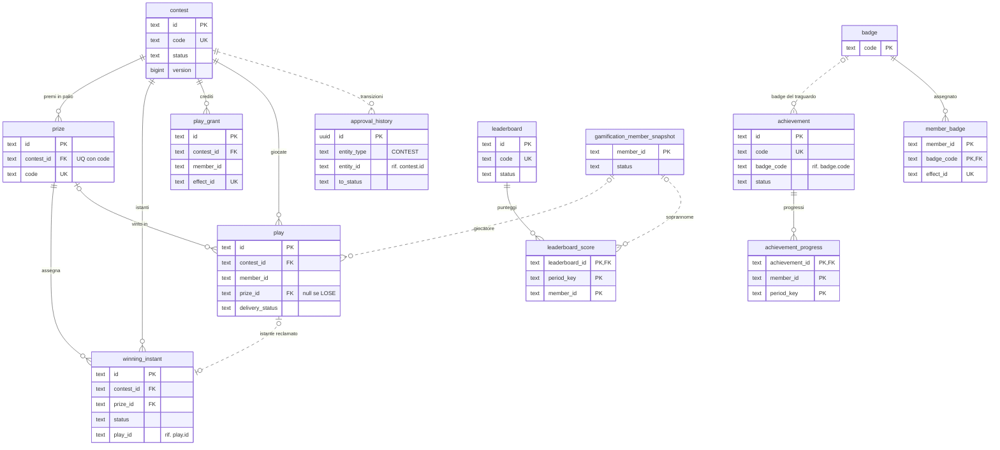
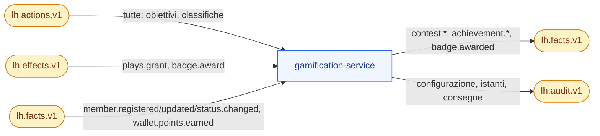

# gamification-service

**Porta** 8086 · **Schema** `gamification` · **Feature** `F-IW-*`, `F-ACH-*`, `F-LDB-*` · **Milestone** M5 (tutto), M7 (approvazione `LEGAL` dei concorsi)

## 1. Scopo e confini
Concorsi **instant win** a istanti vincenti pre-generati, **obiettivi** con progresso, **badge**, **classifiche**.
Non consegna i premi vinti: emette `contest.won`; la consegna avviene tramite ponte → azione `instantwin.won` → campagne di sistema. Il referral è di `member-service`.

## 2. Modello dati
| Tabella | Colonne principali |
|---|---|
| `contest` | `id`, `code` UQ, `name`, `description`, `rules_text`, `mechanic` (`WHEEL, SCRATCH, BOX`), `start_at`, `end_at`, `free_play_daily bool`, `max_plays_per_member_per_day`, `max_wins_per_member` null, `distribution` (`UNIFORM, BUSINESS_HOURS`), `seed bigint`, `instants_generated_at`, `status`, `version` |
| `prize` | `id`, `contest_id`, `code`, `name`, `type` (`POINTS, COUPON, PHYSICAL`), `points` null, `reward_code` null, `quantity_total`, `quantity_remaining`, `image_url`, `wheel_color`, `sort_order` · UQ (`contest_id`,`code`) |
| `winning_instant` | `id`, `contest_id`, `prize_id`, `instant_at`, `status` (`OPEN, CLAIMED, VOID`), `claimed_by`, `claimed_at`, `play_id`, `planted bool` · indice (`contest_id`,`status`,`instant_at`) |
| `play_grant` | `id`, `member_id`, `contest_id`, `count`, `effect_id` UQ, `campaign_code`, `granted_at` |
| `play` | `id` (ULID), `contest_id`, `member_id`, `kind` (`FREE_DAILY, CREDIT`), `outcome` (`WIN, LOSE`), `prize_id` null, `played_at`, `play_date` (`Europe/Rome`), `correlation_id`, `delivery_status` (`NA, PENDING, DELIVERED`), `delivery_note` |
| `achievement` | `id`, `code` UQ, `name`, `description`, `icon`, `action_types text[]`, `filter jsonb`, `metric`, `sum_field`, `streak_unit`, `target`, `period`, `repeatable`, `badge_code` null, `status` (`ACTIVE, INACTIVE`) |
| `achievement_progress` | (`achievement_id`,`member_id`,`period_key`) PK, `value`, `distinct_seen text[]`, `last_unit_key`, `completed_at` |
| `badge` | `code` PK, `name`, `description`, `icon`, `color` |
| `member_badge` | (`member_id`,`badge_code`) PK, `origin`, `awarded_at`, `effect_id` UQ null |
| `leaderboard` | `id`, `code` UQ, `name`, `metric` (`PTS_EARNED, STS_EARNED, ACTION_COUNT`), `action_types text[]`, `period` (`MONTH, EDITION, ALL_TIME`), `top_n`, `status` |
| `leaderboard_score` | (`leaderboard_id`,`period_key`,`member_id`) PK, `score`, `reached_at` · indice per ranking |
| `gamification_member_snapshot` | `member_id` PK, `nickname`, `status`, `updated_at`. Prefisso `gamification_` per non collidere con `campaign.member_snapshot` nel search_path dell'hub (ADR-023) |

Tracciato delle tabelle (docs/18 §3.12-bis, verificato sulle migrazioni `V1`–`V2`). Linee continue: vincolo `FOREIGN KEY` nella migrazione; tratteggiate: riferimento logico tenuto dal codice (`winning_instant.play_id`, `achievement.badge_code`, i `member_id`). Delle tabelle comuni di lh-common (docs/06 §1) compare solo `approval_history`, che registra le transizioni dei concorsi (`entity_type = CONTEST`); il ciclo di vita del concorso è quello comune di docs/03 §3.6, quello degli istanti vincenti è in docs/03 §6.

## 3. API
### Gestione
| Metodo | Path | Note |
|---|---|---|
| GET/POST/PUT | `/v1/contests`, `/v1/contests/{id}` | premi modificabili solo prima di `LIVE` |
| POST | `/v1/contests/{id}/transitions` | verso `LIVE` richiede istanti generati (`422 INSTANTS_NOT_GENERATED`) |
| POST | `/v1/contests/{id}/instants/generate` | `{seed?}`; rigenera da zero; vietato da `LIVE` in poi (`409`); senza premi o con `BUSINESS_HOURS` senza ore 08–22 nel periodo → `422 CONTEST_INVALID` (Q-294) |
| GET | `/v1/contests/{id}/instants` | **solo `ADMIN`/`LEGAL`** (altri `403`); filtri `status, prizeId`; + `GET …/instants/histogram` (conteggio per giorno, visibile ad `ADMIN`, `MARKETING` e `LEGAL`; `CARE`/`ANALYST` `403 FORBIDDEN_ROLE`, Q-303) |
| GET | `/v1/contests/{id}/winners` · `…/winners.csv` | giocate `WIN` con membro, premio, stato consegna; `?resolve=ids` (Q-368): senza il soprannome dello snapshot (colonna `nickname` vuota nel CSV), lo inserisce il BFF da member-service |
| POST | `/v1/plays/{playId}/delivery` | `{status, note}` per premi `PHYSICAL` — `CARE/ADMIN` |
| GET | `/v1/contests/{id}/stats` | giocate, vincite, tasso, premi residui, serie giornaliera |
| GET/POST/PUT | `/v1/achievements`, `/v1/badges`, `/v1/leaderboards` | |
| GET | `/v1/leaderboards/{code}/ranking?periodKey=&limit=&resolve=` | `resolve=ids` (Q-368): voci con `memberId` senza soprannome, lo inserisce il BFF |
| GET | `/v1/members/{memberId}/gamification` | riepilogo per Scheda 360°: crediti, giocate, vincite, progressi, badge, posizioni |
| GET | `/v1/approvals` | concorsi `IN_REVIEW` |

### Portale
| Metodo | Path | Note |
|---|---|---|
| GET | `/v1/portal/contests?memberId=` | concorsi `LIVE`: `{code, name, mechanic, endAt, playsAvailable, freePlayAvailable, prizes[] {code, name, type, imageUrl, wheelColor}}` — **mai** quantità residue né istanti |
| POST | `/v1/portal/contests/{code}/play` | `{memberId}` → **200 sincrono** `{playId, outcome, prize?: {code, name, type, points?, rewardCode?}, playsAvailable, correlationId}` |
| GET | `/v1/portal/contests/{code}/plays?memberId=` | storico giocate |
| GET | `/v1/portal/achievements?memberId=` | `{code, name, description, icon, value, target, pct, periodKey, completedAt?, badge?}` |
| GET | `/v1/portal/badges?memberId=` | ottenuti + da ottenere (in grigio) |
| GET | `/v1/portal/leaderboards?memberId=` · `/v1/portal/leaderboards/{code}?memberId=` | `{top[] {rank, nickname, score, isMe}, me: {rank, score}}`; con `resolve=ids` (Q-368, solo per il BFF) ogni voce porta `memberId` al posto di `nickname`. Il BFF (`/api/lh`) chiede sempre questa variante, inserisce i soprannomi di member-service e al browser restituisce solo `{rank, nickname, score, isMe}` (`Giocatore <rank>` se member-service non risponde). Un valore di `resolve` diverso da `ids` → `400` |

Errori giocata: `422 CONTEST_NOT_LIVE`, `NO_PLAYS_AVAILABLE`, `DAILY_LIMIT_REACHED`, `MEMBER_NOT_ACTIVE`.

### Demo (ruolo `ADMIN`)
| POST | `/v1/demo/contests/{id}/plant-instant` | `{prizeCode}` → crea un istante `OPEN` a `now() − 1 s`, `planted=true`, sottraendolo dall'ultimo `OPEN` dello stesso premio (il montepremi resta invariato) |
| POST | `/v1/demo/jobs/close-contests?asOf=` | |

## 4. Eventi
| Direzione | Topic | Tipi |
|---|---|---|
| Consuma | `lh.actions.v1` | tutte (obiettivi, classifiche `ACTION_COUNT`) |
| Consuma | `lh.effects.v1` | `plays.grant`, `badge.award` |
| Consuma | `lh.facts.v1` | `member.registered/updated/status.changed`, `wallet.points.earned` |
| Produce | `lh.facts.v1` | `contest.plays.granted`, `contest.played`, `contest.won`, `achievement.progressed`, `achievement.completed`, `badge.awarded`, `contest.status.changed` |
| Produce | `lh.audit.v1` | scritture di configurazione, generazione istanti, istanti piantati, consegne |

A sinistra i topic che gamification consuma, a destra quelli su cui pubblica (tramite outbox, docs/04 §5). La giocata arriva dal portale via HTTP (sequenza in docs/04 §4.4).

## 5. Regole
Dominio in `docs/03 §6, §8`. Note implementative:
- **Generatore istanti**: `SplittableRandom(seed)`; per ogni premio in ordine di `sort_order`, `quantity_total` istanti; `BUSINESS_HOURS` rigetta e ricampiona fuori 08–22. Stesso seme + stessi parametri = stessi istanti (test).
- **Giocata**: transazione unica — lock sul membro/concorso (`pg_advisory_xact_lock(hash(member, contest))`), calcolo crediti, insert `play`, claim (SQL in `docs/03 §6`), decremento premio, outbox `contest.played` (+ `contest.won`). La risposta HTTP è sincrona perché il risultato è locale; la **consegna** è asincrona.
- Ordine crediti: prima la giocata gratuita giornaliera, poi i crediti.
- **Filtro degli obiettivi** (`filter`, condizioni su `data.*`, docs/03 §8): cast tipizzato comune di lh-common (`io.loyaltyhub.common.condition.TypedCast`, Q-215/Q-216 decise), identico in campaign, member, gamification ed engagement: il **tipo bersaglio è quello del dato** e si converte il valore della regola, mai il contrario; numero ← numero JSON o testo `^-?\d+(\.\d+)?$` esatto (confronto `BigDecimal`), booleano ← `true`/`false` JSON o testo esatto, data ← `AAAA-MM-GG` valida, istante ← data e ora ISO-8601 con fuso (stessa granularità: una data non si confronta con un istante), testo ← solo testo; cast fallito → foglia falsa per ogni comparatore, negazioni comprese; `contains/ncontains/startsWith` solo su testo (una data non è testo); campo assente o `null` → falsa tranne `nexists`; comparatore sconosciuto → falsa. `{"rules": …}` senza `op` vale `all` nei filtri già salvati (al salvataggio `op` è obbligatorio); operatore sconosciuto, `any` vuoto, foglia senza `field`/`cmp` → falsi; comparatore sconosciuto → falso (Q-295 decisa). Al salvataggio: stessi casi, valore mancante o di forma sbagliata e, per `SUM`, valore non numerico su una foglia del campo sommato (`sumField`) → `422 CONDITION_INVALID` con il percorso in `errors[].field` (es. `filter.rules[0].cmp`) (Q-215).
- `plays.grant`: `count` assente → 1 credito (come Q-230); `count` presente ma non intero o < 1, effetto senza dati o senza membro → DLQ `INVALID_EFFECT` senza ritentativi e nessun credito (Q-297). Il credito verso un concorso non ancora `LIVE` resta e vale quando il concorso va `LIVE`.
- `achievement.progressed` viene emesso solo al cambio di valore; per `STREAK` `last_unit_key` tiene l'ultimo giorno/settimana contato.
- Le azioni **interne** contano per gli obiettivi solo se elencate in `action_types` (evita cicli: `achievement.completed` non alimenta obiettivi salvo esplicito).
- Classifiche `PTS_EARNED/STS_EARNED`: da `wallet.points.earned` (importo effettivo); membri non `ACTIVE` esclusi dal ranking.
- Fine concorso (job ogni 5 min): `LIVE` con `end_at` passato → `ENDED`, istanti `OPEN` → `VOID`.
- Pulizia: `achievement_progress` di periodi chiusi da più di 90 giorni.

## 6. Seed
`seed/contests.json` (con premi e **seme fisso**; gli istanti si rigenerano al reset con finestra relativa a oggi: `IW-AUTUNNO` da −20 a +40 giorni), `seed/achievements.json`, `seed/badges.json`, `seed/leaderboards.json`, `seed/gamification-history.json` (giocate di Matteo, vincitori di `IW-ESTATE`, progressi e badge, punteggi classifiche per tutti i membri attivi). Dettaglio in `docs/10 §6`.

## 7. Accettazione minima
- Generazione con seme `42` due volte → identico elenco di istanti; 355 istanti per `IW-AUTUNNO`.
- `plant-instant` + giocata → `WIN`; entro 10 s il tracciato mostra `contest.won → action.instantwin.won → campaign.evaluated → points.grant → wallet.points.earned`.
- Seconda giocata gratuita nello stesso giorno → `422 NO_PLAYS_AVAILABLE`.
- 50 giocate concorrenti con 1 solo istante scaduto → esattamente 1 `WIN`.
- `GET /instants` con ruolo `MARKETING` → `403`.
- 3 acquisti nel mese → `ACH-3-PURCHASES-MONTH` completato una volta; il 4° non riemette.
- `ACH-DIGITAL`: `ebill.activated` + `directdebit.activated` → completato, badge assegnato, `badge.awarded` rientra come azione e `CMP-BADGE-BONUS` accredita 100 PTS.

## 8. Fase 2 (profilo `enterprise`)

Riferimento: `docs/18`. Le righe qui sotto sono segnaposto dell'adozione (M8.0): la fetta citata le rende normative aggiornando questa scheda.

- **Missioni e serie** (ADR-045, M13.7): tabella `mission` con passi e finestra relativa al membro; estensioni `STREAK` (tolleranza, congelamento, `achievement.streak.at_risk`); fatti `mission.started/progressed/completed/expired` e azione interna `mission.completed` (con riga in `producers.yaml`); BO-38, PT-19; limiti Q-364.
- **Dati personali** (ADR-032, M8.4): `member_snapshot.nickname` resta solo se non identificativo (nickname pseudonimo).
- **Doppia lettura `member.*:1`/`:2`** (ADR-032, Q-346, M8.4 parte 2d): lo snapshot legge il soprannome solo da `:1` (`dataschema` che finisce con `:1` o assente); da `:2` legge solo `status`. Un campo assente non sovrascrive il valore salvato (un membro nuovo da `:2` resta senza soprannome), nessun errore su `:2`.
- **Soprannomi risolti dal BFF** (Q-368, M8.4 parte 2d): classifiche del portale, ranking e vincitori (anche CSV) accettano `resolve=ids`; il BFF chiede i soprannomi a member-service (`POST /v1/members/nicknames`) e li inserisce lato server. Le risposte senza parametro restano quelle di sempre (compatibilità all'indietro); `member_snapshot.nickname` si svuoterà con il contract di M10.

**Classificazione `x-lh-class`** (`docs/18 §3.15`, F2-GRC-05; prima stesura M8.0, verificata e resa per colonna in M8.13). Tutto ciò che non è elencato è `INTERNAL`.
- `PERSONAL`: `member_snapshot.nickname`, `play`/`winning_instant.claimed_by` per membro con data.
- `CONFIDENTIAL`: `contest.seed`, `winning_instant` (istanti vincenti: solo ADMIN/LEGAL).
- `PUBLIC`: `contest` pubblicati (nome, descrizione, regolamento), `prize`, `badge`, `achievement`, `leaderboard` (con nickname).
