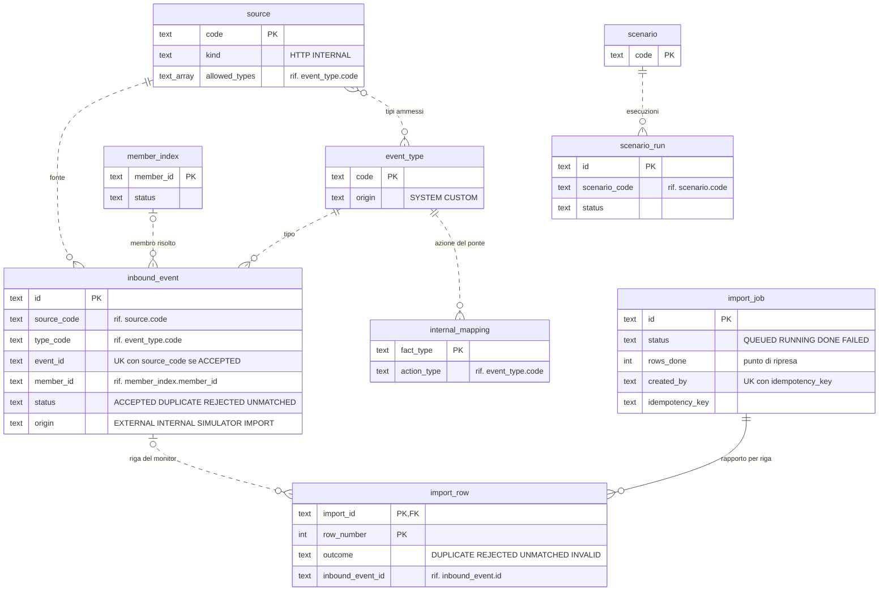
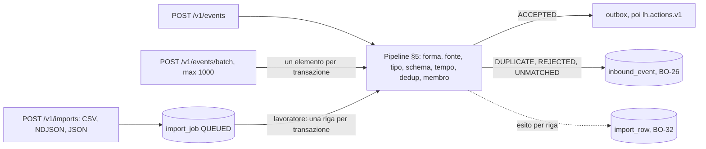

# ingestion-service

**Porta** 8081 · **Schema** `ingestion` · **Feature** `F-ING-*`, `F-DEMO-03/04` · **Milestone** M1 (core), M2 (scenari), M3 (ponte), M6 (tipi custom), M7 (non abbinati), M8.7 (batch e import file)

## 1. Scopo e confini
Unica porta d'ingresso delle azioni premianti e **unico produttore** di `lh.actions.v1`. Valida, deduplica, risolve il membro, normalizza in CloudEvent canonico. Ospita il **ponte interno** (fatti → azioni) e il **simulatore** della demo.
Non valuta regole, non conosce punti o premi.

## 2. Modello dati
| Tabella | Colonne principali |
|---|---|
| `source` | `code` PK (`crm, app, ecommerce, billing, partner, internal, simulator`), `name`, `kind` (`HTTP`/`INTERNAL`), `enabled`, `allowed_types text[]` (vuoto = tutti), `description` |
| `event_type` | `code` PK (nome breve, es. `purchase.completed`), `name`, `description`, `origin` (`SYSTEM`/`CUSTOM`), `category` (`TRANSACTION, ENGAGEMENT, SERVICE, INTERNAL`), `data_schema jsonb` (JSON Schema), `sample_data jsonb`, `enabled`, `icon` |
| `inbound_event` | `id` PK (ULID interno), `event_id`, `source_code`, `type_code`, `subject`, `member_id`, `event_time`, `received_at`, `status` (`ACCEPTED, DUPLICATE, REJECTED, UNMATCHED`), `reject_code`, `reject_detail`, `payload jsonb`, `correlation_id`, `origin` (`EXTERNAL, INTERNAL, SIMULATOR, IMPORT`) · UNIQUE (`source_code`,`event_id`) per i non duplicati |
| `member_index` | `member_id` PK, `external_id`, `email_lower`, `status` |
| `internal_mapping` | `fact_type` PK, `action_type`, `enabled` |
| `scenario` | `code` PK, `name`, `description`, `steps jsonb` |
| `scenario_run` | `id`, `scenario_code`, `started_at`, `finished_at`, `status`, `steps_total`, `steps_done`, `actor` |
| `import_job` | `id` PK (ULID), `kind` (`EVENTS`), `format` (`CSV, NDJSON, JSON`), `file_name` (senza percorso), `size_bytes`, `sha256`, `default_source`, `status` (`QUEUED, RUNNING, DONE, FAILED`), `rows_total`, `rows_done` (punto di ripresa), contatori `accepted, duplicate, rejected, unmatched, invalid`, `attempts`, `error_detail`, `content` (il file, `NULL` a lavoro concluso), `idempotency_key` (UNIQUE per autore: (`created_by`, `idempotency_key`) se presente), `created_by`, `created_at`, `started_at`, `finished_at`, `heartbeat_at` (M8.7, F2-ING-02) |
| `import_row` | PK (`import_id` → `import_job` ON DELETE CASCADE, `row_number`), `line_number` (linea fisica del file), `event_id` (al più 256 caratteri; un NUL è scritto come U+FFFD, così una riga respinta proprio per il NUL si registra), `outcome` (`DUPLICATE, REJECTED, UNMATCHED, INVALID`), `reject_code`, `detail` (mai il soggetto: per `UNMATCHED` è `NULL` e l'API lo legge da `inbound_event.reject_detail`, che l'anonimizzazione ripulisce), `inbound_event_id` (riga del monitor; `NULL` per `INVALID`) — solo le righe non accettate: gli `ACCEPTED` sono contati in `import_job` |

Pulizia: `inbound_event` > 7 giorni (o oltre 20 000 righe: si eliminano le più vecchie); `import_job` concluso da più di 7 giorni (`loyaltyhub.ingestion.imports.retention-days`), righe comprese.

**Dati di riferimento di sistema (Q-629, opzione B, ADR-049).** La migrazione `V6__ingestion_reference_data.sql` (expand, regola 14) inserisce in **ogni profilo**, anche `enterprise` senza seeder, i 19 tipi azione `origin='SYSTEM'` di `seed/event-types.json` (JSON Schema di `data` identici a `contracts/events/action/*.schema.json`, dati di esempio, categoria, icona) e le 9 mappature del ponte di `seed/internal-mappings.json` (`fact.* → azione`, F-ING-08), con `INSERT … ON CONFLICT DO NOTHING`: un database che ha già le righe, o con modifiche di un operatore (nome, descrizione, icona e abilitazione dei `SYSTEM`; abilitazione delle mappature), non viene toccato. Sono dati del prodotto, non dati fittizi né membri: docs/18 §3.15 e ADR-049 vietano in `enterprise` i membri di seed e il seed di vetrina, non il catalogo di sistema (senza questi tipi `POST /v1/sources` respinge ogni `allowedTypes` e nessun evento diventa azione). **Non** include fonti (`source`, le crea lo script di programma via `POST /v1/sources`), scenari, indice membri, storico né tipi `CUSTOM`. Con il profilo `demo` il `DemoSeeder` cancella e reinserisce le stesse righe con un upsert (all'avvio e a ogni reset; in transazione nel reset via `POST /v1/demo/reset`): nessuna violazione di chiave e, dopo il reset, i dati ci sono ancora. Un tipo `CUSTOM` creato da un operatore con un codice uguale a uno di sistema in un database enterprise esistente non viene sovrascritto (`DO NOTHING`) e resta `CUSTOM`: in un'installazione nuova non succede, perché la migrazione gira prima di ogni scrittura dell'operatore. `ReferenceDataMigrationIT` (senza `demo`) e `ReferenceDataDemoIT` (avvio e reset ripetuti) fanno fallire la build se la migrazione diverge da `seed/` o dai contratti. Chi cambia `seed/event-types.json` o `seed/internal-mappings.json` per un tipo SYSTEM aggiunge una migrazione `V7+` (expand) e non modifica `V6`.

Tracciato delle tabelle (docs/18 §3.12-bis, verificato sulle migrazioni `V1`–`V6`; `V6` non cambia lo schema: inserisce solo i dati di riferimento descritti nel paragrafo precedente). Linee continue: vincolo `FOREIGN KEY` nella migrazione (solo `import_row` → `import_job`); tratteggiate: riferimento logico per codice o id (fonte, tipo e membro di un ingresso, tipi ammessi da una fonte, tipo prodotto dal ponte, scenario di un'esecuzione, riga del monitor di una riga del rapporto). Le tabelle comuni di lh-common (docs/06 §1: `outbox`, `processed_event`, `approval_history`) esistono nello schema; ingestion non usa `approval_history`.

## 3. API
### Ingresso (fonti esterne)
**Autenticazione delle fonti** (M8.2f, F2-SEC-07, F2-IAM-02, Q-492): i tre endpoint di questa tabella accettano solo il ruolo `SOURCE` (più `ADMIN`, per gli strumenti demo e il backoffice). `SOURCE` è l'utenza di integrazione di una fonte, con **client credentials `private_key_jwt`** e **un client per fonte**: il client della fonte `<codice>` è `src-<codice>` (`client_id` ⇔ `source` del registro fonti, docs/18 §3.10). Il `source` dichiarato da ogni evento, elemento di batch o transazione deve coincidere con il codice del client; altrimenti `403 SOURCE_MISMATCH` (problem+json, `code` `SOURCE_MISMATCH`) e nulla è salvato né pubblicato. In un batch un solo elemento con un'altra fonte respinge l'intera richiesta; un elemento senza `source` resta `INVALID`. `ADMIN` non è soggetto al controllo. Ogni altro ruolo, anche `ANALYST` o nessun attore, riceve `403 FORBIDDEN_ROLE`. Nel profilo `demo` l'identità è `X-LH-Actor: SOURCE:src-<codice>`; in `enterprise` un access token del client (`lh_roles` con `SOURCE`, `azp` = `src-<codice>`). Vedi docs/06 §3.3.

| Metodo | Path | Note |
|---|---|---|
| POST | `/v1/events` | corpo = CloudEvent. `202 {eventId, status, memberId?, rejectCode?}`. Errori di forma → `400` RFC 9457 (corpo assente o non JSON, attributo obbligatorio mancante, `data` non oggetto, `time` non RFC 3339); rifiuti di business → `202` con `status=REJECTED` (la fonte non deve ritentare). `source` = `urn:loyaltyhub:source:<codice>` con confronto esatto sul codice (un URN di servizio o estraneo non è una fonte → `SOURCE_DISABLED`); la forma breve senza `:` (`ecommerce`) è un errore di forma → `400` (Q-258: resta ammessa solo ai chiamanti interni — simulatore, scenari, transazioni) |
| POST | `/v1/events/batch` | M8.7, F2-ING-01. Corpo = array JSON di CloudEvent (`application/json` o `application/cloudevents-batch+json`), da 1 a **1000**. Ogni elemento passa dalla pipeline di `POST /v1/events` in una propria transazione (dedup, non abbinati, outbox): `202 {total, counts{accepted, duplicate, rejected, unmatched, invalid}, items[{index, eventId, status, memberId?, correlationId?, rejectCode?, detail?}]}` nell'ordine ricevuto. Un elemento che per `/v1/events` sarebbe un `400` (forma, `source` non URN) è `status=INVALID` e non entra nel monitor. Un errore imprevisto su un elemento annulla solo quello (`INVALID`, dettaglio «Errore interno…», nulla salvato): mai un `500` dopo elementi già confermati. Corpo non array → `400`; array vuoto → `422 BATCH_EMPTY`; oltre 1000 → `422 BATCH_TOO_LARGE`; corpo oltre 3 MiB (`LH_BATCH_MAX_BYTES`) → `413 BATCH_BODY_TOO_LARGE` senza leggerlo (senza `Content-Length` la lettura si ferma al tetto: `400`). Limite di frequenza per IP pesato sugli eventi: un batch conta un evento per elemento nella finestra di 60 s, tutti o nessuno (un batch che starebbe nel limite ma trova la finestra piena → `429 RATE_LIMITED` con `Retry-After`; un batch più grande del limite al minuto non passerebbe mai → `422 BATCH_OVER_RATE_LIMIT` senza `Retry-After`, va diviso; Q-371). In tutti questi casi nessun elemento è elaborato |
| POST | `/v1/transactions` | `{source, orderId, memberRef, amount, currency, channel, items[], occurredAt}` → azione `purchase.completed` con `id = "txn-" + orderId` (P1). `source`, `orderId`, `memberRef` mancanti o `kind` sconosciuto → `400`; `amount`/`currency` mancanti → l'azione si costruisce senza e lo schema la respinge: `202 REJECTED/INVALID_DATA`, visibile in BO-26 (Q-269) |

### Gestione (backoffice)
| Metodo | Path | Note |
|---|---|---|
| GET | `/v1/inbound-events` | filtri `status, source, type, memberId, from, to, q`: `from`/`to` istanti ISO-8601 su `received_at` (estremi inclusi, malformati → `400`); `q` testo cercato senza maiuscole, letterale come è sempre stato (`%`, `_` e `\` restano caratteri normali, non jolly), in id evento, soggetto, membro, tipo, fonte, correlazione e dettaglio del rifiuto; `limit` (default 100, max 500). Risposta: array delle righe, più recenti prima |
| GET | `/v1/inbound-events/counts` | conteggi per esito `{ACCEPTED, DUPLICATE, REJECTED, UNMATCHED}` con gli stessi filtri dell'elenco tranne `status` (schede di BO-26) |
| GET | `/v1/inbound-events/{id}` | payload completo + `correlationId` per aprire il tracciato |
| POST | `/v1/inbound-events/{id}/retry` | solo `REJECTED`/`UNMATCHED`: rivaluta e, se valido, pubblica |
| POST | `/v1/inbound-events/{id}/match` | `{memberId}` abbina un `UNMATCHED` (P1) |
| GET/POST/PUT | `/v1/sources`, `/v1/sources/{code}` | abilitazione, tipi ammessi. Scrittura solo ADMIN (`program.config`), audit su `lh.audit.v1`. `POST {code, name, kind?, enabled?, allowedTypes?, description?}` → `201` (solo fonti `HTTP`; codice minuscolo 2–40 caratteri; `409 SOURCE_EXISTS`; `422 SOURCE_INVALID`). `PUT {enabled?, allowedTypes?}` aggiorna solo i campi presenti (`422 SOURCE_INVALID` se vuoto o con tipi inesistenti; `404` fonte inesistente) |
| GET/POST/PUT | `/v1/event-types`, `/v1/event-types/{code}` | i tipi `SYSTEM` permettono di modificare solo `name, description, enabled, icon`; i `CUSTOM` tutto tranne `code`. Il `code` di un nuovo custom è minuscolo a punti, da 2 a 4 parti, al massimo 60 caratteri (Q-89), e il primo segmento non è `io` né `loyaltyhub`, riservati ai `type` completi `io.loyaltyhub.<famiglia>.<nome>` (Q-439); altrimenti `422 EVENT_TYPE_INVALID` con l'errore sul campo `code`. La creazione è atomica (inserimento solo se assente, Q-440): un codice già presente, anche creato da una richiesta concorrente, dà `409 EVENT_TYPE_EXISTS` senza sovrascrivere e senza voce di audit; solo la creazione che inserisce la riga lascia l'audit `CREATE`. `PUT` aggiorna il tipo esistente. Lo schema di un custom deve essere un JSON Schema 2020-12 valido (meta-schema) con `"type": "object"`, altrimenti `422 EVENT_TYPE_INVALID`. Gli schemi dei tipi `SYSTEM` con un contratto coincidono con `contracts/events/action/*.schema.json` (verificato da `check-seed.mjs`) |
| GET | `/v1/event-types/{code}/fields` | elenco piatto dei campi `data.*` dedotti dallo schema `{path, type, enum?}` → alimenta il costruttore di condizioni |
| GET/PUT | `/v1/internal-mappings` | ponte: abilita/disabilita |

### Import file (BO-32, M8.7, F2-ING-02)
| Metodo | Path | Note |
|---|---|---|
| POST | `/v1/imports` | `multipart/form-data`: `file` (obbligatorio), `kind` (default `EVENTS`), `source` (codice della fonte predefinita per le righe senza `source`, facoltativo); header `Idempotency-Key` facoltativo, per autore: la stessa chiave con lo stesso file, tipo e fonte → lo stesso lavoro (anche con due invii in parallelo); con un contenuto diverso → `422 IDEMPOTENCY_KEY_REUSED` (Q-353). Solo `ADMIN`, `CARE` (capacità `inbound.handle`, Q-372). Controlli sull'intero file, tutti `422` con `code`: vuoto `IMPORT_EMPTY`; oltre 1 MiB `IMPORT_FILE_TOO_LARGE` (oltre 2 MB il contenitore risponde `413`); estensione non tra `.csv .ndjson .jsonl .json` o tipo dichiarato incompatibile `IMPORT_FORMAT_UNSUPPORTED`; non testo UTF-8 o con byte NUL `IMPORT_NOT_TEXT`; contenuto che non corrisponde al formato `IMPORT_FORMAT_MISMATCH`; intestazione CSV o JSON non validi, fonte predefinita inesistente (campo `source`) `IMPORT_INVALID`; oltre 10 000 righe `IMPORT_TOO_MANY_ROWS`; `kind=ATTRIBUTES` `IMPORT_KIND_NOT_SUPPORTED` (M13.5, Q-370). Esito: `202` con il lavoro `QUEUED`; audit `CREATE` su `import:<id>` con attore, nome, formato, dimensione, `sha256` e numero di righe (mai il contenuto) |
| GET | `/v1/imports` | `?status=&page=&size=` → `{items, page}` dei lavori, più recenti prima (`status` non valido → `400`) |
| GET | `/v1/imports/{id}` | `{job, openUnmatched}`: il lavoro con contatori e avanzamento, più quante righe `UNMATCHED` sono ancora da abbinare nel monitor. In tutti i percorsi `/v1/imports/{id}…` l'`id` deve essere un ULID come quelli generati per `import_job.id` (26 caratteri Crockford Base32 maiuscoli): qualunque altra stringa è `404 NOT_FOUND` con il messaggio fisso «Import non trovato», che non riporta il valore ricevuto |
| GET | `/v1/imports/{id}/rows` | `?outcome=&page=&size=` (default 50) → `{items, page}` delle righe non accettate in ordine di riga: `{rowNumber, lineNumber, eventId, outcome, rejectCode?, detail?, inboundEventId?, currentStatus?}` (`lineNumber` = linea fisica del file dove comincia il record; `detail` dei non abbinati letto dal monitor, quindi senza soggetto dopo l'anonimizzazione; `currentStatus` = esito attuale della riga nel monitor, dopo *Riprova*/*Abbina*) |
| GET | `/v1/imports/{id}/report.csv` | rapporto scaricabile (`text/csv;charset=UTF-8` qualunque sia l'`Accept`, `Content-Disposition: attachment; filename="import-<id>-esiti.csv"` costruito dall'id validato, `X-Content-Type-Options: nosniff`): `riga, linea, id_evento, esito, codice, dettaglio, esito_attuale`; ogni cella che comincia con `= + - @`, tab o a capo è preceduta da `'` (difesa dalla *formula injection*); il dettaglio dei non abbinati è un testo fisso, il soggetto non esce dal servizio |
| POST | `/v1/imports/{id}/retry-unmatched` | *Riprova non abbinati* (`ADMIN`, `CARE`): come *Riprova* di BO-26 sulle righe del monitor di questo import ancora `UNMATCHED` (una transazione e una voce di audit per riga), al più 200 per chiamata (`retry-batch`) dopo la riga `?afterRow=` (default 0) → `{retried, accepted, stillUnmatched, rejected, failed, nextAfterRow?}`; una riga già risolta nel frattempo si salta, una che fallisce per un errore imprevisto è contata in `failed` e il blocco prosegue; BO-32 richiama con `nextAfterRow` finché è presente |

**Formati** (`ImportParser`). **CSV** con intestazione, separatore `,` o `;` (dedotto dalla prima riga), RFC 4180 (virgolette, a capo tra virgolette): colonne `id, type, subject, time` obbligatorie, `source` obbligatoria senza fonte predefinita, `specversion` e `data` (oggetto JSON) facoltative, `data.<campo>` per i campi di primo livello convertiti col tipo dello schema del tipo azione (`integer`, `number` con virgola decimale ammessa, `boolean`, `array`, `object`; altrimenti testo); colonne sconosciute o ripetute rifiutano il file. **NDJSON/JSONL**: un CloudEvent per riga (righe vuote ignorate). **JSON**: un array di CloudEvent (la forma del batch). In tutti: `specversion` assente = `1.0`, `source` assente = fonte predefinita. Un record illeggibile (JSON non valido, colonne in numero diverso, valore non convertibile, forma dell'envelope, `source` non URN, attributo troppo lungo o con NUL) è una riga `INVALID` del rapporto con il motivo, che non riporta il valore letto (Q-371).

### Demo
| Metodo | Path | Note |
|---|---|---|
| POST | `/v1/demo/simulator/fire` | `{memberId, type, data?, source?, occurredAt?, count?=1}`; `count` fuori 1–20 → `422 SIMULATOR_COUNT_OUT_OF_RANGE` (Q-268); `data` assente → `sample_data` del tipo con piccole variazioni casuali (numeri di primo livello: decimali ±20 %, interi ±10 %, nei limiti dello schema; due invii consecutivi diversi). Risposta: `[{eventId, correlationId, status}]` |
| GET | `/v1/demo/scenarios` · POST `/v1/demo/scenarios/{code}/run` | esecuzione asincrona; `202 {runId}` |
| GET | `/v1/demo/scenario-runs/{runId}` | avanzamento passo per passo con `correlationId` di ogni evento |

## 4. Eventi
| Direzione | Topic | Tipi |
|---|---|---|
| Produce | `lh.actions.v1` | tutte le `action.*` (anche quelle accettate da batch e import: nessun tipo nuovo) |
| Produce | `lh.audit.v1` | modifiche a fonti, tipi, mapping; riprova/abbina; import caricato (`CREATE`) e concluso (`JOB`, solo conteggi) |
| Consuma | `lh.facts.v1` | `member.registered/updated/status.changed` → `member_index`; tipi abilitati in `internal_mapping` → ponte |

## 5. Regole
Pipeline di accettazione, in ordine; al primo fallimento si salva `inbound_event` con l'esito e ci si ferma:
0. identità (prima della pipeline, Q-492): ruolo `SOURCE` o `ADMIN` (altrimenti `403 FORBIDDEN_ROLE`); per `SOURCE`, il `source` dichiarato è quello del client `src-<codice>` (altrimenti `403 SOURCE_MISMATCH`, nulla salvato né pubblicato). Una forma non valida (per esempio `source` assente o in forma breve) resta un `400`, non un `SOURCE_MISMATCH`;
1. forma envelope valida (altrimenti `400`, nulla salvato): attributi obbligatori, `data` oggetto, `time` RFC 3339, e (M8.7, Q-371) `id` ≤ 256, `source` e `type` ≤ 200, `subject` ≤ 512, `time` ≤ 64 caratteri, nessun carattere NUL negli attributi né in `data` (PostgreSQL non li memorizzerebbe: senza il controllo sarebbe un errore interno). I messaggi non riportano il valore;
2. fonte esistente e abilitata → altrimenti `REJECTED/SOURCE_DISABLED`;
3. tipo nella famiglia azioni, noto e abilitato, ammesso per la fonte → `UNKNOWN_TYPE` / `TYPE_NOT_ALLOWED`. Un `type` breve diventa `io.loyaltyhub.action.<type>` (un codice creato prima di Q-439 che inizia con `io.loyaltyhub.` si invia solo nella forma completa `io.loyaltyhub.action.<codice>`); un `type` completo fuori da `io.loyaltyhub.action.` (un effetto, un fatto o nessuna famiglia) è `UNKNOWN_TYPE` con il motivo «Tipo fuori dalla famiglia azioni», prima di cercarlo nel registro, così non finisce mai su un altro topic (Q-439). Per lo stesso motivo il riprocessa DLQ (`X-LH-Reprocess`) non ripubblica una riga `ACCEPTED` fuori famiglia: la richiesta passa dalla pipeline;
4. `data` valido contro lo schema, poi i vincoli tra campi che lo schema non esprime (`quiz.completed`: `correctAnswers` ≤ `totalQuestions`, Q-265) → `INVALID_DATA` (dettaglio = errori);
5. `time` non nel futuro (> 5 min) né più vecchio di 30 giorni → `INVALID_TIME`;
6. dedup `(source, id)` → `DUPLICATE`;
7. membro: `member:<id>` / `external:<x>` / `email:<x>` → non trovato → `UNMATCHED` (anche ogni altra forma: senza prefisso, prefisso sconosciuto, `member:` vuoto — Q-255, recuperabile con *Abbina*); stato ≠ `ACTIVE` → `REJECTED/MEMBER_NOT_ACTIVE`;
8. arricchimento (`lh*`, `type` completo, `subject` normalizzato a `member:<id>`) → outbox → `ACCEPTED`. La riga `ACCEPTED` e la scrittura in outbox stanno nella stessa transazione: se l'outbox fallisce, la riga non resta e la fonte può ritentare con lo stesso `id` (Q-441).

Ponte: per ogni fatto mappato crea l'azione secondo `docs/05 §7`; salva `inbound_event` con `origin=INTERNAL`; `lhhop > 3` → DLQ.
**Batch e import** (M8.7, F2-ING-01/02) non hanno una pipeline propria: ogni elemento o riga percorre i passi 1–8 qui sopra, con origine `EXTERNAL` (batch) o `IMPORT` (import) in `inbound_event`, quindi dedup, non abbinati (da riprovare in BO-26 o da BO-32) e pubblicazione una sola volta valgono identici.

**Lavoro di import** (`ImportWorker`): un thread dedicato del servizio (niente infrastruttura nuova) svegliato a ogni caricamento e ogni 5 s. Presa in carico con `FOR UPDATE SKIP LOCKED` (più istanze non prendono lo stesso lavoro); ogni riga è una transazione che comprende pipeline, `import_row` e avanzamento di `rows_done` con i contatori, quindi un arresto riprende dalla riga successiva senza ripetere nulla. Un `RUNNING` senza battito da 2 minuti torna in lavorazione; oltre 3 prese in carico diventa `FAILED`. Due lavoratori sullo stesso lavoro (ripresa di un lavoro creduto fermo) non contano né pubblicano due volte: l'avanzamento vale solo al punto atteso, chi perde annulla la sua transazione, outbox compresa. Una riga che fallisce due volte per un errore imprevisto mentre il database risponde è registrata `INVALID` («Errore interno…», nessun ingresso) e il lavoro prosegue; se non si riesce nemmeno a registrarla il lavoro resta `RUNNING` e riprende più tardi. A lavoro concluso il file è cancellato (`content = NULL`), resta il rapporto; audit `JOB` con i soli conteggi.

```mermaid
stateDiagram-v2
  accTitle: Ciclo di vita di un lavoro di import
  accDescr: Un import nasce in coda, passa in elaborazione quando il lavoratore lo prende, finisce completato oppure fallito; un lavoro fermo senza battito torna in elaborazione dal punto di ripresa fino al numero massimo di tentativi.
  [*] --> QUEUED: POST /v1/imports con file valido
  QUEUED --> RUNNING: presa in carico
  RUNNING --> RUNNING: lavoratore fermo, ripresa da rows_done
  RUNNING --> DONE: ultima riga elaborata
  RUNNING --> FAILED: file illeggibile o tentativi esauriti
  DONE --> [*]: pulizia dopo 7 giorni
  FAILED --> [*]: pulizia dopo 7 giorni
```

Scenari: i passi sono `{delayMs, memberId, type, data, source, note, at?}` (`at` = espressione di data di docs/10 §1 su Europe/Rome, default `@now`); l'esecutore rispetta i ritardi (max 10 s per passo) e passa dalla stessa pipeline (origine `SIMULATOR`). Un passo può dichiarare `expect: REJECTED|DUPLICATE|UNMATCHED` per gli scenari negativi.

## 6. Seed
Tipi azione `SYSTEM` e mappature del ponte sono anche dati di riferimento inseriti da `V6` in ogni profilo (§2, Q-629): nel profilo `demo` il seeder li riscrive identici; fonti, scenari, membri e storico restano solo demo.
`seed/sources.json`, `seed/event-types.json`, `seed/internal-mappings.json`, `seed/scenarios.json`, più `seed/members.json` per popolare `member_index`. Import (BO-32): `seed/import-history.json`, due lavori conclusi le cui righe sono ingressi dello storico qui sotto (stesso id evento ed esito) più una riga non leggibile ciascuno (docs/10 §8.2). Storico: 40 `inbound_event` degli ultimi 3 giorni con tutti gli esiti, da `seed/inbound-history.json` (id evento `hist-*`, ricaricati a ogni reset; membro e dettaglio del rifiuto calcolati come nella pipeline; nessuna pubblicazione: gli `ACCEPTED` sono azioni già presenti in `activity-history.json`).

## 7. Accettazione minima
- Dato un evento valido per `MBR-000002`, quando lo invio, allora `202 ACCEPTED` e un record su `lh.actions.v1` con chiave `MBR-000002` e `lhhop=0`.
- Dato lo stesso `source`+`id` inviato due volte, allora il secondo è `DUPLICATE` e su Kafka c'è un solo record.
- Dato `data.amount` mancante in `purchase.completed`, allora `REJECTED/INVALID_DATA` con il campo indicato.
- Dato il fatto `tier.upgraded`, allora compare `action.tier.upgraded` con `source=…:internal`, stesso `lhcorrelationid`, `lhhop=1`.
- Dato un fatto con `lhhop=3` mappato, allora l'azione non viene pubblicata e c'è un record in DLQ con `LOOP_GUARD`.
- Dato un batch con un valido, un duplicato dello stesso id, un non abbinato, un respinto e tre non validi, allora `202` con sette esiti nell'ordine e un solo record su `lh.actions.v1` (M8.7).
- Dato un batch di 1001 eventi, allora `422 BATCH_TOO_LARGE` e nessun elemento elaborato.
- Dato un batch con più eventi del limite al minuto per IP, allora `422 BATCH_OVER_RATE_LIMIT` senza `Retry-After` e nessun elemento elaborato; se starebbe nel limite ma la finestra è piena, `429 RATE_LIMITED` con `Retry-After`.
- Dato un file NDJSON con un NUL nell'`id` della riga 1 e una riga 2 valida, allora la riga 1 è `INVALID` («id contiene il carattere NUL»), la riga 2 è elaborata e il lavoro termina `DONE` al primo tentativo.
- Dato un CSV con sei righe (accettata, duplicata, respinta, non abbinata, due non valide), allora `202`, poi `DONE` con i conteggi 1/1/1/1/2, cinque righe nel rapporto, un solo record su `lh.actions.v1`, audit `CREATE` con l'attore e `JOB` con i conteggi, e un rapporto CSV senza formule attive.
- Dato un lavoro fermo dopo la riga 1 di 2, allora il lavoratore lo riprende dalla riga 2 senza ripetere la prima.

## 8. Fase 2 (profilo `enterprise`)

Riferimento: `docs/18`. Le righe qui sotto sono segnaposto dell'adozione (M8.0): la fetta citata le rende normative aggiornando questa scheda.

- **Ingresso batch e import file** (M8.7, F2-ING-01/02): fatto, vedi §2, §3 e §5 (`POST /v1/events/batch`, `/v1/imports*`, BO-32). Restano fuori: sorgente S3 e `kind=ATTRIBUTES` (Q-370), `Idempotency-Key` obbligatoria (M8.10, Q-353), antivirus sui file caricati (M8.10, docs/18 §3.10 punto 8).
- **Identità delle fonti** (ADR-027, M8.2, M8.2f): fatto con client credentials `private_key_jwt`, un client `src-<codice>` per fonte e il ruolo `SOURCE` (§3, docs/06 §3.3, Q-492); resta fuori mTLS. Una fonte creata a runtime da BO-09 non ha ancora un client nel realm: procedura manuale in `deploy/README.md` (Q-494, TOBE-009).
- **Dati personali** (ADR-032, M8.4): `member_index.email_lower` resta solo per l'abbinamento; `inbound_event.payload` con dati personali ha retention breve.

**Classificazione `x-lh-class`** (`docs/18 §3.15`, F2-GRC-05; prima stesura M8.0, verificata e resa per colonna in M8.13). Tutto ciò che non è elencato è `INTERNAL`.
- `PERSONAL`: `inbound_event.payload`, `inbound_event.subject` (può essere `email:…`), `member_index.email_lower`, `member_index.external_id`, `import_job.content` (il file caricato, fino alla fine del lavoro).
- `CONFIDENTIAL`: `inbound_event.reject_detail`, `import_row.detail` (per i non abbinati riporta il soggetto; il rapporto CSV lo omette).
