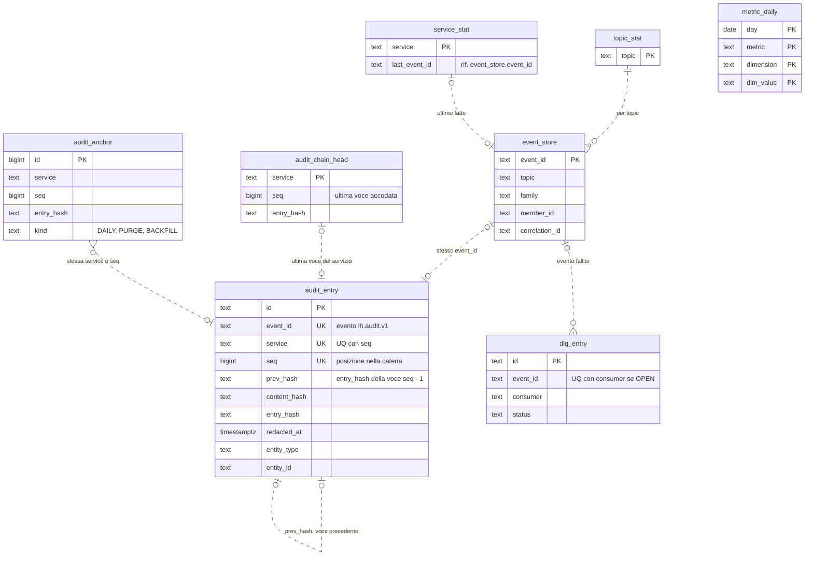
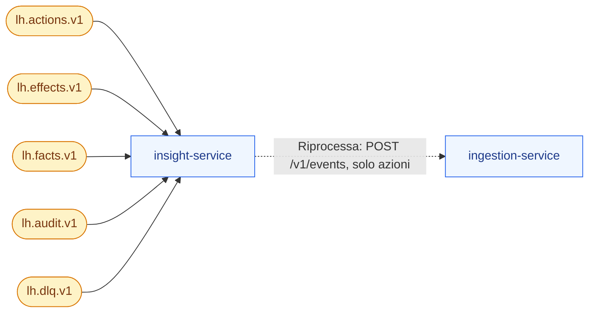
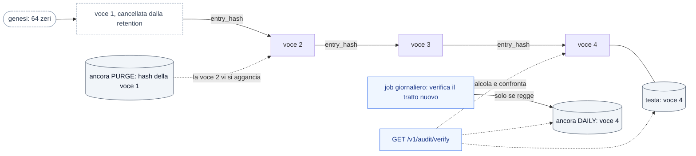

# insight-service

**Porta** 8088 · **Schema** `insight` · **Feature** `F-INS-*`, `F-AUD-01` · **Milestone** M2 (event store, live, tracciati, KPI, audit, storico sintetico), M7 (DLQ con riprocessa)

## 1. Scopo e confini
È la **finestra sulla piattaforma**: consuma tutti i topic, conserva gli eventi recenti, ricostruisce i tracciati, calcola metriche giornaliere, espone audit e DLQ, e trasmette il flusso **live** via SSE.
Sola lettura rispetto al dominio: non produce fatti. Nel target è sostituito da ClickHouse + Superset + stack di osservabilità (`docs/04 §8`).

## 2. Modello dati
| Tabella | Colonne principali |
|---|---|
| `event_store` | `event_id` PK, `topic`, `family` (`ACTION, EFFECT, FACT, AUDIT, DLQ`), `type`, `short_type`, `source`, `member_id`, `correlation_id`, `causation_id`, `hop`, `actor`, `error_code` (solo eventi del topic DLQ), `event_time`, `received_at`, `kafka_partition`, `kafka_offset`, `payload jsonb` · indici (`correlation_id`), (`member_id`,`event_time desc`), (`topic`,`received_at desc`) |
| `metric_daily` | (`day`,`metric`,`dimension`,`dim_value`) PK, `value numeric`, `synthetic bool` |
| `audit_entry` | `id`, `event_id` UQ, `at`, `actor_role`, `actor_name`, `service`, `entity_type`, `entity_id`, `action`, `summary`, `before jsonb`, `after jsonb`, `correlation_id`; catena di hash (V6, F2-GRC-07): `seq` (UQ con `service`), `prev_hash`, `content_hash`, `entry_hash`, `redacted_at` · **sola inserzione** (trigger, §5) |
| `audit_chain_head` | `service` PK, `seq`, `entry_hash`, `updated_at`: testa di ogni catena, riga bloccata per serializzare gli accodamenti del servizio (V6) |
| `audit_anchor` | `id` PK, `service`, `seq`, `entry_hash`, `kind` (`DAILY, PURGE, BACKFILL`), `anchored_at` · sola inserzione (V6) |
| `dlq_entry` | `id`, `event_id`, `original_topic`, `original_type`, `consumer`, `error_code`, `error_message`, `retryable`, `attempts`, `payload jsonb`, `first_seen_at`, `status` (`OPEN, REPROCESSED, DISCARDED`), `resolved_by`, `resolved_at`; in più `original_family`, `error_class`, `error_stack`, `member_id`, `correlation_id`, `dlq_partition`, `dlq_offset`, `resolution_note` · UQ parziale (`event_id`,`consumer`) sulle voci `OPEN` |
| `topic_stat` | `topic` PK, `last_event_at`, `count_total`, `last_offset_by_partition jsonb`, `last_lag_ms`, `last_received_at` (V5). I volumi a 1 h e 24 h non sono colonne: si contano da `event_store` sull'istante d'arrivo |
| `service_stat` | `service` PK (dal `source` del fatto), `last_fact_at`, `last_fact_type`, `last_event_id`, `facts_total` (V5, stato della pipeline per servizio) |

Tracciato delle tabelle (docs/18 §3.12-bis, verificato sulle migrazioni `V1`–`V6`). insight non ha vincoli `FOREIGN KEY`: le tabelle sono registri e aggregati legati per `event_id`, topic o servizio (linee tratteggiate). `metric_daily` è un aggregato giornaliero senza relazioni. Le voci di audit di uno stesso servizio formano una catena (`prev_hash` della voce `seq` = `entry_hash` della voce `seq - 1`); testa e ancore puntano a una posizione della catena per servizio e `seq`.

Metriche (`metric`): `actions` (dim `source`, `type`), `points_earned`/`points_spent`/`points_expired` (dim `currency`), `points_by_campaign` (dim `campaign`), `members_new`, `members_active`, `redemptions` (dim `status`, `reward`), `plays`, `wins`, `tier_changes` (dim `direction`), `messages`, `dlq`.

## 3. API
| Metodo | Path | Note |
|---|---|---|
| GET | `/v1/stream/events` | **SSE** (`text/event-stream`); parametri `topics, memberId, types, correlationId`; evento `lh-event` con `{eventId, topic, family, shortType, memberId, correlationId, time, summary}`; `heartbeat` ogni 15 s; `Last-Event-ID` → rinvio degli ultimi ≤ 200 persi; CORS da `LH_CORS_ALLOWED_ORIGINS` |
| GET | `/v1/events` | filtri `topic, family, type, memberId, correlationId, source, from, to, q` (testo nel payload) |
| GET | `/v1/events/{eventId}` | payload completo |
| GET | `/v1/traces/{correlationId}` | `{correlationId, memberId, startedAt, durationMs, status (COMPLETE/IN_PROGRESS/FAILED), nodes[] {eventId, family, shortType, service, time, offsetMs, parentEventId, summary}, outcome: {points[] {currency, amount}, tierChange?, messages, coupons, plays, dlq}}` |
| GET | `/v1/traces?memberId=&from=&to=` | ultimi tracciati (uno per `correlationId`) |
| GET | `/v1/kpi/overview?from=&to=` | `{membersTotal, membersActive30d, actions, pointsEarned, pointsSpent, pointsExpired, liabilityPts?, redemptions, plays, wins, deltas{…vs periodo precedente}}` |
| GET | `/v1/kpi/timeseries?metric=&dimension=&from=&to=&granularity=day\|week` | |
| GET | `/v1/kpi/breakdown?metric=&dimension=&from=&to=&limit=` | top N (campagne, premi, fonti) |
| GET | `/v1/audit` | filtri `actor, role, service, entityType, entityId, action, from, to` · `GET /v1/audit/{id}` con diff |
| GET | `/v1/audit/verify?service=` | ruolo `ADMIN` (`SPEC-GAP: Q-399`); ricalcola la catena di hash (§5) di tutti i servizi o di `service` (404 se non ha una catena): `{verifiedAt, status (OK/BROKEN), services[] {service, status, checked, firstSeq, lastSeq, headSeq, redacted, anchorsChecked, brokenSeq?, reason?, detail?}}`; 200 anche con catena interrotta. `reason`: `GENESIS_MISMATCH, UNANCHORED_START, MISSING_ENTRY, PREV_HASH_MISMATCH, CONTENT_ALTERED, ENTRY_ALTERED, ANCHOR_MISMATCH, TAIL_MISSING, HEAD_MISMATCH`. Base di `lh audit verify` (M12.2) |
| GET | `/v1/dlq` · `/v1/dlq/{id}` | filtri `status, consumer, errorCode` |
| POST | `/v1/dlq/{id}/reprocess` · `/discard` | ruolo `ADMIN`; vedi §5 |
| GET | `/v1/pipeline/status` | per topic: ultimo evento, volumi 1 h/24 h, ritardo stimato; per servizio: ultimo fatto prodotto |
| GET | `/v1/members/{memberId}/timeline` | eventi del membro raggruppati per tracciato (Scheda 360°) |

Nota: `liabilityPts` non è calcolabile qui con esattezza: la dashboard la legge da `wallet /v1/liability`.

## 4. Eventi
| Direzione | Topic | Tipi |
|---|---|---|
| Consuma | tutti e 5 | tutto, gruppo `lh-insight` |
| Produce | — | **nessun evento su Kafka**. *Riprocessa* DLQ di un'azione = chiamata HTTP a `ingestion POST /v1/events` (ADR-003 resta valida: ingestion è l'unico produttore di azioni; è l'eccezione 1 di ADR-002) |

insight è solo consumatore: legge i cinque topic con il gruppo `lh-insight` e non pubblica su Kafka. L'unica uscita è il *Riprocessa* di un'azione in DLQ, una chiamata HTTP a ingestion su comando umano.

## 5. Regole
- **Ingest**: un consumer per topic, batch ≤ 200, `INSERT … ON CONFLICT (event_id) DO NOTHING`; poi aggiornamento `metric_daily` (`UPSERT` con incremento) e `topic_stat`; infine pubblicazione sul bus SSE in memoria (`Sinks.many().multicast()` o equivalente senza Reactor: lista di `SseEmitter` con coda limitata a 500 per client; client lento → disconnesso).
- **Tracciato**: albero per `causation_id`; `status = COMPLETE` se nessun nuovo evento da 5 s e nessuna voce DLQ; `FAILED` se esiste DLQ; `summary` generato per tipo (tabella in codice, es. `wallet.points.earned` → "+162 PTS · Acquisto").
- **Retention** (RNF-07): `event_store` 14 giorni o 200 000 righe (il minore); payload troncato a 8 KB; `audit_entry` 180 giorni, cancellando per ogni catena solo la parte iniziale scaduta (sotto, *Audit a catena di hash*); `metric_daily` illimitato. Job orario.
- **Storico sintetico** (F-INS-04): al seed genera 90 giorni di `metric_daily` con `synthetic=true` — curva con stagionalità settimanale (+35 % sab/dom per `points_earned`), rumore ±12 %, trend +0,4 %/giorno, picco al giorno −30 (campagna estiva). Generatore con seme fisso. I dati reali del giorno si sommano a quelli sintetici; BO-01 marca il periodo sintetico con nota.
- **DLQ riprocessa**: azione → re-invio a `ingestion POST /v1/events` con stesso `id` (unica chiamata HTTP tra servizi ammessa, *solo su comando umano*, ADR-002 eccezione 1); effetti/fatti → non riprocessabili da qui (`409 NOT_REPROCESSABLE`), solo `discard` con nota.

Ciclo di vita di una voce DLQ (`dlq_entry.status`): un record aperto per coppia evento e consumer; chiuderlo è un'azione umana ADMIN. Un nuovo fallimento dello stesso evento dopo la chiusura apre una voce nuova.

```mermaid
stateDiagram-v2
  accTitle: Ciclo di vita di una voce DLQ
  accDescr: Una voce nasce aperta quando un record arriva in DLQ; un'azione si può riprocessare re-inviandola a ingestion, mentre effetti e fatti si possono solo scartare con una nota; entrambe le chiusure sono definitive.
  [*] --> OPEN: record su lh.dlq.v1
  OPEN --> REPROCESSED: Riprocessa, solo azioni, re-invio a ingestion
  OPEN --> DISCARDED: Scarta con nota
  REPROCESSED --> [*]
  DISCARDED --> [*]
```

- **Avvio a freddo**: al risveglio recupera l'arretrato dai topic (`auto.offset.reset=earliest`, retention Kafka 3 giorni); nessun dato perso entro quella finestra.

### Audit a catena di hash (F2-GRC-07 parte 1, ADR-043, ADR-044, docs/18 §3.15 punto 5, M8.12)

La sola inserzione protegge `audit_entry` dall'applicazione; la catena la protegge anche da chi ha accesso al database: una voce alterata, tolta o riscritta si vede ricalcolando gli hash.

- **Una catena per servizio** (`audit_entry.service`): servizi diversi non si contendono nulla. La voce `seq` porta `prev_hash` = `entry_hash` della voce `seq - 1`; la prima parte dalla genesi (64 zeri).
- **Chi la calcola**: il database, all'inserimento (trigger `audit_entry_chain`, migrazione V6), ignorando i valori proposti da chi inserisce. Vale per ogni scrittore, anche per la versione precedente di insight durante un aggiornamento senza fermo (ADR-038). La verifica ricalcola tutto in Java (`AuditHashChain`), indipendentemente dalle funzioni del database.
- **Serializzazione**: il trigger blocca la riga del servizio in `audit_chain_head` (`SELECT … FOR UPDATE`) fino al commit; due accodamenti dello stesso servizio non leggono mai la stessa testa. **Idempotenza**: un `event_id` già registrato non crea un secondo anello (controllo dopo il blocco, quindi anche tra riconsegne concorrenti).
- **Forma canonica, versione 1** (normativa). Ogni campo è una netstring `<byte UTF-8 in decimale>:<valore>,`; `NULL` è il solo carattere `~`. `content_hash` = SHA-256 di `ns("lh.audit.content.v1") ns(summary) ns(before) ns(after)`; `entry_hash` = SHA-256 di `ns("lh.audit.entry.v1") ns(service) ns(seq) ns(prev_hash) ns(id) ns(event_id) ns(at) ns(actor_role) ns(actor_name) ns(entity_type) ns(entity_id) ns(action) ns(correlation_id) ns(content_hash)`. `before`/`after` nella resa testuale di jsonb (`jsonb::text`: chiavi ordinate e senza duplicati, spaziatura fissa); `at` in UTC con sei cifre di microsecondi (`2026-09-28T10:15:30.000000Z`); `seq` in decimale; hash in esadecimale minuscolo. Vettori di riferimento in `AuditHashChainTest`.
- **Sola inserzione** (ADR-043): `UPDATE`, `DELETE` e `TRUNCATE` su `audit_entry` e `audit_anchor` sono rifiutati dal database (`42501`), tranne tre percorsi controllati che alzano un flag locale alla transazione: `audit_redact` (anonimizzazione F-MBR-05: solo `summary`, `before`, `after`, voce marcata `redacted_at`; `SPEC-GAP: Q-401`), `audit_purge_before` (retention), `audit_reset` (reset della demo). Nel profilo demo c'è un solo ruolo di database e la barriera sono i trigger. **Obiettivo `enterprise`** (ruoli owner/app, docs/18 §3.10 punto 4, M8.5): il ruolo applicativo ha solo `SELECT, INSERT` su `audit_entry` e `audit_anchor`; le tre funzioni diventano `SECURITY DEFINER` del ruolo owner, con `EXECUTE` concesso all'app per `audit_redact` e `audit_purge_before` (mai `audit_reset`).
- **Retention**: per ogni catena si cancella la parte iniziale scaduta, cioè le voci fino alla prima con `at` dentro la finestra, esclusa; una voce scaduta che segue una più recente resta finché non scade anche quella (`SPEC-GAP: Q-402`). L'ultima voce cancellata diventa un'ancora `PURGE`: la prima voce rimasta vi si aggancia. Un `DELETE` che lasciasse un buco è rifiutato (trigger sul risultato dell'istruzione).
- **Ancore** (`audit_anchor`, sola inserzione): `DAILY` dal job giornaliero (`loyaltyhub.insight.audit.anchor-cron`, default 00:05 UTC), che per ogni servizio cresciuto dall'ultima ancora verifica il tratto nuovo e solo se regge registra la testa (una catena interrotta non si ancora: errore nel log); `PURGE` dalla retention; `BACKFILL` dalla migrazione V6 (le voci esistenti sono entrate in catena per servizio, in ordine di `id`, cioè d'arrivo). Firmare le ancore ed esportarle su un archivio immutabile è la parte 2 (Q-400).
- **Verifica** (`GET /v1/audit/verify`, in una sola fotografia `REPEATABLE READ`, voci lette a pagine): la prima voce conservata parte dalla genesi o si aggancia a un'ancora di `seq - 1`; ogni voce ha numerazione contigua, `prev_hash` giusto, hash del contenuto e della voce ricalcolati uguali a quelli memorizzati (le voci anonimizzate contano in `redacted`), e coincide con ogni ancora della stessa posizione; la testa coincide con l'ultima voce e nessuna ancora punta oltre. Si ferma al primo errore del servizio e ne dà `brokenSeq` e `reason`. Una voce alterata senza ricalcolare gli hash è indicata esattamente; una riscrittura coerente di tutta la coda dopo un'ancora è rivelata dall'ancora (`ANCHOR_MISMATCH`).

## 6. Seed
`seed/insight-synthetic.json` (parametri del generatore: baseline per metrica, seme), nessun evento pre-caricato: l'event store si popola con i primi scenari. Il reset svuota `event_store`, `audit_entry`, `dlq_entry` e rigenera lo storico sintetico; per l'audit passa da `audit_reset` (§5), che svuota anche teste e ancore: nella demo le catene ripartono dalla genesi.

## 7. Accettazione minima
- Un acquisto dal simulatore → entro 3 s almeno 4 messaggi SSE (`action`, `campaign.evaluated`, `points.grant`, `wallet.points.earned`) con lo stesso `correlationId`.
- `GET /v1/traces/{id}` → albero con radice l'azione, `durationMs` > 0, `outcome.points` = [{PTS,162},{STS,130}] nello scenario SILVER 130 €.
- Evento duplicato sul topic → una sola riga in `event_store`, metriche non raddoppiate.
- `SCN-POISON` → voce in `/v1/dlq` con `errorCode`, tracciato `FAILED`.
- Dashboard appena dopo il reset → serie di 90 giorni non vuote, `synthetic=true`.
- Riconnessione SSE con `Last-Event-ID` → nessun evento perso tra i due collegamenti (test con 20 eventi).

## 8. Fase 2 (profilo `enterprise`)

Riferimento: `docs/18`. Le righe qui sotto sono segnaposto dell'adozione (M8.0): la fetta citata le rende normative aggiornando questa scheda.

- **Audit unificato** (ADR-043, M8.12): `audit_entry` riceve anche le modifiche fatte in Directus (`service=cms`) e in Keycloak (`service=idp`) con l'attore reale dal token; tabella sola-inserzione (nessun `GRANT UPDATE` al ruolo applicativo), **retention 400 giorni** (oggi 180 fino a M8.12), catena di hash con ancoraggio e `lh audit verify` (F2-GRC-07). *Fatto in M8.12a*: catena per servizio, sola inserzione imposta dal database, ancore giornaliere, verifica `GET /v1/audit/verify` (§5 «Audit a catena di hash»); restano la firma e l'esportazione delle ancore su archivio immutabile (Q-400), i ruoli owner/app (M8.5), la retention a 400 giorni e i bridge Directus/Keycloak.
- **Dati personali** (ADR-032, M8.4): da `member.*:2` l'`event_store` non riceve più dati identificativi; il payload dell'audit è mascherato.
  - *Doppia lettura `:1`/`:2`* (Q-346, fino a M10; M8.4f): insight smista per `type`, non per `dataschema`, quindi le due versioni seguono le stesse regole: stessa sintesi nel rail e nel tracciato («Nuovo membro», «Membro aggiornato»: nessuna delle due usa campi personali), stesso conteggio in `members_new` e in «membri totali». L'`event_store` conserva il payload intero di entrambe; le copie `:1` restano `PERSONAL` finché dura la finestra, con la retention di §5 invariata.
  - *Anonimizzazione*: il fatto che porta il membro in `ANONYMIZED` (anche `member.updated:2`) ripulisce le copie `:1` come prima (F-MBR-05, Q-126: chiavi di `PersonalData.KEYS` tolte, valori noti sostituiti con «Membro anonimo») e sulle copie `:2`, che non hanno i campi personali, toglie `emailHash` (pseudonimo reversibile con `LH_PSEUDONYM_KEY`, Q-367) e lo tratta come valore inequivocabile sulle righe di altre entità; `locale`, `birthYear` e `province` (`x-lh-pii: false`) restano. `SPEC-GAP: Q-122`: `emailHash` non è in `PersonalData.KEYS`, insight lo toglie da sé.
- **Economia del programma** (ADR-045, M13.4): `/v1/kpi/economics` (valore per livello e campagna) e metriche di costo.

**Classificazione `x-lh-class`** (`docs/18 §3.15`, F2-GRC-05; prima stesura M8.0, verificata e resa per colonna in M8.13). Tutto ciò che non è elencato è `INTERNAL`.
- `PERSONAL`: `event_store.payload` degli eventi `member.*:1` (fino alla dismissione della versione `:1`); `audit_entry.before`/`after` sui membri; `audit_entry.actor_name`.
- `CONFIDENTIAL`: `dlq_entry.payload`, `dlq_entry.error_message`, `audit_entry.*` (evidenza di sicurezza), `audit_chain_head.*` e `audit_anchor.*` (evidenza d'integrità dell'audit, M8.12a).
