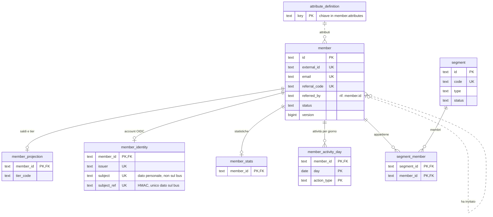
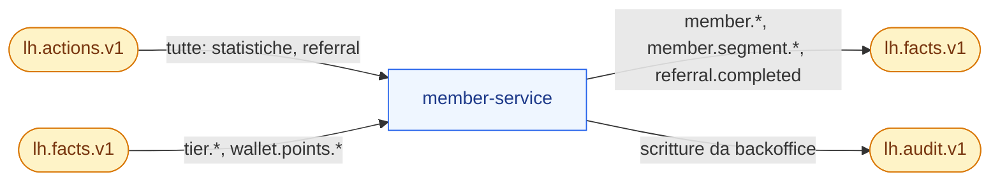
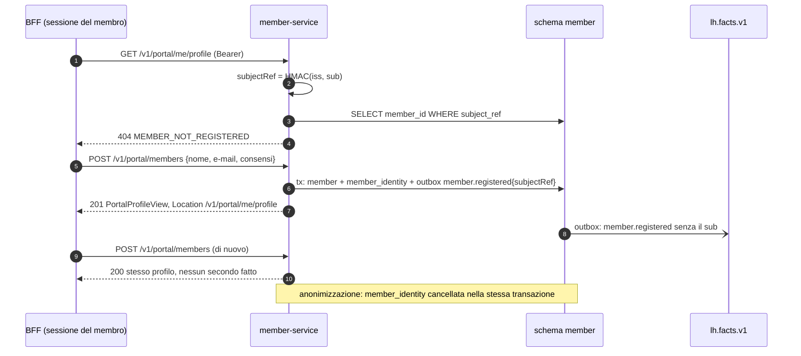

# member-service

**Porta** 8082 · **Schema** `member` · **Feature** `F-MBR-*`, `F-SEG-*`, `F-REF-*` · **Milestone** M1 (anagrafica), M5 (registrazione, profilo, referral), M6 (segmenti, attributi), M7 (anonimizzazione)

## 1. Scopo e confini
Anagrafica dei membri, attributi, etichette, segmenti, referral. Mantiene una **proiezione** di saldi/tier e le **statistiche di attività** per elenchi e segmenti.
Non possiede saldi né tier (sono del wallet): li riflette.

## 2. Modello dati
| Tabella | Colonne principali |
|---|---|
| `member` | `id` PK (`MBR-######`), `external_id` UQ, `first_name`, `last_name`, `nickname`, `email` UQ, `phone`, `birth_date`, `gender`, `city`, `status`, `channel` (`PORTAL, APP, STORE, IMPORT`), `registered_at`, `referral_code` UQ, `referred_by`, `referral_completed_at`, `consents jsonb` (`{marketing, profiling}`), `attributes jsonb`, `labels text[]`, `avatar_seed`, `profile_completed_at`, `version` |
| `member_identity` | `member_id` PK → `member.id`, `issuer`, `subject` (dato personale, mai sul bus né nei log), `subject_ref` UQ (`^[0-9a-f]{64}$`: HMAC-SHA256 di `(issuer, subject)` con `LH_SUBJECT_KEY`, l'unico dato che lascia il servizio), `linked_at`; `UNIQUE(issuer, subject)`. Legame account OIDC ↔ membro (F2-IAM-03, ADR-048, Q-551): `member.external_id` resta l'id del CRM e non è il `sub`. Si scrive con la registrazione dal portale e si cancella con l'anonimizzazione; solo espansione (V4, ADR-038) |
| `member_projection` | `member_id` PK, `tier_code`, `period_sts`, `balance_pts`, `pending_pts`, `lifetime_earned_pts`, `updated_at` |
| `member_stats` | `member_id` PK, `last_activity_at`, `actions_total`, `actions_by_type jsonb` (`{type: {count30d, total, lastAt}}`), `purchases_count`, `purchases_amount_90d`, `purchases_amount_total` |
| `segment` | `id`, `code` UQ, `name`, `description`, `type` (`STATIC`/`DYNAMIC`), `criteria jsonb`, `status` (`ACTIVE`/`ARCHIVED`), `member_count`, `refreshed_at`, `version` |
| `segment_member` | (`segment_id`, `member_id`) PK, `entered_at` |
| `member_activity_day` | (`member_id`, `day`, `action_type`) PK, `count`, `purchase_amount`: contatori giornalieri per le finestre mobili dei criteri (`actions.<type>.count30d`, `purchases.amount90d`; SPEC-GAP Q-82, V2) |
| `attribute_definition` | `key` PK, `label`, `type` (`STRING, NUMBER, BOOLEAN, DATE`), `options text[]`, `position` (ordine in BO-03 e nel costruttore di condizioni) |

Tracciato delle tabelle (docs/18 §3.12-bis, verificato sulle migrazioni `V1`–`V4`). Linee continue: vincolo `FOREIGN KEY` nella migrazione; tratteggiate: riferimento logico (`member.referred_by` verso il membro che ha invitato, le chiavi di `member.attributes` verso `attribute_definition`). Le tabelle comuni di lh-common (docs/06 §1) esistono nello schema ma member non usa `approval_history`.

## 3. API
### Gestione
| Metodo | Path | Note |
|---|---|---|
| GET | `/v1/members` | filtri `q` (nome, e-mail, id, externalId), `status, tier, label, segment, registeredFrom/To`; colonne da `member` + proiezione |
| POST | `/v1/members` | crea; `referralCode` opzionale → valida e lega. Il portale usa `POST /v1/portal/members` (§ Portale); l'endpoint passa a `ADMIN` e `CARE` nell'ultima fetta di M8.10f, dopo un rilascio del web migrato (Q-157, Q-493, ADR-038) |
| GET/PATCH | `/v1/members/{id}` | PATCH parziale con `version` |
| POST | `/v1/members/{id}/status` | `{status, reason}` — `BLOCKED/INACTIVE/ACTIVE` |
| POST | `/v1/members/{id}/anonymize` | irreversibile; conferma `{confirm: "MBR-…"}` |
| GET | `/v1/members/{id}/segments` · `/referrals` | segmenti di appartenenza; invitati con stato |
| GET/POST/PUT | `/v1/segments`, `/v1/segments/{id}` | |
| POST | `/v1/segments/preview` | `{criteria}` → `{count, sample[10]}` senza salvare |
| POST | `/v1/segments/{id}/refresh` | ricalcolo immediato → `{entered, left, total}` |
| PUT | `/v1/segments/{id}/members` | solo `STATIC`: sostituisce l'elenco |
| GET/PUT | `/v1/attribute-definitions` | PUT sostituisce l'elenco; una chiave con valori sui membri non si toglie né cambia tipo (Q-93), e le sue opzioni non si restringono (né si introducono) se un valore presente ne resterebbe fuori (Q-306): `409 ATTRIBUTE_IN_USE` |
| GET | `/v1/referral/overview` | totali: inviti, completati, tasso, top presentatori |
| POST | `/v1/members/nicknames` | soprannomi a lotti per il BFF (Q-368, M8.4): `{memberIds: [..]}` da 1 a 200 id → `{items: [{memberId, nickname}]}`, una voce per id (senza doppioni, nell'ordine), `nickname` `null` se il membro non esiste o non ne ha, `Membro anonimo` se `ANONYMIZED`; oltre 200 id `400 TOO_MANY_IDS`, lista vuota `400 BAD_REQUEST` (errore sul campo `memberIds`). Sola lettura: nessun fatto né audit |

### Portale
Il membro viene dal token (ADR-048, `docs/06 §3.4`): nessun `memberId` in percorso, query o corpo. Nel profilo `demo` (regola 6-bis) il membro è il `memberId` esplicito o l'header `X-LH-Member` messo dal BFF.

| Metodo | Path | Note |
|---|---|---|
| POST | `/v1/portal/members` | **registrazione dal portale** (PT-16, F-MBR-06, Q-157; `@MemberEndpoint(REGISTRATION)`). Corpo `PortalRegistrationRequest {firstName, lastName, nickname, email, phone?, city?, consents?, referralCode?}`: nessun `memberId` (Q-573), `externalId`, `status` né `channel` (ignorati; `locale` rinviato, Q-574). In `enterprise` una sola transazione crea `member` (id `MBR-######`, canale `PORTAL`, stato `ACTIVE`), `member_identity(iss, sub, subjectRef)` e `member.registered` con `subjectRef` (mai il `sub`); audit `CREATE` con attore `member:<nuovo id>`. Idempotente sul `sub`: `201` + `Location: /v1/portal/me/profile` la prima volta, poi `200` con lo stesso profilo e nessun secondo fatto; una corsa tra richieste dello stesso account si risolve con un advisory lock su `subjectRef` e rileggendo il legame (`200`), senza violazione dell'indice unico. `409 EMAIL_TAKEN` se l'e-mail è di un altro membro (nessun collegamento per e-mail, Q-557); operatore o token misto `403 MEMBER_REQUIRED`. In `demo` (nessun token) crea un nuovo membro senza legame, come `POST /v1/members` |
| GET | `/v1/portal/me/profile` | profilo + completezza (`{completed, missingFields[]}`) + `status` (`PortalProfileView`); `404 MEMBER_NOT_REGISTERED` se l'account non ha un membro (il portale porta alla registrazione) |
| PATCH | `/v1/portal/me/profile` | solo campi di profilo e consensi (`PortalProfileRequest`); audit `UPDATE` con attore `member:<id>` (mai `preferred_username` né e-mail del token, regola 20) |
| GET | `/v1/portal/me/referral` | `{code, shareUrl, invited[], completedCount}` |
| GET | `/v1/portal/members/{id}` · PATCH `/v1/portal/members/{id}` · GET `/v1/portal/members/{id}/referral` | **legacy, `deprecated`**: l'id nel percorso vale solo in `demo` (regola 6-bis); in `enterprise` `403 MEMBER_FROM_TOKEN`. Non vengono rimossi (ADR-038) |

Errori del membro dal token (Q-553): `memberId` in query o `X-LH-Member` `400 MEMBER_FROM_TOKEN` (anche se è il proprio), id nel percorso `403 MEMBER_FROM_TOKEN`, operatore o token misto `403 MEMBER_REQUIRED`; in `demo` due fonti diverse `400 MEMBER_MISMATCH`. **Scostamento (Q-573, `SPEC-GAP`):** `docs/06 §3.4` vuole `400 MEMBER_FROM_TOKEN` anche per un `memberId` nel corpo, ma `MemberBodyAdvice` vede solo l'oggetto deserializzato e `PortalProfileRequest` e `PortalRegistrationRequest` non hanno il campo: oggi il valore è scartato dal DTO (`200`/`201`) e il membro resta quello del token. La correzione è in lh-common (Q-573, alternativa B); finché non c'è, questa riga non è normativa. `locale` non è nel corpo di registrazione (Q-574, M8.4).

### Demo
| GET | `/v1/demo/personas` | i membri in evidenza per il selettore: `{memberId, name, tier, story, avatarSeed, balancePts}` (saldo dalla proiezione, per le schede del Demo Hub, docs/07 §8) |
| POST | `/v1/demo/jobs/refresh-segments` · `/v1/demo/jobs/birthdays?asOf=` | |

## 4. Eventi
| Direzione | Topic | Tipi |
|---|---|---|
| Produce | `lh.facts.v1` | `member.registered`, `member.updated` (con `subjectRef` per un membro legato a un account, Q-552), `member.status.changed`, `member.profile.completed`, `member.birthday`, `member.segment.entered/left`, `referral.completed` |
| Produce | `lh.audit.v1` | ogni scrittura da backoffice |
| Consuma | `lh.actions.v1` | tutte → `member_stats`; verifica qualifica referral |
| Consuma | `lh.facts.v1` | `tier.*`, `wallet.points.*` → `member_projection` |

A sinistra i topic che member consuma, a destra quelli su cui pubblica (tramite outbox, docs/04 §5).

## 5. Regole
- `member.registered` e `member.updated` portano sempre lo **snapshot completo** (gli altri servizi sovrascrivono il proprio snapshot, nessun merge).
- `subjectRef` (Q-552, ADR-048) è l'HMAC-SHA256 di `(issuer, sub)` calcolato da `MemberPrincipals` con `LH_SUBJECT_KEY`; ogni `member.registered`/`member.updated` di un membro legato lo porta, così le proiezioni degli altri servizi (`subject_ref`) si riparano da sole; un membro senza legame, o anonimizzato, non porta il campo (assente = legame invariato per i consumer). L'anonimizzazione cancella `member_identity` nella stessa transazione: `/me/profile` dà `404`, una nuova registrazione dello stesso account crea un nuovo membro (D11, Q-558).
- `nickname` default = nome + iniziale cognome ("Giulia F.").
- Profilo completo: alla prima PATCH che valorizza tutti i campi richiesti (`docs/03 §2`) → `profile_completed_at` + fatto (una sola volta).
- Referral: codice inesistente → `422 REFERRAL_CODE_INVALID`; proprio codice → `422 REFERRAL_SELF`. Alla prima azione di tipo `referral.qualifyingActionType` di un membro con `referred_by` e `referral_completed_at` nullo → due fatti `referral.completed` (chiavi = i due `memberId`).
- **Criteri dei segmenti** (docs/03 §3.3, §10): cast tipizzato comune di lh-common (`io.loyaltyhub.common.condition.TypedCast`, Q-215/Q-216 decise), identico in campaign, member, gamification ed engagement: il **tipo bersaglio è quello del dato** e si converte il valore della regola, mai il contrario; numero ← numero JSON o testo `^-?\d+(\.\d+)?$` esatto (confronto `BigDecimal`), booleano ← `true`/`false` JSON o testo esatto, data ← `AAAA-MM-GG` valida, istante ← data e ora ISO-8601 con fuso (stessa granularità: una data non si confronta con un istante), testo ← solo testo; cast fallito → foglia falsa per ogni comparatore, negazioni comprese; `contains/ncontains/startsWith` solo su testo (una data non è testo); campo assente o `null` → falsa tranne `nexists`; comparatore sconosciuto → falsa. Una lista vuota (`labels`) vale come assente; su lista `in` = intersezione non vuota, `nin` = intersezione vuota. Gruppo con operatore sconosciuto o mancante, `any` vuoto e foglia senza `field`/`cmp` → falsi (Q-222, Q-223, Q-224, Q-219). Validazione (salvataggio e anteprima): forma non valida → `422 INVALID_CRITERIA`; forma valida ma valore non convertibile nel tipo del campo (contatori e saldi numerici, `tier/status/city` testo, `attributes.<k>` col tipo della sua definizione `STRING/NUMBER/BOOLEAN/DATE`) → `422 CONDITION_INVALID`, percorso in `errors[].field` (es. `criteria.rules[1].value`) (Q-215).
- Segmenti dinamici: ricalcolo su richiesta, dopo il reset e ogni 15 minuti (`@Scheduled`, solo se ci sono state variazioni in `member_stats`/`member_projection`). Si emettono solo le differenze.
- Le azioni interne (`source internal`) non aggiornano `last_activity_at` né i conteggi acquisti.

## 6. Seed
`seed/members.json` (12 membri, `docs/10 §2`), `seed/wallets.json` (per la proiezione), `seed/segments.json`, `seed/attribute-definitions.json`. `member_stats` calcolate dal seeder da `seed/activity-history.json`.

## 7. Accettazione minima
- Creando un membro, allora esiste il fatto `member.registered` con snapshot completo e `referralCode` di 8 caratteri.
- Ricevendo `wallet.points.earned` per un membro, allora `member_projection.balance_pts` = `balanceAfter`.
- Dato Elisa (`MBR-000009`, invitata da Marco) al primo `purchase.completed`, allora due fatti `referral.completed` con ruoli opposti e nessun altro ai successivi acquisti.
- L'anteprima di un segmento `member.tier in [GOLD, PLATINUM]` restituisce il conteggio atteso dai seed (4).

## 8. Fase 2 (profilo `enterprise`)

Riferimento: `docs/18`. Le righe qui sotto sono segnaposto dell'adozione (M8.0): la fetta citata le rende normative aggiornando questa scheda.

- **Dati personali fuori dal bus** (ADR-032, M8.4): `member.registered`/`member.updated` in versione `:2` con soli dati non identificativi (`birthYear`, `province`, `locale`, attributi `pii:false`), doppia lettura `:1`/`:2` (Q-346); modulo `delivery` con adattatori SMTP/WEBHOOK, unico proprietario dei contatti; cifratura a colonna di `email` e `phone` (F2-SEC-04).
- **Soprannomi per classifiche e vincitori** (Q-368, M8.4 parte 2d): senza `nickname` sul bus, gamification espone solo i `memberId` (`resolve=ids`) e il BFF, lato server, chiede i soprannomi con `POST /v1/members/nicknames` (§3). Il browser del portale non riceve mai gli id degli altri membri. L'endpoint segue le altre letture del servizio (`@RequiresRole` con tutti i ruoli, `ANALYST` compreso: deny by default, docs/06 §3.2); nel profilo `enterprise` lo chiama solo il BFF con la propria identità (M8.2/M8.10).
- **Identità** (ADR-027, ADR-048, M8.2, M8.10f, F2-IAM-03): il legame tra il token OIDC e il membro sta nella tabella `member_identity(member_id, issuer, subject, subject_ref, linked_at)` con `UNIQUE(issuer, subject)` (§2, Q-551); `member.external_id` resta l'id del CRM e non è il `sub`. member-service è la fonte **autorevole** del legame (`MemberIdentityLookup`, senza cache): un account senza riga è `404 MEMBER_NOT_REGISTERED`, mentre gli altri servizi rispondono `409 MEMBER_NOT_LINKED` finché il fatto non è arrivato alla loro proiezione. La registrazione dal portale è `POST /v1/portal/members` (§3, idempotente su `(issuer, subject)`); il legame si cancella con l'anonimizzazione. Sul bus viaggia solo `subjectRef`, l'HMAC-SHA256 di `iss` e `sub` con `LH_SUBJECT_KEY` (campo opzionale di `member.registered`/`member.updated`, Q-552); `subject` è un dato personale e non lascia il servizio. Nel portale il membro viene solo da `MemberPrincipal` (`/v1/portal/me/profile`, `/v1/portal/me/referral`; `docs/06 §3.4`). `POST /v1/members` passa a `ADMIN` e `CARE` nell'ultima fetta di M8.10f (Q-157, Q-493).
- **Attività del membro** (ADR-043, M8.12): tabella `member_activity_entry` (login da Keycloak, consensi, giocate, riscatti, azioni dal portale), in BO-03 (tab «Attività») e PT-18 «La mia attività»; lettura diretta da member-service (Q-356).
- **Punteggi esterni** (ADR-045, M13.5): `attribute_definition.kind=SCORE` con validità; mai nel portale né in effetti negativi.

**Classificazione `x-lh-class`** (`docs/18 §3.15`, F2-GRC-05; prima stesura M8.0, verificata e resa per colonna in M8.13). Tutto ciò che non è elencato è `INTERNAL`.
- `PERSONAL`: `member.first_name`, `last_name`, `nickname`, `email`, `phone`, `birth_date`, `gender`, `city`, `consents`, `attributes` (se `pii:true`), `avatar_seed`; `member.external_id`.
- `CONFIDENTIAL`: `member.referral_code`, `member_stats.*` (profilo di comportamento).
