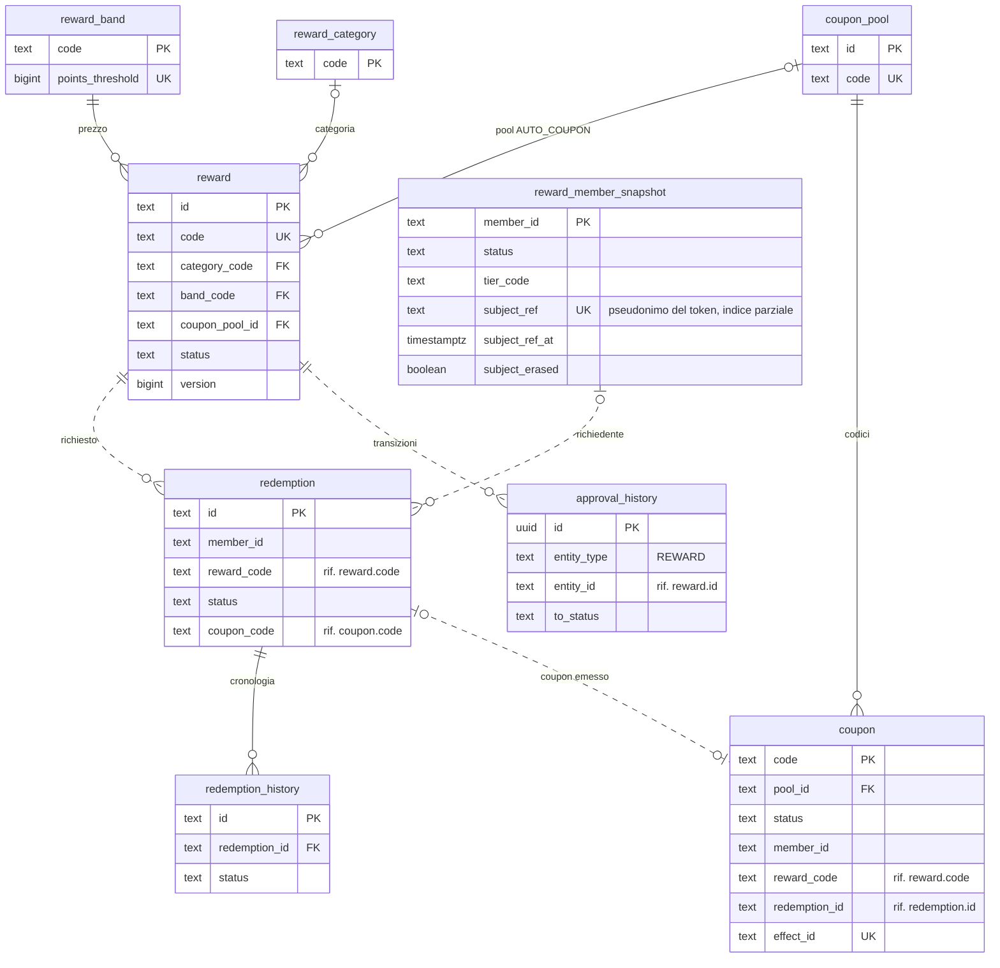
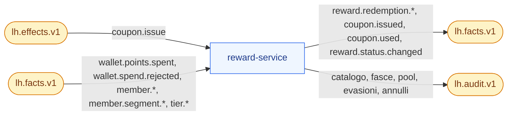

# reward-service

**Porta** 8085 · **Schema** `reward` · **Feature** `F-RWD-*`, `F-CPN-*` · **Milestone** M4 (catalogo, fasce, pool, saga), M5 (coupon da effetto `coupon.issue`), M6 (visibilità per segmento), M7 (approvazione `LEGAL`)

## 1. Scopo e confini
Catalogo premi organizzato per **fasce**, pool di coupon, **richieste premio** e loro evasione. Avvia la saga di spesa e reagisce all'esito del wallet.
Non conosce i saldi: il controllo del saldo è del wallet. Il campo `reachable` del catalogo portale lo calcola il **frontend** incrociando catalogo e saldo (due chiamate indipendenti).

## 2. Modello dati
| Tabella | Colonne principali |
|---|---|
| `reward_category` | `code` PK, `name`, `icon`, `sort_order` |
| `reward_band` | `code` PK (`F1`…`F5`), `name`, `points_threshold` UQ, `color`, `sort_order` |
| `reward` | `id`, `code` UQ, `name`, `description`, `terms`, `image_url`, `type` (`PHYSICAL, COUPON, DIGITAL, DONATION, EXPERIENCE`), `category_code`, `band_code`, `fulfilment` (`AUTO_COUPON, MANUAL, INSTANT`), `coupon_pool_id` null, `stock_total` null = illimitato, `stock_remaining`, `per_member_limit` null, `eligible_tiers text[]`, `eligible_segments text[]`, `valid_from`, `valid_to`, `status` (ciclo §3.6 di `docs/03`), `version`, `created_by`, `updated_at` |
| `coupon_pool` | `id`, `code` UQ, `name`, `prefix`, `validity_days`, `seed` (generazione deterministica dei codici), `created_at`. Disponibili e totali si contano da `coupon` per stato (V2 ha rimosso `total` e `available`) |
| `coupon` | `code` PK, `pool_id`, `status` (`AVAILABLE, ISSUED, USED, EXPIRED, VOID`), `member_id`, `reward_code`, `origin` (`REDEMPTION, CAMPAIGN`), `redemption_id`, `effect_id` UQ null, `issued_at`, `expires_at`, `used_at`, `voided_at`, `created_at` |
| `redemption` | `id` (ULID), `member_id`, `reward_code`, `reward_name`, `points_cost`, `status` (`PENDING, CONFIRMED, FULFILLED, REJECTED, CANCELLED`), `reject_reason`, `needs_attention bool`, `coupon_code`, `fulfilment_note`, `shipping jsonb`, `correlation_id`, `requested_at`, `confirmed_at`, `closed_at`, `actor` |
| `redemption_history` | `id`, `redemption_id` FK, `status`, `note`, `actor`, `at`: cronologia degli stati di una richiesta (`GET /v1/redemptions/{id}`) |
| `reward_member_snapshot` | `member_id` PK, `status`, `tier_code`, `segments text[]`, `first_name`, `last_name`, `updated_at` (da fatti); proiezione del legame account↔membro (Q-550, ADR-048): `subject_ref` (pseudonimo HMAC di `iss`+`sub`, mai il `sub`), `subject_ref_at` (istante dell'ultimo aggiornamento del legame), `subject_erased` (lapide dell'anonimizzazione) · indice unico parziale su `subject_ref` (`V4`). Prefisso `reward_` per non collidere con `campaign.member_snapshot` nel search_path dell'hub (ADR-023) |

Tracciato delle tabelle (docs/18 §3.12-bis, verificato sulle migrazioni `V1`–`V4`). Linee continue: vincolo `FOREIGN KEY` nella migrazione; tratteggiate: riferimento logico tenuto dal codice (richieste e coupon citano il premio per `code`, non per `id`). Delle tabelle comuni di lh-common (docs/06 §1) compare solo `approval_history`, che registra le transizioni dei premi (`entity_type = REWARD`, ciclo comune di docs/03 §3.6). Gli stati della richiesta e del coupon sono in docs/03 §5.

## 3. API
### Gestione
| Metodo | Path | Note |
|---|---|---|
| GET/POST/PUT | `/v1/reward-categories` | |
| GET/POST/PUT/DELETE | `/v1/reward-bands` | soglie uniche e crescenti (`422 BAND_THRESHOLD_DUPLICATE`); non eliminabile se ha premi (`409 BAND_IN_USE`) |
| GET/POST/PUT | `/v1/rewards`, `/v1/rewards/{id}` | filtri `status, band, category, type, q`; modifica ammessa in `DRAFT`/`PAUSED`; in `LIVE` solo `stock_total`, `valid_to`, `image_url`. `PUT` con `version` obbligatoria (`422 VERSION_REQUIRED` se assente, `409 VERSION_CONFLICT` se superata; Q-280). `fulfilment=AUTO_COUPON` richiede `couponPoolId` (`422 REWARD_INVALID` in creazione e modifica; la pubblicazione di un AUTO_COUPON senza pool è rifiutata con lo stesso codice; Q-281) |
| POST | `/v1/rewards/{id}/transitions` | `{action, comment}` — macchina a stati comune (`docs/06 §7`) |
| POST | `/v1/rewards/{id}/duplicate` | copia in `DRAFT` con codice `-COPY` |
| GET/POST | `/v1/coupon-pools` | |
| POST | `/v1/coupon-pools/{id}/generate` | `{count ≤ 5000}` → codici `prefix-XXXX-XXXX` |
| POST | `/v1/coupon-pools/{id}/import` | `{codes[]}`; duplicati → riepilogo `{imported, skipped[]}` |
| GET | `/v1/coupon-pools/{id}/coupons` | filtri `status, memberId` |
| GET | `/v1/coupons/{code}` · POST `/v1/coupons/{code}/use` · POST `/v1/coupons/{code}/void` | `409 COUPON_ALREADY_USED`, `410 COUPON_EXPIRED`, `404`. `void` solo da `AVAILABLE` (ritiro di un codice mai emesso) e `ISSUED` valido; da `USED`/`VOID`/scaduto `409` (`COUPON_EXPIRED` per uno scaduto, che resta `EXPIRED`; Q-278) |
| GET | `/v1/redemptions` | filtri `status, memberId, rewardCode, needsAttention, from, to` |
| GET | `/v1/redemptions/{id}` | con cronologia stati |
| POST | `/v1/redemptions/{id}/fulfil` | `{note, tracking?}` — solo `CONFIRMED` e `fulfilment=MANUAL`; ruoli `CARE/ADMIN` |
| POST | `/v1/redemptions/{id}/cancel` | `{reason}` — `CONFIRMED` → `CANCELLED` con `refund=true`; ruoli `CARE/ADMIN` |
| GET | `/v1/approvals` | formato comune |
| GET | `/v1/rewards/stats` | top premi, richieste per stato, stock sotto soglia (< 10 %) |

### Portale
Il membro viene solo dal token (Q-410, ADR-048, docs/06 §3.4): nessun endpoint prende più il membro da query o percorso; il campo `memberId` del corpo è deprecato e vale solo in `demo`. Lo risolve `EndpointAccessInterceptor` e lo consegna al controller come `MemberPrincipal`. In `enterprise` un `memberId` in query, campo form o corpo, o l'header `X-LH-Member`, dà `400 MEMBER_FROM_TOKEN` (anche se è il proprio); un operatore o un token misto su un endpoint `REQUIRED` dà `403 MEMBER_REQUIRED`, su uno `OPTIONAL` riceve la vista generica; un `sub` non ancora legato dà `409 MEMBER_NOT_LINKED` con `Retry-After: 2` (su un `OPTIONAL` la vista generica); una richiesta di un altro membro dà `404 NOT_FOUND`. In `demo` il membro è il `memberId` esplicito (query o campo deprecato del corpo) o l'header `X-LH-Member` messo dal BFF (regola 6-bis): gli errori restano quelli di prima e due fonti diverse danno `400 MEMBER_MISMATCH`. Il `memberId` esce dal contratto OpenAPI (resta, `deprecated`, nel solo corpo della richiesta premio).

| Metodo | Path | Note |
|---|---|---|
| GET | `/v1/portal/catalog` | `@MemberEndpoint(OPTIONAL)`. `{bands[]: {code, name, pointsThreshold, rewards[]: {code, name, type, imageUrl, category, pointsCost, stockState (AVAILABLE/LOW/SOLD_OUT), lockedByTier?: {requiredTiers[]}, perMemberLimitReached}}}` — include i premi bloccati per tier (mostrati con lucchetto), esclude quelli fuori segmento; senza membro (un operatore, BO-17) la vista generica: nessun livello, nessun segmento, nessun limite per membro |
| GET | `/v1/portal/rewards/{code}` | `@MemberEndpoint(OPTIONAL)`. Dettaglio + `terms` |
| GET | `/v1/portal/reward-categories` | alias di `GET /v1/reward-categories` per il portale (B4): uguale per tutti, aperto ai membri (`@RequiresRole(..., members = true)`) |
| POST | `/v1/portal/redemptions` | `@MemberEndpoint(REQUIRED)`. `{rewardCode, shipping?}` → **202** `{redemptionId, status: PENDING, correlationId}`; il campo `memberId` del corpo è deprecato e vale solo in `demo` (in `enterprise` `400 MEMBER_FROM_TOKEN`); l'attore della richiesta è `member:<id>` (Q-556) |
| GET | `/v1/portal/redemptions` · `/v1/portal/redemptions/{id}` | `@MemberEndpoint(REQUIRED)`. Le richieste del membro; il portale interroga fino a stato finale o `CONFIRMED`. La proprietà si controlla sempre in `enterprise` (`404` se la richiesta è di un altro membro); in `demo` solo se il chiamante indica un membro, come prima |
| POST | `/v1/portal/redemptions/{id}/cancel` | `@MemberEndpoint(REQUIRED)`. `404` se la richiesta è di un altro membro (Q-283); solo `PENDING`; in `demo` `400` se manca il membro |
| GET | `/v1/portal/coupons` | `@MemberEndpoint(REQUIRED)`. `{code, rewardName, status, issuedAt, expiresAt, origin}` |

**Scostamento noto (Q-573, `SPEC-GAP`).** `MemberBodyAdvice` (lh-common) ispeziona solo l'oggetto già deserializzato: un `memberId` che `RedemptionRequest` lega (la componente `memberId`, o una chiave `memberId` dentro `shipping`, a qualunque profondità) dà `400 MEMBER_FROM_TOKEN`; una grafia che il DTO non conosce (`MEMBER_ID`) è scartata da Jackson e la richiesta riesce, ma il membro resta sempre quello del token (nessun BOLA). La correzione, con il rifiuto del corpo grezzo, sta in lh-common. Provato da TB-RWD-MBP-024/025.

Errori di validazione immediata su `POST redemptions`: `422 REWARD_NOT_AVAILABLE`, `REWARD_SOLD_OUT`, `MEMBER_LIMIT_REACHED`, `MEMBER_NOT_ACTIVE`, `TIER_NOT_ELIGIBLE`, `SHIPPING_REQUIRED` (per `PHYSICAL`).

### Demo
| POST | `/v1/demo/jobs/expire-coupons?asOf=` · `/v1/demo/jobs/timeout-redemptions?asOf=` | |

## 4. Eventi
| Direzione | Topic | Tipi |
|---|---|---|
| Consuma | `lh.effects.v1` | `coupon.issue` |
| Consuma | `lh.facts.v1` | `wallet.points.spent`, `wallet.spend.rejected`, `member.registered/updated/status.changed` (stato e, dal campo opzionale `subjectRef`, il legame token↔membro: §5), `member.segment.entered/left`, `tier.upgraded/downgraded` |
| Produce | `lh.facts.v1` | `reward.redemption.requested/confirmed/fulfilled/rejected/cancelled`, `coupon.issued`, `coupon.used`, `reward.status.changed` |
| Produce | `lh.audit.v1` | scritture su catalogo, fasce, pool, evasioni, annulli |

A sinistra i topic che reward consuma, a destra quelli su cui pubblica (tramite outbox, docs/04 §5). La saga di richiesta è in docs/04 §4.3.

## 5. Regole
Dominio in `docs/03 §5`. Note implementative:
- **Richiesta**: in un'unica transazione valida, decrementa `stock_remaining` con `UPDATE … WHERE stock_remaining > 0` (0 righe → `REWARD_SOLD_OUT`), inserisce `redemption PENDING`, scrive in outbox `reward.redemption.requested`. Il `correlationId` della richiesta HTTP diventa quello di tutta la saga.
- **`wallet.points.spent`** → `CONFIRMED` + fatto `confirmed`. Poi, secondo `fulfilment`: `AUTO_COUPON` → preleva un codice (`SELECT … FOR UPDATE SKIP LOCKED LIMIT 1` su `coupon AVAILABLE` del pool), `ISSUED`, scadenza = oggi + `validity_days` (fine di quel giorno, 23:59:59.999999 `Europe/Rome`: data di emissione a Roma + `validity_days`, Q-277), fatti `coupon.issued` + `fulfilled`; `INSTANT` (donazioni, digitali) → `FULFILLED` subito; `MANUAL` → resta `CONFIRMED` in coda a BO-13.
- Pool vuoto → `needs_attention = true`, nessun fatto `fulfilled`; BO-13 mostra l'avviso; dopo una nuova generazione di codici `POST /v1/redemptions/{id}/retry-fulfilment`.
- **`wallet.spend.rejected`** → `REJECTED` con motivo, stock ripristinato.
- **Stock residuo** (Q-280): non supera mai `stock_total − richieste PENDING/CONFIRMED/FULFILLED` (mai sotto zero): vale alla modifica del totale (anche da illimitato a limitato) e a ogni ripristino (rifiuto, timeout, annullo).
- **Timeout**: job ogni minuto, `PENDING` da più di 10 min → `REJECTED (TIMEOUT)`, stock ripristinato. Se `wallet.points.spent` arriva dopo il timeout → emette `reward.redemption.cancelled` con `refund=true` (compensazione) e log `WARN`.
- **Annullo** da `CONFIRMED`: stock ripristinato, eventuale coupon `VOID`, fatto `cancelled` con `refund=true` → il wallet rimborsa.
- `coupon.issue` da campagna: idempotenza su `effect_id`; usa il pool del premio indicato; pool vuoto → DLQ `COUPON_POOL_EMPTY` (non ritentabile).
- **Legame token↔membro** (Q-550, ADR-048, docs/06 §3.4): `member.registered`, `member.updated` (schemi `:1` e `:2`) e `member.status.changed` passano da `MemberSnapshotHandler`, che aggiorna lo snapshot e poi `MemberSubjectProjection`: applica il campo opzionale `subjectRef` a `reward_member_snapshot` con `MemberSubjectRules` di lh-common, nella stessa transazione dello snapshot e dell'inbox idempotente. Assente = nessun effetto (un member-service più vecchio non slega nessuno); `null` = slega; un fatto più vecchio di `subject_ref_at` o di un membro già cancellato non ri-lega; lo stesso pseudonimo su due membri va al più recente (a parità, all'id maggiore) e il sorpasso incrementa `lh_member_subject_relinked_total`; l'anonimizzazione (`member.status.changed`/`updated` con `ANONYMIZED`) azzera il legame e scrive la lapide `subject_erased`, che nessun replay ripristina. Un fatto senza `time` non vale «adesso»: non sorpassa un detentore datato e lascia `subject_ref_at` com'è (l'anonimizzazione vale comunque). Due membri che reclamano lo stesso pseudonimo da partizioni diverse convergono per ritentativo: il secondo commit viola l'indice unico `reward_member_subject_ref_uq`, il consumer ritenta e le regole si rivalutano con il detentore ormai visibile. `RewardMemberSubjectLookup` risolve il membro del token con l'indice locale (non autorevole: legame assente ⇒ `409 MEMBER_NOT_LINKED`, il fatto non è ancora arrivato). Nessuna chiamata sincrona, nessun dato personale sul bus.
- **Attore del membro** (Q-556): le scritture del portale portano `member:<memberId>` (richiesta premio, annullo del membro, cronologia e `lhactor` dei fatti); mai un nome utente né un'e-mail. Il seed demo usa la stessa forma; le righe storiche con `MEMBER:<id>` restano come sono (BO-13 mostra l'attore così com'è).
- Eventi consumati per richieste sconosciute → ignorati con log `WARN` (non DLQ).
- Job giornaliero: coupon `ISSUED` scaduti → `EXPIRED`.

## 6. Seed
`seed/reward-categories.json`, `seed/reward-bands.json`, `seed/rewards.json`, `seed/coupon-pools.json` (codici generati con seme fisso → stessi codici a ogni reset), `seed/redemptions.json` (storico + la richiesta manuale in attesa di Sofia, i 2 coupon di Davide). Dettaglio in `docs/10 §5`.

## 7. Accettazione minima
- Davide richiede `RWD-SHOP-10` (1 500 PTS) → `202`; entro 10 s stato `FULFILLED` con coupon; saldo −1 500; stock −1.
- Anna (100 PTS) richiede `RWD-COFFEE-5` → `202`, poi `REJECTED (INSUFFICIENT_BALANCE)`; stock invariato.
- Premio con `stock_remaining=1` e due richieste concorrenti → una `PENDING`, l'altra `422 REWARD_SOLD_OUT`.
- `RWD-WEEKEND` richiesto da membro `SILVER` → `422 TIER_NOT_ELIGIBLE`; nel catalogo compare con `lockedByTier`.
- Annullo di una richiesta `CONFIRMED` → `wallet.points.refunded`, stock +1, coupon `VOID`.
- `POST /v1/coupons/{code}/use` due volte → seconda `409`.
- Rielaborazione di `wallet.points.spent` → nessun secondo coupon.

## 8. Fase 2 (profilo `enterprise`)

Riferimento: `docs/18`. Le righe qui sotto sono segnaposto dell'adozione (M8.0): la fetta citata le rende normative aggiornando questa scheda.

- **Cataloghi esterni** (ADR-045, M13.6): `fulfilment=EXTERNAL`, `reward_provider` con adattatori generici, saga riserva → spesa → conferma con rilascio e rimborso automatico, sincronizzazione in `DRAFT`, stato `DEGRADED`; nuovo fatto `reward.redemption.refunded`.
- **Membro dal token** (M8.10f, ADR-048, Q-410, Q-550; F2-SEC-09): `V4__member_subject.sql` aggiunge a `reward_member_snapshot` il legame `subject_ref` (pseudonimo, mai il `sub`) con `subject_ref_at` e la lapide `subject_erased`; `MemberSubjectProjection` lo alimenta dai fatti di member; le API del portale non legano più `memberId` (`@MemberEndpoint`, `MemberPrincipal`) e i percorsi restano gli stessi. Sequenza completa in docs/06 §3.4. Testbook: TB-RWD-MBP (`docs/testbook/TB-RWD-premi.md` §21).
- **Dati personali** (ADR-032, M8.4): `reward_member_snapshot.first_name`/`last_name` escono dagli snapshot; i contatti per la spedizione li inoltra member-service.
  - *Doppia lettura `:1`/`:2`* (Q-346, fino a M10; M8.4c): `member.registered/updated` in entrambe le versioni aggiornano solo stato (e livello e segmenti dai rispettivi fatti); `first_name`/`last_name` non si scrivono più da nessun evento (colonne deprecate, eliminate con il contract di M10; il seed demo le valorizza ancora).
  - *Anonimizzazione* (Q-369): oltre all'indirizzo di spedizione si svuotano per intero le note libere dell'operatore (`redemption.fulfilment_note`, `redemption_history.note`); stato, esito e importi restano. Non servono più i nomi dello snapshot per ripulire le note.

**Classificazione `x-lh-class`** (`docs/18 §3.15`, F2-GRC-05; prima stesura M8.0, verificata e resa per colonna in M8.13). Tutto ciò che non è elencato è `INTERNAL`.
- `PERSONAL`: `redemption.shipping`, `reward_member_snapshot.first_name`, `last_name` (fino a M8.4).
- `CONFIDENTIAL`: `coupon.code` non ancora emesso, `coupon_pool.prefix`.
- `PUBLIC`: `reward` pubblicati (nome, descrizione, termini, immagine), `reward_category`, `reward_band`.
