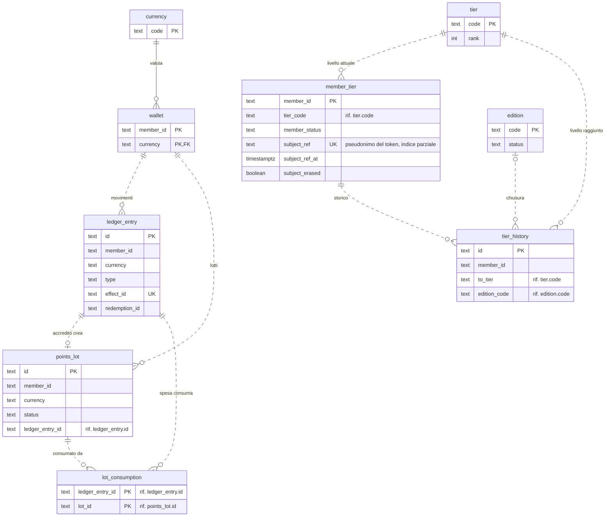
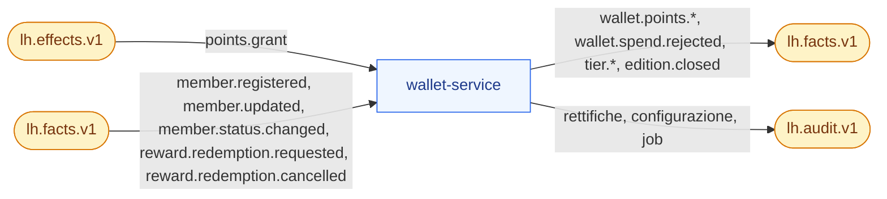

# wallet-service

**Porta** 8084 · **Schema** `wallet` · **Feature** `F-WAL-*`, `F-TIER-*`, `F-DEMO-06` · **Milestone** M1 (accrediti, saldi, movimenti), M3 (lotti, scadenze, tier, edizioni, rettifiche), M4 (saga di spesa, rimborsi)

## 1. Scopo e confini
Libro mastro dei punti a **doppia valuta**, lotti con scadenza, **tier** ed edizioni annuali. Applica gli effetti `points.grant`, partecipa alla saga delle richieste premio.
Non decide *quanti* punti dare (lo fa il motore); applica solo il moltiplicatore di tier, che è un vantaggio del livello.

## 2. Modello dati
| Tabella | Colonne principali |
|---|---|
| `currency` | `code` PK (`PTS`,`STS`), `name`, `spendable`, `expiry_policy jsonb` (`{type: ROLLING_MONTHS, months: 12}` …) |
| `wallet` | (`member_id`,`currency`) PK, `balance_active`, `balance_pending`, `lifetime_earned`, `lifetime_spent`, `lifetime_expired`, `updated_at` |
| `points_lot` | `id`, `member_id`, `currency`, `amount`, `remaining`, `status` (`PENDING, ACTIVE, EXHAUSTED, EXPIRED`), `earned_at`, `available_at`, `expires_at`, `warned` (preavviso di scadenza già inviato), `ledger_entry_id` · indice (`member_id`,`currency`,`status`,`expires_at`) |
| `ledger_entry` | `id` (ULID), `member_id`, `currency`, `type` (`EARN, SPEND, ADJUST_CREDIT, ADJUST_DEBIT, EXPIRE, REFUND, RELEASE`), `amount` (sempre positivo), `direction` (`+`/`−`), `balance_after`, `occurred_at` (data di business), `created_at`, `source_type` (`CAMPAIGN, REDEMPTION, MANUAL, SYSTEM`), `effect_id` UQ null, `redemption_id`, `campaign_code`, `action_id`, `correlation_id`, `description`, `actor`, `metadata jsonb` |
| `lot_consumption` | (`ledger_entry_id`, `lot_id`) PK, `amount` (per rimborsi e audit FIFO) |
| `tier` | `code` PK, `name`, `rank`, `threshold_sts`, `multiplier numeric(4,2)`, `benefits jsonb` (elenco testi), `color`, `icon` |
| `member_tier` | `member_id` PK, `tier_code`, `since`, `period_sts`, `previous_tier`, `member_status`; proiezione del legame account↔membro (Q-550, ADR-048): `subject_ref` (pseudonimo HMAC di `iss`+`sub`, mai il `sub`), `subject_ref_at` (istante dell'ultimo aggiornamento del legame), `subject_erased` (lapide dell'anonimizzazione) · indice unico parziale su `subject_ref` (`V2`) |
| `tier_history` | `id`, `member_id`, `from_tier`, `to_tier`, `kind` (`UPGRADE, DOWNGRADE, RETAIN, INITIAL`), `edition_code`, `at` |
| `edition` | `code` PK, `name`, `start_date`, `end_date`, `redemption_grace_until`, `status` |

Tracciato delle tabelle (docs/18 §3.12-bis, verificato sulle migrazioni `V1` e `V2`). L'unico vincolo `FOREIGN KEY` è `wallet.currency` verso `currency` (linea continua); il resto sono riferimenti logici tenuti dal codice (tratteggiati). I movimenti e i lotti di un membro si legano al wallet per la coppia (`member_id`, `currency`). Le tabelle comuni di lh-common (docs/06 §1) esistono nello schema ma wallet non usa `approval_history`. Gli stati del lotto e dell'edizione sono in docs/03 §4.2 e §4.4.

## 3. API
### Gestione
| Metodo | Path | Note |
|---|---|---|
| GET | `/v1/wallets/{memberId}` | `{balances: {PTS:{active,pending,lifetimeEarned,…}, STS:{…}}, expiringSoon: {amount, within30d, nextExpiryAt}, tier: {code, name, since, periodSts, next?: {code, threshold, missing}, progressPct, multiplier, keepWarning?}}` |
| GET | `/v1/wallets/{memberId}/ledger` | filtri `currency, type, from, to` (`type` anche più valori separati da virgola; `from`/`to` istante ISO o data `yyyy-MM-dd` in Europe/Rome, estremi inclusi, sulla data di business; valore non leggibile → `400`); ordinamento `occurredAt desc`. Ogni movimento: `{id, memberId, currency, type, amount, direction, balanceAfter, occurredAt, sourceType, campaignCode, description, metadataJson, actionId, actor}` (F-WAL-02) |
| GET | `/v1/wallets/{memberId}/lots` | lotti non esauriti, per scadenza |
| POST | `/v1/wallets/{memberId}/adjustments` | `{currency, direction (CREDIT/DEBIT), amount, reason (GOODWILL/CORRECTION/COMPLAINT/TEST), note ≥ 10 caratteri}` — ruoli `CARE/ADMIN`; `422 INSUFFICIENT_BALANCE`, `NOTE_TOO_SHORT`; `404` se il membro non ha wallet (nessun wallet creato al volo, Q-147) |
| GET | `/v1/members/{memberId}/tier-history` | |
| GET/PUT | `/v1/tiers`, `/v1/tiers/{code}` | soglie crescenti col rank (`422 TIER_THRESHOLDS_NOT_MONOTONIC`); `BASE` ha soglia 0 fissa |
| GET/PUT | `/v1/currencies`, `/v1/currencies/{code}` | policy di scadenza (vale per i nuovi lotti) |
| GET/POST/PUT | `/v1/editions` | niente sovrapposizioni (`422 EDITION_OVERLAP`) né buchi: l'inizio è il giorno dopo la fine dell'edizione precedente e la fine il giorno prima dell'inizio della successiva (`422 EDITION_NOT_CONTIGUOUS`, Q-151) |
| POST | `/v1/editions/{code}/close?dryRun=true` | anteprima: `{summary: {retained, downgraded, unknownTier}, members[]: {memberId, currentTier, periodSts, earnedTier, newTier, outcome (RETAINED/DOWNGRADED/UNKNOWN_TIER)}}`; con `dryRun=false` applica (ruolo `ADMIN`). `UNKNOWN_TIER` (Q-149): livello attuale assente dalla scala, membro lasciato invariato e contato in `unknownTier` |
| GET | `/v1/liability` | `{currency, outstanding, pending, byExpiryMonth[]}` |
| GET | `/v1/tiers/distribution` | conteggio membri per tier |

### Portale
Il membro viene solo dal token (Q-410, ADR-048, docs/06 §3.4): in `enterprise` un `memberId` in query, campo form o header `X-LH-Member` dà `400 MEMBER_FROM_TOKEN`, un id nel percorso legacy `403 MEMBER_FROM_TOKEN`, un operatore o un token misto `403 MEMBER_REQUIRED`, un `sub` non ancora legato `409 MEMBER_NOT_LINKED` con `Retry-After: 2`. In `demo` il membro è il `memberId` del percorso legacy o l'header `X-LH-Member` messo dal BFF (regola 6-bis).

| GET | `/v1/portal/me/wallet` | il wallet del membro del token, come sopra senza campi interni; `@MemberEndpoint` |
| GET | `/v1/portal/me/wallet/activity` | movimenti del membro del token (forma sotto); `?currency`, `?size` (1…100, default 30); `@MemberEndpoint`. Non `/me/activity`: è riservato a PT-18 (member-service) |
| GET | `/v1/portal/wallets/{memberId}` | **deprecato, solo demo**: come `/v1/portal/me/wallet` con l'id nel percorso; in `enterprise` 403; non si rimuove |
| GET | `/v1/portal/editions` | edizioni per la home del portale, uguali per tutti, aperte ai membri (`members = true`); alias di `GET /v1/editions` |
| GET | `/v1/portal/tiers` | scala dei livelli per il portale: `{code, name, threshold, multiplier, benefits[], color}` (PT-08); per compatibilità anche `rank`, `thresholdSts` (= `threshold`), `icon` |
| GET | `/v1/portal/wallets/{memberId}/activity` | **deprecato, solo demo** (come `/v1/portal/me/wallet/activity`). Movimenti in forma leggibile: `{id, occurredAt, title, subtitle, amount, direction, currency, icon, pending, expiresAt?, breakdown?}` — `amount` con segno, `direction` `+`/`−` come nel libro mastro, `icon` nome lucide per tipo; `pending` = il lotto nato dal movimento è ancora `PENDING`; `expiresAt` = scadenza di quel lotto (assente se il movimento non ha creato un lotto o il lotto non scade) |

### Demo (ruolo `ADMIN`)
| POST | `/v1/demo/jobs/expire-points?asOf=` · `/release-pending?asOf=` · `/expiry-warnings?asOf=` | eseguono i job con data di riferimento |

## 4. Eventi
| Direzione | Topic | Tipi |
|---|---|---|
| Consuma | `lh.effects.v1` | `points.grant` |
| Consuma | `lh.facts.v1` | `member.registered` (crea 2 wallet + `member_tier` BASE), `member.updated` (solo il legame `subjectRef`, vedi §5), `member.status.changed`, `reward.redemption.requested`, `reward.redemption.cancelled` (con `refund=true`) |
| Produce | `lh.facts.v1` | `wallet.points.*`, `wallet.spend.rejected`, `tier.upgraded/downgraded/retained`, `edition.closed` |
| Produce | `lh.audit.v1` | rettifiche, modifiche a tier/valute/edizioni, job (una voce `JOB` per esecuzione, anche senza lotti toccati: `entityType` `job`, `entityId` = nome del job, `after` = `{asOf, lots, members, amount}`) |

A sinistra i topic che wallet consuma, a destra quelli su cui pubblica (tramite outbox, docs/04 §5).

## 5. Regole
Tutte in `docs/03 §4`. Note implementative:
- Ogni operazione su un wallet prende il lock di riga (`SELECT … FOR UPDATE` su `wallet`) → serializzazione per membro/valuta.
- `points.grant`: unicità su `effect_id` = idempotenza di dominio. Se il membro non ha wallet (fatto `member.registered` non ancora arrivato) → crea wallet e tier BASE *on the fly*. Se il membro è nel frattempo `BLOCKED` o `ANONYMIZED` l'effetto è scartato (nessun movimento né fatto; log + voce di audit `wallet` `{memberId}:{currency}` con `after.effectId`); un membro `INACTIVE` continua ad accumulare (Q-140).
- Dopo un accredito `STS` → verifica salita nello stesso commit.
- **Legame token↔membro** (Q-550, ADR-048, docs/06 §3.4): `member.registered` e `member.updated` (schemi `:1` e `:2`) portano il campo opzionale `subjectRef`; `MemberSubjectProjection` lo applica a `member_tier` con `MemberSubjectRules` di lh-common, nella stessa transazione del wallet e dell'inbox idempotente. Assente = nessun effetto (un member-service più vecchio non slega nessuno); `null` = slega; un fatto più vecchio di `subject_ref_at` o di un membro già cancellato non ri-lega; lo stesso pseudonimo su due membri va al più recente (a parità, all'id maggiore) e il sorpasso incrementa `lh_member_subject_relinked_total`; l'anonimizzazione (`member.status.changed`/`updated` con `ANONYMIZED`) azzera il legame e scrive la lapide `subject_erased`, che nessun replay ripristina. Un fatto senza `time` non vale «adesso»: non sorpassa un detentore datato e lascia `subject_ref_at` com'è (l'anonimizzazione vale comunque). Due membri che reclamano lo stesso pseudonimo da partizioni diverse convergono per ritentativo: il secondo commit viola l'indice unico `wallet_member_subject_ref_uq`, il consumer ritenta e le regole si rivalutano con il detentore ormai visibile. `WalletMemberSubjectLookup` risolve il membro del token con l'indice locale (non autorevole: legame assente ⇒ `409 MEMBER_NOT_LINKED`, il fatto non è ancora arrivato). Nessuna chiamata sincrona, nessun dato personale sul bus.
- Spesa da richiesta premio: valuta sempre `PTS`; idempotenza su `redemption_id`.
- Job schedulati (disattivabili con `loyaltyhub.jobs.enabled`): rilascio pending ogni ora; scadenze alle 02:00; preavvisi alle 09:00 (una volta per lotto: flag su `points_lot`). In demo si lanciano da BO-30.
- Chiusura edizione: un'unica transazione per lotti da 200 membri; emette un fatto per membro + `edition.closed`. Un membro con un livello assente dalla scala resta invariato (livello, `periodSts`, storico; nessun fatto) ed è segnalato nel riepilogo (`unknownTier`, esito `UNKNOWN_TIER`, voce di audit della chiusura) (Q-149). «La successiva» che diventa `ACTIVE` (docs/03 §4.3) è la `PLANNED` con l'inizio più vicino dopo la fine di quella chiusa; una `PLANNED` precedente resta com'è.
- Calcolo `expires_at` per `ROLLING_MONTHS(n)`: ultimo istante del mese di `earned_at + n mesi`, in `Europe/Rome` — 23:59:59.999999, la precisione che `timestamptz` conserva (con i nanosecondi il driver arrotonderebbe al primo istante del mese dopo).
- `keepWarning`: valorizzato da ottobre (a dicembre, mesi in `Europe/Rome`) se `periodSts` < soglia del tier attuale: `{tier, missing}` con `missing` = soglia − `periodSts`; mai per un tier con soglia 0.

## 6. Seed
`seed/tiers.json`, `seed/currencies.json`, `seed/editions.json` (2025 `CLOSED`, 2026 `ACTIVE`, 2027 `PLANNED`), `seed/wallets.json` (saldi, `periodSts`, lotti con date **relative a oggi**, 8–25 movimenti storici per membro). Il seeder verifica l'invariante: Σ lotti attivi = saldo.

## 7. Accettazione minima
- Effetto `PTS` 130 con `tierMultiplierApplies` per membro `SILVER` → movimento `EARN` 162, `metadata.baseAmount=130`, lotto con scadenza a fine mese +12.
- Stesso `effectId` due volte → un solo movimento.
- Giulia (`SILVER`, 2 880 STS) + 130 STS → `tier.upgraded` a `GOLD` nello stesso commit.
- Spesa 1 500 con lotti [500 scad. ott, 800 scad. dic, 900 scad. mar] → consumati 500 + 800 + 200; `lot_consumption` coerente.
- Spesa oltre il saldo → nessun movimento, fatto `wallet.spend.rejected` con `available`.
- Chiusura 2026 in `dryRun`: Stefano (`GOLD`, 650 STS) → `SILVER` (guadagnato `BASE`, pavimento `SILVER`).
- Rettifica in addebito oltre il saldo → `422 INSUFFICIENT_BALANCE`; senza nota → `422`.

## 8. Fase 2 (profilo `enterprise`)

Riferimento: `docs/18`. Le righe qui sotto sono segnaposto dell'adozione (M8.0): la fetta citata le rende normative aggiornando questa scheda.

- **Membro dal token** (M8.10f, ADR-048, Q-410, Q-550; F2-SEC-09): `V2__member_subject.sql` aggiunge a `member_tier` il legame `subject_ref` (pseudonimo, mai il `sub`) con `subject_ref_at` e la lapide `subject_erased`; `MemberSubjectProjection` lo alimenta da `member.registered`/`member.updated`; le API del portale sono `/v1/portal/me/wallet[/activity]` e i percorsi con `{memberId}` restano deprecati e validi solo in `demo`. Sequenza completa in docs/06 §3.4. Testbook: TB-WAL-MBP (`docs/testbook/TB-WAL-wallet.md` §22).
- **Economia del programma** (ADR-045, M13.4): `currency.unit_cost` con storico, `cost_at_entry` sui lotti, controvalore della passività, `/v1/liability/forecast` con soglia e fatto `wallet.expiry.forecast.threshold` (metodo Q-361); BO-36.

**Classificazione `x-lh-class`** (`docs/18 §3.15`, F2-GRC-05; prima stesura M8.0, verificata e resa per colonna in M8.13). Tutto ciò che non è elencato è `INTERNAL`.
- `CONFIDENTIAL`: `ledger_entry` e `points_lot` per membro (valore economico individuale), `member_tier`, `tier_history`.
- `PUBLIC`: `currency.name`, `tier` (nome, soglia, vantaggi, colore), `edition` (nome e date).
