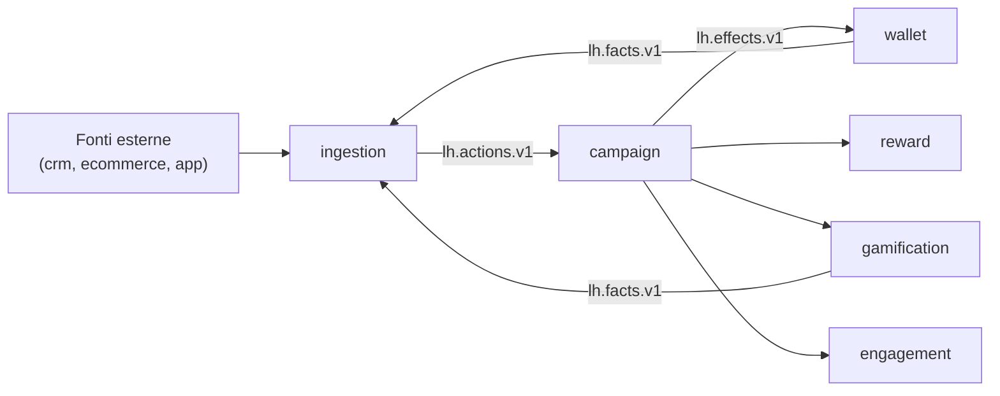

Questa pagina introduce le entità fondamentali di Loyalty Hub e come si compongono. È il minimo indispensabile per orientarti in backoffice, portale e reference tecnica.

## Il modello mentale

Loyalty Hub ruota attorno a un flusso semplice:

```text
Fonte → Azione → Motore campagne → Effetti → Wallet / Premi / Gioco → Fatti
```

Ogni cosa che accade è un **evento** su Kafka. Non c'è un orchestratore: i servizi reagiscono ai propri topic.

## I concetti in una figura



Il ciclo è chiuso: le cose che accadono internamente (una vincita, un salto di tier, un badge) tornano dentro come azioni tramite il **ponte interno** di ingestion.

## I concetti in breve

<CardGroup cols={2}>
  <Card title="Azioni e campagne" icon="bolt" href="/docs_v2/concetti/azioni-e-campagne">
    Come una fonte esterna diventa punti: fonti, tipi di azione, motore regole, effetti.
  </Card>

  <Card title="Punti e tier" icon="coins" href="/docs_v2/concetti/punti-e-tier">
    Doppia valuta (premio e status), lotti con scadenza, tier annuali e discesa morbida.
  </Card>

  <Card title="Premi e gioco" icon="gift" href="/docs_v2/concetti/premi-e-gioco">
    Fasce, coupon, richieste premio con saga, instant win, obiettivi, badge, classifiche.
  </Card>

  <Card title="Architettura" icon="layer-group" href="/docs_v2/reference/architettura">
    Confini dei microservizi, topic Kafka e principi di progetto.
  </Card>
</CardGroup>

## Glossario minimo

| Termine | Significato |
| --- | --- |
| **Azione** | Un accadimento che vuoi valutare (per esempio `purchase.completed`, `member.registered`). Entra come CloudEvent. |
| **Fonte** | Chi produce l'azione (`ecommerce`, `crm`, `app`, `internal`). Ogni fonte è abilitata o disabilitata. |
| **Campagna** | Regola che collega uno o più trigger a un pubblico, condizioni, effetti e limiti. |
| **Effetto** | L'esito deciso dal motore: `points.grant`, `multiplier`, `plays.grant`, `coupon.issue`, `badge.award`, `message.send`. |
| **Wallet** | Il conto punti del membro. Due valute: `PTS` (premio, spendibile) e `STS` (status, per la scala tier). |
| **Lotto** | Un blocco di punti con data di scadenza. Il consumo è FIFO. |
| **Tier** | Livello del membro nell'edizione corrente. Salite immediate, discese solo a fine edizione. |
| **Premio** | Voce di catalogo raggruppata in fasce. Si richiede consumando punti. |
| **Instant win** | Concorso con istanti vincenti pre-generati: giochi e vinci o no. |
| **Fatto** | Un evento di dominio che notifica un cambiamento di stato (`wallet.points.earned`, `tier.upgraded`, ecc.). |

## Il ciclo di un acquisto (esempio)

<Steps>
  <Step title="La fonte invia l'azione">
    L'e-commerce invia un CloudEvent `purchase.completed` con `orderId`, `amount`, `currency`.
  </Step>
  <Step title="Ingestion valida e canonicalizza">
    `ingestion-service` verifica la fonte, deduplica, risolve il membro e pubblica su `lh.actions.v1`.
  </Step>
  <Step title="Il motore valuta le campagne">
    `campaign-service` calcola quali campagne LIVE scattano per quel membro con quella azione. Applica limiti e priorità.
  </Step>
  <Step title="Gli effetti vengono applicati">
    `wallet-service` accredita i punti (creando un lotto), `engagement-service` invia il messaggio, `gamification-service` accredita giocate o badge, se previsti.
  </Step>
  <Step title="I fatti chiudono il cerchio">
    Ogni servizio emette fatti (`wallet.points.earned`, `tier.upgraded`, …) che alimentano proiezioni e osservabilità.
  </Step>
</Steps>

## Prossimo passo

Approfondisci il funzionamento del motore in [Azioni e campagne](/docs_v2/concetti/azioni-e-campagne).
