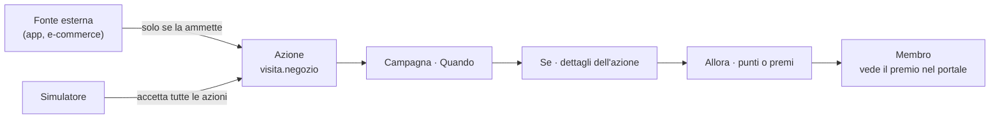

Un'azione è qualcosa che un membro fa e che un tuo sistema comunica a Loyalty Hub: un acquisto, una visita, una recensione. Le campagne ascoltano le azioni e decidono quando premiarle. Questa guida ti mostra come creare un'azione che il programma non ha ancora, come renderla ricevibile dai tuoi sistemi e come usarla in una campagna.

## Perché creare un'azione

Le azioni di sistema coprono i casi più comuni: acquisti, resi, recensioni, questionari, autoletture. Crea un'azione personalizzata quando il tuo programma premia un gesto che manca, per esempio una visita in negozio o la partecipazione a un evento.

Un'azione collega tre elementi:

- la **fonte**, cioè il sistema che la invia (app, e-commerce, casse, partner);
- l'**azione**, con le informazioni che la accompagnano (per esempio il codice del negozio);
- la **campagna**, che la ascolta nella sezione «Quando», ne controlla i dettagli in «Se» e assegna punti o premi in «Allora».



## Prerequisiti

- Stack in esecuzione o demo ospitata accesa: vedi [Quickstart](/getting-started/quickstart).
- Una persona del backoffice con ruolo `MARKETING` o `ADMIN`. Solo `ADMIN` abilita un'azione sulle fonti esterne.
- Il nome del gesto da premiare e le informazioni che il tuo sistema può inviare insieme a esso.

## Quickstart

Crea l'azione «Visita in negozio» e premiala con una campagna.

<Steps>
  <Step title="Apri Azioni e fonti">
    Nel backoffice vai a **Programma → Azioni e fonti**. Il riquadro «Come funziona» riassume il percorso Fonte → Azione → Campagna → Punti e premi.
  </Step>
  <Step title="Parti da un modello">
    Fai clic su **Nuova azione**. In «Parti da un modello» scegli **Visita in negozio**. L'editor compila nome, categoria, icona, codice `store.visited` e le informazioni `storeId` (obbligatoria) e `visitDate`.

    Se scegli un modello che esiste già come azione di sistema, per esempio **Acquisto**, l'editor ti propone **Usa quella esistente**: evita i doppioni.
  </Step>
  <Step title="Controlla il codice">
    Nella sezione **2 · Codice tecnico** l'elenco dei controlli deve essere tutto verde. Il riquadro sotto mostra che cosa invieranno i tuoi sistemi: `type = store.visited` oppure `io.loyaltyhub.action.store.visited`.
  </Step>
  <Step title="Crea l'azione">
    Fai clic su **Crea l'azione**. Il dettaglio mostra la tabella «Da dove può arrivare»: per ora l'azione arriva solo dal simulatore.
  </Step>
  <Step title="Abilitala su una fonte (ADMIN)">
    Come `ADMIN`, nella tabella «Da dove può arrivare» fai clic su **Abilita** accanto alla fonte, per esempio **App mobile**. In alternativa, abilitala già nella sezione **5 · Da dove può arrivare** dell'editor, prima di crearla.
  </Step>
  <Step title="Provala e usala in una campagna">
    Fai clic su **Prova nel simulatore** per inviare un'azione d'esempio. Poi fai clic su **Crea una campagna con questa azione**: la nuova campagna parte con `store.visited` già in «Quando».
  </Step>
</Steps>

> **Nota:** dopo il salvataggio il codice non si può cambiare e l'azione non si può eliminare, solo disattivare. Controlla il codice prima di fare clic su **Crea l'azione**.

## Scegliere le informazioni dell'azione

Nella sezione **3 · Informazioni che arrivano con l'azione** scrivi un'etichetta in italiano, per esempio «Codice negozio»: l'editor propone il nome tecnico (`storeId`). Per scegliere che cosa includere, rispondi a quattro domande:

1. **Come riconosco questa azione?** Aggiungi un identificativo obbligatorio, come `orderId`, `eventId` o `storeId`.
2. **C'è un importo su cui calcolare i punti?** Aggiungi il campo standard «Importo» (`amount`), obbligatorio.
3. **Vuoi premiare in modo diverso per canale, negozio o tipo?** Usa un «Elenco di valori», per esempio `ONLINE, STORE, APP`.
4. **Serve sapere quando è successo?** Aggiungi una «Data».

I campi standard (`amount`, `currency`, `channel`, `orderId`, `productId`, `storeId`) usano gli stessi nomi delle azioni di sistema. Così la condizione `data.amount ≥ 1` e l'effetto «per importo» funzionano anche con la tua azione.

> **Nota:** un'informazione obbligatoria che manca fa scartare l'azione, che compare nel [Monitor ingressi](/guide/osservare-il-sistema) come «dati non validi». Rendi obbligatorio solo ciò che il tuo sistema invia sempre.

> **Nota:** i dati personali non viaggiano nelle azioni. L'editor rifiuta nomi come `email`, `telefono` o «Codice fiscale»: il membro è già identificato dall'azione.

La sezione **4 · Esempio e anteprima** mostra l'evento che invierà il tuo sistema e come la campagna vedrà ogni informazione. L'esempio si aggiorna da solo finché non lo modifichi a mano. Il JSON Schema generato è sotto **Avanzate (per sviluppatori)**.

## Esempi d'uso pratico

### Creare un'azione mentre scrivi una campagna

1. In **Campagne → Nuova campagna**, sezione **2 · Quando**, cerca l'azione che ti serve.
2. Se non c'è, fai clic su **Crea «…» come nuova azione** oppure su **+ Crea una nuova azione** in fondo all'elenco.
3. L'editor si apre in un foglio laterale: la bozza della campagna resta com'è.
4. Fai clic su **Crea l'azione**. L'azione entra subito tra i trigger della campagna.

> **Nota:** la nuova campagna parte dalla condizione d'esempio `data.amount ≥ 1` e da un effetto «per importo». Se la tua azione non ha l'Importo, un avviso te lo ricorda: fai clic su **Togli la condizione d'esempio** e correggi l'effetto nella sezione **5 · Allora**.

### Inviare l'azione dal tuo sistema

Quando l'azione è abilitata sulla fonte, invia un CloudEvent a `POST /v1/events` come descritto in [Inviare un evento](/guide/inviare-un-evento):

```json Evento di esempio
{
  "specversion": "1.0",
  "id": "visit-2026-09-28-0001",
  "source": "urn:loyaltyhub:source:app",
  "type": "store.visited",
  "subject": "member:MBR-000003",
  "time": "2026-09-28T10:15:00Z",
  "data": { "storeId": "NEG-001", "visitDate": "2026-09-28" }
}
```

> **Nota:** se la fonte non ammette l'azione, l'evento viene rifiutato con `TYPE_NOT_ALLOWED`. Nella sezione **2 · Quando** di una campagna, un avviso segnala le fonti ammesse che non accettano un trigger scelto.

### Cambiare le azioni ammesse da una fonte (ADMIN)

Nella scheda **Fonti** fai clic su **Modifica azioni ammesse** e spunta le azioni. L'elenco si salva sempre completo. La scelta «Tutte le azioni, anche quelle create in futuro» apre la fonte a qualunque azione: usala solo per sistemi di cui ti fidi del tutto.

> **Nota:** nella demo il ripristino dei dati elimina le azioni personalizzate. Ricreale dopo un ripristino.
