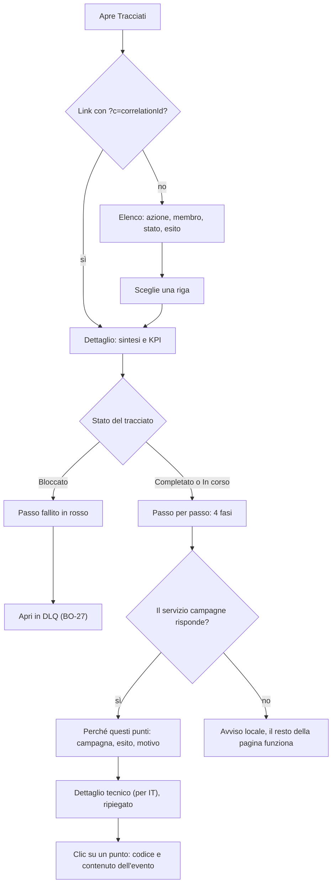

Questa guida ti mostra come osservare la piattaforma dall'ambiente demo. Impari a leggere i KPI di business, tracciare un evento end-to-end e recuperare messaggi finiti nella coda DLQ. Il servizio di riferimento e [Insight](/api/insight).

## Prerequisiti

- Ambiente demo avviato.
- Persona `sara.analyst` per KPI e report, `marta.admin` per replay DLQ.

## Leggere i KPI di business

Insight aggrega dati da tutti i servizi in dashboard tematiche.

```bash KPI campagne
curl http://localhost:8088/backoffice/kpi/campaigns?from=2025-01-01&to=2025-01-31 \
  -H "X-LH-Actor: sara.analyst"
```

I KPI disponibili:

| Endpoint | Descrizione |
| --- | --- |
| `/backoffice/kpi/campaigns` | Redemption, punti erogati, ROI per campagna. |
| `/backoffice/kpi/wallet` | Saldo medio, distribuzione tier, passivita. |
| `/backoffice/kpi/rewards` | Riscatti, stock residuo, top premi. |
| `/backoffice/kpi/engagement` | Tasso apertura, click, conversion. |

## Streaming eventi in tempo reale (SSE)

Insight espone un feed Server-Sent Events con tutti gli eventi che transitano nei topic Kafka. Utile per debug live.

```bash Feed live
curl -N http://localhost:8088/backoffice/events/stream \
  -H "X-LH-Actor: sara.analyst" \
  -H "Accept: text/event-stream"
```

Filtra per correlation id per seguire una singola richiesta.

```bash Filtro per correlation
curl -N "http://localhost:8088/backoffice/events/stream?correlationId=b1e6c3" \
  -H "X-LH-Actor: sara.analyst"
```

## Tracciare un evento end-to-end

Ogni evento porta con se `lhcorrelationid`. Segui la catena dalla ricezione fino agli effetti finali.

<Steps>
  <Step title="Invia un evento e cattura il correlation id">
    ```bash Invia
    curl -X POST http://localhost:8081/v1/actions \
      -H "Content-Type: application/cloudevents+json" \
      -d @evento.json
    ```

    Il response header `X-Correlation-Id` contiene il valore da usare nei passi seguenti.
  </Step>
  <Step title="Recupera la catena eventi">
    ```bash Catena eventi
    curl http://localhost:8088/backoffice/traces/{correlationId} \
      -H "X-LH-Actor: sara.analyst"
    ```

    La risposta elenca tutti gli eventi correlati con il servizio che li ha prodotti e l'ordine temporale.
  </Step>
</Steps>

## Leggere un tracciato nel backoffice

Apri **Osservabilità → Tracciati** (BO-25) per capire cosa ha fatto un membro, cosa ha ottenuto e perché, senza leggere codici evento. La schermata è pensata per marketing, assistenza, legale e analisi; i dettagli tecnici restano disponibili per l'IT.

1. Scegli una riga dell'elenco. Ogni riga mostra l'azione in italiano, il membro, lo stato (*Completato*, *In corso* o *Bloccato*) e l'esito in chip, per esempio «+124 punti». L'interruttore **Nascondi eventi solo tecnici** è attivo di default.
2. Leggi la sintesi in alto, per esempio «Anna Rossi ha completato un acquisto da € 24,90, elaborato in 6,4 secondi», e i riquadri con punti, livello, badge e messaggi.
3. Segui **Passo per passo**: le quattro fasi vanno dall'azione ricevuta alle regole controllate, agli effetti registrati e a obiettivi, badge e messaggi. Se un passo ne ha innescato un altro, lo trovi annidato sotto «Ha innescato a sua volta».
4. Apri **Perché questi punti** per vedere ogni campagna controllata, se è stata applicata e il motivo.
5. Se il tracciato è *Bloccato*, il passo fallito è in rosso: usa **Apri in DLQ** per gestirlo.
6. Per i dettagli tecnici apri **Dettaglio tecnico (per IT)** e scegli un punto della cascata per vederne il contenuto.



## Gestire la Dead Letter Queue (DLQ)

Gli eventi che falliscono in modo permanente finiscono sul topic `lh.dlq.v1` e sono consultabili via API.

```bash Lista DLQ
curl http://localhost:8088/backoffice/dlq?service=wallet&size=50 \
  -H "X-LH-Actor: sara.analyst"
```

Ogni elemento contiene payload, errore, correlation id, timestamp e numero di tentativi.

### Replay di un messaggio

Solo `ADMIN` puo rimettere in circolo un messaggio DLQ.

```bash Replay
curl -X POST http://localhost:8088/backoffice/dlq/{id}/replay \
  -H "X-LH-Actor: marta.admin"
```

> **Nota:** prima del replay verifica che la causa dell'errore sia stata risolta (bug fix, dato mancante, servizio non disponibile). Un replay ripetuto sullo stesso errore riempie di nuovo la DLQ.

## Errori comuni

<AccordionGroup>
  <Accordion title="Streaming SSE che si chiude subito">
    Alcuni proxy chiudono connessioni idle. Configura `keep-alive` a 30 secondi lato client o consuma il feed dietro un ingress che supporti SSE.
  </Accordion>

  <Accordion title="KPI a zero">
    L'aggregazione batch gira ogni 15 minuti. Attendi il prossimo ciclo o forza il refresh con `POST /backoffice/kpi/refresh`.
  </Accordion>
</AccordionGroup>

## Prossimi passi

<CardGroup cols={2}>
  <Card title="Insight API" icon="chart-line" href="/api/insight">
    Riferimento completo degli endpoint.
  </Card>

  <Card title="Eventi Kafka" icon="bolt" href="/concetti/eventi-kafka">
    Ripassa i cinque topic e le convenzioni degli eventi.
  </Card>
</CardGroup>
