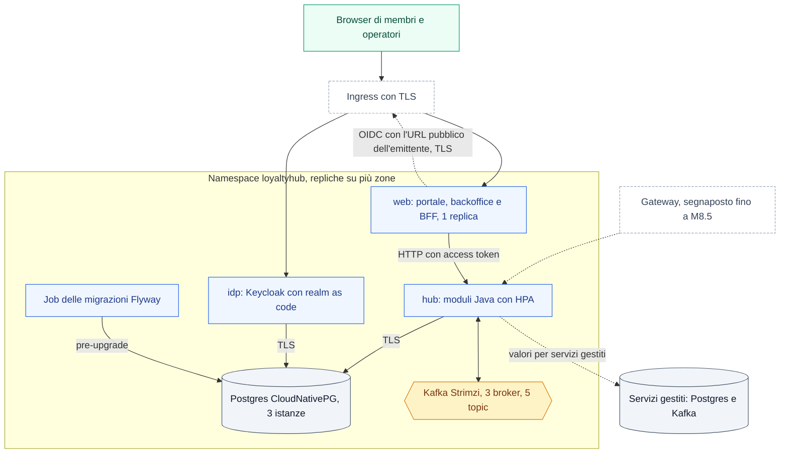

Il profilo `enterprise` si installa dalla **stessa immagine** in tre tagli: appliance a un container, compose di riferimento e chart Helm. Cambiano solo il ruolo di ogni container (`LH_ROLE`) e il posto dell'infrastruttura. Questa pagina riassume i due tagli disponibili da M8.3; comandi, valori e variabili completi sono in `deploy/README.md` del repository.

## Topologia del chart Helm

Ogni ruolo dell'immagine è un Deployment con repliche distribuite tra le zone. L'Ingress porta il browser al ruolo `web` (portale e backoffice) e al login del ruolo `idp`; l'hub resta interno e lo chiama il web con l'access token dell'utente. Il web fa login su `idp` con lo stesso URL pubblico del browser, quindi passando dall'Ingress. Postgres e Kafka sono gestiti dagli operatori CloudNativePG e Strimzi, installati prima come prerequisiti, oppure sono servizi gestiti fuori dal cluster.



## Cosa fa il chart

- **Un Deployment per ruolo**: `hub` (tutti i moduli Java), `web`, `idp`. I ruoli `cms` e `jobs` non sono ancora nell'immagine e il chart rifiuta di abilitarli.
- **Operatori di default, servizi gestiti come valori**: `postgres.mode` e `kafka.mode` valgono `cloudnativepg` e `strimzi`; con `external` il chart non crea risorse degli operatori.
- **Immagine obbligatoria**: `image.repository` e `image.tag` non hanno default; si indica una versione pubblicata (tag `v*` del repository) o un digest.
- **Migrazioni come Job**: stessa immagine, solo Flyway, prima dell'aggiornamento dei Pod (`pre-upgrade`).
- **Sicurezza**: Pod Security `restricted`, filesystem in sola lettura, nessun token del service account, nessun segreto nei valori: solo riferimenti a Secret esistenti. Nel profilo `enterprise` Kafka e Postgres esterni senza cifratura sono rifiutati, salvo deroga esplicita, e l'emittente OIDC e l'origine del web devono essere `https`.
- **Scala**: HPA e PDB su `hub`, partizioni e concorrenza dei consumer configurabili. Nel profilo `enterprise` il web ha una sola replica, perché le sessioni del BFF stanno nella memoria del Pod: il chart rifiuta di più.
- **Installazione**: il primo avvio di Kafka, Postgres e Keycloak richiede alcuni minuti; si installa con `helm install … --wait --timeout 15m`.

## Compose di riferimento

`deploy/compose/reference.yml` avvia Postgres, Kafka KRaft, le migrazioni, `hub`, `web` e `idp` con la stessa immagine. Non è HA: è il taglio per chi installa su Docker senza Kubernetes. I segreti arrivano dall'ambiente e un container a cui ne manca uno non parte. Keycloak usa un ruolo Postgres proprio; `web` e `idp` sono pubblicati solo su `127.0.0.1` perché parlano HTTP in chiaro: per altri accessi serve un reverse proxy con TLS (Q-392).

## Crea i segreti del web

Nel profilo `enterprise` il web fa il login OIDC come client confidential `web` e tiene le sessioni lato server (BFF, vedi [Autenticazione](/api/autenticazione)). Gli servono due segreti: il segreto del client `web`, lo stesso che riceve Keycloak, e una chiave di 32 byte casuali che cifra le sessioni. Se mancano o sono deboli, il web non parte (`INSECURE_CONFIG`). Per generarli ti serve `openssl`.

Con Helm il segreto del client `web` è la chiave `web-client-secret` del Secret `lh-idp-clients`, che crei insieme agli altri Secret dell'installazione ([passo 2 di deploy/README.md](https://github.com/peppe-ruv/loyalty_sys/blob/main/deploy/README.md#installazione-con-helm)): lo leggono sia Keycloak sia il web. In più crea la chiave delle sessioni prima di installare il chart:

```bash
# Chiave delle sessioni del BFF: 32 byte casuali in base64 (roles.web.bff.sessionKey)
kubectl create secret generic lh-web-session --from-literal=session-key="$(openssl rand -base64 32)"
```

Il chart passa al web solo riferimenti a questi Secret. Emittente e origine del web vengono da `publicUrls.idp` (o `oidc.issuer`) e da `publicUrls.web`: nel profilo `enterprise` devono essere `https` e avere gli host dell'Ingress, altrimenti il chart non si installa. Se il certificato dell'emittente è firmato da una CA interna, indica il ConfigMap con il PEM in `roles.web.bff.issuerCaBundle`.

Con il compose di riferimento esporta le variabili prima di `docker compose up`:

```bash
# Stesso segreto per Keycloak e per il web
export LH_WEB_CLIENT_SECRET="$(openssl rand -hex 32)"
# Chiave delle sessioni del BFF
export LH_WEB_SESSION_KEY="$(openssl rand -base64 32)"
# URL https del reverse proxy davanti a web e Keycloak, senza barra finale
export LH_WEB_URL=https://loyalty.example.org LH_IDP_PUBLIC_URL=https://idp.example.org
```

<Warning>
Il web chiama Keycloak con lo stesso URL del browser. Nel compose di riferimento il login `enterprise` funziona solo dietro un reverse proxy con TLS che anche i container raggiungono: con gli URL `http://localhost` di default il web si ferma all'avvio e ne indica la causa (Q-420). I passi sono in `deploy/README.md`.
</Warning>

<Tip>
Cambiare la chiave delle sessioni chiude tutte le sessioni aperte. Dopo la rotazione riavvia il web, per esempio con `kubectl rollout restart deployment/lh-loyaltyhub-web`.
</Tip>

## Partizioni, concorrenza e retention

I cinque topic mantengono sempre gli stessi nomi. Variano partizioni (12 nel chart), repliche (3), `min.insync.replicas` (2), retention per topic e numero di consumer per listener, tramite le variabili `LH_KAFKA_*` o i valori del chart. Senza configurazione valgono i default della demo: 2 partizioni, 1 replica, 3 giorni.

Una retention cambiata arriva ai topic già esistenti solo con `LH_KAFKA_TOPICS_MODIFY_CONFIGS` (acceso nel profilo `enterprise`, spento nella demo); con Strimzi la applica l'operatore.

<Warning>
Aumentare le partizioni sposta le chiavi `memberId` su altre partizioni: gli eventi ancora in volo di uno stesso membro possono essere consumati fuori ordine. Si aumentano solo dopo aver svuotato i consumer (produttori fermi, lag 0) e con `LH_KAFKA_TOPICS_ALLOW_PARTITION_INCREASE=true` (chart: `kafka.topics.allowPartitionIncrease=true`), da riportare a `false` subito dopo. Senza conferma l'hub non parte e il chart rifiuta l'upgrade. Le partizioni non si possono diminuire.
</Warning>

<Warning>
**Il portale in `enterprise` non va esposto a membri reali finché M8.10 non lega il membro al token nei servizi** (`MemberPrincipal`): il BFF rifiuta ogni `memberId` scelto dal browser, ma resta una difesa in più, non il controllo di proprietà (Q-410).
</Warning>

<Note>
Limiti noti di questa versione: nel profilo `enterprise` il web ha una sola replica perché le sessioni del BFF stanno nella memoria del Pod, e un riavvio o un aggiornamento le chiude (si rientra con l'SSO dell'IdP; Q-409, Q-419); il compose di riferimento parla HTTP in chiaro e il login `enterprise` richiede il reverse proxy con TLS (Q-392, Q-420); Keycloak chiama il back-channel logout sull'URL pubblico del web (Q-421); nessuna NetworkPolicy fino a M8.5; `facts` e `audit` restano a 7 giorni finché i dati personali non sono fuori dal bus (Q-373); il ruolo `idp` usa l'immagine ufficiale di Keycloak (Q-374); Kafka interno senza TLS fino alla sicurezza di piattaforma di M8.5 (Q-375).
</Note>
